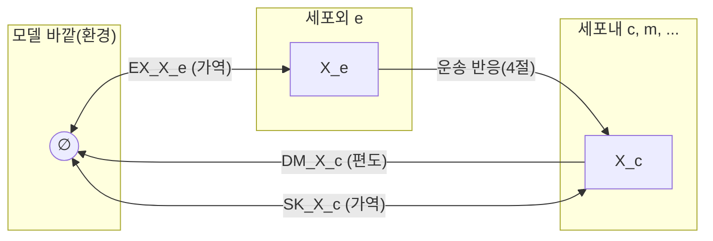

# 5. 경계 반응: Exchange, Demand, Sink

## 5.1 Exchange 반응과 배지 조성

[Chapter 2](../chapter-2/README.md)에서 살펴본 대로, **교환 반응(Exchange Reaction)**은 세포외(`e`) 대사물과 모델 바깥(환경)을 잇는 의사-반응(pseudo-reaction)입니다.

$$\text{glc\_\_D\_e} \rightleftharpoons \emptyset$$

이 반응(`EX_glc__D_e`)의 하한(lower bound)을 음수로 설정하면 해당 대사물의 흡수를 허용하고, 0으로 고정하면 흡수를 차단합니다. 즉 **교환 반응의 bounds 조합이 곧 배지 조성(성장 조건)을 정의**합니다.

| 조건 | `EX_glc__D_e` lb | `EX_o2_e` lb | 의미 |
|:---|:---:|:---:|:---|
| 호기적 포도당 최소 배지 | −10 | −20 | O$$_2$$와 포도당 모두 존재 |
| 무산소적 포도당 배지 | −10 | 0 | O$$_2$$ 없음, 발효 |
| 호기적 아세테이트 배지 | 0 | −20 | 아세테이트만 탄소원 |
| 기아 상태 | 0 | 0 | 성장 불가 |

*Table 5.1: 교환 반응 bounds 설정에 따른 성장 조건 정의. 이 표는 모델의 "가상 실험" 조건을 설정하는 표준적인 방법을 보여줍니다.*

## 5.1b 부호 규약(Sign Convention): 왜 흡수는 음수인가

교환 반응의 화학량론은 언제나 다음과 같은 형식으로 쓰입니다 — 세포외 대사물이 반응물(계수 $$-1$$)이고, 아무것도 생성물로 남지 않는(공집합 $$\emptyset$$) 편도 반응입니다.

$$
\text{glc\_\_D\_e} \rightarrow \emptyset, \qquad v_{\text{EX\_glc\_\_D\_e}} \text{의 부호가 곧 흐름의 방향}
$$

[Chapter 2](../chapter-2/README.md)에서 배운 것처럼 플럭스 $$v_j$$가 양수이면 반응식이 쓰인 방향(왼쪽→오른쪽, 즉 세포 밖으로 나감)으로 반응이 일어난다는 뜻입니다. 그런데 교환 반응에서 "세포 밖으로 나간다"는 것은 곧 **세포가 그 대사물을 소비하지 않고 내보낸다**는 뜻이므로, 세포가 그 대사물을 **흡수(uptake)**하려면 플럭스가 **음수**여야 합니다. 이 부호 규약을 표로 정리하면 다음과 같습니다.

| $$v_{\text{EX\_}X}$$의 부호 | 의미 | 예 |
|:---:|:---|:---|
| $$v < 0$$ | 세포가 $$X$$를 배지에서 **흡수** | $$v_{\text{EX\_glc\_\_D\_e}} = -10$$: 포도당을 10 mmol/gDW/h로 흡수 |
| $$v > 0$$ | 세포가 $$X$$를 배지로 **분비** | $$v_{\text{EX\_ac\_e}} = +5$$: 아세트산을 5 mmol/gDW/h로 분비 |
| $$v = 0$$ | 순수 교환 없음(정확히 균형) | 흡수도 분비도 일어나지 않음 |

*Table 5.1b: 교환 반응 플럭스 부호와 흡수/분비의 대응. lb를 음수로 열어 두는 것은 "이 대사물을 최대 이만큼까지 흡수할 수 있다"는 상한을 음의 방향으로 설정하는 것과 같습니다.*

이 때문에 5.1절 Table 5.1의 `EX_glc__D_e` lb $$= -10$$은 "포도당을 최대 10 mmol/gDW/h까지 흡수할 수 있다"는 뜻이며, ub는 흔히 $$+1000$$ 같은 큰 수로 열어 두어 분비(예: 대사가 과도하면 여분의 포도당을 다시 내보내는 극단적 상황)도 이론적으로 막지 않습니다. 여기서 $$\pm 1000$$은 물리적으로 정확한 값이 아니라 "사실상 무제한(effectively unbounded)"을 뜻하는 소프트웨어 관례이며, 실제 세포가 시속 1000 mmol/gDW/h를 흡수할 수 있다는 뜻이 아닙니다.


❓ **흔한 오해:** "교환 반응의 bounds를 (0, 1000)처럼 lb를 0으로 두면 그 대사물을 완전히 무시하는 것"이라고 생각하기 쉽지만, 정확히는 **"분비만 허용하고 흡수는 차단한다"**는 뜻입니다. 반대로 그 대사물을 모델에서 아예 존재하지 않는 것처럼 취급하려면 lb와 ub를 **모두 0**으로 고정해야 합니다. 5.1절 Table 5.1의 "기아 상태" 행이 바로 이 경우입니다.


## 5.2 Demand 반응과 Sink 반응

교환 반응은 항상 세포외(`e`) 구획의 대사물을 대상으로 하지만, 때로는 **세포 내부** 대사물에 대해서도 경계 조건이 필요합니다. 이를 위한 두 가지 반응이 **요구 반응(Demand Reaction)**과 **싱크 반응(Sink Reaction)**입니다.

> **핵심 개념 · 용어(English):** **요구 반응(Demand, `DM_`)**은 세포 내부 대사물을 모델 밖으로 비가역적으로 제거하는 반응이며, **싱크 반응(Sink, `SK_`)**은 동일한 역할을 가역적으로 수행하는 반응입니다. 둘 다 교환 반응과 함께 **경계 반응(Boundary Reaction)**으로 묶이며, COBRApy에서는 `reaction.boundary` 속성으로 구분됩니다.

| 반응 유형 | ID 접두사 | 방향성 | 대상 구획 | 주요 용도 |
|:---|:---:|:---|:---:|:---|
| Exchange | `EX_` | 보통 가역 | 세포외(`e`) | 배지 조성·환경과의 교환 정의 |
| Demand | `DM_` | 비가역(배출만) | 세포내(`c`, `m` 등) | 특정 대사물의 최대 생산 능력 테스트, 바이오매스에 포함되지 않은 최종 산물 배출 |
| Sink | `SK_` | 가역 | 세포내(`c`, `m` 등) | 아직 완전히 알려지지 않은 합성·분해 경로를 임시로 대체하는 소스/싱크 |

*Table 5.2: Exchange·Demand·Sink 반응의 비교.*

> 🤔 **잠깐, 생각해보기:** Demand와 Sink는 둘 다 "세포 내부 대사물의 경계 조건"이라 헷갈리기 쉽습니다. 핵심 차이는 딱 하나 — **방향성**입니다. Demand는 한쪽 방향(배출)만 열려 있는 "일방통행 배수구"이고, Sink는 양방향이 모두 열려 있는 "임시 수도꼭지 겸 배수구"입니다. 만약 어떤 보조인자가 모델에 완전한 합성 경로 없이도 다른 반응에 공급되어야 한다면, 어느 쪽을 써야 할까요? 답: 공급도 받고 배출도 해야 하므로 **Sink**를 씁니다(5.2절 표의 heme 예시).

Demand 반응은 특정 대사물이 정상상태에서 **생산 가능한지와 최대 생산 flux가 얼마인지** 확인하는 테스트용 배출구로 흔히 쓰입니다. 그 flux를 농도나 축적량으로 해석해서는 안 됩니다. Sink 반응은 헴(heme)이나 특정 보조인자처럼, 전체 합성 경로가 모델에 포함되어 있지 않지만 다른 반응들이 반드시 이 대사물을 필요로 할 때, 그 결핍을 임시로 메워 모델이 작동하도록 하는 "임시방편" 역할을 합니다 — 따라서 근거 없는 sink가 많다는 것은 재구축이 아직 불완전할 수 있다는 신호입니다. 이 신호를 체계적으로 진단하는 gap-filling 절차는 [Chapter 5](../chapter-5/README.md)에서 다룹니다.



*Figure 5.1: Exchange·Demand·Sink 반응의 위치 비교. Exchange는 세포외(`e`) 대사물만을, Demand·Sink는 세포내 대사물을 대상으로 하며 화살표 방향이 곧 가역성을 나타냅니다.*

## 5.3 COBRApy의 경계 반응 분류

COBRApy는 모델 객체에서 이 세 종류의 경계 반응을 각각 별도의 속성으로 조회할 수 있게 해줍니다.

```python
print(f"Exchange 반응 수: {len(model.exchanges)}")
print(f"Demand 반응 수:   {len(model.demands)}")
print(f"Sink 반응 수:     {len(model.sinks)}")

# 경계 반응(boundary reaction) 여부는 개별 반응에서도 확인 가능
rxn = model.reactions.get_by_id("EX_glc__D_e")
print(rxn.boundary)   # True
```

## 5.4 경계 반응과 정상상태 가정의 관계

[Chapter 2](../chapter-2/README.md)에서 정상상태 가정은 $$\mathbf{S}\mathbf{v} = \mathbf{0}$$, 즉 **모든** 대사물에 대해 생성 속도와 소비 속도가 정확히 같다는 것이었습니다. 그런데 세포외 대사물(`_e`)은 얼핏 보면 이 규칙에서 예외처럼 보입니다 — 포도당은 배지에서 끊임없이 사라지는데, 그 무엇으로도 다시 채워지지 않기 때문입니다. 모순처럼 보이지만, 실제로는 모순이 아닙니다. 교환 반응 자체가 $$\mathbf{S}$$의 한 열로 명시적으로 포함되어 있으므로, `glc__D_e`라는 대사물의 정상상태 균형식은 다음과 같이 정확히 성립합니다.

$$
\underbrace{v_{\text{PTS}}}_{\text{세포 안으로 소비}} = \underbrace{-v_{\text{EX\_glc\_\_D\_e}}}_{\text{배지에서 공급되는 양}}
$$

즉 "배지가 무한한 저장고 역할을 한다"는 가정 자체를 교환 반응이라는 **하나의 화학량론 열**로 명시적으로 인코딩한 것이며, $$\mathbf{S}\mathbf{v}=\mathbf{0}$$은 세포외 대사물에 대해서도 여전히 정확히 성립합니다. 다만 그 "생성"의 원천이 모델 내부 반응이 아니라, 모델 바깥의 무한 저장고(환경)라는 점이 다를 뿐입니다.

**손으로 확인하는 배지 전환 예제**: 5.1절 Table 5.1의 "호기적 포도당 최소 배지"에서 "무산소적 포도당 배지"로 바꾸는 것은, 오직 `EX_o2_e`의 bounds 하나만 바꾸는 구조적 조작입니다.

| 단계 | 조작 | $$\mathbf{S}$$ 자체는? |
|:---|:---|:---|
| 1 | `EX_o2_e`의 $$v^{lb}$$를 $$-20$$에서 $$0$$으로 변경 | 변하지 않음(bounds만 변경) |
| 2 | 다른 모든 exchange bounds는 그대로 유지 | 변하지 않음 |
| 3 | [Chapter 4](../chapter-4/README.md)의 FBA LP를 재최적화 | $$\mathbf{S}$$는 고정, $$v$$만 다시 계산 |

*Table 5.3: 배지 조건 전환의 구조적 본질. 화학량론 행렬 $$\mathbf{S}$$ 자체는 세포의 고정된 "설계도"이므로 절대 바뀌지 않으며, 오직 경계 반응의 bounds 벡터만 바뀝니다 — "다른 배지에서 키운다"는 것은 새로운 모델을 만드는 것이 아니라, 같은 모델에 다른 bounds를 대입하는 것입니다.*

> 🤔 **잠깐, 생각해보기:** 만약 실수로 `EX_o2_e`의 $$v^{lb}$$뿐 아니라 $$v^{ub}$$까지 0으로 고정해 버리면 어떻게 될까요? 답: Table 5.1b의 규약에 따르면 이는 산소의 흡수(lb)와 분비(ub)를 모두 차단하는 것이므로, 산소는 아예 이 시뮬레이션에 존재하지 않는 것과 같아집니다. 다만 산소는 원래 세포 안에서 생성되지 않고 소비만 되므로(`o2_e`가 대개 오직 흡수만 일어남), 실무에서는 이 실수가 종종 무산소 조건과 똑같은 결과를 내어 발견되지 않고 넘어가는 경우가 있습니다 — bounds를 항상 의도한 대로 정확히 설정했는지 점검하는 습관이 중요합니다.

이렇게 정의된 bounds가 실제로 어떤 성장률과 플럭스 분포를 만들어 내는지는 [Chapter 4. Flux Balance Analysis](../chapter-4/README.md)에서 선형계획법으로 직접 계산합니다.

---
