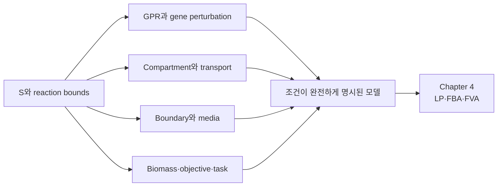

# 7. 구조 요소의 통합과 비교

GEM의 규모와 구조는 생물종의 복잡성만으로 정해지지 않는다. 어떤 범위로 재구축했는지(reconstruction scope), 구획을 어떻게 정의했는지(compartment definition), 경계 반응을 어떤 규약으로 넣었는지(boundary convention), 그리고 릴리스 이력(release history)도 함께 영향을 준다. 따라서 ‘원핵 모델’과 ‘진핵 모델’의 보편적 반응 비율을 제시하기보다, 정확한 model release를 지정하고 동일한 계산 정의로 비교해야 한다.

## 7.1 비교 전 고정할 정의

| 항목 | 필요한 정의 |
|:---|:---|
| Reaction count | exchange·demand·sink·biomass 포함 여부 |
| Metabolite count | unique chemical인지 compartment-specific species인지 |
| Compartment count | extracellular space와 boundary pseudo-compartment 포함 여부 |
| Transport reaction | 여러 compartment의 metabolite를 포함하는 구조 기준인지, subsystem annotation 기준인지 |
| GPR category | no GPR, single, OR-only, AND-only, mixed를 상호 배타적으로 정의했는지 |
| Gene count | locus, ORF, transcript 또는 protein isoform 가운데 무엇인지 |

같은 모델에서도 정의를 바꾸면 비율이 달라진다. 예를 들어 mixed GPR을 OR category와 AND category에 동시에 세면 합계가 전체 반응 수를 초과한다. 여러 compartment에 걸친 반응 수는 subsystem 이름에 `transport`가 있는 반응 수와 같지 않을 수 있다.

## 7.2 COBRApy 0.30.0 모델 스냅샷

다음 표는 `cobra.io.load_model()`이 제공한 두 *E. coli* 모델을 동일 코드로 집계한 회귀 스냅샷이다. 모델 artifact, 패키지 버전, parser와 집계 규칙을 고정하지 않으면 같은 수치를 비교 기준으로 사용하지 않는다.

| 항목 | `textbook` (`e_coli_core`) | `iML1515` |
|:---|---:|---:|
| Reactions | 95 | 2,712 |
| Metabolites | 72 | 1,877 |
| Genes | 137 | 1,516 |
| Compartments | 2 (`c`, `e`) | 3 (`c`, `p`, `e`) |
| Boundary reactions | 20 | 337 |
| Multi-compartment, non-boundary reactions | 25 | 833 |
| No GPR | 26 | 446 |
| Single-gene GPR | 27 | 1,302 |
| OR-only GPR | 27 | 651 |
| AND-only GPR | 10 | 221 |
| Mixed AND/OR GPR | 5 | 92 |

*Table 3.12. COBRApy 0.30.0의 `textbook`과 `iML1515` snapshot. Boundary는 `model.boundary`, transport proxy는 boundary가 아니면서 `len(reaction.compartments)>1`인 반응으로 정의했다. GPR은 [COBRApy](https://opencobra.github.io/cobrapy/) AST에서 AND·OR node를 검사해 상호 배타적으로 분류했다. 이 수치는 model release와 operational definition의 회귀 기준이다.*

`textbook` 모델에서 OR-only는 전체 반응의 $$27/95$$이지만 [GPR](02.md)이 있는 반응만 분모로 두면 $$27/69$$이다. 분모를 생략한 ‘OR 비율’은 비교할 수 없다. iML1515에서도 같은 이유로 651 OR-only reactions와 92 mixed reactions를 분리한다.

## 7.3 미생물과 인체 모델을 비교할 때의 제한

iML1515 논문판은 1,516 genes, 2,712 reactions 및 1,877 metabolites를 보고한다. Human1 논문판은 3,625 genes, 13,417 reactions 및 10,138 compartment-specific metabolites를 보고한다. 이 차이에는 인간의 organelle compartmentation, isoenzyme·complex curation 및 통합된 reconstruction scope가 반영된다. 그러나 다음 이유로 단순 배수만으로 생물학적 복잡성을 결론 내릴 수 없다.

- Human1의 metabolite 수는 compartment-specific species 기준이다.
- 모델마다 boundary와 pseudo-reaction 집계가 다를 수 있다.
- Human1은 여러 세포 유형에서 지지된 generic reconstruction이며 한 세포의 활성 반응 집합이 아니다.
- 미생물 모델도 strain, media 및 growth state에 따라 context-specific subset이 달라진다.

출처: [iML1515](https://doi.org/10.1038/nbt.3956), [Human1](https://doi.org/10.1126/scisignal.aaz1482).

## 7.4 Biomass와 maintenance의 모델별 차이

COBRApy 0.30.0 스냅샷에서 보고된 `textbook` 모델의 `ATPM` lower bound 8.39와 iML1515의 6.86은 모델 convention상 $$\mathrm{mmol\ ATP\ gDW^{-1}\ h^{-1}}$$ 단위를 갖는 회귀 스냅샷 값이다. 이 값은 같은 생물종이라도 model release와 calibration에 따라 다를 수 있다. 다른 문헌의 NGAM을 모델 파일에 직접 대입하려면 배양 조건과 ATP maintenance 정의가 일치하는지 확인한다.

`textbook` biomass reaction의 ATP coefficient는 −59.81이다. 그러나 biomass reaction에서 ATP는 growth-associated hydrolysis뿐 아니라 구성 성분 또는 다른 집계 항에 관여할 수 있다. 따라서 임의 모델의 `atp_c` coefficient 하나를 곧바로 GAM으로 보고하지 않는다. ATP, H$$_2$$O, ADP, phosphate, H$$^+$$의 묶음과 biomass formulation 문서를 함께 확인한다.

## 7.5 구조에서 최적화 문제로

*그림 3.3. GEM 구조 요소가 조건별 최적화 문제로 결합되는 과정. 화살표는 필요한 입력의 결합을 뜻하며, 한 파일이나 한 목적함수만으로 생물학적 예측이 자동 승인된다는 뜻이 아니다. 저자 작성 Mermaid 모식도이며 실제 모델 계산 결과가 아니다. 개념 근거: 구조 요소의 재구축 정의는 [Thiele and Palsson (2010)](https://doi.org/10.1038/nprot.2009.203), $$\mathbf S$$·bounds·목적함수를 선형계획으로 결합하는 절차는 [Orth et al. (2010)](https://doi.org/10.1038/nbt.1614)을 따랐다.*

[FBA](../chapter-4/README.md) 입력은 ‘SBML 파일 하나’가 아니라 model release, objective, [media](05.md), reaction bounds, maintenance 및 perturbation의 조합이다. 이 장의 구조 검사는 Chapter 4의 최적화 결과를 해석하기 위한 전제이며, 같은 구조에서도 조건이 달라지면 feasible set과 목적값이 달라진다.

---
