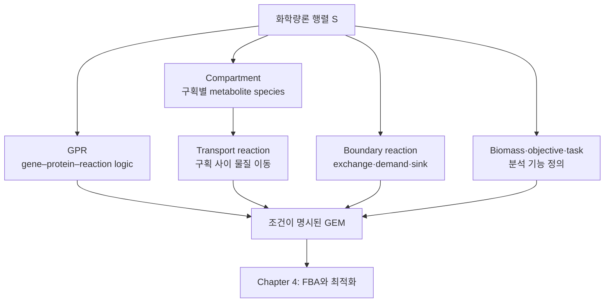

# Chapter 3. 게놈 규모 대사 모델의 구조

[화학량론 행렬](../chapter-2/README.md) $$\mathbf S$$는 반응에서 대사산물이 소비·생성되는 비율을 표현한다. 그러나 $$\mathbf S$$만으로는 어떤 유전자가 반응을 가능하게 하는지, 반응이 어느 세포 구획에서 일어나는지, 환경과 어떤 물질을 교환하는지 또는 분석에서 어떤 기능을 최적화할지 알 수 없다. GEM은 이러한 정보를 [GPR](../glossary.md), [compartment](../glossary.md), transport·boundary reaction, [flux bound](../chapter-2/README.md) 및 [objective](../chapter-4/README.md) 또는 [metabolic task](../glossary.md)로 결합한다.

이 장은 모델 파일의 구조와 생물학적 의미를 구분해 설명한다. GPR은 효소 활성의 양을 직접 나타내지 않고 유전자 가용성과 반응 가능성의 Boolean 관계를 나타낸다. Compartment label은 화학적으로 구별된 metabolite species를 만든다. [Boundary reaction](../glossary.md)은 system boundary를 정의하며, [biomass reaction](../glossary.md)은 세포의 ‘목적’ 자체가 아니라 성장 분석에 사용하는 조성 기반 pseudo-reaction이다.

SBML Level 3 FBC와 [COBRApy](https://opencobra.github.io/cobrapy/) round-trip 저장은 [SBML 실무 보충](../supplements/sbml-practical.md)에서 다룬다.

## 표기와 읽기 원칙

이 책은 한국어 용어를 먼저 쓰고, 처음 등장할 때 영어 원어와 약어를 함께 표기한다. 이후에는 같은 장 안에서 한 표기를 일관되게 사용한다.

- **플럭스**(flux; 대사 통량), **반응**(reaction), **대사물**(metabolite)은 각각 단위 시간당 반응 진행률, 화학량론적 변환, 구획을 포함한 화학종을 뜻한다.
- **경계조건**(bounds), **목적함수**(objective function), **솔버**(solver)는 생물학적 사실이 아니라 모델에 부여한 계산 조건이다.
- 조건·가정·절차는 번호 목록으로, 결과의 범위와 예외는 `해석상의 주의` 상자로 구분한다.


본문의 “예측”은 명시된 모델·배지·경계조건·목적함수 아래의 계산 결과다. 실험 관찰이나 인과적 효과와 혼용하지 않는다.


## 구조 요소의 관계

*Figure 3.1: 화학량론 행렬에 결합되는 GEM의 구조 요소. Biomass 반응이 사용하는 구획은 모델 formulation에 따라 다르며, 여러 구획의 전구체를 반드시 직접 소비하는 것은 아니다. 저자 작성.*

## 장 구성

| 절 | 주제 | 핵심 구분 |
|:---|:---|:---|
| §1 | GEM의 범위와 규모 | 모델명·release·집계 기준 |
| §2 | GPR | complex AND, isoenzyme OR, mixed rule |
| §3 | Compartment | 동일 화합물과 구획별 species |
| §4 | Transport | uniport·symport·antiport와 수동·능동 수송 |
| §5 | Boundary reaction | exchange·demand·sink 및 system boundary |
| §6 | Biomass와 maintenance | BOF, GAM, NGAM 및 단위 |
| §7 | 구조 통합 | 검증 가능한 모델 anatomy |
| Lab | COBRApy 구조 검사 | AST 기반 GPR, 구획, boundary, BOF |

## 선수 지식

- 반응식에서 화학량론 계수를 구성하는 방법
- $$\mathbf S\mathbf v=0$$의 pseudo-steady-state 의미
- reaction flux의 부호, bound 및 단위

이 내용은 [Chapter 2](../chapter-2/README.md)에서 다룬다.

## 대화형 도해: 핵심 가정과 결과 해석


아래 도해는 **교육용 개념·모의 데이터**를 조작하여 이 장의 핵심 가정과 해석 범위를 확인하는 보조 자료이다. 실제 GEM 결과로 인용할 수 없으며, 실제 계산은 모델 버전·배지·목적함수·solver·허용오차를 고정한 실습 코드로 재현해야 한다.




[새 창에서 대화형 도해 열기](https://jyryu3161.github.io/ebook_metabolic_modeling/interactive/index.html?chapter=3)

대화형 조작은 GitBook 지면이 아니라 위 링크(또는 Jupyter)에서 작동한다.

## 이 장을 읽는 방법

게놈 규모 대사모델(GEM)은 행렬만으로 완성되지 않는다. 이 장에서는 반응에 **생물학적 정체성**을 부여하는 다섯 요소를 분리해서 읽는다.

1. GPR은 유전자 산물과 반응의 가능한 연결을 나타낸다.
2. 구획과 [수송 반응](../glossary.md)은 같은 대사물의 위치와 이동을 표현한다.
3. [교환](../glossary.md)·[요구](../glossary.md)·[싱크](../glossary.md) 반응은 모델과 환경의 경계를 정의한다.
4. 바이오매스 반응과 목적함수는 계산이 무엇을 선호할지 정한다.


GPR의 AND/OR 논리는 효소량, 약물 농도, 부분 기능 저하를 직접 표현하지 않는다. 유전자 결손 결과를 약물 효과로 곧바로 번역해서는 안 된다.


## 학습 목표

이 장을 마치면 다음을 수행할 수 있다.

1. 중첩된 GPR을 구문 트리로 해석하고 단일·OR-only·AND-only·mixed rule을 구분한다.
2. 유전자 결손 집합이 주어졌을 때 GPR의 Boolean 결과와 반응 bound의 변화를 계산한다.
3. 구획별 metabolite species와 transport reaction을 $$\mathbf S$$에 표현한다.
4. Uniport, symport 및 antiport를 방향과 coupling species로 구분한다.
5. Exchange, demand 및 sink reaction의 역할과 bound가 system boundary에 미치는 영향을 설명한다.
6. Biomass coefficient의 단위와 polymer residue convention을 확인하고 GAM과 NGAM을 구분한다.
7. COBRApy 모델에서 GPR, compartment, boundary reaction, objective 및 maintenance를 조회하고 변경 누출 없이 시험한다.

---
