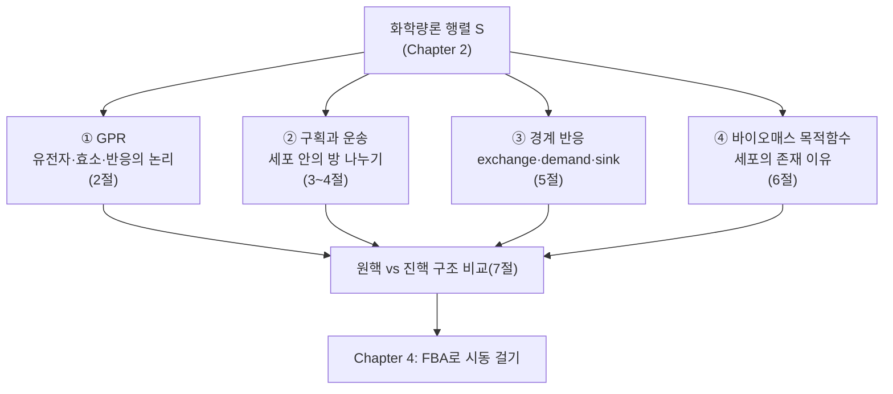

# Chapter 3. Genome-scale Metabolic Model (GEM)의 구조

> 이 장에서는 화학량론 행렬 $$\mathbf{S}$$ 위에 유전자·구획·경계·목적함수라는 "생물학적 정체성"을 입혀, GEM을 이름 그대로 **살아있는 세포를 흉내 내는 계산 가능한 모델**로 완성합니다.


이 구조를 파일로 저장하는 XML 계층, SBML Level 3 FBC, COBRApy 왕복 저장 검증은 [SBML 실무 보충](../supplements/sbml-practical.md)에서 이어집니다.


## 이 장을 시작하며

잠깐 상상해 봅시다. [Chapter 2](../chapter-2/README.md)에서 만든 화학량론 행렬 $$\mathbf{S}$$를 여러분에게 건네주고 "이걸로 대장균이 자랄지 예측해 보세요"라고 하면, 여러분은 무엇부터 물어봐야 할까요?

- 이 반응을 실제로 수행하는 효소가 세포 안에 있나요? 그 효소를 만드는 유전자가 살아있나요?
- 이 반응은 세포의 어느 "방(구획)"에서 일어나나요? 세포질인가요, 막 바깥인가요?
- 세포가 배지에서 무엇을 흡수하고 무엇을 내보내나요? (즉, 이 세포는 지금 무엇을 "먹고" 있나요?)
- 그리고 무엇보다 — 이 반응들이 다 모여서 결국 **무엇을 만들기 위해** 존재하나요?

[Chapter 2](../chapter-2/README.md)의 $$\mathbf{S}$$는 이 질문들 중 어느 것에도 답하지 못합니다. $$\mathbf{S}$$는 오직 "무엇이 무엇으로 바뀌는가"라는 화학량론만 담을 뿐, **유전자·위치·환경·목적**이라는 정보가 통째로 빠져 있기 때문입니다. 실제 GEM 파일(SBML)을 열어보면 $$\mathbf{S}$$ 이외에도 이 네 가지 질문에 답하는 부가 정보 — **GPR 규칙**, **구획(compartment)**, **경계 반응(exchange/demand/sink)**, **바이오매스 목적함수** — 가 반드시 함께 붙어 있습니다. 이 장에서는 이 네 요소를 하나씩 뜯어보며, $$\mathbf{S}$$라는 뼈대에 살을 붙이는 방법을 배웁니다.

자동차에 비유하면 이해가 더 쉬워집니다. [Chapter 2](../chapter-2/README.md)의 $$\mathbf{S}$$는 "어떤 부품이 어떤 부품과 맞물리는가"를 나타내는 순수한 설계도(blueprint)와 같습니다. 하지만 설계도만으로는 차가 굴러가지 않습니다 — 어느 부품이 지금 실제로 장착되어 있는지(GPR), 엔진룸과 트렁크가 어떻게 나뉘어 있는지(구획), 주유구로 무엇을 넣고 배기구로 무엇을 내보내는지(경계 반응), 그리고 이 모든 부품이 궁극적으로 무엇을 위해 존재하는지(바이오매스, 즉 "달리기 위해")가 정해져야 비로소 "차"가 됩니다. 이 장을 마치면 여러분의 $$\mathbf{S}$$는 더 이상 종이 위의 설계도가 아니라, 시동을 걸 준비가 된 하나의 완성차가 되어 있을 것입니다. 그 시동을 실제로 거는 방법([FBA](../chapter-4/README.md))은 다음 장의 몫입니다.

## 이 장의 네 기둥과 지도

이 장은 서로 맞물린 네 개의 절 묶음으로 구성됩니다. 아래 그림은 각 기둥이 $$\mathbf{S}$$ 위에 어떻게 얹히는지, 그리고 이 장 안의 어느 절에서 자세히 다루는지를 한눈에 보여줍니다.

*Figure 0.1: 이 장의 구조 지도. 네 기둥은 서로 독립적이지 않습니다 — GPR은 구획별로 다른 아이소자임을 가질 수 있고(2·3절), 운송 반응은 두 구획을 잇는 특수한 GPR을 가지며(4절), 바이오매스 반응은 여러 구획의 전구체를 동시에 소비합니다(6절).*

| 절 | 다루는 구조 요소 | 핵심 질문 |
|:---:|:---|:---|
| 1절 | 도입 · 규모의 역사 | 왜 인체 GEM이 미생물 GEM보다 훨씬 큰가? |
| 2절 | GPR | 어떤 유전자가 이 반응을 가능하게 하는가? |
| 3절 | 구획(Compartment) | 이 반응은 세포의 어느 방에서 일어나는가? |
| 4절 | 운송 반응(Transport) | 방과 방 사이를 무엇이, 어떻게 넘나드는가? |
| 5절 | 경계 반응(Exchange/Demand/Sink) | 세포는 환경과 무엇을 주고받는가? |
| 6절 | 바이오매스 목적함수 | 이 모든 반응은 결국 무엇을 위해 존재하는가? |
| 7절 | 원핵 vs 진핵 종합 비교 | 다섯 요소를 합치면 무엇이 달라지는가? |

*Table 0.1: 이 장의 절별 지도. 이 책 전체에서 반복 사용하는 `e_coli_core` 예제 모델(반응 95·대사물 72·유전자 137)을 기준으로, 각 절의 개념을 iML1515·Recon3D와 대조하며 확인합니다.*

---
## 학습 목표

이 챕터를 마치면 다음을 할 수 있습니다.

1. GPR(Gene-Protein-Reaction) 연관을 AND(효소 복합체)·OR(동위 효소) Boolean 논리로 표현하고, 주어진 유전자 결손 시나리오에 대해 반응이 켜지는지(on) 꺼지는지(off)를 **손으로 직접 계산**할 수 있다.
2. 그람음성 세균 모델의 세포질·주변세포질·세포외 구획과 진핵생물의 다중 구획 구조를 비교하고, 각 구획의 화학적 환경이 왜 다른지 설명할 수 있다.
3. 운송 반응(transport reaction)의 세 가지 메커니즘(확산·촉진확산·능동수송)을 구분하고, 아세포위 국소화(subcellular localization) 예측 도구의 원리를 이해한다.
4. 교환(exchange)·요구(demand)·싱크(sink) 반응의 차이를 구분하고, 이들의 bounds로 배지 조성(성장 조건)을 정의할 수 있다.
5. 바이오매스 목적함수(BOF)의 구성 요소와 계수 계산 방법을 이해하고, GAM/NGAM이 왜 필요한지 설명할 수 있다.
6. 원핵생물 GEM과 진핵생물 GEM의 구조적 차이(anatomy)를 유전자·반응·대사물·구획 수 측면에서 정량적으로 비교하고, COBRApy로 GPR·구획·바이오매스 반응을 직접 조회할 수 있다.

---
