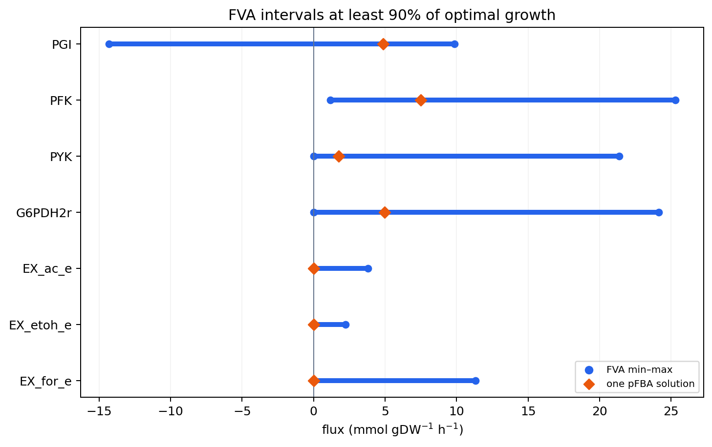

# Chapter 4. Flux Balance Analysis (FBA)

> [Chapter 2](chapter-2..md)~[Chapter 3](chapter-3.-genome-scale-metabolic-model-gem.md)에서 만든 모델(화학량론 행렬 $$\mathbf{S}$$, 플럭스 범위, 바이오매스 목적함수)에는 사실 무한히 많은 플럭스 해가 존재합니다. 이 장에서는 그중 목적 함수를 최적화하는 해를 선형 계획법(Linear Programming, LP)으로 찾는 방법 — **Flux Balance Analysis(FBA, 플럭스 균형 분석)** — 을 손 계산과 코드로 직접 익힙니다. 최적 목적값은 하나여도 그 값을 만드는 플럭스 분포는 여러 개일 수 있습니다.

---

## 이 장을 시작하며

**질문 하나로 시작해봅시다.** [Chapter 2](chapter-2..md)에서 우리는 대장균 코어 모델 `e_coli_core`(대사물 72개, 반응 95개)의 화학량론 행렬 $$\mathbf{S}$$를 만들었고, 정상상태 방정식 $$\mathbf{S}\mathbf{v}=\mathbf{0}$$을 배웠습니다. [Chapter 3](chapter-3.-genome-scale-metabolic-model-gem.md)에서는 여기에 GPR 규칙, 구획, 그리고 "세포가 무엇을 위해 존재하는가"를 인코딩한 바이오매스 반응까지 붙였습니다. 이제 이 완성된 모델에게 "대장균은 포도당 최소배지에서 얼마나 빨리 자랄까?"라고 물으면, 컴퓨터는 어떻게 답을 계산해낼까요?

바로 여기서 곤란한 사실이 등장합니다. $$\mathbf{S}\mathbf{v}=\mathbf{0}$$과 플럭스 범위 제약만으로는 답이 **하나로 정해지지 않습니다.** `e_coli_core`에는 독립 물질수지식보다 반응 변수가 많아, 이 제약을 만족하는 플럭스 벡터 $$\mathbf{v}$$가 무한히 많이 존재합니다. Chapter 2~3에서 정성 들여 만든 모델 안에는 사실 무한히 많은 "가능한 세포"가 숨어 있는 셈입니다. 그렇다면 어떤 기준으로 생물학적으로 의미 있는 최적 집합을 좁힐 수 있을까요?

이 질문에 답하는 계산 기법이 바로 이 장의 주제, **FBA(Flux Balance Analysis)**입니다. FBA는 "세포는 특정 목적(대개는 빠른 성장)을 최대화하도록 진화했다"는 가정을 하나 더 얹어 최적 목적값과 그 값을 달성하는 플럭스 해를 계산합니다. 솔버는 한 벡터를 반환하지만 대안 최적해가 존재할 수 있습니다. 이 장을 마치면 여러분은 계산 원리를 손으로 검산하고 COBRApy로 실행할 수 있게 됩니다.

---

## 학습 목표

이 장을 마치면 다음을 할 수 있습니다.

1. FBA의 세 가지 기본 가정(의사정상상태, 플럭스 제약, 최적화 원리)을 설명하고, 이들이 결합되어 선형 계획법(LP) 문제가 되는 과정을 서술할 수 있다.
2. FBA를 $$\max \mathbf{c}^\mathsf{T}\mathbf{v}$$ subject to $$\mathbf{S}\mathbf{v}=\mathbf{0}$$, $$\mathbf{v}^{lb} \le \mathbf{v} \le \mathbf{v}^{ub}$$ 형태로 정확히 작성할 수 있다.
3. 작은 장난감 네트워크에서 가능 영역을 손으로 그리고, 비어 있지 않은 bounded polytope에서는 적어도 하나의 최적 꼭짓점이 존재한다는 사실을 검증할 수 있다.
4. 플럭스 원추(Flux Cone)와 플럭스 폴리토프(Flux Polytope)의 기하학적 의미를 설명할 수 있다.
5. 경사하강법과 LP의 문제 구조를 구분하고, 심플렉스법(Simplex Method)과 내점법(Interior-Point Method)의 원리·차이를 비교하며, COBRApy에서 솔버를 설정할 수 있다.
6. 쌍대 문제(Dual Problem)로부터 그림자 가격(Shadow Price)과 환원비용(Reduced Cost)을 손으로 계산·해석하고, 강건성 분석·표현형 상 평면(PhPP)과 연결할 수 있다.
7. COBRApy로 `e_coli_core`에 FBA를 실행하고, 목적함수와 배지 조건(호기/혐기)을 바꿔가며 결과를 해석할 수 있다.
8. pFBA와 FVA를 실행하여 대안 최적해(Alternate Optima)를 진단하고, 반응을 유연함/목표 유지에 필요함/차단됨으로 구분할 수 있다.
9. FBA의 구조적 한계(열역학, 동역학, 조절, overflow 대사 등)를 인지하고, 대안 기법이 어느 장으로 이어지는지 설명할 수 있다.

---

## 1. FBA란 무엇인가: 세 가지 가정과 직관

### 1.1 과소결정계 문제, 다시 보기

`e_coli_core` 모델은 대사물 $$m=72$$개, 반응 $$n=95$$개로 구성됩니다([Chapter 2](chapter-2..md)). 정상상태 방정식 $$\mathbf{S}\mathbf{v}=\mathbf{0}$$은 대사물마다 한 행을 제공하지만, 72개 행이 모두 선형 독립인 것은 아닙니다. 실제 `textbook` 모델에서 $$\operatorname{rank}(\mathbf{S})=67$$이고 미지수(반응 플럭스)는 95개입니다.

> **핵심 개념 · 용어(English):** **과소결정계(Underdetermined System)** — 미지수의 개수($$n$$)가 독립 방정식의 개수($$\operatorname{rank}(\mathbf{S})$$)보다 많아서, 주어진 등식 제약만으로는 해가 유일하게 정해지지 않는 연립방정식.

따라서 영공간의 차원(nullity)은 $$n-\operatorname{rank}(\mathbf{S})=95-67=28$$입니다. 단순히 $$n-m=23$$으로 계산하면 행 사이의 선형 의존성을 놓칩니다. 이 28차원 영공간에 반응 상·하한을 적용하면 실제 가능한 영역의 차원은 더 낮아질 수 있습니다.

> 🤔 **잠깐, 생각해보기:** 미지수가 독립 방정식보다 많은 일관된 선형계는 왜 하나의 해로 정해지지 않을까요? 예를 들어 $$x+y=10$$은 $$(10,0)$$, $$(3,7)$$ 등 무한히 많은 해를 가집니다. `e_coli_core`도 95개 변수에 독립 물질수지식이 67개뿐입니다. 플럭스 범위를 더하면 가능한 집합이 잘리지만, 일반적으로 여전히 연속적인 영역으로 남습니다.

이 무한한 후보 중에서 "실제로 세포가 선택하는" 하나를 골라내려면 방정식과 부등식만으로는 부족합니다. 여기에 **"세포는 무엇을 위해 이 선택을 할까?"**라는 목적을 하나 추가해야 합니다. 이것이 FBA의 세 번째 가정, 최적화 원리입니다.

### 1.2 FBA의 세 가지 기본 가정

**Flux Balance Analysis(FBA)**는 Savinell과 Palsson의 1992년 플럭스 균형 연구와 Varma·Palsson의 1994년 정량적 성장 예측 연구를 거치며 확립된 방법으로, 대사 네트워크의 **의사정상상태(Pseudo-Steady-State)** 하에서 선형 계획법을 이용해 가능한 통량 분포 중 목적 함수를 최적화하는 해를 찾습니다. FBA는 다음 세 가지 기본 가정 위에 세워집니다.

**가정 1 — 의사정상상태 (Pseudo-Steady-State Assumption)**

세포 내부 대사물의 농도 벡터 $$\mathbf{x}$$가 관심 시간 척도에서 변하지 않는다고 가정합니다.

$$\frac{d\mathbf{x}}{dt} = \mathbf{S}\mathbf{v} = \mathbf{0}$$

대사물의 회전 시간(turnover time)은 보통 수 초~수 분이며, 세포 배양의 관찰 시간 척도(수 시간)보다 훨씬 짧기 때문에, 지수 성장기(Exponential Phase)나 케모스탯(Chemostat) 정상 상태에서는 이 가정이 잘 성립합니다.


❓ **흔한 오해:** "정상상태(steady state)"는 "아무것도 흐르지 않는다"는 뜻이 아닙니다! 정상상태는 대사물의 **농도**가 일정하게 유지된다는 뜻이지, 반응의 **플럭스**가 0이라는 뜻이 아닙니다. 물탱크에 비유하면, 물이 들어오는 속도와 나가는 속도가 정확히 같아서 수위(농도)는 변하지 않지만, 물은 여전히 활발하게 흐르고 있는(플럭스 ≠ 0) 상태입니다. 실제로 `e_coli_core`가 최고 속도로 성장할 때도 수십 개 반응이 초당 수 mmol씩 활발히 흐르고 있습니다 — 단지 각 대사물이 "만들어지는 만큼 정확히 소비되고" 있을 뿐입니다.


**가정 2 — 플럭스 제약 (Flux Constraints)**

모든 반응 플럭스는 열역학적 가역성, 효소 용량, 영양분 가용성 등 물리·화학·환경적 한계를 가집니다.

$$\mathbf{v}^{lb} \le \mathbf{v} \le \mathbf{v}^{ub}$$

**가정 3 — 최적화 원리 (Optimization Principle)**

세포가 특정 목적 함수 $$Z=\mathbf{c}^\mathsf{T}\mathbf{v}$$를 최적화하도록 진화했다고 가정합니다. 가장 널리 쓰이는 목적 함수는 [바이오매스 목적함수](chapter-3.-genome-scale-metabolic-model-gem.md)의 최대화입니다.

> **핵심 개념 · 용어(English):** **Flux Balance Analysis(FBA)** — 의사정상상태, 플럭스 제약, 최적화 원리의 세 가지 가정을 결합하여, 가능한 통량 분포 공간에서 목적 함수를 최대(또는 최소)로 만드는 플럭스 해를 선형 계획법으로 찾는 방법.

세 가정 중 앞의 둘(의사정상상태, 플럭스 제약)은 이미 [Chapter 2](chapter-2..md)~[Chapter 3](chapter-3.-genome-scale-metabolic-model-gem.md)에서 각각 $$\mathbf{S}\mathbf{v}=\mathbf{0}$$과 반응의 `bounds`로 준비해 둔 것들입니다. FBA가 새롭게 더하는 것은 **가정 3, 최적화 원리**입니다. 이 가정은 가능한 해를 최적 집합으로 좁히지만, 그 집합이 반드시 한 점인 것은 아닙니다.

### 1.3 왜 동역학 대신 화학량론인가 — 역사적 맥락

FBA 이전의 전통적 접근인 **동역학 모델(Kinetic Model)**은 각 반응마다 Michaelis-Menten 상수($$K_m$$, $$V_{max}$$)와 같은 효소 동역학 매개변수를 실험적으로 측정해야 했습니다. 그러나 게놈 규모(수천 개 반응)에서 이 모든 매개변수를 측정하는 것은 사실상 불가능합니다. 1990년대 초 Varma와 Palsson은 1947년 George Dantzig가 군수 물류 최적화를 위해 개발한 **심플렉스법(Simplex Method)**의 선형 계획법 프레임워크를 대사 네트워크에 적용했습니다. FBA는 동역학적 세부사항을 포기하는 대신 **네트워크 토폴로지(Network Topology)**와 **화학량론적 제약(Stoichiometric Constraint)**만으로 예측을 수행하며, 이 "매개변수 없음"이라는 특징을 강점으로 전환한 것이 **제약 기반 모델링(Constraint-Based Modeling, CBM)**의 핵심 통찰입니다.

### 1.4 직관적 이해 — 물 수도망의 비유

FBA를 처음 접할 때 가장 도움이 되는 이미지는 도시의 **물 수도망**입니다. 각 반응은 물이 흐르는 파이프, 각 대사물은 물이 모이는 교차로(노드), 플럭스는 파이프 속 물의 흐름 속도입니다.

- **물질수지 제약** $$\mathbf{S}\mathbf{v}=\mathbf{0}$$ 은 "모든 교차로(대사물 노드)에서 유입량과 유출량이 정확히 같아야 한다"는 뜻입니다. 그렇지 않으면 수도망 어딘가가 넘치거나 말라버립니다.
- **플럭스 범위 제약** $$\mathbf{v}^{lb}\le \mathbf{v}\le \mathbf{v}^{ub}$$ 은 각 파이프의 물리적 용량입니다. 어떤 파이프는 일방통행(비가역 반응)이고 어떤 파이프는 양방향(가역 반응)입니다.
- **목적 함수**는 "가능한 한 많은 물을 최종 목적지(바이오매스 반응)까지 흘려보낸다"는 것입니다.

이 비유는 FBA의 강점과 한계를 동시에 보여줍니다. 강점은 네트워크 전체 구조(파이프의 배치)만으로 전역적 흐름 패턴을 예측할 수 있다는 것이고, 한계는 "파이프의 굵기(효소 농도)"나 "수압(대사물 농도)"을 명시적으로 고려하지 않는다는 것입니다 — 이 정보가 필요한 지점에서는 kinetic 모델이나 효소-제약 모델(GECKO 등, [Chapter 9](chapter-9.-ai.md) 참고)이 필요합니다. 이 장 3절에서는 이 수도망을 아주 작은 규모(파이프 3개)로 직접 만들어, 손으로 최적 흐름을 계산해 봅니다.

---

## 2. 선형 계획법(LP)으로서의 FBA: 수학적 정형화

### 2.1 표준형

세 가지 가정을 결합하면 FBA는 다음의 표준 선형 계획법 문제가 됩니다.

$$\begin{aligned}
\max_{\mathbf{v}} \quad & Z = \mathbf{c}^\mathsf{T} \mathbf{v} \\
\text{subject to} \quad & \mathbf{S} \cdot \mathbf{v} = \mathbf{0} \\
& \mathbf{v}^{lb} \le \mathbf{v} \le \mathbf{v}^{ub}
\end{aligned}$$


*그림 4-1. FBA의 목적함수와 세 제약의 관계. 목적값을 최적화하더라도 대안 최적 플럭스 분포가 남을 수 있다.*

| 기호 | 차원 | 의미 |
|:---|:---:|:---|
| $$\mathbf{S}$$ | $$m \times n$$ | 화학량론 행렬 ([Chapter 2](chapter-2..md) 참고) |
| $$\mathbf{v}$$ | $$n \times 1$$ | 반응 플럭스 벡터 (단위: mmol/gDW/h) |
| $$\mathbf{c}$$ | $$n \times 1$$ | 목적 함수 계수 벡터 |
| $$Z$$ | 스칼라 | 목적 함수값 (바이오매스 최대화 시 성장률 $$\mu$$, h$$^{-1}$$) |
| $$\mathbf{v}^{lb}, \mathbf{v}^{ub}$$ | $$n \times 1$$ | 플럭스 하한·상한 |

> **핵심 개념 · 용어(English):** **화학량론 행렬(Stoichiometric Matrix) $$\mathbf{S}$$** — 행은 대사물($$m$$개), 열은 반응($$n$$개)이며, 원소 $$S_{ij}$$는 반응 $$j$$에서 대사물 $$i$$가 소비되면 음수, 생성되면 양수, 참여하지 않으면 0입니다. 구성 원리는 [Chapter 2](chapter-2..md)에서 다룹니다.

**용어 하나씩 뜯어보기:** $$\max_{\mathbf{v}}$$은 "플럭스 벡터 $$\mathbf{v}$$를 조절해서 그 뒤의 식을 최대로 만든다"는 뜻입니다. $$\mathbf{c}^\mathsf{T}\mathbf{v}$$는 벡터 $$\mathbf{c}$$와 $$\mathbf{v}$$의 내적(dot product)으로, $$\sum_j c_j v_j$$를 압축해서 쓴 것입니다. `subject to`(제약 조건 하에서)는 그 뒤의 등식·부등식을 모두 만족해야 한다는 뜻입니다.

### 2.2 과소결정 시스템과 목적 함수의 역할

genome-scale 모델은 대개 반응 수가 독립 물질수지식 수보다 많습니다. 자유도는 $$n-m$$이 아니라 정확히 $$n-\operatorname{rank}(\mathbf{S})$$로 계산해야 합니다. `e_coli_core`는 $$n=95$$, $$\operatorname{rank}(\mathbf{S})=67$$이므로 영공간 차원이 28입니다. 등식 제약 $$\mathbf{S}\mathbf{v}=\mathbf{0}$$만으로는 $$\mathbf{v}$$가 유일하게 정해지지 않는 **과소결정(Underdetermined) 시스템**이며, 목적 함수 $$\mathbf{c}^\mathsf{T}\mathbf{v}$$는 가능한 영역에서 최적 목적값을 정합니다. 다만 같은 최적값을 만드는 플럭스 벡터는 여전히 여러 개일 수 있습니다.

### 2.3 목적 함수 벡터 $$\mathbf{c}$$와 바이오매스 반응

가장 널리 쓰이는 목적 함수는 바이오매스 생성 속도의 최대화입니다.

$$\mathbf{c}^\mathsf{T}\mathbf{v} = v_{\text{bio}}$$

여기서 $$\mathbf{c}$$는 바이오매스 반응에 해당하는 원소만 1이고 나머지는 모두 0인 벡터입니다. COBRApy의 `load_model("textbook")` 모델에서는 이 반응의 ID가 `Biomass_Ecoli_core`입니다([Chapter 2](chapter-2..md) 참고). 바이오매스 반응 자체가 어떻게 구성되는지(아미노산·뉴클레오타이드·지질 조성비, GAM/NGAM 등)는 [Chapter 3](chapter-3.-genome-scale-metabolic-model-gem.md)에서 다루었으므로 이 장에서는 반복하지 않습니다.


💡 **팁:** $$\mathbf{c}$$ 벡터를 "바이오매스 반응 자리만 1이고 나머지는 모두 0인 표준기저벡터(standard basis vector) $$\mathbf{e}_{\text{bio}}$$"라고 생각하면, $$\mathbf{c}^\mathsf{T}\mathbf{v}=v_{\text{bio}}$$라는 사실이 훨씬 쉽게 이해됩니다. 목적 함수를 바꾸고 싶다면(6.3절 참고), 그저 $$\mathbf{c}$$에서 1의 위치를 다른 반응으로 옮기면 됩니다 — COBRApy에서는 `model.objective = 반응이름` 한 줄이 이 작업을 대신해 줍니다.


이 장에서 중요한 것은 바이오매스 반응의 플럭스 $$v_{\text{bio}}$$(단위 h$$^{-1}$$)가 LP를 풀어 얻은 목적 함수값 $$Z^*$$와 정확히 같고, 이 값이 곧 세포의 **특정 성장률(Specific Growth Rate)** $$\mu$$로 해석된다는 점입니다. 예를 들어 $$Z^*=0.874$$ h$$^{-1}$$은 세포 질량이 약 48분($$\ln 2/0.874 \approx 0.79$$시간)마다 두 배가 됨을 의미합니다.

### 2.4 경사하강법과 선형 계획법은 무엇이 다른가

최적화 문제라고 해서 모두 **경사하강법(Gradient Descent)**으로 푸는 것은 아닙니다. 경사하강법은 미분 가능한 목적 함수의 기울기를 계산하고, 학습률(learning rate)만큼 해를 반복해서 이동시키는 방법입니다. 비볼록 목적 함수에서는 도달한 해가 전역 최적해라는 보장이 없을 수 있고, 학습률과 초기값이 수렴 과정에 영향을 줍니다.

반면 FBA는 목적 함수와 제약식이 모두 선형인 **선형 계획법(LP)**입니다. 가능 영역은 선형 등식·부등식이 만드는 볼록 다면체(polyhedron)이므로, 문제가 실행 가능하고 최적값이 유한하면 심플렉스법이나 내점법은 수치 허용오차 안에서 **전역 최적값**을 찾습니다. 기울기를 따라 이동하거나 학습률을 정할 필요가 없습니다.

| 구분 | 경사하강법 | FBA의 선형 계획법 |
|:---|:---|:---|
| 전형적 문제 | 미분 가능한 목적 함수의 연속 최적화 | 선형 목적 함수 + 선형 등식·부등식 제약 |
| 해를 찾는 방식 | 기울기를 따라 반복 갱신 | 심플렉스법의 꼭짓점 탐색 또는 내점법 |
| 조정값 | 학습률, 초기값, 종료 조건 | 솔버 허용오차와 알고리즘 설정; 학습률 없음 |
| 최적성 | 비볼록 문제에서는 국소해에 머물 수 있음 | 실행 가능한 bounded LP에서는 전역 최적값 보장 |
| 해의 유일성 | 문제 구조에 따라 달라짐 | 최적값은 정해져도 최적 플럭스 벡터는 여러 개일 수 있음 |


**전역 최적값을 찾는다는 말은 플럭스 해가 유일하다는 뜻이 아닙니다.** 목적 함수가 가능 영역의 한 면과 평행하면 대안 최적해가 존재합니다. 또한 LP의 **퇴화(degeneracy)**는 한 기본 실행가능해에서 필요한 수보다 많은 제약이 동시에 활성인 성질로, 해의 비유일성과 같은 개념이 아닙니다.


---

## 3. 손으로 풀어보는 장난감 LP — 왜 최적 꼭짓점을 찾을 수 있는가

이론만으로는 "최적해가 꼭짓점에 있다"는 말이 추상적으로 느껴질 수 있습니다. 여기서는 3개의 반응, 1개의 대사물로 이루어진 아주 작은 장난감 네트워크를 만들어, 가능 영역을 실제로 그려보고 최적해를 손으로 찾아보겠습니다.

### 3.1 장난감 대사 네트워크 설계

포도당에서 유래한 중간대사물 $$M$$이 있고, 이 $$M$$을 소비하는 두 개의 병렬 경로가 있다고 합시다 — 실제 대장균에서 포도당이 해당과정(glycolysis)과 Entner-Doudoroff 경로처럼 여러 병렬 경로로 처리되는 상황을 극도로 단순화한 것입니다.

- $$v_0$$: 포도당 흡수 → 대사물 $$M$$ 생성. 포도당 흡수 능력의 한계로 $$0 \le v_0 \le 10$$ (mmol/gDW/h)
- $$v_1$$: $$M$$ → 경로 1(저효율). 효소 용량 한계로 $$0 \le v_1 \le 6$$
- $$v_2$$: $$M$$ → 경로 2(고효율). 효소 용량 한계로 $$0 \le v_2 \le 8$$

두 경로는 흘려보낸 플럭스 1단위당 서로 다른 양의 바이오매스 전구체를 만듭니다: 경로 1은 단위 플럭스당 바이오매스 0.5단위, 경로 2는 0.8단위(예컨대 경로 2가 ATP를 더 효율적으로 뽑아내는 경로라고 생각하면 됩니다).

대사물 $$M$$에서의 물질수지(=$$\mathbf{S}\mathbf{v}=\mathbf{0}$$의 이 장난감 버전)는 "들어온 만큼 나간다"이므로:

$$v_0 - v_1 - v_2 = 0 \quad\Longrightarrow\quad v_0 = v_1+v_2$$

목적함수(바이오매스 최대화, $$\max \mathbf{c}^\mathsf{T}\mathbf{v}$$에 해당)는:

$$\max Z = 0.5\,v_1 + 0.8\,v_2$$

$$v_0$$은 등식에 의해 $$v_1+v_2$$로 완전히 결정되므로(대신 $$v_0 \le 10$$이라는 상한만 남습니다), 이 문제는 실질적으로 자유 변수 2개($$v_1, v_2$$)만 가진 LP가 됩니다.

$$\begin{aligned}
\max \quad & Z=0.5\,v_1+0.8\,v_2\\
\text{s.t.}\quad & v_1+v_2 \le 10 \quad (\because v_0 \le 10)\\
& 0\le v_1\le 6\\
& 0\le v_2\le 8
\end{aligned}$$

### 3.2 가능 영역을 손으로 그려보기

이제 $$(v_1, v_2)$$ 평면 위에 세 제약을 하나씩 그어봅시다. $$v_1\ge0$$, $$v_2\ge0$$은 1사분면으로 한정하고, $$v_1\le6$$은 수직선, $$v_2\le8$$은 수평선, $$v_1+v_2\le10$$은 대각선입니다. 이 네 개의 반평면이 겹치는 영역(파란 오각형)이 가능 영역입니다.


*그림 4.1: 왼쪽에서 주황색 목적함수 선을 값이 커지는 방향으로 평행 이동하면 마지막 접점 $$(2,8)$$이 유일 최적해가 됩니다. 오른쪽처럼 목적함수가 제약 $$v_1+v_2=10$$과 평행하면 굵은 변 전체가 같은 최적값을 갖습니다. 그림은 본 절의 수치로 생성한 기하학 도식이며 실제 GEM의 95차원 polytope를 축소 투영한 결과가 아닙니다.*

가능 영역은 5개의 꼭짓점 $$(0,0)$$, $$(6,0)$$, $$(6,4)$$, $$(2,8)$$, $$(0,8)$$을 가진 오각형입니다. 각 변은 어떤 제약이 "빠듯하게(binding)" 걸려 있는지를 보여줍니다 — 아래쪽 변은 $$v_2=0$$, 오른쪽 변은 $$v_1=6$$, 대각선 변은 $$v_1+v_2=10$$, 위쪽 변은 $$v_2=8$$, 왼쪽 변은 $$v_1=0$$이 각각 빠듯한 경계입니다.

### 3.3 다섯 꼭짓점에서 목적함수 값 계산하기 — 심플렉스가 하는 일을 손으로

이제 각 꼭짓점에서 $$Z=0.5v_1+0.8v_2$$ 값을 손으로 계산해 봅시다.

| 꼭짓점 $$(v_1,v_2)$$ | 빠듯한(binding) 제약 | $$Z=0.5v_1+0.8v_2$$ |
|:---:|:---|:---:|
| $$(0,\ 0)$$ | $$v_1=0,\ v_2=0$$ | $$0.0$$ |
| $$(6,\ 0)$$ | $$v_1=6,\ v_2=0$$ | $$3.0$$ |
| $$(6,\ 4)$$ | $$v_1=6,\ v_1+v_2=10$$ | $$6.2$$ |
| $$\mathbf{(2,\ 8)}$$ | $$v_1+v_2=10,\ v_2=8$$ | $$\mathbf{7.4}$$ ← 최적 |
| $$(0,\ 8)$$ | $$v_1=0,\ v_2=8$$ | $$6.4$$ |

**최적해는 $$(v_1^*, v_2^*) = (2, 8)$$, $$Z^*=7.4$$입니다.** 흥미로운 패턴이 보이시나요? 목적함수 계수가 더 큰(0.8) 경로 2가 자신의 상한(8)까지 완전히 사용되고, 남은 포도당 용량(10−8=2)만 경로 1(계수 0.5)로 흘러갑니다. 이는 실제 FBA가 왜 "더 효율적인 경로를 최대로 활용하고, 남는 자원만 덜 효율적인 경로로 돌리는" 플럭스 분포를 예측하는지 그대로 보여주는 축소판입니다.

> 🤔 **잠깐, 생각해보기:** 가능 영역의 **내부** 점, 예를 들어 $$(3,3)$$에서는 $$Z=3.9$$입니다. 이 예제에서는 왜 꼭짓점 $$(2,8)$$이 최적일까요? — 선형 목적함수의 등고선을 개선 방향으로 평행 이동하면 마지막으로 닿는 가능 영역의 면에 최적해가 놓입니다. 비어 있지 않은 bounded polytope 위의 선형 목적함수에는 적어도 하나의 최적 **극점(extreme point)**이 있습니다. 다만 목적함수가 한 변과 평행하면 그 변의 내부 점도 모두 최적일 수 있으므로 "모든 최적해가 꼭짓점"이라는 뜻은 아닙니다. 심플렉스법은 최적 꼭짓점 하나를 찾습니다.

### 3.4 목적함수를 살짝 바꾸면? — 대안 최적해(Alternate Optima) 미리보기

이번에는 두 경로의 효율이 같다고 가정해 봅시다: $$Z' = 0.5v_1+0.5v_2$$. 같은 다섯 꼭짓점에서 값을 다시 계산하면:

| 꼭짓점 | $$Z'=0.5v_1+0.5v_2$$ |
|:---:|:---:|
| $$(0,0)$$ | $$0$$ |
| $$(6,0)$$ | $$3$$ |
| $$(6,4)$$ | $$\mathbf{5}$$ ← 공동 최적 |
| $$(2,8)$$ | $$\mathbf{5}$$ ← 공동 최적 |
| $$(0,8)$$ | $$4$$ |

이번에는 $$(6,4)$$와 $$(2,8)$$ **두 꼭짓점이 동시에** 최적값 $$5$$를 달성합니다! 사실 이 둘을 잇는 대각선 변(제약 $$v_1+v_2=10$$) 위의 모든 점이 전부 $$Z'=5$$를 만족하는 최적해입니다 — 목적함수의 기울기 벡터 $$(0.5,0.5)$$가 이 변의 방향과 정확히 평행하기 때문입니다.

> **핵심 개념 · 용어(English):** **대안 최적해(Alternate Optima)** — 동일한 최적 목적 함수값을 달성하는 플럭스 분포가 여러 개인 현상. 목적함수의 등고선이 가능 영역의 한 면(face)과 평행하면 그 면 전체가 최적 집합이 될 수 있습니다.


**대안 최적해와 LP 퇴화는 구분해야 합니다.** 엄밀한 최적화 용어에서 **퇴화(degeneracy)**는 한 기본 실행가능해에서 필요한 수보다 많은 제약이 동시에 활성인 성질입니다. 대안 최적해 없이도 퇴화할 수 있고, 대안 최적해가 반드시 퇴화 꼭짓점을 요구하는 것도 아닙니다. GEM 문헌에서 `solution degeneracy`가 비유일성을 가리키는 경우가 있지만, 이 책에서는 정확성을 위해 **대안 최적해**라고 부릅니다.


이 작은 예제는 실제 genome-scale FBA에서 왜 "표준 FBA의 해가 유일하지 않을 수 있는지"를 정확히 보여줍니다. 이 비유일성을 실제로 어떻게 다루는지는 8절(pFBA)과 9절(FVA)에서 바로 이 장난감 예제로 다시 돌아와 살펴봅니다.

### 3.5 일반화: 플럭스 원추(Flux Cone)와 플럭스 폴리토프

방금 손으로 그린 오각형은 사실 실제 genome-scale 모델의 가능 영역을 아주 작게 축소한 것입니다. 이제 이 개념을 일반화해 봅시다.

**플럭스 원추의 정의와 볼록성.** 부호(가역성) 제약만 부과하고 상하한을 무시하면, 가능한 플럭스 벡터의 집합은 다음과 같은 **볼록 다면체 원추(Convex Polyhedral Cone)**를 이룹니다.

$$\mathcal{C} = \{\mathbf{v} \in \mathbb{R}^n : \mathbf{S}\mathbf{v} = \mathbf{0}, \; \mathbf{v} \ge \mathbf{0}\}$$

이를 **플럭스 원추(Flux Cone)**라 부르며, 제약 기반 모델링의 중심 기하학적 대상입니다. 원추는 **볼록(Convex)**합니다 — 두 가능한 벡터 $$\mathbf{v}_1, \mathbf{v}_2 \in \mathcal{C}$$의 볼록 결합 $$\alpha\mathbf{v}_1+(1-\alpha)\mathbf{v}_2$$($$\alpha\in[0,1]$$) 역시 원추 안에 있습니다.

$$\mathbf{S}(\alpha\mathbf{v}_1+(1-\alpha)\mathbf{v}_2) = \alpha\mathbf{S}\mathbf{v}_1+(1-\alpha)\mathbf{S}\mathbf{v}_2 = \mathbf{0}$$

**Extreme Ray와 Extreme Pathway.** 원추는 **익스트림 레이(Extreme Ray)**들로 경계가 지어집니다 — 다른 가능한 벡터들의 볼록 결합으로 표현할 수 없는 벡터입니다. 모든 가능한 플럭스 벡터는 이 익스트림 레이들의 음이 아닌 선형 결합으로 쓸 수 있습니다.

$$\mathbf{v} = \sum_{k} \alpha_k \mathbf{e}_k, \quad \alpha_k \ge 0$$

대사 네트워크에서 익스트림 레이는 **익스트림 경로(Extreme Pathway)**에 대응하며, 이는 네트워크가 가질 수 있는 시스템적으로 독립적인 최소 경로 집합을 의미합니다.

**Flux Polytope: 상하한으로 절단된 원추.** 유한한 상한·하한 $$\mathbf{v}^{lb} \le \mathbf{v} \le \mathbf{v}^{ub}$$을 추가하면, 무한히 뻗어 있던 원추가 **볼록 폴리토프(Convex Polytope)** — 즉 경계가 있는 다면체 — 로 잘립니다. 이 폴리토프가 곧 FBA의 가능 영역 $$\mathcal{F}$$입니다.

$$\mathcal{F} = \{\mathbf{v} \in \mathbb{R}^n : \mathbf{S}\mathbf{v} = \mathbf{0}, \; \mathbf{v}^{lb} \le \mathbf{v} \le \mathbf{v}^{ub}\}$$

3.2절에서 손으로 그린 오각형이 바로 이 $$\mathcal{F}$$의 (자유 변수 2개짜리) 아주 작은 인스턴스입니다. `e_coli_core`에서는 이 폴리토프가 95차원 공간 속에 있어 눈으로 그릴 수는 없지만, **선형 계획법의 기본 정리**는 차원에 상관없이 성립합니다 — 비어 있지 않은 bounded polytope에는 적어도 하나의 최적 **꼭짓점(Vertex)**이 존재하며, 최적 면의 다른 점도 함께 최적일 수 있습니다.

**기하학적 해석의 실용적 의의**

1. **최적화의 효율성** — 가능 영역이 볼록이므로 국소 최댓값이 곧 전역 최댓값입니다. 이 덕분에 심플렉스법이나 내점법으로 게놈 규모 문제도 1초 이내에 풀립니다.
2. **해의 비유일성(Alternate Optima)** — 3.4절에서 손으로 확인했듯, 목적 함수의 등고선이 폴리토프의 한 면(face)과 평행하면 그 면 전체가 최적 집합이 되어 여러 최적해가 동시에 존재할 수 있습니다.
3. **플럭스 가변성** — 각 반응의 가능한 플럭스 범위는 폴리토프를 해당 반응 축으로 투영한 구간이며, 이것이 9절 FVA가 계산하는 대상입니다.

---

## 4. LP를 푸는 법: 심플렉스법과 내점법, 그리고 COBRApy 솔버

### 4.1 심플렉스 알고리즘(Simplex Algorithm)

1947년 George Dantzig가 개발한 심플렉스법은 3.3절에서 확인한 기본 정리를 그대로 활용합니다: 가능 폴리토프의 한 꼭짓점에서 시작해, 목적 함수값을 개선하는 인접 꼭짓점으로 이동하는 것을 반복하다가, 더는 개선할 인접 꼭짓점이 없으면 종료합니다. 3.3절의 장난감 예제에 비유하면, 심플렉스법은 예를 들어 $$(0,0)\to(6,0)\to(6,4)\to(2,8)$$ 순으로 인접 꼭짓점을 옮겨 다니며 $$Z$$가 계속 증가하는 것을 확인하다가, $$(2,8)$$에서 더 이상 개선되는 인접 꼭짓점이 없으므로 멈추는 것과 같습니다.

```
┌──────────────────────────────────────────────────────┐
│              심플렉스 알고리즘의 흐름                  │
│  1. 기본 실행가능해(Basic Feasible Solution) 선택      │
│         ↓                                             │
│  2. 목적 함수 개선 방향 확인                          │
│         ↓                                             │
│  3. 개선되는 인접 꼭짓점이 있는가?                    │
│     Yes → 이동 → 4로                                  │
│     No  → 현재 해가 최적 → 종료                        │
│  4. 새로운 기본 실행가능해로 갱신 → 2로 돌아감         │
└──────────────────────────────────────────────────────┘
```

| 특성 | 설명 |
|:---|:---|
| 최악 시간 복잡도 | 지수 시간 $$O(2^n)$$ (Klee–Minty 예제) |
| 평균 실제 성능 | 다항 시간에 가까움 — genome-scale FBA는 보통 1초 미만 |
| 메모리 효율성 | 기저(Basis) 역행렬만 유지 |
| Warm-start | 이전 해에서 가까운 문제를 매우 빠르게 재해결 가능 |

### 4.2 내점법(Interior-Point Method)

1984년 Narendra Karmarkar가 개발한 내점법은 꼭짓점을 순회하는 대신, 가능 영역의 **내부**를 따라 **중앙 경로(Central Path)**를 추적하며 최적해로 수렴합니다. 핵심 아이디어는 경계 접근을 억제하는 **장벽 함수(Barrier Function)**입니다.

$$\min_{\mathbf{x}} \; \mathbf{c}^\mathsf{T}\mathbf{x} - \mu \sum_{i} \ln(x_i)$$

장벽 매개변수 $$\mu>0$$을 점차 0으로 줄이며 중앙 경로를 따라 최적점에 접근합니다.

| 특성 | 심플렉스법 | 내점법 |
|:---|:---|:---|
| 탐색 방식 | 꼭짓점 간 이동 | 내부 경로 추적 |
| 최악 시간 복잡도 | 지수 | 다항 $$O(n^{3.5}L)$$ |
| 대규모 문제 성능 | 선형~초선형 | 우수 (희소 행렬 연산 최적화) |
| Warm-start | 우수 | 제한적 |
| 병렬화 | 기저 갱신의 순차적 의존성 | 희소 행렬 연산의 병렬화 가능 |

현대 LP 솔버(Gurobi, CPLEX)는 문제 구조를 자동 분석해 두 알고리즘 중 하나를 선택하거나, 둘을 동시에 돌려 먼저 끝난 결과를 반환합니다.

### 4.3 COBRApy 솔버 인터페이스

COBRApy는 **optlang** 라이브러리를 통해 여러 LP 솔버를 동일한 Python 인터페이스로 다룰 수 있게 해줍니다.

| 솔버 | 종류 | 라이선스 | 권장 사용 상황 |
|:---|:---|:---|:---|
| **GLPK** | 오픈소스 | GPL | 소규모 모델, 교육 목적. COBRApy 기본 포함 |
| **Gurobi** | 상용 | 유료(학술 라이선스 제공) | 대규모 LP/MILP와 QP MOMA |
| **CPLEX** | 상용 | 유료(학술 라이선스 제공) | 대규모 LP/MILP와 QP MOMA |
| **SCIP** | 오픈소스 | ZIB Academic | MILP(혼합정수계획법) 문제 |

```python
import cobra
from cobra.io import load_model

model = load_model("textbook")   # e_coli_core, Chapter 1~3에서 쓴 것과 동일한 모델

# 현재 솔버 확인 및 변경
print(f"현재 솔버: {model.solver.interface.__name__}")
model.solver = "glpk"           # 또는 "gurobi", "cplex"

# 솔버 세부 설정
model.solver.configuration.timeout = 30       # 30초 타임아웃
model.solver.configuration.presolve = True    # 프리솔브 활성화
```

`e_coli_core`처럼 작은 모델은 GLPK로도 충분히 빠르지만, FVA처럼 반응마다 최소화·최대화를 반복하는 대규모 계산에서는 상용 솔버가 유리할 수 있습니다. GLPK는 LP/MILP는 풀지만 QP는 지원하지 않으므로 [Chapter 8](chapter-8..md)의 **quadratic MOMA**에는 QP를 지원하는 optlang 솔버가 필요합니다. COBRApy의 `moma()` 기본값은 계산이 쉬운 `linear=True`(linear MOMA)라는 점도 기억하십시오.

---

## 5. 쌍대 문제: 그림자 가격, 환원비용, 강건성 분석, PhPP

### 5.1 LP의 쌍대성(Duality)

모든 LP에는 **쌍대 문제(Dual Problem)**가 존재하며, 쌍대 변수는 원(Primal) 문제 제약의 민감도 정보를 담고 있습니다. FBA의 원 문제에 대해 쌍대 문제는 세 가지 변수 집합을 도입합니다.

- $$\boldsymbol{\lambda} \in \mathbb{R}^m$$: $$m$$개의 정상상태 물질수지 제약 $$\mathbf{S}\mathbf{v}=\mathbf{0}$$에 대한 **그림자 가격**
- $$\boldsymbol{\alpha} \in \mathbb{R}^n_{\ge 0}$$: 하한 제약에 대한 쌍대 변수
- $$\boldsymbol{\beta} \in \mathbb{R}^n_{\ge 0}$$: 상한 제약에 대한 쌍대 변수

직관적으로, 쌍대 변수는 "이 제약을 아주 조금 풀어주면 최적값이 얼마나 좋아지는가?"에 대한 답입니다.

### 5.2 그림자 가격(Shadow Price) — 손으로 확인해보기

> **핵심 개념 · 용어(English):** **그림자 가격(Shadow Price) $$\lambda_i$$** — 대사물 $$i$$의 물질수지 제약 우변($$b_i$$, 정상상태에서는 0)이 한 단위 완화될 때 최적 목적 함수값 $$Z^*$$가 얼마나 변하는지를 나타내는 민감도 지표: $$\lambda_i = \partial Z^*/\partial b_i$$.

여기서 중요한 구분이 하나 있습니다. **물질수지 등식의 그림자 가격**과 **영양분 섭취 bound의 민감도**는 같은 쌍대 변수가 아닙니다. 3절의 장난감 예제에서 포도당 공급 한계 $$v_1+v_2\le10$$을 11로 완화해 보겠습니다.

새 제약 하에서 다시 최적화하면: 여전히 효율 좋은 경로 2를 상한(8)까지 채우고, 남는 용량 $$11-8=3$$을 경로 1로 보냅니다($$v_1=3\le6$$이므로 가능). 새로운 최적값은:

$$Z^{*'} = 0.5(3)+0.8(8) = 1.5+6.4 = 7.9$$

$$\Delta Z^* = 7.9-7.4 = 0.5 \quad\text{(포도당 공급 1단위 증가당)}$$

$$0.5$$는 이 **섭취 용량 부등식**의 한계가치입니다. 반면 COBRApy의 `solution.shadow_prices`는 $$\mathbf{S}\mathbf{v}=\mathbf{b}$$라는 **대사물 물질수지 등식**의 쌍대값입니다. 내부 대사물의 $$b_i$$를 0에서 바꾼다는 것은 그 대사물에 미소한 source/sink를 허용하는 수학적 사고실험이며, 실제 배지에 그 대사물을 더 넣는 것과 곧바로 같지 않습니다. 영양 제한을 묻고 싶다면 해당 exchange reaction의 bound를 직접 조금 바꾸어 목적값의 유한차분을 계산하는 편이 명확합니다.


그림자 가격의 **부호는 목적함수 방향, 등식의 작성 방향, 솔버 관례**에 따라 달라집니다. 따라서 `음수 = 제한 영양소`처럼 부호만으로 보편적인 생물학적 분류를 만들면 안 됩니다. 또한 대안 최적해나 쌍대 퇴화가 있으면 쌍대값도 유일하지 않을 수 있고, 민감도는 현재 활성 제약 집합이 유지되는 작은 변화 범위에서만 국소적으로 유효합니다.


```python
solution = model.optimize()
shadow_prices = solution.shadow_prices

# 우선 절댓값이 큰 쌍대값을 확인하되, 부호를 곧바로 영양 제한으로 해석하지 않는다.
for met_id, sp in shadow_prices.abs().sort_values(ascending=False).head(10).items():
    name = model.metabolites.get_by_id(met_id).name
    signed_sp = shadow_prices[met_id]
    print(f"{met_id:15s} ({name:30s}): {signed_sp:10.6f}")

# 포도당 섭취 bound의 실제 국소 민감도는 유한차분으로 직접 확인한다.
base = model.slim_optimize()
with model:
    model.reactions.EX_glc__D_e.lower_bound -= 0.01
    perturbed = model.slim_optimize()
print("d(growth)/d(bound) ≈", (perturbed - base) / (-0.01))
```

### 5.3 환원비용(Reduced Cost) — 손으로 확인해보기

> **핵심 개념 · 용어(English):** **환원비용(Reduced Cost) $$\bar{c}_j$$** — 최적해에서 플럭스가 상한이나 하한(경계)에 붙어 있는 반응 $$j$$에 대해, 그 경계 자체가 한 단위 완화될 때 목적 함수값이 얼마나 변하는지를 나타냄: $$\bar{c}_j = c_j - \mathbf{c}_B^\mathsf{T}\mathbf{B}^{-1}\mathbf{S}_{\cdot j}$$.

3.3절 최적해 $$(v_1^*, v_2^*)=(2,8)$$을 다시 보면, $$v_2$$는 자신의 상한 $$8$$에 딱 붙어 있습니다(경계에 위치, "비기저" 상태) 반면 $$v_1=2$$는 상·하한 어디에도 붙어 있지 않은 내부 값입니다("기저" 상태). 환원비용은 바로 이 "경계에 붙은" 변수에 대해서만 의미를 가집니다.

경로 2의 효소 용량 상한을 $$8$$에서 $$9$$로 한 단위 늘리면 어떻게 될까요? 여전히 포도당 공급 상한은 10이므로, 경로 2를 9까지 채우고 남는 $$10-9=1$$을 경로 1로 보냅니다.

$$Z^{*''} = 0.5(1)+0.8(9) = 0.5+7.2=7.7$$

$$\Delta Z^* = 7.7-7.4 = 0.3 \quad\text{(경로 2 용량 1단위 증가당)}$$

이 $$0.3$$이 바로 $$v_2$$의 **환원비용**입니다 — $$v_2$$가 이미 상한에 딱 붙어 "더 늘리고 싶지만 못 늘리는" 상태이기 때문에 0이 아닌 값을 가집니다. 반면 내부 값인 $$v_1$$의 환원비용은 정확히 0입니다(경계에 있지 않으므로 그 경계를 완화해도 아무 의미가 없습니다). 환원비용이 0에 가까운 반응은 "거의 활성화된" 반응으로, 실험적 조작이나 조절 개입의 후보가 됩니다.

```python
reduced_costs = solution.reduced_costs
significant = reduced_costs[reduced_costs.abs() > 1e-6].sort_values()
print(significant.head(10))
```

### 5.4 강건성 분석(Robustness Analysis)

**강건성 분석(Robustness Analysis)**은 특정 반응의 플럭스를 체계적으로 고정시켜 가며 목적 함수값(대개 성장률)이 어떻게 달라지는지 관찰하는 방법입니다(Edwards & Palsson, 2000). 수학적으로는 반응 $$j$$의 플럭스를 특정 값 $$\alpha$$로 고정하고 나머지에 대해 다시 최적화합니다.

$$Z(\alpha) = \max_{\mathbf{v}} \; \mathbf{c}^\mathsf{T}\mathbf{v} \quad \text{s.t.} \quad \mathbf{S}\mathbf{v}=\mathbf{0}, \; v_j=\alpha, \; \mathbf{v}^{lb}\le\mathbf{v}\le\mathbf{v}^{ub}$$

$$\alpha$$를 조금씩 바꿔가며 $$Z(\alpha)$$를 그리면 **강건성 곡선(Robustness Curve)**이 됩니다. 3절의 장난감 예제에서 $$v_2$$(경로 2 플럭스)를 0부터 8까지 고정해가며 최적 $$Z$$를 그려보면, $$Z$$가 $$v_2$$에 비례해 단조 증가하다가 $$v_2=8$$(상한)에서 꺾이는 곡선을 얻습니다 — 방금 5.3절에서 계산한 환원비용은 바로 이 곡선의 $$v_2=8$$ 지점에서의 기울기입니다.

| 곡선 형태 | 반응 유형 | 생물학적 의미 |
|:---|:---|:---|
| 단조 증가 | 유익 반응(Beneficial) | 플럭스가 늘수록 성장률 증가 |
| 단조 감소 → 0 | 필수 반응(Essential) | 플럭스가 줄면 성장률 감소, 완전 차단 시 사망 |
| 평평 → 0 | 중성 반응(Neutral) | 플럭스 변화가 성장에 영향 없음(대체 경로 존재) |

```python
import numpy as np

# 산소 흡수를 10으로 제한하고 포도당 흡수율을 0~20으로 스캔한다.
# 산소 제한을 명시하지 않으면 textbook의 기본 산소 하한은 -1000이라
# 이 범위에서 성장률이 거의 선형으로 증가한다.
glc_range = np.linspace(0, 20, 41)
growth = []
for glc in glc_range:
    with model:
        model.reactions.EX_o2_e.lower_bound = -10
        model.reactions.EX_glc__D_e.lower_bound = -glc
        value = model.slim_optimize(error_value=np.nan)
        growth.append(value if np.isfinite(value) else 0.0)
# 낮은 포도당 구간에서는 빠르게 증가하고, 호흡 용량이 제한되면 발효를
# 함께 사용하면서 증가 기울기가 작아진다. "평평한 plateau"라고 단정하지 않는다.
```


*그림 4.2: COBRApy 0.30.0 `textbook` 모델의 실제 계산 결과입니다. 파란 선은 산소가 사실상 무제한인 조건, 주황 선은 산소 uptake cap을 10으로 둔 조건입니다. 같은 포도당 bound라도 다른 활성 제약이 바뀌면 곡선의 기울기와 꺾임이 달라지므로, 한 반응만 보고 “포화”를 일반화하면 안 됩니다.*

### 5.5 표현형 상 평면 분석(Phenotypic Phase Plane, PhPP)

강건성 분석을 반응 하나가 아니라 **두 반응**(보통 포도당·산소 섭취율)으로 확장하면 **표현형 상 평면(PhPP)**이 됩니다. 그림자 가격은 PhPP에서 정성적으로 다른 대사 전략의 영역을 구분하는 데 사용됩니다. PhPP의 각 영역 내부에서는 그림자 가격이 일정하며, 영역 경계를 지날 때 불연속적으로 변화합니다 — 이는 LP 최적해의 기저(Basis)가 바뀌는, 즉 **대사 전략이 급격히 전환**되는 지점입니다(예: 완전 호흡 → 아세테이트 분비를 동반한 발효).

```
      O₂ 흡수율
        ^
        │    [Region I: 산소 제한]
        │    (완전 호흡, λ_O2 > 0)
        │         ╲
        │          ╲  [전이 영역: 아세테이트 분비]
        │           ╲
        │            ╲ [Region II: 포도당 제한]
        │             ╲(λ_Glc > 0, 발효 대사)
        └──────────────────> Glucose 흡수율
```

이러한 영역 전환은 효모의 **Crabtree 효과**(산소가 충분해도 고농도 포도당에서 발효를 선호)나 암세포의 **Warburg 효과**(호기적 해당과정 선호)와 같은 현상을 해석하는 한 가지 제약 기반 틀을 제공합니다. 그림자 가격은 현재 최적 기저가 유지되는 범위에서만 국소적으로 유효합니다. COBRApy의 일반 `Solution` 객체가 그 허용 범위를 자동 보고하는 것은 아니므로, 실제 강건성은 bound를 스캔하고 다시 최적화해 확인해야 합니다. PhPP를 균주 설계(strain design)의 production envelope와 결합하는 응용은 [Chapter 8](chapter-8..md)에서 더 다룹니다.

---

## 6. COBRApy로 FBA 실행하기: `e_coli_core`

### 6.1 지금까지 만든 모델을 다시 불러오기

[Chapter 1](chapter-1..md)에서 처음 불러오고 [Chapter 2](chapter-2..md)~[Chapter 3](chapter-3.-genome-scale-metabolic-model-gem.md)에서 계속 살펴본 `e_coli_core`를 다시 불러옵니다. 이제까지는 이 모델의 구조(S 행렬, GPR, 구획, 바이오매스 반응)를 살펴봤다면, 이 절에서는 드디어 이 모델을 **풀어서 실행**합니다.

```python
import cobra
from cobra.io import load_model

model = load_model("textbook")
print(f"반응 수: {len(model.reactions)}")      # 95
print(f"대사물 수: {len(model.metabolites)}")   # 72
print(f"유전자 수: {len(model.genes)}")         # 137
print(f"구획: {list(model.compartments.keys())}")  # ['c', 'e']

rxn = model.reactions.PGI          # 2장에서 다룬 그 반응
print(rxn.reaction, rxn.bounds, rxn.objective_coefficient)
# 출력: g6p_c <=> f6p_c   (-1000.0, 1000.0)   0.0
```

`e_coli_core`는 세포질(`c`)과 세포외(`e`) 두 구획만 가진 축소 모델입니다. 완전한 게놈 규모 모델인 iML1515는 여기에 세포막공간(`p`)이 추가된 3개 구획, 2,712개 반응, 1,877개 대사물, 1,516개 유전자를 가집니다 — 두 모델의 관계는 [Chapter 1](chapter-1..md)에서 이미 소개했습니다.

### 6.2 FBA 실행과 결과 해석

```python
"""
[실습] 기본 FBA 실행과 결과 분석 — e_coli_core, 호기 포도당 최소배지
"""
solution = model.optimize()

print(f"최적화 상태: {solution.status}")                 # optimal
print(f"성장률(μ): {solution.objective_value:.4f} h^-1")  # 0.8739
print(f"이론적 배가 시간: {0.693/solution.objective_value:.2f} h")  # 0.79

active = solution.fluxes[solution.fluxes.abs() > 1e-6]
print(f"활성 반응 수: {len(active)} / {len(model.reactions)}")  # 약 45 / 95
```

`Solution` 객체는 세 가지 핵심 정보를 담습니다: `objective_value`(목적 함수값 = 성장률), `fluxes`(반응별 플럭스 벡터 $$\mathbf{v}^*$$), `shadow_prices`/`reduced_costs`(5절에서 다룬 쌍대 정보). $$Z^*\approx0.874$$ h$$^{-1}$$은 실제 문헌에서 보고된 대장균의 포도당 최소배지 호기 성장률(약 0.8~1.0 h$$^{-1}$$)과 잘 맞는, FBA의 가장 유명한 벤치마크 숫자입니다.

### 6.3 목적 함수 변경하기

목적 함수 벡터 $$\mathbf{c}$$는 언제든 다른 반응으로 바꿀 수 있습니다(2.3절의 팁 참고). 예를 들어 ATP 생성 최대화나 특정 부산물 분비 최대화로 전환할 수 있습니다.

```python
with model:
    model.objective = model.reactions.ATPM   # ATP 유지 반응을 목적 함수로
    atp_solution = model.optimize()
    print(f"ATP 최대화 시 목적값: {atp_solution.objective_value:.2f} mmol/gDW/h")

with model:
    model.objective = model.reactions.EX_ac_e   # 아세테이트 분비 최대화
    ac_solution = model.optimize()
    print(f"최대 아세테이트 분비율: {ac_solution.objective_value:.2f} mmol/gDW/h")
# with 블록을 벗어나면 원래 목적 함수(바이오매스)로 자동 복원됨
```

대안 목적 함수의 맥락 의존성은 7절에서 자세히 다룹니다.

### 6.4 환경 조건 바꾸기 — 호기 vs 혐기

[Chapter 1](chapter-1..md)에서 예고했던 대로, 배지 조건을 바꿔가며 표현형 변화를 관찰해 봅시다. 산소 섭취를 완전히 차단하면(`EX_o2_e.lower_bound = 0`), 세포는 발효(fermentation)에만 의존하게 되어 ATP 생성 효율이 크게 떨어지고, 성장률도 큰 폭으로 감소합니다.

```python
with model:
    model.reactions.EX_o2_e.lower_bound = 0   # 혐기 조건: 산소 섭취 차단
    anaerobic = model.optimize()
    print(f"혐기 성장률: {anaerobic.objective_value:.4f} h^-1")
    print(f"에탄올 분비: {anaerobic.fluxes['EX_etoh_e']:.2f} mmol/gDW/h")
    print(f"아세테이트 분비: {anaerobic.fluxes['EX_ac_e']:.2f} mmol/gDW/h")
# 예상 경향: 혐기 성장률은 호기 대비 1/3~1/4 수준(약 0.2 h^-1 부근)으로 크게 감소하고,
# 대신 에탄올·아세테이트·포름산 등 발효 부산물 분비가 뚜렷하게 나타남
```

이 결과는 정확히 5.5절에서 다룬 PhPP의 "산소 제한 영역 → 발효 영역" 전환과 같은 현상입니다.

---

## 7. 목적 함수의 맥락 의존성

### 7.1 바이오매스 최대화의 진화적 근거

FBA가 기본적으로 바이오매스 최대화를 가정하는 이유는 **다윈적 선택(Darwinian Selection)** 논리에 있습니다: 영양분이 제한된 환경(케모스탯 등)에서는 더 빠르게 자라는 세포가 경쟁적으로 우세해집니다. 성장률이 $$\mu=0.5$$인 세포는 $$\mu=0.3$$인 세포보다 10시간 후 개체 수가 약 5배 많아지며($$e^{5}$$ 대 $$e^{3}$$), 이는 강한 선택압을 만듭니다. Edwards et al.(2001)은 M9 최소배지의 acetate·succinate **batch 배양·지수성장 조건**에서 이 가정의 예측을 검증했습니다. 다만 영양 과잉 조건, 정체기, 복합 배지에서는 이 가정의 타당성이 떨어질 수 있습니다.


**꼭 알아야 할 논문 — FBA의 성립과 검증.** Savinell & Palsson (1992)은 대사 네트워크를 선형 최적화로 다루는 수학적 형식을 제시했고, Varma & Palsson (1994)은 산소·탄소원 제한에서 *E. coli*의 성장과 교환 플럭스를 정량적으로 예측했습니다. Edwards, Ibarra & Palsson (2001)은 계산 예측이 실제 *E. coli* 대사 능력과 일치함을 보였고, Ibarra et al. (2002)은 장기 적응 진화 과정에서 세포가 계산된 최적 성장 상태에 가까워질 수 있음을 보였습니다. 함께 읽으면 **FBA는 보편적 생물 법칙이 아니라, 특정 환경과 진화 상태에서 강해지는 검증 가능한 최적성 가정**이라는 결론에 도달합니다. 더 자세한 독서 순서는 [필독 논문 통합 가이드](landmark-papers.md)를 참고하십시오.


### 7.2 대안 목적 함수와 맥락 의존성

| 목적 함수 | 수학적 형태 | 주로 타당한 상황 |
|:---|:---|:---|
| 바이오매스 최대화 | $$\max v_{\text{bio}}$$ | 영양 제한 케모스탯, 성장률 예측 |
| ATP 생성 최대화 | $$\max v_{\text{ATP}}$$ | 에너지 제한(혐기, 빛 부족) 조건 |
| NADH/NADPH 생성 최대화 | $$\max v_{\text{NAD(P)H}}$$ | 환원력 균형 분석 |
| 총 플럭스 최소화 | $$\min \sum_j \lvert v_j \rvert$$ | 질소 제한, 단백질 합성 비용 최소화 — 8절 pFBA의 원리 |
| 부산물 분비 최대화 | $$\max v_{\text{EX\_product}}$$ | 대사공학·균주 설계 — [Chapter 8](chapter-8..md) |

Schuetz et al.(2007)은 *E. coli*에서 11가지 목적 함수를 8가지 환경 조건 아래 $$^{13}$$C-MFA 실측값과 비교했고, **보편적으로 옳은 단일 목적 함수는 없다**는 결론을 내렸습니다. 영양 제한 조건에서는 선형 바이오매스/ATP 최대화가, 영양 과잉 조건에서는 비선형 ATP-수율/플럭스 비율 최대화가 실측과 더 잘 맞았습니다. 이는 목적 함수를 고를 때 세포가 처한 환경과 진화적 배경을 함께 고려해야 함을 시사하는 중요한 방법론적 교훈입니다. 부산물 최대화를 이용한 균주 설계, production envelope, MOMA/ROOM 기반 결손 균주 예측은 [Chapter 8](chapter-8..md)에서 다룹니다.


❓ **흔한 오해:** "FBA는 항상 세포가 최대한 빨리 자란다고 예측한다"는 말은 절반만 맞습니다. FBA의 **기본값**이 바이오매스 최대화일 뿐, 목적 함수는 사용자가 자유롭게 바꿀 수 있는 설정입니다(6.3절). 실제 논문에서는 연구 질문에 맞춰 ATP 최대화, 부산물 최대화 등 다른 목적 함수를 쓰는 경우가 매우 흔합니다.


---

## 8. Parsimonious FBA (pFBA)

### 8.1 최소 플럭스 원리

표준 FBA의 근본적 한계는 3.4절에서 손으로 확인한 **대안 최적해(Alternate Optima)**입니다: 동일한 최적 목적 함수값 $$Z^*$$를 달성하는 플럭스 분포가 여러 개(때로는 무한히 많이) 존재할 수 있습니다. 예를 들어 포도당에서 피루브산까지는 해당과정, Entner–Doudoroff 경로, 오탄당 인산 경로 등 여러 대체 경로가 존재합니다.

**Parsimonious FBA(pFBA)**는 동일한 성장 목표를 달성하는 해 중 $$\sum_j |v_j|$$가 최소인 해를 고르는 **최소 플럭스 원리(Minimum Flux Principle)**를 적용합니다. 이는 효소 사용을 줄이려는 경향의 대리 가정으로 자주 해석되지만, 다음 근거들은 직관이지 수학적 동일성이 아닙니다.

1. **효소 합성 비용** — 불필요한 효소를 적게 만드는 세포가 아미노산·ATP·리보솜 자원을 절약합니다.
2. **세포 내 공간 제약** — 효소는 유한한 세포 부피를 차지합니다.
3. **에너지 효율성** — 불필요한 순환 흐름(cycling flux)을 피해 에너지를 절약합니다.

### 8.2 2단계 LP 정형화

pFBA는 두 번의 순차적 LP로 구현됩니다.

**1단계 — 주 목적 함수 최적화:**

$$Z^* = \max_{\mathbf{v}} \; \mathbf{c}^\mathsf{T}\mathbf{v} \quad \text{s.t.} \quad \mathbf{S}\mathbf{v}=\mathbf{0}, \; \mathbf{v}^{lb}\le\mathbf{v}\le\mathbf{v}^{ub}$$

**2단계 — 최적 성장률을 유지한 채 총 플럭스 최소화:**

$$\begin{aligned}
\min_{\mathbf{v}} \quad & \sum_{j=1}^{n} \lvert v_j \rvert \\
\text{subject to} \quad & \mathbf{S}\mathbf{v} = \mathbf{0} \\
& \mathbf{c}^\mathsf{T}\mathbf{v} = Z^* \\
& \mathbf{v}^{lb} \le \mathbf{v} \le \mathbf{v}^{ub}
\end{aligned}$$

절댓값은 $$v_j = v_j^+ - v_j^-$$ ($$v_j^+, v_j^- \ge 0$$)로 분해하여 선형화되며, 결과적으로 2단계 문제도 여전히 하나의 LP입니다.


❓ **흔한 오해:** pFBA가 항상 3.4절과 같은 비유일성을 완전히 해소해 주지는 않습니다. 3.4절의 두 번째 예제(목적함수 $$0.5v_1+0.5v_2$$)를 떠올려 보세요 — 최적 면 위의 모든 점에서 $$v_1+v_2=10$$으로 **일정**하므로, 총 플럭스 합 역시 면 전체에서 동일합니다. 즉 2차 목적까지 같은 대안해가 남을 수 있습니다. 또한 $$\sum|v|$$는 반응식의 스케일링과 가역 반응 표현에 영향을 받으며, 효소마다 다른 분자량·회전수($$k_{cat}$$)를 반영하지 않으므로 **효소 질량 그 자체가 아닙니다**. 효소량을 정량적으로 다루려면 enzyme-constrained GEM이 필요합니다.


```python
from cobra.flux_analysis import pfba

fba_solution = model.optimize()
pfba_solution = pfba(model)

print(f"FBA  성장률={fba_solution.objective_value:.6f}  |v| 합={fba_solution.fluxes.abs().sum():.1f}")
print(f"pFBA 성장률={pfba_solution.fluxes['Biomass_Ecoli_core']:.6f}  |v| 합={pfba_solution.fluxes.abs().sum():.1f}")
# 예상 출력(e_coli_core):
# FBA  성장률=0.873922  |v| 합=518.4
# pFBA 성장률=0.873922  |v| 합=518.4
# 이 솔버가 반환한 표준 FBA 해가 이미 pFBA 해와 같아 합이 동일할 수 있다.
```

### 8.3 FBA vs pFBA

| 특성 | 표준 FBA | pFBA |
|:---|:---|:---|
| 목적 함수값(성장률) | $$Z^*$$ | 동일하게 $$Z^*$$ |
| 총 플럭스 합 | 최솟값 이상 | 최솟값 |
| 활성 반응 수 | 더 많을 수 있음 | 더 적을 수 있으나 보장 아님 |
| 해의 유일성 | 대안 최적해 가능 | 2차 목적까지 같은 대안해가 남을 수 있음 |
| 생물학적 해석 | 주 목적만 반영 | 총 플럭스 최소라는 2차 가정 추가 |


**꼭 알아야 할 논문 — pFBA.** Lewis et al. (2010), *Omic data from evolved E. coli are consistent with computed optimal growth from genome-scale models* (doi: `10.1038/msb.2010.47`)는 최대 성장을 유지하면서 gene-associated reaction flux의 절댓값 합을 최소화하는 pFBA를 제시했습니다. Glycerol·lactate 조건의 **non-essential active gene-associated reactions 중 97.7%**가 WT와 적응 균주에서 얻은 transcript·protein 증거의 합집합으로 지지됐지만, 이는 flux 값의 97.7% 정확도나 모든 생물·조건의 보편적 성능 수치가 아닙니다. 핵심 결론은 해당 적응 실험의 오믹스가 최적 성장과 경제적 반응 사용이라는 계산 예측에 대체로 부합했다는 것입니다.


---

## 9. Flux Variability Analysis (FVA)

### 9.1 FVA의 목적과 정형화

표준 FBA는 솔버가 고른 한 최적 플럭스 벡터를 반환하지만, 3.4절과 8절에서 본 대로 이 해는 유일하지 않을 수 있습니다. **FVA(Flux Variability Analysis)**는 이 비유일성을 정량화합니다: 목적 함수가 최적값의 일정 비율 $$f$$ 이상을 유지한다는 조건 아래, 각 반응 $$j$$의 플럭스가 가질 수 있는 최솟값과 최댓값을 계산합니다.

$$v_j^{\min} = \min_{\mathbf{v}} v_j, \qquad v_j^{\max} = \max_{\mathbf{v}} v_j$$

$$\text{s.t.} \quad \mathbf{S}\mathbf{v}=\mathbf{0}, \quad \mathbf{v}^{lb}\le\mathbf{v}\le\mathbf{v}^{ub}, \quad Z \ge f\cdot Z^*$$

반응마다 최소·최대 두 번의 LP를 풀어야 하므로 총 $$2n$$개의 LP가 필요합니다.

**3절의 장난감 예제로 FVA 확인하기.** 3.4절의 대안 최적해 상황(목적함수 $$0.5v_1+0.5v_2$$, $$f=1.0$$)에서 FVA를 손으로 계산해 봅시다. 최적 면은 $$v_1+v_2=10$$이면서 $$2\le v_1\le6$$(동시에 $$4\le v_2\le8$$)인 구간입니다. 따라서:

$$v_1^{\min}=2,\ v_1^{\max}=6 \qquad v_2^{\min}=4,\ v_2^{\max}=8$$

FVA는 정확히 이 범위 $$[2,6]$$과 $$[4,8]$$을 보고합니다 — "두 경로 사이에서 정확히 어떻게 나뉘는지는 알 수 없지만, 각각 이 범위 안에서 움직일 수 있다"는 정직한 답입니다.

| $$f$$ 값 | 해석 | 적용 상황 |
|:---:|:---|:---|
| 1.0 (100%) | 엄격한 최적 상태 | 이론적 한계 분석 |
| 0.95 (95%) | 거의 최적 상태 | 사용자가 허용한 5% 목적 완화 |
| 0.90 (90%) | 준최적 상태 | 사용자가 허용한 10% 목적 완화 |



*그림 4.3: 파란 선은 반응별로 서로 다른 LP를 풀어 얻은 FVA 주변 구간이고, 주황 마름모는 그 안의 한 pFBA 대표 해입니다(COBRApy 0.30.0, GLPK, `fraction_of_optimum=0.9`). 모든 파란 끝점을 동시에 갖는 단일 flux 벡터가 존재한다는 뜻이 아니며, 구간 폭은 통계적 신뢰구간도 아닙니다.*

```python
from cobra.flux_analysis import flux_variability_analysis

fva_result = flux_variability_analysis(model, fraction_of_optimum=0.9, processes=1)
print(fva_result.loc[["EX_glc__D_e", "PGI"]])
#              minimum    maximum
# EX_glc__D_e  -10.0000    -9.0466
# PGI           -14.2990     9.8388
# ...
```

### 9.2 반응 분류: 차단됨 / 목표 유지에 필요 / 유연함

| 분류 | 조건 | 생물학적 의미 | 예시(`e_coli_core`) |
|:---|:---|:---|:---|
| **차단됨(Blocked)** | $$v_j^{\min}=v_j^{\max}=0$$ | 현재 모델·조건·목표 제약에서 흐를 수 없음 | `textbook`, $$f=0.9$$에서 8개 |
| **목표 유지에 필요(Required at $$f$$)** | 구간이 0을 포함하지 않음 | 지정한 목표 수준 $$fZ^*$$를 유지하려면 0으로 만들 수 없음 | $$f$$와 배지에 의존 |
| **고정 활성(Fixed active)** | $$v_j^{\min}\approx v_j^{\max}\neq0$$ | 목표 제약 아래 값이 사실상 고정 | $$f=0.9$$에서는 0개 |
| **유연함(Flexible)** | $$v_j^{\max}-v_j^{\min}>\epsilon$$ | 허용되는 최적·준최적 해 사이에서 값이 달라짐 | PGI 등 87개 |

```python
fva_result['range'] = fva_result['maximum'] - fva_result['minimum']
blocked = fva_result[(fva_result['minimum'].abs() < 1e-9) & (fva_result['maximum'].abs() < 1e-9)]
fixed_active = fva_result[(fva_result['range'].abs() < 1e-6) & (fva_result['maximum'].abs() > 1e-9)]
required = fva_result[~((fva_result['minimum'] <= 1e-9) & (fva_result['maximum'] >= -1e-9))]
flexible = fva_result[fva_result['range'] > 1e-6]

print(f"차단={len(blocked)}, 목표유지에 필요={len(required)}, "
      f"고정활성={len(fixed_active)}, 유연={len(flexible)}")
# textbook, f=0.9: 차단=8, 목표유지에 필요=31, 고정활성=0, 유연=87
```

**고정 활성** 또는 **0을 포함하지 않는 FVA 구간**을 곧바로 "필수 반응"이라고 부르면 안 됩니다. 전자는 특정 목표 하에서 플럭스가 고정되었다는 뜻이고, 후자는 $$fZ^*$$를 유지하는 데 필요하다는 뜻입니다. 엄밀한 **반응 필수성**은 그 반응을 0으로 막고 다시 최대 생장을 계산해 무성장 또는 정한 임계값 이하인지 판정합니다. 차단 반응 역시 현재 배지·목표 때문에 0인 **조건부 비활성**과 네트워크 구조상 어떤 조건에서도 흐를 수 없는 **전역 차단**을 구분해야 합니다.

표준 FVA는 화학량론과 플럭스 범위만 고려하므로, 환경과 물질을 교환하지 않고 ATP나 환원력을 무한 생성하는 열역학적으로 불가능한 순환(**제3형 경로, Type-III Pathway**, [Chapter 2](chapter-2..md) 참고)을 허용할 수 있습니다. `loopless=True` 옵션(**Loopless FVA, ll-FBA**)은 이런 내부 순환을 추가 제약으로 제거합니다.

```python
ll_fva = flux_variability_analysis(
    model, fraction_of_optimum=0.9, loopless=True, processes=1
)
```


**꼭 알아야 할 논문 — FVA.** Mahadevan & Schilling (2003), *The effects of alternate optimal solutions in constraint-based genome-scale metabolic models* (doi: `10.1016/j.ymben.2003.09.002`)는 동일한 최적 성장률을 만드는 내부 플럭스 분포가 크게 다를 수 있음을 체계적으로 보였습니다. 핵심 결론은 솔버가 반환한 한 FBA 해를 유일한 생물학적 답으로 해석하지 말고, 관심 반응의 허용 범위를 FVA로 함께 보고해야 한다는 것입니다.


---

## 10. 대안 최적해와 FBA의 한계

### 10.1 대안 최적해(Alternate Optima)를 다루는 방법 요약

| 도구 | 계산 비용 | 얻는 정보 |
|:---|:---:|:---|
| 표준 FBA | 1 LP | 하나의 최적 플럭스 분포 |
| pFBA | 순차 LP | 주 목적을 유지하면서 총 절대 플럭스가 최소인 대표 해(여전히 비유일할 수 있음) |
| FVA | $$2n$$ LP | 최적(또는 준최적) 하에서 각 반응의 플럭스 범위 |

세 방법은 서로 대체재가 아니라 상호 보완적입니다 — pFBA는 "하나의 대표 해"를, FVA는 "가능한 모든 해의 범위"를 제공합니다. 3절의 장난감 예제가 정확히 이 관계를 보여주었습니다: pFBA조차 유일해를 못 주는 경우가 있고(8.2절), 그럴 때 FVA의 범위 보고가 유일한 정직한 답입니다(9.1절).

### 10.2 FBA의 구조적 한계

FBA를 사용할 때 반드시 인지해야 할 한계는 다음과 같습니다.

| 한계 | 수학적 원인 | 영향받는 예측 | 대응 전략 |
|:---|:---|:---|:---|
| 의사정상상태 가정 | $$d\mathbf{x}/dt=\mathbf{0}$$ | 동적 반응, 기질 전환, 지연 현상 | dFBA |
| 동역학 정보 부재 | LP가 $$v=f([S],[E])$$를 무시 | 포화 효과, 효소 부담, overflow 대사 | GECKO, ME-model ([Chapter 9](chapter-9.-ai.md)) |
| 최적성 가정 | $$\max \mathbf{c}^\mathsf{T}\mathbf{v}$$ | 돌연변이·비모델 생물의 표현형 | 역FBA, MOMA/ROOM ([Chapter 8](chapter-8..md)) |
| 조절 제약 부재 | 유전자 발현 미반영 | 조건 특이적 경로 사용, Diauxie | rFBA, PROM, E-Flux, GIMME ([Chapter 6](chapter-6.-omics.md)) |
| 최대 수율 편향 | LP는 극점 해를 찾음 | 풍부 배지에서의 저수율 전략(overflow) | pFBA, 분자 혼잡 제약 |
| 열역학 무시 | $$\Delta_r G'$$ 미고려 | Type-III 순환, 비현실적 플럭스 | TFA, loopless FVA(9.2절) |

**대표적 실패 모드 — Overflow 대사:** 산소가 충분한데도 *E. coli*가 아세테이트를 분비하는 현상(그리고 효모의 Crabtree 효과, 암세포의 Warburg 효과)을 표준 FBA는 잘 설명하지 못합니다. FBA는 최대 수율 해를 찾도록 설계되어 있지만, 실제 세포는 전체 단백질체 예산(proteome budget)이라는 추가 제약을 받기 때문입니다.

```python
with model:
    model.reactions.EX_glc__D_e.lower_bound = -20
    sol = model.optimize()
    print(sol.fluxes[['EX_glc__D_e', 'EX_o2_e', 'EX_ac_e', 'EX_co2_e']])
# 표준 FBA는 고농도 포도당·충분한 산소에서도 완전 산화(EX_ac_e ≈ 0)를 예측하는 경향이 있어
# 실제 아세테이트 overflow를 과소예측할 수 있음
```

### 10.3 실험적 검증: $$^{13}$$C-MFA와의 비교

$$^{13}$$C 표지 기질을 세포에 공급하고 대사물의 동위원소 분포를 질량분석으로 측정해 절대 플럭스를 역추정하는 **$$^{13}$$C-대사 플럭스 분석($$^{13}$$C-MFA)**은 대사 흐름 측정의 골드 스탠다드입니다.

| 특성 | FBA | $$^{13}$$C-MFA |
|:---|:---|:---|
| 결과 | 상대적/정규화된 플럭스 | 절대 플럭스(신뢰구간 포함) |
| 네트워크 규모 | Genome-scale 가능 | 중심 대사(50~100 반응) 위주 |
| 최적화 가정 | 필요 | 불필요 |
| 비용/시간 | 수 초(계산) | 수 주(실험+계산) |

FVA 범위와 $$^{13}$$C-MFA 신뢰구간은 둘 다 구간으로 보이지만 의미가 다릅니다. **FVA 범위는 모델 제약과 목적 임계값을 만족하는 해의 가능 범위**이며 확률이나 측정 오차를 포함하지 않습니다. 반면 **MFA 신뢰구간은 데이터 오차와 추정 절차에 근거한 통계적 불확실성**입니다. 두 범위를 비교하면 모델이 실험 플럭스를 허용하는지 평가할 수 있지만, FVA를 신뢰구간이라고 부르면 안 됩니다. 유전자 결손 시뮬레이션의 구체적 방법론은 [Chapter 8](chapter-8..md)에서, 질병·약물표적 맥락에서의 필수성 응용은 [Chapter 7](chapter-7..md)에서 다룹니다.

---

## 💡 실습: COBRApy로 FBA · FVA · pFBA 수행하기

> 아래 스니펫들은 핵심 흐름만 보여줍니다. 전체 실행 가능한 예제(모델 불러오기부터 그림자 가격 시각화, 혐기 조건 비교, 연습 문제까지)는 `gem9_w03_lab.ipynb` 노트북을 참고하세요. 이 실습은 [Chapter 1](chapter-1..md)~[Chapter 3](chapter-3.-genome-scale-metabolic-model-gem.md)에서 계속 사용해 온 `e_coli_core`를 그대로 이어서 사용합니다.

**1) 기본 FBA 실행**

```python
import cobra
from cobra.io import load_model

model = load_model("textbook")
solution = model.optimize()
print(f"{solution.status}, μ = {solution.objective_value:.4f} h^-1")
# optimal, μ = 0.8739 h^-1
```

**2) 목적 함수를 바꿔 부산물 최대화 확인**

```python
with model:
    model.objective = model.reactions.EX_ac_e   # 아세테이트 분비 최대화
    ac_solution = model.optimize()
    print(f"최대 아세테이트 분비율: {ac_solution.objective_value:.2f} mmol/gDW/h")
```

**3) 호기 vs 혐기 비교**

```python
with model:
    model.reactions.EX_o2_e.lower_bound = 0
    anaerobic = model.optimize()
    print(f"혐기 성장률: {anaerobic.objective_value:.4f} h^-1  (호기 대비 크게 감소)")
```

**4) FVA로 반응 유연성 진단**

```python
from cobra.flux_analysis import flux_variability_analysis

fva = flux_variability_analysis(model, fraction_of_optimum=0.9, processes=1)
fva['range'] = fva['maximum'] - fva['minimum']
print(fva.sort_values('range', ascending=False).head(5))
```

**5) pFBA 대표 해와 물질수지 쌍대값 확인**

```python
from cobra.flux_analysis import pfba

pfba_solution = pfba(model)
print(f"pFBA 총 |flux| 합: {pfba_solution.fluxes.abs().sum():.1f}")

largest_duals = solution.shadow_prices.abs().sort_values(ascending=False).head(5)
print(solution.shadow_prices[largest_duals.index])
# 부호만으로 제한 영양소를 판정하지 말고 §5.2처럼 exchange bound 민감도를 확인한다.
```

---

## 한 장 요약

- Chapter 2~3에서 만든 모델($$\mathbf{S}$$, bounds, 바이오매스)에는 무한히 많은 플럭스 해가 있다. FBA는 여기에 **최적화 원리** 하나를 추가해 그중 "생물학적으로 최적"인 하나를 골라내는 선형 계획법(LP) 문제다.
- FBA는 **의사정상상태**($$\mathbf{S}\mathbf{v}=\mathbf{0}$$), **플럭스 제약**($$\mathbf{v}^{lb}\le\mathbf{v}\le\mathbf{v}^{ub}$$), **최적화 원리**($$\max\mathbf{c}^\mathsf{T}\mathbf{v}$$)라는 세 가정을 결합한다.
- 3개 반응짜리 장난감 네트워크를 손으로 풀어보면, 가능 영역은 볼록 다각형(폴리토프)이고 적어도 하나의 최적 꼭짓점이 존재한다. 목적함수 계수를 바꾸면 한 면 전체가 최적이 되는 **대안 최적해**도 직접 관찰할 수 있다. 이는 엄밀한 LP 용어의 퇴화와 구분된다.
- 가능한 플럭스 벡터의 집합은 **플럭스 원추**를 이루며, 상하한이 더해지면 **플럭스 폴리토프**로 잘린다. LP는 **심플렉스법**(꼭짓점 순회) 또는 **내점법**(중앙 경로 추적)으로 풀리며, COBRApy는 GLPK/Gurobi/CPLEX 등 다양한 솔버를 동일한 인터페이스로 지원한다.
- **쌍대 문제**의 **그림자 가격**은 물질수지 등식의 국소 민감도이고, exchange bound의 민감도와 구분해야 한다. 부호 규약과 쌍대 비유일성을 확인하며 해석하고, 영양 제한은 bound 스캔으로 검증한다.
- 표준 FBA의 해는 유일하지 않을 수 있다(**대안 최적해**). **pFBA**는 최적 성장률을 유지하며 총 절대 플럭스를 최소화하지만 항상 유일하지 않고, $$\sum|v|$$도 효소 질량 자체는 아니다. **FVA**는 각 반응의 허용 범위를 주지만 통계적 신뢰구간이나 필수성 판정 그 자체는 아니다.
- `e_coli_core`에서 FBA를 실행하면 호기 조건에서 μ ≈ 0.874 h⁻¹, 산소를 차단하면(혐기) 훨씬 낮은 성장률과 발효 부산물 분비가 나타난다.
- FBA는 강력하지만 의사정상상태·동역학 정보 부재·최적성 가정·조절 제약 부재 등의 구조적 한계를 가지며, overflow 대사와 같은 실패 모드를 보인다. 유전자 결손·균주 설계·오믹스 통합·질병 응용은 각각 [Chapter 8](chapter-8..md), [Chapter 6](chapter-6.-omics.md), [Chapter 7](chapter-7..md)에서 이어진다.

---

## 스스로 점검

1. **손 계산:** 3.1절의 장난감 네트워크에서 경로 1과 경로 2의 효율이 각각 0.9와 0.4로 바뀌었다고 하자($$\max Z=0.9v_1+0.4v_2$$, 나머지 제약은 동일). 다섯 꼭짓점에서 $$Z$$를 계산하여 새로운 최적해를 구하라.
   > **힌트:** 이번에는 경로 1(계수 0.9)이 더 효율적이므로, 먼저 $$v_1$$을 최대한 채우는 전략을 시도해 보라. 정답은 $$(v_1,v_2)=(6,4)$$, $$Z^*=0.9(6)+0.4(4)=5.4+1.6=7.0$$이다 — $$(2,8)$$의 $$Z=0.9(2)+0.4(8)=5.0$$보다 크다.

2. **개념 확인:** "정상상태(steady state)"와 "평형(equilibrium)"의 차이를 물탱크 비유를 이용해 한 문장으로 설명하라.
   > **힌트:** 1.2절의 흔한 오해 콜아웃을 참고하라. 평형은 흐름이 0인 상태, 정상상태는 흐름은 있지만 농도(수위)가 변하지 않는 상태다.

3. **계산:** `e_coli_core`에서 $$Z^*\approx0.874$$ h$$^{-1}$$을 얻었다고 하자. 포도당 exchange의 lower bound를 -10에서 -10.01로 바꾸었더니 성장률이 0.0005 증가했다. 이 bound에 대한 국소 민감도를 유한차분으로 계산하라. 이것이 `solution.shadow_prices['glc__D_e']`와 반드시 같은가?
   > **힌트:** 민감도는 $$0.0005/(-0.01)=-0.05$$이며 부호는 bound 좌표 방향을 따른다. 이는 **exchange bound의 민감도**이고, `shadow_prices`는 물질수지 등식의 쌍대값이므로 일반적으로 동일한 대상이 아니다.

4. **분류:** FVA를 `fraction_of_optimum=1.0`으로 실행했더니 어떤 반응의 최소·최대 플럭스가 각각 $$-5$$와 $$-5$$로 나왔다. 무엇을 말할 수 있고, 무엇은 말할 수 없는가? 결과가 $$0$$과 $$0$$이라면?
   > **힌트:** 전자는 최적 목적을 유지하는 모든 허용 해에서 고정 활성이라는 뜻이지만, 무성장까지 포함한 "필수 반응"임을 곧바로 증명하지는 않는다. 후자는 현재 조건·목표 아래 차단되었다는 뜻이며, 전역 차단 여부는 모든 교환 조건을 고려해 별도로 검사한다.

5. **한계 인지:** 산소가 충분한데도 세포가 아세테이트를 분비하는 overflow 대사 현상을 표준 FBA가 잘 예측하지 못하는 이유를 한 문장으로 설명하고, 이를 보완하는 방법 하나를 제시하라.
   > **힌트:** 10.2절을 참고하라. FBA는 최대 수율 해를 찾지만 전체 단백질체 예산 제약을 고려하지 않는다. GECKO(효소-제약 모델)나 pFBA가 부분적 대응책이다.

---

## 다음 장 예고

이 장에서 우리는 이미 완성된 모델($$\mathbf{S}$$, bounds, 목적함수)을 "풀어서" 세포의 대사 흐름과 성장률을 예측하는 방법 — FBA, FVA, pFBA — 을 익혔습니다. 그런데 지금까지 우리는 한 가지를 당연하게 가정해 왔습니다: **모델이 이미 있다**는 것입니다. 그렇다면 애초에 이 모델은 어떻게 만들어질까요? 게놈 서열에서 시작해 반응 목록을 조립하고, 빠진 반응을 채워 넣고(gap-filling), 품질을 검증하는 과정은 어떻게 이루어질까요? 다음 [Chapter 5. 모델 구축과 품질 관리](chapter-5..md)에서는 바로 이 질문에 답합니다 — 미생물 모델의 재구축(reconstruction) 파이프라인부터, 훨씬 복잡한 인체 모델(Recon, Human1)의 구축 방법론까지 살펴봅니다.

---

## 핵심 용어 정리

| 용어(한글) | English | 정의 |
|:---|:---|:---|
| 과소결정계 | Underdetermined System | 미지수가 방정식보다 많아 해가 유일하지 않은 연립방정식 |
| 의사정상상태 가정 | Pseudo-Steady-State Assumption | 관심 시간 척도에서 대사물 농도가 일정하다는 가정, $$d\mathbf{x}/dt=\mathbf{0}$$ |
| 선형 계획법 | Linear Programming (LP) | 선형 목적 함수를 선형 제약 하에서 최적화하는 수학적 기법 |
| 플럭스 원추 | Flux Cone | 부호 제약만 부과했을 때 가능한 플럭스 벡터들이 이루는 볼록 다면체 원추 |
| 플럭스 폴리토프 | Flux Polytope | 상하한으로 잘린, 경계가 있는 플럭스 원추 (FBA의 가능 영역) |
| 심플렉스법 | Simplex Method | 폴리토프의 꼭짓점을 순회하며 목적 함수를 개선하는 LP 알고리즘 |
| 내점법 | Interior-Point Method | 가능 영역 내부의 중앙 경로를 따라 최적해에 수렴하는 LP 알고리즘 |
| 쌍대 문제 | Dual Problem | 원 LP 문제의 제약에 대한 민감도 정보를 제공하는 짝 문제 |
| 그림자 가격 | Shadow Price | 물질수지 제약이 완화될 때 목적 함수값이 변하는 정도, $$\partial Z^*/\partial b_i$$ |
| 환원비용 | Reduced Cost | 경계에 붙은 반응이 그 경계를 완화할 때 목적 함수값이 변하는 정도 |
| 강건성 분석 | Robustness Analysis | 특정 반응의 플럭스를 고정해가며 목적 함수값의 변화를 관찰하는 방법 |
| 대안 최적해 | Alternate Optima | 동일한 최적 목적 함수값을 갖는 서로 다른 플럭스 분포 |
| LP 퇴화 | LP Degeneracy | 한 기본 실행가능해에서 필요한 수보다 많은 제약이 동시에 활성인 성질 |
| Parsimonious FBA | pFBA | 최적 성장률을 유지하며 총 플럭스 합을 최소화하는 2단계 LP |
| 플럭스 가변성 분석 | Flux Variability Analysis (FVA) | 준최적 조건 하 각 반응의 플럭스 최소·최대 범위를 계산하는 방법 |
| 표현형 상 평면 | Phenotypic Phase Plane (PhPP) | 두 환경 변수에 대한 최적 성장률 표면과 대사 전환 영역을 나타낸 도표 |
| 제3형 경로 | Type-III Pathway | 환경과 물질 교환 없이 내부 순환만으로 에너지를 생성하는 열역학적으로 불가능한 경로 |

---

## 참고문헌 / 더 읽을거리

1. Savinell, J. M., & Palsson, B. O. (1992). Network analysis of intermediary metabolism using linear optimization. I. Development of mathematical formalism. *Journal of Theoretical Biology*, 154(4), 421–454. doi: `10.1016/S0022-5193(05)80161-4`.
2. Varma, A., & Palsson, B. O. (1994). Stoichiometric flux balance models quantitatively predict growth and metabolic by-product secretion in wild-type *Escherichia coli* W3110. *Applied and Environmental Microbiology*, 60(10), 3724–3731. doi: `10.1128/AEM.60.10.3724-3731.1994`.
3. Edwards, J. S., Ibarra, R. U., & Palsson, B. O. (2001). In silico predictions of *Escherichia coli* metabolic capabilities are consistent with experimental data. *Nature Biotechnology*, 19(2), 125–130. doi: `10.1038/84379`.
4. Ibarra, R. U., Edwards, J. S., & Palsson, B. O. (2002). *Escherichia coli* K-12 undergoes adaptive evolution to achieve in silico predicted optimal growth. *Nature*, 420, 186–189. doi: `10.1038/nature01149`.
5. Mahadevan, R., & Schilling, C. H. (2003). The effects of alternate optimal solutions in constraint-based genome-scale metabolic models. *Metabolic Engineering*, 5(4), 264–276. doi: `10.1016/j.ymben.2003.09.002`.
6. Lewis, N. E., Hixson, K. K., Conrad, T. M., et al. (2010). Omic data from evolved *E. coli* are consistent with computed optimal growth from genome-scale models. *Molecular Systems Biology*, 6, 390. doi: `10.1038/msb.2010.47`.
7. Schuetz, R., Kuepfer, L., & Sauer, U. (2007). Systematic evaluation of objective functions for predicting intracellular fluxes in *Escherichia coli*. *Molecular Systems Biology*, 3, 119.
8. Orth, J. D., Thiele, I., & Palsson, B. O. (2010). What is flux balance analysis? *Nature Biotechnology*, 28(3), 245–248.
9. Feist, A. M., & Palsson, B. O. (2010). The biomass objective function. *Current Opinion in Microbiology*, 13(3), 344–349.
10. Monk, J. M., Lloyd, C. J., Brunk, E., et al. (2017). iML1515, a knowledgebase that computes *Escherichia coli* traits. *Nature Biotechnology*, 35(10), 904–908.
11. Ebrahim, A., Lerman, J. A., Palsson, B. O., & Hyduke, D. R. (2013). COBRApy: COnstraints-Based Reconstruction and Analysis for Python. *BMC Systems Biology*, 7, 74.
12. Gudmundsson, S., & Thiele, I. (2010). Computationally efficient flux variability analysis. *BMC Bioinformatics*, 11, 489.
13. Palsson, B. O. (2015). *Systems Biology: Constraint-based Reconstruction and Analysis* (2nd ed.). Cambridge University Press.
14. [COBRApy Documentation](https://cobrapy.readthedocs.io/)
15. [BiGG Models Database](http://bigg.ucsd.edu/)
