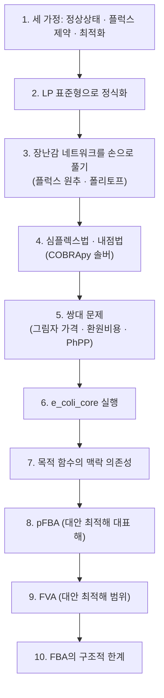

# 1. FBA란 무엇인가: 세 가지 가정과 직관

## 1.0 수식 전에, 아주 익숙한 상황 하나

수식으로 들어가기 전에 여러분이 이미 매일 겪는 상황 하나를 떠올려 봅시다. 용돈 10,000원으로 편의점에서 과자와 음료를 산다고 합시다. "과자값 + 음료값 = 10,000원"이라는 조건 하나만으로는 무엇을 살지 정해지지 않습니다 — 과자 3,000원+음료 7,000원도, 과자 8,000원+음료 2,000원도 똑같이 이 조건을 만족합니다. 예산 제약(조건)은 "가능한 조합의 집합"을 정할 뿐, "어떤 조합을 고를지"는 정하지 못합니다. 여기에 "가장 배부르게" 또는 "가장 오래 먹을 수 있게"와 같은 **기준**을 하나 더해야 비로소 하나의 선택이 결정됩니다.

`e_coli_core` 세포도 사정이 똑같습니다. "물질이 만들어지는 만큼 소비된다"는 조건($$\mathbf{S}\mathbf{v}=\mathbf{0}$$)과 "각 반응 속도에는 한계가 있다"는 조건($$\mathbf{v}^{lb}\le\mathbf{v}\le\mathbf{v}^{ub}$$)만으로는 세포가 정확히 어떤 플럭스 조합을 택할지 정해지지 않습니다. FBA는 여기에 "세포는 빠르게 자라는 것을 최우선으로 한다"는 기준을 추가해, 무한히 많은 가능한 조합 중 하나(또는 하나의 최적 집합)를 골라냅니다. 이 장의 나머지는 이 간단한 아이디어를 정확한 수식과 알고리즘으로 다듬어 가는 과정입니다.

## 1.1 과소결정계 문제, 다시 보기

`e_coli_core` 모델은 대사물 $$m=72$$개, 반응 $$n=95$$개로 구성됩니다([Chapter 2](../chapter-2/README.md)). 정상상태 방정식 $$\mathbf{S}\mathbf{v}=\mathbf{0}$$은 대사물마다 한 행을 제공하지만, 72개 행이 모두 선형 독립인 것은 아닙니다. 실제 `textbook` 모델에서 $$\operatorname{rank}(\mathbf{S})=67$$이고 미지수(반응 플럭스)는 95개입니다.

> **핵심 개념 · 용어(English):** **과소결정계(Underdetermined System)** — 미지수의 개수($$n$$)가 독립 방정식의 개수($$\operatorname{rank}(\mathbf{S})$$)보다 많아서, 주어진 등식 제약만으로는 해가 유일하게 정해지지 않는 연립방정식.

따라서 영공간의 차원(nullity)은 $$n-\operatorname{rank}(\mathbf{S})=95-67=28$$입니다. 단순히 $$n-m=23$$으로 계산하면 행 사이의 선형 의존성을 놓칩니다. 이 28차원 영공간에 반응 상·하한을 적용하면 실제 가능한 영역의 차원은 더 낮아질 수 있습니다.

**아주 작은 숫자로 직접 확인하기.** `e_coli_core`의 95×67 크기가 아직 손에 잡히지 않는다면, 변수 3개·독립 방정식 1개짜리 초미니 시스템으로 같은 현상을 확인해 봅시다.

$$v_1 + v_2 - v_3 = 0$$

미지수는 $$n=3$$개, 독립 방정식은 $$\operatorname{rank}=1$$개이므로 nullity는 $$n-\operatorname{rank}=3-1=2$$입니다. 즉 $$v_2, v_3$$를 자유롭게 고른 뒤 $$v_1=v_3-v_2$$로 결정하는 2-매개변수 family의 해가 모두 이 방정식을 만족합니다 — 예를 들어 $$(v_2,v_3)=(1,4)$$면 $$v_1=3$$, $$(v_2,v_3)=(0,5)$$면 $$v_1=5$$로, 방정식 하나만으로는 무수히 많은 $$(v_1,v_2,v_3)$$ 조합이 나옵니다. `e_coli_core`의 67개 독립 방정식·95개 미지수도 이 초미니 예제를 그대로 28배 확장한 것일 뿐, 원리는 완전히 같습니다.

> 🤔 **잠깐, 생각해보기:** 미지수가 독립 방정식보다 많은 일관된 선형계는 왜 하나의 해로 정해지지 않을까요? 예를 들어 $$x+y=10$$은 $$(10,0)$$, $$(3,7)$$ 등 무한히 많은 해를 가집니다. `e_coli_core`도 95개 변수에 독립 물질수지식이 67개뿐입니다. 플럭스 범위를 더하면 가능한 집합이 잘리지만, 일반적으로 여전히 연속적인 영역으로 남습니다.

이 무한한 후보 중에서 "실제로 세포가 선택하는" 하나를 골라내려면 방정식과 부등식만으로는 부족합니다. 여기에 **"세포는 무엇을 위해 이 선택을 할까?"**라는 목적을 하나 추가해야 합니다. 이것이 FBA의 세 번째 가정, 최적화 원리입니다.


❓ **흔한 오해:** "$$\operatorname{rank}(\mathbf{S})$$이 왜 대사물 수 $$m$$보다 작을 수 있나요?" 화학량론 행렬의 행(대사물)들이 선형 독립이 아닐 때가 있습니다. 예를 들어 NAD⁺와 NADH의 합이 세포 전체에서 항상 일정하게 보존되는 **보존 모이어티(Conserved Moiety)**가 있으면, 그 두 대사물에 대응하는 두 행은 서로 선형 의존적이 되어 rank를 하나 낮춥니다. `e_coli_core`에서 $$m-\operatorname{rank}(\mathbf{S})=72-67=5$$인 것은 이런 보존 모이어티가 존재하기 때문이며, 자세한 계산은 [Chapter 2](../chapter-2/README.md)를 참고하십시오.


## 1.2 FBA의 세 가지 기본 가정

**Flux Balance Analysis(FBA)**는 Savinell과 Palsson의 1992년 플럭스 균형 연구와 Varma·Palsson의 1994년 정량적 성장 예측 연구를 거치며 확립된 방법으로, 대사 네트워크의 **의사정상상태(Pseudo-Steady-State)** 하에서 선형 계획법을 이용해 가능한 통량 분포 중 목적 함수를 최적화하는 해를 찾습니다. FBA는 다음 세 가지 기본 가정 위에 세워집니다.

**가정 1 — 의사정상상태 (Pseudo-Steady-State Assumption)**

세포 내부 대사물의 농도 벡터 $$\mathbf{x}$$가 관심 시간 척도에서 변하지 않는다고 가정합니다.

$$\frac{d\mathbf{x}}{dt} = \mathbf{S}\mathbf{v} = \mathbf{0}$$

대사물의 회전 시간(turnover time)은 보통 수 초~수 분이며, 세포 배양의 관찰 시간 척도(수 시간)보다 훨씬 짧기 때문에, 지수 성장기(Exponential Phase)나 케모스탯(Chemostat) 정상 상태에서는 이 가정이 잘 성립합니다.


❓ **흔한 오해:** "정상상태(steady state)"는 "아무것도 흐르지 않는다"는 뜻이 아닙니다! 정상상태는 대사물의 **농도**가 일정하게 유지된다는 뜻이지, 반응의 **플럭스**가 0이라는 뜻이 아닙니다. 물탱크에 비유하면, 물이 들어오는 속도와 나가는 속도가 정확히 같아서 수위(농도)는 변하지 않지만, 물은 여전히 활발하게 흐르고 있는(플럭스 ≠ 0) 상태입니다. 실제로 `e_coli_core`가 최고 속도로 성장할 때도 수십 개 반응이 초당 수 mmol씩 활발히 흐르고 있습니다 — 단지 각 대사물이 "만들어지는 만큼 정확히 소비되고" 있을 뿐입니다.


**가정 2 — 플럭스 제약 (Flux Constraints)**

모든 반응 플럭스는 열역학적 가역성, 효소 용량, 영양분 가용성 등 물리·화학·환경적 한계를 가집니다.

$$\mathbf{v}^{lb} \le \mathbf{v} \le \mathbf{v}^{ub}$$

**가정 3 — 최적화 원리 (Optimization Principle)**

세포가 특정 목적 함수 $$Z=\mathbf{c}^\mathsf{T}\mathbf{v}$$를 최적화하도록 진화했다고 가정합니다. 가장 널리 쓰이는 목적 함수는 [바이오매스 목적함수](../chapter-3/README.md)의 최대화입니다.

> **핵심 개념 · 용어(English):** **Flux Balance Analysis(FBA)** — 의사정상상태, 플럭스 제약, 최적화 원리의 세 가지 가정을 결합하여, 가능한 통량 분포 공간에서 목적 함수를 최대(또는 최소)로 만드는 플럭스 해를 선형 계획법으로 찾는 방법.

세 가정 중 앞의 둘(의사정상상태, 플럭스 제약)은 이미 [Chapter 2](../chapter-2/README.md)~[Chapter 3](../chapter-3/README.md)에서 각각 $$\mathbf{S}\mathbf{v}=\mathbf{0}$$과 반응의 `bounds`로 준비해 둔 것들입니다. FBA가 새롭게 더하는 것은 **가정 3, 최적화 원리**입니다. 이 가정은 가능한 해를 최적 집합으로 좁히지만, 그 집합이 반드시 한 점인 것은 아닙니다.

## 1.3 왜 동역학 대신 화학량론인가 — 역사적 맥락

FBA 이전의 전통적 접근인 **동역학 모델(Kinetic Model)**은 각 반응마다 Michaelis-Menten 상수($$K_m$$, $$V_{max}$$)와 같은 효소 동역학 매개변수를 실험적으로 측정해야 했습니다. 그러나 게놈 규모(수천 개 반응)에서 이 모든 매개변수를 측정하는 것은 사실상 불가능합니다. 1990년대 초 Varma와 Palsson은 1947년 George Dantzig가 군수 물류 최적화를 위해 개발한 **심플렉스법(Simplex Method)**의 선형 계획법 프레임워크를 대사 네트워크에 적용했습니다. FBA는 동역학적 세부사항을 포기하는 대신 **네트워크 토폴로지(Network Topology)**와 **화학량론적 제약(Stoichiometric Constraint)**만으로 예측을 수행하며, 이 "매개변수 없음"이라는 특징을 강점으로 전환한 것이 **제약 기반 모델링(Constraint-Based Modeling, CBM)**의 핵심 통찰입니다.

## 1.4 직관적 이해 — 물 수도망의 비유

FBA를 처음 접할 때 가장 도움이 되는 이미지는 도시의 **물 수도망**입니다. 각 반응은 물이 흐르는 파이프, 각 대사물은 물이 모이는 교차로(노드), 플럭스는 파이프 속 물의 흐름 속도입니다.

- **물질수지 제약** $$\mathbf{S}\mathbf{v}=\mathbf{0}$$ 은 "모든 교차로(대사물 노드)에서 유입량과 유출량이 정확히 같아야 한다"는 뜻입니다. 그렇지 않으면 수도망 어딘가가 넘치거나 말라버립니다.
- **플럭스 범위 제약** $$\mathbf{v}^{lb}\le \mathbf{v}\le \mathbf{v}^{ub}$$ 은 각 파이프의 물리적 용량입니다. 어떤 파이프는 일방통행(비가역 반응)이고 어떤 파이프는 양방향(가역 반응)입니다.
- **목적 함수**는 "가능한 한 많은 물을 최종 목적지(바이오매스 반응)까지 흘려보낸다"는 것입니다.

이 비유는 FBA의 강점과 한계를 동시에 보여줍니다. 강점은 네트워크 전체 구조(파이프의 배치)만으로 전역적 흐름 패턴을 예측할 수 있다는 것이고, 한계는 "파이프의 굵기(효소 농도)"나 "수압(대사물 농도)"을 명시적으로 고려하지 않는다는 것입니다 — 이 정보가 필요한 지점에서는 kinetic 모델이나 효소-제약 모델(GECKO 등, [Chapter 9](../chapter-9/README.md) 참고)이 필요합니다. 이 장 3절에서는 이 수도망을 아주 작은 규모(파이프 3개)로 직접 만들어, 손으로 최적 흐름을 계산해 봅니다.

## 1.5 이 장의 로드맵

세 가정에서 출발해 실제 코드 실행과 한계 인식까지, 이 장이 어떤 순서로 전개되는지 미리 훑어봅시다.

4절과 5절은 "어떻게 푸는가"와 "해가 무엇을 말해주는가"를 다루는 이론 축이고, 6~7절은 실제 실행 축, 8~9절은 3절에서 확인한 "해의 비유일성" 문제를 정면으로 다루는 진단 축입니다. 10절은 이 모든 도구가 왜 완벽하지 않은지를 정리하며 다음 장들로 다리를 놓습니다.

---
