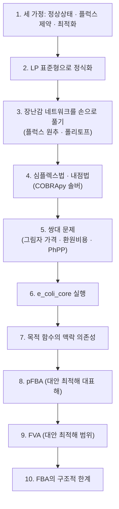

# 1. FBA란 무엇인가: 세 가지 가정과 직관

## 1.0 제약과 선택 기준

대사 네트워크의 물질수지식 $$\mathbf{S}\mathbf{v}=\mathbf{0}$$과 반응 범위 $$\mathbf{v}^{lb}\le\mathbf{v}\le\mathbf{v}^{ub}$$는 모델에서 가능한 플럭스 조합의 범위를 정한다. 그러나 이 조건만으로는 여러 조합 중 어느 하나가 실제 세포의 상태인지 결정할 수 없다. **플럭스 균형 분석(Flux Balance Analysis, FBA)**은 여기에 목적함수 $$\mathbf{c}^{\mathsf T}\mathbf{v}$$를 더한다. 그리고 정해진 환경과 경계조건에서 목적값이 가장 큰 플럭스 해(또는 여러 최적해)를 계산한다.

바이오매스 최대화는 세포가 언제나 실제로 따르는 보편 법칙이 아니라 성장 조건에 대해 검증해야 하는 **모델링 가설**이다. 따라서 FBA가 반환하는 해는 "세포가 선택한 유일한 상태"가 아니라, 주어진 화학량론·경계조건·목적 가설을 동시에 만족하는 계산 결과로 해석해야 한다.

## 1.1 과소결정계 문제, 다시 보기

COBRApy 0.30.0의 `textbook` 모델은 대사물 $$m=72$$개와 반응 $$n=95$$개로 구성되므로 [화학량론 행렬](../glossary.md)은 $$\mathbf{S}\in\mathbb{R}^{72\times95}$$이다([Chapter 2](../chapter-2/README.md)). 정상상태 방정식 $$\mathbf{S}\mathbf{v}=\mathbf{0}$$은 대사물마다 한 행을 제공하지만, 72개 행이 모두 선형 독립인 것은 아니다. 이 모델에서 [행렬 계수](../glossary.md)(rank) $$\operatorname{rank}(\mathbf{S})=67$$이고 미지수인 반응 플럭스는 95개이다.

> **핵심 개념 · 용어(English):** **과소결정계(Underdetermined System)** — 미지수의 개수($$n$$)가 독립 방정식의 개수($$\operatorname{rank}(\mathbf{S})$$)보다 많아서, 주어진 등식 제약만으로는 해가 유일하게 정해지지 않는 연립방정식.

따라서 [영공간](../glossary.md)의 차원(nullity)은 $$n-\operatorname{rank}(\mathbf{S})=95-67=28$$이다. 단순히 $$n-m=23$$으로 계산하면 행 사이의 선형 의존성을 놓친다. 이 28차원 영공간에 반응 상·하한을 적용하면 실제 가능한 영역의 차원은 더 낮아질 수 있다.

**작은 계에서 확인하기.** $$72\times95$$ 행렬과 rank 67의 관계는 변수 3개·독립 방정식 1개인 다음 계와 같은 선형대수 원리를 따른다.

$$v_1 + v_2 - v_3 = 0$$

미지수는 $$n=3$$개, 독립 방정식은 1개이므로 nullity는 $$n-\operatorname{rank}=3-1=2$$이다. 즉 $$v_2, v_3$$를 자유롭게 고른 뒤 $$v_1=v_3-v_2$$로 결정하는 2-매개변수 해 집합이 이 방정식을 만족한다. 예를 들어 $$(v_2,v_3)=(1,4)$$이면 $$v_1=3$$이고, $$(v_2,v_3)=(0,5)$$이면 $$v_1=5$$이다. `e_coli_core`의 nullity 28도 동일한 방식으로 얻는 **자유도의 수**이며, 작은 예제를 28배 확대한 크기 비율을 뜻하지 않는다.

> **해석상의 주의:** nullity 28은 등식 $$\mathbf{S}\mathbf{v}=\mathbf{0}$$만 고려한 영공간의 차원이다. 플럭스 범위를 추가하면 실행가능 집합의 유효 차원이 더 낮아질 수 있고, 일부 조건에서는 집합이 비거나 한 점으로 줄어들 수도 있다.

이 후보 집합을 더 좁히려면 방정식과 부등식 외에 계산 목적을 지정해야 한다. 이것이 FBA의 세 번째 가정인 최적화 원리이다. 목적함수를 추가해도 대안 최적해가 존재하면 최적 집합은 한 점이 아닐 수 있다.


**해석상의 주의:** $$\operatorname{rank}(\mathbf{S})<m$$이면 0이 아닌 벡터 $$\boldsymbol\ell$$에 대해 $$\boldsymbol\ell^{\mathsf T}\mathbf{S}=\mathbf{0}$$인 왼쪽 영공간이 존재한다. 보존되는 조효소 풀과 같은 **보존 모이어티(Conserved Moiety)**는 이러한 선형 관계를 만들 수 있다. 그러나 $$m-\operatorname{rank}(\mathbf{S})=5$$라는 숫자만으로 다섯 보존 풀의 생화학적 정체를 확정할 수는 없다. 경계 대사물·구획화·행렬 구성도 rank에 영향을 주므로, 구체적 해석에는 왼쪽 영공간 기저와 각 대사물 계수를 직접 조사해야 한다.


## 1.2 FBA의 세 가지 기본 가정

**플럭스 균형 분석(Flux Balance Analysis, FBA)**은 [Savinell과 Palsson의 선형 최적화 정식화](https://doi.org/10.1016/S0022-5193(05)80161-4)와 [Varma와 Palsson의 성장·부산물 예측](https://doi.org/10.1128/AEM.60.10.3724-3731.1994)을 거치며 확립된 방법이다(더 자세한 독서 순서는 [필독 논문 가이드](../landmark-papers.md) 참고). 대사 네트워크의 [의사정상상태](../glossary.md)(Pseudo-Steady-State)에서 선형 계획법을 이용해 지정한 목적함수를 최적화한다.

**가정 1 — 의사정상상태 (Pseudo-Steady-State Assumption)**

세포 내부 대사물의 농도 벡터 $$\mathbf{x}$$가 관심 시간 척도에서 변하지 않는다고 가정한다.

$$\frac{d\mathbf{x}}{dt} = \mathbf{S}\mathbf{v} = \mathbf{0}$$

중심대사의 대사물 풀은 많은 성장 실험에서 세포 성장이나 배지 변화보다 빠르게 조정된다. 그래서 지수 성장기나 케모스탯 정상상태의 내부 대사물에는 이 근사를 적용할 수 있다. 다만 저장 대사물이 쌓이거나, 환경이 급격히 바뀌거나, 세포주기가 변하는 상황처럼 관심 시간 척도에서 농도가 실제로 변하는 현상에는 적용 범위를 다시 따져봐야 한다.


**정상상태와 평형은 다르다.** 정상상태는 각 내부 대사물의 순축적률이 0이라는 뜻이며 개별 반응 플럭스는 0이 아닐 수 있다. 반면 열역학적 평형에서는 반응의 순 구동력과 순 플럭스가 0이다. `textbook` 모델의 플럭스는 기본적으로 mmol·gDW$$^{-1}$$·h$$^{-1}$$ 단위의 단위 생물량·단위 시간당 반응 진행률이다. 따라서 $$\mathbf{S}\mathbf{v}=\mathbf{0}$$은 "플럭스가 없다"가 아니라 각 내부 대사물의 화학량론적 생산률과 소비률이 상쇄된다는 조건이다.


**가정 2 — 플럭스 제약 (Flux Constraints)**

모든 반응 플럭스는 열역학적 가역성, 효소 용량, 영양분 가용성 등 물리·화학·환경적 한계를 가진다.

$$\mathbf{v}^{lb} \le \mathbf{v} \le \mathbf{v}^{ub}$$

**가정 3 — 최적화 원리 (Optimization Principle)**

분석자가 특정 목적 함수 $$Z=\mathbf{c}^\mathsf{T}\mathbf{v}$$를 지정하고, 세포의 관찰 상태가 그 목적에 대해 최적 또는 근최적이라고 가정한다. 가장 널리 쓰이는 목적 함수는 [바이오매스 목적함수](../chapter-3/README.md)의 최대화이지만, 목적의 타당성은 생물·조건·적응 상태에 따라 검증해야 한다.

> **핵심 개념 · 용어(English):** **Flux Balance Analysis(FBA)** — 의사정상상태, 플럭스 제약, 최적화 원리의 세 가지 가정을 결합하여, 가능한 통량 분포 공간에서 목적 함수를 최대(또는 최소)로 만드는 플럭스 해를 선형 계획법으로 찾는 방법.

세 가정 중 앞의 둘(의사정상상태, 플럭스 제약)은 이미 [Chapter 2](../chapter-2/README.md)~[Chapter 3](../chapter-3/README.md)에서 각각 $$\mathbf{S}\mathbf{v}=\mathbf{0}$$과 반응의 `bounds`로 준비해 둔 것들이다. FBA가 새롭게 더하는 것은 **가정 3, 최적화 원리**이다. 이 가정은 가능한 해를 최적 집합으로 좁히지만, 그 집합이 반드시 한 점인 것은 아니다.

## 1.3 동역학 대신 화학량론을 택하는 근거 — 역사적 맥락

**[동역학 모델](../glossary.md)(Kinetic Model)**은 보통 반응별 속도식과 $$K_m$$, $$V_{max}$$ 같은 동역학 매개변수를 요구한다. 게놈 규모에서 이를 모두 조건별로 측정하기 어렵기 때문에 FBA는 농도 의존 속도식을 생략하고 화학량론, 반응 방향·용량 경계, 교환 조건과 목적함수로 문제를 구성한다([Orth, Thiele & Palsson, 2010](https://doi.org/10.1038/nbt.1614)). 따라서 FBA는 **동역학 매개변수가 적은(kinetic-parameter-sparse)** 방법이지 매개변수가 없는 방법이 아니다. 바이오매스 계수, 유지에너지, 섭취 상한과 가역성은 모두 측정·문헌·큐레이션에 의존하는 모델 입력이다.

## 1.4 네트워크 관점에서의 해석

대사 네트워크에서 반응은 대사물을 연결하는 방향성 있는 변환이고, 플럭스는 단위 생체량·단위 시간당 반응 속도이다. 물질수지는 각 내부 대사물에 대한 유입과 유출의 합이 0임을 요구하며, flux bound는 열역학 방향성·효소 용량·배지 조성 같은 정보를 제약으로 표현한다.

- **물질수지 제약** $$\mathbf{S}\mathbf{v}=\mathbf{0}$$ 은 "모든 교차로(대사물 노드)에서 유입량과 유출량이 정확히 같아야 한다"는 뜻이다. 그렇지 않으면 수도망 어딘가가 넘치거나 말라버린다.
- **플럭스 범위 제약** $$\mathbf{v}^{lb}\le \mathbf{v}\le \mathbf{v}^{ub}$$ 은 각 파이프의 물리적 용량이다. 어떤 파이프는 일방통행(비가역 반응)이고 어떤 파이프는 양방향(가역 반응)이다.
- **목적 함수**는 "가능한 한 많은 물을 최종 목적지(바이오매스 반응)까지 흘려보낸다"는 것이다.

표준 FBA는 효소 농도와 대사물 농도를 직접 계산하지 않으며, 화학량론 계수·가역성·에너지 결합도 반응식과 bound로 명시된 범위에서만 반영한다. 이러한 변수가 필요하면 동역학 모델이나 효소-제약 모델(GECKO 등, [Chapter 9](../chapter-9/README.md))을 사용해야 한다. 3절에서는 세 반응 수치 예제로 최적 플럭스를 계산한다.

## 1.5 이 장의 로드맵

이 장은 세 가정에서 출발해 해법, 실제 실행, 비유일성 진단과 적용 한계를 다음 순서로 전개한다.

*그림 4.1: 제4장의 분석 흐름. FBA의 기본 정식화에서 출발하여 최적화, 해석, 비유일성 진단과 한계 평가로 전개한다. [Orth et al. (2010)](https://doi.org/10.1038/nbt.1614)의 제약 기반 분석 개념을 바탕으로 한 독립 도식이다.*

4절과 5절은 "어떻게 푸는가"와 "해가 무엇을 말해주는가"를 다루는 이론 축이고, 6~7절은 실제 실행 축, 8~9절은 3절에서 확인한 "해의 비유일성" 문제를 정면으로 다루는 진단 축이다. 10절은 이 모든 도구가 왜 완벽하지 않은지를 정리하며 다음 장들로 다리를 놓는다.

---
