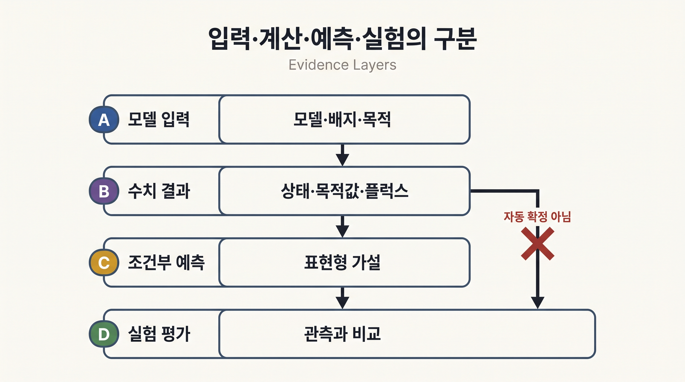

# 1. FBA는 생물학적 질문을 계산 조건으로 바꾼다

## 1.1 질문을 먼저 고정한다

FBA는 모델 하나에서 자동으로 하나의 생물학적 결론을 만드는 방법이 아니다. 같은 모델이라도 질문에 따라 입력과 출력이 달라진다.

| 생물학적 질문 | 고정할 입력 | 먼저 읽을 출력 |
|:---|:---|:---|
| 포도당 최소 배지에서 성장 가능한가 | 탄소원·질소원·산소 교환 경계, 바이오매스 목적함수 | 솔버 상태, 예측 성장률 |
| 산소 차단이 발효에 미치는 영향은 무엇인가 | 포도당 조건 유지, 산소 섭취 차단 | 성장률, 유기산·알코올 교환 플럭스 |
| 유전자 결손이 치명적인가 | 배지 유지, GPR에 따른 결손 반응 차단 | WT 대비 성장률 비율 |
| 생산물의 이론적 한계는 얼마인가 | 최소 성장 요구량, 생산물 교환 반응 목적함수 | 생산물 분비 플럭스 |

질문의 대조군도 함께 정해야 한다. 유전자 결손을 분석할 때는 같은 모델·배지·목적함수를 사용한 WT가 대조군이다. 산소 효과를 분석할 때는 산소 경계만 바꾸고 나머지 조건을 유지해야 한다. 동시에 여러 조건을 바꾸면 어떤 입력이 결과 차이를 만들었는지 분리하기 어렵다.

## 1.2 FBA의 세 입력

FBA는 다음 세 종류의 정보를 결합한다.

1. **물질수지**는 내부 대사물이 관심 시간 척도에서 순축적되지 않는다는 의사정상상태 가정이다.
2. **반응 경계**는 배지, 반응 방향과 허용 용량을 나타낸다.
3. **목적함수**는 가능한 상태 가운데 어떤 계산 기준으로 상태를 선택할지 정한다.

바이오매스 최대화는 널리 쓰이는 목적 가설이지만 보편 법칙은 아니다. 영양 제한 조건에서 적응한 미생물의 성장 예측에는 유용할 수 있으나, 교란 직후 상태나 정체기, 생산물 중심 공정에는 다른 가설과 비교해야 한다([Orth et al., 2010](https://doi.org/10.1038/nbt.1614)).

```mermaid
flowchart LR
    A["생물학적 질문<br/>성장 · 분비 · 결손"] --> B["계산 조건<br/>배지 · 방향 · 목적 · 교란"]
    B --> C["제약 기반 계산"]
    C --> D["수치 결과<br/>상태 · 목적값 · 플럭스"]
    D --> E["실험 평가<br/>관측과 비교"]
```

_그림 4.1:_ 성장·분비·결손이라는 생물학적 질문을 배지와 반응 방향, 목적함수와 교란 조건으로 번역하고, 계산 결과를 실험 관찰과 비교하는 흐름이다. 실제 모델 계산값을 표시하지 않은 교육용 Mermaid 모식도다. 저자 작성; 개념 근거: [Orth et al. (2010)](https://doi.org/10.1038/nbt.1614).

## 1.3 입력과 출력의 경계

FBA의 결과를 해석할 때에는 네 층을 구분한다.

- **모델 입력**: 반응식, GPR, 배지, 경계조건과 목적함수이다.
- **수치 결과**: 솔버 상태, 목적값과 플럭스 벡터이다.
- **조건부 예측**: 그 수치가 해당 조건의 세포 표현형을 나타낸다는 진술이다.
- **실험 평가**: 예측을 성장률, 섭취·분비 속도 또는 플럭스 자료와 비교한 판정이다.

_그림 4.2:_ 모델 입력, 수치 결과, 조건부 예측과 실험 평가를 네 층으로 분리한 도식이다. `optimal`과 같은 수치 결과만으로 실험 표현형이 자동 확정되지 않음을 빨간 차단 표지로 나타낸 교육용 모식도이며 실제 GEM 계산 결과가 아니다. 저자 작성; 개념 근거: [Orth et al. (2010)](https://doi.org/10.1038/nbt.1614).

`optimal`은 주어진 수치 허용오차 안에서 목적값을 최적화했다는 솔버 상태다. 세포가 실제로 최적화되었다거나 모델 가설이 검증되었다는 뜻은 아니다.

## 1.4 재현 가능한 분석 기록

다른 사람이 같은 계산을 반복하려면 다음 항목을 함께 기록한다.

1. 모델 ID, 릴리스 또는 파일 체크섬
2. 소프트웨어와 솔버 버전
3. 열린 교환 반응과 각 섭취 상한
4. 반응 방향을 포함한 주요 경계조건
5. 목적함수와 목적 방향
6. 유전자·반응 교란 목록
7. 최적성·무성장 판정에 사용한 허용오차

반응 수와 유전자 수도 생물 종의 고정 속성이 아니라 모델 릴리스의 속성이다. 이 장의 계산 예시는 COBRApy 0.30.0 `textbook` 모델을 기준으로 하며, 다른 릴리스에서는 값과 분류가 달라질 수 있다.


계산 결과를 보고할 때 배지와 목적함수를 생략하면 결과의 생물학적 질문도 사라진다. “이 유전자는 필수다”보다 “이 모델의 포도당 최소 배지와 성장 목적 아래에서 이 유전자 결손은 무성장으로 예측된다”가 정확한 진술이다.


---
