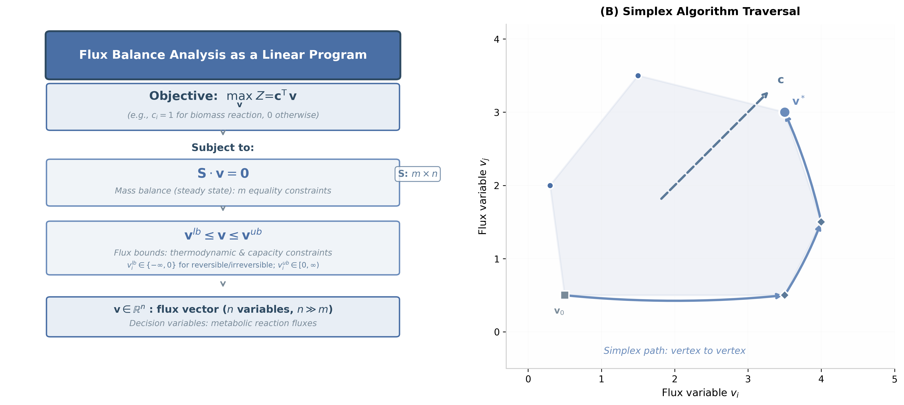

# 2. 선형 계획법(LP)으로서의 FBA: 수학적 정형화

## 2.1 표준형

세 가지 가정을 결합하면 FBA는 다음의 표준 선형 계획법 문제가 된다.

$$
\begin{aligned}
\max_{\mathbf{v}} \quad & Z = \mathbf{c}^\mathsf{T} \mathbf{v} \\
\text{subject to} \quad & \mathbf{S} \cdot \mathbf{v} = \mathbf{0} \\
& \mathbf{v}^{lb} \le \mathbf{v} \le \mathbf{v}^{ub}
\end{aligned}
$$

*그림 4.2: FBA의 목적함수와 세 제약의 관계. 목적값을 최적화하더라도 대안 최적 플럭스 분포가 남을 수 있다. 저자 제작 모식도이며 [Orth et al. (2010)](https://doi.org/10.1038/nbt.1614)의 개념을 인용한다.*

| 기호 | 차원 | 의미 |
|:---|:---:|:---|
| $$\mathbf{S}$$ | $$m \times n$$ | 화학량론 행렬 ([Chapter 2](../chapter-2/README.md) 참고) |
| $$\mathbf{v}$$ | $$n \times 1$$ | 반응 플럭스 벡터 (단위: mmol/gDW/h) |
| $$\mathbf{c}$$ | $$n \times 1$$ | 목적 함수 계수 벡터 |
| $$Z$$ | 스칼라 | 목적 함수값 (바이오매스 최대화 시 성장률 $$\mu$$, h$$^{-1}$$) |
| $$\mathbf{v}^{lb}, \mathbf{v}^{ub}$$ | $$n \times 1$$ | 플럭스 하한·상한 |

> **핵심 개념 · 용어(English):** **[화학량론 행렬](../glossary.md)(Stoichiometric Matrix)** $$\mathbf{S}$$ — 행은 대사물($$m$$개), 열은 반응($$n$$개)이며, 원소 $$S_{ij}$$는 반응 $$j$$에서 대사물 $$i$$가 소비되면 음수, 생성되면 양수, 참여하지 않으면 0이다. 구성 원리는 [Chapter 2](../chapter-2/README.md)에서 다룬다.

**용어 하나씩 뜯어보기:** $$\max_{\mathbf{v}}$$은 "플럭스 벡터 $$\mathbf{v}$$를 조절해서 그 뒤의 식을 최대로 만든다"는 뜻이다. $$\mathbf{c}^\mathsf{T}\mathbf{v}$$는 벡터 $$\mathbf{c}$$와 $$\mathbf{v}$$의 내적(dot product)으로, $$\sum_j c_j v_j$$를 압축해서 쓴 것이다. `subject to`(제약 조건 하에서)는 그 뒤의 등식·부등식을 모두 만족해야 한다는 뜻이다.

## 2.2 과소결정 시스템과 목적 함수의 역할

genome-scale 모델은 대개 반응 수가 독립 물질수지식 수보다 많다. 자유도는 $$n-m$$이 아니라 정확히 $$n-\operatorname{rank}(\mathbf{S})$$로 계산해야 한다. `e_coli_core`는 $$n=95$$, $$\operatorname{rank}(\mathbf{S})=67$$이므로 영공간 차원이 28이다. 등식 제약 $$\mathbf{S}\mathbf{v}=\mathbf{0}$$만으로는 $$\mathbf{v}$$가 유일하게 정해지지 않는 **과소결정(Underdetermined) 시스템**이며, 목적 함수 $$\mathbf{c}^\mathsf{T}\mathbf{v}$$는 가능한 영역에서 최적 목적값을 정한다. 다만 같은 최적값을 만드는 플럭스 벡터는 여전히 여러 개일 수 있다.

## 2.3 목적 함수 벡터 $$\mathbf{c}$$와 바이오매스 반응

가장 널리 쓰이는 목적 함수는 바이오매스 생성 속도의 최대화이다.

$$\mathbf{c}^\mathsf{T}\mathbf{v} = v_{\text{bio}}$$

여기서 $$\mathbf{c}$$는 바이오매스 반응에 해당하는 원소만 1이고 나머지는 모두 0인 벡터이다. COBRApy의 `load_model("textbook")` 모델에서는 이 반응의 ID가 `Biomass_Ecoli_core`이다([Chapter 2](../chapter-2/README.md) 참고). 바이오매스 반응 자체가 어떻게 구성되는지(아미노산·뉴클레오타이드·지질 조성비, GAM/NGAM 등)는 [Chapter 3](../chapter-3/README.md)에서 다루었으므로 이 장에서는 반복하지 않는다.


**팁:** $$\mathbf{c}$$ 벡터를 "바이오매스 반응 자리만 1이고 나머지는 모두 0인 표준기저벡터(standard basis vector) $$\mathbf{e}_{\text{bio}}$$"라고 생각하면, $$\mathbf{c}^\mathsf{T}\mathbf{v}=v_{\text{bio}}$$라는 사실이 훨씬 쉽게 이해된다. 목적 함수를 바꾸고 싶다면(6.3절 참고), 그저 $$\mathbf{c}$$에서 1의 위치를 다른 반응으로 옮기면 된다 — COBRApy에서는 `model.objective = 반응이름` 한 줄이 이 작업을 대신해 준다.


이 장에서 중요한 것은 바이오매스 반응의 플럭스 $$v_{\text{bio}}$$(단위 h$$^{-1}$$)가 LP를 풀어 얻은 목적 함수값 $$Z^*$$와 정확히 같고, 이 값이 곧 세포의 **특정 성장률(Specific Growth Rate)** $$\mu$$로 해석된다는 점이다. 예를 들어 $$Z^*=0.874$$ h$$^{-1}$$은 세포 질량이 약 48분($$\ln 2/0.874 \approx 0.79$$시간)마다 두 배가 됨을 의미한다.

## 2.4 경사하강법과 선형 계획법은 무엇이 다른가

최적화 문제라고 해서 모두 **경사하강법(Gradient Descent)**으로 푸는 것은 아니다. 경사하강법은 미분 가능한 목적 함수의 기울기를 계산하고, 학습률(learning rate)만큼 해를 반복해서 이동시키는 방법이다. 비볼록 목적 함수에서는 도달한 해가 전역 최적해라는 보장이 없을 수 있고, 학습률과 초기값이 수렴 과정에 영향을 준다.

반면 FBA는 목적 함수와 제약식이 모두 선형인 **선형 계획법(LP)**이다. 가능 영역은 선형 등식·부등식이 만드는 볼록 다면체(polyhedron)이므로, 문제가 실행 가능하고 최적값이 유한하면 심플렉스법이나 내점법은 수치 허용오차 안에서 **전역 최적값**을 찾는다. 기울기를 따라 이동하거나 학습률을 정할 필요가 없다.

| 구분 | 경사하강법 | FBA의 선형 계획법 |
|:---|:---|:---|
| 전형적 문제 | 미분 가능한 목적 함수의 연속 최적화 | 선형 목적 함수 + 선형 등식·부등식 제약 |
| 해를 찾는 방식 | 기울기를 따라 반복 갱신 | 심플렉스법의 꼭짓점 탐색 또는 내점법 |
| 조정값 | 학습률, 초기값, 종료 조건 | 솔버 허용오차와 알고리즘 설정; 학습률 없음 |
| 최적성 | 비볼록 문제에서는 국소해에 머물 수 있음 | 실행 가능한 bounded LP에서는 전역 최적값 보장 |
| 해의 유일성 | 문제 구조에 따라 달라짐 | 최적값은 정해져도 최적 플럭스 벡터는 여러 개일 수 있음 |


**전역 최적값을 찾는다는 말은 플럭스 해가 유일하다는 뜻이 아니다.** 목적 함수가 가능 영역의 한 면과 평행하면 대안 최적해가 존재한다. 또한 LP의 **퇴화(degeneracy)**는 한 기본 실행가능해에서 필요한 수보다 많은 제약이 동시에 활성인 성질로, 해의 비유일성과 같은 개념이 아니다.


## 2.5 일반형에서 표준형으로: 슬랙 변수와 부호 분해

교과서의 심플렉스법(4.1절)은 보통 모든 제약이 등식이고 모든 변수가 0 이상인 **표준형(Standard Form)**을 가정한다.

$$
\begin{aligned}
\max_{\mathbf{x}} \quad & \mathbf{c}^\mathsf{T}\mathbf{x} \\
\text{s.t.} \quad & \mathbf{A}\mathbf{x} = \mathbf{b} \\
& \mathbf{x} \ge \mathbf{0}
\end{aligned}
$$

FBA의 LP는 $$\mathbf{v}^{lb}\le\mathbf{v}\le\mathbf{v}^{ub}$$라는 양방향 부등식과, 가역 반응처럼 음수를 허용하는 변수를 가지고 있어 이 형태와 정확히 같지 않다. 실제 솔버 내부에서는 다음 두 가지 표준 변환이 함께 쓰인다. COBRApy나 optlang을 쓰면 이 변환이 자동으로 이루어지므로 직접 코드를 짤 일은 거의 없다. 그래도 "심플렉스가 왜 등식 형태를 다루는가"를 이해하려면 한 번은 손으로 짚어볼 가치가 있다.

**변환 1 — 부등식을 등식으로: 슬랙 변수(Slack Variable).** 부등식 제약 $$v_1+v_2\le10$$은 "여분(slack)"을 나타내는 새 변수 $$s\ge0$$를 도입해 등식으로 바꿀 수 있다.

$$v_1+v_2 \le 10 \quad\Longleftrightarrow\quad v_1+v_2+s=10,\ \ s\ge0$$

$$s$$의 값 자체도 의미가 있다 — $$s=0$$이면 이 제약이 "빠듯하게(binding)" 걸려 있다는 뜻이고, $$s>0$$이면 아직 여유(slack)가 남아 있다는 뜻이다. 3.3절 최적해 $$(v_1,v_2)=(2,8)$$을 대입하면 $$s=10-(2+8)=0$$이 되어, 정확히 이 제약이 최적점에서 빠듯하게 걸려 있음을 확인할 수 있다 — 이는 5.1~5.3절에서 다룰 쌍대 변수·환원비용과 직결되는 개념이다.

**변환 2 — 부호 없는 변수의 분해.** 표준형은 모든 변수가 $$\ge0$$이어야 하지만, 가역 반응의 플럭스 $$v_j$$는 음수(역방향)도 가능하다. 이때는 $$v_j$$를 "순방향 성분" $$v_j^+\ge0$$과 "역방향 성분" $$v_j^-\ge0$$의 차로 분해한다.

$$v_j = v_j^+ - v_j^-, \qquad v_j^+ \ge 0,\ \ v_j^- \ge 0$$

이 분해는 겉보기엔 변수를 하나에서 둘로 늘려 번거로워 보이지만, 8.2절 pFBA의 2단계 LP에서 $$\lvert v_j\rvert$$를 선형화할 때 정확히 같은 트릭($$\lvert v_j\rvert=v_j^++v_j^-$$, 최적해에서는 둘 중 하나가 0이 되도록 목적 함수가 유도)이 재사용된다. 표준형 변환에 이미 익숙해지면 8절의 pFBA 정식화가 낯설지 않게 느껴질 것이다.


**팁:** $$\mathbf{v}^{lb}\le\mathbf{v}\le\mathbf{v}^{ub}$$처럼 상·하한이 모두 유한한 경우, 대부분의 실전 LP 솔버(GLPK, Gurobi 등)는 이 변환을 사용자가 직접 하지 않아도 되도록 **경계 제약(bound constraint)**을 변수 고유의 속성으로 내부적으로 처리한다. 즉 COBRApy에서 `reaction.bounds = (-20, 0)`처럼 지정하면, 솔버가 알아서 표준형에 맞는 내부 표현으로 바꿔 풀어 준다.


## 2.6 목적함수의 기울기와 등고선이 "직선"인 이유

3절에서는 목적함수의 등고선을 평행 이동시켜 최적 꼭짓점을 찾는다고 설명할 예정이다. 이 직관이 왜 성립하는지 잠깐 미분으로 확인한다.

목적함수 $$Z=\mathbf{c}^\mathsf{T}\mathbf{v}=\sum_j c_jv_j$$의 기울기(gradient)는

$$\nabla_{\mathbf{v}} Z = \left(\frac{\partial Z}{\partial v_1},\ \dots,\ \frac{\partial Z}{\partial v_n}\right) = (c_1,\ \dots,\ c_n) = \mathbf{c}$$

즉 **선형 함수의 기울기는 위치와 무관하게 항상 일정한 상수 벡터**라는 것이며, 그 상수 벡터가 바로 $$\mathbf{c}$$이다. 이것이 바로 목적함수의 등고선(같은 $$Z$$ 값을 갖는 점들의 집합)이 항상 평행한 직선(또는 초평면)이 되는 이유이다 — 등고선에 수직인 "가장 가파르게 증가하는 방향"이 어디서나 똑같이 $$\mathbf{c}$$ 방향이기 때문이다. 3.2절의 토이 예제에서 $$\mathbf{c}=(0.5,0.8)$$이므로, 등고선을 $$(0.5,0.8)$$ 방향으로 계속 밀어 올리면 가능 영역을 마지막으로 벗어나는 접점이 바로 최적 꼭짓점 $$(2,8)$$이 된다.

이 성질은 2.4절에서 다룬 경사하강법과의 차이를 다시 한번 선명하게 보여준다. 경사하강법은 매 위치에서 기울기를 **다시 계산**해야 하지만(비선형 목적함수는 위치마다 기울기가 다르므로), LP의 목적함수는 기울기가 어디서나 $$\mathbf{c}$$로 고정되어 있어 "어느 방향으로 밀어야 개선되는가"를 계산 한 번으로 영원히 알 수 있다. 심플렉스법이 매 반복마다 새로 미분을 계산하지 않고 단순 대수 연산(비율 검정)만으로 진입 변수를 고를 수 있는 근본 이유도 바로 이 "기울기가 상수"라는 선형성에 있다.

---
