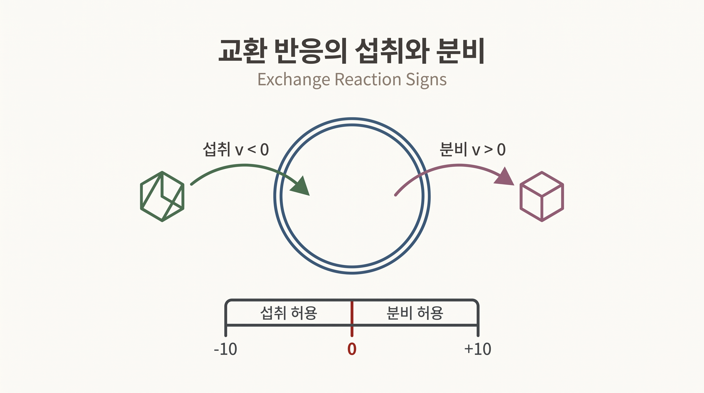
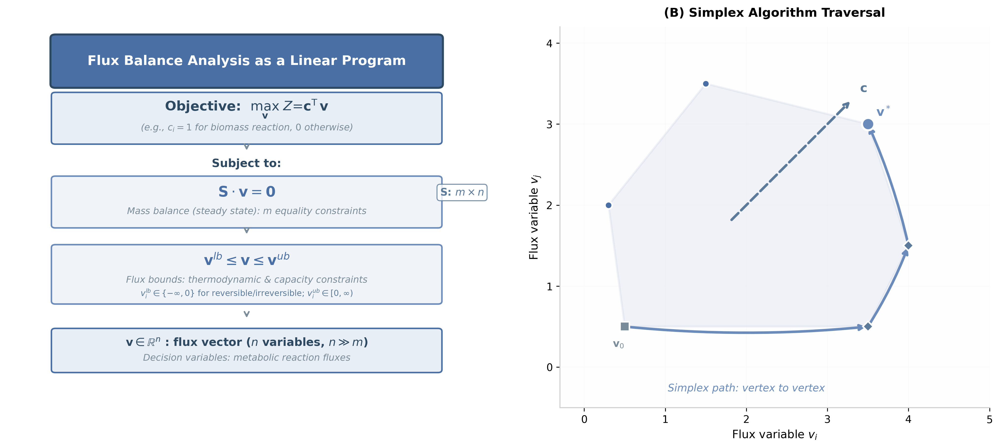

# 2. 배지와 반응 방향을 경계조건으로 옮긴다

## 2.1 교환 반응이 배지를 연결한다

교환 반응(exchange reaction)은 모델과 세포외 환경 사이의 물질 이동을 나타낸다. COBRA 모델에서 흔히 사용하는 부호 규약에서는 교환 플럭스가 음수이면 세포가 물질을 섭취하고, 양수이면 분비한다. 따라서 포도당 교환 반응 `EX_glc__D_e`의 하한을 `-10`으로 두면 포도당을 최대 10 mmol·gDW$$^{-1}$$·h$$^{-1}$$까지 섭취하도록 허용한다.



_그림 4.3:_ 흔한 COBRA 교환 반응 부호 규약에서 음의 플럭스는 세포외 물질의 섭취, 양의 플럭스는 분비를 나타낸다. 부호는 반응식 정의에 의존하므로 모델별 확인이 필요하며, 수치는 설명을 위한 교육용 경계 도식이다. 저자 작성; 개념 근거: [COBRApy 공식 문서](https://opencobra.github.io/cobrapy/).

$$-10 \le v_{\mathrm{EX\_glc}} \le 1000$$

이 부호는 반응식 방향과 모델 convention에 의존한다. 새로운 모델에서는 반응식과 `reaction.bounds`를 함께 확인해야 한다.

```python
glc = model.reactions.EX_glc__D_e
print(glc.reaction)
print(glc.bounds)
```

## 2.2 배지 설정은 열고 닫는 목록이다

최소 배지를 지정할 때에는 먼저 어떤 영양소의 섭취가 열려 있는지 확인한다. 탄소원 하나만 비교하려면 다른 후보 탄소원의 섭취를 닫고, 비교 대상 하나만 연다.

```python
with model:
    model.reactions.EX_glc__D_e.lower_bound = -10
    model.reactions.EX_o2_e.lower_bound = -20
    solution = model.optimize()
```

`with model:` 블록은 내부에서 바꾼 경계를 블록 종료 후 복원한다. 조건 비교에서 이전 설정이 다음 계산으로 누출되는 것을 막는 기본 절차다.

배지 이름만으로는 계산 조건을 완전히 재현할 수 없다. “포도당 최소 배지”라고 적더라도 암모늄, 인산, 황산, 물, 양성자와 무기 이온의 교환 상태가 필요하다. 실제 보고에서는 열린 교환 반응 목록이나 배지 사전을 함께 보존한다.

## 2.3 내부 반응의 방향성

내부 반응의 하한과 상한은 허용 방향을 나타낸다.

| 경계 예 | 계산상 의미 |
|:---|:---|
| $$(0, 1000)$$ | 순방향만 허용 |
| $$(-1000, 1000)$$ | 양방향 허용 |
| $$(-1000, 0)$$ | 역방향만 허용 |
| $$(0, 0)$$ | 반응 차단 |

방향성은 반응 이름이나 화살표 모양만 보고 결정하지 않는다. 반응식, 열역학 자료, 구획, 수송 기작과 모델 큐레이션 근거를 함께 확인한다. 잘못 열린 역방향은 존재하지 않는 우회경로를 만들 수 있고, 잘못 닫힌 방향은 실제 성장 경로를 제거할 수 있다.

## 2.4 유전자 결손도 경계 변화다

유전자 결손은 GPR을 평가한 뒤 기능을 잃은 반응의 양방향 플럭스를 0으로 고정하는 방식으로 적용한다.

$$v_j=0 \quad\text{for each disabled reaction }j$$

이 조작은 새로운 반응을 추가하지 않는다. 결손 전 가능한 상태 가운데 해당 반응을 사용한 상태를 제거한다. 다만 WT에서 이미 플럭스가 0이던 반응을 막으면 계산 결과가 유지될 수 있다.



_그림 4.4:_ FBA가 목적함수를 선택 기준으로 사용하면서 물질수지와 배지·방향을 반영한 반응 범위를 동시에 만족해야 함을 나타낸다. 유전자 결손은 일부 반응 범위를 0으로 바꾸는 추가 조건이며, solver나 실제 GEM 수치를 사용하지 않은 저자 제작 모식도다. 저자 작성; 개념 근거: [Orth et al. (2010)](https://doi.org/10.1038/nbt.1614).

## 2.5 조건 설정의 점검 순서

1. 질문에 필요한 탄소원·전자수용체·무기 영양소를 정한다.
2. 교환 반응의 반응식과 부호를 확인한다.
3. 비교하지 않는 섭취 경로를 닫는다.
4. 내부 반응의 방향과 교란 반응을 확인한다.
5. 목적함수를 정한 뒤 WT가 실행 가능하고 성장하는지 먼저 계산한다.
6. 조건을 하나씩 바꾸어 대조군과 비교한다.


결손 모델이 `infeasible`이면 곧바로 “유전자가 치명적이다”라고 단정하지 않는다. 필수 영양소의 교환이 실수로 닫혔는지, 반응 방향이 뒤집혔는지, 바이오매스 반응과 유지에너지 조건이 적절한지 먼저 점검한다.


---
