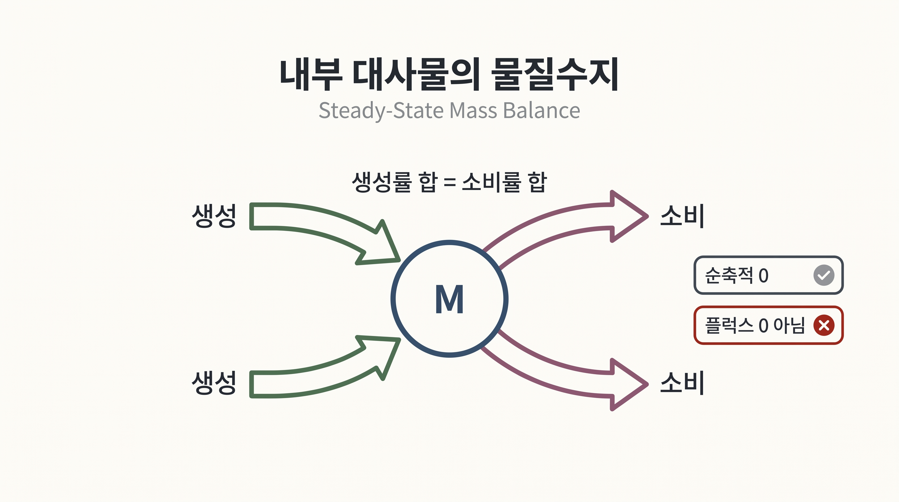
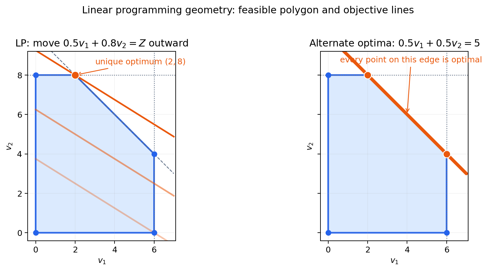

# 3. FBA의 최소 수식은 입력과 질문을 묶는다

## 3.1 물질수지

내부 대사물마다 생산률과 소비률이 같다는 조건을 행렬로 압축하면 다음과 같다.

$$\mathbf{S}\mathbf{v}=\mathbf{0}$$

_그림 4.5:_ 내부 대사물 $$M$$의 전체 생성률과 소비률이 같아 순축적이 0인 의사정상상태를 나타낸다. 개별 반응 플럭스가 0이라는 뜻은 아니며, 실제 GEM 계산이나 열역학적 평형을 표시하지 않은 교육용 모식도다. 저자 작성; 개념 근거: [Orth et al. (2010)](https://doi.org/10.1038/nbt.1614).

$$\mathbf{S}$$는 대사물과 반응의 화학량론 계수를 담은 행렬이고, $$\mathbf{v}$$는 반응 플럭스의 목록이다. 이 식은 모든 플럭스가 0이라는 뜻이 아니다. 각 내부 대사물에 대해 생성과 소비가 상쇄된다는 뜻이다.

의사정상상태는 관심 시간 척도에서 내부 대사물의 순축적을 무시하는 근사다. 배지 전환 직후, 저장 대사물 축적, 세포주기 변화처럼 내부 양이 빠르게 변하는 현상에는 적용 범위를 다시 평가해야 한다.

## 3.2 반응 경계

각 반응은 허용된 하한과 상한 안에서만 흐른다.

$$v_j^{lb}\le v_j\le v_j^{ub}$$

경계는 배지 섭취, 반응 방향, 측정한 용량 또는 분석자가 둔 가정을 나타낼 수 있다. 같은 숫자라도 근거가 다를 수 있으므로 경계의 출처를 기록한다.

## 3.3 목적함수

가능한 플럭스가 여러 개이면 분석자는 그중 어떤 상태를 고를지 목적을 지정한다.

$$\text{maximize}\quad Z=\mathbf{c}^{\mathsf T}\mathbf{v}$$

바이오매스 반응만 선택한 경우 $$Z$$는 계산 성장률로 해석할 수 있다. 생산물 교환 반응을 선택하면 $$Z$$는 계산 분비율이다. 목적함수의 의미가 바뀌면 같은 모델의 답도 바뀐다.

FBA 전체는 다음 한 문장으로 읽을 수 있다.

> 내부 대사물이 순축적되지 않고, 모든 반응이 지정한 경계 안에 있다는 조건에서, 선택한 목적값이 가장 큰 플럭스 상태를 찾는다.

## 3.4 장난감 네트워크로 읽는 흐름 배분

중간 대사물 $$M$$을 만드는 섭취 반응 $$v_0$$와 이를 소비하는 두 경로 $$v_1$$, $$v_2$$를 생각한다.

$$v_0=v_1+v_2,\qquad 0\le v_0\le10$$

경로 상한이 $$v_1\le6$$, $$v_2\le8$$이고 경로 2가 목적에 더 크게 기여한다면, 솔버는 먼저 경로 2를 사용하고 남은 공급을 경로 1에 배분할 수 있다. 이 결과는 설정한 경계와 목적계수의 산물이다. 실제 세포가 경로 2를 선호한다는 보편적 사실로 해석하지 않는다.

## 3.5 여러 해가 남을 수 있다

최적 목적값이 하나여도 그 값을 만드는 플럭스 분포는 여러 개일 수 있다. 병렬 경로가 같은 목적 기여를 가지면 솔버는 그중 한 분배를 반환하지만, 다른 분배도 같은 성장률을 만들 수 있다.

_그림 4.6:_ 가로축 $$v_1$$과 세로축 $$v_2$$는 두 병렬 경로의 플럭스다. 왼쪽은 경로별 목적 기여가 달라 한 분배가 선택되는 경우, 오른쪽은 두 경로의 목적 기여가 같아 경계선 위 여러 분배가 같은 목적값을 만드는 경우를 나타낸다. 본문의 장난감 경계로 만든 교육용 기하 도식이며 solver나 실제 GEM 계산 결과가 아니다. 저자 작성; 개념 근거: [Mahadevan & Schilling (2003)](https://doi.org/10.1016/j.ymben.2003.09.002).

이 비유일성은 오류가 아니다. [8절](08.md)의 pFBA는 보조 가정을 더해 대표 해를 고르고, [9절](09.md)의 FVA는 관심 반응이 가질 수 있는 범위를 계산한다.


솔버 내부 알고리즘의 유도는 FBA 결과를 생물학적으로 읽는 데 필수 조건이 아니다. 이 장에서는 모델 입력과 출력 검증에 집중한다.


---
