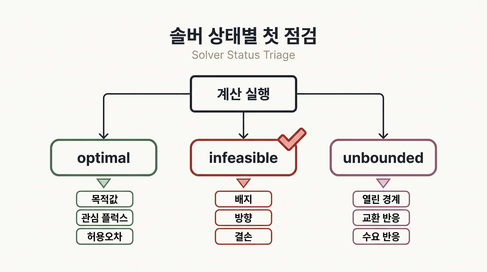
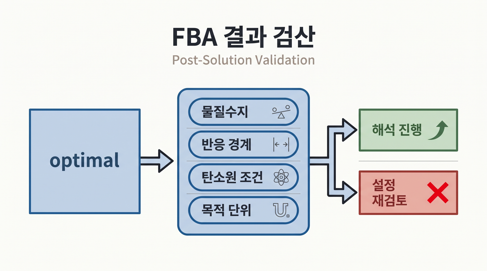

# 4. 솔버 결과는 상태부터 검산한다

## 4.1 솔버의 역할

솔버는 물질수지, 반응 경계와 목적함수를 받아 수치 해를 계산하는 엔진이다. COBRApy는 optlang 인터페이스를 통해 GLPK, Gurobi, CPLEX와 같은 솔버를 연결한다. 이 장의 FBA, pFBA와 FVA는 선형계획 문제이며 교육용 `textbook` 모델은 GLPK로 실행할 수 있다.

솔버 알고리즘의 내부 유도는 이 장의 범위를 벗어난다. 분석자가 확인할 핵심은 다음 세 가지다.

1. 문제가 실행 가능한가
2. 목적값이 유한하고 최적 상태가 보고되었는가
3. 계산된 플럭스가 물질수지와 경계를 만족하는가

## 4.2 상태 메시지

| 상태 | 계산상 의미 | 우선 점검 항목 |
|:---|:---|:---|
| `optimal` | 허용오차 안에서 최적해를 찾음 | 목적값과 관심 플럭스의 생물학적 의미 |
| `infeasible` | 모든 제약을 동시에 만족하는 해가 없음 | 배지, 반응 방향, 유지에너지, 결손 범위 |
| `unbounded` | 목적값을 제한 없이 개선할 수 있음 | 열린 경계, 잘못된 교환·수요 반응 |
| 기타·미정 | 제한 시간 또는 수치 문제 가능 | 솔버 로그, 허용오차, 모델 스케일 |



_그림 4.7:_ 솔버가 `optimal`, `infeasible`, `unbounded`를 보고했을 때 각각 목적값·관심 플럭스, 배지·방향·결손, 열린 경계·교환 반응을 우선 점검하는 진단 흐름이다. 특정 솔버 로그나 성능 측정이 아닌 절차 모식도다. 저자 작성; 개념 근거: [COBRApy 공식 문서](https://opencobra.github.io/cobrapy/).

`optimal`만 확인하고 분석을 끝내면 안 된다. 물이나 양성자 같은 경계 대사물이 비정상적으로 생성되는지, 탄소원이 닫힌 조건에서 성장하는지, 목적 반응의 단위가 의도한 것과 같은지 확인해야 한다.

## 4.3 최소 검산

```python
solution = model.optimize()
print(solution.status)
print(solution.objective_value)

if solution.status == "optimal":
    print(solution.fluxes[["EX_glc__D_e", "EX_o2_e", "Biomass_Ecoli_core"]])
```



_그림 4.8:_ 최적 상태를 얻은 뒤 물질수지, 반응 경계, 탄소원 조건과 목적 단위를 검산하여 해석 진행 또는 설정 재검토로 분기하는 절차다. 실제 모델의 합격·실패 판정을 표시하지 않은 교육용 점검 도식이다. 저자 작성; 개념 근거: [COBRApy 공식 문서](https://opencobra.github.io/cobrapy/).

플럭스 값에는 작은 수치 오차가 남을 수 있다. 예를 들어 이론상 0인 값이 $$10^{-12}$$ 수준으로 보고될 수 있다. 활성·비활성 판정에는 명시한 허용오차를 사용한다.

```python
tolerance = 1e-9
active = solution.fluxes[solution.fluxes.abs() > tolerance]
```

허용오차는 생물학적 검출한계가 아니다. 솔버의 수치 결과를 분류하기 위한 계산 기준이다.

## 4.4 비교 계산의 통제

두 조건을 비교할 때는 변경한 항목을 코드로 분명히 남긴다.

```python
baseline = model.optimize()

with model:
    model.reactions.EX_o2_e.lower_bound = 0
    no_oxygen = model.optimize()
```

이 비교에서 달라진 것은 산소 섭취 경계 하나다. 목적함수나 포도당 상한까지 동시에 바꾸면 산소 효과만 분리해 해석할 수 없다.

## 4.5 오류를 생물학적 발견으로 오독하지 않는다

무성장 결과는 실제 생물학적 필수성, 불완전한 모델, 잘못 닫힌 배지 또는 GPR 오류에서 모두 발생할 수 있다. 반대로 예상 밖의 성장은 실제 우회경로, 잘못 열린 반응 방향, 누락된 조절 또는 에너지 생성 순환에서 발생할 수 있다. 계산 결과는 원인 후보를 좁히는 진단이지 원인을 자동으로 확정하는 증거가 아니다.


솔버를 바꾸었을 때 최적 목적값은 허용오차 안에서 같더라도 반환된 개별 플럭스는 달라질 수 있다. 대안 최적해가 있는 모델에서는 관심 반응을 FVA로 확인한다.


---
