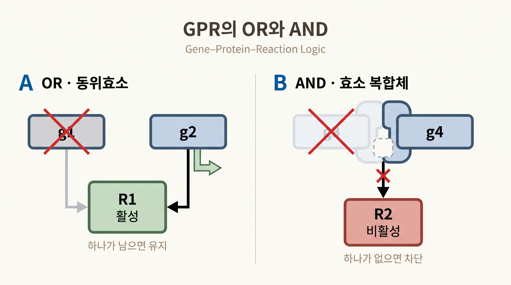
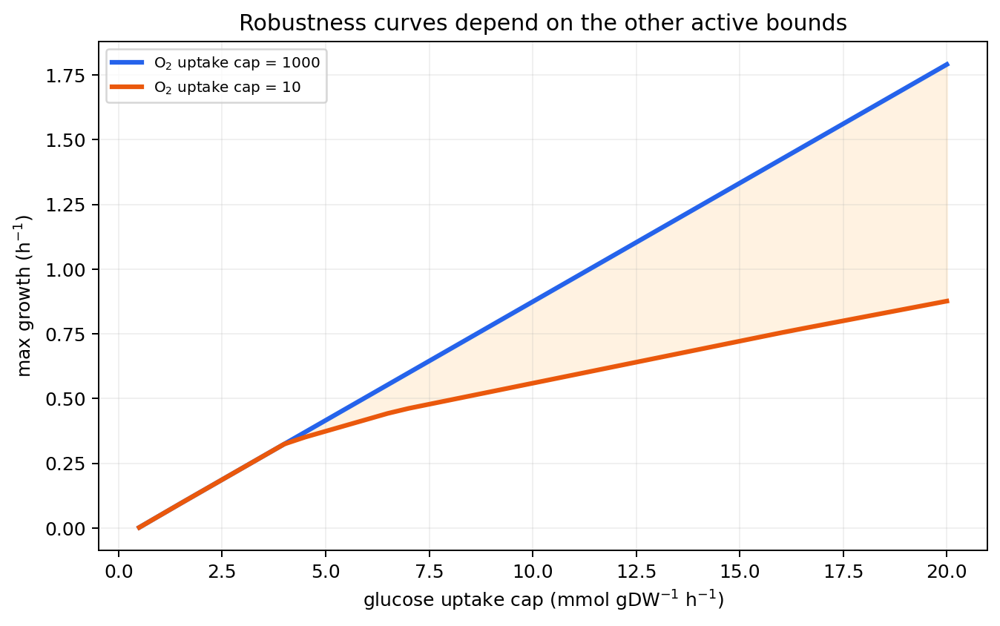

# 5. 유전자 교란을 반응 결손과 표현형 예측으로 연결한다

## 5.1 유전자 결손은 GPR을 거친다

유전자 하나를 제거했다고 그 유전자가 등장하는 모든 반응이 자동으로 꺼지는 것은 아니다. GPR의 전체 논리식을 평가해야 한다.

| GPR | 생물학적 구조 | 단일 결손의 효과 |
|:---|:---|:---|
| `geneA` | 효소 기능을 한 유전자가 담당 | `geneA` 결손 시 반응 차단 |
| `geneA or geneB` | 두 동위효소 중 하나가 기능 유지 | 둘 중 하나만 남아도 반응 유지 |
| `geneA and geneB` | 두 소단위가 모두 필요한 복합체 | 하나만 없어도 반응 차단 |
| `(geneA and geneB) or geneC` | 복합체 경로와 대체 효소가 공존 | 두 분기가 모두 실패해야 차단 |



_그림 4.9:_ `g1 or g2` 동위효소 규칙에서는 한 유전자가 남으면 반응이 유지되지만, `g3 and g4` 효소 복합체 규칙에서는 한 소단위 유전자 결손만으로 반응이 차단됨을 비교한다. 임의 유전자와 반응을 사용한 GPR 교육용 모식도다. 저자 작성; 개념 근거: [COBRApy 공식 문서](https://opencobra.github.io/cobrapy/).

결손 유전자를 `False`, 나머지를 `True`로 바꾼 뒤 식 전체가 `False`인 반응만 $$(0,0)$$ 경계로 바꾼다.

## 5.2 손으로 평가하는 두 사례

`R1: g1 or g2`에서 `g1`만 결손하면 `False or True`이므로 `R1`은 유지된다. `g1`과 `g2`를 함께 결손해야 `R1`이 차단된다.

`R2: g3 and g4`에서 `g3`만 결손하면 `False and True`이므로 `R2`가 차단된다. 동위효소의 `or`와 효소 복합체의 `and`는 결손 반응을 정반대로 바꾼다.

`textbook` 모델의 `PYK` 반응은 `b1854 or b1676` 규칙을 가진다. 따라서 `b1676`만 결손해도 다른 동위효소가 남아 반응이 유지될 수 있다.

```python
print(model.reactions.PYK.gene_reaction_rule)

with model:
    model.genes.get_by_id("b1676").knock_out()
    print(model.reactions.PYK.bounds)
```

## 5.3 반응 결손과 성장 결손은 다르다

GPR 평가는 어떤 반응이 꺼지는지 알려 준다. 그 반응 결손이 성장을 막는지는 네트워크 전체의 우회경로와 배지가 결정한다.

- 대체 반응이나 동위효소가 있으면 성장률이 유지될 수 있다.
- 같은 산물을 공급하는 우회경로가 있지만 비효율적이면 성장률이 감소할 수 있다.
- 유일한 생합성 경로가 차단되고 배지에서도 산물을 얻지 못하면 무성장이 될 수 있다.

따라서 **반응 비활성화**, **예측 성장 감소**, **실험적 필수성**을 같은 말로 쓰지 않는다.

## 5.4 단일 유전자 결손 예측

WT와 각 결손의 계산 성장률 비율을 사용하면 조건부 필수성을 분류할 수 있다.

$$r_g=\frac{\mu_{\text{KO},g}}{\mu_{\text{WT}}}$$

$$r_g$$는 무차원 비율이며, $$\mu$$는 같은 모델·배지·목적함수에서 계산한 성장률이다. 필수성 임계값은 연구에서 명시해야 한다.

```python
from cobra.flux_analysis import single_gene_deletion

wt_growth = model.slim_optimize()
deletions = single_gene_deletion(model, processes=1)
deletions["growth_ratio"] = deletions["growth"].fillna(0) / wt_growth
essential = deletions[deletions["growth_ratio"] < 0.01]
```

`0.01`은 계산 분류 기준이지 생물학적 보편 상수가 아니다. 느린 성장과 무성장을 구분하는 실험 검출한계도 별도로 고려한다.

## 5.5 필수성은 배지에 의존한다

아미노산 생합성 유전자는 해당 아미노산이 없는 최소 배지에서 필수로 예측될 수 있다. 같은 아미노산의 섭취 반응을 연 풍부 배지에서는 외부 공급이 우회로가 되어 비필수로 바뀔 수 있다. 필수성은 유전자의 고정 표지가 아니라 **유전자×환경×목적함수** 조합의 결과다.

실험 결손 자료와 불일치할 때에는 다음 원인을 구분한다.

1. 실제 배지와 모델 배지의 차이
2. GPR의 누락 또는 `and`·`or` 오배정
3. 누락된 반응이나 잘못 열린 우회경로
4. 조절, 효소 용량과 동역학의 생략
5. 실험의 성장 판정 기준과 시간 척도



_그림 4.10:_ COBRApy 0.30.0 `textbook` 모델에서 포도당 섭취 상한을 0.5~20 mmol·gDW$$^{-1}$$·h$$^{-1}$$ 범위의 40개 점으로 바꾸고, 산소 섭취 상한 1000과 10에서 각각 바이오매스 목적을 GLPK로 최적화한 계산 결과다. 배지 경계가 달라지면 결손 전 기준 성장 상태도 달라지므로 필수성 스크리닝에 동일한 배지 계약이 필요하며, 이 곡선 자체는 유전자 결손 결과가 아니다. 출처: 저자 계산; 생성: `scripts/generate_optimization_figures.py`의 `draw_robustness_curve()`; 모델 개념 근거: [Orth et al. (2010)](https://doi.org/10.1128/ecosalplus.10.2.1).

## 5.6 FBA 결손 예측의 질문

결손 모델에 FBA를 적용하면 “이 결손 세포가 새 제약 아래에서 목적을 다시 최적화했을 때 달성 가능한 값”을 계산한다. 교란 직후의 실제 상태나 적응 속도를 직접 계산하지 않는다. 이 차이를 다루기 위해 [11절](11.md)의 MOMA와 [12절](12.md)의 ROOM을 별도 상태 선택 가설로 비교한다.


FBA가 예측한 무성장은 해당 모델·배지에서 성장 가능한 플럭스가 없다는 뜻이다. 실제 세포 사멸을 확정하려면 균주, 배지, 배양 시간과 실험 검출한계를 맞춘 검증이 필요하다.


유전자 결손과 필수성의 고전적 계산 틀은 [Edwards와 Palsson (2000)](https://doi.org/10.1021/bp0000712)에, GPR을 포함한 현대 COBRApy 실행은 [COBRApy 공식 문서](https://opencobra.github.io/cobrapy/)에 정리되어 있다.

---
