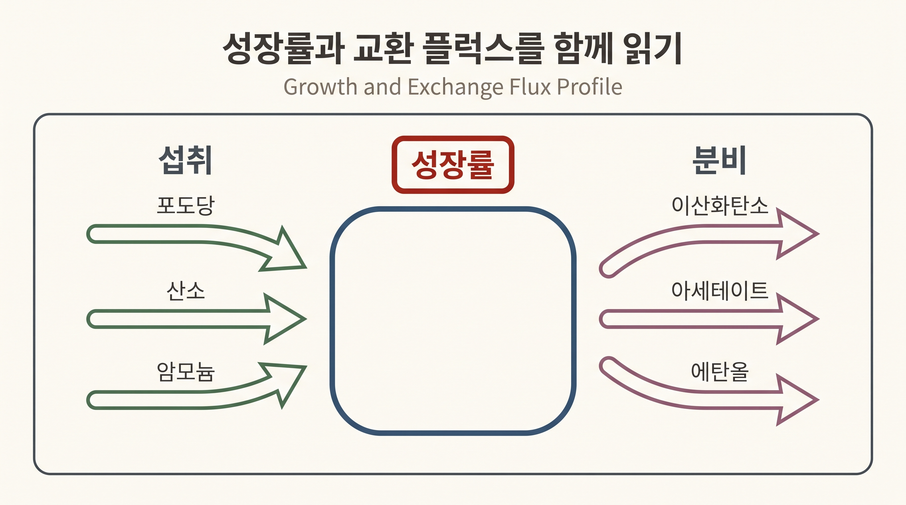
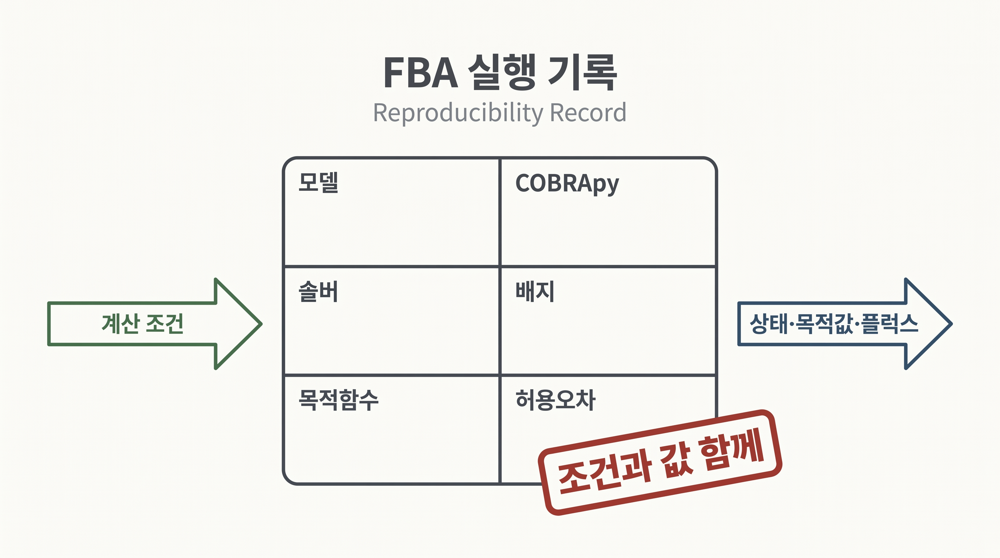

# 6. COBRApy로 기준 FBA를 실행한다

## 6.1 모델과 계산 조건을 확인한다

```python
import cobra
from cobra.io import load_model

model = load_model("textbook")
model.solver = "glpk"

print(len(model.reactions), len(model.metabolites), len(model.genes))
print(model.objective.expression)
print(model.medium)
```

COBRApy 0.30.0의 `textbook` 모델은 교육용 `e_coli_core`다. 출력된 반응·대사물·유전자 수는 이 모델 릴리스의 속성이며 *E. coli* 전체의 고정된 수가 아니다.

## 6.2 기준 FBA를 계산한다

```python
solution = model.optimize()

print("status:", solution.status)
print("objective:", solution.objective_value)
print(solution.fluxes[[
    "EX_glc__D_e",
    "EX_o2_e",
    "Biomass_Ecoli_core",
    "EX_ac_e",
]])
```

바이오매스 반응이 목적함수이면 `objective_value`를 계산 성장률로 읽을 수 있다. `textbook` 모델의 기본 배지·경계와 바이오매스 목적함수를 COBRApy 0.30.0과 GLPK로 풀면 약 $$0.874$$ h$$^{-1}$$이 계산된다. 이 값은 균주의 실험 성장률이 아니라 명시한 모델 조건의 예측이다.

## 6.3 섭취와 분비를 함께 읽는다

성장률 하나만 보면 탄소와 전자의 흐름을 확인할 수 없다. 포도당과 산소 섭취, 이산화탄소와 발효 부산물 분비를 함께 읽어야 한다.

```python
exchange_ids = [
    "EX_glc__D_e", "EX_o2_e", "EX_co2_e",
    "EX_ac_e", "EX_etoh_e", "EX_for_e",
]
print(solution.fluxes[exchange_ids])
```



_그림 4.12:_ 성장률과 함께 포도당·산소·암모늄 섭취 및 이산화탄소·아세테이트·에탄올 분비를 읽는 결과 점검 틀이다. 화살표는 교환 방향만 나타내며 폭이나 길이는 실제 플럭스 크기를 뜻하지 않는 교육용 모식도다. 저자 작성; 개념 근거: [Orth et al. (2010)](https://doi.org/10.1038/nbt.1614).

모델의 부호 규약에서 음수 교환 플럭스는 섭취, 양수는 분비를 나타낸다. 다른 모델이나 반응 정의를 사용할 때는 반응식을 다시 확인한다.

## 6.4 `summary()`를 진단에 사용한다

```python
print(model.summary(solution=solution))
```

요약 표는 주요 유입, 유출과 목적값을 빠르게 점검하는 도구다. 예상하지 않은 영양소 섭취나 부산물 분비가 보이면 배지 사전과 교환 반응 경계를 확인한다. 요약 표가 인과 기전이나 유일한 내부 경로를 보여 주는 것은 아니다.

## 6.5 결과 계약을 저장한다

계산 노트에는 다음 값을 남긴다.

```python
run_record = {
    "model": "COBRApy textbook / e_coli_core",
    "cobrapy": cobra.__version__,
    "solver": model.solver.interface.__name__,
    "objective": str(model.objective.expression),
    "medium": dict(model.medium),
    "status": solution.status,
    "objective_value": float(solution.objective_value),
}
```



_그림 4.11:_ 모델, COBRApy, 솔버, 배지, 목적함수와 허용오차를 계산 결과와 함께 보존하는 재현 기록 구조다. 특정 버전이나 수치를 채우지 않은 기록 양식 모식도이며 실제 실행 화면이 아니다. 저자 작성; 구현 근거: [COBRApy 공식 문서](https://opencobra.github.io/cobrapy/).

솔버 세부 버전과 허용오차를 얻을 수 있으면 함께 기록한다. 재현 계약이 없으면 숫자가 달라졌을 때 모델, 배지, 솔버 중 무엇이 원인인지 판단하기 어렵다.


한 플럭스 벡터는 솔버가 반환한 최적해 하나다. 병렬 경로의 다른 최적 분배가 있는지는 [9절](09.md)의 FVA로 확인한다.


---
