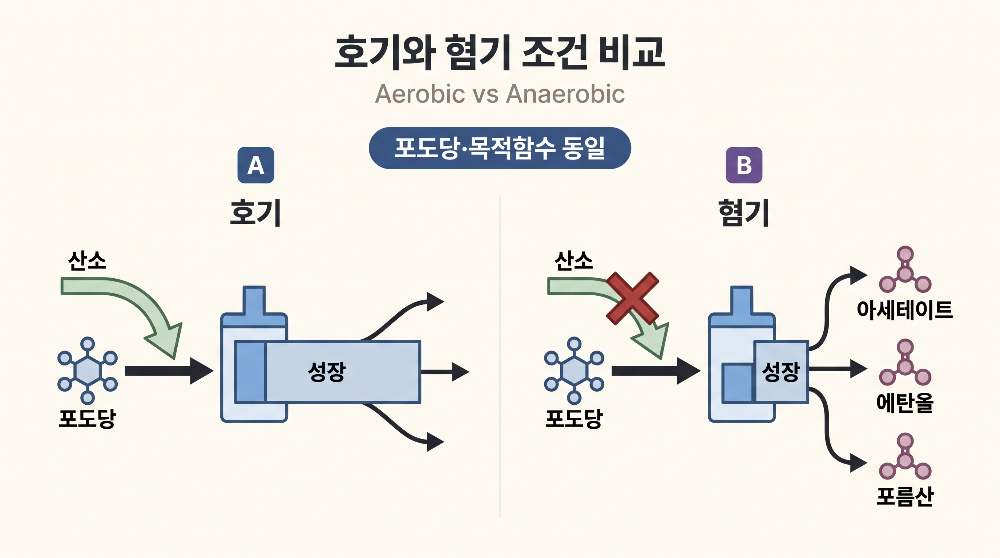
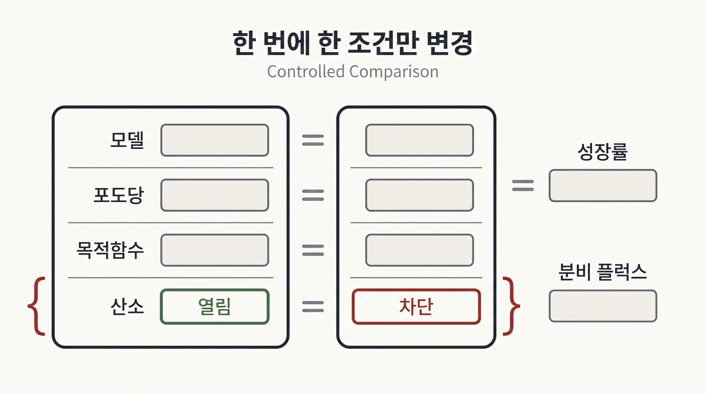

# 7. 배지와 목적함수를 바꾸어 가설을 비교한다

## 7.1 산소만 바꾸는 대조 실험

산소 효과를 분리하려면 포도당과 목적함수를 유지하고 산소 섭취만 차단한다.

```python
aerobic = model.optimize()

with model:
    model.reactions.EX_o2_e.lower_bound = 0
    anaerobic = model.optimize()

print("aerobic growth:", aerobic.objective_value)
print("anaerobic growth:", anaerobic.objective_value)
print("anaerobic products:")
print(anaerobic.fluxes[["EX_ac_e", "EX_etoh_e", "EX_for_e"]])
```



_그림 4.13:_ 포도당 경계와 목적함수를 유지한 채 산소 섭취만 허용하거나 차단했을 때 성장과 발효 부산물 예측을 비교하는 대조 설계다. 성장 막대와 분비 화살표는 정성적 경향을 설명하며 실제 `textbook` 계산값이나 실험 관찰이 아니다. 저자 작성; 개념 근거: [Varma & Palsson (1994)](https://doi.org/10.1128/AEM.60.10.3724-3731.1994).

혐기 조건에서는 산소를 전자수용체로 사용할 수 없으므로 모델이 허용하는 발효 경로와 부산물 분비가 달라질 수 있다. 정확한 수치는 포도당 상한, 유지에너지와 모델 구성에 의존한다.

## 7.2 탄소원을 하나씩 비교한다

탄소원 효율을 비교할 때에는 후보 섭취를 모두 닫은 뒤 한 번에 하나만 연다.

```python
carbon_sources = ["EX_glc__D_e", "EX_succ_e", "EX_ac_e", "EX_pyr_e"]

with model:
    for reaction_id in carbon_sources:
        model.reactions.get_by_id(reaction_id).lower_bound = 0

    for reaction_id in carbon_sources:
        with model:
            model.reactions.get_by_id(reaction_id).lower_bound = -10
            growth = model.slim_optimize(error_value=float("nan"))
            print(reaction_id, growth)
```

같은 10 mmol·gDW$$^{-1}$$·h$$^{-1}$$ 상한은 같은 탄소 원자 수나 같은 에너지 공급을 뜻하지 않는다. 이 비교는 “같은 몰 섭취 상한을 허용했을 때 모델의 화학량론적 성장 예측”이다. 실제 수송 속도와 배양 성장률의 공정한 비교에는 기질별 측정값과 탄소 기준 정규화가 필요하다.

## 7.3 목적함수도 가설이다

```python
with model:
    model.objective = "EX_ac_e"
    acetate_max = model.optimize()

print(acetate_max.objective_value)
```

생산물 분비를 최대화하면 세포 성장을 포기한 해가 선택될 수 있다. 산업적 질문이라면 최소 성장률을 유지하도록 별도 조건을 두거나 성장-생산 절충을 분석해야 한다. 목적함수를 바꾸었다는 사실을 숨긴 채 결과를 “세포의 예측 상태”라고 부르면 안 된다.

## 7.4 조건 비교표

조건별로 적어도 다음 열을 나란히 둔다.

| 조건 | 탄소원 경계 | 산소 경계 | 목적함수 | 성장률 | 주요 분비물 | 상태 |
|:---|:---|:---|:---|---:|:---|:---|
| 기준 | 명시 | 명시 | 바이오매스 | 계산값 | 계산값 | solver 상태 |
| 산소 차단 | 기준과 동일 | 0 | 기준과 동일 | 계산값 | 계산값 | solver 상태 |
| 탄소원 교체 | 새 경계 | 기준과 동일 | 기준과 동일 | 계산값 | 계산값 | solver 상태 |



_그림 4.14:_ 모델, 포도당 경계와 목적함수를 동일하게 유지하고 산소 경계 하나만 바꾸어 성장률과 분비 플럭스 차이를 연결하는 통제 비교다. 특정 배지나 수치를 표시하지 않은 실험 설계 모식도다. 저자 작성; 개념 근거: [Orth et al. (2010)](https://doi.org/10.1038/nbt.1614).

표의 차이는 바꾼 입력과 연결해 해석한다. 결과 차이가 작다고 생물학적 영향이 없다고 단정하지 않는다. 성장률 외 플럭스 분포와 실험 endpoint가 달라질 수 있다.

## 7.5 목적함수의 타당성을 검증한다

바이오매스 최대화는 특정 성장 조건에서 유용한 가설이지만 단일한 보편 목적은 아니다. 여러 목적함수를 $$^{13}$$C 플럭스 자료와 비교한 연구는 조건에 따라 적합한 목적이 달라질 수 있음을 보였다([Schuetz et al., 2007](https://doi.org/10.1038/msb4100162)). 목적함수는 관측 자료와 비교하여 선택하거나 민감도 분석 대상으로 남긴다.


배지와 목적함수를 함께 바꾸면 원인 해석이 섞인다. 한 번에 한 조건을 바꾼 분석과 모든 조건을 명시한 비교표를 기본으로 사용한다.


---
