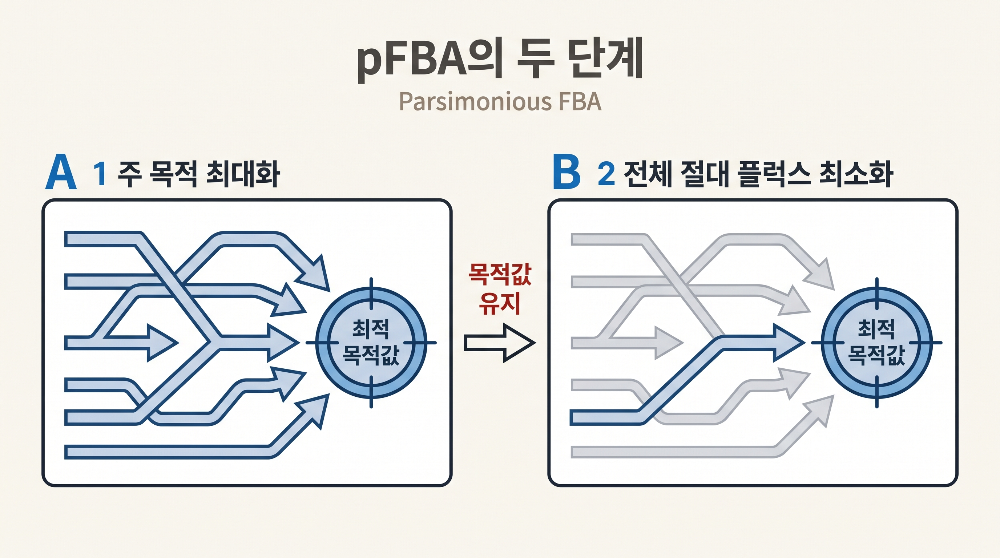
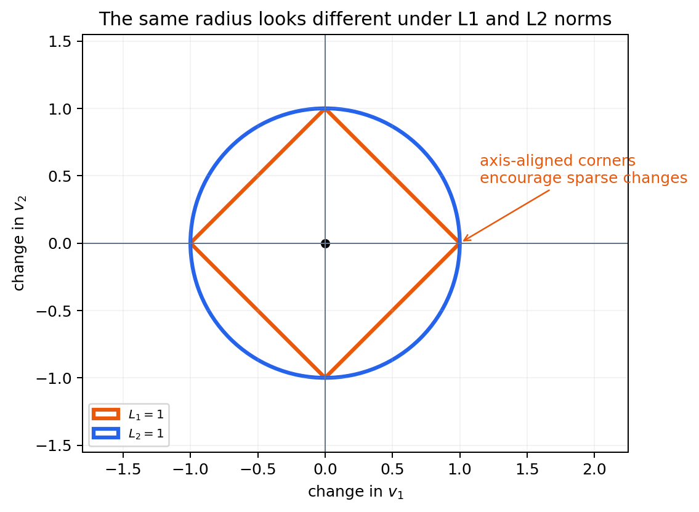

# 8. pFBA는 같은 목적값에서 대표 해를 고른다

## 8.1 표준 FBA 한 해의 한계

표준 FBA는 최적 목적값과 그 값을 만드는 플럭스 벡터 하나를 반환한다. 병렬 경로가 같은 목적값을 만들 수 있으면 다른 플럭스 벡터도 똑같이 최적일 수 있다. 솔버가 반환한 경로 하나를 세포가 실제로 사용하는 유일한 경로로 읽으면 안 된다.

## 8.2 pFBA의 질문

**절약형 플럭스 균형 분석(parsimonious FBA, pFBA)**은 두 질문을 순서대로 묻는다([Lewis et al., 2010](https://doi.org/10.1038/msb.2010.47)).

1. 주 목적값의 최댓값은 얼마인가
2. 그 목적값을 유지하는 상태 중 전체 절대 플럭스가 가장 작은 대표 해는 무엇인가



_그림 4.15:_ pFBA가 먼저 주 목적값을 최대화한 뒤 그 값을 유지하면서 전체 절대 플럭스가 작은 대표 해를 고르는 두 단계를 나타낸다. 효소 질량이나 실제 세포 자원 사용량을 직접 계산한 그림이 아닌 방법 모식도다. 저자 작성; 개념 근거: [Lewis et al. (2010)](https://doi.org/10.1038/msb.2010.47).

두 번째 기준은 다음처럼 요약한다.

$$\text{minimize}\quad \sum_j |v_j| \quad\text{while maintaining the primary objective}$$

이 식은 모든 반응을 같은 단위 가중치로 더한다. 효소의 분자량, 촉매율과 실제 발현량을 반영하지 않으므로 효소 질량이나 단백질체 비용과 동일하지 않다.



_그림 4.16:_ 두 플럭스 성분에서 절대값 합이 같은 점은 마름모, 제곱합이 같은 점은 원으로 나타난다. pFBA는 절대 플럭스 합을, quadratic MOMA는 WT와의 제곱 거리를 사용한다는 차이를 설명하기 위한 임의 좌표의 교육용 기하 도식이며 실제 GEM 계산 결과가 아니다. 저자 작성; 개념 근거: [Lewis et al. (2010)](https://doi.org/10.1038/msb.2010.47), [Segrè et al. (2002)](https://doi.org/10.1073/pnas.232349399).

## 8.3 COBRApy 실행

```python
from cobra.flux_analysis import pfba

fba_solution = model.optimize()
pfba_solution = pfba(model)

biomass_id = "Biomass_Ecoli_core"
print("FBA growth:", fba_solution.fluxes[biomass_id])
print("pFBA growth:", pfba_solution.fluxes[biomass_id])
print("pFBA total absolute flux:", pfba_solution.fluxes.abs().sum())
```

성장 목적을 사용하면 FBA와 pFBA의 바이오매스 플럭스는 허용오차 안에서 같아야 한다. pFBA가 바꾸는 것은 주 목적의 최적값이 아니라 대표 플럭스 분포다.

## 8.4 pFBA 결과의 해석

pFBA는 다음 상황에서 유용하다.

- 목적에 기여하지 않는 순환 플럭스가 한 FBA 해에 포함될 수 있을 때
- 같은 성장률을 만드는 해 가운데 비교할 대표 해가 필요할 때
- MOMA와 ROOM에 계산 기준 플럭스를 제공해야 할 때

그러나 다음을 보장하지 않는다.

- 대표 해의 생물학적 유일성
- 열역학적으로 가능한 모든 방향
- 실제 효소 사용량의 최소화
- 대안 최적해의 완전한 제거

주 목적과 총 절대 플럭스가 모두 같은 해가 여러 개면 pFBA도 비유일할 수 있다.

## 8.5 pFBA와 유전자 교란

결손 전 pFBA 해는 [11절](11.md)의 MOMA와 [12절](12.md)의 ROOM에서 WT 기준 플럭스로 사용할 수 있다. 이때 pFBA는 실측 WT 플럭스의 대체값일 뿐이다. 기준 해를 바꾸면 교란 예측도 달라질 수 있으므로 가능한 경우 $$^{13}$$C-MFA 자료나 여러 WT 해에 대한 민감도 분석을 함께 사용한다.


pFBA에서 반응 플럭스가 0이라고 해서 그 반응 유전자가 비필수라는 뜻은 아니다. 현재 대표 해가 그 반응을 사용하지 않았다는 뜻이며, 다른 배지나 교란에서는 필요할 수 있다.


---
