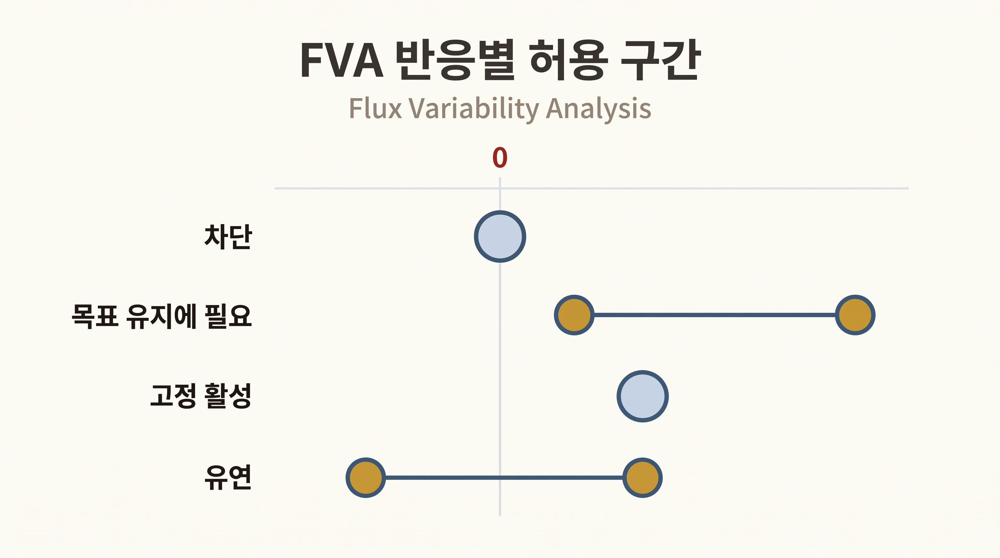
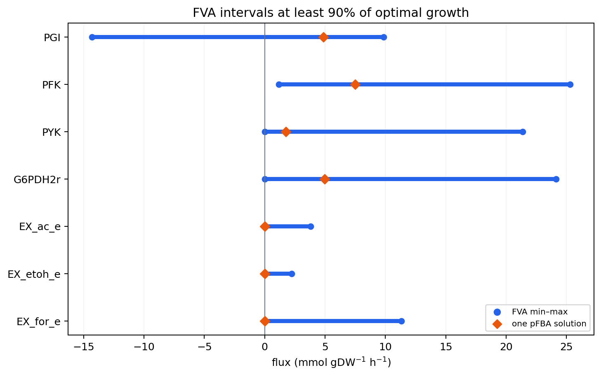

# 9. FVA는 한 반응이 움직일 수 있는 범위를 계산한다

## 9.1 FVA의 질문

**플럭스 가변성 분석(Flux Variability Analysis, FVA)**은 지정한 목적 수준을 유지하면서 각 반응의 최소·최대 플럭스를 따로 계산한다([Mahadevan & Schilling, 2003](https://doi.org/10.1016/j.ymben.2003.09.002)).

$$v_j^{min}\le v_j\le v_j^{max}\quad\text{at a specified objective level}$$

`fraction_of_optimum=1.0`은 최적 목적값을 유지하는 범위를, `0.9`는 최적값의 90% 이상을 유지하는 범위를 묻는다. 이 비율은 분석 설정이며 생물학적 자연상수가 아니다.

## 9.2 COBRApy 실행

```python
from cobra.flux_analysis import flux_variability_analysis

fva = flux_variability_analysis(
    model,
    fraction_of_optimum=0.9,
    processes=1,
)
fva["width"] = fva["maximum"] - fva["minimum"]
print(fva.loc[["EX_glc__D_e", "PGI"]])
```

반응마다 최소화와 최대화를 별도로 수행하므로 FVA는 표준 FBA보다 많은 계산을 요구한다. 작은 모델에서는 `processes=1`이 프로세스 생성 오버헤드를 피할 수 있다. 큰 모델에서는 병렬화와 솔버 설정을 기록한다.

## 9.3 구간의 생물학적 분류

| FVA 구간 | 조건부 해석 |
|:---|:---|
| $$[0,0]$$ | 현재 모델·배지·목적 수준에서 차단됨 |
| 0을 포함하지 않음 | 지정한 목적 수준을 유지하려면 반응이 필요함 |
| 최소와 최대가 같은 비영 값 | 해당 목적 수준에서 사실상 고정 활성 |
| 폭이 큼 | 허용 해 사이에서 유연하게 변할 수 있음 |



_그림 4.17:_ 지정한 목적 수준에서 FVA 구간이 $$[0,0]$$인 차단 반응, 0을 포함하지 않는 필요 반응, 비영 고정 활성 반응과 폭이 넓은 유연 반응의 전형을 나타낸다. 구간은 통계적 신뢰구간이 아니며 실제 반응 수치를 사용하지 않은 교육용 도식이다. 저자 작성; 개념 근거: [Mahadevan & Schilling (2003)](https://doi.org/10.1016/j.ymben.2003.09.002).

이 분류는 유전자 필수성과 다르다. 필수성은 유전자를 결손한 뒤 성장률이 임계값 아래로 떨어지는지 계산해야 한다. FVA에서 0을 포함하지 않는 반응도 동위효소 GPR 때문에 특정 단일 유전자는 비필수일 수 있다.

## 9.4 FVA 구간은 공동 플럭스 벡터가 아니다

각 반응의 최소와 최대는 서로 다른 최적화 문제에서 얻는다. 모든 반응이 동시에 각자의 최대값을 갖는 하나의 세포 상태가 존재한다는 뜻이 아니다. 반응 간 공동 변동이 필요하면 플럭스 결합 분석이나 샘플링과 같은 별도 방법을 사용한다.

## 9.5 FVA 구간은 신뢰구간이 아니다

FVA에는 측정오차나 확률 모형이 들어 있지 않다. 따라서 구간 폭은 통계적 불확실성이 아니라 지정한 제약과 목적 임계값 아래의 가능 범위다. $$^{13}$$C-MFA의 신뢰구간과 비교할 수는 있지만 같은 의미로 부르면 안 된다.

## 9.6 pFBA와 FVA를 함께 읽는다

pFBA 점이 FVA 구간 안에 있는지 확인하면 대표 해와 허용 범위를 구분할 수 있다. pFBA 점은 한 가능한 상태이고, FVA는 반응별 가능한 경계다. 보고서에는 대표값만 제시하기보다 중요한 반응의 FVA 구간을 함께 제시한다.



_그림 4.18:_ COBRApy 0.30.0 `textbook` 모델의 기본 배지와 바이오매스 목적함수에서 최적 성장률의 90% 이상을 유지하도록 하고, GLPK와 `processes=1`로 선택 반응의 FVA 최소·최대와 한 pFBA 해를 계산한 결과다. 선은 반응별로 서로 다른 최적화에서 얻은 구간이고 마름모는 한 대표값이므로, 모든 끝점이 동시에 나타나는 공동 상태나 통계적 신뢰구간을 뜻하지 않는다. 출처: 저자 계산; 생성: `scripts/generate_optimization_figures.py`의 `draw_fva_intervals()`; 개념 근거: [Mahadevan & Schilling (2003)](https://doi.org/10.1016/j.ymben.2003.09.002).


FVA의 넓은 구간은 “측정이 부정확하다”는 뜻이 아니다. 현재 모델 제약만으로 그 반응을 좁히지 못했다는 뜻이다. 추가 교환 속도, 열역학, 효소 또는 오믹스 자료가 구간을 줄일 수 있다.


---
