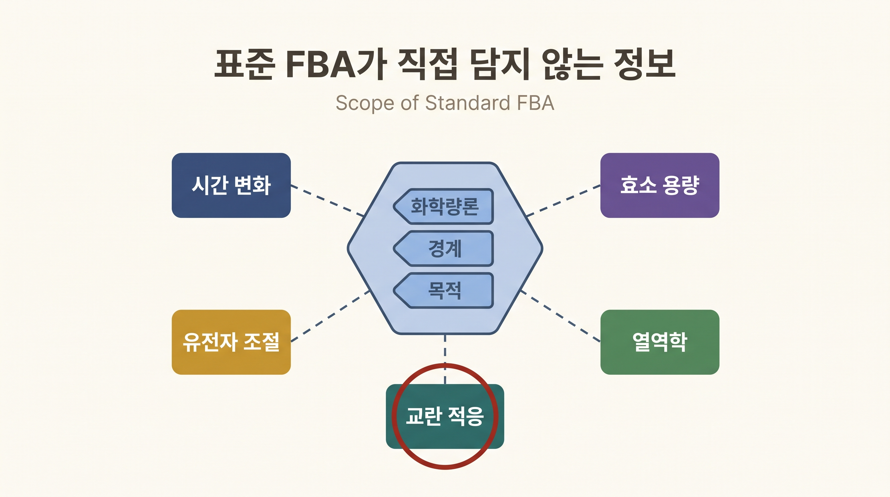
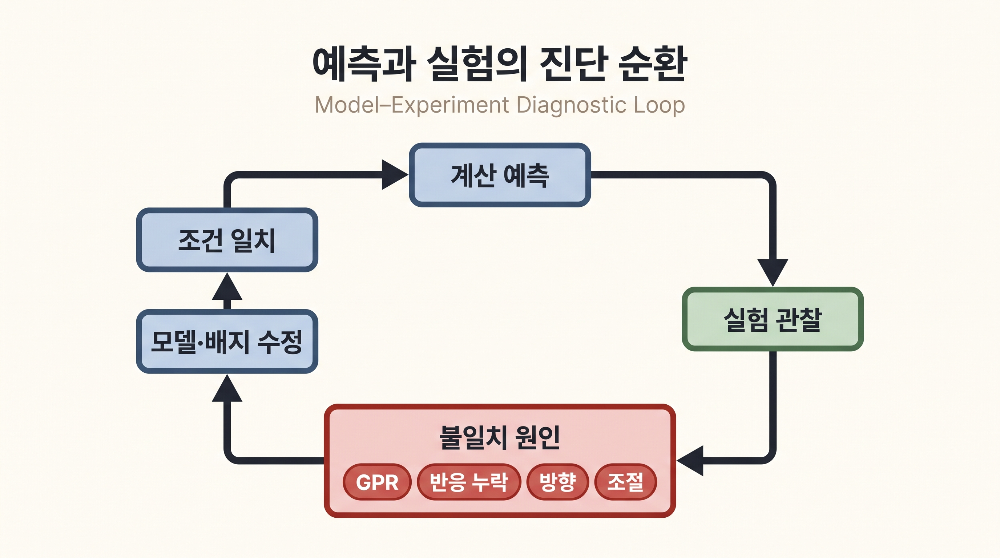

# 10. FBA 예측의 범위와 실패 원인을 구분한다

## 10.1 FBA가 직접 포함하지 않는 정보

표준 FBA는 화학량론, 반응 경계와 목적함수를 사용한다. 다음 정보는 별도 제약이나 다른 모델이 없으면 직접 표현하지 않는다.

| 생략된 정보 | 영향받는 질문 | 보완 방향 |
|:---|:---|:---|
| 대사물 농도의 시간 변화 | 배지 전환, 지연기, 저장물 축적 | 동적 FBA 또는 동역학 모델 |
| 효소량과 촉매율 | 효소 용량, 단백질체 배분, overflow | 효소-제약 모델 |
| 전사·번역 조절 | 조건 특이적 경로 활성 | 조절·오믹스 통합 모델 |
| 반응 자유에너지 | 비현실적 내부 순환과 방향 | 열역학 제약 |
| 교란 후 적응 과정 | 결손 직후와 적응 후의 차이 | MOMA·ROOM 비교와 시계열 실험 |

_그림 4.19:_ 화학량론, 반응 경계와 목적함수로 구성한 표준 FBA 바깥에 시간 변화, 효소 용량, 유전자 조절, 열역학과 교란 적응 정보가 있음을 나타낸다. 각 외부 요소는 별도 자료나 모델 확장이 필요하며 실제 모델 결손을 진단한 그림이 아니다. 저자 작성; 개념 근거: [Orth et al. (2010)](https://doi.org/10.1038/nbt.1614).

이 표의 보완 방법은 FBA의 계산 결과를 자동으로 개선하는 만능 옵션이 아니다. 연구 질문과 이용 가능한 자료에 맞추어 추가 가정을 선택한다.

## 10.2 목적 최적화는 검증할 가설이다

성장 최대화는 영양 제한과 장기 적응 조건에서 유용할 수 있지만, 결손 직후나 풍부 배지, 정체기에는 맞지 않을 수 있다. 표준 FBA 결손 예측은 교란된 세포가 새로운 성장 최적점을 이미 찾았다고 가정한다. 이 값은 조건 아래의 달성 가능한 최대치로 해석하고, 실제 관찰값과의 차이를 적응·조절·모델 결손의 후보로 분석한다.

## 10.3 overflow 대사의 사례

산소가 충분한 빠른 성장 조건에서도 *E. coli*가 아세테이트를 분비할 수 있다. 화학량론과 바이오매스 최대화만 사용하는 모델은 유한한 호흡 단백질 비용을 표현하지 못해 높은 수율 경로를 과도하게 선호할 수 있다. *E. coli*의 호흡과 발효 사이 단백질체 배분은 overflow 전환을 설명하는 한 정량적 기전이다([Basan et al., 2015](https://doi.org/10.1038/nature15765)).

이 사례를 다른 생물의 발효나 암 대사 전체에 그대로 일반화하지 않는다. 생물과 조건별 효소 비용, 조절과 성장 상태를 따로 검증한다.

## 10.4 계산과 실험을 같은 endpoint로 맞춘다

예측 성장률을 비교하려면 다음 조건을 맞춘다.

1. 균주와 유전자형
2. 배지 조성과 산소 전달 조건
3. 배양 방식과 측정 시점
4. 성장률 또는 생존 여부의 정의
5. 섭취·분비 속도의 단위와 생물량 정규화

예측 플럭스와 실험 플럭스를 비교할 때에는 반응 방향, 원자 매핑과 측정 가능한 플럭스의 범위를 맞춘다. FBA의 한 플럭스와 $$^{13}$$C-MFA 추정값이 다르다고 곧바로 한쪽이 틀렸다고 결론내리지 않는다. 먼저 FVA가 실험값을 허용하는지 확인할 수 있다.

## 10.5 실패를 진단 질문으로 바꾼다

- 탄소원이 없는 조건에서 성장하면 잘못 열린 교환 또는 에너지 생성 순환을 점검한다.
- 알려진 생합성 유전자 결손이 성장하면 배지의 보충 영양소와 우회경로를 확인한다.
- 비필수 결손을 무성장으로 예측하면 GPR, 반응 누락과 방향을 점검한다.
- 성장률은 맞지만 내부 플럭스가 다르면 목적함수, 대안 최적해와 조절 가정을 확인한다.

_그림 4.20:_ 일치시킨 조건에서 계산 예측과 실험 관찰을 비교하고, 불일치가 있으면 GPR, 반응 누락, 방향과 조절 가정을 점검해 모델과 배지를 수정하는 진단 순환이다. 특정 데이터의 적합도나 모델 성능을 나타내지 않은 절차 모식도다. 저자 작성; 개념 근거: [Thiele & Palsson (2010)](https://doi.org/10.1038/nprot.2009.203).

모델-실험 불일치는 실패만이 아니라 다음 큐레이션과 실험을 정하는 정보다.


FBA, MOMA와 ROOM은 모두 정상상태 플럭스 상태를 비교하는 제약 기반 방법이다. 초·분·시간에 따른 농도 변화를 적분하는 동역학 모형이 아니므로 특정 방법에 고정된 시간대를 자동으로 배정하지 않는다.


---
