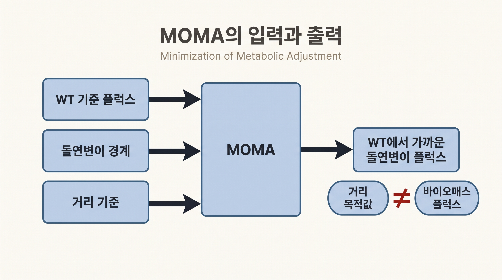
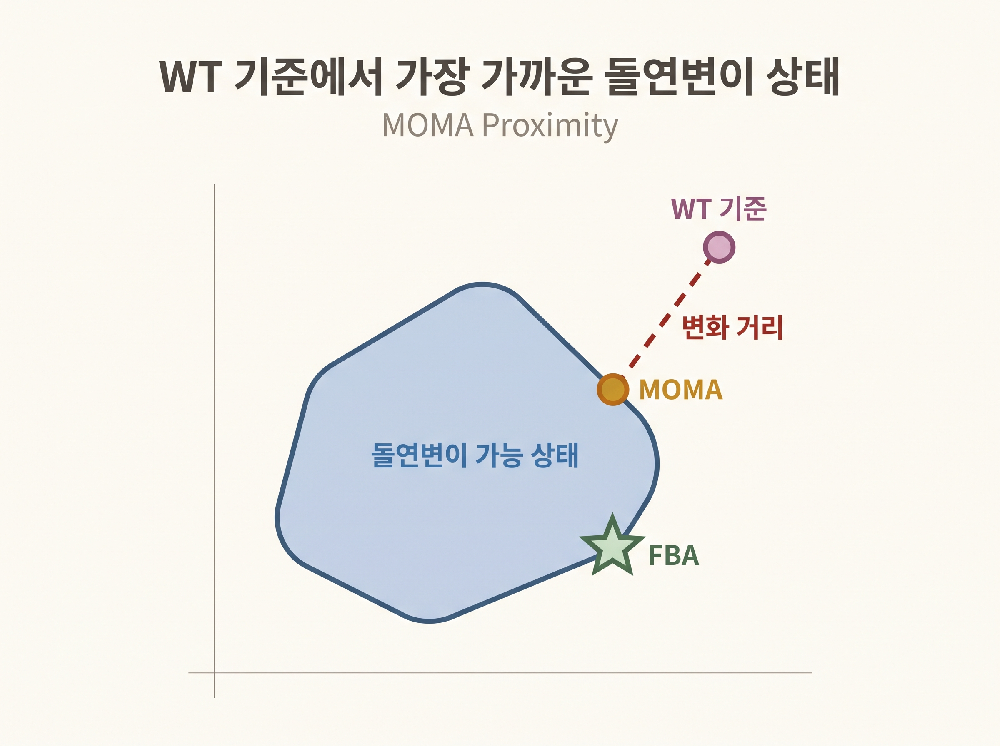

# 11. MOMA는 교란 후 WT와의 변화를 작게 둔다

## 11.1 MOMA가 답하는 질문

FBA 결손 예측은 돌연변이형이 새 제약 안에서 성장 목적을 다시 최적화한다고 가정한다. **최소 대사 조정(Minimization of Metabolic Adjustment, MOMA)**은 다른 질문을 묻는다.

> 결손된 반응을 사용할 수 없을 때, WT 기준 플럭스에서 가능한 한 적게 달라지는 돌연변이 플럭스는 무엇인가

이 근접성 가설은 진화적으로 적응되지 않은 교란 상태를 설명할 후보로 제안되었다([Segrè et al., 2002](https://doi.org/10.1073/pnas.232349399)). 결손 직후의 보편적 정답이나 시간분해 동역학 모형은 아니다.

## 11.2 필요한 입력

MOMA에는 FBA 결손 분석의 입력 외에 WT 기준 플럭스 $$\mathbf{w}$$가 필요하다.

1. 같은 모델과 배지의 WT 플럭스
2. GPR을 평가한 돌연변이 반응 경계
3. 플럭스 변화의 거리 기준



_그림 4.21:_ MOMA가 WT 기준 플럭스, 돌연변이 경계와 거리 기준을 입력으로 받아 WT에서 가까운 돌연변이 플럭스를 선택하는 흐름이다. 거리 목적값과 바이오매스 플럭스가 다른 출력임을 구분한 방법 모식도이며 실제 GEM 계산값이 아니다. 저자 작성; 개념 근거: [Segrè et al. (2002)](https://doi.org/10.1073/pnas.232349399).

가능하면 실측 $$^{13}$$C-MFA 플럭스를 기준으로 사용한다. 실측값이 없으면 pFBA 해를 대표 기준으로 사용할 수 있으나, 기준 선택의 불확실성을 기록한다.

## 11.3 최소 수식

원래 MOMA는 돌연변이 플럭스 $$\mathbf{v}$$와 WT 기준 $$\mathbf{w}$$의 제곱 거리를 최소화한다.

$$\text{minimize}\quad \sum_j(v_j-w_j)^2\quad\text{within the mutant constraints}$$



_그림 4.22:_ WT 기준점에서 돌연변이 가능 상태로 가장 짧은 거리에 있는 MOMA 해와 성장 목적을 최적화한 FBA 해가 다를 수 있음을 2차원으로 나타낸다. 축과 점은 임의 개념 좌표이며 solver나 실제 GEM 계산을 투영한 결과가 아니다. 저자 작성; 개념 근거: [Segrè et al. (2002)](https://doi.org/10.1073/pnas.232349399).

이 식은 큰 변화에 더 큰 벌점을 주므로 여러 반응에 작은 변화를 나누는 해를 선호할 수 있다. 결과의 성장률은 이 거리 목적값이 아니라 바이오매스 반응의 플럭스에서 읽는다.

**linear MOMA**는 절대거리 합을 최소화하는 별도 변형이다.

$$\text{minimize}\quad \sum_j|v_j-w_j|$$

원래의 이차 MOMA와 linear MOMA는 같은 계산이 아니다.

## 11.4 COBRApy 실행

```python
from cobra.flux_analysis import moma, pfba

biomass_id = "Biomass_Ecoli_core"
wt_reference = pfba(model)

with model as mutant:
    mutant.genes.get_by_id("b3919").knock_out()
    fba_solution = mutant.optimize()
    lmoma_solution = moma(mutant, solution=wt_reference, linear=True)

    print("FBA growth:", fba_solution.fluxes[biomass_id])
    print("linear MOMA distance:", lmoma_solution.objective_value)
    print("linear MOMA growth:", lmoma_solution.fluxes[biomass_id])
```

COBRApy 0.30.0에서 `linear=True`는 LP 솔버로 실행할 수 있다. 원래의 이차 MOMA를 실행하려면 `linear=False`와 이차계획을 지원하는 솔버가 필요하다.

## 11.5 출력 해석

- `objective_value`는 WT와의 거리이며 성장률이 아니다.
- 성장률은 `solution.fluxes[biomass_id]`에서 읽는다.
- FBA 성장률보다 낮다고 MOMA가 더 정확하다는 뜻은 아니다.
- 기준 플럭스를 바꾸었을 때 결론이 유지되는지 확인한다.
- 실험 시점과 배지를 맞춘 플럭스 또는 성장 자료로 가설을 검증한다.


MOMA는 WT와 가까운 상태를 찾지만 “가까움”의 생물학적 근거는 선택한 거리와 반응 스케일에 의존한다. 반응식 스케일과 기준 플럭스가 달라지면 거리도 달라질 수 있다.


---
