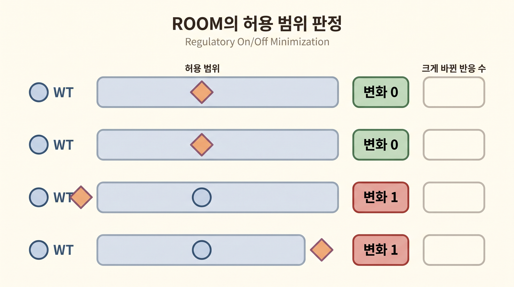
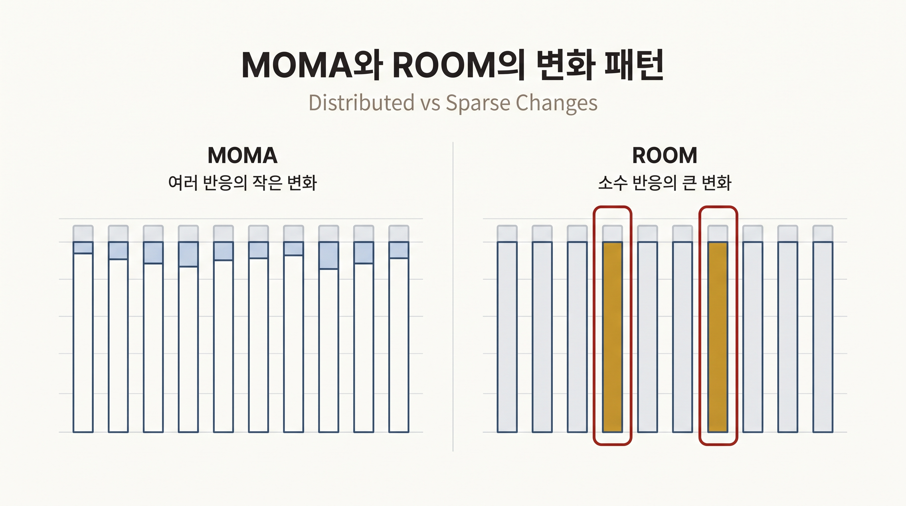

# 12. ROOM은 크게 바뀌는 반응 수를 줄인다

## 12.1 ROOM이 답하는 질문

MOMA는 플럭스 변화의 크기를 합한다. **조절 온·오프 최소화(Regulatory On/Off Minimization, ROOM)**는 WT 근방의 허용 범위를 벗어난 반응의 수를 최소화한다([Shlomi et al., 2005](https://doi.org/10.1073/pnas.0406346102)).

> 결손 제약을 만족하려면 WT 상태에서 크게 달라져야 하는 반응이 최소 몇 개인가

이 조절 최소성 가설은 소수 반응의 큰 재배선을 허용하고 나머지 반응을 WT 근방에 두는 경향이 있다. 실제 전사 조절을 직접 모형화한 것은 아니다.

## 12.2 필요한 입력

ROOM에는 다음 입력이 필요하다.

1. WT 기준 플럭스 $$w_j$$
2. 돌연변이 반응 경계
3. 반응별 변화를 허용할 상대 임계값 $$\delta$$와 절대 임계값 $$\varepsilon$$

각 반응의 허용 구간은 기준값 주변으로 만든다.

$$w_j-\delta|w_j|-\varepsilon\le v_j\le w_j+\delta|w_j|+\varepsilon$$



_그림 4.23:_ 반응별 WT 기준 플럭스 주변에 허용 범위를 두고 돌연변이 플럭스가 범위 안이면 변화 0, 밖이면 변화 1로 세는 ROOM의 판정 원리다. 표시된 반응과 위치는 임의 예시이며 실제 ROOM 목적값이나 GEM 계산 결과가 아니다. 저자 작성; 개념 근거: [Shlomi et al. (2005)](https://doi.org/10.1073/pnas.0406346102).

돌연변이 플럭스가 이 범위를 벗어나면 해당 반응을 “크게 바뀐 반응”으로 센다. ROOM은 이 개수를 최소화한다.

## 12.3 임계값의 생물학적 의미

$$\delta$$와 $$\varepsilon$$은 계산 결과를 크게 바꿀 수 있다.

- 너무 작은 값은 수치 오차나 작은 변동도 변화로 센다.
- 너무 큰 값은 실제 재배선을 변화로 세지 않을 수 있다.
- 실측 기준 플럭스를 사용하면 측정오차와 스케일을 반영해야 한다.
- 계산 기준 플럭스를 사용하면 여러 임계값과 기준 해에 대해 민감도를 확인한다.

사용한 임계값을 결과와 함께 보고한다.

## 12.4 COBRApy 실행

```python
from cobra.flux_analysis import room

with model as mutant:
    mutant.genes.get_by_id("b3919").knock_out()
    room_solution = room(
        mutant,
        solution=wt_reference,
        linear=True,
    )

    print("linear ROOM objective:", room_solution.objective_value)
    print("linear ROOM growth:", room_solution.fluxes[biomass_id])
```

COBRApy 0.30.0의 `room(..., linear=True)`는 이진변수를 연속화하고 내부적으로 zero-tolerance를 사용하는 변형이다. 이 목적값을 원 ROOM의 “변한 반응 수”로 해석하면 안 된다. 원 ROOM은 `linear=False`와 명시한 `delta`, `epsilon`을 사용하며 혼합정수선형계획 솔버, 시간 제한과 최적성 간격을 함께 기록한다.

## 12.5 출력 해석

- 원 ROOM의 목적값은 허용 범위를 벗어난 반응 수다.
- linear ROOM의 목적값은 연속 변형의 비용이며 반응 수가 아니다.
- 두 구현의 성장률은 바이오매스 플럭스에서 별도로 읽는다.
- 같은 최소 변화 수를 갖는 대안 ROOM 해가 존재할 수 있다.
- 변화 반응 목록을 조절 유전자 목록과 동일시하지 않는다. 반응과 유전자 사이에는 GPR이 있다.



_그림 4.24:_ MOMA가 여러 반응의 작은 플럭스 변화를 선호할 수 있는 패턴과 ROOM이 소수 반응의 큰 변화를 선호할 수 있는 패턴을 비교한다. 이는 목적 기준이 만드는 정성적 경향이며 특정 결손에서 변화 개수나 크기를 보장하는 계산 결과가 아니다. 저자 작성; 개념 근거: [Segrè et al. (2002)](https://doi.org/10.1073/pnas.232349399), [Shlomi et al. (2005)](https://doi.org/10.1073/pnas.0406346102).


ROOM은 MOMA보다 늦은 시간 상태, FBA보다 이른 시간 상태를 자동으로 뜻하지 않는다. 세 방법은 시간표가 아니라 서로 다른 상태 선택 가설이며, 실험 시점별 자료로 비교해야 한다.


---
