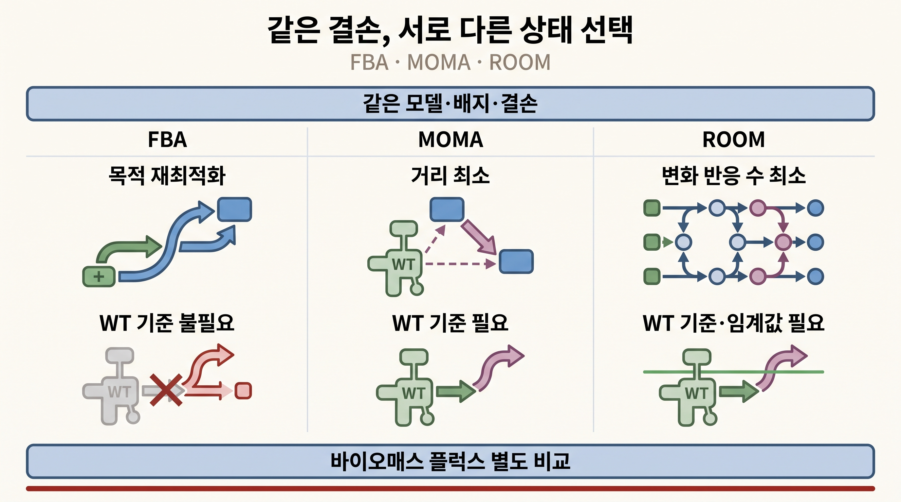
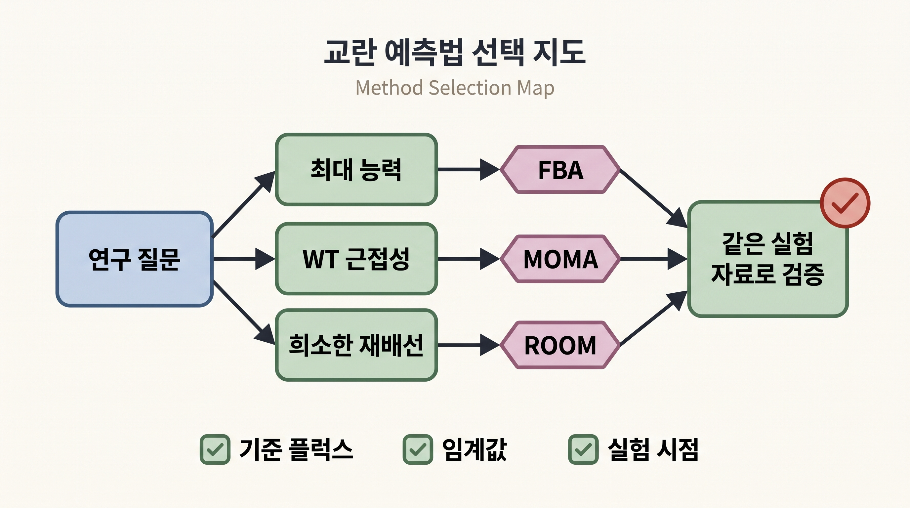

# 13. FBA·MOMA·ROOM은 질문과 자료에 맞추어 선택한다

## 13.1 같은 결손에 대한 세 가정

| 방법 | 상태 선택 질문 | 추가 입력 | 목적값의 의미 |
|:---|:---|:---|:---|
| FBA | 새 제약에서 생물학적 목적을 얼마나 최대화할 수 있는가 | 없음 | 성장률 또는 지정한 목적 플럭스 |
| MOMA | WT 플럭스에서 얼마나 적게 달라질 수 있는가 | WT 기준 플럭스 | 플럭스 거리 |
| ROOM | WT 허용 범위를 벗어나는 반응을 얼마나 적게 만들 수 있는가 | WT 기준 플럭스, 임계값 | 변화 반응 수 또는 변형 비용 |

_그림 4.25:_ 같은 모델·배지·결손 아래 FBA는 목적 재최적화, MOMA는 WT와의 거리 최소화, ROOM은 크게 바뀌는 반응 수 최소화로 서로 다른 상태를 선택한다. 세 방법의 성장률은 공통으로 바이오매스 플럭스에서 읽어야 하며, 특정 방법의 우열을 나타내지 않은 비교 모식도다. 저자 작성; 개념 근거: [Segrè et al. (2002)](https://doi.org/10.1073/pnas.232349399), [Shlomi et al. (2005)](https://doi.org/10.1073/pnas.0406346102).

세 방법은 같은 돌연변이 가능 상태 안에서 서로 다른 해를 고른다. 결과가 다르면 어느 계산이 실패했다는 뜻이 아니라 상태 선택 가정이 결과에 영향을 준다는 뜻이다.

## 13.2 선택 절차

1. **질문을 정한다.** 최대 성장 능력, WT 근접성 또는 조절 변화의 희소성 가운데 무엇을 시험하는지 적는다.
2. **교란을 동일하게 적용한다.** 같은 모델·배지·GPR·결손 경계를 사용한다.
3. **기준 플럭스를 점검한다.** MOMA와 ROOM에는 실측 또는 계산 WT 기준이 필요하다.
4. **출력을 같은 항목으로 비교한다.** 성장률은 세 방법 모두 바이오매스 플럭스에서 읽고, 각 방법의 목적값은 별도 열에 둔다.
5. **민감도 분석을 수행한다.** WT 기준 해, ROOM 임계값과 솔버 설정을 바꾼다.
6. **실험 endpoint와 비교한다.** 같은 배지와 시점의 성장률, 교환 플럭스 또는 세포내 플럭스를 사용한다.

## 13.3 상황별 출발점

| 연구 상황 | 우선 계산 | 함께 비교할 계산 |
|:---|:---|:---|
| 게놈 전체 단일 결손 스크리닝 | FBA | 중요한 후보에 MOMA·ROOM |
| 교란 뒤 WT 근접성 가설 시험 | MOMA | FBA, ROOM |
| 소수 반응 재배선 가설 시험 | ROOM | FBA, MOMA |
| 적응된 균주의 최대 능력 | FBA | 적응 전 자료가 있으면 MOMA·ROOM |
| 기준 플럭스가 불확실함 | FBA와 여러 WT 기준 민감도 | MOMA·ROOM 결과 범위 |

_그림 4.26:_ 최대 능력, WT 근접성과 희소한 재배선이라는 연구 질문에 따라 FBA, MOMA와 ROOM을 각각 출발점으로 선택하되, 세 결과를 같은 실험 자료로 검증하는 방법 선택 지도다. 고정된 시간 순서나 보편적 성능 순위를 뜻하지 않는 교육용 모식도다. 저자 작성; 개념 근거: [Segrè et al. (2002)](https://doi.org/10.1073/pnas.232349399), [Shlomi et al. (2005)](https://doi.org/10.1073/pnas.0406346102).

이 표는 보편적 시간 순서를 정하지 않는다. 실험 자료의 종류와 분석 목적에 따른 출발점이다.

## 13.4 결과표의 권장 형식

| 항목 | FBA | MOMA | ROOM |
|:---|:---|:---|:---|
| 모델·배지·결손 | 동일 조건 | 동일 조건 | 동일 조건 |
| WT 기준 | 불필요 | 출처 기록 | 출처 기록 |
| 구현 | LP | quadratic 또는 linear 명시 | 원 ROOM 또는 linear 변형 명시 |
| 고유 목적값 | 성장·생산 | 거리 | 변화 수·비용 |
| 바이오매스 플럭스 | 별도 기록 | 별도 기록 | 별도 기록 |
| 주요 교환 플럭스 | 별도 기록 | 별도 기록 | 별도 기록 |
| 민감도 설정 | 목적·경계 | 기준 해·거리 | 기준 해·$$\delta$$·$$\varepsilon$$ |

이 형식은 MOMA나 ROOM의 목적값을 성장률로 오독하는 오류를 막는다.

## 13.5 일치와 불일치의 해석

세 방법이 모두 무성장을 예측하면 대체 경로가 없는 강한 구조적 취약성 후보가 된다. FBA만 높은 성장을 예측하고 MOMA·ROOM이 낮은 성장을 예측하면 재최적화 가능성과 WT 근접성·조절 최소성 가설이 크게 갈리는 사례다. 세 결과가 비슷해도 실험 검증은 필요하다.

방법 선택은 예측 순위를 미리 정하는 일이 아니다. MOMA의 원 논문은 WT 근접성 가설을, ROOM의 원 논문은 소수의 큰 변화를 선호하는 가설을 제시했다. 특정 데이터에서 한 방법이 더 잘 맞았다는 결과를 다른 생물, 배지와 시점의 보편적 우열로 일반화하지 않는다.

## 13.6 다음 분석으로 연결한다

이 장의 결과는 다음 질문으로 이어진다.

- 모델 구축과 GPR 품질은 [Chapter 5](../chapter-5/README.md)에서 점검한다.
- 조건 특이적 조절과 오믹스 자료는 [Chapter 6](../chapter-6/README.md)에서 통합한다.
- 머신러닝을 이용한 필수성 예측의 입문 비교는 [Chapter 9 §3](../chapter-9/03.md)에서 다룬다.
- 같은 교란을 코드로 재현하고 결과 계약을 남기는 방법은 [Chapter 10](../chapter-10/README.md)과 [Chapter 11 §4](../chapter-11/04.md)에서 연습한다.


교란 예측의 최종 산출물은 방법 이름 하나가 아니라 조건이 명시된 비교다. 모델, 배지, 결손, 기준 플럭스, 구현, 목적값, 바이오매스 플럭스와 실험 endpoint를 한 표에 묶는다.


---
