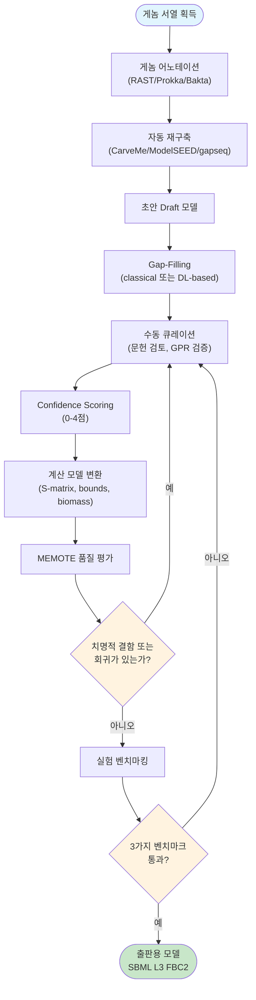
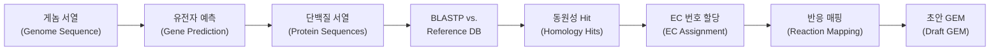
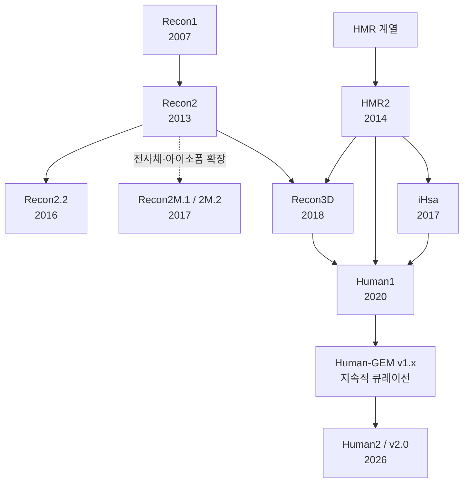

# Chapter 5. 모델 구축과 품질 관리

> [Chapter 4](chapter-4.-flux-balance-analysis-fba.md)까지 우리는 이미 완성된 모델 — `e_coli_core`와 iML1515 — 을 불러와 FBA로 성장률을 계산했습니다. 그런데 그 모델은 애초에 누가, 어떤 근거로, 얼마나 오랜 시간을 들여 만들었을까요? 이 장은 게놈 서열에서 출발해 시뮬레이션이 가능한 고품질 genome-scale metabolic model(GEM, 게놈 규모 대사 모델)에 도달하기까지의 **재구축(reconstruction) 파이프라인**을 다룹니다. 유전자 주석과 동원성 검색을 통한 반응 할당, 수동 재구축의 96단계 프로토콜, CarveMe·ModelSEED·gapseq 등 자동화 도구, gap-filling 알고리즘, MEMOTE 기반 품질 관리(QC)를 순서대로 살펴본 뒤, 미생물 모델과는 근본적으로 다른 규모를 갖는 **인체 대사 모델**의 구축 방법론 — top-down/bottom-up/hybrid 접근법, Recon 시리즈의 진화, Human1/Human2, 그리고 조직 특이적 모델 추출의 핵심 알고리즘 tINIT/ftINIT — 을 다룹니다.

## 이 장을 시작하며

**잠깐, 생각해보기.** 여러분이 iML1515(유전자 1,516개·반응 2,712개·대사물 1,877개)를 실행할 때, 이 숫자들이 어디서 왔다고 생각하나요? 누군가 대장균의 게놈을 열어 반응을 하나씩 손으로 세었을까요, 아니면 컴퓨터가 자동으로 만들어냈을까요? 정답은 "**둘 다, 그리고 여러 번 반복해서**"입니다 — 바로 이것이 이 장의 핵심 질문입니다.

재구축이 왜 어렵고 왜 한 번에 끝나지 않는지 이해하려면 두 가지 익숙한 비유가 도움이 됩니다.

**비유 ① 레시피 짜깁기.** 처음 보는 요리를 만든다고 상상해봅시다. 유명 셰프의 검증된 레시피(수동 큐레이션 모델, 예: iML1515)를 그대로 따라가면 실패 확률은 낮지만, 재료 하나하나의 정확한 양과 순서를 검증하는 데 몇 달이 걸립니다. 반대로 "비슷한 요리 레시피 여러 개를 짜깁기"해서 빠르게 초안을 만들면(CarveMe 같은 자동 재구축) 10분 만에 끝나지만, 간이 맞는지 실제로 맛을 보고 소금을 더 넣거나 빼야 합니다 — 이 "맛보고 고치기"가 바로 **gap-filling과 반복적 품질 관리**입니다. 레시피는 한 번에 완성되지 않습니다. 맛을 보고, 부족한 재료를 채우고, 다시 맛을 보는 순환이 필요합니다.

**비유 ② 미지의 대륙 지도 제작.** 탐험가가 위성사진(게놈 서열)만으로 지도를 그린다면, 큰 강과 산맥의 위치는 빠르게 표시할 수 있습니다. 그러나 위성사진만으로는 어떤 다리가 실제로 존재하는지, 어떤 길이 끊겨 있는지(반응 갭, gap) 알 수 없습니다. 이는 현장을 직접 걸어보는 답사(문헌 검토·실험 데이터·FBA 시뮬레이션 검증)를 통해서만 확인됩니다. 초안 지도는 빠르게 그릴 수 있지만, 끊어진 다리를 표시하고 잇는 작업(gap-filling)과 실제로 그 길로 걸어가 봤을 때 지도와 다르면 다시 고치는 작업(검증·디버깅)이 필요합니다.

두 비유 모두 같은 교훈을 전합니다 — **재구축은 "만든다"보다 "고쳐 나간다"에 가까운 반복적(iterative) 과정**이라는 것입니다. 이 장에서 다루는 96단계 프로토콜의 Stage 2~4, gap-filling, MEMOTE 기반 회귀 검사가 모두 이 "고쳐 나가기"의 구체적인 실천 방법입니다.

이 장에서 GPR 문자열의 Boolean 구조나 세포 구획의 생물학적 정의 자체는 다루지 않습니다 — 이는 이미 [GEM 구조](chapter-3.-genome-scale-metabolic-model-gem.md)에서 확립된 내용입니다. 대신 여기서는 "그 GPR과 구획 정보를 어떤 근거로, 어떤 절차를 통해 채워 넣는가"에 집중합니다. 또한 발현 데이터를 이용해 범용 모델을 특정 조직·세포에 맞추는 GIMME/iMAT/tINIT의 **철학적 비교**는 [Omics 통합](chapter-6.-omics.md)의 몫이며, 이 장에서는 tINIT의 **재구축 알고리즘 자체**(§10)까지만 다룹니다.

💡 **팁:** 이 장을 읽는 동안 두 개의 "동반 모델"을 계속 떠올리세요 — 1장에서 불러온 미생물 스레드(`e_coli_core` → 이 장에서는 완전한 게놈 규모로 큐레이션된 iML1515로 확장)와, 5~7장에서 반복 사용할 인체 스레드(Human1/Recon3D)입니다. 같은 재구축 원리가 반응 95개짜리 축소 모델에도, 반응 13,000개가 넘는 인체 모델에도 똑같이 적용됩니다 — 다만 규모가 100배 이상 커질 뿐입니다.

---

## 학습 목표

이 장을 마치면 다음을 할 수 있어야 합니다.

- BLASTP 기반 동원성 검색의 원리(seed-and-extend, E-value, BLOSUM)를 이해하고, EC 번호·반응 할당 파이프라인을 설명할 수 있다.
- Thiele & Palsson 96단계 프로토콜의 4단계 구조와 confidence scoring 체계를 설명하고, 수동 재구축의 핵심 단계를 재현할 수 있다.
- CarveMe, ModelSEED/KBase, gapseq, AuReMe, RAVEN, Merlin 등 자동화 재구축 도구의 작동 원리·장단점·적합한 사용 사례를 비교할 수 있다.
- Gap-filling 문제를 MILP로 정식화하고, 손으로 작은 예제를 풀어보며 전통적 방법(GapFind/GapFill, growMatch, FastGapFill)과 딥러닝 기반 방법(CHESHIRE, CLOSEgaps, DNNGIOR)의 차이를 설명할 수 있다.
- MEMOTE 리포트에서 질량/전하 균형, 화학량론적 일관성, 주석 완전성을 구분하고, 같은 버전·설정에서 모델 변화를 비교할 수 있다.
- Recon·HMR 계열의 **분기와 병합**, Recon2M의 전사체 수준 확장, Human1→Human2로 이어지는 Human-GEM 계보를 설명할 수 있다.
- INIT의 증거 기반 네트워크 추출과 tINIT의 metabolic task enforcement를 구분하고, ftINIT이 어떻게 이를 고속화했는지 설명할 수 있다.

---

## 1. 재구축의 전체 그림: 초안에서 금 표준까지

Genome-scale metabolic model을 만드는 작업은 크게 두 갈래로 나뉩니다. 하나는 연구자가 문헌과 실험 데이터를 근거로 한 반응씩 검증하는 **수동 재구축(manual reconstruction)**이며, 다른 하나는 게놈 서열과 참조 데이터베이스만으로 몇 분~몇 시간 안에 초안을 생성하는 **자동화 재구축(automated reconstruction)**입니다. 두 경로 모두 출발점은 게놈 서열이고 도착점은 FBA 시뮬레이션이 가능한 계산 모델이지만, 소요 시간(몇 분 vs. 몇 개월~몇 년)과 최종 품질(빠르지만 낮은 curation 밀도 vs. 느리지만 높은 신뢰도) 사이에 뚜렷한 트레이드오프가 있습니다. 이는 앞서 "이 장을 시작하며"의 레시피 비유에서 본 "유명 셰프의 레시피"와 "레시피 짜깁기"의 대비와 정확히 같은 구조입니다.



*Figure 5.1: 대사 모델 구축의 전체 워크플로우. MEMOTE 총점에 보편적 합격선은 없으므로, 치명적 결함과 이전 버전 대비 회귀를 먼저 확인한 뒤 목적에 맞는 표현형 벤치마크로 넘어갑니다.*

이 순환 구조를 눈여겨보십시오 — 화살표가 "MANUAL"로 두 번이나 되돌아갑니다. 지도 제작 비유로 말하면, 초안 지도(DRAFT)를 그린 뒤 끊어진 다리를 잇고(GAPFILL), 현장 답사로 검증하고(MEMOTE, BENCH), 문제가 발견되면 다시 지도를 고치는(MANUAL) 순환입니다. "완성된 모델"이란 이 순환이 충분히 반복되어 더 이상 큰 오류가 나오지 않는 상태를 말합니다.

> **핵심 개념 · 용어(English):** **재구축(Reconstruction)** vs. **모델(Model)** — 재구축은 게놈 주석·문헌·데이터베이스를 통합해 얻은 반응 네트워크 그 자체(정성적 지식 표현)를 가리키며, 모델은 여기에 flux bounds와 biomass objective function을 부여하여 [FBA](chapter-4.-flux-balance-analysis-fba.md) 시뮬레이션이 가능하도록 만든 계산 객체를 가리킵니다. 이 장의 §3(Stage 3)이 바로 재구축을 모델로 변환하는 단계입니다.

### 1.1 미생물 GEM의 정확도 평가 기준: 세 가지 표현형 벤치마크

수동이든 자동이든, 완성된 GEM의 품질은 궁극적으로 **표현형 예측력**으로 판가름 납니다. Thiele & Palsson(2010)이 확립한 이래 거의 모든 미생물 GEM 재구축 프로젝트가 사용하는 세 가지 독립적인 벤치마크가 있습니다.

**① 분비 생성물 프로파일(Secretion Product Profile)**

무산소(anoxic) 조건에서 대장균은 발효를 통해 ATP를 생성하며 부산물을 분비합니다.

| 생성물 | 대표 경로 | 일반적인 비율 |
|:---|:---|:---|
| 아세테이트(Acetate) | 피루브산 → 아세틸-CoA → 아세테이트 | 가장 풍부 |
| 락테이트(Lactate) | 피루브산 → 락테이트 (NADH 재산화) | 글루코스 과잉 시 |
| 에탄올(Ethanol) | 아세틸알데히드 → 에탄올 | 혼합산 발효 시 |
| 포름산(Formate) | 피루브산 → 포름산 + 아세틸-CoA | 포름산 분해 시스템 |
| 석시닌산(Succinate) | PEP → 옥살아세테이트 → 석시닌산 | 석시닌산 경로 활성화 시 |

*Table 5.1: 대장균 무산소 발효의 주요 분비 생성물. 아세테이트 분비 예측은 피루브산 용량이 TCA cycle 경로와 아세테이트 경로 사이에서 경쟁적으로 분배되기 때문에 가장 어려운 과제 중 하나입니다.*

이 벤치마크는 네트워크 전체의 **화학량론적 균형(stoichiometric balance)**을 테스트합니다.

**② 단일 유전자 결손 성장 표현형(Single Gene Deletion Growth Phenotype)**

각 유전자를 하나씩 결손시켰을 때 세포가 생존 가능한지(essential vs. non-essential)를 예측합니다. 유전자 필수성의 수학적 기준은 다음과 같습니다.

$$\text{Gene } i \text{ is essential if: } v_{bio}^{\Delta i} < \theta \times v_{bio}^{WT}$$

여기서 $$v_{bio}^{\Delta i}$$는 유전자 $$i$$가 결손되었을 때의 최대 biomass flux, $$v_{bio}^{WT}$$는 야생형의 최대 biomass flux, $$\theta$$는 임계값(일반적으로 0.05~0.10)입니다. iML1515에서는 약 300개 유전자가 essential로 예측되며 이 중 약 90%가 실험과 일치합니다. 이 벤치마크는 **개별 유전자-반응 연관의 정확도**를 테스트합니다.

**③ 탄소원/에너지원 이용 패턴(Carbon/Energy Source Utilization)**

세포가 어떤 탄소원으로 성장할 수 있는지 예측합니다(예: 대장균은 포도당·글리세롤·아세테이트는 이용하지만 셀룰로오스는 이용하지 못함). 이 벤치마크는 **네트워크 완전성(completeness)**을 테스트합니다.

**정확도 지표: 민감도와 특이도**

| 지표 | 정의 | 목표 값 |
|:---|:---|:---:|
| Sensitivity (재현율) | 실제 essential 유전자 중 모델이 essential로 예측한 비율 | > 0.60 |
| Specificity (정확도) | 실제 non-essential 유전자 중 모델이 non-essential로 예측한 비율 | > 0.90 |
| Precision (정밀도) | 모델이 essential로 예측한 유전자 중 실제 essential인 비율 | > 0.50 |
| F1 Score | Precision과 Recall의 조화 평균 | > 0.55 |

*Table 5.2: 유전자 필수성 예측의 정확도 지표. 특이도가 민감도보다 항상 높게 요구되는 이유는, 모델에 누락된 아이소자임·대체 경로 때문에 실제로는 non-essential인 유전자를 essential로 오판(false positive essential prediction)하는 경향이 흔하기 때문입니다. 이러한 오판은 GEM의 네트워크 불완전성을 드러내는 중요한 신호입니다.*

> **잠깐, 생각해보기.** 왜 specificity(> 0.90)가 sensitivity(> 0.60)보다 훨씬 엄격한 기준을 요구할까요? 힌트: 모델에 아이소자임이나 대체 경로가 빠져 있으면 어떤 방향의 오류가 생길지 생각해보세요. — 답: 모델에서 대체 경로가 누락되면, 실제로는 우회로가 있어 non-essential인 유전자를 모델은 "이 반응이 막히면 성장이 멈춘다"고 잘못 예측(essential로 오판)합니다. 이는 위양성(false positive essential) 오류이며, 네트워크가 불완전할수록 늘어납니다. 따라서 specificity가 낮다는 것은 곧 네트워크 완전성이 부족하다는 직접적 신호가 됩니다.

세 벤치마크 모두에서 높은 정확도를 달성해야만 "고품질" GEM이라 할 수 있으며, 이는 §3.4(Stage 4 검증)와 §6(MEMOTE)에서 반복적으로 등장하는 공통의 잣대입니다.

---

## 2. 유전자 주석과 동원성 검색 (Genome Annotation and Homology Search)

새로운 생물체의 대사 모델을 구축할 때 가장 먼저 던지는 질문은 "잘 알려진 모델 생물체의 효소와 이 생물체의 단백질이 얼마나 유사한가?"입니다. 이 질문에 답하는 것이 **동원성 검색(homology search)**이며, 그 대표 도구가 **BLAST(Basic Local Alignment Search Tool)**입니다.

### 2.1 게놈 어노테이션 도구

| 도구 | 알고리즘 | 속도 | 정확도 | 특징 |
|:---|:---|:---|:---|:---|
| **RAST** | 서브시스템 기반 | 중간 | 높음 | 대사 모델링에 최적화된 기능 분류 |
| **Prokka** | 통합 파이프라인 | 빠름 | 중간 | 원핵생물 특화, 빠른 실행 |
| **eggNOG-mapper** | Orthology 기반 | 중간 | 높음 | 광범위한 진화적 범위 |
| **Bakta** | 최신 통합 | 빠름 | 높음 | Prokka의 개선판 |
| **DFAST** | 웹 기반 | 중간 | 중간 | 사용자 친화적 인터페이스 |

*Table 5.3: 주요 게놈 어노테이션 도구 비교. RAST는 대사 모델링에 가장 적합한 기능 분류 체계를 제공하며, CarveMe/ModelSEED와 같은 자동화 도구들이 이를 활용합니다.*

EC(Enzyme Commission) 번호 할당에는 몇 가지 근본적인 어려움이 있습니다: (1) 하나의 효소가 여러 반응을 촉매하는 **1:多 관계**(효소 다기능성, 예: CYP450), (2) 여러 효소가 동일 반응을 촉매하는 **多:1 관계**(아이소자임), (3) 새로 발견된 효소의 EC 번호 **미할당**, (4) 복합체 효소의 서브유닛별 **별도 EC 번호** 문제.

### 2.2 BLASTP의 원리와 매개변수

BLAST는 1990년 Altschul et al.이 개발한 서열 유사성 검색 도구로, query sequence를 database의 모든 서열과 비교해 통계적으로 유의미한 유사성을 가진 hit들을 찾습니다. BLASTP는 단백질 서열 간 비교에 사용되며, 핵심 아이디어는 **"seed-and-extend"** 접근법입니다.

1. **단어 목록 생성**: query 서열에서 길이 $$w$$인 짧은 단어(word)를 생성(단백질은 보통 $$w=3$$).
2. **고득점 쌍 탐색**: database 서열 중 이 단어와 매칭되는 위치를 빠르게 탐색.
3. **확장(Extension)**: 매칭 위치에서 양방향으로 서열을 확장하며 alignment score 계산.
4. **유의성 평가**: 확장된 alignment의 통계적 유의성을 E-value로 평가.

| 매개변수 | 기본값 | 설명 | 대사 모델링에서의 의미 |
|:---|:---|:---|:---|
| **E-value** | 10 | 기대값 — 주어진 점수 이상의 alignment가 우연히 발생할 확률 | 작을수록 신뢰도 높음. 일반적으로 $$10^{-5}$$ 이하 사용 |
| **Bit score** | — | 서열 길이로 정규화된 alignment 점수 | 클수록 유사성 높음. 100 이상이면 상당히 유사 |
| **Identity** | — | Alignment 영역에서 동일 아미노산의 비율(%) | 30% 이상이면 동일 fold일 가능성 높음 |
| **Coverage** | — | Query 서열이 alignment로 커버되는 비율(%) | 70% 이상이면 전체 도메인 보존 가능성 |
| **Matrix** | BLOSUM62 | 치환 행렬(substitution matrix) | 진화적 거리에 따라 선택 |
| **Word size** | 3 | 초기 seed의 길이 | 작을수록 민감하지만 느림 |

*Table 5.4: BLASTP의 핵심 매개변수. 대사 모델링에서 가장 중요한 것은 E-value, Identity, Coverage 세 가지입니다.*

E-value의 수학적 정의는 다음과 같습니다.

$$E = K \cdot m \cdot n \cdot e^{-\lambda S}$$

여기서 $$K$$는 치환 행렬과 gap penalty에 의존하는 상수, $$m$$은 query 서열 길이, $$n$$은 database 전체 서열 길이, $$\lambda$$는 점수 체계 의존 상수, $$S$$는 raw alignment score입니다. $$E=10$$은 "우연히 이 점수 이상의 alignment가 10번 나타날 것으로 기대됨"을, $$E=10^{-10}$$은 "1백억 개의 서열 중 1번 나타날 것으로 기대됨"을 의미합니다.

**손으로 계산해보기 — E-value가 alignment score에 얼마나 민감한가.** 수식을 눈으로만 보면 감이 잘 오지 않으므로, 단순화한 숫자로 직접 계산해봅시다. $$K=0.1$$, $$\lambda=0.3$$, query 길이 $$m=300$$, database 크기 $$n=10^7$$(약 1천만 잔기)이라 하겠습니다.

- $$S=60$$일 때: $$E = 0.1 \times 300 \times 10^7 \times e^{-0.3 \times 60} = 3\times10^8 \times e^{-18} \approx 3\times10^8 \times 1.5\times10^{-8} \approx 4.5$$ → "우연히도 이 정도 점수가 나올 수 있다"는 뜻으로, 신뢰하기 어렵습니다.
- $$S=100$$일 때: $$E = 3\times10^8 \times e^{-30} \approx 3\times10^8 \times 9.4\times10^{-14} \approx 2.8\times10^{-5}$$ → Tier 2~3 수준의 신뢰도.
- $$S=150$$일 때: $$E = 3\times10^8 \times e^{-45} \approx 3\times10^8 \times 2.9\times10^{-20} \approx 8.7\times10^{-12}$$ → Tier 1(거의 확실한 동원성).

이 세 계산에서 핵심 교훈은, alignment score가 60→100→150으로 겨우 2.5배 늘었을 뿐인데 E-value는 4.5 → $$10^{-5}$$ → $$10^{-12}$$로 **10억 배 이상** 떨어진다는 점입니다. 지수함수이기 때문에 score의 작은 변화가 신뢰도 판정을 극적으로 바꿀 수 있으므로, 실무에서는 E-value 하나만 보지 않고 identity·coverage와 함께 판단합니다(아래 Table 5.6).

| E-value 임계값 | 의미 | 대사 모델링 적용 |
|:---|:---|:---|
| $$\leq 10^{-30}$$ | 거의 동일한 단백질 | 동일 EC 번호 할당, 동일 반응 매핑 |
| $$10^{-30}$$ – $$10^{-10}$$ | 밀접한 동원성 | 동일 반응 가족, 신뢰도 높은 기능 할당 |
| $$10^{-10}$$ – $$10^{-5}$$ | 원격 동원성 | 보수적 접근 필요, 추가 검증 권장 |
| $$> 10^{-5}$$ | 불확실한 동원성 | 일반적으로 무시하거나 수동 검증 필요 |

BLOSUM(BLOcks SUbstitution Matrix) 행렬은 진화적으로 관련된 단백질 블록에서 유도된 아미노산 치환 확률입니다.

| 행렬 | 유도 방법 | 적합한 비교 |
|:---|:---|:---|
| BLOSUM45 | ≤ 45% identity 클러스터 | 원격 동원성(different families) |
| BLOSUM62 | ≤ 62% identity 클러스터 | 일반적(default) |
| BLOSUM80 | ≤ 80% identity 클러스터 | 밀접한 동원성(same family) |

❓ **흔한 오해:** "BLASTP에서 높은 유사도가 나오면 반드시 같은 기능(같은 반응)을 촉매한다." 실제로는 그렇지 않습니다. 서열이 매우 유사해도 (1) **paralog**(게놈 내 복제로 생겨나 기능이 분화되었을 수 있는 유전자)라면 다른 반응을 촉매할 수 있고, (2) **promiscuous enzyme**(다기능 효소)은 주 반응 외에 부수적 반응도 촉매하므로 서열 하나로 전체 기능을 단정할 수 없습니다. 그래서 §2.3의 BBH(양방향 최우수 일치)로 ortholog와 paralog를 구분하고, §3.2의 confidence score로 "동원성"과 "실제 실험 증거"를 별개의 축으로 관리합니다.

### 2.3 EC 번호 할당 파이프라인과 BBH 방법

새로운 게놈에서 대사 모델을 구축하는 전형적인 파이프라인은 다음과 같습니다.



*Figure 5.2: 동원성 기반 대사 모델 구축 파이프라인.*

단순한 일방향 BLASTP는 수렴 진화(convergent evolution)로 인한 false positive를 일으킬 수 있어, **양방향 최우수 일치(Bidirectional Best Hit, BBH)** 방법이 널리 사용됩니다.

```
1. Genome A의 단백질 X를 Genome B에 대해 BLASTP → 최우수 hit: Y
2. Genome B의 단백질 Y를 Genome A에 대해 BLASTP → 최우수 hit: X
3. X의 최우수 hit가 Y이고, Y의 최우수 hit가 X이면 → Ortholog로 간주
```

BBH는 **ortholog**(스펙시에이션으로 분리된 동원 유전자)와 **paralog**(게놈 내 복제로 생성된 동원 유전자)를 구분하는 가장 단순한 방법입니다. 대사 모델링에서는 ortholog가 기능을 유지하는 경향이 강해 더 신뢰할 수 있는 기능 할당을 제공합니다.

### 2.4 반응 데이터베이스: KEGG, MetaCyc, UniProt, BiGG, SEED

| 특성 | KEGG | MetaCyc | BiGG | SEED |
|:---|:---|:---|:---|:---|
| **반응 수** | 12,000+ | 14,000+ | 16,337 | 13,000+ |
| **대사산물 수** | 18,000+ | 12,000+ | 10,393 | 12,000+ |
| **큐레이션 철학** | 광범위, 자동 | 깊이, 문헌 기반 | 시뮬레이션 중심, 수동 | 체계적, 질량/전하 균형 |
| **식별자** | C/R 번호 | Compound/Reaction ID | BiGG ID(예: `pyr_c`) | cpd/rxn 번호 |
| **Gene-to-reaction** | KO 시스템 | Pathway Tools | GPR(수동) | RAST 서브시스템 |
| **주요 사용자** | RAVEN, Merlin | Pathway Tools | CarveMe, AuReMe | ModelSEED/KBase |
| **질량/전하 균형** | 불완전 | 대체로 완전 | 완전 | 완전 |

*Table 5.5: 4대 생화학 반응 데이터베이스 비교. 동일한 게놈이라도 데이터베이스에 따라 재구축 결과가 크게 달라집니다 — 예를 들어 CarveMe(BiGG 기반)와 ModelSEED(SEED 기반)는 동일한 *Lactobacillus plantarum* 게놈에서 재구축했음에도 Jaccard 유사도가 약 0.6에 불과합니다. 이는 §4.6(합의적 모델링)의 동기가 됩니다.*

KEGG의 **KO(KEGG Orthology)** 시스템은 BLASTP 결과를 반응으로 매핑하는 핵심 도구로, 기능적으로 동등한 유전자 그룹을 통합 식별자로 묶습니다. MetaCyc은 모든 반응에 문헌 인용을 첨부해 실험적 근거를 보장하므로 KEGG의 보완적 데이터베이스로 유용합니다. UniProt은 서열·도메인·GO term·EC 번호를 아우르는 단백질 중앙 데이터베이스로, BLASTP의 주요 대상 데이터베이스입니다.

대사 모델 구축에서는 단일 임계값보다 **다층적 임계값 체계**가 일반적입니다.

| 계층 | E-value | Identity | Coverage | 권장 처리 |
|:---|:---|:---|:---|:---|
| **Tier 1(최고 서열 지지)** | ≤ $$10^{-30}$$ | ≥ 60% | ≥ 80% | 자동 후보 후 domain·방향성 확인 |
| **Tier 2(높은 서열 지지)** | ≤ $$10^{-10}$$ | ≥ 40% | ≥ 70% | ortholog·경로 맥락 확인 |
| **Tier 3(중간 서열 지지)** | ≤ $$10^{-5}$$ | ≥ 30% | ≥ 60% | 수동 검토 필수 |
| **Tier 4(낮은 서열 지지)** | > $$10^{-5}$$ | < 30% | < 60% | 단독 근거로 할당하지 않음 |

*Table 5.6: 설명용 동원성 계층. 실제 cutoff는 단백질 family·서열 길이·데이터베이스에 맞춰 검증해야 하며, Thiele & Palsson confidence score와는 별개입니다.*

서열 Tier와 §3.2의 confidence score를 같은 축으로 바꾸지 마십시오. Tier 1 수준의 BLASTP 결과도 그 자체로는 **서열 증거(보통 confidence 2 범주)**이며, 유전자 제거 실험(score 3)이나 대상 생물체 효소 활성 측정(score 4)을 대신하지 못합니다.

임계값을 너무 엄격하게 설정하면 false negative가, 너무 느슨하면 false positive가 증가합니다. 이를 완화하는 전략으로는 (1) 잘 연구된 생물체에는 엄격한 임계값·덜 연구된 생물체에는 느슨한 임계값을 적용하는 **문맥-의존적 임계값**, (2) 개별 반응이 아닌 전체 경로의 완전성을 보는 **경로 수준 검증**, (3) 할당된 반응이 실제 게놈에 존재하는지 확인하는 **역방향 검색**이 있습니다.

대규모 게놈에서 BLASTP는 느릴 수 있어, **Diamond**가 BLASTP 대비 최대 10,000배 빠르면서 유사한 민감도를 제공하는 대안으로 널리 쓰입니다. CarveMe는 Diamond를 사용해 약 10분 내에 전체 세균 게놈의 모델을 구축합니다.

### 2.5 자동화된 GPR 재구축과 그 한계

동원성 검색 결과를 바탕으로 GPR 문자열을 자동으로 작성하는 절차(GPRuler 개념)는 참조 모델의 반응별 GPR을 대상 게놈의 BLASTP 결과로 치환하는 방식으로 작동합니다: 참조 유전자에 대응하는 동원 유전자가 하나면 직접 매핑, 여러 개면 OR로 연결, 없으면 gene-less 반응으로 남깁니다. GPR 자체의 Boolean 구조(AND/OR)는 [GEM 구조](chapter-3.-genome-scale-metabolic-model-gem.md)에서 다루었으므로 여기서는 "자동 생성"의 한계에 집중합니다.

자동 GPR 작성의 한계는 다음과 같습니다: (1) 참조 모델의 AND 복합체가 대상 게놈에서도 동일하게 조립되는지 불확실, (2) 임계값에 따라 아이소자임이 과다·과소 할당, (3) 동원 유전자의 구획 위치가 보장되지 않음, (4) Boolean 논리는 활성화/억제 같은 정량적 조절을 포착 못함. 이 때문에 자동 GPR은 항상 **초안(draft)**으로 취급되며, AND 관계(복합체)에는 더 엄격한 임계값($$E \leq 10^{-20}$$), OR 관계(아이소자임)에는 더 느슨한 임계값($$E \leq 10^{-5}$$)을 적용하는 계층적 전략과 domain architecture 확인(InterProScan), phylogenetic profiling, 핵심 복합체(PDC, ETC 등)의 문헌 검증을 병행하는 것이 표준적 완화 전략입니다.

---

## 3. 수동 재구축: Thiele & Palsson 96단계 프로토콜

수동 재구축(manual reconstruction)은 연구자가 게놈 서열로부터 유전자와 반응을 하나하나 검토하여 대사 모델을 구축하는 방법입니다. 자동화 도구가 발전했음에도 수동 큐레이션은 여전히 "금 표준(gold standard)"으로 인정받는데, 이는 자동화 도구들이 수동 큐레이션 모델의 58-72%만을 포착하기 때문입니다(Mendoza et al., 2019). 수동 재구축은 단순히 반응을 추가하는 것을 넘어, 각 반응의 방향성·화학양론적 계수·구획 위치·유전자 연관을 문헌과 실험 데이터에 근거해 정확히 결정하는 과정입니다.

### 3.1 프로토콜의 역사와 4단계 개요

2010년 Ines Thiele와 Bernhard Palsson은 *Nature Protocols*에 "A protocol for generating a high-quality genome-scale metabolic reconstruction"을 발표하며 **96단계 프로토콜**을 제시했습니다(DOI: [10.1038/nprot.2009.203](https://doi.org/10.1038/nprot.2009.203)). 이 프로토콜 이전에는 연구 그룹마다 제각각의 절차를 따라 모델 간 품질·재현성을 보장하기 어려웠습니다. 논문별 문제·방법·핵심 결론은 [대표 논문 핵심 가이드](landmark-papers.md)에서도 비교할 수 있습니다. 논문이 정의한 4개 stage와 단계 범위는 다음과 같습니다.

| Stage | 내용 | 역할 |
|:---|:---|:---|
| **Stage 1: 초안 재구축** (Steps 1-5) | 게놈 주석·기존 모델·반응 데이터베이스로 초기 반응 목록 작성 | 초안 생성 |
| **Stage 2: 수동 정제** (Steps 6-37) | 반응·대사산물·GPR·방향성·구획·증거를 문헌과 실험으로 검증 | 가장 많은 큐레이션 시간 |
| **Stage 3: 계산 모델 변환** (Steps 38-42) | 재구축을 수학적 형식으로 변환하고 경계·목적함수 부여 | 시뮬레이션 준비 |
| **Stage 4: 네트워크 평가** (Steps 43-96) | 일관성·연결성·대사 작업·표현형을 시험하고 Stage 2로 반복 | 검증·디버깅 |

*Table 5.7: Thiele & Palsson 96단계 프로토콜의 원래 4개 stage. 단계 수는 균등하지 않으며, 특히 Stage 4가 Steps 43-96으로 가장 깁니다. 달력 시간은 생물종·자료 품질·팀 규모에 따라 달라지므로 논문이 보편적 기간을 규정하지 않습니다.*

**Stage 1(Steps 1-5)**은 게놈 주석, 기존 재구축, 반응 데이터베이스를 모아 초안 반응 목록을 만드는 단계입니다. 현대 도구로는 RAST/Prokka/eggNOG-mapper, BLASTP, KEGG/MetaCyc/BiGG 매핑이 이 구간을 보조할 수 있지만, **자동 gap-filling이 원 프로토콜 Stage 1의 필수 단계인 것은 아닙니다.**

### 3.2 Stage 2: 수동 정제와 Confidence Scoring

Stage 2는 각 반응에 대해 "이 반응이 대상 생물체에서 실제로 일어나는가?", "방향성은 올바른가?", "cofactor 요구사항은?", "직접적 실험 증거가 있는가?"를 하나하나 확인합니다. 이 검증의 신뢰도를 문서화하는 것이 **0-4점 confidence scoring 체계**입니다.

| 점수 | 의미 | 증거 수준 | 예시 |
|:---:|:---|:---|:---|
| **4** | 생화학적 증거 | 대상 생물체에서 효소 활성·반응을 직접 확인 | 정제 효소의 기질 전환 측정 |
| **3** | 유전적 증거 | 유전자 제거·보완 등으로 기능을 확인 | knockout이 해당 대사 기능을 제거 |
| **2** | 생리학적 또는 서열 증거 | 생장·대사산물·동원성으로 지지 | 기질 이용 표현형 또는 강한 서열 유사성 |
| **1** | 모델링 가설 | 네트워크 기능을 위해 제안했으나 직접 근거가 약함 | gap-filling으로 제안된 반응 |
| **0** | 미평가 | 아직 증거 수준을 검토하지 않음 | 자동 초안의 미검토 반응 |

*Table 5.8: Thiele & Palsson의 0-4점 confidence 체계. 점수는 "반응이 참일 확률"의 정량값이 아니라 근거 종류를 기록하는 등급입니다. 낮은 점수 반응을 제거한 민감도 분석은 모델 예측이 가설적 반응에 얼마나 의존하는지 보여줍니다.*

Stage 2(Steps 6-37)에서는 반응 화학량론·방향성, 대사산물 이름·화학식·전하, GPR(복합체와 아이소자임), 세포 구획, 수송 반응, 문헌 근거를 서로 교차 검증합니다. 원 논문의 개별 step 번호를 임의의 주제 구간으로 다시 나누기보다, 실제 프로젝트에서는 각 모델 요소에 출처와 confidence score를 함께 남겨 **추적 가능성**을 확보하는 것이 중요합니다.

### 3.3 Stage 3: 계산 모델로의 변환

Stage 3(Steps 38-42)은 큐레이션된 재구축을 계산 가능한 모델로 변환합니다. 아래의 S matrix·bounds·biomass는 이 변환에서 확인할 핵심 산출물이지만, 각각을 원 논문의 세부 step 범위와 일대일로 대응시킨 표기는 피합니다.

**Stoichiometric Matrix 작성**

```python
import numpy as np

# 예시: 3개 반응, 4개 대사산물의 S matrix
# 반응: R1: A -> B, R2: B -> C, R3: 2A + B -> D
# 대사산물: [A, B, C, D]

S = np.array([
    [-1,  0, -2],   # A
    [ 1, -1, -1],   # B
    [ 0,  1,  0],   # C
    [ 0,  0,  1]    # D
])

print("Stoichiometric Matrix S:")
print(S)
print(f"\nMatrix shape: {S.shape} (metabolites x reactions)")
# 기대 출력: shape (4, 3)
```

**Flux Bounds 설정**

| 반응 유형 | 하한(lb) | 상한(ub) | 설명 |
|:---|:---:|:---:|:---|
| 가역 반응 | -1000 | 1000 | 자유롭게 양방향 진행 가능 |
| 비가역(전방) | 0 | 1000 | 전방향만 가능 |
| 비가역(역방) | -1000 | 0 | 역방향만 가능 |
| 교환(섭취) | -10 | 0 | 외부→세포 유입만 가능 |
| 교환(분비) | 0 | 1000 | 세포→외부 배출만 가능 |
| 교환(양방) | -1000 | 1000 | 자유 교환 |

*Table 5.9: 전형적인 flux bounds 설정. 단위는 일반적으로 mmol/gDW/hr. ±1000은 COBRApy에서 "사실상 무제한"을 의미합니다. Bounds가 너무 permissive하면 비현실적 플럭스 분포를, 너무 restrictive하면 실제 가능한 대사 전략을 인위적으로 제한합니다.*

**Biomass Objective Function 정의**

$$\sum_{i} c_i \cdot M_i \rightarrow \text{Biomass}$$

여기서 $$c_i$$는 대사산물 $$M_i$$의 stoichiometric coefficient로 세포 구성 성분의 몰 비율을 나타냅니다. Biomass 방정식 자체의 구조적 정의는 [GEM 구조](chapter-3.-genome-scale-metabolic-model-gem.md)에서 다루었으므로, 여기서는 재구축 단계에서 이 계수들을 어떻게 채우는지만 짚고 넘어갑니다 — 대장균의 경우 단백질(0.55 g/gDW, 20종 아미노산), RNA(0.21, NTP), DNA(0.03, dNTP), 지질(0.10), 탄수화물(0.03, 펩티도글리칸 전구체), 기타(0.08, 비타민·보인자·이온)의 실험적으로 측정된 조성 비율을 반응 계수로 변환합니다.

### 3.4 Stage 4: 검증과 반복 디버깅

Stage 4(Steps 43-96)는 질량·전하·화학량론적 일관성, 연결성, 대사 작업, 에너지 생성, 표현형 예측을 폭넓게 평가합니다. §1.1의 세 벤치마크(분비 생성물, 유전자 필수성, 탄소원 이용)는 그중 실험 검증의 대표 예입니다. 불일치가 발견되면 Stage 2로 돌아가 수정하는 **반복적(iterative)** 과정입니다 — 지도 제작 비유로 말하면, 탐험대가 실제로 그 길을 걸어보고("FBA 예측 실행") 지도와 다르면("불일치 발견") 지도를 다시 그리는 단계입니다.

```
FBA 예측 실행
    ↓
실험 데이터와 비교
    ↓
불일치 발견?
    ├── 예 → 원인 분석
    │           GPR 오류? → Stage 2 GPR 수정
    │           반응 누락? → Stage 2 반응 추가
    │           방향성 오류? → Stage 3 bounds 수정
    │           Biomass 오류? → Stage 2 biomass 수정
    │           다시 Stage 4로
    └── 아니오 → 검증 완료
```

| 불일치 유형 | 가능한 원인 | 해결 방법 |
|:---|:---|:---|
| 모델이 성장하지 않음 | Biomass 전구체 생산 불가 | Gap-filling으로 누락 반응 추가 |
| 모델이 과도하게 성장 | TIC(ATP 무한 생성) | 반응 방향성 제한, loopless FBA |
| 유전자 필수성 낮은 민감도 | 대체 경로 누락 | 문헌 검색으로 대체 경로 추가 |
| 유전자 필수성 낮은 특이도 | 잘못된 GPR(AND↔OR) | GPR 문법 수정 |
| 분비 생성물 불일치 | 수송 용량 잘못 설정 | 교환 반응 bounds 조정 |
| 탄소원 이용 불일치 | 수송체 누락 | 해당 수송 반응 추가 |

*Table 5.10: 검증 단계의 일반적 불일치 유형과 해결 방법. 대부분의 문제는 누락된 반응이나 잘못된 GPR에서 기인하며 수동 큐레이션으로 해결됩니다.*

검증 루프의 반복 횟수는 초안의 근거 수준, 이용 가능한 표현형 데이터, 모델 범위에 따라 크게 달라집니다. 따라서 "몇 회면 완성" 또는 "MEMOTE 몇 점이면 출판 가능" 같은 보편적 규칙은 없습니다. 대신 각 변경 전후에 같은 MEMOTE 버전과 설정으로 회귀를 확인하고, 연구 목적에 직접 대응하는 표현형 벤치마크를 통과했는지 기록해야 합니다.

💡 **팁:** MEMOTE 총점 하나만 추적하지 말고, 실패한 테스트의 종류와 영향 범위를 함께 기록하십시오. 예를 들어 ATP를 무기질 없이 만들 수 있는 energy-generating cycle은 주석 누락보다 시뮬레이션 타당성에 훨씬 직접적인 문제입니다.

### 3.5 질량 균형, 전하 균형, 연결성 검증

**질량 균형(mass balance)**은 반응물과 생성물 쪽 원자 수가 동일해야 한다는 질량 보존 법칙의 직접적 결과입니다.

```python
def check_mass_balance(reaction):
    """
    반응의 질량 균형을 검증.
    반환: {원소: 불균형 수} 또는 None (완벽히 균형)
    """
    import re
    atom_counts = {}

    for metabolite, coefficient in reaction.metabolites.items():
        formula = metabolite.formula
        element_pattern = re.findall(r'([A-Z][a-z]*)(\d*)', formula)
        for element, count in element_pattern:
            count = int(count) if count else 1
            atom_counts[element] = atom_counts.get(element, 0) + coefficient * count

    imbalances = {atom: count for atom, count in atom_counts.items()
                  if abs(count) > 1e-6}

    return imbalances if imbalances else None

# COBRApy 내장 기능 사용(반응 메서드)
# reaction.check_mass_balance()
```

**전하 균형(charge balance)**은 반응물과 생성물의 총 전하가 동일해야 함을 의미하며, 특히 양성자(H$$^+$$) 교환 반응에서 중요합니다. 불균형의 흔한 원인은 pH 가정 불일치, 화학식 누락, 수화 상태(hydration state) 누락입니다.

**연결성(connectivity)**은 네트워크에서 대사산물과 반응이 경로로 이어지는 정도를 뜻합니다. 내부 대사산물이 허용된 반응 방향에서 생산될 수 없거나 소비될 수 없으면 **dead-end metabolite**가 될 수 있습니다. 단순히 "참여 반응 수가 하나"라고만 정의하면 교환·sink·biomass 같은 의도적 경계 반응을 오분류하므로, 방향성과 경계 조건을 함께 보아야 합니다. **GapFind 알고리즘**(Satish Kumar et al., 2007)은 다음과 같이 작동합니다.

```
1. 모든 대사산물 m에 대해:
   a. m를 생성하는 반응의 집합 P_m을 찾는다
   b. m를 소비하는 반응의 집합 C_m을 찾는다
2. P_m이 비어 있으면 → "root no-production metabolite"
3. C_m이 비어 있으면 → "root no-consumption metabolite"
4. 이러한 root metabolite로부터 의존적으로 연결된 모든 대사산물/반응을 식별
```

대장균 iJR904 모델에서 GapFind는 64개의 대사산물 갭을 식별했으며, 이 중 28개는 root gap(새 반응 추가 필요), 36개는 downstream gap(root gap이 채워지면 자동 해결)이었습니다(Satish Kumar et al., 2007).

---

## 4. 자동화 대사 모델 구축

수동 재구축은 6개월에서 2년이 소요되는 시간 집약적 작업입니다. 이를 해결하기 위해 여러 **자동화 재구축 도구**가 개발되었으며, 각 도구는 서로 다른 철학(top-down vs. bottom-up)과 데이터베이스를 사용합니다.

### 4.1 Top-down 접근법: CarveMe

CarveMe(Machado et al., 2018)는 "큰 보편적 템플릿에서 시작해 게놈 증거가 없는 반응을 제거"하는 **top-down** 전략을 사용합니다.

```
보편적 모델(BiGG Universal Model)
    ↓
게놈 어노테이션(Diamond + eggNOG-mapper)
    ↓
동원성 검색(Query genome vs. BiGG proteins)
    ↓
지지되는 반응 유지 / 지지되지 않는 반응 제거
    ↓
Gap-filling(필요시)
    ↓
FBA-ready 모델 출력
```

핵심 알고리즘은 **carving**으로, BiGG universal model(약 16,000개 반응)에서 query genome과 Diamond 동원성 검색을 통해 지지되는 반응만 남기며 약 10분 내에 완료됩니다. Top-down의 핵심 장점은 **"유전된 큐레이션 품질(inherited curation quality)"**입니다 — BiGG universal model이 이미 수많은 수동 큐레이션 모델에서 통합되었으므로, 검증된 반응 집합 중에서만 선택하는 CarveMe는 자동 생성에도 상당한 큐레이션 품질을 유지합니다.

| 장점 | 단점 |
|:---|:---|
| 매우 빠른 실행(10분) | 진핵생물 미지원 |
| FBA-ready 출력(gap-filling 불필요) | BiGG에 없는 경로 누락 |
| 적은 dead-end metabolite(수동 큐레이션 유산) | 추가 유전자 비율 낮음(18.5%, *L. plantarum*) |
| 5,000+ 세균 모델로 확장성 입증 | 수동 큐레이션 지원 부족 |

### 4.2 Bottom-up 접근법: ModelSEED/KBase

ModelSEED(Overbeek et al., 2005; Henry et al., 2010)는 "게놈 주석에서 시작해 반응을 하나씩 추가"하는 **bottom-up** 전략을 사용합니다.

```
게놈 서열 → RAST 어노테이션(서브시스템 기반) → ModelSEED 생화학 DB 매핑
→ 반응 추가(Gene-associated) → Biomass 반응 자동 생성 → Gap-filling → Draft 모델
```

ModelSEED v2는 ML 기반 템플릿 선택과 54개 배지에서의 ATP 생성 테스트를 도입했으며, KBase 플랫폼을 통해 200,000+ 개의 자동 재구축 모델을 생성했습니다. 다만 bottom-up 접근법은 RAST 주석의 과도한 기능 할당(over-annotation)을 그대로 반영해, 많은 dead-end metabolite(모델당 244-999개)와 높은 추가 유전자 비율(65.0%, *L. plantarum*)을 낳는 한계가 있습니다(Mendoza et al., 2019).

> **잠깐, 생각해보기.** CarveMe(top-down)의 추가 유전자 비율은 18.5%인데 ModelSEED(bottom-up)는 65.0%로 훨씬 높습니다. 왜 이런 차이가 날까요? — 답: CarveMe는 이미 수동 큐레이션을 거친 "검증된 반응 집합"(BiGG universal model) 중에서만 골라내므로 애초에 저품질 반응이 후보에 없습니다. 반면 ModelSEED는 RAST 주석이 할당한 기능을 그대로 반응으로 변환하는데, RAST의 과잉 주석(하나의 서열에 너무 많은 기능을 낙관적으로 부여하는 경향) 오류가 그대로 모델에 흘러 들어갑니다. "재료의 품질이 이미 검증된 재료로 요리하는 것"과 "새로 채집한 재료를 바로 쓰는 것"의 차이와 비슷합니다.

### 4.3 gapseq: 경로 기반 예측 (정확도 81%)

gapseq(Zimmermann et al., 2021)는 개별 유전자가 아닌 **전체 경로의 완전성**을 평가하는 경로 기반 예측(pathway-informed prediction)을 사용합니다.

```
1. Query genome에서 모든 단백질 서열 추출
2. HMMER + BLAST로 MetaCyc, KEGG, ModelSEED DB 검색
3. 각 대사 경로의 완전성 평가(경로 내 모든 효소가 존재하는가?)
4. 완전한 경로만 모델에 포함
5. TCDB 기반 수송체 예측
6. Gap-filling으로 연결성 확보
```

이 접근법은 "경로 보존(pathway conservation)" 원리에 기반합니다 — 대사 경로는 진화적으로 함께 보존되는 경향이 있으므로, 경로 내 대부분의 효소가 존재하면 나머지 효소도 존재할 가능성이 높습니다.

| 벤치마크 | gapseq | ModelSEED | CarveMe | 단위 |
|:---|:---|:---|:---|:---|
| **전체 정확도** | **81%** | 70% | 66% | % correct |
| 효소 활성 예측(TPR) | **53%** | 30% | 27% | True Positive Rate |
| 효소 활성 예측(FNR) | **6%** | 28% | 32% | False Negative Rate |
| 탄소원 이용(양성 예측) | **47%** | 31% | 24% | % correct growth |
| 실행 시간 | 1-2시간 | ~10분 | ~10분 | 시간/모델 |

*Table 5.11: gapseq, ModelSEED, CarveMe의 성능 비교 — 14,931개 세균 표현형 벤치마크(Zimmermann et al., 2021). gapseq는 특히 낮은 false negative rate(6%)가 돋보입니다.*

### 4.4 AuReMe, RAVEN, Merlin: 진핵생물 지원 도구

- **AuReMe**: Inparanoid/OrthoMCL 기반 orthology 예측, 각 반응의 템플릿 출처를 명시적으로 기록하는 **추적 가능성(traceability)**이 특징. *L. plantarum* 추가 유전자 비율 4.3%로 가장 낮아 수동 큐레이션 모델과 가장 유사.
- **RAVEN 2.0**: MATLAB 기반의 가장 유연한 프레임워크. Template-based와 De novo(MetaCyc·KEGG) 모드를 모두 지원하며, ftINIT(§10)을 통해 단일세포 RNA-seq 기반 context-specific 모델 구축도 가능.
- **Merlin v4.0**: 유일하게 GUI를 제공하는 재구축 도구. 자동 gap-filling이 gene-less 반응을 늘려 모델 품질을 저하시킨다고 보아 **의도적으로 non-automatic gap-filling**을 채택하며, MEMOTE 표준·SBML L3v2를 완벽 지원.

### 4.5 7가지 도구 종합 비교와 선택 가이드

| 특성 | CarveMe | ModelSEED | gapseq | AuReMe | RAVEN 2.0 | Merlin | Pathway Tools |
|:---|:---|:---|:---|:---|:---|:---|:---|
| **재구축 패러다임** | Top-down | Bottom-up | Bottom-up | Template-based | Template+De novo | Template+De novo | De novo |
| **주요 DB** | BiGG | ModelSEED/SEED | MetaCyc/KEGG/SEED | BiGG/MetaCyc | KEGG/MetaCyc | KEGG | MetaCyc |
| **실행 시간** | ~10분 | ~10분 | 1-2시간 | 가변 | 가변 | 가변 | 수시간-수일 |
| **FBA-ready** | 예 | 예 | 예 | 아니오 | 아니오 | 아니오 | Gap-fill 후 |
| **진핵생물** | 아니오 | 제한적 | 아니오 | 예 | 예 | 예 | 예 |
| **수동 큐레이션 지원** | 부족 | 부족 | 제한적 | 좋음(추적성) | 중간 | 우수(GUI) | 우수(GUI) |
| **표준 준수** | SBML L2 | SBML L2 | SBML L3 FBC | SBML L3 FBC | SBML L3 FBC+MIRIAM | SBML L3v2+MIRIAM | SBML L2 |
| **유전자 커버리지** (*L. plantarum*) | 82.3% | 87.8% | — | 72.5% | 49.7% | 58.6% | 65.2% |
| **추가 유전자** (*L. plantarum*) | 18.5% | 65.0% | — | 4.3% | 42.7% | 28.3% | 35.5% |
| **핵심 강점** | 속도; 적은 dead-end | 규모; 200K+ 모델 | 최고 정확도(81%) | 큐레이션 유사성 | 유연성 | GUI+표준 | 큐레이션 플랫폼 |

*Table 5.12: 7가지 자동화 재구축 도구 종합 비교(Mendoza et al., 2019; Zimmermann et al., 2021). 추가 유전자 비율이 낮을수록 수동 큐레이션 모델과 유사(false positive가 적음)합니다 — AuReMe의 4.3%와 ModelSEED의 65.0%는 동일 생물체에서 15배 차이입니다.*

| 연구 목적 | 추천 도구 | 이유 |
|:---|:---|:---|
| 대규모 비교 유전체학 | CarveMe | 10분/모델로 수천 개 게놈 처리 가능 |
| 최고 정확도가 필요 | gapseq | 81% 정확도, 낮은 false negative |
| 진핵생물 모델 | Merlin 또는 RAVEN | GUI+표준 준수 또는 유연성 |
| 수동 큐레이션 지원 | Merlin | GUI 제공, gap-filling 제어 |
| 초보자 연구자 | KBase/ModelSEED | 웹 기반, 설치 불필요 |
| 고품질 참조 모델 근처 종 | AuReMe | 수동 모델과 가장 유사한 출력 |
| 덜 연구된 생물체 | RAVEN(De novo) | KEGG/MetaCyc에서 직접 경로 구축 |

*Table 5.13: 연구 목적에 따른 재구축 도구 선택 가이드. "완벽한" 도구는 없으며 연구 질문과 자원에 맞는 선택이 중요합니다.*

---

## 5. Gap-Filling 알고리즘

자동화 재구축이 생성한 초안 모델에는 누락된 반응으로 인한 **갭(gap)**이 존재합니다. 완벽한 게놈 주석조차 모든 효소를 식별할 수 없으므로, gap-filling은 사실상 모든 자동화 재구축 과정의 필수 후처리 단계입니다. "이 장을 시작하며"의 지도 비유로 말하면, gap-filling은 초안 지도에서 **끊어진 다리를 잇는** 작업입니다.

### 5.1 문제의 수학적 정의

Gap-filling은 다음과 같은 최적화 문제로 정의됩니다. 주어진 초안 모델 $$\mathcal{M}$$(stoichiometric matrix $$\mathbf{S}_{\mathcal{M}}$$), 보편적 반응 데이터베이스 $$\mathcal{U}$$(matrix $$\mathbf{S}_{\mathcal{U}}$$), biomass 목적함수 $$\mathbf{c}$$, 최소 biomass flux 목표 $$v_{bio}^{min}$$에 대해, 보편 DB에서 추가할 반응을 나타내는 이진 벡터 $$\mathbf{y}$$를 다음과 같이 찾습니다.

$$\min_{\mathbf{y}, \mathbf{v}} \sum_{r \in \mathcal{U} \setminus \mathcal{M}} y_r$$

제약:

$$\begin{bmatrix} \mathbf{S}_{\mathcal{M}} & \mathbf{S}_{\mathcal{U}} \end{bmatrix} \begin{bmatrix} \mathbf{v}_{\mathcal{M}} \\ \mathbf{v}_{\mathcal{U}} \end{bmatrix} = \mathbf{0}, \qquad \mathbf{lb} \leq \mathbf{v} \leq \mathbf{ub}, \qquad v_{bio} \geq v_{bio}^{min}$$

$$y_r \in \{0, 1\}, \qquad |v_r| \leq M \cdot y_r \quad \forall r \in \mathcal{U} \setminus \mathcal{M}$$

마지막 제약은 "반응 $$r$$이 추가되지 않으면($$y_r=0$$) flux도 0"임을 보장합니다($$M$$은 충분히 큰 상수, 예 1000). 이는 **Mixed-Integer Linear Programming(MILP)** 문제로 일반적으로 NP-hard입니다.

**손으로 풀어보기 — 장난감 gap-filling 예제.** 추상적인 수식을 작은 숫자로 직접 확인해봅시다. 초안 모델 $$\mathcal{M}$$에 대사물 A, B, C, D(D는 biomass 전구체)와 반응이 $$R_1: A \rightarrow B$$ 하나만 있다고 합시다. B에서 D로 가는 길이 끊겨 있어 biomass를 만들 수 없습니다(D를 생산하는 반응이 없음). 보편 DB $$\mathcal{U}$$에는 후보 반응이 세 개 있습니다.

| 후보 반응 | 반응식 | 추가 시 효과 |
|:---|:---|:---|
| $$U_1$$ | $$B \rightarrow C$$ | 단독으로는 D를 만들지 못함 |
| $$U_2$$ | $$C \rightarrow D$$ | $$U_1$$과 함께여야 D 생산 가능 |
| $$U_3$$ | $$B \rightarrow D$$ | 단독으로 D 생산 가능 |

두 가지 조합이 모두 "biomass 생산 가능"이라는 목표를 만족시킵니다 — $$\{U_3\}$$ (반응 1개) 또는 $$\{U_1, U_2\}$$ (반응 2개). 목적함수 $$\min \sum y_r$$은 추가되는 반응 개수를 최소화하므로, $$y_{U_3}=1, y_{U_1}=y_{U_2}=0$$을 선택합니다 — **총합 1이 총합 2보다 작기 때문**입니다. 이것이 바로 MILP가 "최소 개수의 반응"을 고르는 방식이며, 실제 모델에서는 후보가 수천 개이므로 손으로는 풀 수 없어 솔버(Gurobi/CPLEX/CBC)가 필요합니다.

❓ **흔한 오해:** "반응 개수가 가장 적은 해가 항상 생물학적으로 옳은 답이다." 위 예제에서 $$U_3$$($$B \rightarrow D$$ 직접 반응)가 선택되었지만, 실제 생물체에는 그런 직접 반응이 없고 $$U_1 \rightarrow U_2$$의 2단계 경로만 존재할 수도 있습니다. MILP는 수학적으로 "최소"를 찾을 뿐, 그것이 생물학적 진실이라는 보장은 없습니다. 그래서 gap-filling 결과는 항상 문헌·유전자 증거로 재검증해야 하며(§5.4), 여러 대안 해(alternative optima)를 함께 살펴보는 것이 안전합니다.

| 갭 유형 | 원인 | 심각도 |
|:---|:---|:---:|
| **주석 갭** | 게놈 주석 누락(유전자 미식별) | 중간 |
| **생화학 갭** | 알려지지 않은 반응(미확인 효소) | 높음 |
| **수송 갭** | 구획 간 수송체 누락 | 높음 |
| **방향성 갭** | 반응 방향성이 잘못 설정됨 | 중간 |
| **전사 조절 갭** | 전사적 억제로 반응 비활성 | 낮음(모델 범위 밖) |

### 5.2 전통적 방법: SMILEY, GapFind/GapFill, growMatch, FastGapFill

**SMILEY(2006)**는 gap-filling의 선구적 방법으로, 단일 목표 대사산물의 생산을 가능하게 하는 최소 개수의 반응을 MILP로 찾습니다. 다만 한 번에 하나의 대사산물만 목표로 한다는 한계가 있습니다.

**GapFind/GapFill(2007)**은 모든 갭 대사산물을 체계적으로 식별하고(§3.5의 GapFind 알고리즘) 각 root non-producible metabolite에 대해 보편 DB에서 이를 생산하는 반응을 MILP로 최소 선택해 채웁니다.

**growMatch(2009)**는 GapFill을 확장해 개별 대사산물이 아닌 **biomass 생산**을 직접 목표로 하며, 방향성 반전과 인공 수송 반응도 허용해 "모델이 성장할 수 있게 하는 최소한의 수정"을 찾습니다.

**FastGapFill(2014)**은 구획화된 대규모 모델에서 기존 MILP 방법이 계산적으로 비현실적이라는 문제를 해결하기 위해 **fastCore 알고리즘**을 적용합니다: (1) LP로 blocked reaction을 다항 시간에 식별, (2) greedy 알고리즘으로 보편 DB 반응을 추가하며 blocked reaction 감소를 확인, (3) 모든 반응이 unblocked될 때까지 반복. 전역 최적해를 보장하지는 않지만 near-minimal한 해를 분 내에 찾습니다.

| 한계 | 설명 |
|:---|:---|
| **Gene-less 반응** | 추가된 반응에 유전자가 연결되지 않음 |
| **모델 내 수정** | 반응 방향성 변경, 인공 수송 등 비생리적 수정 |
| **MILP 계산 복잡성** | 대규모 모델에서 수 시간~수 일 소요 |
| **배지 의존성** | 특정 배지에서 gap-fill된 반응이 다른 배지에서 부적절 |
| **우연한 추가** | 최소 반응 수 목적이 생물학적으로 부적절한 반응 추가를 유도 |

*Table 5.14: 전통적 gap-filling 방법의 공통 한계.*

### 5.3 딥러닝 기반 Gap-Filling

전통적 방법의 한계를 극복하기 위해, 최근에는 대사 네트워크를 **초그래프(hypergraph)**로 표현하는 딥러닝 기반 방법들이 등장했습니다. 전통적 그래프의 엣지는 두 노드만 연결하지만, 대사 반응(예: $$\text{ATP} + \text{Glucose} \rightarrow \text{ADP} + \text{Glucose-6-P} + \text{H}^+$$, 5-way interaction)은 여러 대사산물을 동시에 연결하므로 **하이퍼엣지(hyperedge)**로 표현해야 정보 손실 없이 다중 참여자 관계를 보존할 수 있습니다.

| 방법 | 연도 | 핵심 알고리즘 | 훈련 데이터 | 주요 강점 | 주요 한계 |
|:---|:---|:---|:---|:---|:---|
| **CHESHIRE** | 2023 | Chebyshev spectral hyperlink prediction | 108 BiGG + 818 AGORA GEM | 인위적으로 제거한 반응 복원과 49개 draft GEM의 phenotype 예측 개선 | 토폴로지만 사용; 인공 negative·gap 성능과 실제 미지 반응 발견을 구분해야 함 |
| **CLOSEgaps** | 2024 preprint | Hypergraph conv + attention | 108 BiGG GEM 중심 | 인공 갭 96%+ 복구; 24개 draft GEM에서 CarveMe 대비 평균 AUC 72.41%→92.90% | 동료심사 전 결과; 합성 갭·후보 reaction pool에 의존 |
| **DNNGIOR** | 2024 | DNN + phylogenetic weighting | 11,700 train / 1,659 test 세균 게놈 | 무가중 gap-filling 대비 draft 14배, curated model 2–9배 높은 반응 복원 | 훈련에서 드문 반응은 예측이 약함 |
| **GHCN-SE** | 2026 | Graph+hypergraph conv+SE block | 108 BiGG GEM | 5-fold 평가 평균 AUPRC 0.915 | 화학 구조 없이 topology만 사용; 실제 phenotype 외부 검증은 후속 과제 |

*Table 5.15: 딥러닝 기반 gap-filling 방법 비교. CHESHIRE·CLOSEgaps·GHCN-SE는 graph/hypergraph 구조를, DNNGIOR는 여러 세균 reactome의 반응 공존과 계통 신호를 학습합니다. 인공적으로 제거한 반응의 복원 지표는 자연계의 미지 반응을 발견하는 정확도와 같지 않습니다.*

이들 지도학습 방법의 공통 추상화는 $$N$$개의 고품질 모델에서 반응 공존 패턴을 학습해, 주어진 초안 모델 $$\mathcal{M}$$에서 후보 반응 $$r$$이 누락됐을 확률을 예측하는 것입니다. 다만 입력 표현은 같지 않습니다. CHESHIRE·CLOSEgaps·GHCN-SE는 그래프/초그래프 구조를 사용하지만, DNNGIOR는 여러 세균 reactome의 반응 존재 벡터와 계통 가중치를 사용합니다. 이를 일반적으로 쓰면 $$P(r\text{ is missing}\mid\mathcal{M})=f_\theta(\phi(\mathcal{M}),r)$$이며, $$\phi$$는 방법별 네트워크 표현입니다. 후보 반응 분류에는 다음과 같은 이진 교차엔트로피 손실을 사용할 수 있습니다.

$$\mathcal{L} = -\sum_{e \in \mathcal{E}_{train}} \left[ y_e \log \hat{y}_e + (1-y_e) \log(1-\hat{y}_e) \right]$$

여기서 $$y_e$$는 후보 반응의 정답 라벨, $$\hat y_e$$는 예측 확률입니다. 향후 방향으로는 수천 개 GEM에 대한 사전훈련(pre-training)과 전이학습(transfer learning), 게놈 서열·단백질 구조·발현 데이터를 통합하는 multi-modal foundation model이 논의되고 있으나, 계산 비용과 해석 가능성 사이의 균형이 과제로 남아 있습니다. (AI와 대사모델링 전반의 흐름은 [Chapter 9](chapter-9.-ai.md)에서 더 폭넓게 다룹니다.)

### 5.4 Gene-less 반응의 한계와 Orphan 반응

모든 gap-filling 방법의 가장 큰 한계는 추가된 반응에 **유전자가 연결되지 않는다**는 점입니다. 이는 (1) 유전자 결손 실험으로 검증 불가, (2) 대사공학적 조작 불가, (3) "왜 존재하는가"에 대한 생물학적 해석 불가, (4) 모델의 유전적 기반 약화라는 실무적 문제를 야기합니다.

| 완화 전략 | 설명 |
|:---|:---|
| 수동 유전자 할당 | Gap-filled 반응에 추가 BLASTP로 유전자 후보 식별 |
| 우선순위 부여 | 유전자가 연결된 후보 반응을 우선 추가 |
| gapseq 접근법 | 경로 예측이 유전자 기반이므로 자연히 gene-associated 반응 생성 |
| ModelSEED v2 | ML classifier로 유전자 증거 기반 가중치 부여 |
| 문헌 검색 | 추가된 반응에 대해 유전자 후보를 문헌에서 탐색 |

실제로 세균 GEM의 약 **30-40% 반응**이 촉매 효소가 알려지지 않은 "orphan reaction"입니다. 이는 자발 화학 반응, 미확인 효소, 확산에 의한 수송, 그리고 gap-filling으로 추가된 가상 반응에서 기인하며, 모델 문서에 명시적으로 표시하고 향후 실험적 검증의 대상으로 삼아야 합니다.

---

## 6. 대사 모델 품질 관리(QC): MEMOTE와 표준화

대사 모델을 구축한 후에는 그 품질을 체계적으로 평가해야 신뢰할 수 있는 예측과 재사용이 가능합니다. 품질 평가는 **형식적 검증(formal validation)**과 **실험적 벤치마킹(experimental benchmarking)**의 두 측면으로 이루어집니다.

### 6.1 MEMOTE: 테스트 묶음과 점수 읽기

MEMOTE(Metabolic Model Testing; Lieven et al., 2020, DOI: [10.1038/s41587-020-0446-y](https://doi.org/10.1038/s41587-020-0446-y))는 소프트웨어 공학의 **테스트 주도 개발**과 **지속적 통합** 원칙을 대사 모델링에 적용한 오픈소스 품질 평가 도구입니다. HTML 리포트와 명령줄 결과로 구조·일관성·주석을 반복 검사하고, 동일한 설정에서 모델 버전 간 회귀를 추적할 수 있습니다.

| 검사 축 | 무엇을 묻는가 | 대표 결과 |
|:---|:---|:---|
| **Basic** | 모델 요소와 경계 반응이 구조적으로 정의되어 있는가? | ID 중복, 비어 있는 구성요소, 비정상 bounds |
| **Biomass** | biomass 반응의 조성과 전구체가 타당한가? | 전구체 생산 가능성, 직접 대사산물, biomass 질량 |
| **Consistency** | 질량·전하·화학량론·에너지 관점에서 모순이 없는가? | 불균형 반응, 비보존 대사산물, energy-generating cycle |
| **Annotation** | 반응·대사산물·유전자·SBO 항목이 외부 표준에 연결되는가? | 식별자 커버리지와 유효성 |

*Table 5.16: MEMOTE 리포트를 읽을 때 유용한 주요 검사 축. 실제 리포트는 annotation을 대상별로 나누고, 모델 특이 통계나 점수에 포함되지 않는 항목도 함께 제시할 수 있습니다.*

대표적인 세부 테스트는 다음과 같습니다.

| 검사 축 | 테스트 예 | 해석할 때의 주의점 |
|:---|:---|:---|
| Basic | 요소 존재, 중복 반응, 경계 반응 검사 | 이름·화학식이 없는 항목은 서로 다른 종류의 결함입니다. |
| Biomass | biomass 전구체·질량·직접 대사산물 검사 | 기본 배지에서의 생장은 모델의 배지 설정에도 좌우됩니다. |
| Consistency | stoichiometric consistency, 질량·전하 균형, 에너지 생성 검사 | 화학량론적 일관성·질량 균형·flux consistency는 서로 다른 지표입니다. |
| Annotation | gene/reaction/metabolite/SBO annotation 검사 | 높은 주석 점수가 곧 높은 표현형 예측력을 뜻하지 않습니다. |

*Table 5.17: 대표적인 MEMOTE 검사와 해석상의 주의점.*

**총점은 어떻게 계산되는가?** MEMOTE 총점은 점수화된 개별 테스트 결과에 리포트 설정의 가중치를 적용하고, 가능한 최대 점수로 정규화한 값입니다. 개별 테스트 또는 섹션에 가중치를 둘 수 있고 사용자 정의 설정도 가능하므로, **Basic/Biomass/Consistency/Annotation에 각각 25/25/35/15%를 부여한다는 보편적 공식은 없습니다.** 리포트에 표시된 weight와 사용한 MEMOTE 버전·설정 파일을 함께 보관해야 재현 가능한 비교가 됩니다.

또한 MEMOTE는 모델의 생물학적 진실성을 인증하는 기관이 아닙니다. 총점 70%·80%·90% 같은 수치를 보편적 합격선으로 쓰지 말고, (1) 질량·에너지 보존을 깨는 치명적 오류, (2) 이전 버전 대비 회귀, (3) 연구 질문과 관련된 주석·biomass 결함을 구분해 우선순위를 정하십시오. 리포트 해석의 공식은 [MEMOTE 문서](https://memote.readthedocs.io/en/latest/understanding_reports.html)에서 확인할 수 있습니다.

### 6.2 질량·전하·화학량론적 일관성 검증

- **Mass Balance Test**: 원자 수 보존 여부(§3.5의 `check_mass_balance` 참고). 흔한 원인은 H$$_2$$O·H$$^+$$·cofactor 누락, 화학식 오류.
- **Charge Balance Test**: 전하 보존 여부, 특히 H$$^+$$ 교환 반응에서 중요.
- **Stoichiometric Consistency Test**: 내부 반응의 화학량론이 어떤 양의 "대사산물 질량" 벡터와 양립할 수 있는지 확인합니다. 내부 stoichiometric matrix를 $$S_I$$라 할 때, 모든 성분이 양수인 벡터 $$\mathbf{m}>0$$가 존재해 $$S_I^T\mathbf{m}=0$$을 만족하면 화학량론적으로 일관됩니다. 분자식이 비어 있어도 구조적으로 질량 생성·소멸 가능성을 찾을 수 있다는 점이 반응별 formula 기반 mass-balance 검사와 다릅니다.
- **Energy Metabolism Test**: 자발적 ATP 생성(TIC)이 있는지 검증합니다. ATP 합성효소 flux를 양수로 고정하고 모든 교환 반응을 0으로 막은 뒤 FBA가 여전히 feasible하면 TIC이 존재하는 것으로, 이 경우 모든 생장 예측이 무의미해집니다.

화학량론적 일관성은 **연결성**이나 **flux consistency**와도 다릅니다. dead-end가 있더라도 질량을 보존할 수 있고, 반대로 그래프가 촘촘히 연결되어 있어도 잘못된 반응식 때문에 질량을 무에서 만들 수 있습니다. Flux consistency는 각 반응이 주어진 bounds 아래 비영(0이 아닌) flux를 가질 수 있는지를 묻습니다. 따라서 세 검사를 서로 대체해서는 안 됩니다.

> **잠깐, 생각해보기.** Human1의 "100% stoichiometric consistency"는 모든 대사산물이 반드시 생성·소비되고 모든 반응이 flux를 가진다는 뜻이 아닙니다. 내부 반응 전체가 양의 질량 보존 벡터와 양립한다는 뜻이며, dead-end·blocked reaction·표현형 정확도는 별도로 검사해야 합니다.

### 6.3 실험 데이터 기반 벤치마킹

MEMOTE의 형식적 검증에 더해, 모델은 §1.1의 세 벤치마크로 실험 검증됩니다.

| 조건 | 예측 생장률 | 실제 생장률 | 오차 |
|:---|:---|:---|:---:|
| Glucose minimal, aerobic | 0.87 h$$^{-1}$$ | 0.80 h$$^{-1}$$ | 8.8% |
| Glucose minimal, anaerobic | 0.42 h$$^{-1}$$ | 0.45 h$$^{-1}$$ | 6.7% |
| Acetate minimal, aerobic | 0.35 h$$^{-1}$$ | 0.30 h$$^{-1}$$ | 16.7% |

*Table 5.18: 대장균 iML1515의 생장률 예측 vs. 실측(예시). 비선호 탄소원에서는 오차가 커질 수 있습니다.*

유전자 필수성 검증은 confusion matrix로 정량화됩니다: Sensitivity = TP/(TP+FN) > 0.60, Specificity = TN/(TN+FP) > 0.90, Precision = TP/(TP+FP) > 0.50, Accuracy > 0.85, F1 > 0.55(§1.1 참고). 분비 생성물 예측은 경로 플럭스 균형과 수송 용량의 복잡한 상호작용을 반영하는 가장 어려운 벤치마크 중 하나입니다.

### 6.4 표준과 상호운용성: SBML L3 FBC2, MIRIAM, MetaNetX

**SBML(Systems Biology Markup Language) Level 3 Version 2 with FBC2(Flux Balance Constraints)**가 현재 GEM의 표준 인코딩 형식입니다. FBC2는 objective function, flux bounds, GPR association, 반응 그룹핑(Groups package)을 명시적으로 표현합니다.

**MIRIAM(Minimum Information Required in the Annotation of Models)**은 모델 구성 요소를 외부 데이터베이스와 연결하는 표준입니다.

| 모델 구성 요소 | MIRIAM 호환 식별자 | 데이터베이스 |
|:---|:---|:---|
| 대사산물(pyruvate) | `kegg.compound:C00022` | KEGG |
| 대사산물(pyruvate) | `chebi:CHEBI:15361` | ChEBI |
| 반응(HEX1) | `kegg.reaction:R01786` | KEGG |
| 반응(HEX1) | `ec-code:2.7.1.1` | EC Number |
| 유전자(HK1) | `uniprot:P19367` | UniProt |

*Table 5.19: MIRIAM 호환 주석 예시. MIRIAM을 준수하는 모델은 2.4배 더 많이 다운로드된다는 통계가 있습니다(Lieven et al., 2020) — 교차 참조가 풍부할수록 재사용성이 높아집니다.*

**MetaNetX**는 서로 다른 데이터베이스의 호환되지 않는 식별자(예: 피루브산의 KEGG `C00022`, BiGG `pyr_c`, SEED `cpd00020`, ChEBI `CHEBI:15361`)를 **MNXref** 네임스페이스로 통합해, 서로 다른 도구로 생성된 모델의 비교·병합을 가능하게 합니다.

### 6.5 합의적 모델링과 Pan-Genome 모델

여러 재구축 도구로 각각 모델을 생성한 뒤 **합의(consensus)**를 취해 신뢰도를 높이는 것이 **합의적 모델링(consensus modeling)**입니다.

```
도구 A: 반응 집합 R_A,  도구 B: 반응 집합 R_B,  도구 C: 반응 집합 R_C

합의 모델:
  핵심 반응(Core)  = R_A ∩ R_B ∩ R_C   (모든 도구가 동의)
  연합 반응(Union) = R_A ∪ R_B ∪ R_C   (적어도 하나의 도구가 지지)
  신뢰도 점수 = 각 반응을 지지하는 도구의 수
```

이 접근은 false positive를 줄이고(하나의 도구만 지지하는 반응은 저신뢰), false negative를 줄이며(여러 도구가 서로의 누락을 보완), 반응별 신뢰도를 정량화합니다.

**Pan-genome** 모델은 한 종(species) 내 모든 균주의 유전자 집합을 통합한 "메타 모델"로, 모든 균주에 존재하는 **core reaction**, 일부 균주에만 존재하는 **shell reaction**, 소수 균주에만 존재하는 **cloud reaction**으로 구성됩니다. CarveMe는 5,587개의 세균 모델을 재구축해 pan-genome 규모 분석을 입증했습니다.

```python
def build_pan_genome_model(strain_models):
    """여러 균주 모델로부터 pan-genome 모델을 구축"""
    core_reactions = set.intersection(
        *[set(m.reactions) for m in strain_models])
    union_reactions = set.union(
        *[set(m.reactions) for m in strain_models])

    conservation = {}
    for rxn in union_reactions:
        count = sum(1 for m in strain_models if rxn in m.reactions)
        conservation[rxn] = count / len(strain_models)

    return {'core': core_reactions, 'union': union_reactions,
            'conservation': conservation}
```

---

## 7. 인체 대사 모델 구축 방법론

지금까지 다룬 재구축·gap-filling·QC 원리는 미생물 GEM을 기준으로 설명했지만, 정확히 동일한 원리가 훨씬 더 크고 복잡한 **인체 GEM**에도 적용됩니다. 다만 인체 모델은 조직 특이성, 다세포 생물의 유전자 조절, 그리고 그로 인한 구축 철학의 차이 때문에 별도로 다룰 가치가 있습니다. 인체 대사 네트워크를 재구축하는 데는 크게 두 가지 상반된 철학 — **top-down**과 **bottom-up** — 이 있으며, 현대의 대부분의 인체 GEM은 이를 결합한 **hybrid** 접근법을 사용합니다.

### 7.1 Top-down 접근법: 게놈 기반 재구축

Top-down 접근법은 게놈 서열에서 출발하며, "유전자가 단백질을 암호화하고 단백질(효소)이 대사 반응을 촉매한다"는 중심 교리의 확장을 핵심 가정으로 삼습니다. 건축가가 설계 도면(게놈)을 보고 건물(대사 네트워크)을 세우는 것과 비슷합니다 — §2~4에서 다룬 미생물 재구축과 원리적으로 동일한 접근입니다.

```
게놈 서열(Human Genome Build)
    ↓ 생물정보학적 주석 — KEGG/UniProt/RefSeq 서열 동원성 비교(BLAST, HMM)
대사 유전자 식별(EC number 할당)
    ↓ 반응 매핑 — KEGG/ExPASy/BRENDA에서 반응 식별
네트워크 조립(반응을 대사물질로 연결)
    ↓ Gap Filling — 끊어진 경로 연결
GPR 연결
    ↓ 검증 — FBA로 알려진 대사 기능 테스트
```

핵심 도구는 KEGG, UniProt, BLAST, HMMER, ExPASy, BRENDA이며, §2에서 다룬 미생물 재구축과 원리적으로 동일합니다. 장점은 게놈에 암호화된 모든 대사 능력을 포착하는 **포괄성**과 CarveMe·ModelSEED 같은 파이프라인의 **확장성**이지만, 한계로는 서열 동원성이 없는 "orphan enzyme"이 촉매하는 반응을 놓치는 문제와 promiscuous enzyme(다기능 효소)의 부수적 활성 같은 "**metabolic dark matter**"를 포착하기 어렵다는 점이 있습니다.

**구체적 사례: Recon1의 구축.** Duarte et al.(2007)은 Human Genome Build 35에서 대사 유전자 후보를 식별하고, KEGG·ExPASy의 자동 초안을 광범위한 문헌으로 검증한 뒤 288개의 알려진 대사 기능을 반복 시험했습니다. 논문 본문 요약은 최종 재구축에 1,496 ORF, 2,004 단백질, 2,766 total metabolites, 3,311개 대사·수송 반응이 있다고 보고했습니다. Table 1의 다른 집계에서는 2,712 compartment-specific metabolites와 432 exchange reactions를 별도로 제시하므로 숫자를 인용할 때 집계 기준을 함께 적어야 합니다. 이 과정은 자동 주석, 문헌 기반 수동 큐레이션, 대사 기능 검증과 균형 확인을 교차했다는 점에서 §3의 프로토콜과 원리적으로 같습니다.

### 7.2 Bottom-up 접근법: 대사물 기반 재구축

Bottom-up 접근법은 관찰된 **대사물질(metabolites)**에서 역으로 네트워크를 구성합니다 — 탐정이 범죄 현장의 증거를 바탕으로 사건의 전말을 추론하는 것과 비슷합니다: (1) metabolomics 데이터로 대사물질 목록 작성, (2) 각 대사물질을 생성/소비하는 효소 예측, (3) 효소-대사물질을 연결해 반응 조립, (4) 네트워크로 통합. 핵심 도구는 HMDB, ChEBI, METLIN 등입니다.

장점은 실제로 관찰된 대사물질만을 근거로 하므로 "활성화된" 네트워크를 얻을 수 있고 서열 동원성 없이도 새로운 경로를 발견할 가능성이 있다는 것이지만, 한계로는 관찰된 대사물질을 설명하는 네트워크가 유일하지 않은 **ill-posed 역문제**, 반응 방향성의 모호성, 그리고 top-down보다 약한 GPR 연관성이 있습니다.

**최신 연구 사례: MetaGEM(2026 사전출판).** Xiao, Zheng & Li가 2026년 5월 공개한 [MetaGEM 사전출판물](https://arxiv.org/abs/2605.14812)은 ESM-2 단백질 표현과 Uni-Mol2 대사물 3D 표현을 결합한 dual-tower 구조, 그리고 hard-negative contrastive learning으로 효소–대사물 상호작용을 예측합니다. 저자들은 de-homologized benchmark에서 AUROC 0.9701을 보고하고 *E. coli*, *B. subtilis*, *P. aeruginosa*의 기능적 GEM 재구축 사례를 제시했습니다. 그러나 이는 2026년 7월 현재 동료심사 전 결과이며, AUROC는 효소–대사물 분류 benchmark의 값이지 완성된 GEM의 보편적 정확도가 아닙니다. 기존 자동 재구축법을 대체하는 표준으로 보기 전에 독립 데이터·다른 생물·표현형 검증이 더 필요합니다.

### 7.3 Hybrid 접근법: 결합 전략

현대 인체 GEM은 게놈·문헌·대사체·단백체·기존 재구축을 함께 쓰는 **hybrid/consensus** 전략이 일반적입니다. 다만 §9의 **Human1**은 "top-down 초안에 metabolomics를 덧붙인 모델"이라기보다, **HMR2·iHsa·Recon3D라는 세 재구축의 구성요소와 GPR을 reconciliation한 consensus model**로 이해하는 편이 정확합니다.

| 특성 | HMR 계열(Chalmers) | Recon 계열(UCSD) |
|:---|:---|:---|
| 강점 | 지방산 대사, 아세틸-CoA 대사, 조직 특이성 | 포괄적 GPR, 3D 구조, 약리유전학 |
| 데이터 소스 | Human Protein Atlas, HMDB | KEGG, PDB, PharmGKB, TCGA |
| 조직 특이 모델 | INIT/tINIT 기반 | iMAT/MBA 기반 |

*Table 5.20: Human1 통합 이전 두 계열의 강점 비교. 이 통합을 통해 Human1은 양쪽의 장점을 모두 포착하면서 서로의 한계를 보완할 수 있었습니다.*

> **핵심 개념 · 용어(English):** Thiele & Palsson(2010)의 96단계 프로토콜(§3)은 "**어떻게** 구축하는가"의 방법론적 표준을, Brunk et al.(2018)의 Recon3D(§8)는 "**무엇을** 통합할 수 있는가"(3D 구조, 약리유전학)의 비전을 각각 대표합니다.

💡 **팁:** §4에서 본 미생물 도구 선택 표(Table 5.13)와 지금 본 인체 GEM의 hybrid 전략은 같은 논리를 공유합니다 — "하나의 방법만으로는 부족하므로 서로 다른 접근을 결합해 약점을 보완한다"는 원칙이 §6.5의 합의적 모델링에서도, 여기 hybrid 접근법에서도 반복해서 등장합니다.

---

## 8. 인체 GEM의 계보: Recon·HMR의 분기와 병합

인체 GEM의 역사는 `Recon1 → Recon2 → Recon3D → Human1`이라는 단일 직선이 아닙니다. Recon 계열과 HMR 계열이 병렬로 발전하면서 서로의 자료를 흡수했고, 별도의 응용 가지도 생겼으며, Human1에서 HMR2·iHsa·Recon3D가 본격적으로 통합되었습니다. 반응·대사산물 수는 논문마다 exchange 포함 여부와 "고유 화합물" 대 "구획화된 species"가 달라질 수 있으므로, 숫자를 인용할 때는 세는 기준까지 함께 적어야 합니다.



*Figure 5.3: 주요 인체 GEM의 분기·병합 계보. 화살표는 모든 세부 기여를 망라한 족보가 아니라, 반드시 기억해야 할 주요 계승·통합 관계를 나타냅니다.*

| 모델 | 핵심 규모(논문 기준) | 이 모델이 남긴 핵심 결론 |
|:---|:---|:---|
| **Recon1 (2007)** | 1,496 ORF, 3,311 대사·수송 반응, 2,766 total metabolites(본문 요약); Table 1은 2,712 compartment-specific metabolites와 432 exchange를 별도 집계 | 문헌과 게놈을 결합한 전역 인체 재구축이 가능하며 288개 대사 기능으로 검증할 수 있음을 보임 |
| **Recon2 (2013)** | 1,789 유전자, 7,440 반응, 5,063 구획화 대사물질(2,626 unique), 8구획 | 49개 선천성 대사질환에 걸친 54개 보고 biomarker의 변화 방향을 77% 정확도로 예측 |
| **HMR2 (2014)** | 3,765 유전자, 8,181 반응, 6,007 구획화 대사물질 | 단백질 발현과 조직별 모델링을 강화한 HMR 가지의 핵심 기반 |
| **Recon2.2 (2016)** | 1,675 유전자, 7,785 반응, 5,324 구획화 대사물질(2,652 unique) | 식별자·GPR·질량/전하 균형을 재정비해 "큰 재구축"을 계산 모델로 다듬음 |
| **Recon2M (2017)** | 1,106 유전자에 대한 11,415 GeTPRA; 446개 RNA-seq와 1,784개 개인 GEM 분석 | 유전자만이 아니라 transcript/protein isoform을 반응과 연결해야 개인·암 대사를 더 정확히 다룰 수 있음을 보임 |
| **Recon3D (2018)** | 재구축: 3,288 ORF, 13,543 반응, 4,140 unique 대사물질, 12,890 단백질 구조; 파생 모델: 10,600 반응 | 단백질 3D 구조·유전 변이·반응을 연결했고, 전체 지식베이스와 flux/stoichiometrically consistent 모델판을 구분해 배포 |

*Table 5.21: 주요 인체 GEM의 규모와 반드시 기억할 학술적 기여. Recon1 DOI [10.1073/pnas.0610772104](https://doi.org/10.1073/pnas.0610772104), Recon2 DOI [10.1038/nbt.2488](https://doi.org/10.1038/nbt.2488), HMR2 DOI [10.1038/ncomms4083](https://doi.org/10.1038/ncomms4083), Recon2.2 DOI [10.1007/s11306-016-1051-4](https://doi.org/10.1007/s11306-016-1051-4), Recon3D DOI [10.1038/nbt.4072](https://doi.org/10.1038/nbt.4072).*

**Recon2M은 왜 별도로 기억해야 하는가?** Ryu, Kim & Lee(2017)는 Recon2M.1을 전사체 자료와 호환되도록 정비하고, 주 전사체와 비주 전사체가 만드는 단백질 아이소폼까지 반응에 연결하는 **GeTPRA(gene-transcript-protein-reaction association)** 11,415개를 구축했습니다. 이 정보로 Recon2M.2를 갱신했고, 개인별 GEM이 암 대사와 표적 예측을 더 정밀하게 다룰 수 있음을 보였습니다(DOI: [10.1073/pnas.1713050114](https://doi.org/10.1073/pnas.1713050114)). Recon2M은 Human1의 다른 이름도, Human2의 전신도 아니라 **Recon2 계열의 전사체 수준 확장 가지**입니다.

❗ **이름 주의:** **HMR2**는 2014년 Human Metabolic Reaction 계열 모델이고, **Human2**는 2026년 Human-GEM v2 계열입니다. 숫자 2가 같을 뿐 서로 다른 모델입니다.

💡 **Recon3D 버전 주의:** 논문이 제시한 전체 재구축은 13,543 반응이지만, 함께 배포된 flux/stoichiometrically consistent 모델판은 10,600 반응과 5,835 구획화 대사물질을 가집니다. 어느 수치를 쓰든 "reconstruction"인지 "model"인지 명시해야 합니다.

---

## 9. Human1과 Human2: 통합과 LLM 보조 큐레이션

### 9.1 Human1(2020): 세 계열의 합의 모델

Robinson et al.(2020)은 HMR2·iHsa·Recon3D의 구성요소와 GPR 정보를 통합해 **Human1**을 만들었습니다(DOI: [10.1126/scisignal.aaz1482](https://doi.org/10.1126/scisignal.aaz1482)). 이 작업은 단순 합집합이 아니라 중복 제거, 화학식·반응식 수정, 방향성 검토, biomass 재구성과 GPR 통합을 거친 대규모 reconciliation이었습니다.

| 항목 | Human1 논문판 |
|:---|:---|
| 총 반응 | **13,417** |
| 대사물질 | **10,138 구획화 species / 4,164 unique** |
| 유전자 | **3,625** |
| 화학량론적으로 일관된 대사물질 | **100%** |
| 질량 균형 반응 | **99.4%** |
| 전하 균형 반응 | **98.2%** |
| 평균 MEMOTE annotation score | **66%** |

*Table 5.22: Human1 논문의 핵심 통계. 이후 Human-GEM 릴리스는 지속적으로 바뀌므로 특정 분석에는 사용한 release/tag를 기록해야 합니다.*

통합 과정에서는 8,185개 중복 반응과 3,215개 중복 대사물질을 제거하고, 2,016개 대사물질의 화학식을 수정했으며, 3,226개 반응을 재균형화하고 83개 반응의 가역성을 고쳤습니다. 또한 질량·에너지 보존을 어기거나 불필요한 576개 반응을 비활성화 또는 제거하고, CORUM 등에서 복합체 정보를 보강했습니다.

Human1의 **100% stoichiometric consistency**는 내부 반응에 대해 양의 질량 벡터 $$\mathbf{m}>0$$가 존재하여 $$S_I^T\mathbf{m}=0$$을 만족한다는 뜻입니다(§6.2). 이는 "dead-end가 0개" 또는 "모든 반응이 flux를 운반"한다는 뜻이 아닙니다. 실제로는 다음 지표를 따로 읽어야 합니다.

| 지표 | Recon3D reconstruction | Human1 |
|:---|:---:|:---:|
| 화학량론적으로 일관된 대사물질 | 19.8% | **100%** |
| 질량 균형 반응 | 94.2% | **99.4%** |
| 전하 균형 반응 | 95.8% | **98.2%** |
| 평균 MEMOTE annotation score | 25% | **66%** |

*Table 5.23: Human1 논문이 보고한 Recon3D reconstruction 대비 품질 지표. 별도로 배포된 10,600-반응 Recon3D **model**은 이미 stoichiometrically consistent하므로, 이 비교의 Recon3D는 전체 reconstruction입니다.*

Human1은 [Human-GEM GitHub](https://github.com/SysBioChalmers/Human-GEM)에서 버전 관리와 공개 기여를 이어가고, [Metabolic Atlas](https://metabolicatlas.org)에서 탐색할 수 있습니다. 따라서 "Human1"은 2020년 논문판과 이후 v1.x 릴리스를 문맥에 따라 가리킬 수 있으며, 재현성을 위해 버전을 명시해야 합니다.

### 9.2 Human2(2026): LLM이 전문가 검토를 보조한 Human-GEM v2

Luo et al.의 *PNAS* 논문은 2026년 4월 8일 온라인 공개되었고(DOI: [10.1073/pnas.2516511123](https://doi.org/10.1073/pnas.2516511123)), Human-GEM v2.0.0은 같은 해 3월 공개되었습니다. Human2는 Human1 이후의 공개 큐레이션을 통합하면서, LLM을 **GPR 후보 검토를 돕는 도구**로 사용했습니다.

| 항목 | Human1 논문판(2020) | Human2(2026) |
|:---|---:|---:|
| 반응 | 13,417 | **12,931** |
| 구획화 대사물질 | 10,138 | **8,461** |
| 유전자 | 3,625 | **2,848** |
| 주요 큐레이션 방식 | 전문가·커뮤니티 통합 | LLM 보조 선별 + 전문가 검토 + 자동 회귀 검사 |
| 보고된 MEMOTE 총점 | 논문은 annotation 평균 66%를 별도 보고 | **81%** |

*Table 5.24: Human1 논문판과 Human2의 대표 규모. 수가 감소했다고 품질이 낮아졌다고 해석할 수 없으며, 무엇이 제거·수정되었고 검증 성능이 어떻게 바뀌었는지를 함께 보아야 합니다.*

연구진은 Human1의 **26,246 gene-reaction pair**를 UniProt·Human Protein Atlas의 기능 설명과 LLM으로 비교했습니다. 7,774쌍은 consistent, 2,195쌍은 inconsistent, 16,277쌍은 inconclusive로 분류되었습니다. 중요한 점은 LLM의 판정을 곧바로 모델에 쓰지 않았다는 것입니다. 전문가가 2,195개 flagged pair를 다시 검토하여 1,985개를 true negative로 확인하고 210개는 잘못된 flag로 되돌렸습니다. 그 결과 1,135개 GPR을 수정하고 대사와 무관한 203개 유전자를 제거했습니다. v1에서 v2까지 전체적으로는 **1,864개 GPR과 775개 반응**이 변경되었습니다.

검증에서도 단순한 크기보다 예측력이 중요했습니다. 논문은 Human2가 Human1보다 gene essentiality 예측을 개선했고, ec-Human2가 112개 선천성 대사질환 시뮬레이션에서 65.4% 정확도, NCI-60 세포주에서 약 81% flux consistency를 보였다고 보고했습니다. 이 수치는 각 벤치마크와 파생 효소제약 모델의 결과이며, 모든 Human2 응용에 그대로 적용되는 "전체 정확도"가 아닙니다.

❗ **generic model과 파생 모델을 구분하십시오.** Human2 자체는 모든 인체 세포의 대사 지식을 모은 **정적 generic GEM**입니다. 논문이 제시한 성·연령별 기관(organ) 모델, whole-body model(WBM), enzyme-constrained WBM과 영양 상태 동적 시뮬레이션은 Human2에서 ftINIT·생리 제약·효소 제약을 추가해 만든 **파생 생태계**입니다. 따라서 "Human2 generic GEM이 동적 모델이다"라고 쓰면 부정확합니다.

Human2의 교훈은 "LLM이 큐레이터를 대체했다"가 아닙니다. LLM은 대규모 GPR 후보를 선별했고, 전문가는 애매하거나 잘못된 판정을 교정했으며, GitHub Actions는 YAML 구조, dead-end/unused metabolite, 중복 반응, 핵심 metabolic task 같은 회귀를 검사했습니다. 즉 **AI 보조 선별 + 전문가 판단 + 자동 테스트 + 공개 버전 관리**의 결합이 핵심입니다.

---

## 10. 조직 특이적 모델 추출의 재구축 알고리즘: tINIT과 ftINIT

Human1/Human2 같은 **범용(generic) 인체 모델**은 인체가 이론적으로 가질 수 있는 모든 대사 능력의 합집합입니다. 그러나 실제 연구는 대개 특정 조직·세포주·암종에서의 대사를 다루므로, 범용 모델에서 해당 맥락에만 활성화되는 부분 네트워크를 추출하는 **조직 특이적 모델 추출(context-specific model extraction)**이 필요합니다. 이 절에서는 그 대표 알고리즘인 **tINIT**을 "어떻게 재구축이 이루어지는가"라는 관점에서 다룹니다. tINIT을 GIMME·iMAT 등 다른 추출 방법과 비교하는 철학적 논의, 그리고 발현 데이터의 임계값 설정 등 omics 통합의 세부 사항은 [Omics 통합](chapter-6.-omics.md)에서 다룹니다.

### 10.1 개발 배경: 식별에서 기능 강제로

**INIT**(Agren et al., 2012, DOI: [10.1371/journal.pcbi.1002518](https://doi.org/10.1371/journal.pcbi.1002518))은 전사체·단백체 증거로 반응에 점수를 부여하고, 증거가 강한 반응을 포함하면서 네트워크가 기능하도록 조직 특이 모델을 추출합니다. 대사체에서 검출된 물질의 순생성을 허용할 수 있다는 점도 원래 INIT의 특징입니다. 그러나 증거 점수만으로 추출하면 해당 조직이 수행해야 할 복합적인 생리 기능이 빠질 수 있습니다.

Agren et al.(2014)은 INIT에 **metabolic task enforcement**를 결합한 tINIT(task-driven INIT)을 간암 개인 모델에 적용했습니다(DOI: [10.1002/msb.145122](https://doi.org/10.1002/msb.145122)). 대사 작업은 "ATP 재인산화", "특정 아미노산 합성"처럼 여러 입력·출력·반응 경계를 동시에 만족해야 하는 기능 단위입니다. 따라서 tINIT의 핵심은 단순히 발현이 높은 반응을 남기는 것이 아니라, 지정된 기능을 실제로 수행할 수 있도록 추출 결과를 보장하는 데 있습니다.

### 10.2 INIT 최적화와 tINIT task enforcement를 구분하기

INIT 계열은 반응 포함 여부를 나타내는 이진 변수와 flux 변수를 사용하므로 핵심 추출 문제는 **MILP**입니다. 개념적으로는 반응별 omics 점수 $$w_j$$와 포함 변수 $$y_j$$를 두고 다음을 최적화합니다.

$$\begin{aligned}
& \max_{v,y} \sum_j w_j y_j \\
& \text{subject to:} \\
& \text{network feasibility and reaction-direction constraints},\\
& \text{flux--inclusion coupling},\\
& \text{required reactions and permitted metabolite net production},\\
& y_j\in\{0,1\}.
\end{aligned}$$

이 식은 **개념도**이며 소프트웨어 구현을 그대로 옮긴 완전한 MILP는 아닙니다. 실제 RAVEN 구현은 가역 반응의 방향, 양·음의 반응 점수, non-GPR 반응, 순생성을 허용할 대사산물과 수치 허용오차를 별도로 처리합니다.

특히 metabolic task를 $$\sum_{j\in R_t}y_j\ge1$$ 같은 "후보 반응 중 하나 포함"으로 표현하면 틀립니다. 작업은 기질 공급, 산물 배출, cofactors와 반응 방향을 포함한 **전체 경로의 실행 가능성 문제**이기 때문입니다. tINIT은 일반적으로 다음 두 층으로 기능을 보존합니다.

1. 범용 모델에서 각 task가 가능한지 검사하고, task 수행에 필수인 반응을 찾아 INIT 추출에서 보호합니다.
2. 추출 모델에서 작업을 다시 시험하고, 실패한 작업은 증거 점수를 고려해 필요한 반응을 순차적으로 gap-fill합니다.

원 연구에서는 56개 공통 metabolic task와 암 biomass 기능을 사용했습니다. 이는 "각 task마다 반응 하나"를 넣은 것이 아니라, 각 기능의 전체 flux 경로를 검증했다는 뜻입니다.

### 10.3 알고리즘 6단계

**단계 1: task 사전 검사.** 범용 모델에서 요구할 작업의 입력·출력·bounds를 정의하고 실제로 수행 가능한지 확인합니다. 범용 모델 자체가 못 하는 작업은 추출 모델에 강제할 수 없습니다.

**단계 2: 데이터 점수화.** RNA-seq·단백체 증거를 유전자에서 반응 점수로 매핑합니다. AND/OR GPR을 집계하는 규칙과 임계값은 데이터 처리 설계의 일부이므로, 항상 `min/max` 한 가지로 고정되는 것은 아닙니다.

**단계 3: task-essential 반응 보호.** 각 작업을 불가능하게 만드는 반응 제거를 조사해 task-essential 반응을 식별하고 추출 단계에서 유지하도록 설정합니다.

**단계 4: INIT 추출.** omics 점수와 네트워크 제약을 결합한 MILP를 풀어 증거와 일치하는 부분 네트워크를 얻습니다.

**단계 5: 작업별 보정.** 추출 모델에서 각 작업을 다시 실행하고, 실패한 작업은 참조 모델의 반응을 후보로 삼아 증거 점수를 고려하며 순차적으로 gap-fill합니다.

**단계 6: 독립 검증.** 지정한 필수 작업은 모두 통과해야 하며, 별도의 조직 기능·유전자 필수성·대사산물 교환 데이터로 외부 타당성을 평가합니다. **"90% task 통과" 같은 보편적 tINIT 합격선은 없습니다.** 어떤 작업을 필수로 정의했는지와 실패한 작업을 그대로 보고해야 합니다.

### 10.4 ftINIT: 10배 이상 빠른 버전

Human1 같은 큰 모델에서 기존 tINIT은 한 모델에 약 15분~3시간이 걸릴 수 있어 bootstrap 또는 수백 개 세포주 분석의 병목이 됩니다. **ftINIT**(fast tINIT; Gustafsson et al., 2023)은 최적화를 두 단계로 재구성해 이를 해결했습니다(DOI: [10.1073/pnas.2217868120](https://doi.org/10.1073/pnas.2217868120)).

```
1단계: 빠른 1차 추출(대부분의 non-GPR 반응을 유지할 수 있음)
    ↓
2단계: 선택적 추가 최적화로 더 작은 모델 생성
    ↓
최종 모델
```

| 특성 | tINIT | ftINIT | 개선율 |
|:---|:---|:---|:---|
| 논문에서의 실행 시간 | Human1에서 15분~3시간 | 데이터·모드에 따라 단축 | **한 자릿수 배가 아니라 10배 초과 단축** |
| non-GPR 반응 처리 | 단순화 설정에서 gap 가능 | 포함 정도를 모드로 조절 | 구조 보존 선택지 |
| 모드 | 단일 | "1+0"/"1+1" | 유연성 |

*Table 5.25: tINIT 대비 ftINIT의 핵심 차이. "1+0" 모드는 첫 단계만 실행해 대부분의 non-GPR 반응을 포함하는 큰 모델을 만들고, "1+1"은 두 번째 단계를 실행해 더 작은 모델을 만듭니다. 논문은 DepMap 891개 세포주에서 두 방법의 gene essentiality 예측력이 유사하면서 실행 시간이 한 자릿수 배가 아니라 10배 넘게 줄었다고 보고했습니다.*

> **핵심 개념 · 용어(English):** tINIT/ftINIT이 "주어진 발현 데이터로부터 어떤 반응을 활성/비활성으로 결정할 것인가"의 **철학**을 GIMME·iMAT과 비교하는 논의, 그리고 발현값을 이진/연속 가중치로 변환하는 임계값(threshold) 설정 방법은 [Omics 통합](chapter-6.-omics.md) §6(tINIT vs. GIMME vs. iMAT 비교)에서 자세히 다룹니다. 이 장에서는 tINIT 자체의 MILP 재구축 알고리즘까지만 다룹니다.

---

## 실습: COBRApy로 재구축·Gap-Filling·품질 관리 수행하기

> 💡 **실습:** 아래 스니펫들은 이 장의 핵심 개념(질량/전하 균형 점검, gap-filling, MEMOTE 품질 평가)을 최소 코드로 보여줍니다. 전체 실행 가능한 예제와 데이터 준비 과정은 `raw_data/GEM_lecture_notes/gem9_w02_lab.ipynb`(재구축·gap-filling·MEMOTE)와 `gem9_w06_lab.ipynb`(인체 GEM·tINIT)를 참고하십시오. 실습 환경은 Python 3.10+, COBRApy 0.29+ 기준입니다. 1장에서 불러온 `e_coli_core`는 반응 95개짜리 교육용 축소 모델이므로, 이 장의 실습에서는 완전한 게놈 규모로 큐레이션된 iML1515(유전자 1,516·반응 2,712·대사물 1,877, 3개 구획)를 대상으로 재구축·QC 절차를 시연합니다 — 같은 대장균이지만 "교육용 축소판"과 "실전 재구축 대상"의 규모 차이를 직접 느껴보십시오.

### 실습 1. 질량·전하 균형 직접 점검하기

COBRApy는 각 `Reaction` 객체의 `check_mass_balance()` 메서드로 반응별 원소·전하 불균형을 확인합니다. 아래는 iML1515 전체 모델에서 내부 반응을 점검하는 예입니다.

```python
import cobra

model = cobra.io.load_model("iML1515")

unbalanced = {}
for rxn in model.reactions:
    if rxn.boundary:          # 교환/유입 반응은 정의상 불균형이므로 제외
        continue
    imbalance = rxn.check_mass_balance()
    if imbalance:
        unbalanced[rxn.id] = imbalance

print(f"질량/전하 불균형 반응 수: {len(unbalanced)} / {len(model.reactions)}")
for rxn_id, diff in list(unbalanced.items())[:5]:
    print(f"  {rxn_id}: {diff}")
```

`check_mass_balance()`가 반환하는 딕셔너리에 `'charge'` 키가 포함되어 있으면 전하 균형도 함께 깨진 것입니다. COBRApy 0.30이 제공하는 iML1515에서는 이 코드가 3건을 보고합니다. 그중 2건은 조성을 모아 쓰는 biomass 의사반응이고, `PUACGAMS`의 `R`은 고정된 원소가 아닌 generic side group입니다. 따라서 반환값이 있다고 곧바로 큐레이션 오류로 판정하지 말고, **일반 화학반응인지 biomass·polymer·generic-formula 반응인지** 먼저 분류해야 합니다. 결과 수는 release와 COBRApy 버전에 따라 달라질 수 있으며, 일반 반응에서 발견된 H$$_2$$O·H$$^+$$·cofactor 누락과 화학식 오류는 `metabolites`와 근거 문헌을 재검토합니다.

### 실습 2. Dead-end 대사산물 탐색 (연결성 검증)

```python
def find_dead_end_metabolites(model):
    """비-경계 반응 기준으로 생산 또는 소비가 전혀 없는 대사산물을 찾는다."""
    dead_ends = []
    for met in model.metabolites:
        internal_rxns = [r for r in met.reactions if not r.boundary]
        if not internal_rxns:
            continue
        producing = sum(1 for r in internal_rxns if r.metabolites[met] > 0)
        consuming = sum(1 for r in internal_rxns if r.metabolites[met] < 0)
        if producing == 0:
            dead_ends.append((met.id, met.name, "생산 불가(SOURCE 없음)"))
        elif consuming == 0:
            dead_ends.append((met.id, met.name, "소비 불가(SINK 없음)"))
    return dead_ends

dead_ends = find_dead_end_metabolites(model)
print(f"Dead-end 대사산물 수: {len(dead_ends)}")
```

이 코드는 계수 부호만 보는 **빠른 위상학적 screen**입니다. 가역 반응과 실제 bounds까지 고려한 producibility/consumability 또는 blocked-reaction 판정은 FVA·flux-consistency 알고리즘으로 별도 확인해야 합니다.

### 실습 3. Gap-Filling: `cobra.flux_analysis.gapfill`

COBRApy는 §5.2의 전통적 MILP gap-filling을 `cobra.flux_analysis.gapfill` 함수로 제공합니다. PGI를 제거해도 *E. coli*는 pentose phosphate pathway로 우회해 성장할 수 있으므로, PGI 제거를 "성장 불능 갭" 예제로 쓰면 재현되지 않습니다. 아래는 누락 반응이 정확히 하나인 최소 모델로 원리를 검증합니다.

```python
from cobra import Model, Reaction, Metabolite
from cobra.flux_analysis import gapfill

# Draft: A는 공급되지만 biomass 전구체 B를 만드는 반응이 없다.
draft = Model("draft_gap")
a = Metabolite("a_c", compartment="c")
b = Metabolite("b_c", compartment="c")

source_a = Reaction("SOURCE_A")
source_a.bounds = (0, 10)
source_a.add_metabolites({a: 1})

biomass = Reaction("BIOMASS")
biomass.bounds = (0, 1000)
biomass.add_metabolites({b: -1})

draft.add_reactions([source_a, biomass])
draft.objective = biomass
print("Gap-filling 전:", draft.slim_optimize())  # 0.0

# Universal DB에는 누락 후보 A -> B만 둔다.
universal = Model("universal")
r_ab = Reaction("R_AB")
r_ab.bounds = (0, 1000)
r_ab.add_metabolites({
    Metabolite("a_c", compartment="c"): -1,
    Metabolite("b_c", compartment="c"): 1,
})
universal.add_reactions([r_ab])

solutions = gapfill(
    draft, universal, lower_bound=0.1,
    demand_reactions=False, exchange_reactions=False, iterations=1,
)
print([rxn.id for rxn in solutions[0]])  # ['R_AB']

with draft:
    draft.add_reactions(solutions[0])
    print("Gap-filling 후:", draft.slim_optimize())  # 10.0
```

`gapfill`의 반환값은 "추가하면 biomass flux를 회복시키는 최소 반응 집합"의 리스트이며, `iterations`를 늘리면 서로 다른 대안 해(alternative optima)를 여러 개 얻어 §4.2의 합의적 모델링처럼 후보 간 교차 검증에 활용할 수 있습니다. 실무에서는 이렇게 추가된 반응이 §5.4의 gene-less 반응이 되지 않도록, 반드시 추가 BLASTP로 유전자 후보를 재검색해 GPR을 보완해야 합니다.

### 실습 4. CarveMe 자동 재구축과 수동 모델 비교

CarveMe 1.6 계열의 첫 위치 인자는 단백질 FASTA이며 `--genome` 옵션을 쓰지 않습니다. Diamond와 MILP solver도 필요합니다. 검증된 M9 생장을 강제하려면 `--gapfill`을, 출력 모델의 기본 배지를 M9로 설정하려면 `--init`을 별도로 지정합니다.


📦 **외부 자산·별도 도구 필요:** `genome.faa`는 분석할 생물의 단백질 FASTA여야 하며 이 저장소에는 포함되어 있지 않습니다. 아래 명령은 CarveMe가 설치된 별도 환경에서 실행하고, 생성된 `draft_model.xml`을 다음 Python 블록의 작업 디렉터리에 두십시오. 입력 FASTA의 출처·checksum과 CarveMe·Diamond·solver 버전도 함께 기록해야 비교를 재현할 수 있습니다.


```bash
pip install carveme
conda install -c bioconda diamond

# 유전적 증거만으로 재구축(특정 배지 gap-filling 없음)
carve genome.faa -o draft_model.xml

# M9 생장을 gap-fill하고, M9를 출력 모델의 초기 배지로 설정
carve genome.faa -o draft_m9.xml -g M9 -i M9
```

```python
"""동일한 구조 지표로 CarveMe 출력과 iML1515를 비교한다."""

def summarize_model(m, label):
    gpr_coverage = sum(1 for r in m.reactions if r.gene_reaction_rule) / len(m.reactions)
    return {
        "label": label, "genes": len(m.genes), "reactions": len(m.reactions),
        "metabolites": len(m.metabolites),
        "gpr_coverage_%": round(gpr_coverage * 100, 1),
    }

manual_model = cobra.io.load_model("iML1515")
draft_model = cobra.io.read_sbml_model("draft_model.xml")  # CarveMe 출력 예시 경로

for stats in (summarize_model(manual_model, "수동 큐레이션 (iML1515)"),
              summarize_model(draft_model, "CarveMe 자동 재구축")):
    print(stats)
```

반응 수가 비슷하다고 두 모델의 품질이 같은 것은 아닙니다. 성장률까지 비교하려면 먼저 두 모델의 교환 반응을 매핑하고 **동일한 배지와 uptake bounds**를 적용해야 합니다. CarveMe 공식 사용법은 [문서](https://carveme.readthedocs.io/en/latest/usage.html)를 참조하십시오.

### 실습 5. MEMOTE 리포트 생성하기

```bash
# 설치: pip install memote

# 1) 스냅샷 HTML 리포트 생성(옵션은 model 경로 앞에 둔다)
memote report snapshot --filename report.html model.xml

# 2) HTML 없이 전체 테스트를 콘솔에서 실행
memote run model.xml

# 3) traceback을 줄인 콘솔 실행(pytest 인자 전달)
memote run -a "--tb no" model.xml

# 새 전용 모델 저장소를 대화형으로 만들 때만 사용
memote new
```

`memote new`는 현재 프로젝트 안에서 가볍게 실행하는 초기화 명령이 아니라, 질문에 답해 별도의 버전 관리 모델 저장소를 만드는 명령입니다. 기존 저장소에서는 먼저 snapshot/run으로 평가하고, 그 결과를 바탕으로 CI 구성을 설계하십시오. 총점에는 고정된 25/25/35/15 가중치나 보편적 합격선이 없으므로, HTML 리포트에 표시된 실제 weight·실패 테스트·버전 정보를 함께 기록합니다.

---

## 핵심 용어 정리

| 용어(English) | 정의 |
|:---|:---|
| 재구축(Reconstruction) | 게놈 주석·문헌·데이터베이스를 통합한 정성적 반응 네트워크. Flux bounds와 biomass가 부여되면 시뮬레이션 가능한 모델이 된다. |
| 동원성 검색(Homology search) | BLASTP 등으로 서열 유사성을 찾아 기능(EC 번호·반응)을 추론하는 절차. |
| E-value | 우연히 관측될 것으로 기대되는 alignment 수. 작을수록 신뢰도 높음. |
| BBH(Bidirectional Best Hit) | 두 게놈 간 상호 최우수 hit로 ortholog를 판별하는 방법. |
| Confidence Score(0-4점) | Thiele & Palsson(2010)의 반응별 증거 등급(0=미평가, 1=모델링 가설, 2=생리/서열, 3=유전, 4=생화학적 증거). BLASTP Tier(§2.4)와는 별개의 축. |
| Gap-filling | 모델이 biomass 등 목표를 생산하도록 보편 DB에서 최소 반응을 추가하는 MILP 최적화. |
| Gene-less reaction / Orphan reaction | 유전자가 연결되지 않은 반응. Gap-filling의 대표적 부작용이자 세균 GEM의 30-40%를 차지. |
| MEMOTE | GEM의 구조·biomass·일관성·주석을 자동 검사하고 회귀를 추적하는 오픈소스 도구. 총점의 실제 가중치는 리포트/설정에서 확인한다. |
| 화학량론적 일관성(Stoichiometric consistency) | 내부 반응에 대해 양의 질량 벡터 $$\mathbf{m}>0$$가 존재하여 $$S_I^T\mathbf{m}=0$$을 만족하는 성질. 연결성·flux consistency와 다르다. |
| MIRIAM / SBML L3 FBC2 | 모델 요소를 외부 DB에 연결하는 주석 표준 / GEM의 표준 파일 인코딩. |
| 합의적 모델링(Consensus modeling) | 여러 재구축 도구의 결과를 교집합·합집합으로 결합해 신뢰도를 높이는 절차. |
| Top-down / Bottom-up / Hybrid | 게놈 주석에서 출발 / 대사물질 관측에서 출발 / 둘을 결합한 인체 GEM 구축 철학. |
| Human1 / Human2 | HMR2·iHsa·Recon3D를 통합한 2020년 인체 GEM / LLM 보조 선별·전문가 검토·자동 테스트로 갱신한 2026년 Human-GEM v2. |
| Metabolic Task Enforcement | 추출 모델이 지정한 대사 기능의 전체 입력-출력 flux 경로를 수행하도록 task-essential 반응 보호와 작업별 gap-filling을 적용하는 것. |
| tINIT / ftINIT | task enforcement를 결합한 INIT 계열 조직 특이 모델 추출법 / 2단계 최적화와 모드 선택으로 10배 넘게 고속화한 버전. |

---

## 한 장 요약

- 미생물 GEM의 품질은 **분비 생성물 프로파일·유전자 필수성·탄소원 이용**이라는 세 가지 독립적 표현형 벤치마크로 평가되며, 이는 수동 재구축 Stage 4와 MEMOTE 이후의 생물학적 검증에서 반복적으로 등장하는 공통 잣대입니다.
- 반응 할당의 출발점은 **BLASTP 기반 동원성 검색**입니다 — E-value·identity·coverage와 BBH로 신뢰도를 계층화하고, KEGG/MetaCyc/UniProt/BiGG/SEED 등 데이터베이스의 선택이 최종 모델을 크게 좌우합니다.
- **Thiele & Palsson 96단계 프로토콜**은 Stage 1(Steps 1-5) 초안 → Stage 2(6-37) 수동 정제와 0-4점 confidence → Stage 3(38-42) 계산 모델 변환 → Stage 4(43-96) 평가·디버깅의 표준 워크플로우입니다.
- **CarveMe(top-down)·ModelSEED(bottom-up)·gapseq(경로 기반)·AuReMe/RAVEN/Merlin**은 서로 다른 철학과 트레이드오프(속도 vs. 정확도 vs. 진핵생물 지원)를 가지며, 하나의 "완벽한" 도구는 없습니다.
- **Gap-filling**은 MILP로 정식화되는 조합 최적화 문제로, 전통적 방법(SMILEY, GapFind/GapFill, growMatch, FastGapFill)과 딥러닝 기반 후보 순위화(CHESHIRE, CLOSEgaps, DNNGIOR, GHCN-SE)가 공존합니다. 이 가운데 DNNGIOR는 초그래프가 아니라 반응 공존·계통 정보를 사용하며, 이들 방법 모두 추가한 반응에 GPR 근거가 없을 수 있다는 한계가 있습니다.
- **MEMOTE**는 구조·biomass·일관성·주석을 반복 검사하지만, 고정된 4개 가중치나 보편적 합격선은 없습니다. 같은 버전·설정의 회귀 검사와 목적별 표현형 검증을 함께 써야 합니다.
- 인체 GEM은 **Recon과 HMR의 분기·상호 흡수·병합**으로 발전했습니다. Recon2M은 transcript/protein isoform을 연결한 응용 가지이고, HMR2·iHsa·Recon3D가 Human1에 통합된 뒤 Human-GEM v1.x가 Human2로 갱신되었습니다.
- **tINIT**은 task-essential 반응을 보호하고 추출 후 실패한 작업을 순차적으로 보정합니다. task는 반응 하나가 아니라 전체 실행 가능 경로이며, ftINIT은 2단계 최적화로 10배 넘게 빨라졌습니다. GIMME/iMAT과의 비교는 [Omics 통합](chapter-6.-omics.md)에서 이어집니다.
- 결국 이 장 전체를 관통하는 하나의 메시지는 "**재구축은 반복이다**" — 레시피를 맛보고 고치듯, 지도를 답사하며 고치듯, 모든 좋은 GEM은 초안→검증→수정의 순환을 여러 번 거쳐 탄생합니다.

---

## 스스로 점검

1. **E-value vs. Confidence score.** 어떤 두 단백질의 BLASTP 결과가 $$E=10^{-40}$$, identity 65%로 나왔습니다. §2.4의 Tier 체계로는 몇 등급입니까? 그런데 이 반응을 §3.2의 0-4점 confidence score로 매긴다면 반드시 4점을 줘야 할까요? 이유를 설명하십시오.
   > *힌트: 설명용 Tier 1에 해당합니다. 그러나 confidence score는 증거의 종류를 기록하므로 서열 증거만 있다면 2 범주이며, 대상 생물체의 직접 생화학 실험이 있어야 4입니다.*

2. **Gap-filling과 생물학적 진실.** §5.1의 장난감 예제에서 MILP는 $$\{U_3\}$$(반응 1개)를 $$\{U_1, U_2\}$$(반응 2개)보다 선호했습니다. 만약 실제 생물체에는 $$U_3$$ 같은 직접 반응이 존재하지 않고 $$U_1 \to U_2$$의 2단계 경로만 존재한다면 어떤 문제가 생깁니까? 이런 위험을 줄이는 실무적 방법 두 가지를 §5.2와 §5.4에서 찾아 설명하십시오.
   > *힌트: MILP의 "최소"는 수학적 최소일 뿐 생물학적 사실이 아닙니다. (1) 여러 대안 해(`iterations`를 늘려 alternative optima 확인)를 함께 검토하고, (2) 추가된 반응에 유전자 후보를 재검색해 gene-less로 남기지 않는 것이 완화책입니다.*

3. **MEMOTE 결과 비교.** 같은 모델이 서로 다른 MEMOTE 버전 또는 custom config에서 74%와 81%를 받았습니다. 어느 모델이 개선되었다고 결론 내릴 수 있을까요? 공정한 비교를 위해 무엇을 기록해야 합니까?
   > *힌트: 점수만으로 결론 내릴 수 없습니다. 모델 파일의 hash/release, MEMOTE 버전, solver, scored test 목록, section/test weight, skipped/error 항목과 설정 파일을 고정해야 합니다.*

4. **화학량론적 일관성과 dead-end.** $$\mathbf{m}>0$$이고 $$S_I^T\mathbf{m}=0$$인 질량 벡터가 존재하는 모델에도 dead-end metabolite가 있을 수 있을까요? 반대로 그래프가 잘 연결되어도 화학량론적으로 불일관할 수 있을까요?
   > *힌트: 둘 다 가능합니다. Stoichiometric consistency는 내부 반응의 질량 보존 가능성을, dead-end/flux consistency는 생산·소비 가능성과 bounds를 묻기 때문에 별도의 검사입니다.*

5. **tINIT task enforcement.** "아미노산 X를 합성한다"는 task에 관련 반응 중 하나만 포함하면 충분하지 않은 이유를 설명하고, tINIT이 추출 전후에 기능을 어떻게 보존하는지 서술하십시오.
   > *힌트: task는 기질 공급부터 산물 배출까지 이어지는 전체 flux 경로입니다. 범용 모델에서 task 가능성과 essential 반응을 확인해 보호하고, 추출 후 task를 다시 실행하여 실패한 기능을 증거 가중 gap-filling으로 보정합니다.*

---

## 다음 장 예고

이 장에서 우리는 게놈 서열에서 출발해 재구축·gap-filling·품질 관리를 거쳐 iML1515나 Human1 같은 "범용(generic)" 고품질 GEM에 도달하는 전체 파이프라인을 익혔습니다. 그런데 범용 모델은 어디까지나 "**평균적 세포**"를 나타냅니다 — 간세포도, 근육세포도, 종양세포도 모두 같은 유전자 목록(Human1)을 공유하지만 실제로 사용하는 반응은 서로 다릅니다. §10에서 살짝 맛본 tINIT의 "조직 특이적 모델 추출"이 바로 이 간극을 메우는 방법이며, 그 핵심 재료는 **오믹스 데이터**(전사체·단백질체·대사체)입니다. 다음 [Chapter 6. Omics 데이터 통합](chapter-6.-omics.md)에서는 발현 데이터를 GEM의 제약으로 바꾸는 GIMME·iMAT·tINIT·FASTCORE 등의 알고리즘을 철학적으로 비교하고, RNA-seq 전처리부터 맥락 특이적 모델 추출까지 직접 실습합니다.

---

## 참고문헌

1. Thiele, I. & Palsson, B.O. (2010). A protocol for generating a high-quality genome-scale metabolic reconstruction. *Nature Protocols*, 5(1), 93-121. DOI: [10.1038/nprot.2009.203](https://doi.org/10.1038/nprot.2009.203).
2. Lieven, C. et al. (2020). MEMOTE for standardized genome-scale metabolic model testing. *Nature Biotechnology*, 38(3), 272-276. DOI: [10.1038/s41587-020-0446-y](https://doi.org/10.1038/s41587-020-0446-y).
3. Mendoza, S.N. et al. (2019). A systematic evaluation of methods for genome-scale metabolic model reconstruction. *Genome Biology*, 20(1), 1-17.
4. Zimmermann, J. et al. (2021). gapseq: informed prediction of bacterial metabolic pathways and reconstruction of accurate metabolic models. *Genome Biology*, 22(1), 1-35.
5. Machado, D. et al. (2018). Fast automated reconstruction of genome-scale metabolic models for microbial species and communities (CarveMe). *Nucleic Acids Research*, 46(15), 7542-7553. DOI: [10.1093/nar/gky537](https://doi.org/10.1093/nar/gky537).
6. Orth, J.D. et al. (2011). A comprehensive genome-scale reconstruction of Escherichia coli metabolism. *Molecular Systems Biology*, 7(1), 535.
7. Monk, J.M. et al. (2017). iML1515, a knowledgebase that computes Escherichia coli traits. *Nature Biotechnology*, 35(10), 904-908.
8. Satish Kumar, V. et al. (2007). Optimization based automated curation of metabolic reconstructions. *BMC Bioinformatics*, 8(1), 1-15.
9. Kumar, A. & Maranas, C.D. (2009). GrowMatch: an automated method for reconciling in silico/in vivo growth predictions. *PLoS Computational Biology*, 5(3), e1000308.
10. Thiele, I. et al. (2014). FastGapFill: efficient gap filling in metabolic networks. *Bioinformatics*, 30(17), 2529-2531.
11. Chen C, Liao C, Liu Y-Y (2023). [Teasing out missing reactions in genome-scale metabolic networks through hypergraph learning](https://doi.org/10.1038/s41467-023-38110-7). *Nature Communications*, 14, 2375.
12. Liu X et al. (2024). [A generalizable framework for unlocking missing reactions in genome-scale metabolic networks using deep learning](https://arxiv.org/abs/2409.13259). arXiv:2409.13259 (CLOSEgaps preprint).
13. de Boer MD et al. (2024). [Improving genome-scale metabolic models of incomplete genomes with deep learning](https://doi.org/10.1016/j.isci.2024.111349). *iScience*, 27, 111349.
14. Qu J, Wang K (2026). [A Novel Topology-Based Candidate Reaction Prediction Approach for Gap-Fillings of Genome-Scale Metabolic Models](https://doi.org/10.3390/metabo16040258). *Metabolites*, 16, 258.
15. Henry, C.S. et al. (2010). High-throughput generation, optimization and analysis of genome-scale metabolic models (ModelSEED). *Nature Biotechnology*, 28(9), 977-982.
16. Altschul, S.F. et al. (1990). Basic local alignment search tool. *Journal of Molecular Biology*, 215(3), 403-410.
17. Buchfink, B. et al. (2015). Fast and sensitive protein alignment using DIAMOND. *Nature Methods*, 12(1), 59-60.
18. Kanehisa, M. & Goto, S. (2000). KEGG: kyoto encyclopedia of genes and genomes. *Nucleic Acids Research*, 28(1), 27-30.
19. Caspi, R. et al. (2020). The MetaCyc database of metabolic pathways and enzymes — a 2019 update. *Nucleic Acids Research*, 48(D1), D445-D453.
20. King, Z.A. et al. (2016). BiGG Models: A platform for integrating, standardizing and sharing genome-scale models. *Nucleic Acids Research*, 44(D1), D515-D522.
21. Moretti, S. et al. (2016). MetaNetX/MNXref: unified namespace for metabolites and biochemical reactions. *Nucleic Acids Research*, 44(D1), D246-D250.
22. Duarte, N.C. et al. (2007). Global reconstruction of the human metabolic network based on genomic and bibliomic data (Recon1). *PNAS*, 104(6), 1777-1782. DOI: [10.1073/pnas.0610772104](https://doi.org/10.1073/pnas.0610772104).
23. Thiele, I. et al. (2013). A community-driven global reconstruction of human metabolism (Recon2). *Nature Biotechnology*, 31(5), 419-425. DOI: [10.1038/nbt.2488](https://doi.org/10.1038/nbt.2488).
24. Mardinoglu, A. et al. (2014). Genome-scale metabolic modelling of hepatocytes reveals serine deficiency in patients with non-alcoholic fatty liver disease (HMR2). *Nature Communications*, 5, 3083. DOI: [10.1038/ncomms4083](https://doi.org/10.1038/ncomms4083).
25. Swainston, N. et al. (2016). Recon 2.2: from reconstruction to model of human metabolism. *Metabolomics*, 12(7), 109. DOI: [10.1007/s11306-016-1051-4](https://doi.org/10.1007/s11306-016-1051-4).
26. Blais, E.M. et al. (2017). Reconciled rat and human metabolic networks for comparative toxicogenomics and biomarker predictions (iHsa). *Nature Communications*, 8, 14250. DOI: [10.1038/ncomms14250](https://doi.org/10.1038/ncomms14250).
27. Ryu, J.Y., Kim, H.U. & Lee, S.Y. (2017). Framework and resource for more than 11,000 gene-transcript-protein-reaction associations in human metabolism (Recon2M). *PNAS*, 114(45), E9740-E9749. DOI: [10.1073/pnas.1713050114](https://doi.org/10.1073/pnas.1713050114).
28. Brunk, E. et al. (2018). Recon3D enables a three-dimensional view of gene variation in human metabolism. *Nature Biotechnology*, 36(3), 272-281. DOI: [10.1038/nbt.4072](https://doi.org/10.1038/nbt.4072).
29. Robinson, J.L. et al. (2020). An atlas of human metabolism (Human1). *Science Signaling*, 13(624), eaaz1482. DOI: [10.1126/scisignal.aaz1482](https://doi.org/10.1126/scisignal.aaz1482).
30. Luo, J. et al. (2026). Reconstruction of human metabolic models with large language models (Human2). *PNAS*, 123(15), e2516511123. DOI: [10.1073/pnas.2516511123](https://doi.org/10.1073/pnas.2516511123).
31. Agren, R. et al. (2012). Reconstruction of genome-scale active metabolic networks for 69 human cell types and 16 cancer types using INIT. *PLoS Computational Biology*, 8(5), e1002518. DOI: [10.1371/journal.pcbi.1002518](https://doi.org/10.1371/journal.pcbi.1002518).
32. Agren, R. et al. (2014). Identification of anticancer drugs for hepatocellular carcinoma through personalized genome-scale metabolic modeling (tINIT). *Molecular Systems Biology*, 10, 721. DOI: [10.1002/msb.145122](https://doi.org/10.1002/msb.145122).
33. Gustafsson, J. et al. (2023). Generation and analysis of context-specific genome-scale metabolic models derived from single-cell RNA-Seq data (ftINIT). *PNAS*, 120(6), e2217868120. DOI: [10.1073/pnas.2217868120](https://doi.org/10.1073/pnas.2217868120).
34. Xiao W, Zheng J, Li SZ (2026). [MetaGEM: Bottom-Up Reconstruction of Genome-Scale Metabolic Networks via Deep Enzyme-Metabolite Anchoring](https://arxiv.org/abs/2605.14812). arXiv:2605.14812 (preprint).
35. Palsson, B.O. (2015). *Systems Biology: Constraint-based Reconstruction and Analysis*. Cambridge University Press.

> 소프트웨어: COBRApy 0.29+ · MEMOTE 0.16+ · CarveMe 1.6+ · gapseq 1.2+ · ModelSEED/KBase v2 · RAVEN 2.8+ · Merlin 4.0+ · Diamond 2.1+ 데이터베이스: BiGG Models · KEGG · MetaCyc · UniProt · MetaNetX · Metabolic Atlas([metabolicatlas.org](https://metabolicatlas.org)) · Human-GEM GitHub([github.com/sysbiochalmers/Human-GEM](https://github.com/sysbiochalmers/Human-GEM))
