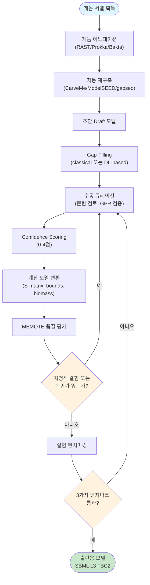

# 1. 재구축의 전체 그림: 초안에서 금 표준까지

Genome-scale metabolic model을 만드는 작업은 크게 두 갈래로 나뉩니다. 하나는 연구자가 문헌과 실험 데이터를 근거로 한 반응씩 검증하는 **수동 재구축(manual reconstruction)**이며, 다른 하나는 게놈 서열과 참조 데이터베이스만으로 몇 분~몇 시간 안에 초안을 생성하는 **자동화 재구축(automated reconstruction)**입니다. 두 경로 모두 출발점은 게놈 서열이고 도착점은 FBA 시뮬레이션이 가능한 계산 모델이지만, 소요 시간(몇 분 vs. 몇 개월~몇 년)과 최종 품질(빠르지만 낮은 curation 밀도 vs. 느리지만 높은 신뢰도) 사이에 뚜렷한 트레이드오프가 있습니다. 이는 앞서 "이 장을 시작하며"의 레시피 비유에서 본 "유명 셰프의 레시피"와 "레시피 짜깁기"의 대비와 정확히 같은 구조입니다.

*Figure 5.1: 대사 모델 구축의 전체 워크플로우. MEMOTE 총점에 보편적 합격선은 없으므로, 치명적 결함과 이전 버전 대비 회귀를 먼저 확인한 뒤 목적에 맞는 표현형 벤치마크로 넘어갑니다.*

이 순환 구조를 눈여겨보십시오 — 화살표가 "MANUAL"로 두 번이나 되돌아갑니다. 지도 제작 비유로 말하면, 초안 지도(DRAFT)를 그린 뒤 끊어진 다리를 잇고(GAPFILL), 현장 답사로 검증하고(MEMOTE, BENCH), 문제가 발견되면 다시 지도를 고치는(MANUAL) 순환입니다. "완성된 모델"이란 이 순환이 충분히 반복되어 더 이상 큰 오류가 나오지 않는 상태를 말합니다.

> **핵심 개념 · 용어(English):** **재구축(Reconstruction)** vs. **모델(Model)** — 재구축은 게놈 주석·문헌·데이터베이스를 통합해 얻은 반응 네트워크 그 자체(정성적 지식 표현)를 가리키며, 모델은 여기에 flux bounds와 biomass objective function을 부여하여 [FBA](../chapter-4/README.md) 시뮬레이션이 가능하도록 만든 계산 객체를 가리킵니다. 이 장의 §3(Stage 3)이 바로 재구축을 모델로 변환하는 단계입니다.

## 1.1 미생물 GEM의 정확도 평가 기준: 세 가지 표현형 벤치마크

수동이든 자동이든, 완성된 GEM의 품질은 궁극적으로 **표현형 예측력**으로 판가름 납니다. Thiele & Palsson(2010)이 확립한 이래 거의 모든 미생물 GEM 재구축 프로젝트가 사용하는 세 가지 독립적인 벤치마크가 있습니다.

**① 분비 생성물 프로파일(Secretion Product Profile)**

무산소(anoxic) 조건에서 대장균은 발효를 통해 ATP를 생성하며 부산물을 분비합니다.

| 생성물 | 대표 경로 | 일반적인 비율 |
|:---|:---|:---|
| 아세테이트(Acetate) | 피루브산 → 아세틸-CoA → 아세테이트 | 가장 풍부 |
| 락테이트(Lactate) | 피루브산 → 락테이트 (NADH 재산화) | 글루코스 과잉 시 |
| 에탄올(Ethanol) | 아세틸알데히드 → 에탄올 | 혼합산 발효 시 |
| 포름산(Formate) | 피루브산 → 포름산 + 아세틸-CoA | 포름산 분해 시스템 |
| 석시닌산(Succinate) | PEP → 옥살아세테이트 → 석시닌산 | 석시닌산 경로 활성화 시 |

*Table 5.1: 대장균 무산소 발효의 주요 분비 생성물. 아세테이트 분비 예측은 피루브산 용량이 TCA cycle 경로와 아세테이트 경로 사이에서 경쟁적으로 분배되기 때문에 가장 어려운 과제 중 하나입니다.*

이 벤치마크는 네트워크 전체의 **화학량론적 균형(stoichiometric balance)**을 테스트합니다.

**② 단일 유전자 결손 성장 표현형(Single Gene Deletion Growth Phenotype)**

각 유전자를 하나씩 결손시켰을 때 세포가 생존 가능한지(essential vs. non-essential)를 예측합니다. 유전자 필수성의 수학적 기준은 다음과 같습니다.

$$\text{Gene } i \text{ is essential if: } v_{bio}^{\Delta i} < \theta \times v_{bio}^{WT}$$

여기서 $$v_{bio}^{\Delta i}$$는 유전자 $$i$$가 결손되었을 때의 최대 biomass flux, $$v_{bio}^{WT}$$는 야생형의 최대 biomass flux, $$\theta$$는 임계값(일반적으로 0.05~0.10)입니다. iML1515에서는 약 300개 유전자가 essential로 예측되며 이 중 약 90%가 실험과 일치합니다. 이 벤치마크는 **개별 유전자-반응 연관의 정확도**를 테스트합니다.

**③ 탄소원/에너지원 이용 패턴(Carbon/Energy Source Utilization)**

세포가 어떤 탄소원으로 성장할 수 있는지 예측합니다(예: 대장균은 포도당·글리세롤·아세테이트는 이용하지만 셀룰로오스는 이용하지 못함). 이 벤치마크는 **네트워크 완전성(completeness)**을 테스트합니다.

**정확도 지표: 민감도와 특이도**

| 지표 | 정의 | 목표 값 |
|:---|:---|:---:|
| Sensitivity (재현율) | 실제 essential 유전자 중 모델이 essential로 예측한 비율 | > 0.60 |
| Specificity (정확도) | 실제 non-essential 유전자 중 모델이 non-essential로 예측한 비율 | > 0.90 |
| Precision (정밀도) | 모델이 essential로 예측한 유전자 중 실제 essential인 비율 | > 0.50 |
| F1 Score | Precision과 Recall의 조화 평균 | > 0.55 |

*Table 5.2: 유전자 필수성 예측의 정확도 지표. 특이도가 민감도보다 항상 높게 요구되는 이유는, 모델에 누락된 아이소자임·대체 경로 때문에 실제로는 non-essential인 유전자를 essential로 오판(false positive essential prediction)하는 경향이 흔하기 때문입니다. 이러한 오판은 GEM의 네트워크 불완전성을 드러내는 중요한 신호입니다.*

> **잠깐, 생각해보기.** 왜 specificity(> 0.90)가 sensitivity(> 0.60)보다 훨씬 엄격한 기준을 요구할까요? 힌트: 모델에 아이소자임이나 대체 경로가 빠져 있으면 어떤 방향의 오류가 생길지 생각해보세요. — 답: 모델에서 대체 경로가 누락되면, 실제로는 우회로가 있어 non-essential인 유전자를 모델은 "이 반응이 막히면 성장이 멈춘다"고 잘못 예측(essential로 오판)합니다. 이는 위양성(false positive essential) 오류이며, 네트워크가 불완전할수록 늘어납니다. 따라서 specificity가 낮다는 것은 곧 네트워크 완전성이 부족하다는 직접적 신호가 됩니다.

세 벤치마크 모두에서 높은 정확도를 달성해야만 "고품질" GEM이라 할 수 있으며, 이는 §3.4(Stage 4 검증)와 §6(MEMOTE)에서 반복적으로 등장하는 공통의 잣대입니다.

---
