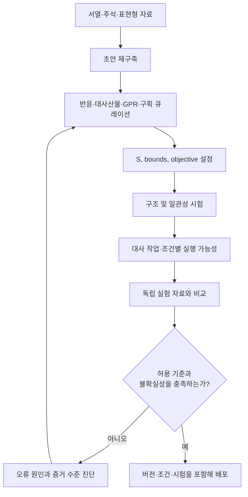

# 1. 재구축과 검증의 전체 구조

GEM 구축은 증거 수집, 네트워크 정제, 수학적 모델화 및 외부 검증으로 이루어진 반복 과정이다. 자동화 재구축은 대규모 초안 생성에 적합하고 수동 큐레이션은 반응별 근거와 예외를 정밀하게 기록하는 데 적합하다. 두 방법은 배타적인 대안이 아니라 동일한 생명주기에서 서로 다른 역할을 담당한다.

*Figure 5.2: 대사 모델의 재구축–검증 생명주기. 통과 기준은 연구 목적과 검증 자료에 맞추어 사전에 정의하며, 자동 시험 통과만으로 표현형 타당성이 보장되지는 않는다. 저자 작성; [Thiele & Palsson (2010)](https://doi.org/10.1038/nprot.2009.203)과 [MEMOTE](https://doi.org/10.1038/s41587-020-0446-y)의 절차를 바탕으로 재구성.*

재구축과 모델은 구분해야 한다. **[재구축](../glossary.md)**은 유전자, 단백질, 반응, 대사산물 및 근거 문헌을 연결한 지식 기반이다. **모델**은 이 지식 기반에서 분석 범위를 선택하고, flux bounds·교환 조건·목적함수를 지정하여 계산 가능한 형태로 만든 것이다. 동일한 재구축에서도 배지와 경계 조건이 다르면 서로 다른 모델 인스턴스와 예측이 생성된다.

## 1.1 품질 평가의 세 층위

모델 품질은 하나의 총점으로 충분히 표현되지 않는다. 적어도 다음 세 층위를 분리해 평가한다.

| 평가 층위 | 대표 질문 | 대표 검사 |
|:---|:---|:---|
| 구조·표준 | 파일과 네트워크 표현이 완전한가? | 식별자, 주석, 단위, [SBML FBC](../glossary.md), 중복 반응 |
| 물리·수학적 일관성 | 보존 법칙과 지정 제약을 만족하는가? | 질량·전하 균형, [화학량론적 일관성](../glossary.md), [blocked reaction](../glossary.md), energy-generating cycle |
| 외부 타당성 | 독립 실험을 조건별로 재현하는가? | 기질 이용, 분비율, 성장률, 유전자 결손, 대사 작업 |

구조 시험은 오류를 빠르게 발견하지만 생물학적 정확도를 직접 측정하지 않는다. 반대로 표현형 일치는 강한 검증 자료가 될 수 있으나, 하나의 표현형을 [gap-filling](../glossary.md)에 사용한 뒤 같은 자료로 평가하면 독립 검증이 아니다. 학습·큐레이션에 사용한 자료와 최종 시험 자료를 구분해야 한다.

## 1.2 조건별 표현형 벤치마크

미생물 GEM에서는 다음 자료가 자주 사용된다. 어느 항목도 단독으로 모델 전체의 품질을 대표하지 않는다.

### 기질 이용과 성장

각 배지에서 허용된 교환 반응과 uptake bound를 실험 조건에 맞춘 뒤, biomass flux가 사전 정의한 임계값을 넘는지 비교한다. 탄소원 이용의 불일치는 수송체, 보조인자 요구, 경로 누락뿐 아니라 배지 조성이나 산소 경계의 불일치에서도 발생한다.

### 분비 생성물과 교환 flux

발효산물 또는 부산물의 존재 여부와 정량 flux를 비교한다. 정량 비교에는 배양 방식, 성장률, 기질 섭취율 및 단위가 필요하다. 단순 [FBA](../chapter-4/README.md)의 최적해가 여러 개인 경우 특정 분비 flux가 유일하게 결정되지 않을 수 있으므로 [FVA](../glossary.md) 또는 추가 목적함수의 영향을 함께 보고한다.

### 단일 유전자 결손

유전자 $$i$$의 결손 모델에서 예측한 성장률과 야생형 성장률의 비를 사용한다.

$$
r_i=\frac{\mu_{\Delta i}}{\mu_{WT}}, \qquad
\widehat{y}_i=
\begin{cases}
1 & r_i < \theta \\
0 & r_i \ge \theta
\end{cases}
$$

여기서 양성 class $$y=1$$은 ‘필수 유전자’, $$\theta$$는 필수성 판정 임계값이다. $$\theta$$는 보편 상수가 아니며 실험의 검출 한계와 판정 규칙에 맞추어 사전에 지정해야 한다. 실험과 모델은 균주, 배지, 산소 조건 및 유전자 ID 체계가 일치해야 한다.

|  | 실험: 필수 | 실험: 비필수 |
|:---|---:|---:|
| 모델: 필수 | TP | FP |
| 모델: 비필수 | FN | TN |

$$
\mathrm{Sensitivity}=\frac{TP}{TP+FN},\qquad
\mathrm{Specificity}=\frac{TN}{TN+FP}
$$

$$
\mathrm{Precision}=\frac{TP}{TP+FP},\qquad
F_1=\frac{2\,\mathrm{Precision}\,\mathrm{Sensitivity}}
{\mathrm{Precision}+\mathrm{Sensitivity}}
$$

민감도 저하는 실험상 필수인 유전자를 모델이 비필수로 예측했다는 뜻이며, 허위 우회 반응이나 지나치게 느슨한 OR 규칙을 우선 점검한다. 특이도 저하는 실험상 비필수인 유전자를 모델이 필수로 예측했다는 뜻이며, 아이소자임·대체 경로·수송 반응의 누락을 점검한다. 다만 어느 오류도 단일 원인으로 확정할 수 없으며, 실험 판정과 배지 매핑을 먼저 확인한다.

## 1.3 임계값 의존성의 예

`e_coli_core`의 특정 조건에서 야생형 최대 성장률을 $$\mu_{WT}=0.874\ \mathrm{h}^{-1}$$로 계산하고 $$\theta=0.05$$를 사용한다고 가정하면 판정 경계는 다음과 같다.

$$
\theta\mu_{WT}=0.05\times0.874=0.0437\ \mathrm{h}^{-1}
$$

| 결손 후 성장률 ($$\mathrm{h}^{-1}$$) | 성장 비 $$r_i$$ | $$\theta=0.05$$ 판정 |
|---:|---:|:---|
| 0.010 | 0.011 | 필수 |
| 0.050 | 0.057 | 비필수 |
| 0.620 | 0.709 | 비필수 |

두 번째 사례는 임계값을 0.10으로 변경하면 필수로 분류된다. 따라서 논문이나 모델 버전을 비교할 때는 confusion matrix 지표와 함께 $$\theta$$, solver tolerance, 배지, 목적함수 및 야생형 성장률을 보고해야 한다. ‘성장률이 정확히 0인 경우만 필수’라는 정의도 수치 오차와 실험 검출 한계를 무시하므로 일반적인 판정 규칙으로 사용할 수 없다.

## 1.4 검증 자료의 기록 단위

재현 가능한 벤치마크는 최소한 다음 메타데이터를 포함한다.

- 모델의 이름, release 또는 commit, 파일 checksum
- 균주와 유전자 식별자 매핑
- 배지 조성, 교환 반응 ID, 각 uptake/secretion bound와 단위
- 목적함수, solver, feasibility tolerance 및 분석 코드 버전
- 실험 자료의 출처, 반복 수, 판정 기준 및 제외 기준
- 큐레이션에 사용한 자료와 독립 시험에 사용한 자료의 구분

iML1515와 같은 출판 모델의 성능 수치도 해당 논문이 사용한 조건과 검증 집합에 종속된다. 모델 간 우열을 주장하려면 동일한 데이터 분할과 조건에서 평가해야 한다. iML1515의 구성과 원 논문 검증은 [Monk et al. (2017)](https://doi.org/10.1038/nbt.3956)을 참조한다.

---
