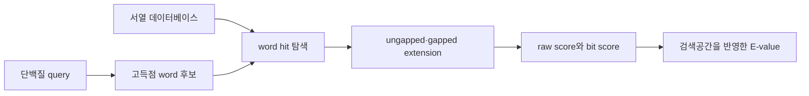

# 2. 유전자 주석과 상동성 검색

게놈 서열에서 대사 반응을 추론하려면 먼저 단백질 암호화 영역을 예측하고, 각 단백질에 기능 후보와 근거를 부여해야 한다. 이 과정은 세 단계를 구분해 기록한다.

1. **구조 주석(structural annotation)**: 유전자와 CDS의 위치, reading frame 및 번역 산물을 결정한다.
2. **기능 주석(functional annotation)**: 단백질 family, domain, ortholog group 및 촉매 기능 후보를 할당한다.
3. **반응 매핑(reaction mapping)**: EC 번호나 데이터베이스 식별자를 화학량론과 방향성이 명시된 반응으로 연결한다.

서열 유사성은 공통 조상을 지지하는 증거이지만, 동일한 촉매 기능을 직접 증명하지 않는다. 특히 paralog의 기능 분화, 다중 도메인 단백질, 효소의 기질 promiscuity 및 복합체 subunit 누락은 자동 기능 전이에서 주요 오류 원인이 된다.

## 2.1 주석 도구의 역할

| 도구 | 주된 범위 | 대표 산출물 | 재구축에서 확인할 사항 |
|:---|:---|:---|:---|
| RAST/RASTtk | 원핵생물 기능 주석 | subsystem·기능 역할 | subsystem 용어와 반응 ID의 매핑 |
| Prokka | 원핵생물 통합 주석 | GFF, 단백질 FASTA, 기능명 | 참조 DB와 실행 버전 |
| Bakta | 원핵생물 통합 주석 | 표준화된 유전자·기능 ID | DB release와 식별자 충돌 |
| eggNOG-mapper | orthology 기반 기능 전이 | eggNOG group, GO, EC, KO | taxonomic scope와 ortholog 수준 |
| DFAST | 원핵생물 주석·품질 점검 | GFF, GenBank, 기능명 | 참조 균주와 제출 기준 |

*Table 5.3: 재구축에 사용되는 주석 도구의 기능 범위. ‘속도’와 ‘정확도’의 단일 순위는 데이터베이스 release, 생물 분류군 및 평가 집합에 따라 달라지므로 제시하지 않았다.*

EC 번호는 반응 class를 계층적으로 표현하지만 유전자와 반응 사이의 일대일 식별자가 아니다. 하나의 효소가 여러 반응을 촉매할 수 있고, 여러 아이소자임이 같은 반응을 촉매할 수 있으며, 불완전 EC 번호는 기질 또는 반응 특이성이 결정되지 않았음을 뜻한다. 따라서 `gene → EC → reaction` 변환에는 기질 특이성, 보조인자, 방향성 및 세포 [구획](../glossary.md)을 별도로 검토해야 한다.

## 2.2 BLASTP와 정렬 통계

BLASTP는 단백질 query와 데이터베이스 서열 사이의 **국소 정렬(local alignment)**을 탐색한다. 기본 원리는 점수가 높은 짧은 word hit를 찾고, 이를 양방향으로 확장해 높은 점수의 국소 정렬을 얻는 것이다. 실제 구현에는 치환 행렬, neighborhood word, gap penalty 및 통계 보정이 포함되므로, 아래 도식은 계산 흐름을 개념적으로 요약한 것이다.



*Figure 5.3: BLASTP 검색의 개념적 흐름. 저자 작성; [Altschul et al. (1990)](https://doi.org/10.1016/S0022-2836(05)80360-2)과 [NCBI BLAST 문서](https://www.ncbi.nlm.nih.gov/books/NBK279684/)를 바탕으로 재구성.*

### 핵심 출력값

| 출력값 | 정의 | 해석상의 제한 |
|:---|:---|:---|
| Raw score $$S$$ | 치환 점수와 gap penalty의 합 | scoring system이 다르면 직접 비교하기 어렵다 |
| Bit score $$S'$$ | $$S$$를 scoring system의 통계 매개변수로 정규화 | 기능 동일성이나 길이 보정을 의미하지 않는다 |
| E-value $$E$$ | 현재 검색공간에서 해당 점수 이상의 우연 정렬이 기대되는 수 | DB 크기와 조성에 의존하며 P-value가 아니다 |
| Identity | 정렬 구간에서 같은 residue의 비율 | 정렬 길이와 coverage를 함께 보아야 한다 |
| Positives | 치환 행렬 점수가 양수인 residue pair의 비율 | 촉매 잔기 보존을 직접 보장하지 않는다 |
| Query/subject coverage | 각 전체 서열 중 정렬된 비율 | 다중 도메인 단백질에서는 domain별 해석이 필요하다 |

Karlin–Altschul 통계에서 E-value는 개념적으로 다음과 같이 표현된다.

$$
E=Kmn e^{-\lambda S}
$$

$$m$$과 $$n$$은 유효 query 및 데이터베이스 검색공간, $$K$$와 $$\lambda$$는 scoring system에 의존하는 매개변수이다. 다른 조건이 같다면 데이터베이스 크기 $$n$$이 두 배가 될 때 $$E$$도 두 배가 된다. 반면 raw score가 $$\Delta S$$만큼 증가하면 E-value는 $$e^{-\lambda\Delta S}$$배가 된다. 따라서 E-value는 서열 자체의 고정 속성이 아니라 **특정 query·데이터베이스·scoring 조건에서 얻은 검색 통계량**이다. 정의와 출력 필드는 [NCBI BLAST Glossary](https://www.ncbi.nlm.nih.gov/books/NBK62051/)를 따른다.

### 치환 행렬과 gap penalty

BLOSUM 행렬은 보존된 단백질 block에서 관찰된 residue 치환으로부터 유도한 log-odds 점수이다. BLOSUM 번호가 높은 행렬은 더 높은 서열 동일도에서 군집화한 자료를 사용하므로 비교적 가까운 서열에, 번호가 낮은 행렬은 더 먼 관계 탐색에 사용된다. BLOSUM62는 일반적인 기본값이지만 모든 단백질 family에 최적인 것은 아니다.

Affine gap penalty는 길이 $$L$$인 연속 gap 하나에 대해 다음 형태를 사용한다.

$$
G(L)=G_{open}+(L-1)G_{extend}
$$

일반적으로 $$G_{open}>G_{extend}$$이므로 같은 총 gap 길이라면 여러 gap을 새로 여는 해보다 연속된 gap을 선호한다. 실제 기본값은 BLAST 프로그램, task 및 scoring matrix에 따라 확인해야 한다.

## 2.3 서열 hit에서 기능 후보로

단백질 기능 전이는 단일 E-value cutoff가 아니라 여러 증거를 결합해 수행한다.

| 증거 | 확인 질문 |
|:---|:---|
| 정렬 통계 | E-value, bit score, identity 및 양쪽 coverage가 충분한가? |
| Domain 구조 | 필요한 촉매 domain의 순서와 범위가 보존되는가? |
| 촉매 residue | 알려진 active-site residue와 cofactor-binding motif가 보존되는가? |
| 계통관계 | 후보가 기능이 다른 paralog가 아니라 적절한 ortholog clade에 속하는가? |
| Genomic context | operon, 인접 유전자 및 경로 문맥이 기능 후보를 지지하는가? |
| 생물종·구획 | 해당 생물과 세포 구획에서 기질과 보조인자가 존재하는가? |
| 독립 근거 | knockout, 효소 활성, 대사체 또는 문헌 자료가 있는가? |

Cutoff는 단백질 family별 검증 자료에 맞춰 정해야 한다. 예를 들어 짧고 보존된 domain 하나의 강한 hit가 전체 다중 도메인 효소의 동일 기능을 뜻하지 않을 수 있다. 반대로 먼 상동 단백질이라도 촉매 구조와 계통관계가 명확하면 고정된 identity 기준만으로 제외해서는 안 된다.

### Bidirectional best hit의 범위

양방향 최우수 일치(BBH, reciprocal best hit)는 두 proteome 사이에서 서로를 최고 점수 hit로 선택하는 단백질 pair를 찾는 휴리스틱이다.

```text
proteome A의 X → proteome B의 최고 hit Y
proteome B의 Y → proteome A의 최고 hit X
두 조건이 모두 성립하면 X–Y를 ortholog 후보로 기록
```

BBH는 ortholog를 증명하지 않는다. 계통별 유전자 중복·소실, 서로 다른 진화 속도, many-to-many orthology 및 domain fusion이 있으면 reciprocal best hit와 실제 orthology가 다를 수 있다. 핵심 반응의 기능 전이에는 orthology inference, 계통수 또는 curated protein family를 함께 사용한다.

## 2.4 기능 후보에서 반응과 GPR로


*Figure 5.4: 기능 주석을 모델 반응으로 변환할 때 추가되는 큐레이션 층. 저자 작성.*

KEGG, MetaCyc, BiGG 및 ModelSEED는 서로 다른 범위와 식별자 체계를 사용한다. 데이터베이스에 반응이 수록되어 있다는 사실은 대상 생물에서 그 반응이 존재한다는 직접 증거가 아니다. 반응을 가져올 때에는 다음 항목을 함께 보존한다.

- 원 데이터베이스, release 및 반응 식별자
- 대사산물의 식별자 매핑, 화학식, 전하 및 protonation convention
- 화학량론과 가역성의 근거
- 대상 생물의 유전자·단백질 증거와 confidence category
- 추정 세포 구획과 수송 메커니즘

복합체의 [GPR](../chapter-3/README.md)은 필요한 subunit을 `AND`로, 동일 반응을 독립적으로 촉매하는 아이소자임을 `OR`로 연결한다. 후보 유전자가 여러 개라는 이유만으로 모두 OR에 포함할 수 없으며, 한 subunit이 검출되지 않았다는 이유로 GPR을 비워서도 안 된다. 빈 GPR은 많은 분석 도구에서 유전자 결손의 영향을 받지 않는 반응으로 처리될 수 있다. 불완전한 복합체는 `incomplete/low confidence`로 표시하여 검토하거나, 독립적인 생화학 근거가 없다면 계산 모델에서 제외한다.

| 참조 복합체 | 대상 게놈의 증거 | 초안 처리 |
|:---|:---|:---|
| `geneA AND geneB` | A와 B 모두 family·domain·구획 근거가 충분 | AND GPR 후보로 포함 |
| `geneA AND geneB` | A만 지지되고 B는 미검출 | 반응과 GPR을 불완전 후보로 기록 |
| `geneA OR geneC` | C가 높은 점수 hit이나 다른 paralog clade | OR에 자동 추가하지 않고 기능 검증 |

서열 근거의 강도와 Thiele–Palsson의 반응 confidence category는 같은 척도가 아니다. 매우 강한 BLASTP hit도 직접 효소 활성 측정과 동일한 증거 유형으로 승격되지 않는다. 모델에는 수치가 암시하는 확률 대신 **증거의 종류와 출처**를 기록하는 편이 재현성과 갱신 가능성을 높인다.

---
