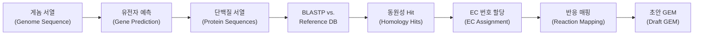

# 2. 유전자 주석과 동원성 검색 (Genome Annotation and Homology Search)

새로운 생물체의 대사 모델을 구축할 때 가장 먼저 던지는 질문은 "잘 알려진 모델 생물체의 효소와 이 생물체의 단백질이 얼마나 유사한가?"입니다. 이 질문에 답하는 것이 **동원성 검색(homology search)**이며, 그 대표 도구가 **BLAST(Basic Local Alignment Search Tool)**입니다.

## 2.1 게놈 어노테이션 도구

| 도구 | 알고리즘 | 속도 | 정확도 | 특징 |
|:---|:---|:---|:---|:---|
| **RAST** | 서브시스템 기반 | 중간 | 높음 | 대사 모델링에 최적화된 기능 분류 |
| **Prokka** | 통합 파이프라인 | 빠름 | 중간 | 원핵생물 특화, 빠른 실행 |
| **eggNOG-mapper** | Orthology 기반 | 중간 | 높음 | 광범위한 진화적 범위 |
| **Bakta** | 최신 통합 | 빠름 | 높음 | Prokka의 개선판 |
| **DFAST** | 웹 기반 | 중간 | 중간 | 사용자 친화적 인터페이스 |

*Table 5.3: 주요 게놈 어노테이션 도구 비교. RAST는 대사 모델링에 가장 적합한 기능 분류 체계를 제공하며, CarveMe/ModelSEED와 같은 자동화 도구들이 이를 활용합니다.*

EC(Enzyme Commission) 번호 할당에는 몇 가지 근본적인 어려움이 있습니다: (1) 하나의 효소가 여러 반응을 촉매하는 **1:多 관계**(효소 다기능성, 예: CYP450), (2) 여러 효소가 동일 반응을 촉매하는 **多:1 관계**(아이소자임), (3) 새로 발견된 효소의 EC 번호 **미할당**, (4) 복합체 효소의 서브유닛별 **별도 EC 번호** 문제.

## 2.2 BLASTP의 원리와 매개변수

BLAST는 1990년 Altschul et al.이 개발한 서열 유사성 검색 도구로, query sequence를 database의 모든 서열과 비교해 통계적으로 유의미한 유사성을 가진 hit들을 찾습니다. BLASTP는 단백질 서열 간 비교에 사용되며, 핵심 아이디어는 **"seed-and-extend"** 접근법입니다.

1. **단어 목록 생성**: query 서열에서 길이 $$w$$인 짧은 단어(word)를 생성(단백질은 보통 $$w=3$$).
2. **고득점 쌍 탐색**: database 서열 중 이 단어와 매칭되는 위치를 빠르게 탐색.
3. **확장(Extension)**: 매칭 위치에서 양방향으로 서열을 확장하며 alignment score 계산.
4. **유의성 평가**: 확장된 alignment의 통계적 유의성을 E-value로 평가.

| 매개변수 | 기본값 | 설명 | 대사 모델링에서의 의미 |
|:---|:---|:---|:---|
| **E-value** | 10 | 기대값 — 주어진 점수 이상의 alignment가 우연히 발생할 확률 | 작을수록 신뢰도 높음. 일반적으로 $$10^{-5}$$ 이하 사용 |
| **Bit score** | — | 서열 길이로 정규화된 alignment 점수 | 클수록 유사성 높음. 100 이상이면 상당히 유사 |
| **Identity** | — | Alignment 영역에서 동일 아미노산의 비율(%) | 30% 이상이면 동일 fold일 가능성 높음 |
| **Coverage** | — | Query 서열이 alignment로 커버되는 비율(%) | 70% 이상이면 전체 도메인 보존 가능성 |
| **Matrix** | BLOSUM62 | 치환 행렬(substitution matrix) | 진화적 거리에 따라 선택 |
| **Word size** | 3 | 초기 seed의 길이 | 작을수록 민감하지만 느림 |

*Table 5.4: BLASTP의 핵심 매개변수. 대사 모델링에서 가장 중요한 것은 E-value, Identity, Coverage 세 가지입니다.*

E-value의 수학적 정의는 다음과 같습니다.

$$E = K \cdot m \cdot n \cdot e^{-\lambda S}$$

여기서 $$K$$는 치환 행렬과 gap penalty에 의존하는 상수, $$m$$은 query 서열 길이, $$n$$은 database 전체 서열 길이, $$\lambda$$는 점수 체계 의존 상수, $$S$$는 raw alignment score입니다. $$E=10$$은 "우연히 이 점수 이상의 alignment가 10번 나타날 것으로 기대됨"을, $$E=10^{-10}$$은 "1백억 개의 서열 중 1번 나타날 것으로 기대됨"을 의미합니다.

**손으로 계산해보기 — E-value가 alignment score에 얼마나 민감한가.** 수식을 눈으로만 보면 감이 잘 오지 않으므로, 단순화한 숫자로 직접 계산해봅시다. $$K=0.1$$, $$\lambda=0.3$$, query 길이 $$m=300$$, database 크기 $$n=10^7$$(약 1천만 잔기)이라 하겠습니다.

- $$S=60$$일 때: $$E = 0.1 \times 300 \times 10^7 \times e^{-0.3 \times 60} = 3\times10^8 \times e^{-18} \approx 3\times10^8 \times 1.5\times10^{-8} \approx 4.5$$ → "우연히도 이 정도 점수가 나올 수 있다"는 뜻으로, 신뢰하기 어렵습니다.
- $$S=100$$일 때: $$E = 3\times10^8 \times e^{-30} \approx 3\times10^8 \times 9.4\times10^{-14} \approx 2.8\times10^{-5}$$ → Tier 2~3 수준의 신뢰도.
- $$S=150$$일 때: $$E = 3\times10^8 \times e^{-45} \approx 3\times10^8 \times 2.9\times10^{-20} \approx 8.7\times10^{-12}$$ → Tier 1(거의 확실한 동원성).

이 세 계산에서 핵심 교훈은, alignment score가 60→100→150으로 겨우 2.5배 늘었을 뿐인데 E-value는 4.5 → $$10^{-5}$$ → $$10^{-12}$$로 **10억 배 이상** 떨어진다는 점입니다. 지수함수이기 때문에 score의 작은 변화가 신뢰도 판정을 극적으로 바꿀 수 있으므로, 실무에서는 E-value 하나만 보지 않고 identity·coverage와 함께 판단합니다(아래 Table 5.6).

| E-value 임계값 | 의미 | 대사 모델링 적용 |
|:---|:---|:---|
| $$\leq 10^{-30}$$ | 거의 동일한 단백질 | 동일 EC 번호 할당, 동일 반응 매핑 |
| $$10^{-30}$$ – $$10^{-10}$$ | 밀접한 동원성 | 동일 반응 가족, 신뢰도 높은 기능 할당 |
| $$10^{-10}$$ – $$10^{-5}$$ | 원격 동원성 | 보수적 접근 필요, 추가 검증 권장 |
| $$> 10^{-5}$$ | 불확실한 동원성 | 일반적으로 무시하거나 수동 검증 필요 |

BLOSUM(BLOcks SUbstitution Matrix) 행렬은 진화적으로 관련된 단백질 블록에서 유도된 아미노산 치환 확률입니다.

| 행렬 | 유도 방법 | 적합한 비교 |
|:---|:---|:---|
| BLOSUM45 | ≤ 45% identity 클러스터 | 원격 동원성(different families) |
| BLOSUM62 | ≤ 62% identity 클러스터 | 일반적(default) |
| BLOSUM80 | ≤ 80% identity 클러스터 | 밀접한 동원성(same family) |

❓ **흔한 오해:** "BLASTP에서 높은 유사도가 나오면 반드시 같은 기능(같은 반응)을 촉매한다." 실제로는 그렇지 않습니다. 서열이 매우 유사해도 (1) **paralog**(게놈 내 복제로 생겨나 기능이 분화되었을 수 있는 유전자)라면 다른 반응을 촉매할 수 있고, (2) **promiscuous enzyme**(다기능 효소)은 주 반응 외에 부수적 반응도 촉매하므로 서열 하나로 전체 기능을 단정할 수 없습니다. 그래서 §2.3의 BBH(양방향 최우수 일치)로 ortholog와 paralog를 구분하고, §3.2의 confidence score로 "동원성"과 "실제 실험 증거"를 별개의 축으로 관리합니다.

## 2.3 EC 번호 할당 파이프라인과 BBH 방법

새로운 게놈에서 대사 모델을 구축하는 전형적인 파이프라인은 다음과 같습니다.



*Figure 5.2: 동원성 기반 대사 모델 구축 파이프라인.*

단순한 일방향 BLASTP는 수렴 진화(convergent evolution)로 인한 false positive를 일으킬 수 있어, **양방향 최우수 일치(Bidirectional Best Hit, BBH)** 방법이 널리 사용됩니다.

```
1. Genome A의 단백질 X를 Genome B에 대해 BLASTP → 최우수 hit: Y
2. Genome B의 단백질 Y를 Genome A에 대해 BLASTP → 최우수 hit: X
3. X의 최우수 hit가 Y이고, Y의 최우수 hit가 X이면 → Ortholog로 간주
```

BBH는 **ortholog**(스펙시에이션으로 분리된 동원 유전자)와 **paralog**(게놈 내 복제로 생성된 동원 유전자)를 구분하는 가장 단순한 방법입니다. 대사 모델링에서는 ortholog가 기능을 유지하는 경향이 강해 더 신뢰할 수 있는 기능 할당을 제공합니다.

## 2.4 반응 데이터베이스: KEGG, MetaCyc, UniProt, BiGG, SEED

| 특성 | KEGG | MetaCyc | BiGG | SEED |
|:---|:---|:---|:---|:---|
| **반응 수** | 12,000+ | 14,000+ | 16,337 | 13,000+ |
| **대사산물 수** | 18,000+ | 12,000+ | 10,393 | 12,000+ |
| **큐레이션 철학** | 광범위, 자동 | 깊이, 문헌 기반 | 시뮬레이션 중심, 수동 | 체계적, 질량/전하 균형 |
| **식별자** | C/R 번호 | Compound/Reaction ID | BiGG ID(예: `pyr_c`) | cpd/rxn 번호 |
| **Gene-to-reaction** | KO 시스템 | Pathway Tools | GPR(수동) | RAST 서브시스템 |
| **주요 사용자** | RAVEN, Merlin | Pathway Tools | CarveMe, AuReMe | ModelSEED/KBase |
| **질량/전하 균형** | 불완전 | 대체로 완전 | 완전 | 완전 |

*Table 5.5: 4대 생화학 반응 데이터베이스 비교. 동일한 게놈이라도 데이터베이스에 따라 재구축 결과가 크게 달라집니다 — 예를 들어 CarveMe(BiGG 기반)와 ModelSEED(SEED 기반)는 동일한 *Lactobacillus plantarum* 게놈에서 재구축했음에도 Jaccard 유사도가 약 0.6에 불과합니다. 이는 §4.6(합의적 모델링)의 동기가 됩니다.*

KEGG의 **KO(KEGG Orthology)** 시스템은 BLASTP 결과를 반응으로 매핑하는 핵심 도구로, 기능적으로 동등한 유전자 그룹을 통합 식별자로 묶습니다. MetaCyc은 모든 반응에 문헌 인용을 첨부해 실험적 근거를 보장하므로 KEGG의 보완적 데이터베이스로 유용합니다. UniProt은 서열·도메인·GO term·EC 번호를 아우르는 단백질 중앙 데이터베이스로, BLASTP의 주요 대상 데이터베이스입니다.

대사 모델 구축에서는 단일 임계값보다 **다층적 임계값 체계**가 일반적입니다.

| 계층 | E-value | Identity | Coverage | 권장 처리 |
|:---|:---|:---|:---|:---|
| **Tier 1(최고 서열 지지)** | ≤ $$10^{-30}$$ | ≥ 60% | ≥ 80% | 자동 후보 후 domain·방향성 확인 |
| **Tier 2(높은 서열 지지)** | ≤ $$10^{-10}$$ | ≥ 40% | ≥ 70% | ortholog·경로 맥락 확인 |
| **Tier 3(중간 서열 지지)** | ≤ $$10^{-5}$$ | ≥ 30% | ≥ 60% | 수동 검토 필수 |
| **Tier 4(낮은 서열 지지)** | > $$10^{-5}$$ | < 30% | < 60% | 단독 근거로 할당하지 않음 |

*Table 5.6: 설명용 동원성 계층. 실제 cutoff는 단백질 family·서열 길이·데이터베이스에 맞춰 검증해야 하며, Thiele & Palsson confidence score와는 별개입니다.*

서열 Tier와 §3.2의 confidence score를 같은 축으로 바꾸지 마십시오. Tier 1 수준의 BLASTP 결과도 그 자체로는 **서열 증거(보통 confidence 2 범주)**이며, 유전자 제거 실험(score 3)이나 대상 생물체 효소 활성 측정(score 4)을 대신하지 못합니다.

임계값을 너무 엄격하게 설정하면 false negative가, 너무 느슨하면 false positive가 증가합니다. 이를 완화하는 전략으로는 (1) 잘 연구된 생물체에는 엄격한 임계값·덜 연구된 생물체에는 느슨한 임계값을 적용하는 **문맥-의존적 임계값**, (2) 개별 반응이 아닌 전체 경로의 완전성을 보는 **경로 수준 검증**, (3) 할당된 반응이 실제 게놈에 존재하는지 확인하는 **역방향 검색**이 있습니다.

대규모 게놈에서 BLASTP는 느릴 수 있어, **Diamond**가 BLASTP 대비 최대 10,000배 빠르면서 유사한 민감도를 제공하는 대안으로 널리 쓰입니다. CarveMe는 Diamond를 사용해 약 10분 내에 전체 세균 게놈의 모델을 구축합니다.

## 2.5 자동화된 GPR 재구축과 그 한계

동원성 검색 결과를 바탕으로 GPR 문자열을 자동으로 작성하는 절차(GPRuler 개념)는 참조 모델의 반응별 GPR을 대상 게놈의 BLASTP 결과로 치환하는 방식으로 작동합니다: 참조 유전자에 대응하는 동원 유전자가 하나면 직접 매핑, 여러 개면 OR로 연결, 없으면 gene-less 반응으로 남깁니다. GPR 자체의 Boolean 구조(AND/OR)는 [GEM 구조](../chapter-3/README.md)에서 다루었으므로 여기서는 "자동 생성"의 한계에 집중합니다.

자동 GPR 작성의 한계는 다음과 같습니다: (1) 참조 모델의 AND 복합체가 대상 게놈에서도 동일하게 조립되는지 불확실, (2) 임계값에 따라 아이소자임이 과다·과소 할당, (3) 동원 유전자의 구획 위치가 보장되지 않음, (4) Boolean 논리는 활성화/억제 같은 정량적 조절을 포착 못함. 이 때문에 자동 GPR은 항상 **초안(draft)**으로 취급되며, AND 관계(복합체)에는 더 엄격한 임계값($$E \leq 10^{-20}$$), OR 관계(아이소자임)에는 더 느슨한 임계값($$E \leq 10^{-5}$$)을 적용하는 계층적 전략과 domain architecture 확인(InterProScan), phylogenetic profiling, 핵심 복합체(PDC, ETC 등)의 문헌 검증을 병행하는 것이 표준적 완화 전략입니다.

---
