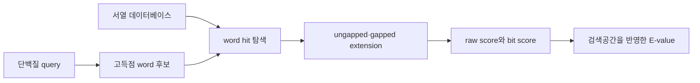

# 2. 유전자 주석과 상동성 검색

게놈 서열만으로는 어떤 대사 반응이 가능한지 바로 알 수 없다. 먼저 단백질을 암호화하는 유전자 영역을 찾고, 각 유전자가 만들 단백질의 기능 후보를 정한다. 그 뒤 이 기능 후보를 반응 후보와 연결한다. 이 과정에서는 다음 세 단계를 구분해 기록해야, 추론과 실험 근거를 혼동하지 않을 수 있다.

1. **구조 주석(structural annotation)**: 유전자와 CDS의 위치, 판독 틀(reading frame) 및 번역 산물을 결정한다.
2. **기능 주석(functional annotation)**: 단백질 계열(family), 도메인(domain), 직교상동군(ortholog group) 및 촉매 기능 후보를 할당한다.
3. **반응 매핑(reaction mapping)**: EC 번호나 데이터베이스 식별자를 화학량론과 방향성이 명시된 반응으로 연결한다.

통계적으로 유의하고 충분한 범위를 덮는 서열 유사성은 두 단백질의 공통 조상 가설을 지지할 수 있다. 그러나 상동성(homology) 자체가 같은 촉매 기능이나 orthology를 확정하지는 않는다. 특히 paralog(유전자 중복으로 생긴 사본)의 기능 분화, 다중 도메인 단백질, 효소의 기질 다중성(promiscuity), 복합체 소단위체(subunit) 누락이 자동 기능 전이의 주요 오류 원인이 된다.

## 2.1 주석 도구의 역할

| 도구 | 주된 범위 | 대표 산출물 | 재구축에서 확인할 사항 |
|:---|:---|:---|:---|
| RAST | 원핵생물 기능 주석 서비스 | 하위 체계(subsystem)·기능 역할 | 서비스·데이터베이스 릴리스와 실행 설정 |
| RASTtk | 원핵생물 기능 주석 도구 모음(toolkit) | 하위 체계·기능 역할 | 도구 모음·데이터베이스 릴리스와 실행 설정 |
| Prokka | 원핵생물 통합 주석 | GFF, 단백질 FASTA, 기능명 | 참조 DB와 실행 버전 |
| Bakta | 원핵생물 통합 주석 | 표준화된 유전자·기능 ID | DB 릴리스와 식별자 충돌 |
| eggNOG-mapper | 직교상동성(orthology) 기반 기능 전이 | eggNOG 군, GO, EC, KO | 분류군 범위와 직교상동 수준 |
| DFAST | 원핵생물 주석·품질 점검 | GFF, GenBank, 기능명 | 참조 균주와 제출 기준 |

*Table 5.3: 재구축에 사용되는 주석 도구의 기능 범위. ‘속도’와 ‘정확도’의 단일 순위는 데이터베이스 릴리스, 생물 분류군 및 평가 집합에 따라 달라지므로 제시하지 않았다.*

이 표는 도구의 역할을 구분하는 학습용 지도이며 현재 호환성을 보증하지 않는다. 실제 재구축 기록에는 입력 파일 체크섬(checksum), 실행형 또는 서비스 버전, 참조 데이터베이스 릴리스, 주요 설정, 각 산출물 체크섬과 해결되지 않은 매핑을 함께 남긴다. 여섯 도구의 현재 지원 범위는 각 공식 문서와 릴리스를 확인하기 전까지 `needs_verification`으로 취급한다.

한 후보가 단계 사이에서 어떻게 바뀌었는지는 도구 이름만이 아니라 같은 후보 ID에 결박된 추적 기록(provenance record)으로 남긴다. 다음은 형식만 보여 주는 가상 기록이며 실제 주석 결과가 아니다.

| 단계 | 입력과 실행 정체성 | 후보 산출물 | 다음 단계로 넘길 미해결 항목 |
|:---|:---|:---|:---|
| 구조 주석 | `assembly-X` 체크섬; `annotator-Y` 버전·설정 | `gene_042`, CDS 좌표·방향, `protein_042` 서열 체크섬 | 시작 코돈과 유전자 경계 검토 |
| 기능 주석 | `protein_042`; 참조 DB 릴리스·검색 설정 | 계열·도메인·직교상동군 및 EC 후보, 근거 ID | paralog 배제와 기질 특이성 확인 |
| 반응/GPR 후보 | 기능 후보; 반응 DB 릴리스·식별자 매핑 | 반응식·방향성·구획과 `gene_042` GPR 후보 | 화학량론, 보조인자, 독립 생물학 근거 |

EC 번호는 반응 class를 계층적으로 표현하지만 유전자와 반응 사이의 일대일 식별자가 아니다. 하나의 효소가 여러 반응을 촉매할 수 있고, 여러 아이소자임이 같은 반응을 촉매할 수 있으며, 불완전 EC 번호는 기질 또는 반응 특이성이 결정되지 않았음을 뜻한다. 따라서 `gene → EC → reaction` 변환에는 기질 특이성, 보조인자, 방향성 및 세포 [구획](../glossary.md)을 별도로 검토해야 한다.

## 2.2 BLASTP와 정렬 통계

BLASTP는 단백질 질의 서열(query)과 데이터베이스 서열 사이의 **국소 정렬(local alignment)**을 탐색한다. 기본 원리는 점수가 높은 짧은 단어 일치(word hit)를 찾고, 이를 양방향으로 확장해 높은 점수의 국소 정렬을 얻는 것이다. 실제 구현에는 치환 행렬, 이웃 단어(neighborhood word), 갭 벌점(gap penalty) 및 통계 보정이 포함되므로, 아래 도식은 계산 흐름을 개념적으로 요약한 것이다.



*Figure 5.3: BLASTP 검색의 개념적 흐름. 저자 작성; [Altschul et al. (1990)](https://doi.org/10.1016/S0022-2836(05)80360-2)과 [NCBI BLAST 문서](https://www.ncbi.nlm.nih.gov/books/NBK279684/)를 바탕으로 재구성.*

### 핵심 출력값

| 출력값 | 정의 | 해석상의 제한 |
|:---|:---|:---|
| 원점수(raw score) $$S$$ | 치환 점수와 갭 벌점의 합 | 점수 체계(scoring system)가 다르면 직접 비교하기 어렵다 |
| 비트 점수(bit score) $$S'$$ | $$S$$를 점수 체계의 통계 매개변수로 정규화 | 기능 동일성이나 길이 보정을 의미하지 않는다 |
| E-value $$E$$ | 현재 검색공간에서 해당 점수 이상의 우연 정렬이 기대되는 수 | DB 크기와 조성에 의존하며 P-value가 아니다 |
| 동일도(identity) | 정렬 구간에서 같은 아미노산 잔기의 비율 | 정렬 길이와 범위(coverage)를 함께 보아야 한다 |
| 양성 치환(positives) | 치환 행렬 점수가 양수인 아미노산 잔기 쌍의 비율 | 촉매 잔기 보존을 직접 보장하지 않는다 |
| 질의/대상 정렬 범위(query/subject coverage) | 각 전체 서열 중 정렬된 비율 | 다중 도메인 단백질에서는 도메인별 해석이 필요하다 |

Karlin–Altschul 통계에서 E-value는 개념적으로 다음과 같이 표현된다.

$$
E=Kmn e^{-\lambda S}
$$

여기서 $$m$$은 유효 질의 길이, $$n$$은 유효 데이터베이스 검색 길이이며 $$mn$$은 유효 검색공간이다. $$S$$는 무차원 원점수이고, $$K$$와 $$\lambda$$는 치환 행렬과 갭 비용(gap cost)을 포함한 점수 체계에 의존하는 통계 매개변수이다. 비트 점수는 다음과 같이 정의할 수 있다.

$$
S'=\frac{\lambda S-\ln K}{\ln 2}, \qquad E=mn2^{-S'}
$$

다른 조건이 같다면 데이터베이스 검색 길이 $$n$$이 두 배가 될 때 $$E$$도 두 배가 된다. 반면 원점수가 $$\Delta S$$만큼 증가하면 E-value는 $$e^{-\lambda\Delta S}$$배가 된다. 따라서 E-value는 서열 자체의 고정 속성이 아니라 **특정 질의·데이터베이스·점수 조건에서 얻은 검색 통계량**이다. 정의와 출력 필드는 [NCBI BLAST 용어집](https://www.ncbi.nlm.nih.gov/books/NBK62051/)을 따른다.

### E-value 비율 계산 예제

아래 값은 실제 BLAST 실행 결과가 아니라 검색공간과 원점수의 효과를 분리하기 위한 교육용 기준값이다. 기준 검색에서 $$E_1=0.04$$라고 하고, $$K$$, $$m$$, $$\lambda$$와 나머지 설정을 고정한다.

1. 데이터베이스 검색 길이만 $$n_2=2n_1$$로 바꾸면

   $$
   \frac{E_2}{E_1}=\frac{n_2}{n_1}=2, \qquad E_2=0.08
   $$

2. 검색공간은 유지하고 $$\lambda=0.5$$, $$\Delta S=4$$만 적용하면

   $$
   \frac{E_3}{E_1}=e^{-\lambda\Delta S}=e^{-2}\approx0.1353,
   \qquad E_3\approx0.00541
   $$

첫 변화는 같은 점수를 더 큰 데이터베이스에서 평가했기 때문에 E-value를 키우고, 둘째 변화는 같은 검색공간에서 점수가 커졌기 때문에 E-value를 줄인다. 어느 값도 기능 동일성 확률이 아니며, P-value는 Karlin–Altschul 모형에서 별도로 $$P=1-e^{-E}$$로 연결된다.

### 치환 행렬과 갭 벌점

BLOSUM 행렬은 보존된 단백질 블록에서 관찰된 아미노산 잔기 치환으로부터 유도한 로그 오즈(log-odds) 점수이다. BLOSUM 번호가 높은 행렬은 더 높은 서열 동일도에서 군집화한 자료를 사용하므로 비교적 가까운 서열에, 번호가 낮은 행렬은 더 먼 관계 탐색에 사용된다. BLOSUM62는 일반적인 기본값이지만 모든 단백질 계열에 최적인 것은 아니다.

아핀 갭 벌점(affine gap penalty)은 갭을 새로 여는 비용과 아미노산 잔기마다 연장하는 비용을 분리한다. NCBI BLAST 문서의 규약에서는 길이 $$L$$인 연속 갭 하나의 비용을 다음과 같이 센다.

$$
G_{\mathrm{NCBI}}(L)=G_{open}+L G_{extend}
$$

따라서 길이 1인 갭에도 열기(opening)와 연장(extension) 비용이 각각 한 번 적용된다. 일부 교재나 소프트웨어는 첫 잔기의 연장 비용을 열기 항에 흡수하여 $$G_{open}+(L-1)G_{extend}$$로 표기하므로, 수치 비교 전에 규약을 확인해야 한다. 일반적으로 열기 비용이 연장 비용보다 크므로 같은 총 갭 길이라면 여러 갭을 새로 여는 해보다 연속된 갭을 선호한다. 실제 기본값은 BLAST 프로그램, 작업(task) 및 점수 행렬에 따라 [공식 설정 문서](https://www.ncbi.nlm.nih.gov/blast/html/gaplambda.html)에서 확인한다.

## 2.3 서열 hit에서 기능 후보로

단백질 기능 전이는 단일 E-value 판정 기준(cutoff)이 아니라 여러 증거를 결합해 수행한다.

| 증거 | 확인 질문 |
|:---|:---|
| 정렬 통계 | E-value, 비트 점수, 동일도 및 양쪽 정렬 범위가 충분한가? |
| 도메인 구조 | 필요한 촉매 도메인의 순서와 범위가 보존되는가? |
| 촉매 잔기 | 알려진 활성 부위(active-site) 잔기와 보조인자 결합 모티프가 보존되는가? |
| 계통관계 | 후보가 기능이 다른 paralog가 아니라 적절한 ortholog clade에 속하는가? |
| 유전체 문맥(genomic context) | 오페론, 인접 유전자 및 경로 문맥이 기능 후보를 지지하는가? |
| 생물종·구획 | 해당 생물과 세포 구획에서 기질과 보조인자가 존재하는가? |
| 독립 근거 | knockout, 효소 활성, 대사체 또는 문헌 자료가 있는가? |

판정 기준(cutoff)은 단백질 family별 검증 자료에 맞춰 정해야 한다. 예를 들어 짧고 보존된 domain 하나의 강한 hit가 전체 다중 도메인 효소의 동일 기능을 뜻하지 않을 수 있다. 반대로 먼 상동 단백질이라도 촉매 구조와 계통관계가 명확하면 고정된 동일도 기준만으로 제외해서는 안 된다.

### Bidirectional best hit의 범위

양방향 최우수 일치(BBH, reciprocal best hit)는 두 proteome 사이에서 서로를 최고 점수 hit로 선택하는 단백질 pair를 찾는 휴리스틱이다.

```text
proteome A의 X → proteome B의 최고 hit Y
proteome B의 Y → proteome A의 최고 hit X
두 조건이 모두 성립하면 X–Y를 ortholog 후보로 기록
```

BBH는 직교상동 단백질을 증명하지 않는다. 계통별 유전자 중복·소실, 서로 다른 진화 속도, 다대다 직교상동성 및 도메인 융합이 있으면 양방향 최우수 일치와 실제 직교상동성이 다를 수 있다. 핵심 반응의 기능 전이에는 직교상동 추론, 계통수 또는 선별된 단백질 계열을 함께 사용한다.

## 2.4 기능 후보에서 반응과 GPR로


*Figure 5.4: 기능 주석을 모델 반응으로 변환할 때 추가되는 큐레이션 층. 저자 작성.*

그림의 마지막 노드는 흐름을 간결하게 나타내기 위해 서로 다른 검증 층을 한 상자에 묶었다. 질량·전하 균형과 경계 반응 점검은 모델 구조의 일관성 검사이고, 문헌·효소 활성·표현형 비교는 독립 생물학 근거에 대한 검증이므로 같은 통과 판정으로 합치지 않는다.

KEGG, MetaCyc, BiGG 및 ModelSEED는 서로 다른 범위와 식별자 체계를 사용한다. 데이터베이스에 반응이 수록되어 있다는 사실은 대상 생물에서 그 반응이 존재한다는 직접 증거가 아니다. 반응을 가져올 때에는 다음 항목을 함께 보존한다.

- 원 데이터베이스, 릴리스 및 반응 식별자
- 대사산물의 식별자 매핑, 화학식, 전하 및 protonation convention
- 화학량론과 가역성의 근거
- 대상 생물의 유전자·단백질 증거와 근거 신뢰도 범주(confidence category)
- 추정 세포 구획과 수송 메커니즘

복합체의 [GPR](../chapter-3/README.md)은 필요한 subunit을 `AND`로, 동일 반응을 독립적으로 촉매하는 아이소자임을 `OR`로 연결한다. 후보 유전자가 여러 개라는 이유만으로 모두 OR에 포함할 수 없으며, 한 subunit이 검출되지 않았다는 이유로 GPR을 비워서도 안 된다. 빈 GPR은 많은 분석 도구에서 유전자 결손의 영향을 받지 않는 반응으로 처리될 수 있다. 불완전한 복합체는 `incomplete/low confidence`로 표시하여 검토하거나, 독립적인 생화학 근거가 없다면 계산 모델에서 제외한다.

| 참조 복합체 | 대상 게놈의 증거 | 초안 처리 |
|:---|:---|:---|
| `geneA AND geneB` | A와 B 모두 family·domain·구획 근거가 충분 | AND GPR 후보로 포함 |
| `geneA AND geneB` | A만 지지되고 B는 미검출 | 반응과 GPR을 불완전 후보로 기록 |
| `geneA OR geneC` | C가 높은 점수 hit이나 다른 paralog clade | OR에 자동 추가하지 않고 기능 검증 |

### 가상 GPR 판정 기록

다음은 판정 구조를 연습하기 위한 가상 사례이며 실제 단백질이나 실행 결과가 아니다. `EVD-*`는 근거 유형을 추적하기 위한 교육용 ID이다.

| 후보 | 서열·domain·orthology 근거 | 구획·독립 근거 | 판정과 confidence gap |
|:---|:---|:---|:---|
| `geneA AND geneB` | A: full-length hit `EVD-HIT-A`, domain·활성 부위 보존 `EVD-DOM-A`; B: 동일 기준 충족 `EVD-DOM-B`; 두 후보 모두 계통 분석 지지 `EVD-ORTH-AB` | 두 단백질 모두 세포질 예측 `EVD-COMP-AB`; 직접 효소 활성 자료 없음 | AND GPR **후보로 포함**하되 독립 생화학 근거 부재를 unresolved gap으로 기록 |
| `geneA AND geneB` | A만 지지되고 B는 검색·domain 검사에서 미검출 `EVD-MISS-B` | 대상 생물의 복합체 실험 자료 없음 | 반응과 GPR을 `incomplete/hold`로 기록하며 빈 GPR로 바꾸지 않음 |
| `geneA OR geneC` | C는 강한 국소 hit이지만 다른 paralog clade `EVD-PARA-C`; 전체 길이 coverage도 불충분 | 구획은 양립하지만 독립 기능 자료 없음 | C를 OR에서 **제외**하고 family-specific 검토 대기 |

최종 인계 기록(handoff record)에는 후보 상태(`include`, `hold`, `exclude`), 근거 ID와 유형, 출처·데이터베이스 릴리스, 큐레이터, 확인일, 구획, 반응/GPR 초안, 근거 신뢰도 범주와 미해결 공백(unresolved gap)을 함께 남긴다. 이 기록은 다음 절의 반응별 수동 큐레이션 입력이 된다.

서열 근거의 강도와 Thiele–Palsson의 반응 confidence category는 같은 척도가 아니다. 매우 강한 BLASTP hit도 직접 효소 활성 측정과 동일한 증거 유형으로 승격되지 않는다. 모델에는 수치가 암시하는 확률 대신 **증거의 종류와 출처**를 기록하는 편이 재현성과 갱신 가능성을 높인다.

---
