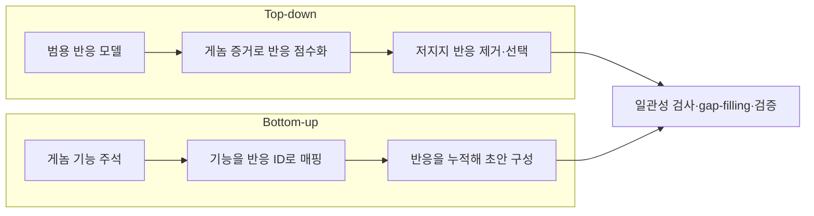

# 4. 자동화 대사 모델 재구축

자동화 도구는 게놈 주석과 참조 지식을 입력받아 초안을 생성한다. 산출물은 반응 목록, [GPR](../chapter-3/README.md), 경계 조건이다. 도구마다 출발 지식, 반응 선택 기준, biomass template, [gap-filling](../glossary.md) 정책이 다르다. 그래서 같은 게놈을 넣어도 서로 다른 모델이 나온다. 실행 시간이나 반응 수만으로는 품질을 비교할 수 없으며, 입력 DB release와 검증 조건을 함께 고정해야 한다.

## 4.1 하향식(top-down)과 상향식(bottom-up)

자동 재구축의 설계는 두 전형으로 구분할 수 있다.



*Figure 5.5: 자동 재구축의 top-down과 bottom-up 전략. 실제 도구는 두 전략의 요소를 함께 사용할 수 있다. 저자 작성; [Machado et al. (2018)](https://doi.org/10.1093/nar/gky537)과 [Henry et al. (2010)](https://doi.org/10.1038/nbt.1672)을 바탕으로 재구성.*

Top-down 방식은 일관된 범용 반응 집합을 공유하므로 모델 간 비교가 쉽고, 참조 집합 밖의 반응을 발견하기 어렵다. Bottom-up 방식은 주석과 데이터베이스 범위를 넓게 반영할 수 있지만, 식별자·화학량론·방향성 불일치가 누적될 수 있다. 어느 방식도 근거가 약한 반응을 자동으로 생물학적 사실로 확정하지 않는다.

여기서 **범용 모델(universal model)**은 모든 생물에서 항상 활성인 “평균 세포”를 뜻하지 않는다. 여러 참조 재구축과 데이터베이스에서 모은 반응 후보, 화학량론, 방향성, GPR을 일관된 식별자로 정리한 **후보 반응 지식베이스**다. 대상 생물의 단백질 서열 근거와 기능 과제를 적용해 이 후보 집합을 줄인 결과가 초안 GEM이며, 이 단계에서 반응이 남았다고 실제 조건에서 플럭스가 흐른다는 뜻은 아니다. Chapter 6의 범용 GEM은 이와 다른 맥락에서, 한 생물종의 알려진 대사 능력 합집합에서 조직·세포 조건에 맞는 모델을 추출하기 전의 기저 재구축을 뜻한다. 두 용례 모두 “조건별 활성 상태”와는 구분한다.

## 4.2 CarveMe

CarveMe는 BiGG 기반 범용 모델에서 시작하는 top-down 도구이다. 대상 proteome과 범용 모델의 GPR을 연결하는 서열 증거로 반응에 점수를 부여하고, 기능을 유지하면서 지지가 낮은 반응을 제거하는 최적화 문제를 푼다. 선택한 배지에서 생장을 요구하면 별도의 gap-filling이 수행될 수 있다.

CarveMe의 흐름을 읽을 때에는 다음 세 산출물을 분리한다.

1. **범용 모델:** 후보 반응의 출발 집합이며, 대상 균주의 검증된 반응 목록이 아니다.
2. **carved 초안:** 단백질 서열과 GPR 근거로 선택한 반응 집합이다. 반응별 서열 근거와 선택 규칙을 남긴다.
3. **배지 특이적 gap-filled 초안:** 지정한 배지·성장 과제를 만족하도록 추가된 가설 반응을 포함한다. 추가 반응은 서열 지지 반응과 구분해 출처 이력(provenance)에 기록한다.

```text
protein FASTA
  → reference proteins와 DIAMOND 정렬
  → gene–reaction 증거 점수
  → universal model carving
  → 선택적 media-specific gap-filling
  → SBML 모델과 근거 기록
```

범용 모델의 큐레이션을 활용한다는 점은 장점이지만, BiGG에 없는 경로와 멀리 떨어진 분류군의 생화학을 충분히 포착하지 못할 수 있다. 또한 gap-filling 반응은 서열 증거를 갖지 않을 수 있으므로 carving 점수와 gap-filling 근거를 구분해 기록한다. 원 알고리즘과 벤치마크는 [Machado et al. (2018)](https://doi.org/10.1093/nar/gky537)을 참조한다.

## 4.3 ModelSEED와 KBase

ModelSEED는 기능 주석을 생화학 데이터베이스와 organism template에 매핑해 초안 모델을 구성하고, biomass 생산 또는 지정한 표현형을 만족하도록 gap-filling을 수행한다. KBase는 데이터 객체, 앱 및 provenance를 연결해 이 절차를 재현 가능한 분석 workflow로 실행할 수 있게 한다.

```text
genome annotation
  → ModelSEED function·reaction mapping
  → organism template와 biomass 적용
  → draft network
  → media별 gap-filling
  → 모델·입력·실행 provenance 저장
```

Bottom-up 방식에서는 주석 오류가 반응 오류로 전파될 수 있고, template 선택과 배지가 gap-filling 결과를 크게 바꾼다. 따라서 사용한 annotation pipeline, template, ModelSEED biochemistry release 및 media formulation을 모델과 함께 보존한다. 기본 방법은 [Henry et al. (2010)](https://doi.org/10.1038/nbt.1672)에 제시되어 있다.

## 4.4 gapseq

gapseq는 서열 상동성뿐 아니라 경로 정의, 핵심 효소 및 반응별 증거를 이용하여 세균의 경로와 수송체를 예측한다. 초안 구성 뒤에는 반응 증거를 비용에 반영한 gap-filling을 적용할 수 있다. 경로 문맥은 누락 후보의 우선순위를 정하는 데 유용하지만, 경로의 다른 효소가 검출되었다는 사실만으로 특정 유전자의 존재가 증명되지는 않는다.

Zimmermann et al.은 여러 유형의 14,931개 표현형 관측을 통합하여 다음 결과를 보고했다.

| 통합 성능 지표 | gapseq | ModelSEED | CarveMe |
|:---|---:|---:|---:|
| Accuracy | 0.80 | 0.69 | 0.66 |
| Sensitivity | 0.71 | 0.33 | 0.34 |
| Specificity | 0.82 | 0.88 | 0.85 |
| [MEMOTE](../glossary.md) score | 0.78 ± 0.004 | 0.39 ± 0.016 | 0.32 ± 0.006 |

*Table 5.11: 출판 당시 도구와 데이터 release를 사용한 통합 벤치마크. 효소 활성, 에너지원, 발효 생성물, 유전자 필수성 및 혐기성 먹이망 자료를 pooled하여 계산했으므로 특정 생물종이나 단일 endpoint의 보편 성능으로 해석하지 않는다. 출처: [Zimmermann et al. (2021)](https://doi.org/10.1186/s13059-021-02295-1), CC BY 4.0.*

같은 논문의 효소 활성 혼동행렬에 표시된 53% true-positive cell과 6% false-negative cell은 전체 cell 중 각 범주의 비율이다. 이 값을 각각 $$TP/(TP+FN)$$과 $$FN/(TP+FN)$$로 정의되는 TPR과 FNR로 다시 표기해서는 안 된다. 서로 다른 도구의 수치를 비교할 때에는 positive class와 분모가 동일한지 먼저 확인한다.

## 4.5 도구 선택과 비교 설계

| 비교 항목 | 기록할 내용 |
|:---|:---|
| 입력 | genome assembly, protein FASTA, annotation 및 checksum |
| 지식 기반 | template·reference model·reaction DB의 release |
| 실행 | 도구·dependency·solver 버전과 명령행 |
| gap-filling | 배지, 요구 growth/task, candidate universe 및 cost |
| 출력 정규화 | compartment·reaction ID mapping과 경계 반응 정의 |
| 구조 평가 | [mass/charge balance](../glossary.md), consistency, [blocked reactions](../glossary.md), annotations |
| 외부 평가 | 사용하지 않은 조건별 phenotype test set |

반응 집합의 Jaccard 유사도는 구조적 일치도를 요약한다.

$$
J(A,B)=\frac{|A\cap B|}{|A\cup B|}
$$

예를 들어 두 모델의 반응 합집합이 10개이고 교집합이 6개이면 $$J=0.6$$이다. 이 값은 불일치의 크기를 나타낼 뿐 어느 모델이 정확한지는 알려주지 않는다. 또한 protonation, 가역 반응 분할, compartment 및 식별자 매핑이 다르면 생화학적으로 같은 반응도 서로 다른 항목으로 계산될 수 있다. Jaccard 값을 계산하기 전에 MetaNetX 등의 교차 참조와 반응 화학량론으로 정규화해야 한다.

도구 선택은 ‘최고 정확도’라는 단일 순위가 아니라 연구 질문에 맞춘다. 대규모 균주 비교에는 일관된 template와 자동 provenance가 중요하고, 잘 연구되지 않은 분류군에는 넓은 반응 지식과 적극적인 수동 검토가 중요하다. 진핵생물은 세포 구획과 targeting evidence가 핵심이며, 미생물용 자동 도구의 지원 범위를 그대로 확장할 수 없다. 모든 경우에 자동 출력은 **검증 전 초안**으로 배포 상태를 명시한다.

---
