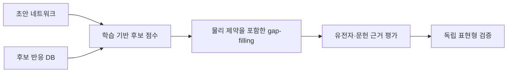

# 5. 갭 필링(gap-filling): 누락 반응 가설 생성

초안 모델이 지정한 배지에서 성장하지 못하거나 알려진 대사 작업을 수행하지 못한다고 해서 항상 반응이 누락된 것은 아니다. 교환 bound, biomass 조성, 반응 방향성, 대사산물 식별자 또는 GPR도 같은 현상을 만들 수 있다. **[Gap-filling](../glossary.md)**은 이러한 원인을 점검한 뒤에도 남는 기능 불일치를 설명하기 위해 후보 반응 집합에서 최소 비용의 추가 가설을 찾는 절차이다.

Gap-filling 결과는 모델을 실행 가능하게 만드는 수학적 해이며, 대상 생물에 반응이 실제로 존재한다는 증명이 아니다. 추가 후보는 후속 서열 검색, 문헌 검토 및 표현형 실험의 우선순위로 취급한다.

## 5.1 혼합정수선형계획 정식화

초안 반응 집합을 $$\mathcal M$$, 후보 반응 집합을 $$\mathcal U$$라 하자. 후보 반응 $$r$$의 선택 여부는 이진 변수 $$y_r$$로 나타낸다.

$$
\min_{\mathbf v,\mathbf y}\sum_{r\in\mathcal U} w_r y_r
$$

제약은 다음과 같다.

$$
\mathbf S\mathbf v=\mathbf 0,
\qquad
\ell_j\le v_j\le u_j \quad (j\in\mathcal M)
$$

$$
\ell_r y_r\le v_r\le u_r y_r
\quad (r\in\mathcal U),
\qquad y_r\in\{0,1\}
$$

$$
\mathbf A_{task}\mathbf v\ge\mathbf b_{task}
$$

마지막 식은 최소 biomass flux, 특정 대사산물 생산, ATP maintenance 또는 여러 배지의 성장과 같은 요구 기능을 나타낸다. 후보를 선택하지 않으면 $$y_r=0$$이므로 해당 flux도 0으로 고정된다. 이 표현은 임의의 단일 big-$$M$$ 대신 반응별 유한 bound $$\ell_r,u_r$$를 사용한다. 지나치게 큰 bound는 선형 완화와 수치 안정성을 악화시키므로 가능한 생리적·열역학적 근거로 제한한다.

모든 $$w_r=1$$이면 선택 반응 수를 최소화한다. 증거 가중 문제에서는 서열·경로·문헌 근거가 강한 후보에 작은 비용을, 비생리적 수송·방향 반전·근거 없는 반응에 큰 비용을 부여한다. 비용은 ‘존재 확률’이 아니라 모델러가 명시한 선호이므로 산출 근거와 민감도 분석을 보고해야 한다.

## 5.2 최소 반응 수와 최소 증거 비용

초안에 $$R_1:A\rightarrow B$$만 있고 산물 $$D$$가 필요하다고 하자. 후보 반응은 다음과 같다.

| 후보 | 반응 | 증거 비용 $$w_r$$ |
|:---|:---|---:|
| $$U_1$$ | $$B\rightarrow C$$ | 1 |
| $$U_2$$ | $$C\rightarrow D$$ | 1 |
| $$U_3$$ | $$B\rightarrow D$$ | 5 |

단순 cardinality 목적함수는 한 반응만 필요한 $$\{U_3\}$$을 두 반응이 필요한 $$\{U_1,U_2\}$$보다 선호한다. 반면 위 가중치를 사용하면

$$
\operatorname{cost}(\{U_3\})=5,\qquad
\operatorname{cost}(\{U_1,U_2\})=1+1=2
$$

이므로 $$\{U_1,U_2\}$$가 선택된다. 어느 해가 생물학적으로 옳은지는 이 계산만으로 결정되지 않는다. 가중치와 candidate universe가 달라지면 해가 바뀌며, 동일 비용의 대안 해도 존재할 수 있다.

실무에서는 다음을 함께 평가한다.

- 반응별 비용을 변화시킨 민감도 분석
- 여러 [대안 최적해](../glossary.md)와 각 반응의 선택 빈도
- 배지를 순차 처리할 때 발생하는 순서 의존성
- 추가 반응을 사용하지 않은 독립 표현형 검증
- 새로 생긴 thermodynamically infeasible cycle과 energy-generating cycle

## 5.3 대표 알고리즘의 목적 차이

| 방법 | 주된 목표 | 핵심 제한 |
|:---|:---|:---|
| SMILEY | 지정 대사산물의 생산을 가능하게 하는 후보 반응 제안 | 목표와 candidate DB에 의존 |
| GapFind/GapFill | 생산·소비 불가능 대사산물을 찾고 연결 가설 제안 | 연결 회복이 표현형 정확도를 보장하지 않음 |
| GrowMatch | in silico/in vivo 성장 불일치를 최소 수정으로 조정 | 반응 추가뿐 아니라 방향 변경 등이 제안될 수 있음 |
| fastGapFill | 구획화 모델에서 compact flux-consistent 확장을 효율적으로 탐색 | 근사 cardinality와 candidate universe에 의존 |

*Table 5.14: gap-filling 알고리즘은 서로 다른 ‘갭’을 목표로 한다. 출처: [Reed et al. (2006)](https://doi.org/10.1186/1471-2105-7-417), [Satish Kumar et al. (2007)](https://doi.org/10.1186/1471-2105-8-212), [Kumar & Maranas (2009)](https://doi.org/10.1371/journal.pcbi.1000308), [Thiele et al. (2014)](https://doi.org/10.1093/bioinformatics/btu321).*

fastGapFill은 fastCore의 $$L_1$$-regularized LP 절차를 확장해 core network를 포함하는 compact flux-consistent network를 구한다. 이는 ‘모든 blocked reaction을 탐욕적으로 하나씩 해제한다’는 절차와 동일하지 않으며 전역 최소 cardinality를 보장하지 않는다. 후보 대사 반응, 수송 반응 및 교환 반응의 비용을 구분할 수 있고, 모든 제안은 후속 검증이 필요한 가설이다.

## 5.4 학습 기반 후보 순위화

학습 기반 방법은 curated model에서 관찰된 반응 공존, 네트워크 topology, 계통 정보 또는 분자 구조를 이용해 후보 반응에 점수를 부여한다. 이 점수는 [MILP](../glossary.md)의 비용이나 수동 검토 순서에 사용할 수 있지만 정상상태, 방향성 및 task feasibility를 자동으로 보장하지 않는다.

CHESHIRE는 대사 네트워크를 hypergraph로 표현하고 topology로부터 후보 hyperlink의 점수를 학습한다. 논문은 108개 BiGG 모델과 818개 AGORA 모델에서 인위적으로 제거한 반응 복원, 그리고 49개 draft model의 일부 분비 표현형을 평가했다. 저자들이 지적하듯, 인위적 deletion 복원과 실제 미지 반응 발견은 같은 문제가 아니며, 올바른 표현형 예측도 추가한 반응의 존재를 증명하지 않는다. 출처: [Chen, Liao & Liu (2023)](https://doi.org/10.1038/s41467-023-38110-7), CC BY 4.0.

*Figure 5.6: 학습 기반 점수와 제약 기반 gap-filling의 역할 분리. 저자 작성; CHESHIRE의 후보 순위화 개념을 일반화하여 재구성.*

학습 기반 결과에는 훈련 모델과 시험 모델의 중복, negative sampling, candidate pool, 인위적 deletion 방식, class imbalance 및 외부 검증 범위를 기록한다. AUROC만으로 불균형한 후보 집합의 성능을 판단하지 않고 AUPRC와 후보 수, 실제 추가 반응 수 및 phenotype별 결과를 함께 본다.

## 5.5 GPR이 없는 반응의 분류

[GPR](../chapter-3/README.md)이 비어 있는 모든 반응을 ‘orphan enzyme reaction’으로 세면 안 된다. 다음 범주를 구분해야 한다.

| 범주 | GPR이 없을 수 있는 이유 | 처리 |
|:---|:---|:---|
| 교환·sink·demand | 시스템 경계를 나타내는 의사반응 | 효소 반응 통계에서 제외 |
| Biomass·maintenance | 모델 목적 또는 집계 반응 | 조성·단위·근거를 별도 기록 |
| 자발 반응 | 효소 없이 진행 가능 | 비효소성 근거와 방향성 기록 |
| 확산·비특이 수송 | 특정 유전자가 알려지지 않음 | 수송 기작과 조건 기록 |
| Orphan biochemical reaction | 반응은 관측되었으나 유전자가 미확인 | 실험 근거와 후보 유전자 기록 |
| Gap-filled hypothesis | 계산 기능을 위해 추가 | 후보 DB, 비용, 요구 task와 검증 상태 기록 |

따라서 ‘GPR이 빈 반응 비율’은 모델별로 위 범주를 분리해 계산한다. 다른 생물종에서 얻은 일반 비율을 특정 모델의 반응 수에 곱해 orphan 수를 추정하는 방식은 사용하지 않는다. Gap-filled 반응은 후속 큐레이션에서 삭제될 수도 있으므로 release note와 provenance에 명시한다.

---
