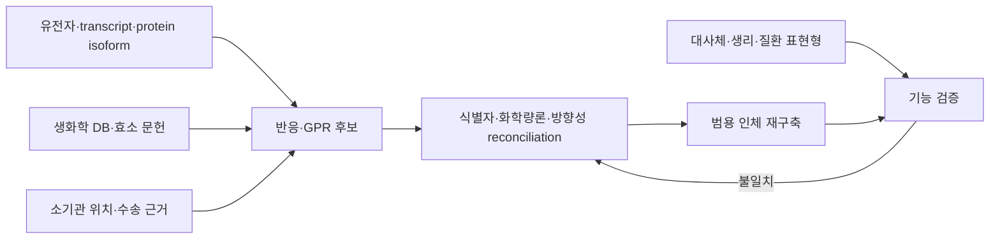

# 7. 인체 대사 네트워크의 재구축 범위

인체 대사 재구축은 미생물 GEM과 같은 보존 법칙과 증거 추적 원칙을 사용하지만, 적용 범위와 불확실성의 구조가 다르다. 하나의 인체 게놈은 여러 조직과 세포 유형이 가질 수 있는 대사 유전자의 공통 기반을 제공한다. 실제 반응 사용 여부는 세포 유형, 분화 상태, 영양 환경, 질병 및 시간에 따라 달라진다.

따라서 다음 두 객체를 구분한다.

- **범용 인체 재구축(generic human reconstruction)**: 인간에서 근거가 확인된 대사 반응의 통합 지식 기반이다. ‘평균 세포’의 활성 flux를 나타내지 않는다.
- **맥락 특이 모델(context-specific model)**: 범용 재구축에 조직·세포·환경 자료와 경계 조건을 적용해 특정 질문에 맞게 추출하거나 제약한 계산 모델이다.

## 7.1 미생물 모델과의 공통점과 차이

| 항목 | 미생물 GEM | 범용 인체 재구축 |
|:---|:---|:---|
| 공통 수학 구조 | $$\mathbf S\mathbf v=0$$, bounds, GPR, objective/task | 동일 |
| 주요 유전자 근거 | 균주 genome과 단백질 기능 | human genome, transcript/protein isoform 및 curated evidence |
| 구획 | 세포막·periplasm·세포질 등 | 세포질과 여러 organelle, extracellular space |
| 환경 정의 | 배지·산소·배양 방식 | 혈장·조직 간 교환, 세포 유형 및 생리 상태 |
| 맥락 특이화 | strain·배지·성장 상태에 필요 | 조직·세포·질병 상태에 필수적 |
| 대표 외부 검증 | 기질 이용, 성장, 분비, 결손 | metabolic task, biomarker, exchange, cell-line dependency |

단세포 생물에서도 게놈에 존재하는 모든 반응이 항상 사용되는 것은 아니므로 ‘게놈 = 실제 활성 대사 전체’라고 놓을 수 없다. 인체에서는 조직 간 기능 분화와 소기관 compartmentation 때문에 이 차이가 더 크고, 범용 지식 기반과 조건별 활성 모델의 구분이 특히 중요하다.

## 7.2 인체 재구축에 필요한 증거 층

*Figure 5.7: 범용 인체 재구축에서 결합되는 증거 층. 저자 작성; [Recon1](https://doi.org/10.1073/pnas.0610772104)과 [Human1](https://doi.org/10.1126/scisignal.aaz1482)의 재구축 절차를 바탕으로 재구성.*

각 반응에는 다음 질문이 따른다.

1. 어떤 인간 유전자·transcript·protein isoform이 촉매 기능을 지지하는가?
2. 반응물, 생성물, 보조인자 및 방향성은 생리적 pH와 구획에서 타당한가?
3. 효소와 대사산물이 같은 세포 구획에 위치하는가?
4. 구획 사이 이동에는 알려진 수송체 또는 허용 가능한 운반 메커니즘이 있는가?
5. 해당 반응을 요구하는 human metabolic task 또는 질환 표현형이 있는가?
6. 반응이 문헌 근거인지, 다른 모델에서 전이된 항목인지, gap-filling 가설인지 구분되어 있는가?

서열 hit, metabolomics 검출 또는 데이터베이스 수록은 각각 하나의 증거 유형일 뿐이다. 대사체 검출만으로 생성 경로나 세포 내 구획이 유일하게 결정되지 않으며, 서열 상동성만으로 기질 특이성이 확정되지 않는다. 현대 인체 재구축은 이러한 자료를 ‘top-down’ 또는 ‘bottom-up’이라는 단일 축으로 순위화하기보다, 반응별 provenance를 유지하며 합의·충돌을 조정한다.

## 7.3 범용 재구축의 통합

인체 모델의 주요 release는 기존 재구축을 단순 합집합으로 병합하지 않는다. 서로 다른 식별자, protonation convention, compartment, reaction direction 및 GPR을 정규화한 뒤 중복과 충돌을 검토한다. Human1은 HMR2, iHsa 및 Recon3D를 통합하면서 반응·대사산물 식별자와 GPR을 체계적으로 reconciliation한 사례이다.

| 통합 단계 | 주요 오류 위험 |
|:---|:---|
| Metabolite mapping | 이성질체·염·protonation 상태의 잘못된 병합 |
| Reaction mapping | 방향 또는 cofactor가 다른 반응의 중복 처리 |
| Compartment mapping | 같은 이름의 서로 다른 organelle species 병합 |
| GPR reconciliation | paralog, isoform, complex subunit의 과잉 OR/누락 AND |
| Boundary normalization | exchange·sink·demand의 범위 혼동 |
| Functional test | 특정 입력을 암묵적으로 허용한 task 통과 |

## 7.4 검증과 사용 범위

범용 인체 재구축은 다음 층위에서 검증한다.

- 질량·전하 및 화학량론적 일관성
- 소기관별 transport와 energy cycle
- 필수 human metabolic task의 실행 가능성
- 선천성 대사질환 biomarker 변화 방향
- 세포주 유전자 dependency와 교환 flux
- 외부 대사체·proteomics 자료와의 정성적 일치

질환 biomarker나 세포주 dependency 성능은 사용한 context-specific 파생 모델, 매질 및 판정 기준에 종속된다. 특정 벤치마크의 정확도를 범용 재구축 전체의 ‘정확도’로 일반화하지 않는다. §8–9에서는 주요 인체 재구축의 release와 집계 기준을 비교하고, §10에서는 범용 네트워크에서 조직 특이 모델을 추출하는 INIT 계열을 다룬다.

---
