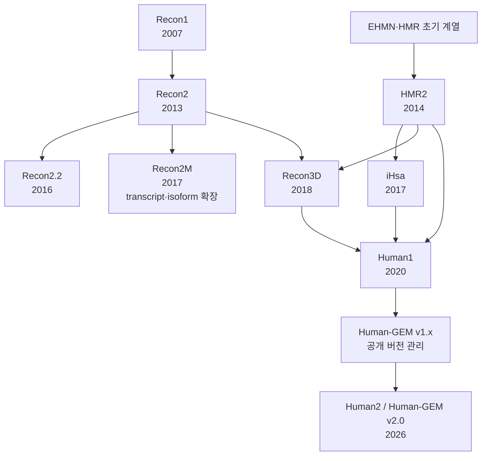

# 8. 인체 GEM의 계보와 버전 해석

인체 GEM은 하나의 직선 계보로 발전하지 않았다. Recon 계열과 HMR 계열이 나란히 갱신되면서 서로의 반응과 근거를 흡수했다. 여기에 transcript·protein isoform이나 단백질 구조를 강조한 파생 자원도 더해졌다. Human1은 HMR2, iHsa 및 Recon3D를 reconciliation하여 두 주요 계열을 하나의 공개 개발 계보로 통합했다.



*그림 5.8. 주요 인체 대사 재구축의 계승·통합 관계. 모든 데이터 기여를 망라한 genealogy가 아니라 release 해석에 필요한 주요 관계를 나타낸 독립 도식이다. 저자 작성 모식도(모델 계산 결과 아님); 개념 근거: [Recon3D](https://doi.org/10.1038/nbt.4072), [Human1](https://doi.org/10.1126/scisignal.aaz1482), [Human2](https://doi.org/10.1073/pnas.2516511123)의 provenance.*

## 8.1 주요 release의 범위

| 재구축 | 논문이 보고한 대표 규모 | 구별해야 할 기여 |
|:---|:---|:---|
| Recon1 (2007) | 1,496 ORF, 3,311 metabolic·transport reactions | genome·bibliome을 통합한 초기 전역 인간 재구축과 288개 기능 시험 |
| Recon2 (2013) | 1,789 genes, 7,440 reactions, 5,063 compartmentalized metabolites | community reconstruction과 선천성 대사질환 biomarker 검증 |
| HMR2 (2014) | 3,765 genes, 8,181 reactions, 6,007 compartmentalized metabolites | HMR database와 조직 특이 모델링 기반 확대 |
| Recon2.2 (2016) | 1,675 genes, 7,785 reactions, 5,324 compartmentalized metabolites | metabolite identifier, GPR 및 반응식 정비 |
| Recon2M (2017) | 1,106 genes에 대한 11,415 [GeTPRA](../glossary.md) | gene–transcript–protein–reaction association 확장 |
| Recon3D (2018) | reconstruction: 3,288 ORF, 13,543 reactions, 4,140 unique metabolites | protein structure·variant 연결과 별도 flux-consistent model 배포 |

*표 5.7. 논문판의 대표 집계. 출처: [Recon1](https://doi.org/10.1073/pnas.0610772104), [Recon2](https://doi.org/10.1038/nbt.2488), [HMR2](https://doi.org/10.1038/ncomms4083), [Recon2.2](https://doi.org/10.1007/s11306-016-1051-4), [Recon2M](https://doi.org/10.1073/pnas.1713050114), [Recon3D](https://doi.org/10.1038/nbt.4072). 숫자는 release와 집계 정의가 다르므로 행 사이의 단순 증감률을 품질 지표로 사용하지 않는다.*

## 8.2 집계 기준

모델 규모를 인용할 때에는 다음을 명시한다.

- `reaction`에 exchange·sink·demand·biomass를 포함했는가?
- 대사물 수가 unique chemical entity인지 compartment-specific species인지?
- gene, ORF, transcript 및 protein isoform 가운데 무엇을 셌는가?
- 전체 **[reconstruction](../glossary.md)**인지 계산에 사용한 flux-consistent **model**인지?
- 논문 최초 release인지 이후 repository tag인지?

Recon2의 5,063 compartment-specific metabolites와 2,626 unique metabolites는 서로 모순되는 수가 아니다. 같은 화합물이 여러 구획에 존재하면 각 구획의 species를 별도로 세기 때문이다. 두 수의 비 $$5{,}063/2{,}626\approx1.93$$은 모델 전체의 평균 multiplicity를 요약하지만, 실제 화합물별 구획 수 분포를 대체하지 않는다.

Recon3D도 전체 지식 재구축과 파생 model을 구분한다. 논문은 reconstruction에 13,543 reactions를, flux 및 stoichiometric consistency 조건을 만족하는 model판에 10,600 reactions를 보고했다. 단순 차이인 약 21.7%를 모두 ‘잘못된 반응이 제거된 비율’로 해석할 수는 없다. 계산 model은 지식베이스의 목적과 다른 selection criterion을 적용한 부분집합이며, 배포 파일 ID를 명시해야 한다.

## 8.3 검증 수치의 범위

Recon2가 보고한 선천성 대사질환 biomarker 성능은 특정 질환 집합과 평가 규칙에 대한 결과이다. 대사물의 정확한 농도 예측과 방향성 예측은 서로 다른 endpoint이며, accuracy를 인용할 때 분모와 판정 규칙을 함께 제시한다.

Recon2M의 GeTPRA는 transcript와 protein isoform 수준의 발현·변이를 반응에 연결한다. 이는 Human1의 다른 이름이나 Human2의 이전 release가 아니라 Recon2 계열의 응용 확장이다. HMR2와 Human2 역시 이름의 숫자만 같을 뿐 별개의 계보와 release를 가리킨다.

## 8.4 재현 가능한 모델 인용

논문에서 `Recon2`, `Recon3D` 또는 `Human-GEM`이라는 이름만 기록하면 같은 분석을 재현하기 어렵다. 다음 인용 단위를 사용한다.

```text
모델명 + 정확한 release/tag + 배포 URL/DOI + 파일명 + checksum
+ 사용한 objective·media·bounds + 변환 스크립트 commit
```

지속적으로 갱신되는 [Human-GEM](../glossary.md)은 release별 Zenodo archive를 제공한다. 분석 결과를 작성할 때 최신 main branch가 아니라 실제 사용한 immutable release를 인용한다.

## 8.5 해석상의 주의

- 반응 수 자체는 품질 순위가 아니다. Recon3D의 reconstruction(13,543 reactions)과 계산에 쓰는 flux-consistent model(10,600 reactions)의 차이 약 21.7%는 오류가 제거된 비율이 아니라 서로 다른 selection criterion을 적용한 결과이므로, 반응 수의 많고 적음으로 모델 우열을 판정하지 않는다.
- compartment-specific 대사물 수와 unique 대사물 수가 다른 것은 모순이 아니다. Recon2의 5,063과 2,626은 같은 화합물이 여러 구획에 존재하기 때문에 생기는 차이이며, 두 수 모두 정확할 수 있다.
- 이름이 비슷하다고 같은 계보인 것은 아니다. Recon2M은 Human1이나 Human2의 다른 이름이 아니라 Recon2 계열의 별도 확장이며, HMR2와 Human2도 이름의 숫자만 같을 뿐 별개의 계보와 release를 가리킨다. 모델을 인용할 때는 이름이 아니라 release/tag, 파일 checksum 및 사용 조건을 명시한다.

---
