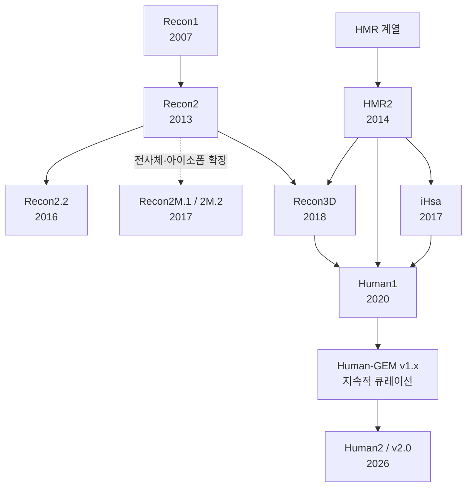

# 8. 인체 GEM의 계보: Recon·HMR의 분기와 병합

인체 GEM의 역사는 `Recon1 → Recon2 → Recon3D → Human1`이라는 단일 직선이 아닙니다. Recon 계열과 HMR 계열이 병렬로 발전하면서 서로의 자료를 흡수했고, 별도의 응용 가지도 생겼으며, Human1에서 HMR2·iHsa·Recon3D가 본격적으로 통합되었습니다. 반응·대사산물 수는 논문마다 exchange 포함 여부와 "고유 화합물" 대 "구획화된 species"가 달라질 수 있으므로, 숫자를 인용할 때는 세는 기준까지 함께 적어야 합니다.

*Figure 5.3: 주요 인체 GEM의 분기·병합 계보. 화살표는 모든 세부 기여를 망라한 족보가 아니라, 반드시 기억해야 할 주요 계승·통합 관계를 나타냅니다.*

| 모델 | 핵심 규모(논문 기준) | 이 모델이 남긴 핵심 결론 |
|:---|:---|:---|
| **Recon1 (2007)** | 1,496 ORF, 3,311 대사·수송 반응, 2,766 total metabolites(본문 요약); Table 1은 2,712 compartment-specific metabolites와 432 exchange를 별도 집계 | 문헌과 게놈을 결합한 전역 인체 재구축이 가능하며 288개 대사 기능으로 검증할 수 있음을 보임 |
| **Recon2 (2013)** | 1,789 유전자, 7,440 반응, 5,063 구획화 대사물질(2,626 unique), 8구획 | 49개 선천성 대사질환에 걸친 54개 보고 biomarker의 변화 방향을 77% 정확도로 예측 |
| **HMR2 (2014)** | 3,765 유전자, 8,181 반응, 6,007 구획화 대사물질 | 단백질 발현과 조직별 모델링을 강화한 HMR 가지의 핵심 기반 |
| **Recon2.2 (2016)** | 1,675 유전자, 7,785 반응, 5,324 구획화 대사물질(2,652 unique) | 식별자·GPR·질량/전하 균형을 재정비해 "큰 재구축"을 계산 모델로 다듬음 |
| **Recon2M (2017)** | 1,106 유전자에 대한 11,415 GeTPRA; 446개 RNA-seq와 1,784개 개인 GEM 분석 | 유전자만이 아니라 transcript/protein isoform을 반응과 연결해야 개인·암 대사를 더 정확히 다룰 수 있음을 보임 |
| **Recon3D (2018)** | 재구축: 3,288 ORF, 13,543 반응, 4,140 unique 대사물질, 12,890 단백질 구조; 파생 모델: 10,600 반응 | 단백질 3D 구조·유전 변이·반응을 연결했고, 전체 지식베이스와 flux/stoichiometrically consistent 모델판을 구분해 배포 |

*Table 5.21: 주요 인체 GEM의 규모와 반드시 기억할 학술적 기여. Recon1 DOI [10.1073/pnas.0610772104](https://doi.org/10.1073/pnas.0610772104), Recon2 DOI [10.1038/nbt.2488](https://doi.org/10.1038/nbt.2488), HMR2 DOI [10.1038/ncomms4083](https://doi.org/10.1038/ncomms4083), Recon2.2 DOI [10.1007/s11306-016-1051-4](https://doi.org/10.1007/s11306-016-1051-4), Recon3D DOI [10.1038/nbt.4072](https://doi.org/10.1038/nbt.4072).*

**Recon2M은 왜 별도로 기억해야 하는가?** Ryu, Kim & Lee(2017)는 Recon2M.1을 전사체 자료와 호환되도록 정비하고, 주 전사체와 비주 전사체가 만드는 단백질 아이소폼까지 반응에 연결하는 **GeTPRA(gene-transcript-protein-reaction association)** 11,415개를 구축했습니다. 이 정보로 Recon2M.2를 갱신했고, 개인별 GEM이 암 대사와 표적 예측을 더 정밀하게 다룰 수 있음을 보였습니다(DOI: [10.1073/pnas.1713050114](https://doi.org/10.1073/pnas.1713050114)). Recon2M은 Human1의 다른 이름도, Human2의 전신도 아니라 **Recon2 계열의 전사체 수준 확장 가지**입니다.

❗ **이름 주의:** **HMR2**는 2014년 Human Metabolic Reaction 계열 모델이고, **Human2**는 2026년 Human-GEM v2 계열입니다. 숫자 2가 같을 뿐 서로 다른 모델입니다.

💡 **Recon3D 버전 주의:** 논문이 제시한 전체 재구축은 13,543 반응이지만, 함께 배포된 flux/stoichiometrically consistent 모델판은 10,600 반응과 5,835 구획화 대사물질을 가집니다. 어느 수치를 쓰든 "reconstruction"인지 "model"인지 명시해야 합니다.

---
