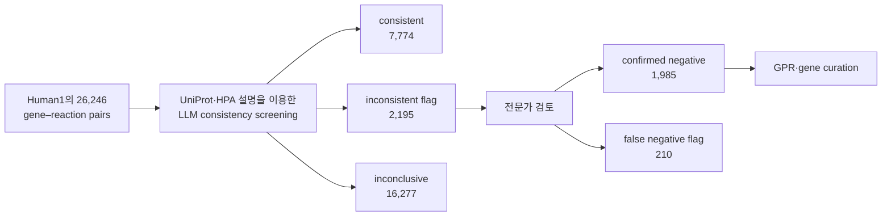

# 9. Human1과 Human2: 통합 및 LLM 보조 큐레이션

Human1과 Human2는 고정된 완성품이라기보다 공개 repository에서 근거와 자동 시험을 함께 관리하는 Human-GEM의 주요 release이다. 두 모델의 규모와 성능을 비교할 때에는 논문판, repository tag 및 파생 [context-specific model](../glossary.md)을 구분해야 한다.

## 9.1 Human1: 두 계열의 통합

Human1은 HMR2, iHsa 및 Recon3D의 구성요소와 [GPR](../chapter-3/README.md)을 통합하고 중복·충돌을 수동 및 반자동으로 reconciliation한 범용 인체 재구축이다. 통합에는 metabolite identifier mapping, 화학식 수정, 반응 재균형, 가역성 검토, enzyme-complex 정보 및 새로운 generic biomass 반응이 포함되었다.

| 항목 | Human1 논문판(2020) |
|:---|---:|
| Reactions | 13,417 |
| Compartment-specific metabolites | 10,138 |
| Unique metabolites | 4,164 |
| Genes | 3,625 |
| Stoichiometrically consistent metabolites | 100% |
| Mass-balanced reactions | 99.4% |
| Charge-balanced reactions | 98.2% |

*Table 5.18: Human1 논문판의 대표 통계. 출처: [Robinson et al. (2020)](https://doi.org/10.1126/scisignal.aaz1482), CC BY 4.0.*

논문은 통합 과정에서 8,185 duplicated reactions와 3,215 duplicated metabolites를 제거하고, 2,016 metabolite formulas를 수정했으며, 3,226 reaction equations와 83 reaction reversibilities를 교정했다고 보고했다. 576 reactions는 보존 법칙과 양립하지 않거나 통합 모델에 불필요하다고 판단되어 비활성화 또는 제거되었다. 이 수치는 단순한 파일 합집합보다 identifier와 chemistry reconciliation이 큰 작업임을 보여준다.

Human1의 `100% stoichiometric consistency`는 내부 네트워크가 양의 질량 벡터와 양립한다는 뜻이다. 모든 반응이 주어진 bounds에서 flux를 갖거나 모든 metabolite가 생산·소비 가능하다는 뜻은 아니다. Human1 논문의 Recon3D 비교도 전체 **[reconstruction](../glossary.md)**과 flux-consistent **model**을 구분한다.

| 지표 | Recon3D reconstruction | Human1 |
|:---|---:|---:|
| Stoichiometrically consistent metabolites | 19.8% | 100% |
| Mass-balanced reactions | 94.2% | 99.4% |
| Charge-balanced reactions | 95.8% | 98.2% |
| 평균 annotation score | 25% | 66% |

*Table 5.19: Human1 논문이 동일 분석에서 보고한 비교. Recon3D의 별도 model판은 이미 stoichiometrically consistent하므로 이 행렬의 Recon3D reconstruction과 혼동하지 않는다. 출처: [Robinson et al. (2020)](https://doi.org/10.1126/scisignal.aaz1482).*

Human1 이후 v1.x release는 [Human-GEM repository](https://github.com/SysBioChalmers/Human-GEM)에서 계속 갱신되었다. 따라서 `Human1`이라는 명칭만으로 논문판과 후속 release를 식별할 수 없으며 tag 또는 Zenodo DOI를 함께 기록한다.

## 9.2 Human2: LLM을 이용한 후보 선별

Human2는 2026년 발표된 Human-GEM v2 계열이다. 2026년 3월 30일의 `v2.0.0` release는 12,931 reactions, 8,461 metabolites 및 2,848 genes를 포함한다. 이 수는 2020년 Human1 논문판과 직접적인 일대일 삭제 목록이 아니며, 그 사이의 공개 v1.x curation 전체가 누적된 결과이다.

| 항목 | Human1 논문판 | Human2 v2.0.0 |
|:---|---:|---:|
| Reactions | 13,417 | 12,931 |
| Metabolites | 10,138 | 8,461 |
| Genes | 3,625 | 2,848 |
| 비교 단위 | 2020 publication model | 2026 repository release |

*Table 5.20: 서로 다른 시점의 대표 규모. 출처: [Human1](https://doi.org/10.1126/scisignal.aaz1482), [Human2 논문](https://doi.org/10.1073/pnas.2516511123), [Human-GEM v2.0.0 release](https://github.com/SysBioChalmers/Human-GEM/releases/tag/v2.0.0). 모델 규모의 감소 자체는 품질 개선 또는 저하를 증명하지 않는다.*

Human2 curation에서 LLM은 전문가를 대체하는 자동 판정기가 아니라 대규모 gene–reaction pair의 **screening 도구**로 사용되었다.



*Figure 5.9: Human2의 LLM 보조 GPR 검토 흐름. 저자 작성; 수치와 범주 정의의 출처는 [Luo et al. (2026)](https://doi.org/10.1073/pnas.2516511123), CC BY-NC-ND 4.0이다. 원 논문의 패널·레이아웃·그림을 복제하거나 변형하지 않고 본문의 사실 관계만으로 독립 제작했다.*

전체 26,246 pairs 가운데 16,277(62.0%)는 source annotation이 불완전하거나 모호해 inconclusive로 남았다. 전문가가 `inconsistent`로 flag된 2,195 pairs를 검토한 결과 1,985는 true negative로 확인되었고 210은 false-negative flag로 판정되었다. 따라서 $$1{,}985/2{,}195\approx90.4\%$$는 **flag된 부분집합에서 negative screen의 확인 비율**이지, 전체 GPR 정확도나 Human2의 표현형 정확도가 아니다. 이 검토를 바탕으로 1,135 GPRs가 갱신되고 대사와 무관한 203 genes가 제거되었다.

논문은 Human1에서 Human2까지 총 1,864 GPRs와 775 reactions가 변경되었다고 보고한다. 이 전체 변경에는 LLM screen 외의 community issue, 전문가 반응식·방향성·GPR curation 및 repository 개발도 포함된다.

## 9.3 자동 시험과 외부 검증

Human-GEM repository는 YAML round-trip, metabolic tasks, unused/dead-end metabolites, duplicate reactions, MEMOTE/MACAW 및 release-level gene-essentiality checks를 사용한다. 자동 시험은 변경이 기존 기능을 훼손하는지 탐지하지만 모든 GPR의 생물학적 정확성을 인증하지 않는다.

Human2 논문은 다음과 같은 별도 benchmark를 보고했다.

- [ftINIT](../glossary.md)으로 만든 cell-line-specific models의 gene essentiality MCC가 Human1 기반 모델보다 개선됨
- 112 inborn errors of metabolism simulation에서 **ec-Human2**가 65.4% accuracy를 달성
- NCI-60 cell-line의 [enzyme-constrained](../glossary.md) model에서 약 81% flux consistency
- Human2 release의 MEMOTE total score 81%

각 수치는 generic Human2, context-specific model 또는 enzyme-constrained derivative 가운데 서로 다른 객체와 endpoint를 평가한다. 이를 합쳐 ‘Human2의 전체 정확도 81%’라고 표현할 수 없다. 또한 Human1 표의 66%는 평균 **annotation score**이고 Human2의 81%는 **MEMOTE total score**이므로 두 값을 직접적인 15 percentage-point 개선으로 비교하지 않는다.

## 9.4 범용 모델과 파생 whole-body model

Human2 자체는 여러 인간 세포 유형의 대사 지식을 통합한 generic reconstruction이다. 논문이 제시한 성·연령별 organ-specific models, whole-body models, enzyme-constrained whole-body model 및 fasting dynamic simulation은 Human2에 transcriptomics, physiological coupling, enzyme constraints와 동역학을 추가한 파생 모델이다.

```text
Human2 generic reconstruction
  → ftINIT 및 조직 자료
  → organ-specific GEMs
  → biofluid·기관 연결
  → whole-body model
  → enzyme·kinetic constraints
  → 조건별 dynamic simulation
```

파생 모델 결과를 재현하려면 Human2 tag뿐 아니라 조직 자료 release, ftINIT 설정, organ coupling, enzyme parameters, 식이 입력 및 integration scheme을 함께 인용해야 한다. Human2의 핵심 방법론적 기여는 LLM 단독 자동화가 아니라 **LLM 후보 선별, 전문가 판정, 공개 provenance 및 자동 회귀 시험의 결합**이다.

---
