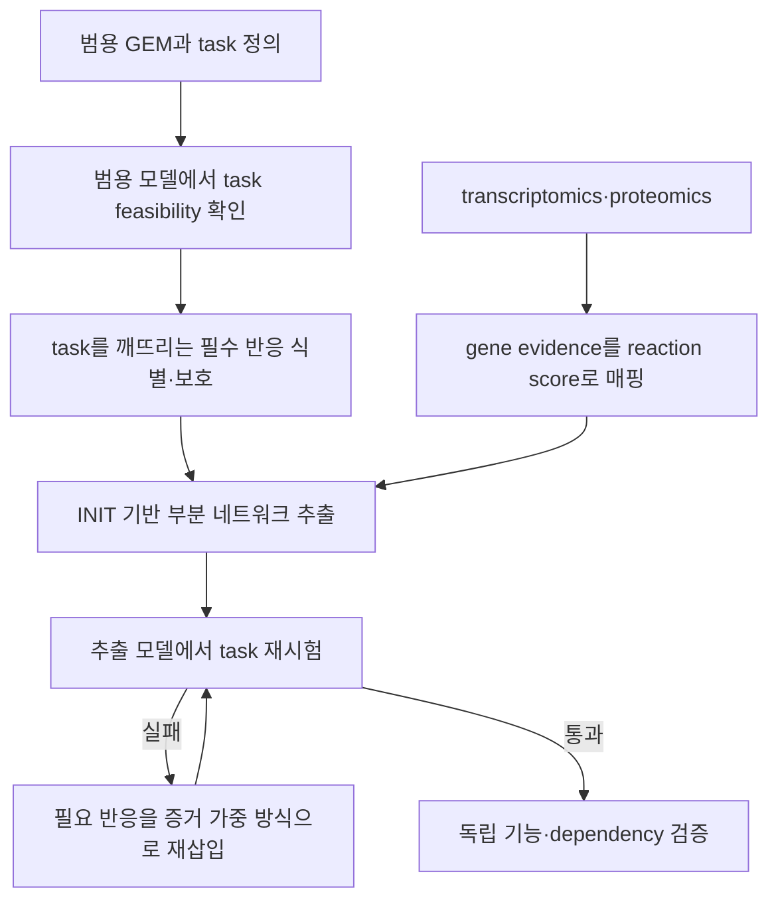

# 10. INIT 계열의 맥락 특이 모델 추출

범용 인체 재구축은 인간의 여러 세포 유형에서 지지되는 반응의 통합 집합이다. 특정 조직 또는 세포주의 계산 모델을 만들려면 omics evidence와 필수 기능을 이용해 반응 부분집합을 선택하고, 해당 환경의 교환 조건을 지정해야 한다. 이 절은 [INIT, tINIT 및 ftINIT](../glossary.md)의 네트워크 추출 논리를 다룬다. 발현값 전처리와 다른 context-specific 방법의 비교는 [Chapter 6](../chapter-6/README.md)에서 이어진다.

## 10.1 INIT의 증거 기반 선택

INIT은 transcriptomics·proteomics 증거를 reaction score로 변환하고, 높은 점수 반응을 선호하면서 정상상태에서 기능하는 부분 네트워크를 선택한다. 원 방법은 검출된 대사산물의 순생성을 허용하는 정보도 사용할 수 있다. 반응 score는 [GPR](../chapter-3/README.md)의 AND/OR 구조와 데이터 유형에 따라 계산되며, 보편적인 `min/max` 규칙 하나로 고정되지 않는다.

개념적으로 reaction inclusion variable $$y_j$$와 flux $$v_j$$를 사용하여 다음 문제를 생각할 수 있다.

$$
\max_{\mathbf v,\mathbf y}\sum_j w_jy_j
$$

$$
\mathbf S\mathbf v=\mathbf 0,\qquad
\ell_jy_j\le v_j\le u_jy_j,\qquad
y_j\in\{0,1\}
$$

이 식은 목적을 설명하는 축약형이다. 실제 INIT 구현은 reversible direction, 양·음 score, non-GPR reactions, 허용 metabolite accumulation 및 최소 flux를 별도로 다룬다. 따라서 이 식만으로 소프트웨어 결과를 재현할 수 없으며 toolbox version과 모든 옵션을 기록해야 한다. 원 방법: [Agren et al. (2012)](https://doi.org/10.1371/journal.pcbi.1002518), CC BY 4.0.

## 10.2 Metabolic task의 정의

**[Metabolic task](../glossary.md)**는 특정 생리 기능을 수행하는 feasible flux state의 존재로 정의한다. 예를 들어 ‘기질 $$P$$로부터 산물 $$R$$을 생성한다’는 task는 입력 허용, 출력 또는 demand의 최소 flux, 반응 방향 및 보조인자 재생을 함께 지정한다.

$$
\mathcal F_t=\left\{\mathbf v:\mathbf S\mathbf v=0,
\ \boldsymbol\ell^{(t)}\le\mathbf v\le\mathbf u^{(t)},
\ v_{out}^{(t)}\ge\varepsilon_t\right\}
$$

Task가 실행 가능하다는 것은 $$\mathcal F_t\ne\varnothing$$임을 뜻한다. 관련 반응 집합 가운데 하나를 포함한다는 제약 $$\sum_{j\in R_t}y_j\ge1$$로는 전체 경로의 실행 가능성을 보장할 수 없다.

### 대사 과제와 목적함수는 다르다

대사 과제는 “이 기능을 수행할 수 있는 플럭스 상태가 **적어도 하나 존재하는가**”를 묻는 통과/실패 시험이다. 반면 목적함수는 실행 가능한 상태들 가운데 어느 해를 선호할지 정하는 최적화 기준이다. 따라서 다음 세 질문은 구분한다.

1. **과제 실행 가능성:** $$P$$를 공급했을 때 $$R$$을 최소 $$\varepsilon_t$$ 이상 만들 수 있는가?
2. **성장 최적화:** 같은 조건에서 바이오매스 플럭스를 얼마나 크게 만들 수 있는가?
3. **생산 최적화:** 성장 하한을 지키면서 $$R$$ 생산 플럭스를 얼마나 크게 만들 수 있는가?

예를 들어 $$v_{out}^{(t)}\ge1$$만 요구하면, 바이오매스 플럭스가 0이어도 과제는 통과할 수 있다. 반대로 성장 최대화 해에서 $$R$$ 생산 플럭스가 0이라고 해서 $$R$$ 생산 과제가 불가능한 것은 아니다. 과제별 입력·출력, 배지, 경계, 최소 플럭스와 허용되는 부산물을 별도 파일로 기록하고, 해당 과제만의 feasibility 문제를 풀어야 한다.


과제 실패는 곧바로 gap-filling이 필요하다는 뜻이 아니다. 먼저 대사물 ID·구획, 교환 반응 부호, 배지·산소 경계, demand/transport 반응, 방향성, biomass·maintenance 제약을 점검한다.


## 10.3 tINIT의 기능 보존 절차

tINIT은 INIT의 evidence-based selection에 metabolic-task preservation을 결합한다.

*Figure 5.10: tINIT의 task 보존 절차. 저자 작성; [Agren et al. (2014)](https://doi.org/10.1002/msb.145122)의 알고리즘 설명을 바탕으로 재구성. 원 논문 그림을 복제하지 않았다.*

절차는 다음 세 판단을 분리한다.

1. 참조 모델 자체가 task를 수행할 수 있는가?
2. Task 수행에 반드시 필요한 반응 중 omics score가 낮더라도 보호할 항목은 무엇인가?
3. 추출 후 task가 실패하면 어떤 저지지 반응 조합을 최소한으로 복원할 것인가?

### INIT/tINIT 구축의 실행 순서

실제 구축은 알고리즘 이름을 선택하는 일만으로 끝나지 않는다. 다음 산출물을 순서대로 고정해야 같은 조직·세포주의 모델을 다시 만들고 비교할 수 있다.

1. **기저 재구축 고정:** Human-GEM/Recon 등 reference GEM의 release, SBML checksum, 구획·교환 반응 규약을 기록한다.
2. **분석 조건 정의:** 조직 또는 세포주의 배지, 산소, 교환 플럭스, biomass 또는 비증식 기능 조건을 정한다.
3. **오믹스 전처리:** 유전자 ID를 reference GEM의 GPR ID로 매핑하고, 정규화·결측 처리·발현 단위를 기록한다.
4. **반응 근거 점수화:** GPR의 AND/OR 논리와 단백질체·대사체 증거를 사용해 반응별 score를 만든다. 점수 함수와 threshold는 데이터셋마다 검증할 설정이다.
5. **대사 과제 파일 작성:** 과제별 입력·출력·교환 경계·최소 flux·허용 부산물을 명시하고, reference GEM에서 먼저 feasibility를 확인한다.
6. **INIT/tINIT 최적화:** evidence objective, reversible direction 처리, 최소 flux, task protection, solver·tolerance를 고정해 [MILP](../glossary.md)를 푼다.
7. **추출 모델 재검증:** 모든 보호 task, flux consistency, energy-generating cycle, mass/charge balance와 SBML/GPR 보존을 다시 검사한다.
8. **독립 평가와 배포:** 학습·큐레이션에 쓰지 않은 gene dependency, exchange flux, biomarker 또는 기능 자료로 평가하고, 모델·입력·task file·코드·결과를 함께 배포한다.


같은 RNA-seq 자료라도 reference GEM, ID 매핑, 배지, task, score 함수, MILP solver가 다르면 다른 맥락 특이적 모델이 나올 수 있다. “tINIT 모델”이라는 이름만으로 구축 조건이 충분히 정의되지는 않는다.


원 tINIT 연구는 56개 공통 metabolic tasks와 암 관련 biomass 기능을 사용했다. 이 목록이 모든 조직과 연구 질문에 보편적인 것은 아니다. 필수 task는 생리 범위와 입력·출력을 검토하여 사전에 정의하고, 통과 여부뿐 아니라 task file의 version을 함께 제공한다.

### 조합 선택의 예

Task가 $$P\rightarrow R$$ 생산이고 후보 경로가 직접 반응 $$R_3:P\rightarrow R$$ 또는 두 단계 $$R_1:P\rightarrow Q$$, $$R_2:Q\rightarrow R$$라고 하자. Evidence score가

$$
w_1=3,\qquad w_2=-2,\qquad w_3=-3
$$

이면 task를 무시한 단순 양수-score 선택은 $$R_1$$만 남겨 기능을 잃는다. Task를 만족하는 두 조합의 총점은

$$
w_3=-3,\qquad w_1+w_2=1
$$

이므로 evidence objective는 $$\{R_1,R_2\}$$를 선호한다. 개별 점수가 음수인 $$R_2$$도 기능을 완성하는 조합에서는 포함될 수 있다. 이 예는 원 구현의 완전한 MILP가 아니라 task-level 조합 선택의 원리를 보인다.

## 10.4 ftINIT의 계산 구조

Human1 규모에서 tINIT의 실행 시간은 입력과 solver에 따라 모델당 약 15분에서 3시간까지 보고되었다. ftINIT은 추출을 두 단계로 분리하고 사전 계산을 활용해 대규모 반복 분석의 계산량을 줄인다.

| Mode | 실행 단계 | 결과의 경향 |
|:---|:---|:---|
| `1+0` | 첫 번째 추출 단계만 실행 | GPR이 없는 반응을 비교적 많이 유지하는 큰 모델 |
| `1+1` | 두 번째 정제 단계까지 실행 | 더 작은 [context-specific model](../glossary.md) |

ftINIT 논문은 GTEx sample의 실행 시간과 DepMap 891 cell lines의 gene-essentiality prediction을 tINIT과 비교했다. 속도와 모델 크기는 hardware, solver, reference model, mode 및 evidence threshold에 의존하므로 단일 배수만 인용하지 않는다. 해당 연구에서는 ftINIT이 tINIT보다 훨씬 짧은 실행 시간을 보였고, 두 ftINIT mode의 essentiality 성능을 별도로 평가했다. 출처: [Gustafsson et al. (2023)](https://doi.org/10.1073/pnas.2217868120), CC BY-NC-ND 4.0.

## 10.5 검증과 보고

Context-specific model에는 다음을 기록한다.

- reference GEM의 release와 checksum
- expression/proteomics 자료의 accession, normalization 및 threshold
- gene-to-reaction score 집계 규칙
- INIT/tINIT/ftINIT implementation, mode, solver 및 tolerance
- task file, task-specific bounds와 최소 flux
- 보호·복원된 저지지 반응과 그 근거
- 독립 gene dependency, exchange flux 또는 조직 기능 검증

필수로 지정한 task는 원칙적으로 모두 통과해야 한다. 일부 task 실패를 허용했다면 임의의 보편 합격률을 적용하지 않고, 실패한 task와 원인을 그대로 보고한다. Task 통과는 입력한 기능 요구사항과의 일치이며, 사용하지 않은 외부 자료에 대한 생물학적 검증을 대체하지 않는다.

---
