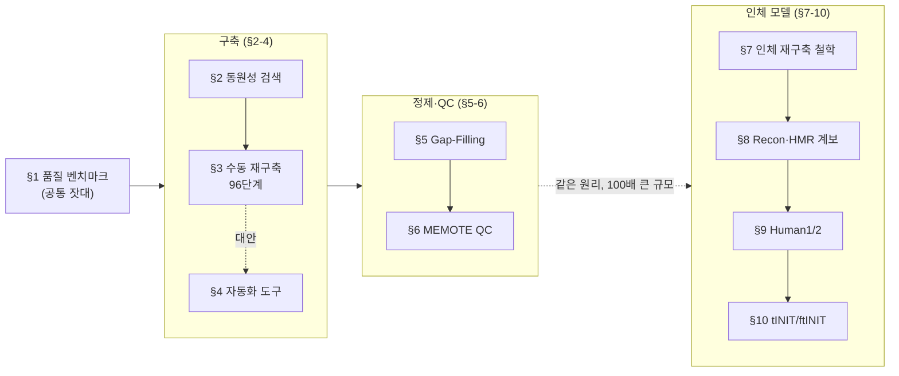

# Chapter 5. 모델 구축과 품질 관리

> [Chapter 4](../chapter-4/README.md)까지 우리는 이미 완성된 모델 — `e_coli_core`와 iML1515 — 을 불러와 FBA로 성장률을 계산했습니다. 그런데 그 모델은 애초에 누가, 어떤 근거로, 얼마나 오랜 시간을 들여 만들었을까요? 이 장은 게놈 서열에서 출발해 시뮬레이션이 가능한 고품질 genome-scale metabolic model(GEM, 게놈 규모 대사 모델)에 도달하기까지의 **재구축(reconstruction) 파이프라인**을 다룹니다. 유전자 주석과 동원성 검색을 통한 반응 할당, 수동 재구축의 96단계 프로토콜, CarveMe·ModelSEED·gapseq 등 자동화 도구, gap-filling 알고리즘, MEMOTE 기반 품질 관리(QC)를 순서대로 살펴본 뒤, 미생물 모델과는 근본적으로 다른 규모를 갖는 **인체 대사 모델**의 구축 방법론 — top-down/bottom-up/hybrid 접근법, Recon 시리즈의 진화, Human1/Human2, 그리고 조직 특이적 모델 추출의 핵심 알고리즘 tINIT/ftINIT — 을 다룹니다.

## 이 장을 시작하며

**잠깐, 생각해보기.** 여러분이 iML1515(유전자 1,516개·반응 2,712개·대사물 1,877개)를 실행할 때, 이 숫자들이 어디서 왔다고 생각하나요? 누군가 대장균의 게놈을 열어 반응을 하나씩 손으로 세었을까요, 아니면 컴퓨터가 자동으로 만들어냈을까요? 정답은 "**둘 다, 그리고 여러 번 반복해서**"입니다 — 바로 이것이 이 장의 핵심 질문입니다.

재구축이 왜 어렵고 왜 한 번에 끝나지 않는지 이해하려면 두 가지 익숙한 비유가 도움이 됩니다.

**비유 ① 레시피 짜깁기.** 처음 보는 요리를 만든다고 상상해봅시다. 유명 셰프의 검증된 레시피(수동 큐레이션 모델, 예: iML1515)를 그대로 따라가면 실패 확률은 낮지만, 재료 하나하나의 정확한 양과 순서를 검증하는 데 몇 달이 걸립니다. 반대로 "비슷한 요리 레시피 여러 개를 짜깁기"해서 빠르게 초안을 만들면(CarveMe 같은 자동 재구축) 10분 만에 끝나지만, 간이 맞는지 실제로 맛을 보고 소금을 더 넣거나 빼야 합니다 — 이 "맛보고 고치기"가 바로 **gap-filling과 반복적 품질 관리**입니다. 레시피는 한 번에 완성되지 않습니다. 맛을 보고, 부족한 재료를 채우고, 다시 맛을 보는 순환이 필요합니다.

**비유 ② 미지의 대륙 지도 제작.** 탐험가가 위성사진(게놈 서열)만으로 지도를 그린다면, 큰 강과 산맥의 위치는 빠르게 표시할 수 있습니다. 그러나 위성사진만으로는 어떤 다리가 실제로 존재하는지, 어떤 길이 끊겨 있는지(반응 갭, gap) 알 수 없습니다. 이는 현장을 직접 걸어보는 답사(문헌 검토·실험 데이터·FBA 시뮬레이션 검증)를 통해서만 확인됩니다. 초안 지도는 빠르게 그릴 수 있지만, 끊어진 다리를 표시하고 잇는 작업(gap-filling)과 실제로 그 길로 걸어가 봤을 때 지도와 다르면 다시 고치는 작업(검증·디버깅)이 필요합니다.

두 비유 모두 같은 교훈을 전합니다 — **재구축은 "만든다"보다 "고쳐 나간다"에 가까운 반복적(iterative) 과정**이라는 것입니다. 이 장에서 다루는 96단계 프로토콜의 Stage 2~4, gap-filling, MEMOTE 기반 회귀 검사가 모두 이 "고쳐 나가기"의 구체적인 실천 방법입니다.

이 장에서 GPR 문자열의 Boolean 구조나 세포 구획의 생물학적 정의 자체는 다루지 않습니다 — 이는 이미 [GEM 구조](../chapter-3/README.md)에서 확립된 내용입니다. 대신 여기서는 "그 GPR과 구획 정보를 어떤 근거로, 어떤 절차를 통해 채워 넣는가"에 집중합니다. 또한 발현 데이터를 이용해 범용 모델을 특정 조직·세포에 맞추는 GIMME/iMAT/tINIT의 **철학적 비교**는 [Omics 통합](../chapter-6/README.md)의 몫이며, 이 장에서는 tINIT의 **재구축 알고리즘 자체**(§10)까지만 다룹니다.

**선수 지식 점검.** 이 장은 다음 내용을 이미 알고 있다고 가정합니다 — 낯설게 느껴진다면 해당 장을 먼저 훑어보길 권합니다.

- 화학량론 행렬 $$\mathbf{S}$$와 정상상태 방정식 $$\mathbf{S}\mathbf{v}=\mathbf{0}$$ ([Chapter 2](../chapter-2/README.md))
- GPR(유전자-단백질-반응) 규칙의 Boolean 구조, 세포 구획, 바이오매스 목적함수의 정의 ([Chapter 3](../chapter-3/README.md))
- 선형계획법(LP)으로 FBA를 푸는 방법과 flux bounds의 의미 ([Chapter 4](../chapter-4/README.md))

이 세 가지가 "결과물이 무엇인가"를 알려준다면, 이 장은 "그 결과물이 어디서, 어떤 근거로 왔는가"를 알려줍니다.

**이 장의 로드맵.** 10개 절은 크게 세 덩어리로 묶입니다 — (1) 미생물 GEM을 "어떻게 만드는가"(§2-4), (2) 만든 모델의 갭을 "어떻게 메우고 품질을 관리하는가"(§5-6), (3) 미생물보다 훨씬 큰 인체 GEM은 "무엇이 다른가"(§7-10). §1은 이 세 덩어리 전체가 공유하는 "품질을 어떻게 잴 것인가"라는 잣대를 먼저 제시합니다.

*Figure 5.0: 이 장의 로드맵. §1의 세 가지 벤치마크(분비 생성물·유전자 필수성·탄소원 이용)는 §3의 Stage 4, §6의 MEMOTE 이후 검증에서 반복해서 등장하는 공통 잣대이며, §5-6의 "고쳐 나가기" 원리는 §10의 tINIT 추출-검증 루프에서도 그대로 반복됩니다.*

💡 **팁:** 이 장을 읽는 동안 두 개의 "동반 모델"을 계속 떠올리세요 — 1장에서 불러온 미생물 스레드(`e_coli_core` → 이 장에서는 완전한 게놈 규모로 큐레이션된 iML1515로 확장)와, 5~7장에서 반복 사용할 인체 스레드(Human1/Recon3D)입니다. 같은 재구축 원리가 반응 95개짜리 축소 모델에도, 반응 13,000개가 넘는 인체 모델에도 똑같이 적용됩니다 — 다만 규모가 100배 이상 커질 뿐입니다.

---
## 학습 목표

이 장을 마치면 다음을 할 수 있어야 합니다.

- BLASTP 기반 동원성 검색의 원리(seed-and-extend, E-value, BLOSUM)를 이해하고, EC 번호·반응 할당 파이프라인을 설명할 수 있다.
- Thiele & Palsson 96단계 프로토콜의 4단계 구조와 confidence scoring 체계를 설명하고, 수동 재구축의 핵심 단계를 재현할 수 있다.
- CarveMe, ModelSEED/KBase, gapseq, AuReMe, RAVEN, Merlin 등 자동화 재구축 도구의 작동 원리·장단점·적합한 사용 사례를 비교할 수 있다.
- Gap-filling 문제를 MILP로 정식화하고, 손으로 작은 예제를 풀어보며 전통적 방법(GapFind/GapFill, growMatch, FastGapFill)과 딥러닝 기반 방법(CHESHIRE, CLOSEgaps, DNNGIOR)의 차이를 설명할 수 있다.
- MEMOTE 리포트에서 질량/전하 균형, 화학량론적 일관성, 주석 완전성을 구분하고, 같은 버전·설정에서 모델 변화를 비교할 수 있다.
- Recon·HMR 계열의 **분기와 병합**, Recon2M의 전사체 수준 확장, Human1→Human2로 이어지는 Human-GEM 계보를 설명할 수 있다.
- INIT의 증거 기반 네트워크 추출과 tINIT의 metabolic task enforcement를 구분하고, ftINIT이 어떻게 이를 고속화했는지 설명할 수 있다.

---
