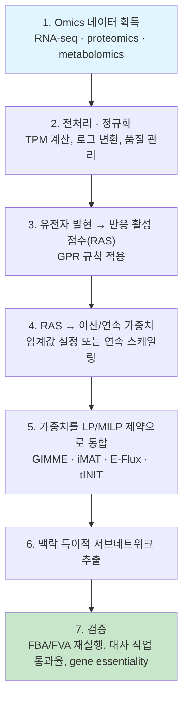
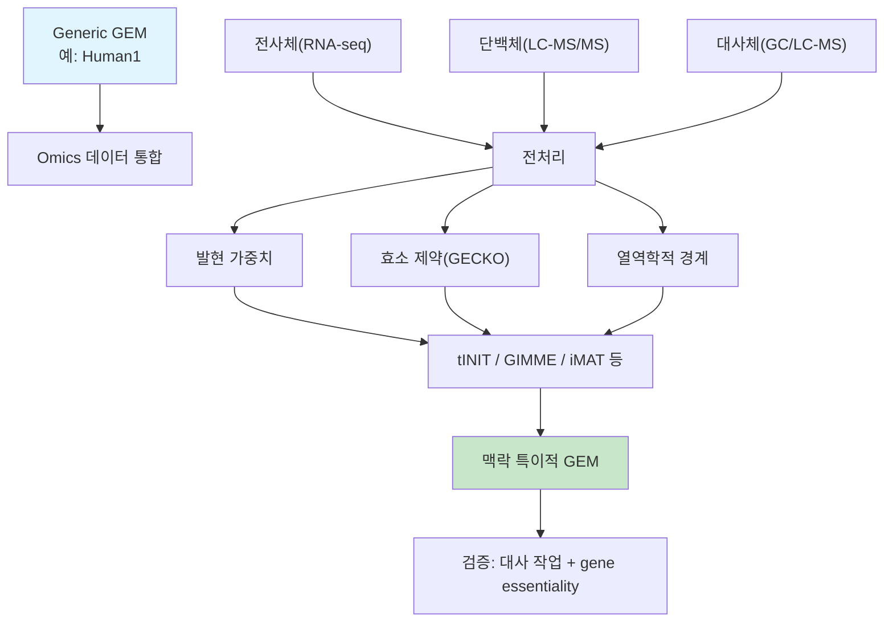

# Chapter 6. Omics 데이터 통합

> [Chapter 5](chapter-5..md)에서는 게놈 서열로부터 시작해 tINIT과 같은 알고리즘으로 조직 특이적 모델을 **추출하는 재구축 파이프라인 자체**를 다뤘습니다. 이 장은 그 파이프라인의 심장부 — "**발현 데이터가 어떻게 반응 하나하나의 증거로 바뀌고, 그 증거가 어떻게 최적화 문제의 제약으로 번역되는가**" — 를 훨씬 더 자세히 파헤칩니다. 게놈 규모 대사 모델(Genome-Scale Metabolic Model, GEM)은 한 생물체가 이론적으로 가질 수 있는 모든 대사 반응을 담은 백과사전과 같지만, 실제 세포 하나하나는 이 백과사전 중 극히 일부만 사용합니다. 이 장에서는 전사체(transcriptomics)·단백질체(proteomics)·대사체(metabolomics) 데이터를 이용해 "지금 이 세포가 실제로 쓰고 있는" 네트워크 — **맥락 특이적 모델(context-specific model)** — 을 추출하는 대표 알고리즘(GIMME, iMAT, E-Flux, tINIT, FASTCORE 계열)의 철학·수학·코드를 다루고, RNA-seq 데이터(counts/TPM/FPKM)의 전처리를 실습합니다. 차등발현 검정·다중검정·RNA-seq 분포의 기초는 먼저 [오믹스 데이터 분석을 위한 기초 통계](supplements/omics-statistics.md)를 참고하십시오. 맥락 특이적 모델에 FBA를 실행하는 방법은 [Chapter 4](chapter-4.-flux-balance-analysis-fba.md)를, 재구축 절차는 [Chapter 5](chapter-5..md)를, 이렇게 얻은 암 세포주 모델로 약물 표적을 찾는 응용은 [Chapter 7](chapter-7..md)을 참고하십시오.


count 분포, 정규화, t-test, 다중검정과 FDR이 낯설다면 [오믹스 데이터 분석과 기초 통계](supplements/omics-statistics.md)를 먼저 읽으십시오. 통계적 유의성과 생물학적 효과 크기를 구분한 뒤 모델 통합으로 넘어갑니다.


## 이 장을 시작하며

모든 사람은 똑같은 유전체(genome)를 물려받습니다. 그런데 간세포는 해독·요소 생성 반응을 쉴 새 없이 돌리고, 근육세포는 수축 단백질과 젖산 발효에 몰두하며, 뉴런은 신경전달물질 합성에 특화되어 있습니다. **같은 설계도에서 어떻게 이렇게 다른 세포가 나올까요?** 그리고 대사 모델링의 관점에서 더 중요한 질문 — 세 세포가 같은 유전체를 공유한다면, 우리는 이들을 **하나의 똑같은 대사 모델**로 시뮬레이션해도 될까요?

> **비유:** 유전체는 한 가정에 있는 **요리책 전체**와 같습니다 — 수천 가지 요리법이 실려 있지만, 오늘 저녁 식탁에 실제로 오르는 요리는 그중 극히 일부입니다. 간세포라는 요리사는 매일 해독·대사 요리만 만들고, 근육세포라는 요리사는 수축·발효 요리만 만듭니다. **Generic GEM(범용 대사 모델)**은 이 요리책 전체 — 이론적으로 가능한 모든 반응 — 이고, **맥락 특이적 모델(context-specific model)**은 "오늘, 이 세포가 실제로 차린 식탁"입니다.

[Chapter 5](chapter-5..md)에서 우리는 게놈 서열에서 출발해 범용 GEM을 구축하고, tINIT 같은 알고리즘으로 조직 특이적 모델을 추출하는 **재구축 파이프라인**을 배웠습니다. 하지만 범용 GEM은 본질적으로 "평균적 세포"의 청사진입니다 — 간세포도 근육세포도 뉴런도 아닌, 인체가 가질 수 있는 모든 대사 능력의 합집합이죠. 특정 조직·환자·조건의 세포를 실제로 모델링하려면, 그 세포가 지금 어떤 유전자를 켜고 있는지를 알려주는 **발현 데이터(오믹스 데이터)를 모델에 제약으로 통합**해야 합니다. 이 장은 바로 그 통합의 심장부 — "발현 데이터가 어떻게 반응 하나하나의 증거로 바뀌고, 그 증거가 어떻게 최적화 문제의 제약으로 번역되는가" — 를 파고듭니다.

---

## 학습 목표

이 장을 마치면 다음을 할 수 있습니다.

1. "왜 하나의 범용 GEM을 조직마다 잘라내야 하는가"를 비유를 들어 설명하고, 맥락 특이적 모델이 필요한 이유 세 가지를 논증할 수 있다.
2. **GPR(Gene-Protein-Reaction)** 규칙(AND=최솟값, OR=최댓값)을 이용해 작은 유전자 발현 벡터를 손으로 직접 **반응 활성 점수(Reaction Activity Score, RAS)**와 on/off 상태로 변환할 수 있다.
3. 발현 **임계값(threshold)** 설정의 다섯 가지 전략을 비교하고, 임계값 선택이 모델의 크기·정확도·재현성에 미치는 영향을 평가할 수 있다.
4. **GIMME, iMAT, E-Flux, tINIT**의 수학적 정형화(목적함수·제약·최적화 유형)를 비교하고, 상황에 맞는 방법을 선택할 수 있다.
5. Raw counts로부터 **TPM**을 계산하고, `e_coli_core` 모델에 GIMME 스타일 통합·E-Flux 스타일 경계 스케일링을 코드로 직접 실행할 수 있다.
6. 단백질체 통합(**GECKO 효소 제약**)과 대사체 통합(열역학적 제약, 정성적 순생산 제약)의 원리를 설명할 수 있다.
7. 다중 오믹스 통합의 시너지 효과와 근본적 한계(전사체-단백체 불일치, 시간 규모 차이, 정량성 비대칭 등)를 논의할 수 있다.

---

## 1. 범용 모델에서 맥락 특이적 모델로

### 1.1 왜 하나의 모델을 조직마다 잘라내야 하나

"이 장을 시작하며"에서 본 요리책 비유 — 범용 GEM은 요리책 전체, 맥락 특이적 모델은 오늘의 식탁 — 를 이제 구체적인 숫자로 확인해 봅시다. [GEM 구조](chapter-3.-genome-scale-metabolic-model-gem.md)에서 다룬 Human1 같은 인체 GEM은 인체 게놈 전체에 암호화된 대사 능력을 총망라합니다 — 2020년 Human1 원 발표판은 13,417개 반응과 3,625개 유전자를 포함합니다(버전별 수치와 Human2 계보는 [Chapter 5](chapter-5..md) 참고). 특정 조직 모델의 크기는 추출법·임계값·보호 작업에 따라 크게 달라지므로, 반응 수 자체를 품질 점수처럼 해석해서는 안 됩니다.

Generic 모델을 그대로 [FBA](chapter-4.-flux-balance-analysis-fba.md)나 유전자 필수성 예측에 사용하면 다음 세 가지 문제가 생깁니다.

1. **생물학적으로 무관한 예측**: 이 조직에서 전혀 발현되지 않는 유전자의 반응까지 네트워크에 포함되어, flux 분포나 유전자 넉아웃 결과가 비현실적으로 나옵니다. 뉴런에서 있을 리 없는 요소 회로(urea cycle) 반응이 뉴런 모델에 그대로 남아있다면, 그 반응을 없애는 유전자 결손을 "치명적"이라고 잘못 예측할 수 있습니다.
2. **과도한 유연성(flexibility)**: 실제로는 쓰지 않는 경로까지 열려 있으니 "이 반응이 필수인지 대체 가능한지"를 계산하는 [FVA](chapter-4.-flux-balance-analysis-fba.md)의 범위가 불필요하게 넓어지고, 예측의 특이성이 떨어집니다.
3. **표현형 예측 정확도 저하**: 조직·세포주별 유전자 필수성(gene essentiality)을 예측할 때, 맥락 특이적 모델이 generic 모델보다 유의미하게 높은 정확도를 보인다는 것이 여러 벤치마크 연구에서 반복적으로 확인되었습니다.

이 문제를 푸는 것이 바로 Omics 데이터 통합입니다. Omics 통합은 "이 반응이 이론적으로 가능한가"라는 질문을 "이 반응이 **지금, 이 세포에서** 실제로 일어나고 있다는 증거가 있는가"라는 질문으로 바꿔놓습니다.

> **핵심 개념 · 용어(English):** **맥락 특이적 모델(Context-Specific Model)** — Generic GEM으로부터 특정 조직·세포 유형·세포주·질병 상태의 오믹스 데이터(주로 발현 데이터)를 이용해 추출한 서브네트워크(submodel). 발현 증거가 뒷받침하는 반응은 남기고, 증거가 없거나 반대되는 증거가 있는 반응은 제거하거나 억제합니다.


❓ **잠깐, 생각해보기:** 만약 뉴런 모델에 (실제로는 뉴런에서 거의 발현되지 않는) 요소 회로 반응이 그대로 남아 있다면, FBA로 계산한 최적 성장률과 유전자 결손 예측은 어떻게 달라질까요? — 요소 회로는 암모니아를 처리하는 "보너스 경로"처럼 작동해 질소 균형을 더 쉽게 맞추게 해주므로, 실제로는 없는 대안 경로 덕분에 특정 유전자 결손의 영향이 과소평가될 수 있습니다. 즉 "없는 요리법"이 메뉴에 남아있으면, 모델은 실제 세포보다 더 유연하고 더 튼튼하다고 착각하게 됩니다.


### 1.2 통합의 파이프라인: 증거 → 가중치 → 서브네트워크

방법론마다 세부 구현은 다르지만, 거의 모든 발현-제약 통합(expression-constrained integration) 방법론은 다음의 공통 파이프라인을 따릅니다.



이 장은 **3~5단계** — "발현 데이터를 어떻게 반응 수준의 증거로 변환하고, 이를 최적화 제약으로 바꾸는가" — 에 집중합니다. 조직 특이적 모델을 **재구축(reconstruction)**하는 관점 — draft 모델 준비, gap-filling, 품질 관리 체크리스트, tINIT의 6단계 알고리즘과 MILP 유도 과정(6단계) — 은 [Chapter 5](chapter-5..md)에서 이미 다뤘습니다. 추출된 맥락 특이적 모델에 실제로 FBA/FVA를 실행하는 방법(7단계 검증의 일부)은 [Chapter 4](chapter-4.-flux-balance-analysis-fba.md)를, 암 세포주 맥락 특이적 모델을 이용한 약물 표적 예측 응용은 [Chapter 7](chapter-7..md)을 참고하십시오.

---

## 2. 발현 데이터를 반응 활성 점수(RAS)로 변환하기

### 2.1 GPR 규칙: 이어달리기와 대타 선수

발현 데이터는 유전자 단위로 측정되지만, 대사 모델의 제약은 반응 단위로 적용되어야 합니다. **GPR(Gene-Protein-Reaction)** 규칙은 유전자가 단백질(효소)을 통해 반응을 어떻게 촉매하는지를 부울 논리(AND/OR)로 표현하며, 이 둘을 이어주는 다리 역할을 합니다.

> **비유:** **복합체(AND) 관계는 이어달리기 팀**과 같습니다 — 네 명의 선수가 모두 있어야 경기를 뛸 수 있고, 팀의 기록은 **가장 느린 주자**가 결정합니다. **아이소자임(OR) 관계는 대타 선수**와 같습니다 — 주전 선수가 부진해도 대타 한 명만 컨디션이 좋으면 득점할 수 있습니다.

- **복합체(protein complex) 관계 — AND**: 여러 서브유닛 유전자가 모두 발현되어야 기능성 효소가 형성됩니다. 예: ATP synthase는 `ATP5F1A and ATP5F1B and ... and MT-ATP6 and MT-ATP8`처럼 18개 이상의 유전자가 AND로 연결됩니다. 이때 **가장 약하게 발현된 유전자가 병목**이 되므로 최솟값을 취합니다.

$$w_{\text{complex}} = \min(w_{g_1}, w_{g_2}, \ldots, w_{g_n})$$

- **아이소자임(isozyme) 관계 — OR**: 서로 다른 유전자가 동일한 반응을 독립적으로 촉매할 수 있습니다. 예: hexokinase는 `HK1 or HK2 or HK3 or GCK`. 이때는 **가장 강하게 발현된 유전자 하나만 있어도 충분**하므로 최댓값을 취합니다.

$$w_{\text{isozyme}} = \max(w_{g_1}, w_{g_2}, \ldots, w_{g_n})$$

- **복합 논리**: 실제 GPR은 AND와 OR이 중첩된 구조입니다. `(Gene_A and Gene_B) or Gene_C`라면 $$\max(\min(w_A, w_B),\, w_C)$$처럼 재귀적으로(안쪽 괄호부터 바깥쪽으로) 평가합니다.

Human-GEM 기준으로 반응당 평균 2.3개, 최대 53개의 유전자가 하나의 GPR에 관여하며, 괄호 중첩 깊이는 평균 2.1, 최대 8단계에 이릅니다. 실무에서는 이런 복잡한 문자열을 직접 손으로 파싱하기보다 COBRApy의 `Reaction.gene_reaction_rule` / `Reaction.gpr` 또는 `cobra.core.gene.parse_gpr`를 이용해 안전하게 재귀 평가하는 것이 권장됩니다 — 이 장의 실습에서 실제 GPR 문자열을 파싱하는 코드를 다룹니다.

### 2.2 손으로 직접 풀어보기: 발현 벡터 → 이진화 → 반응 on/off

이제 아주 작은 장난감 세포에서, GPR과 임계값이 어떻게 "반응 하나를 켜고 끄는지" 처음부터 끝까지 손으로 계산해 보겠습니다. 아래는 해당과정(glycolysis) 초반부 네 반응으로 이루어진 단순화된 사람 세포 경로입니다(실제 GPR을 단순화한 가상의 예시입니다).

```
포도당(외부) --[R1 GLCt]--> 포도당(세포질) --[R2 HEX1]--> G6P --[R3 PGI]--> F6P --[R4 PFK]--> F1,6BP
```

**1단계 — 유전자 발현값 확인.** 각 유전자의 발현 점수(0~10 스케일의 임의 단위, 예를 들어 정규화된 log2(TPM+1)라고 생각합시다)가 다음과 같이 주어졌다고 합시다.

| 유전자 | 발현 점수 | 임계값 $$\theta=3.0$$ 적용 후 이진 라벨 |
|---|---:|:---:|
| GLUT1 | 7.0 | 1 (활성) |
| HK1 | 2.0 | 0 (비활성) |
| HK2 | 8.0 | 1 (활성) |
| PGI | 5.0 | 1 (활성) |
| PFKL | 1.0 | 0 (비활성) |
| PFKM | 6.0 | 1 (활성) |

**2단계 — 고정 임계값(fixed threshold)으로 이진화.** $$\theta=3.0$$보다 크면 1(활성), 아니면 0(비활성)으로 표시합니다(위 표의 마지막 열).

**3단계 — GPR로 반응 수준까지 끌어올리기.** 이진 라벨(0 또는 1)에서는 **최솟값(min)이 논리곱(AND)과, 최댓값(max)이 논리합(OR)과 정확히 일치**합니다. 이 사실을 이용해 네 반응의 상태를 결정합니다.

| 반응 | GPR 규칙 | 연산 | 연속 RAS (0~10 스케일 그대로 min/max) | 이진 결과 (0/1로 AND/OR) | $$\theta=3.0$$ 기준 온/오프 |
|---|---|---|---:|:---:|:---:|
| R1 GLCt (포도당 수송) | `GLUT1` | 단일 유전자 | 7.0 | 1 | **ON** |
| R2 HEX1 (헥소키나아제) | `HK1 or HK2` | OR = max | max(2, 8) = 8.0 | max(0, 1) = 1 | **ON** |
| R3 PGI (포스포글루코스 이성질화효소) | `PGI` | 단일 유전자 | 5.0 | 1 | **ON** |
| R4 PFK (포스포프럭토키나아제) | `PFKL and PFKM` | AND = min | min(1, 6) = 1.0 | min(0, 1) = 0 | **OFF** |

**결과 해석.** R2(이어달리기의 대타 선수 격인 HK2 덕분에 HK1이 약해도 살아남음)와 달리, R4는 PFKM이 아무리 강하게 발현되어도 **PFKL 하나가 병목이 되어 반응 전체가 꺼집니다**. 이것이 바로 "복합체는 가장 약한 서브유닛이 전체를 결정한다"는 원리가 실제 on/off 판정에 반영되는 방식입니다. 그 결과 이 장난감 세포의 맥락 특이적 서브네트워크는 {R1, R2, R3} 세 반응만 남고, R4는 제거됩니다 — 만약 F1,6BP 이후 경로가 오직 R4를 거쳐야만 도달 가능하다면, 그 하류 경로 전체가 이 세포에서는 "꺼진" 것으로 판정됩니다.


❓ **흔한 오해:** "고정 임계값을 쓰면 유전자 단계에서 먼저 이진화하든, RAS(연속값)를 먼저 계산한 뒤 이진화하든 항상 같은 결과가 나오지 않을까?" — 고정 임계값처럼 **단순 부등식 비교**(순서를 보존하는 단조 함수)라면 두 순서가 실제로 같은 결과를 줍니다(min·max가 단조 함수와 순서를 바꿔도 무관하기 때문입니다). 하지만 2.3절의 **백분위수·z-score**처럼 "전체 분포에서의 상대적 위치"를 사용하는 방법은 유전자 집단(137개 유전자)과 반응 집단(95개 반응)의 분포 자체가 다르므로, 이산화를 유전자 단계에서 하느냐 반응(RAS) 단계에서 하느냐에 따라 결과가 달라질 수 있습니다.


아래 코드로 위 손 계산을 그대로 재현해 검증할 수 있습니다.

```python
# 장난감 GPR 트리를 재귀적으로 평가 — and는 min(병목), or는 max(대타)
def evaluate_gpr(gpr_tree, expr_dict):
    if isinstance(gpr_tree, str):          # leaf: 유전자 이름
        return expr_dict.get(gpr_tree, 0.0)
    op, *children = gpr_tree
    values = [evaluate_gpr(child, expr_dict) for child in children]
    return min(values) if op == 'and' else max(values)

expr = {'GLUT1': 7.0, 'HK1': 2.0, 'HK2': 8.0, 'PGI': 5.0, 'PFKL': 1.0, 'PFKM': 6.0}
reactions = {
    'R1_GLCt': 'GLUT1',
    'R2_HEX1': ('or', 'HK1', 'HK2'),
    'R3_PGI':  'PGI',
    'R4_PFK':  ('and', 'PFKL', 'PFKM'),
}
theta = 3.0
for rid, gpr in reactions.items():
    ras = evaluate_gpr(gpr, expr)
    print(f"{rid:10s} RAS={ras:4.1f}  ->  {'ON' if ras > theta else 'OFF'}")

# 기대 출력:
# R1_GLCt    RAS= 7.0  ->  ON
# R2_HEX1    RAS= 8.0  ->  ON
# R3_PGI     RAS= 5.0  ->  ON
# R4_PFK     RAS= 1.0  ->  OFF
```

실제 GEM에서는 유전자 137개(`e_coli_core`)에서 수천 개(Human1/Human2)까지, 반응 95개에서 1만 개 이상까지 규모만 커질 뿐, **GPR을 반응 증거로 옮기는 기본 원리**는 같습니다. 다만 실제 알고리즘은 결측 유전자, 가역 반응, 복합체 정량화와 임계값 불확실성을 추가로 처리해야 합니다.

### 2.3 임계값(threshold) 설정 전략 비교

GPR로 계산된 RAS는 연속값입니다. 많은 알고리즘(GIMME의 저발현 집합, iMAT의 high/moderate/low 분류, FASTCORE의 core set)은 이 연속값을 "발현/비발현" 또는 "high/moderate/low"의 이산 범주로 나누어야 합니다. **이 임계값 선택이 결과 모델의 품질에 가장 큰 영향을 미치는 단일 요인**으로 보고되어 있습니다(Robaina Estevez & Nikoloski, 2014).

| 방법 | 절차 | 사용 알고리즘 | 특징 |
|---|---|---|---|
| **고정 임계값(fixed threshold)** | $$x > \theta$$ → 활성 | GIMME, CORDA | 단순하지만 자의적(arbitrary) — 위 2.2절의 방식 |
| **백분위수(percentile)** | 상위 N%를 활성으로 간주 | FASTCORE, SwiftCore | 데이터셋마다 상대적 |
| **분위수(quantile) 분류** | 사분위(Q1–Q4) 등으로 다단계 분류 | iMAT | 3-level 이산화에 적합 |
| **z-score / 통계적 혼합모델** | $$z = (x-\mu)/\sigma$$, 반가우시안 혼합분포 적합 | rFASTCORMICS | 데이터 기반, 임의성 최소화 |
| **K-means 클러스터링** | 비지도 학습으로 2~3개 발현 그룹 자동 분류 | iMAT (대안) | 임계값을 데이터가 결정 |

**전역(global) 임계값 vs. 지역(local, 경로별) 임계값**: 모든 유전자에 동일한 임계값을 적용하는 전역 방식은 구현이 간단하지만, 유전자마다 기저 발현 수준이 다르다는 사실을 무시합니다. 반응·경로별로 다른 임계값을 적용하는 지역 임계값은 더 일관된 결과를 만드는 경향이 있습니다.

**임계값 선택 방법 간 결과의 일관성(Jaccard index)**:

| 방법론 | Jaccard index (모델 간 일관성) |
|---|---|
| GIMME, FASTCORE, INIT/tINIT | 0.8 ~ 1.0 (일관적) |
| iMAT | 0.27 ~ 1.0 (임계값에 매우 민감) |

**엄격한 임계값(상위 10%만 활성)일수록 gene essentiality 예측 정확도가 높아지는 경향**이 보고되어 있으나, 지나치게 엄격하면 모델이 너무 작아져 필수 대사 기능을 수행하지 못할 위험이 있습니다. 이 때문에 tINIT처럼 **대사 작업(metabolic task) 제약을 병행**하거나(자세한 내용은 [Chapter 5](chapter-5..md) 참고), rFASTCORMICS처럼 통계적 혼합모델로 "자의성"을 최소화하는 접근이 함께 발전했습니다.

#### rFASTCORMICS의 통계적 이진화: zFPKM 방식

rFASTCORMICS(Pacheco et al., 2019)는 대규모 RNA-seq 코호트(예: TCGA 10,000+ 샘플)를 임계값의 자의성 없이 처리하기 위해 다음 절차를 사용합니다.

1. $$\log_2(\text{FPKM}+1)$$로 로그 변환
2. 발현 분포를 반가우시안(half-Gaussian) 곡선으로 적합
3. 가우시안 혼합 분해로 "발현됨"과 "발현되지 않음" 유전자 그룹을 통계적으로 분리
4. 각 유전자를 z-score(zFPKM)로 변환
5. $$z\text{FPKM} < -3$$인 유전자를 "비발현"으로 분류(ENCODE 히스톤 마커 데이터와의 상관관계로 검증된 값)


💡 **실습 예고:** 이 절의 이산화 방법들은 이 장 마지막 실습("발현 임계값 이산화 방법 비교")에서 직접 코드로 비교합니다.


---

## 3. 발현-제약 통합 알고리즘 비교: GIMME, iMAT, E-Flux, tINIT

### 3.1 철학적 개관: 오늘의 메뉴는 어떻게 정해지나

1절에서 "요리책 전체 vs. 오늘의 식탁"이라는 비유를 썼습니다. 그렇다면 오늘의 식탁 — context-specific reconstruction — 은 정확히 어떤 기준으로 정해질까요? 아래 4가지 방법론은 이 질문에 서로 다르게 답합니다.

- **GIMME**: "가장 중요한 목적(생물량 생산)은 반드시 달성하고, 발현이 낮은 반찬(반응)의 사용은 최소화한다." — **목적 함수 중심**
- **iMAT**: "발현이 높은 요리는 최대한 포함하고, 발현이 낮은 요리는 최대한 배제한다. 목적이 무엇인지는 몰라도 된다." — **발현 데이터 중심**
- **E-Flux**: "발현량에 비례해서 각 요리를 만들 수 있는 최대량(용량)을 정한다. 발현이 낮으면 조금만, 높으면 많이 만들 수 있다." — **용량 스케일링 중심**
- **tINIT**: "발현이 높은 요리를 포함하되, 반드시 필수 영양소(대사 작업)가 골고루 들어가도록 강제한다." — **데이터 + 기능 중심**

| 방법론 | 핵심 철학 | 최적화 유형 | 목적 함수 필요성 | 발현 수준 처리 |
|---|---|---|---|---|
| **GIMME** (Becker & Palsson, 2008) | 목적 달성 + 저발현 반응 사용 최소화 | LP | **필수** (biomass 등) | 2-level (on/off) |
| **iMAT** (Zur et al., 2010) | 발현 상태와 flux 상태의 일치 최대화 | MILP | 불필요 | 3-level (high/moderate/low) |
| **E-Flux** (Colijn et al., 2009) | 발현량에 비례해 반응 용량(bound)을 직접 스케일링한 뒤 FBA | LP | **점 플럭스 예측에는 필요** | Continuous (연속 스케일) |
| **tINIT** (Agren et al., 2014) | 가중치 최대화 + 대사 작업(task) 충족 강제 | MILP | 작업 기반(필수) | Continuous (연속 가중치) |


❓ **잠깐, 생각해보기:** 이미 분화가 끝나 더 이상 증식하지 않는 성숙한 간세포의 맥락 특이적 모델을 만들려고 합니다. 이 세포는 "성장(biomass 생산)"을 목적 함수로 삼기 어렵습니다. — GIMME는 요구 대사 기능의 최적값 $$Z^*$$가 필요하므로 적절한 기능 목적을 먼저 정의해야 합니다. iMAT은 발현-활성 일치 자체를 최적화하고, INIT/tINIT은 반응 증거와 알려진 세포 기능을 이용하므로 biomass 최대화를 요구하지 않습니다. E-Flux는 **경계만 정하는 규칙**이어서 목적함수 없이도 모델을 제약할 수는 있지만, 그 해 공간에서 하나의 점 플럭스를 고르려면 별도의 FBA 목적이 필요합니다. 목적을 모르는 점 플럭스 예측에는 아래의 SPOT처럼 발현-플럭스 정합성을 직접 목적함수로 삼는 방법을 고려할 수 있습니다.


### 3.2 GIMME (Becker & Palsson, 2008)

GIMME(Gene Inactivity Moderated by Metabolism and Expression)는 **2단계 LP**로 구성됩니다.

**1단계**: 원래 목적 함수(보통 biomass)의 최적값 $$Z^*$$를 계산합니다.

$$\max Z = c^T v \quad \text{s.t.} \quad Sv = 0,\ v_{lb} \le v \le v_{ub}$$

**2단계**: 목적값의 일정 비율($$f$$, 보통 0.9) 이상을 유지하면서, 저발현 반응 집합 $$R_{low}$$의 flux 절댓값 합을 최소화합니다.

$$\min \sum_{j \in R_{low}} |v_j| \quad \text{s.t.} \quad Sv=0,\ c^Tv \ge f\cdot Z^*,\ v_{lb}\le v \le v_{ub}$$

$$f=0.9$$는 "성장률의 90%까지는 양보할 수 있으니, 그 안에서 발현 증거가 없는 반응은 최대한 쓰지 말라"는 뜻입니다. $$R_{low}$$의 각 반응에는 발현 수준에 반비례하는 "비용(cost)" $$c_j$$가 부여되며, 실제로는 $$\min \sum_j c_j |v_j|$$ 형태로 일반화됩니다. GIMME는 LP만으로 풀리므로 매우 빠르지만(초 단위), **목적 함수를 사전에 알아야** 하며 증식하지 않는(non-proliferating) 세포에는 부적절할 수 있습니다. 이 2단계 LP는 아래 실습에서 `e_coli_core`에 직접 실행해 봅니다.

### 3.3 iMAT (Zur et al., 2010)

iMAT(integrative Metabolic Analysis Tool)는 발현 데이터를 3단계로 이산화하고 **MILP**로 정형화합니다.

- High: 발현량이 상위 임계값 이상 ($$R_{high}$$)
- Moderate: 상·하위 임계값 사이 (무관)
- Low: 발현량이 하위 임계값 이하 ($$R_{low}$$)

이진 변수 $$y_j^+$$ (반응 $$j\in R_{high}$$가 활성이면 1), $$y_j^-$$ (반응 $$j \in R_{low}$$가 비활성이면 1)를 도입하여 다음을 최대화합니다.

$$\max \left(\sum_{j\in R_{high}} y_j^+ + \sum_{j\in R_{low}} y_j^-\right)$$

즉 고발현 반응이 유의한 양·음 방향 flux를 갖는 경우와 저발현 반응이 꺼진 경우를 모두 **보상**합니다. 실제 MILP에는 가역 반응의 두 방향을 구분하는 이진 변수와 $$|v_j|\ge\epsilon$$ 또는 $$|v_j|<\epsilon$$을 연결하는 big-M 제약이 추가됩니다. 위 식은 목적함수의 논리를 보인 요약이며, $$Sv=0$$과 원래 flux 경계는 항상 함께 적용됩니다.

iMAT은 biomass 같은 **별도의 생물학적 flux 목적함수가 필요 없다는 점**이 장점입니다. iMAT 자체에는 발현–활성 일치를 최대화하는 MILP 목적함수가 있으므로 “목적함수가 전혀 없다”는 뜻은 아닙니다. 어떤 대사 산물을 최대화해야 하는지 모르는 세포(예: 이미 분화가 끝난 체세포)에도 적용할 수 있는 반면, 임계값과 solver 설정에 민감합니다. 특정 벤치마크의 모델 간 Jaccard 범위나 실행시간을 보편적 성능으로 일반화해서는 안 됩니다.


⚠️ **흔한 함정:** iMAT의 $$y_j$$–$$v_j$$ 연결 제약은 보통 큰 상수 $$M$$을 이용한 "big-M" 기법으로 짜여집니다(예: $$v_j \ge \epsilon\cdot y_j^+ + v_j^{lb}\cdot(1-y_j^+)$$). 이때 반응의 **원래 하한·상한을 big-M 항에 정확히 반영하지 않으면**, 특히 포도당 흡수처럼 반드시 음수 flux를 가져야 하는 교환 반응이 우연히 $$R_{low}$$에 포함될 경우 전체 MILP가 통째로 infeasible(해 없음)이 되기 쉽습니다. 직접 처음부터 구현해보면 이 함정에 걸리기 쉬우므로, 실무에서는 검증된 패키지(Troppo, dexom 등)를 사용하는 것이 안전합니다.


### 3.4 E-Flux (Colijn et al., 2009)

E-Flux는 "발현이 낮으면 그 반응을 통해 흐를 수 있는 최대 유량(flux capacity) 자체가 작다"는 가정에서 출발합니다. 이진 변수나 임계값 이산화 없이, 정규화된 발현값 $$E_j \in [0, 1]$$을 각 반응의 **상한(bound)에 직접 곱하여 스케일링**합니다.

$$v_j \le E_j \cdot v_j^{max}, \qquad -v_j \le E_j \cdot |v_j^{min}| \ \ (\text{가역 반응의 경우})$$

이렇게 스케일링된 경계를 적용한 뒤 통상적인 [FBA](chapter-4.-flux-balance-analysis-fba.md)(LP)를 수행합니다. E-Flux의 장점은 **이산 on/off 임계값을 선택하지 않는다**는 점과 순수 LP이므로 계산이 빠르다는 점입니다. 다만 E-Flux가 발현값으로 정하는 것은 해 자체가 아니라 **허용 용량**입니다. 따라서 하나의 flux 벡터를 보고하려면 성장·산물 생산 같은 후속 목적함수가 여전히 필요하고, 그 목적 선택에 따라 결과가 달라집니다. 또한 "발현량과 반응 용량이 선형 비례한다"는 가정은 실제 효소 $$k_{cat}$$, 번역 후 조절 등을 무시하는 단순화입니다. 교환·수송 반응처럼 GPR이 없는 반응은 통상 스케일링 대상에서 제외합니다.

#### LAD, E-Flux2, SPOT: 네트워크 추출 이후의 flux 추론

강의 PPT의 LAD·E-Flux2·SPOT은 “어떤 반응을 모델에 남길 것인가”라는 **모델 추출법**과 “남은 해 공간에서 어떤 flux 벡터를 고를 것인가”라는 **모델 시뮬레이션법**을 구분하게 해 줍니다.

| 방법 | flux를 고르는 기준 | 적합한 상황 | 주의점 |
|---|---|---|---|
| **LAD/FALCON** | 정규화된 $$|v_j|$$와 GPR에서 추정한 효소복합체 발현의 절대편차(L1)를 최소화 | 적절한 성장 목적을 정의하기 어려우나 발현 정합성을 쓰고 싶을 때 | mRNA와 flux의 비례가 물리 법칙은 아니며, 스케일 정규화와 대체 최적해를 함께 점검해야 함 |
| **E-Flux2** | E-Flux 경계에서 1단계 목적값을 최대화하고, 그 값을 고정한 채 $$\|v\|_2$$를 최소화 | 탄소원과 적절한 biomass 목적을 아는 미생물 조건 | 2단계 최소노름은 하나의 선택 규칙이지 실제 효소량을 직접 측정한 값이 아님 |
| **SPOT** | flux 절댓값 벡터와 반응 발현 벡터의 **비중심 Pearson 상관**을 최대화 | 적절한 생물학적 목적함수를 모를 때 | 전사체-효소-플럭스 불일치와 반응 방향성 문제는 남음 |

Kim et al. (2016)은 *E. coli* 11조건과 효모 9조건의 전사체-$$^{13}C$$ 플럭스 쌍으로 E-Flux2/SPOT을 검증했습니다. 보고된 상관계수 범위는 특정 벤치마크와 템플릿 설정에 대한 결과이지 모든 데이터셋에서의 보장값이 아닙니다. **PRECISE-1K**는 이와 다른 종류의 자원으로, 단일 연구 그룹·표준화 프로토콜로 생성한 *E. coli* K-12 RNA-seq 1,035개 샘플을 모은 발현 compendium입니다. 45개 프로젝트와 다양한 배지·탄소원·유전자 결손·적응진화 조건을 포함하므로 발현 기반 방법의 조건 비교와 재현성 검토에 유용하지만, 각 샘플에 실측 flux가 자동으로 붙어 있는 플럭소믹스 데이터셋은 아닙니다.

### 3.5 tINIT: 대사 작업 기반 통합 (요약)

tINIT(task-driven Integrative Network Inference for Tissues, Agren et al., 2014)의 핵심 차별점은 **발현·단백질체·대사체 증거를 반응 가중치 $$w_j$$로 통합**하면서 알려진 세포 기능을 대사 작업으로 보호한다는 것입니다. 기본 INIT 문제는 증거가 강한 반응을 남기고 음의 증거가 있는 반응을 피하도록 가중 목적함수를 최적화합니다. tINIT은 먼저 각 작업을 별도의 feasibility 문제로 시험해 그 작업에 필수인 반응을 찾고, 이들을 추출 과정에서 강제 포함한 뒤, 완성 모델이 작업을 실제로 수행하는지 다시 시험합니다. 원 연구에서는 모든 세포에 공통인 **56개 작업**과 암 모델의 biomass 작업을 사용했습니다.


대사 작업 하나는 보통 여러 반응으로 이루어진 경로입니다. 따라서 “작업 반응 중 하나만 포함하면 된다”는 $$\sum_{j\in R_t}y_j\ge1$$ 같은 식은 tINIT의 작업 보장을 표현하지 못합니다. 작업마다 필요한 흡수·분비·내부 반응 경계를 설정하고 **양의 목적 flux가 가능한지**를 따로 검증해야 합니다.


#### INIT에서 rank-based tINIT, PCAWG 환자 모델까지

- **INIT**(Agren et al., 2012)은 단백질 발현 증거에 양·음 가중치를 주고, 검출된 대사물의 순생산 가능성도 질적 증거로 통합해 조직·암 특이적 네트워크를 만들었습니다.
- **tINIT**은 여기에 대사 작업 보장과 simulation-ready 모델 생성 절차를 더했습니다.
- **rank-based tINIT**은 환자별 절대 FPKM 임계값 대신 샘플 내부의 유전자 **발현 순위**로 가중치를 매겨 이상치와 샘플 간 스케일 차이의 영향을 줄입니다. 한 구현에서는 하위 25% 대사 유전자에 음의 가중치를 주었지만, 25%는 보편적 상수가 아니라 검증해야 할 설정입니다.

Lee et al. (2022)은 Human1과 **PCAWG RNA-seq 562개 샘플·6개 암종**으로 tINIT, rank-based tINIT, GIMME, rFASTCORMICS를 비교했습니다. 총 2,046개 환자 특이적 모델이 만들어졌고, rFASTCORMICS는 562개 중 361개만 성공해 후속 비교에서 제외되었습니다. 반응 존재/부재 벡터의 t-SNE와 1D-CNN 분류는 세 방법 모두 암종 정보를 상당히 보존했으며, rank-based tINIT과 GIMME를 LAD 시뮬레이션과 조합한 결과가 이 연구의 평가 기준에서 가장 양호했습니다. 이는 특정 데이터·전처리·평가 설계의 벤치마크 결론이지, 어떤 코호트에서나 하나의 방법이 우월하다는 뜻은 아닙니다.

### 3.6 FASTCORE 계열: core-set 기반 대안

앞의 4가지가 "발현 증거를 목적함수·제약에 어떻게 넣을지"에 집중한다면, **FASTCORE**(Vlassis et al., 2014) 계열은 접근을 뒤집어 "high-confidence core 반응 집합을 먼저 정하고, 이를 지지하는 최소한의 추가 반응만 LP로 찾는다"는 전략을 취합니다. FASTCORE 자체는 순수 LP 기반으로 매우 빠르며, core 반응이 모두 flux-consistent 상태가 될 때까지 반복적으로 지지 반응을 추가합니다.

- **FASTCORMICS**(Pacheco et al., 2015): FASTCORE를 transcriptomics 데이터에 적용 — 발현 상위 반응을 core로 지정.
- **rFASTCORMICS**(Pacheco et al., 2019): 2.3절의 zFPKM 통계적 이진화를 결합하여 TCGA 규모(10,000+ 샘플)의 RNA-seq 데이터를 샘플당 약 2.8분, 전체 약 5일 이내에 처리할 수 있도록 확장. 임의의 임계값 대신 통계적 혼합모델을 사용해 자의성을 줄인 것이 핵심 혁신입니다.
- **SwiftCore**(Tefagh & Boyd, 2020): FastCORE의 LP 호출 횟수를 최소화한 고속 구현.
- **CORDA**(Schultz & Qutub, 2016): "비간결적(non-parsimonious)" 전략으로, core 집합을 보수적으로 넓게 유지.

### 3.7 종합 비교와 정확도

| 특성 | GIMME | iMAT | E-Flux | tINIT | FASTCORE/rFASTCORMICS |
|---|---|---|---|---|---|
| **Optimization** | LP | MILP | LP | MILP | LP |
| **목적 함수** | 요구 기능 필요 | 발현 일치가 목적 | 경계화 후 점 해에는 별도 목적 필요 | 증거 목적 + 작업 보호 | core 포함·간결성이 기준 |
| **발현 수준 처리** | 2-level | 3-level | Continuous | Continuous | Binary (core) / 통계적 |
| **임계값 민감도** | 있음 | 큼 | 이산 임계값은 없으나 스케일링에 민감 | 가중치·작업 설정에 민감 | core 정의에 민감 |
| **계산 특성** | LP, 비교적 빠름 | MILP | LP, 비교적 빠름 | MILP, 큰 모델에서 무거움 | 반복 LP, 비교적 빠름 |
| **모델 크기** | 설정 의존 | 설정 의존 | 반응을 제거하지 않을 수도 있음 | 설정 의존 | 간결한 모델을 지향 |
| **다중 오믹스 확장성** | 전사체 | 전사체+단백체 | 전사체 | 전사체+단백체+대사체 | 전사체 (rFASTCORMICS: 대규모) |
| **대사 작업 보장** | 없음 | 없음 | 없음 | **있음** | 없음 |
| **재현성 핵심** | 목적·임계값 기록 | 두 임계값·$$\epsilon$$ 기록 | 정규화·목적 기록 | 가중치·작업·solver 기록 | core·$$\epsilon$$ 기록 |

알고리즘의 속도·모델 크기·필수성 정확도에는 모델 버전, 배지, solver, 임계값과 후처리가 강하게 작용합니다. 서로 다른 논문의 최고 수치를 한 표에서 보편적 순위로 읽지 마십시오. 예를 들어 PCAWG 벤치마크에서는 rank-based tINIT/GIMME와 LAD 조합이 그 연구의 평가에서 양호했지만, 다른 세포주·평가지표에서는 FASTCORE 계열이나 다른 설정이 나을 수 있습니다. **동일 template·동일 입력·동일 작업·동일 split** 아래에서 비교하는 것이 원칙입니다.

### 3.8 상황별 선택 가이드

| 상황 | 추천 방법론 | 이유 |
|---|---|---|
| 속도가 최우선 (수천 개 샘플) | GIMME, E-Flux, FASTCORE/rFASTCORMICS | LP 기반으로 매우 빠름 |
| 적절한 biomass 목적을 모름 / 비증식 세포 | iMAT, INIT/tINIT, FASTCORE; 점 플럭스는 SPOT/LAD도 검토 | biomass 최대화를 요구하지 않음 |
| 기능적 완전성이 중요 | tINIT (또는 ftINIT) | 대사 작업 보장 |
| 대사체학 데이터도 있음 | INIT/tINIT 또는 TFA 계열 | 검출 여부 또는 농도·열역학 정보를 서로 다른 방식으로 통합 |
| 임계값 선택 자체를 피하고 싶음 | E-Flux (연속 스케일), rFASTCORMICS (통계적 혼합모델) | 자의적 이진화 최소화 |
| 대규모 코호트 반복 처리 | rFASTCORMICS, FASTCORE/ftINIT 계열 | 계산량·실패율을 실제 template에서 벤치마크 |
| 일관되고 재현 가능한 결과 필요 | 여러 설정의 합의·민감도 분석 | 어느 단일 알고리즘도 자동 보장하지 않음 |

---

## 4. RNA-seq 데이터: 유형과 전처리 파이프라인

### 4.1 Counts, FPKM, TPM

RNA-seq 데이터는 정규화 수준에 따라 세 가지 형태로 제공됩니다.

**Raw counts**: HTSeq, featureCounts, RSEM 등으로 계산된, 각 유전자에 매핑된 리드(read) 수. 정수값이며 라이브러리 크기와 유전자 길이에 의존하므로 **샘플 간 직접 비교가 불가능**합니다.

**FPKM (Fragments Per Kilobase of transcript per Million mapped reads)**:

$$FPKM = \frac{X \cdot 10^9}{N \cdot L}$$

($$X$$: 유전자에 매핑된 프래그먼트 수, $$N$$: 전체 매핑된 프래그먼트 수, $$L$$: 유전자 길이(bp)) 라이브러리 크기와 유전자 길이를 보정하지만, 샘플마다 총 FPKM 합이 달라 **샘플 간 비교에는 부적절**합니다.

**TPM (Transcripts Per Million)**:

$$TPM_i = \frac{X_i / \tilde{l}_i}{\sum_j (X_j / \tilde{l}_j)} \times 10^6$$

($$\tilde{l}_i$$: 유전자 $$i$$의 유효 길이) 분모의 합산 때문에 **각 샘플의 TPM 합은 $$10^6$$**이 됩니다. 따라서 TPM은 한 샘플 안에서 유전자들의 상대적 조성을 비교하거나, 같은 정량 파이프라인으로 처리한 샘플을 발현 기반 GEM 가중치로 변환할 때 편리합니다. 그러나 합이 고정된 **조성 자료(compositional data)**이므로 한 유전자의 TPM 변화가 다른 유전자의 상대값까지 움직일 수 있고, RNA 총량 차이를 보존하지 않습니다. 차등발현 검정에는 TPM에 t-test를 바로 적용하기보다 raw counts와 DESeq2/edgeR 같은 count 모델을 사용하고, 표본 간 GEM 통합에서도 배치·조직 조성·정량 파이프라인을 맞춘 뒤 민감도 분석을 해야 합니다. 자세한 통계 배경은 [오믹스 데이터 분석을 위한 기초 통계](supplements/omics-statistics.md)를 참고하십시오.

| 특성 | Raw Counts | FPKM | TPM |
|---|---|---|---|
| 정규화 | 없음 | Library size + Gene length | Library size + Gene length |
| 샘플 간 비교 | 라이브러리 크기 보정 전에는 불가 | 총합 차이 때문에 주의 | 동일 파이프라인·조성 효과를 점검한 상대 비교에 사용 |
| 합계 | 가변적 | 가변적 | 항상 $$10^6$$ |
| 주요 용도 | DESeq2/edgeR 등 차등발현 검정의 입력 | 기존 자료 호환 | 샘플 내 상대 발현, GEM 가중치의 한 후보 |

### 4.2 데이터 출처 개관

실제 RNA-seq 발현 데이터를 구할 수 있는 대표적인 공개 포털은 다음과 같습니다.

| 포털 | 운영 기관 | 특징 |
|---|---|---|
| **GDC** (Genomic Data Commons) | NCI | 공식 저장소, Level 1~4 원시/처리 데이터 모두 제공 |
| **cBioPortal** | MSKCC | 시각화·통합 분석(OncoPrint, 발현-생존 상관) |
| **recount3** | Johns Hopkins | 8,000+ 데이터셋을 통일된 파이프라인으로 재처리, TCGA+GTEx+SRA 비교 가능 |
| **GEO** | NCBI | 미리 처리된 발현 매트릭스 (예: GSE62944) |

TCGA(The Cancer Genome Atlas)는 20,000개 이상의 샘플(종양 약 11,000개, 대응 정상 조직 약 1,000개)에 대해 RNA-seq을 포함한 다중 오믹스 데이터를 33종 암 유형에 걸쳐 생산한 대표적 공개 데이터셋으로, 대사 모델링 연구에서는 주로 Level 3(유전자 발현 counts/TPM 등 처리된 데이터)를 사용합니다. TCGA의 33종 암 코드, 임상 메타데이터 활용, 암 맥락 특이적 모델 구축과 약물 표적 예측의 구체적 파이프라인은 [Chapter 7](chapter-7..md)에서 다룹니다. 여기서는 일반적인 RNA-seq 전처리 관점만 다룹니다.

### 4.3 7단계 전처리 파이프라인

RNA-seq 원시 데이터를 GEM 입력(반응 가중치)으로 변환하는 표준 파이프라인은 다음과 같습니다.

```
Step 1. 데이터 다운로드      (GDC / recount3 / GEO에서 raw counts 또는 TPM 획득)
Step 2. 품질 관리(QC)        (시퀀싱 깊이 > 10M reads, 종양 순도 > 0.6, PCA 이상치 제거)
Step 3. 정규화                (raw counts → TPM, 필요시 log2(TPM+1) 변환)
Step 4. 유전자 필터링         (대부분 샘플에서 미발현인 유전자 제거, 단백질 코딩 유전자만 선택)
Step 5. 배치 효과 보정        (ComBat, RUVseq 등으로 처리 센터/시퀀싱 배치 효과 제거)
Step 6. 유전자 식별자 매핑    (Ensembl ↔ Entrez ↔ HGNC symbol, 모델의 gene ID와 일치)
Step 7. RAS 변환              (GPR 규칙 적용: AND=min, OR=max — 2절에서 손으로 계산한 바로 그 과정)
```

**전처리 체크리스트**:

| 단계 | 확인 항목 | 통과 기준 | 실패 시 조치 |
|---|---|---|---|
| QC | 평균 시퀀싱 깊이 | > 10M reads | 샘플 제거 |
| 정규화 | TPM 합계 | $$= 10^6 \pm 0.1\%$$ | 재계산 |
| 필터링 | 남은 유전자 수 | 15,000~20,000 | 필터 임계값 조정 |
| 배치 보정 | PCA 그룹화 | 무작위 분포 | ComBat 재적용 |
| ID 매핑 | 매핑률 | > 90% | 다른 annotation 사용 |

**흔한 오류와 해결**:

| 오류 | 원인 | 해결 |
|---|---|---|
| Gene identifier mismatch | 발현 데이터의 Ensembl ID와 모델의 Entrez ID/symbol 불일치 | `mygene.info`, `biomaRt`로 매핑 |
| 재구축 후 모든 반응 flux = 0 | 유전자 필터링이 지나치게 엄격하거나 GPR 매핑 오류 | 필터 완화, GPR 규칙 수동 확인 |
| 모델이 biomass를 생산하지 못함 | 핵심 반응이 제거되었거나 네트워크에 갭 존재 | [Chapter 5](chapter-5..md)의 gap-filling 참고 |
| Solver timeout | MILP(iMAT/tINIT)가 너무 복잡함 | 상용 솔버(Gurobi/CPLEX) 사용, LP 기반 방법(GIMME/E-Flux/FASTCORE)으로 전환 |

---

## 5. 단백질체·대사체 데이터의 통합

### 5.1 단백질체 통합: GECKO 효소 제약

**Proteomics(단백질체학)**는 발현된 mRNA가 실제로 번역된 "기능 분자"의 양을 직접 측정합니다. **GECKO(Genome-scale model with Enzymatic Constraints using Kinetic and Omics data, Sanchez et al., 2017)**는 GEM에 **효소 용량 제약(enzyme capacity constraint)**을 추가하여, 단백질 양이 반응 속도의 물리적 상한이 되는 더 현실적인 모델을 만듭니다.

> **비유:** 세포 안의 효소 총량은 **정해진 장보기 예산**과 같습니다. 반응 하나하나는 이 예산에서 "효소 비용"을 지불해야 실행될 수 있습니다. $$k_{cat}$$(효소 하나가 초당 처리하는 반응 횟수)이 크면 적은 효소로도 빠르게 처리할 수 있어 "저렴한 장보기"가 되고, $$k_{cat}$$이 작으면 같은 flux를 내기 위해 훨씬 많은 효소(더 큰 지출)가 필요합니다.

기존 FBA 경계 $$v_{lb} \le v_j \le v_{ub}$$에 다음의 총 효소량 제약이 추가됩니다.

$$\sum_j \frac{v_j}{k_{cat,j}^{eff}} \cdot MW_j \le P_{total}$$

($$k_{cat,j}^{eff}$$: 반응 $$j$$를 촉매하는 효소의 turnover number, $$MW_j$$: 해당 효소의 분자량, $$P_{total}$$: 세포 내 총 효소 단백질량) 이 제약은 flux를 "효소 사용량(mg/gDW)"으로 환산하여, 세포 내 유한한 단백질 예산 안에서 배분하도록 강제합니다. GECKO를 적용하면 Warburg 효과와 같은 **overflow metabolism**, 효소량이 병목이 되는 **enzyme-limited growth**, 대사 산물의 **분비 패턴(secretion pattern)**을 더 현실적으로 예측할 수 있습니다. $$k_{cat}$$ 값은 BRENDA, SABIO-RK, UniProt, 또는 딥러닝 기반 예측 도구(DLkcat)에서 획득합니다.

> **핵심 개념 · 용어(English):** **GECKO(Enzyme-Constrained Model)** — 반응별 kcat과 단백질 분자량을 이용해 flux를 효소 사용량으로 환산하고, 총 단백질 예산 제약을 추가한 GEM. Transcriptomics 기반 통합(GIMME/iMAT/tINIT)이 "이 반응이 켜져 있는가"를 다룬다면, GECKO는 "이 반응이 얼마나 빠르게 일어날 수 있는가"라는 정량적 용량 제약을 추가한다는 점에서 상호 보완적입니다.


❓ **잠깐, 생각해보기:** 어떤 반응의 mRNA는 세포에 아주 풍부한데(전사체 신호 강함), 정작 실제 효소 단백질은 거의 번역되지 않았다고 합시다. 전사체 기반 통합(GIMME/iMAT)과 GECKO는 이 반응을 각각 어떻게 다룰까요? — 전사체 기반 방법은 mRNA만 보므로 이 반응을 "활성(ON)"으로 판정해 모델에 포함시킵니다. 반면 GECKO는 이 반응이 지불할 수 있는 "효소 예산"이 사실상 0에 가까우므로 flux 상한을 매우 낮게 묶어버립니다. 이 괴리가 바로 6.3절에서 다룰 **발현-활성 역설(transcriptomics paradox)**의 대표적 사례이며, 두 데이터를 함께 통합해야 하는 이유입니다.


### 5.2 대사체 통합: 열역학적 제약과 정성적 순생산 제약

**Metabolomics(대사체학)**는 세포 내 소분자 대사물질의 농도를 측정합니다. GEM과의 통합은 크게 두 방식으로 이루어집니다.

**방식 1: 열역학적 제약(Thermodynamic Constraints)** — 반응의 자발성은 Gibbs 자유에너지 변화로 결정됩니다.

$$\Delta_r G' = \Delta_r G'^\circ + RT \ln \prod_i \left(\frac{c_i}{c^\circ}\right)^{\nu_i}$$

여기서 $$\Delta_r G'$$와 $$v_j$$를 모두 변수로 두고 $$\Delta_r G'v_j\le-\epsilon$$을 그대로 쓰면 **두 변수의 곱인 비선형·비볼록 제약**이 됩니다. 실제 TFA는 $$x_i=\ln c_i$$로 두어 $$\Delta_rG'_j=\Delta_rG_j'^\circ+RT\sum_iS_{ij}x_i$$를 선형화하고, 반응 방향 이진변수와 big-M 제약으로 “정방향 flux가 켜지면 $$\Delta_rG'_j\le-\epsilon$$, 역방향이면 반대 부호”를 연결하여 MILP로 풉니다. 농도 구간과 표준 생성 자유에너지의 불확실성도 함께 명시해야 하며, TFA는 방향성을 데이터로 정교화하지만 목적함수나 효소 조절을 자동으로 알려 주지는 않습니다.

**방식 2: 정성적 통합(Qualitative Integration)** — INIT 계열은 검출된 대사물질을 모델이 생산할 수 있다는 증거로 사용할 수 있습니다. 정상상태 제약 $$Sv=0$$을 깨는 방식이 아니라, 해당 대사물에 임시 demand/sink 반응을 연결하고 그 목적 flux가 양수가 될 수 있는지 별도의 feasibility test로 확인합니다. 검출 사실은 “농도가 높다”거나 “그 대사물이 모든 구획에서 순생산된다”는 뜻이 아니므로, 구획 매핑을 명시해야 합니다.

**대사체 통합의 도전 과제**:

| 도전 | 설명 | 해결 방향 |
|---|---|---|
| 정량적 어려움 | 절대 농도 측정이 어려움 | Semi-quantitative(정성적) 접근으로 대체 |
| 구획 분리 | 세포 내/외, 세포소기관 간 대사물질 구분 어려움 | Fractionation 기술, 구획별 marker 활용 |
| 동적 범위 | 대사물질 농도가 $$10^6$$배 이상 차이 | 로그 스케일 분석 |
| 데이터 희소성 | 모든 대사물질을 측정할 수 없음 | Imputation(결측치 추정) 기법 |

---

## 6. 다중 오믹스 통합 전략과 한계

### 6.1 통합 프레임워크 비교



| 프레임워크 | 통합 데이터 | 방법론 | 특징 |
|---|---|---|---|
| **tINIT** | 전사체+단백체+대사체 | MILP | 대사 작업 기반 완전성 보장 |
| **GIM3E** | 전사체+대사체 | MILP | 열역학적 제약과 결합 |
| **ME-Model** | 전사체+단백체 | QP | 발현 + 열역학 동시 고려 |
| **MOMENT** | 단백체(GECKO 간소화) | LP | 효소 제약만 반영, 계산 간단 |

### 6.2 시너지 효과

| 데이터 조합 | 시너지 효과 |
|---|---|
| 전사체 + 단백체 | "발현된 mRNA" 대 "실제 존재하는 단백질"의 괴리(전사 후 조절)를 포착 |
| 전사체 + 대사체 | 경로 flux와 대사물질 축적·고갈의 일치 여부 검증 |
| 단백체 + 대사체 | 효소 용량과 대사 산물 생성량의 정량적 연결 |
| 세 가지 모두 | 가장 현실적인 세포 상태 재현, 그러나 데이터 요구량·계산 비용 최대 |

### 6.3 다중 오믹스 통합의 근본적 한계

1. **전사체-단백체-표현형 간 불일치**: mRNA 발현이 높다고 해서 단백질이 반드시 많거나 효소 활성이 높은 것은 아닙니다(번역 효율, 단백질 반감기, 번역 후 변형의 영향). 전사체만으로 통합한 모델은 이 "발현-활성 역설(transcriptomics paradox)"을 완전히 해소하지 못합니다.
2. **데이터 유형 간 시간 규모 불일치**: 전사체는 분~시간 단위로, 대사체는 초 단위로 변화합니다. 서로 다른 시점에 측정된 데이터를 하나의 정적(steady-state) 모델에 통합하는 것은 본질적으로 근사입니다.
3. **측정척도의 비대칭**: TPM은 고정합 상대량이고, 단백질체·대사체는 platform별 검출한계·결측·상대/절대 정량 방식이 다릅니다. 서로 다른 단위와 불확실성을 하나의 반응 가중치로 합칠 때 calibration이 필요합니다.
4. **배치 효과와 플랫폼 간 이질성**: 서로 다른 실험실·플랫폼에서 생산된 다중 오믹스 데이터를 하나의 모델에 통합하려면 배치 효과 보정이 선행되어야 하며, 이는 그 자체로 오차의 원천이 됩니다.
5. **인과관계 대 상관관계**: 발현과 flux의 상관관계가 있다고 해서 발현 변화가 flux 변화의 원인이라는 보장은 없습니다. 특히 알로스테릭 조절(allosteric regulation)이나 대사물질 되먹임(feedback)처럼 오믹스 데이터로 포착되지 않는 조절 기전이 존재합니다.
6. **희소성(sparsity)과 결측치**: 특히 단백질체·대사체 데이터는 측정 가능한 분자 수가 제한적이어서, GEM 전체 반응 중 극히 일부만 직접적인 실험 증거를 갖습니다. 나머지는 여전히 전사체 기반 추정이나 GPR 매핑에 의존합니다.

이러한 한계 때문에, 통합된 맥락 특이적 모델은 연구에서 정의한 **공통·조직 특이적 대사 작업의 개별 통과 여부**, 독립적인 유전자 필수성·교환 flux·대사체 자료 같은 지표로 검증해야 합니다([Chapter 5](chapter-5..md) 참고). tINIT 원 연구의 56개 공통 작업은 중요한 출발점이지만, 모든 조직·배지·질병에 그대로 적용되는 보편적 합격표는 아닙니다.

---

## 실습: RNA-seq 발현 데이터를 GEM에 통합하기

> 💡 **실습:** 아래 코드는 핵심 흐름만 보여주는 발췌본입니다. [Chapter 1](chapter-1..md)에서 불러온 것과 동일한 COBRApy 내장 모델 `e_coli_core`(95개 반응·72개 대사물·137개 유전자)를 다시 사용합니다. 대규모 TCGA 데이터와 실제 Human1/Recon3D, Troppo 프레임워크를 이용한 전체 파이프라인은 `gem9_w06_lab.ipynb`(간 특이적 tINIT 스타일 추출)와 `gem9_w07_lab.ipynb`(TCGA 스타일 RNA-seq 시뮬레이션과 맥락 특이적 암 모델 구축)를 참고하십시오.

### 1단계: raw counts → TPM 정규화

```python
import numpy as np

def counts_to_tpm(counts, gene_lengths):
    """raw counts를 TPM으로 변환: TPM_i = (counts_i/length_i) / sum_j(counts_j/length_j) * 1e6"""
    rate = counts / gene_lengths
    return rate / rate.sum() * 1e6

genes = ['HK2', 'PKM', 'LDHA', 'SDHA', 'FH']
raw_counts = np.array([850, 1200, 2400, 300, 210])
gene_lengths = np.array([2200, 1650, 1000, 1750, 1500])   # bp

tpm = counts_to_tpm(raw_counts, gene_lengths)
for g, v in zip(genes, tpm):
    print(f"{g:6s}: TPM = {v:8.2f}")
print(f"TPM 합계 (검증용, 항상 1e6): {tpm.sum():.1f}")

# 기대 출력:
# HK2   : TPM = 101008.39
# PKM   : TPM = 190133.43
# LDHA  : TPM = 627440.33  (길이가 짧고 counts가 높아 TPM이 가장 큼)
# SDHA  : TPM =  44817.17
# FH    : TPM =  36600.69
# TPM 합계 (검증용, 항상 1e6): 1000000.0
```

### 2단계: 발현 임계값 이산화 방법 비교

```python
import pandas as pd
from scipy import stats

def discretize_expression(log2_expr, method='percentile', threshold=None):
    """연속 log2(TPM+1) 발현값을 이산 활성/비활성 라벨로 변환 (2.3절의 세 전략)"""
    if method == 'fixed':
        thr = threshold if threshold is not None else 1.0
        return (log2_expr > thr).astype(int)
    elif method == 'percentile':
        p75 = np.percentile(log2_expr, 75)          # 상위 25%를 활성으로 간주
        return (log2_expr > p75).astype(int)
    elif method == 'zscore':
        z = stats.zscore(log2_expr)
        thr = threshold if threshold is not None else -3.0   # rFASTCORMICS 관례값
        return (z > thr).astype(int)
    raise ValueError(f"알 수 없는 method: {method}")

np.random.seed(42)
sample_expr = pd.Series(np.random.lognormal(mean=2, sigma=1.5, size=200))
log2_expr = np.log2(sample_expr + 1)

for method in ['fixed', 'percentile', 'zscore']:
    labels = discretize_expression(log2_expr, method=method)
    print(f"{method:12s}: 활성 유전자 {labels.sum()} / {len(labels)}개")

# 기대 출력 (난수 시드 고정, 방법마다 활성 유전자 수가 크게 달라짐에 유의):
# fixed       : 활성 유전자 184 / 200개
# percentile  : 활성 유전자  50 / 200개   (정의상 상위 25%)
# zscore      : 활성 유전자 200 / 200개   (z > -3은 거의 전부를 활성으로 분류)
```

### 3단계: `e_coli_core`의 실제 GPR로 RAS 계산

파이썬에서 `and`/`or`는 예약어이므로, GPR 문자열(예: `"b3916 or b1723"`)은 그대로 하나의 불리언 표현식입니다. 이 성질을 이용해 `ast` 모듈로 파싱한 뒤 재귀적으로 평가하면, 2.2절에서 손으로 계산한 것과 똑같은 로직을 실제 137개 유전자·95개 반응 규모에 그대로 적용할 수 있습니다.

```python
import ast
from cobra.io import load_model

def ras_from_gpr(gpr_string, expr, default=0.0):
    """GPR 문자열을 AST로 파싱해 재귀 평가: and->min(복합체 병목), or->max(아이소자임)"""
    if not gpr_string:
        return default
    tree = ast.parse(gpr_string, mode="eval").body

    def _walk(node):
        if isinstance(node, ast.BoolOp):
            values = [_walk(v) for v in node.values]
            return min(values) if isinstance(node.op, ast.And) else max(values)
        if isinstance(node, ast.Name):          # leaf: 유전자 이름
            return expr.get(node.id, default)
        raise ValueError(f"지원하지 않는 GPR 구문: {ast.dump(node)}")
    return _walk(tree)

model = load_model("textbook")                  # e_coli_core, Chapter 1과 동일 모델
np.random.seed(0)
gene_expr = {g.id: round(np.random.uniform(0, 10), 2) for g in model.genes}  # 데모용 임의 발현값

for rid in ["PGI", "PFK", "PFL", "CYTBD", "GLCpts"]:
    rxn = model.reactions.get_by_id(rid)
    print(f"{rid:8s} GPR={rxn.gene_reaction_rule:55s} RAS={ras_from_gpr(rxn.gene_reaction_rule, gene_expr):.2f}")

reaction_weights = {r.id: ras_from_gpr(r.gene_reaction_rule, gene_expr)
                     for r in model.reactions if r.gene_reaction_rule}
print(f"GPR 보유 반응 (RAS 계산 대상): {len(reaction_weights)} / {len(model.reactions)}")

# 기대 출력 (난수 시드 고정):
# PGI      GPR=b4025                                                  RAS=5.72
# PFK      GPR=b3916 or b1723                                         RAS=6.78
# PFL      GPR=(b0902 and b3114) or (b0903 and b0902 and b2579) or... RAS=5.76
# CYTBD    GPR=(b0978 and b0979) or (b0733 and b0734)                 RAS=5.22
# GLCpts   GPR=(b2415 and b1818 and b1817 and b1819 and b2416) or ... RAS=1.29
# GPR 보유 반응 (RAS 계산 대상): 69 / 95   (나머지 26개는 교환·경계 반응 등 GPR이 없는 반응)
```

### 4단계: GIMME 2단계 LP를 `e_coli_core`에 직접 실행

3단계에서 얻은 `reaction_weights`를 그대로 이어받아, 3.2절의 GIMME 2단계 LP를 실제로 풀어봅니다.

```python
model.objective = "Biomass_Ecoli_core"
Z_star = model.optimize().objective_value
print(f"1단계(원래 FBA) 최적 성장률 Z* = {Z_star:.4f} h^-1")

threshold_low = np.percentile(list(reaction_weights.values()), 25)
low_rxns = [rid for rid, w in reaction_weights.items() if w <= threshold_low]
print(f"저발현 반응(하위 25%, GPR 보유 반응 중): {len(low_rxns)}개")

f = 0.9
with model:
    biomass = model.reactions.get_by_id("Biomass_Ecoli_core")
    model.add_cons_vars(model.problem.Constraint(
        biomass.flux_expression, lb=f * Z_star, ub=1000, name="growth_floor"))

    low_flux_terms = []
    for rid in low_rxns:
        rxn = model.reactions.get_by_id(rid)
        low_flux_terms += [rxn.forward_variable, rxn.reverse_variable]
    model.objective = model.problem.Objective(sum(low_flux_terms), direction="min")

    sol = model.optimize()
    active_low = [rid for rid in low_rxns if abs(sol.fluxes[rid]) > 1e-6]
    print(f"2단계 상태: {sol.status}")
    print(f"2단계 성장률: {sol.fluxes['Biomass_Ecoli_core']:.4f}  (>= {f*Z_star:.4f} 확인)")
    print(f"저발현 반응 중 실제로 켜진 반응: {len(active_low)} / {len(low_rxns)}")

# 기대 출력:
# 1단계(원래 FBA) 최적 성장률 Z* = 0.8739 h^-1
# 저발현 반응(하위 25%, GPR 보유 반응 중): 18개
# 2단계 상태: optimal
# 2단계 성장률: 0.7865  (>= 0.7865 확인)
# 저발현 반응 중 실제로 켜진 반응: 10 / 18   (18개 중 8개는 완전히 꺼짐)
```

`with model:` 블록을 벗어나면 원래 목적 함수와 경계가 자동으로 복원되어([Chapter 4](chapter-4.-flux-balance-analysis-fba.md) 참고), 다음 실습에 영향을 주지 않습니다.

### 5단계: E-Flux 경계 스케일링을 `e_coli_core`에 직접 실행

```python
w_max = max(reaction_weights.values())
E = {rid: w / w_max for rid, w in reaction_weights.items()}   # 0~1로 정규화 (GPR 없는 반응은 원래 경계 유지)

model.objective = "Biomass_Ecoli_core"
baseline = model.optimize().objective_value

with model:
    for rid, e in E.items():
        rxn = model.reactions.get_by_id(rid)
        if rxn.upper_bound > 0:
            rxn.upper_bound = e * rxn.upper_bound
        if rxn.lower_bound < 0:
            rxn.lower_bound = e * rxn.lower_bound
    eflux_sol = model.optimize()
    print(f"원래 성장률:            {baseline:.4f} h^-1")
    print(f"E-Flux 스케일링 후 성장률: {eflux_sol.objective_value:.4f} h^-1")

# 기대 출력:
# 원래 성장률:            0.8739 h^-1
# E-Flux 스케일링 후 성장률: 0.6139 h^-1   (발현 낮은 반응의 용량이 줄어 성장률이 함께 낮아짐)
```

### 6단계: iMAT은 왜 개념 코드로만 소개하는가

iMAT의 MILP는 $$y_j$$–$$v_j$$ big-M 연결 제약을 반응마다 정확한 하한·상한으로 조정해야 하며(3.3절의 흔한 함정 참고), 잘못 설정하면 손쉽게 infeasible에 빠집니다. 아래는 구조를 보여주는 개념 코드이며, 실제 연구에서는 이를 직접 처음부터 구현하기보다 **Troppo**(`troppo.methods.reconstruction`) 프레임워크의 검증된 GIMME/iMAT/FastCORE/tINIT 구현체나 COBRA Toolbox/RAVEN(MATLAB)의 대응 함수를 사용하는 것이 권장됩니다.

```python
# 개념 코드 (실행 목적이 아닌 구조 설명용) — 실제로는 Troppo 등의 패키지 사용을 권장
def imat_style_reconstruction(model, reaction_weights, high_q=75, low_q=25, eps=1.0):
    vals = list(reaction_weights.values())
    hi, lo = np.percentile(vals, high_q), np.percentile(vals, low_q)
    R_high = [rid for rid, w in reaction_weights.items() if w >= hi]
    R_low  = [rid for rid, w in reaction_weights.items() if w <= lo]
    # 이후 R_high는 "y=1이면 |v|>=eps", R_low는 "y=1이면 v=0"이 되도록
    # 반응별 lower_bound/upper_bound를 반영한 big-M 제약을 세우고
    # y_low를 "저발현 반응이 비활성"인 지시자로 정의했다면
    # sum(y_high_active) + sum(y_low_inactive)를 최대화한다 (3.3절 참고).
    return R_high, R_low
```

암 맥락에서의 완전한 Troppo 파이프라인 예시는 [Chapter 7](chapter-7..md)에서 이어집니다.

---

## 한 장 요약

- Generic GEM은 게놈이 암호화하는 모든 이론적 반응을 담은 "요리책"과 같지만, 실제 조직·세포는 이 중 일부(약 20~50%)만을 "오늘의 식탁"에 올립니다. **맥락 특이적 모델**은 오믹스 증거를 이용해 이 실제 사용 네트워크를 추출합니다.
- 발현 데이터는 **GPR 규칙(AND=min, 이어달리기의 가장 느린 주자 / OR=max, 대타 선수)**을 통해 반응 활성 점수(RAS)로 변환됩니다. 작은 손 계산 예제(2.2절)에서 확인했듯, 이 원리는 137개 유전자짜리 `e_coli_core`에서도 13,070개 반응짜리 Human1에서도 완전히 동일하게 적용됩니다.
- RAS를 이산화하는 **임계값 설정 방법**(고정값, 백분위수, z-score/통계적 혼합모델)의 선택이 결과 모델 품질에 가장 큰 영향을 미치며, 이산화를 유전자 단계에서 하느냐 반응 단계에서 하느냐도 방법에 따라 결과가 달라질 수 있습니다.
- **GIMME**(요구 기능 유지), **iMAT**(발현-활성 일치), **E-Flux**(발현으로 용량 스케일링), **INIT/tINIT**(증거 가중치와 작업 보호)은 서로 다른 질문에 답합니다. LAD·E-Flux2·SPOT은 추출된 해 공간에서 점 플럭스를 고르는 시뮬레이션 규칙이며, 모델 추출법과 구분해야 합니다.
- RNA-seq의 **raw counts**는 count 기반 차등발현 검정에, **TPM**은 한 샘플 안의 상대 조성과 GEM 가중치 후보에 주로 사용합니다. TPM은 합이 고정된 조성 자료이므로 “샘플 간 절대 발현을 가장 잘 비교한다”는 뜻이 아닙니다.
- 단백질체는 **GECKO 효소 제약**(정해진 "장보기 예산" 비유)으로, 대사체는 **열역학적 제약** 또는 tINIT의 **정성적 순생산 제약**으로 GEM에 통합됩니다.
- 다중 오믹스 통합은 시너지가 크지만, 전사체-단백체 불일치(발현-활성 역설), 시간 규모 차이, 정량성 비대칭, 데이터 희소성 등 근본적 한계가 있어 항상 독립적 지표(대사 작업 통과율, gene essentiality)로 검증해야 합니다.
- 맥락 특이적 모델의 **재구축 알고리즘 상세**(tINIT의 6단계, MILP 유도, gap-filling)는 [Chapter 5](chapter-5..md)에서, 추출된 모델의 FBA/FVA 실행은 [Chapter 4](chapter-4.-flux-balance-analysis-fba.md)에서 이미 다뤘습니다. 이제 이렇게 준비된 맥락 특이적 모델을 **질병 이해와 약물 표적 발굴**에 쓸 차례입니다 — [Chapter 7](chapter-7..md)에서 이어집니다.

## 스스로 점검

1. 간세포와 근육세포는 동일한 유전체를 갖지만 서로 다른 맥락 특이적 모델을 필요로 합니다. 그 이유를 "요리책과 오늘의 식탁" 비유를 써서 두세 문장으로 설명해 보세요.
2. GPR 규칙 `(GeneA and GeneB) or GeneC`에서 발현값이 각각 $$w_A=6,\ w_B=2,\ w_C=4$$일 때 RAS를 손으로 계산해 보세요. (힌트: 안쪽 괄호부터 계산합니다.) 정답: $$\max(\min(6,2), 4) = \max(2,4) = 4$$
3. iMAT은 별도의 biomass 같은 생물학적 flux 목적이 필요 없지만 발현–활성 일치 목적은 가집니다. high/moderate/low 분류 경계가 바뀔 때 MILP의 보상 구조가 어떻게 달라지는지 설명해 보세요.
4. TPM의 합이 항상 $$10^6$$이 되는 이유를 설명하고, 이 고정합 특성이 샘플 비교에 편리한 점과 동시에 조성 편향을 만드는 이유를 논하세요. 차등발현 검정에 raw counts가 필요한 이유도 함께 쓰세요.
5. GECKO의 효소 용량 제약이 추가되면, 포도당이 매우 풍부한 조건에서 세포가 TCA 회로를 통한 완전 산화 대신 발효(과잉 배출, overflow metabolism)를 선택하는 이유를 한 문장으로 설명해 보세요.

## 다음 장 예고

이 장에서 우리는 범용 GEM을 특정 조직·세포의 "오늘의 식탁"으로 좁히는 방법을 배웠습니다. 발현 데이터를 GPR 규칙으로 반응 활성 점수(RAS)로 바꾸고, 임계값으로 이진화하고, GIMME·iMAT·E-Flux·tINIT 같은 알고리즘으로 맥락 특이적 서브네트워크를 추출했습니다. 요약하면 이 장의 질문은 "이 세포는 지금 **무엇을 켜고 있는가**, 그리고 그 증거를 어떻게 모델에 새겨 넣는가"였습니다.

다음 [Chapter 7. 질병 모델링과 약물 표적 발굴](chapter-7..md)에서는 **암 모델**과 **대응 정상 모델**을 나란히 놓고 KO 효과가 다른 대사 취약성을 선별합니다. 계산상 선택성은 정상 세포 안전성의 증명이 아니며, MTA의 target 방향 이동도 건강 회복의 보장이 아닙니다. 이 한계를 명시한 채 Warburg 효과·온코대사물·필수성·합성 치사와 source-target 상태 변환 가설을 연결합니다.

---

## 핵심 용어 정리

| 용어(한글) | English | 정의 |
|---|---|---|
| 맥락 특이적 모델 | Context-Specific Model | Generic GEM에서 오믹스 증거로 추출한 조직·세포·질병 특이적 서브네트워크 |
| 반응 활성 점수 | Reaction Activity Score (RAS) | GPR 규칙으로 유전자 발현을 반응 수준으로 변환한 값 |
| 유전자-단백질-반응 연관 | Gene-Protein-Reaction (GPR) | 유전자가 단백질을 거쳐 반응을 촉매하는 관계를 나타내는 부울 논리 |
| 발현 임계값 | Expression Threshold | 연속 발현값을 활성/비활성으로 이산화하는 절단 기준 |
| GIMME | Gene Inactivity Moderated by Metabolism and Expression | 목적함수 달성 + 저발현 반응 사용 최소화(LP, 2단계) |
| iMAT | integrative Metabolic Analysis Tool | 발현-flux 상태 일치를 최대화(MILP, 3-level) |
| E-Flux | Expression-based Flux constraints | 발현값을 반응 상한(bound)에 직접 비례 스케일링(LP) |
| E-Flux2 / SPOT | Flux inference methods | 각각 목적값 고정 후 L2 최소화 / 발현-절대 flux 비중심 상관 최대화 |
| LAD / FALCON | Least Absolute Deviation flux assignment | 반응 flux와 효소복합체 발현의 정규화 절대편차를 최소화 |
| PRECISE-1K | Precision RNA-seq Expression Compendium | 표준화 프로토콜로 생성한 *E. coli* RNA-seq 1,035개 샘플 자원 |
| tINIT | task-driven Integrative Network Inference for Tissues | 가중치 최대화 + 대사 작업 충족을 강제(MILP) |
| FASTCORE / rFASTCORMICS | Fast reCOnstruction / robust FASTCORMICS | Core 반응 집합 기반 최소 일관 네트워크 추출(LP), 통계적 이진화로 확장 |
| GECKO | Genome-scale model with Enzymatic Constraints using Kinetic and Omics data | 단백질체 기반 효소 용량 제약을 GEM에 추가 |
| TPM | Transcripts Per Million | 길이와 라이브러리 규모를 보정해 합을 $$10^6$$으로 만든 상대 발현값; 조성 효과에 주의 |
| FPKM | Fragments Per Kilobase of transcript per Million mapped reads | 길이·라이브러리 크기를 보정하나 샘플 간 비교에는 부적절한 정규화 값 |
| 열역학적 제약 | Thermodynamic Constraints | Gibbs 자유에너지 기반으로 반응 방향성을 데이터로 제약하는 방식 |
| 발현-활성 역설 | Transcriptomics Paradox | mRNA 발현량과 실제 단백질·효소 활성이 항상 일치하지는 않는 현상 |
| 다중 오믹스 통합 | Multi-Omics Integration | 전사체·단백체·대사체 데이터를 동시에 GEM에 반영하는 전략 |

## 참고문헌

1. Becker SA, Palsson BO. "Context-specific metabolic networks are consistent with experiments." *PLoS Computational Biology* 4(5):e1000082, 2008. — GIMME 원논문.
2. Zur H, Ruppin E, Shlomi T. "iMAT: an integrative metabolic analysis tool." *Bioinformatics* 26(24):3140-3142, 2010. — iMAT 원논문.
3. Colijn C, Brandes A, Zucker J, et al. "Interpreting expression data with metabolic flux models: predicting *Mycobacterium tuberculosis* mycolic acid production." *PLoS Computational Biology* 5(8):e1000489, 2009. — E-Flux 원논문.
4. Agren R, Mardinoglu A, Asplund A, et al. "Identification of anticancer drugs for hepatocellular carcinoma through personalized genome-scale metabolic modeling." *Molecular Systems Biology* 10:721, 2014. — tINIT 원논문.
5. Vlassis N, Pacheco MP, Sauter T. "Fast reconstruction of compact context-specific metabolic network models." *PLoS Computational Biology* 10(1):e1003424, 2014. — FASTCORE 원논문.
6. Pacheco MP, Pfau T, Sauter T. "Benchmarking procedures for high-throughput context specific reconstruction algorithms." *Frontiers in Physiology* 6:410, 2015. — FASTCORMICS.
7. Pacheco MP, Bintener T, Ternes D, et al. "Identifying and targeting cancer-specific metabolism with network-based drug target prediction." *EBioMedicine* 43:98-106, 2019. DOI: 10.1016/j.ebiom.2019.04.046. — rFASTCORMICS로 TCGA 10,005개 모델 구축.
8. Tefagh M, Boyd SP. "SWIFTCORE: a tool for the context-specific reconstruction of genome-scale metabolic networks." *BMC Bioinformatics* 21:140, 2020.
9. Schultz A, Qutub AA. "Reconstruction of tissue-specific metabolic networks using CORDA." *PLoS Computational Biology* 12(3):e1004808, 2016.
10. Sanchez BJ, Zhang C, Nilsson A, et al. "Improving the phenotype predictions of a yeast genome-scale metabolic model by incorporating enzymatic constraints." *Molecular Systems Biology* 13(8):935, 2017. — GECKO 원논문.
11. Robaina Estevez S, Nikoloski Z. "Generalized framework for context-specific metabolic model extraction methods." *Frontiers in Plant Science* 5:491, 2014. — 임계값 민감도 비교.
12. Richelle A, Chiang AW, Kuo CC, Lewis NE. "Increasing consensus of context-specific metabolic models by integrating data-inferred cell functions." *PLoS Computational Biology* 15(4):e1006867, 2019.
13. "A systematic evaluation of methods for tailoring genome-scale metabolic models." *Cell Systems* 2(5):316-323, 2016. — 739개 세포주 MEM 비교.
14. The Cancer Genome Atlas Research Network. *Nature* 및 *Nature Genetics* 다수 논문 (TCGA 프로젝트 개요), 2006년 시작.
15. Wilks C, Zheng SC, Chen FY, et al. "recount3: summaries and queries for large-scale RNA-seq expression and splicing." *Genome Biology* 22:323, 2021. — recount3 포털.
16. Vieira V, et al. "Troppo: a Python framework for context-specific metabolic model reconstruction." (CCLE 739개 세포주, 25종 암, Achilles CRISPR 필수성 데이터와의 비교), 2022. — Troppo 프레임워크와 대규모 세포주 패널 적용.
17. Palsson BO. *Systems Biology: Constraint-based Reconstruction and Analysis*. 2nd Edition, Cambridge University Press, 2015. — FBA·COBRA 이론적 기초.
18. Barker BE, Sadagopan N, Wang Y, et al. "A robust and efficient method for estimating enzyme complex abundance and metabolic flux from expression data." *Computational Biology and Chemistry* 59:98-112, 2015. DOI: 10.1016/j.compbiolchem.2015.08.002. — FALCON/LAD.
19. Kim MK, Lane A, Kelley JJ, Lun DS. "E-Flux2 and SPOT: Validated methods for inferring intracellular metabolic flux distributions from transcriptomic data." *PLoS ONE* 11:e0157101, 2016. DOI: 10.1371/journal.pone.0157101.
20. Lamoureux CR, Decker KT, Sastry AV, et al. "A multi-scale expression and regulation knowledge base for *Escherichia coli*." *Nucleic Acids Research*, 2023. DOI: 10.1093/nar/gkad750. — PRECISE-1K(1,035 samples).
21. Agren R, Bordel S, Mardinoglu A, et al. "Reconstruction of genome-scale active metabolic networks for 69 human cell types and 16 cancer types using INIT." *PLoS Computational Biology* 8:e1002518, 2012. DOI: 10.1371/journal.pcbi.1002518.
22. Lee SM, Lee GR, Kim HU. "Machine learning-guided evaluation of extraction and simulation methods for cancer patient-specific metabolic models." *Computational and Structural Biotechnology Journal* 20:3041-3052, 2022. DOI: 10.1016/j.csbj.2022.06.027. — PCAWG·rank-based tINIT·LAD 비교.
