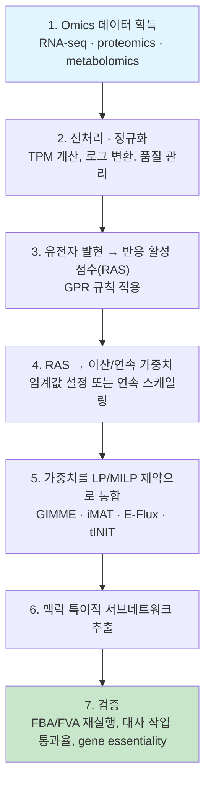

# 1. 범용 모델에서 맥락 특이적 모델로

## 1.1 왜 하나의 모델을 조직마다 잘라내야 하나

"이 장을 시작하며"에서 본 요리책 비유 — 범용 GEM은 요리책 전체, 맥락 특이적 모델은 오늘의 식탁 — 를 이제 구체적인 숫자로 확인해 봅시다. [GEM 구조](../chapter-3/README.md)에서 다룬 Human1 같은 인체 GEM은 인체 게놈 전체에 암호화된 대사 능력을 총망라합니다 — 2020년 Human1 원 발표판은 13,417개 반응과 3,625개 유전자를 포함합니다(버전별 수치와 Human2 계보는 [Chapter 5](../chapter-5/README.md) 참고). 특정 조직 모델의 크기는 추출법·임계값·보호 작업에 따라 크게 달라지므로, 반응 수 자체를 품질 점수처럼 해석해서는 안 됩니다.

Generic 모델을 그대로 [FBA](../chapter-4/README.md)나 유전자 필수성 예측에 사용하면 다음 세 가지 문제가 생깁니다.

1. **생물학적으로 무관한 예측**: 이 조직에서 전혀 발현되지 않는 유전자의 반응까지 네트워크에 포함되어, flux 분포나 유전자 넉아웃 결과가 비현실적으로 나옵니다. 뉴런에서 있을 리 없는 요소 회로(urea cycle) 반응이 뉴런 모델에 그대로 남아있다면, 그 반응을 없애는 유전자 결손을 "치명적"이라고 잘못 예측할 수 있습니다.
2. **과도한 유연성(flexibility)**: 실제로는 쓰지 않는 경로까지 열려 있으니 "이 반응이 필수인지 대체 가능한지"를 계산하는 [FVA](../chapter-4/README.md)의 범위가 불필요하게 넓어지고, 예측의 특이성이 떨어집니다.
3. **표현형 예측 정확도 저하**: 조직·세포주별 유전자 필수성(gene essentiality)을 예측할 때, 맥락 특이적 모델이 generic 모델보다 유의미하게 높은 정확도를 보인다는 것이 여러 벤치마크 연구에서 반복적으로 확인되었습니다.

이 문제를 푸는 것이 바로 Omics 데이터 통합입니다. Omics 통합은 "이 반응이 이론적으로 가능한가"라는 질문을 "이 반응이 **지금, 이 세포에서** 실제로 일어나고 있다는 증거가 있는가"라는 질문으로 바꿔놓습니다.

> **핵심 개념 · 용어(English):** **맥락 특이적 모델(Context-Specific Model)** — Generic GEM으로부터 특정 조직·세포 유형·세포주·질병 상태의 오믹스 데이터(주로 발현 데이터)를 이용해 추출한 서브네트워크(submodel). 발현 증거가 뒷받침하는 반응은 남기고, 증거가 없거나 반대되는 증거가 있는 반응은 제거하거나 억제합니다.


❓ **잠깐, 생각해보기:** 만약 뉴런 모델에 (실제로는 뉴런에서 거의 발현되지 않는) 요소 회로 반응이 그대로 남아 있다면, FBA로 계산한 최적 성장률과 유전자 결손 예측은 어떻게 달라질까요? — 요소 회로는 암모니아를 처리하는 "보너스 경로"처럼 작동해 질소 균형을 더 쉽게 맞추게 해주므로, 실제로는 없는 대안 경로 덕분에 특정 유전자 결손의 영향이 과소평가될 수 있습니다. 즉 "없는 요리법"이 메뉴에 남아있으면, 모델은 실제 세포보다 더 유연하고 더 튼튼하다고 착각하게 됩니다.


## 1.2 통합의 파이프라인: 증거 → 가중치 → 서브네트워크

방법론마다 세부 구현은 다르지만, 거의 모든 발현-제약 통합(expression-constrained integration) 방법론은 다음의 공통 파이프라인을 따릅니다.

이 장은 **3~5단계** — "발현 데이터를 어떻게 반응 수준의 증거로 변환하고, 이를 최적화 제약으로 바꾸는가" — 에 집중합니다. 조직 특이적 모델을 **재구축(reconstruction)**하는 관점 — draft 모델 준비, gap-filling, 품질 관리 체크리스트, tINIT의 6단계 알고리즘과 MILP 유도 과정(6단계) — 은 [Chapter 5](../chapter-5/README.md)에서 이미 다뤘습니다. 추출된 맥락 특이적 모델에 실제로 FBA/FVA를 실행하는 방법(7단계 검증의 일부)은 [Chapter 4](../chapter-4/README.md)를, 암 세포주 맥락 특이적 모델을 이용한 약물 표적 예측 응용은 [Chapter 7](../chapter-7/README.md)을 참고하십시오.

---
