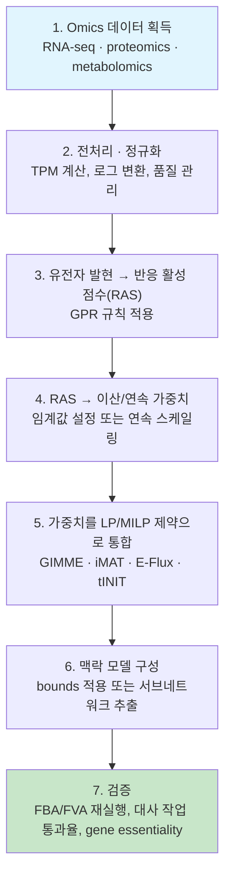

# 1. 범용 모델에서 맥락 특이적 모델로

## 1.1 범용 모델의 적용 범위

범용 GEM은 특정 시점의 세포 상태가 아니라 알려진 대사 능력의 합집합입니다. 예를 들어 Human1 원 발표 모델은 13,417개 반응과 3,625개 유전자를 포함하지만, 이 수치는 해당 릴리스의 속성이지 모든 인체 세포가 동시에 사용하는 반응 수가 아닙니다([Robinson et al., 2020](https://doi.org/10.1126/scisignal.aaz1482)). 맥락 특이적 추출은 전사체와 기능 요구사항을 이용해 특정 조직·세포주·조건에 부합하는 실행가능 공간을 정의합니다. 최종 반응 수는 알고리즘, 임계값, 배지와 보호한 대사 작업에 의존하므로 모델 크기만으로 품질을 평가할 수 없습니다.

Generic 모델을 그대로 [FBA](../chapter-4/README.md)나 유전자 필수성 예측에 사용하면 다음 세 가지 문제가 생깁니다.

1. **조건과 무관한 우회경로**: 해당 조건에서 사용할 근거가 약한 반응이 열려 있으면 실제로는 없는 우회경로가 결손 효과를 보상해 false-negative 필수성 예측을 만들 수 있습니다.
2. **과도한 실행가능 공간**: 사용하지 않는 경로가 포함되면 [FVA](../chapter-4/README.md)의 반응별 범위와 대안 경로 수가 넓어져 조건 특이성이 낮아질 수 있습니다.
3. **목적·배지와의 불일치**: 발현만 줄여도 정확도가 자동으로 높아지는 것은 아닙니다. template model, 배지, 기능 작업과 임계값을 함께 검증해야 하며, 일부 벤치마크에서는 맥락 특이적 모델이 generic model보다 나쁘거나 비슷할 수도 있습니다.

오믹스 통합은 화학량론적으로 가능한 반응 가운데 특정 조건에서 사용할 근거가 있는 반응을 구분합니다. 그러나 mRNA 발현은 반응 flux의 직접 측정값이 아니므로, 추출 결과에는 별도의 대사 작업·교환 flux·유전자 필수성 검증이 필요합니다.

> **핵심 개념 · 용어(English):** **맥락 특이적 모델(Context-Specific Model)** — 범용 GEM에 특정 조직·세포 유형·세포주·질병 조건의 오믹스 증거와 기능 제약을 적용해 얻은 서브네트워크 또는 제약된 모델. 포함 반응은 데이터와 알고리즘에 부합한다는 뜻이며 실제 flux가 비영임을 보장하지 않습니다.


**해석상의 주의:** 낮거나 결측인 발현값은 반응 부재의 직접 증거가 아닙니다. 단백질 반감기, 결측 매핑, 낮은 sequencing depth 또는 비효소 반응 때문에 전사체 신호와 반응 가능성이 다를 수 있습니다. 반응 제거는 GPR 증거뿐 아니라 네트워크 일관성과 대사 작업을 함께 고려해야 합니다.


### 1.1.1 숫자로 보는 "일부만 사용한다"는 말의 의미

다음 표는 발현 임계값만 사용하는 교육용 단순화입니다. 범용 모델의 반응 10개 가운데 6개에 발현 증거가 있고, 나머지 반응은 어떤 보호 작업에도 필요하지 않다고 가정합니다.

| 반응 | 범용 모델 포함 여부 | 이 조직의 발현 증거 | 맥락 특이적 모델 포함 여부 |
|---|:---:|:---:|:---:|
| R1 | 포함 | 있음 (RAS 높음) | 포함 |
| R2 | 포함 | 있음 (RAS 높음) | 포함 |
| R3 | 포함 | 없음 (RAS 낮음) | 제외 |
| R4 | 포함 | 있음 (RAS 중간) | 포함 |
| R5 | 포함 | 없음 (RAS 낮음) | 제외 |
| R6 | 포함 | 있음 (RAS 높음) | 포함 |
| R7 | 포함 | 없음 (RAS 낮음) | 제외 |
| R8 | 포함 | 있음 (RAS 중간) | 포함 |
| R9 | 포함 | 있음 (RAS 높음) | 포함 |
| R10 | 포함 | 없음 (RAS 낮음) | 제외 |

이 가정 아래에서는 6개 반응이 남지만, 60%는 계산 예제의 입력값일 뿐 경험적 보편값이 아닙니다. 실제 추출에서는 낮은 발현 반응도 기능 작업이나 flux consistency를 위해 포함될 수 있고, 높은 발현 반응도 정상상태 네트워크에서 사용할 수 없으면 제외될 수 있습니다.

## 1.2 통합의 파이프라인: 증거 → 가중치·제약 → 맥락 모델

발현 통합법은 반응을 제거하는 추출법과 반응 집합을 유지한 채 bounds를 바꾸는 제약법으로 나뉩니다. 두 유형을 다음의 공통 처리 단계로 정리할 수 있습니다.

각 단계의 오차는 다음 단계로 전파됩니다. 예를 들어 유전자 ID 매핑 오류는 GPR 점수와 최종 반응 선택 또는 bounds를 바꿉니다. 따라서 정규화·ID 매핑·GPR 변환·모델 구성 결과를 단계별로 기록하고, 마지막 검증을 독립 자료에 대해 수행해야 합니다.

맥락 특이화는 기존 모델의 일부 반응을 제거하거나 플럭스 경계를 바꾸므로, 표현형 비교 전에 Chapter 5의 플럭스 일관성, 에너지 생성 순환, 보호 대사 과제, SBML/GPR 보존 검사를 다시 수행해야 한다. 낮은 발현 근거로 생긴 새 dead end나 기능 상실을 곧바로 생물학적 결론으로 해석해서는 안 된다.

이 장은 **3~5단계** — "발현 데이터를 어떻게 반응 수준의 증거로 변환하고, 이를 최적화 제약으로 바꾸는가" — 에 집중합니다. 조직 특이적 모델을 **재구축(reconstruction)**하는 관점 — draft 모델 준비, gap-filling, 품질 관리 체크리스트, tINIT의 6단계 알고리즘과 MILP 유도 과정(6단계) — 은 [Chapter 5](../chapter-5/README.md)에서 이미 다뤘습니다. 추출된 맥락 특이적 모델에 실제로 FBA/FVA를 실행하는 방법(7단계 검증의 일부)은 [Chapter 4](../chapter-4/README.md)를, 암 세포주 맥락 특이적 모델을 이용한 약물 표적 예측 응용은 [Chapter 7](../chapter-7/README.md)을 참고하십시오.


**절 구성:** RAS 계산은 2절, 임계값과 zFPKM은 2.3절, 최적화 알고리즘은 3절, RNA-seq 전처리는 4절, 효소·열역학 제약은 5절에서 다룹니다.


---
