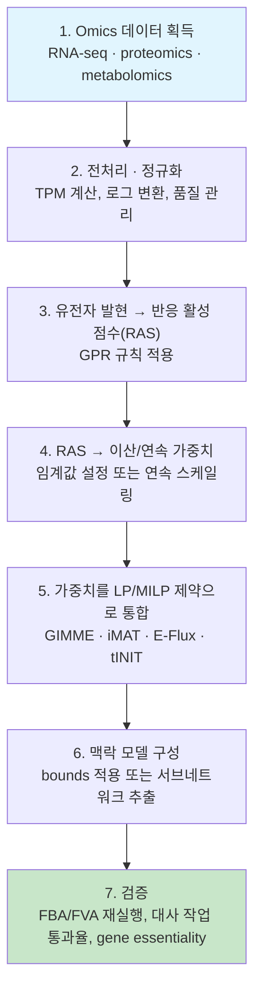

# 1. 범용 모델에서 맥락 특이적 모델로

## 1.1 범용 모델의 적용 범위

범용 [게놈 규모 대사 모델](../glossary.md)(GEM)은 한 세포가 특정 순간에 실제로 쓰는 반응 목록이 아니다. 한 생물에서 알려진 대사 능력을 넓게 모아 둔 반응의 후보 집합이다. 예를 들어 [Human1](../chapter-5/README.md) 원 발표 모델의 13,417개 반응과 3,625개 유전자는 해당 논문판의 구성 요소 수이며, 모든 인체 세포가 동시에 이 반응을 쓴다는 뜻은 아니다([Robinson et al., 2020](https://doi.org/10.1126/scisignal.aaz1482)). **맥락 특이적 모델**은 특정 조직·세포주·조건의 오믹스 증거와 요구 기능을 반응 집합 또는 제약에 반영한 계산 모델이다. 반응을 골라 서브네트워크를 만들 수도 있고, 같은 반응 목록을 보존한 채 플럭스 경계 또는 목적 벌점을 조정할 수도 있다. 최종 반응 수와 해 공간은 알고리즘, 임계값, 배지, 그리고 보호하기로 한 대사 작업에 따라 달라진다. 그래서 모델 크기만으로는 품질을 평가할 수 없다.

범용 모델을 그대로 [FBA](../chapter-4/README.md)나 [유전자 필수성](../glossary.md) 예측에 사용하면 다음 세 가지 문제가 생긴다.

1. **조건과 무관한 우회경로**: 해당 조건에서 사용할 근거가 약한 반응이 열려 있으면 실제로는 없는 우회경로가 결손 효과를 보상해 false-negative 필수성 예측을 만들 수 있다.
2. **과도한 실행가능 공간**: 사용하지 않는 경로가 포함되면 [FVA](../chapter-4/README.md)의 반응별 범위와 대안 경로 수가 넓어져 조건 특이성이 낮아질 수 있다.
3. **목적·배지와의 불일치**: 발현만 줄여도 정확도가 자동으로 높아지는 것은 아니다. 범용 템플릿 모델, 배지, 기능 작업과 임계값을 함께 검증해야 하며, 일부 벤치마크에서는 맥락 특이적 모델이 범용 모델보다 나쁘거나 비슷할 수도 있다.

오믹스 통합은 화학량론적으로 가능한 반응 가운데 특정 조건에서 사용할 근거가 있는 반응을 구분한다. 여기서 **전사체 양**, **단백질 양**, **촉매 효소 활성 또는 용량**, **반응 플럭스**는 서로 다른 측정·추정 층이다. GPR 규칙으로 전사체를 변환한 반응 활성 점수(RAS)는 첫 번째 층의 증거를 반응에 연결한 값일 뿐, 효소 활성·용량 또는 flux의 직접 측정값이 아니다. 따라서 추출 결과에는 별도의 대사 작업·교환 flux·유전자 필수성 검증이 필요하다.

> **핵심 개념 · 용어(English):** **[맥락 특이적 모델](../glossary.md)(Context-Specific Model)** — 범용 GEM에 특정 조직·세포 유형·세포주·질병 조건의 오믹스 증거와 기능 제약을 적용해 얻은 서브네트워크 또는 제약된 모델. 포함 반응은 데이터와 알고리즘에 부합한다는 뜻이며 실제 flux가 비영임을 보장하지 않는다.


**해석상의 주의:** 낮거나 결측인 발현값은 반응 부재의 직접 증거가 아니다. 단백질 반감기, 결측 매핑, 낮은 sequencing depth 또는 비효소 반응 때문에 전사체 신호와 반응 가능성이 다를 수 있다. 반응 제거는 GPR 증거뿐 아니라 네트워크 일관성과 대사 작업을 함께 고려해야 한다.


### 1.1.1 "일부만 사용한다"의 정량적 의미: 10-반응 분류 예제

다음 표는 발현 증거, 보호 작업 및 배지 경계를 함께 사용하는 교육용 단순화이다. 범용 모델의 반응 10개를 같은 입력 조건에서 분류한다고 가정한다.

| 반응 | 범용 모델 포함 여부 | 이 조직의 발현 증거 | 보호 작업·조건 검사 | 맥락 특이적 모델 포함 여부 |
|---|:---:|:---:|---|:---:|
| R1 | 포함 | 있음 (RAS 높음) | 작업 T1에 필요 | 포함 |
| R2 | 포함 | 있음 (RAS 높음) | 조건과 양립 | 포함 |
| R3 | 포함 | 없음 (RAS 낮음) | **작업 T1에 필요하므로 보호** | 포함 |
| R4 | 포함 | 있음 (RAS 중간) | 조건과 양립 | 포함 |
| R5 | 포함 | 없음 (RAS 낮음) | 보호 작업에 불필요 | 제외 |
| R6 | 포함 | 있음 (RAS 높음) | 조건과 양립 | 포함 |
| R7 | 포함 | 없음 (RAS 낮음) | 보호 작업에 불필요 | 제외 |
| R8 | 포함 | 있음 (RAS 중간) | 조건과 양립 | 포함 |
| R9 | 포함 | 있음 (RAS 높음) | **닫힌 교환반응을 우회하므로 이 배지에서는 제외** | 제외 |
| R10 | 포함 | 없음 (RAS 낮음) | 보호 작업에 불필요 | 제외 |

이 고정 입력에서는 포함 반응이 R1, R2, R3, R4, R6, R8의 6개이므로 유지율은 $$6/10=0.60$$이다. 보호 작업 T1은 필요한 R1과 R3이 모두 남아 있으므로 $$1/1$$로 유지된다. R3은 낮은 RAS만으로 제거하면 작업을 잃는 반례이고, R9는 높은 RAS라도 닫힌 배지 경계를 우회하므로 이 조건에서 채택하지 않는 반례이다. 이 두 판단은 발현값만으로 반응을 기계적으로 삭제하지 않는 이유를 보인다.

이 예제는 10개 반응으로 만든 결정적 분류 연습이며 단위는 없는 유지 비율이다. 실제 모델·배지·목적함수·solver와 허용오차는 적용하지 않으며 `not applicable`이다. 60%는 계산 예제의 입력값일 뿐 경험적 보편값이나 품질 점수가 아니다. 실제 추출에서는 낮은 발현 반응도 기능 작업이나 flux consistency를 위해 포함될 수 있고, 높은 발현 반응도 정상상태 네트워크에서 사용할 수 없으면 제외될 수 있다.

## 1.2 통합의 파이프라인: 증거 → 가중치·제약 → 맥락 모델

통합 방법은 결과 모델을 만드는 방식이 다르다. **반응 선택·추출법**(tINIT, FASTCORE 등)은 선택하지 않은 반응을 모델에서 제외하여 반응 목록과 행렬 $$\mathbf S$$를 줄일 수 있다. **제약 조정법**(E-Flux, GIMME 등)은 보통 반응 목록은 유지하고, 발현 근거에 따라 플럭스 경계 또는 사용 벌점을 바꾼다. 다만 iMAT과 GIMME의 구현·후처리에는 차이가 있으므로, iMAT을 ‘반응을 영구 삭제하는 방법’으로 단순 분류하지 않는다.

| 모델 상태 또는 결과 | 반응 목록·$$\mathbf S$$ | bounds | 목적 또는 벌점 | 사용하는 증거 | 해석 경계 |
|---|---|---|---|---|---|
| 범용 GEM | 기준 | 기준 | 분석 목적에 따라 별도 설정 | 알려진 생화학 지식 | 특정 조건의 활성 반응 목록이 아니다 |
| 배지만 바꾼 조건 설정 | 유지 | 교환반응 등 조건 경계만 변경 | 목적은 별도 명시 | 배지·환경 조건 | 오믹스 기반 맥락 모델은 아니다 |
| 반응 선택·추출 결과 | 선택에 따라 감소 | 남은 반응에 맞게 재설정 가능 | 방법별로 다름 | 오믹스 증거·보호 작업 | 포함이 비영 flux를 보장하지 않는다 |
| 경계·벌점 조정 결과 | 대개 유지 | 발현 근거로 조정 가능 | 벌점 또는 별도 목적을 명시 | 오믹스 증거·기능 요구 | 한 점 flux는 목적과 tie-break에 의존한다 |

두 방법 모두, 같은 재구축에 배지·교환반응 경계만 다르게 부여한 조건 특이적 설정([Chapter 3](../chapter-3/README.md)–[Chapter 4](../chapter-4/README.md))과는 구별해야 한다. 배지를 바꾸는 것은 $$\mathbf S$$는 그대로 둔 채 경계조건만 달라진 경우다. 반면 오믹스 기반 반응 제거는 재구축의 반응 집합과 $$\mathbf S$$ 자체를 조직·조건에 맞게 축소한 경우다. 이 두 유형을 다음의 공통 처리 단계로 정리할 수 있다.

**그림 6.1. 오믹스 증거에서 맥락 특이적 모델과 검증으로 이어지는 정보 흐름.** 저자 작성 Mermaid 모식도이다. 화살표는 각 단계의 출력이 다음 단계의 입력이 됨을 뜻하며, RAS와 최종 모델은 flux 또는 효소 활성의 직접 관측값이 아니다. 내부 모델 점검과 construction에 사용하지 않은 독립 자료 비교는 서로 다른 검증 단계이다. 개념 근거: 맥락 특이적 모델 추출·검증 파이프라인의 표준 단계(Opdam et al., 2017; Richelle et al., 2019).

각 단계의 오차는 다음 단계로 전파된다. 예를 들어 유전자 ID 매핑 오류는 GPR 점수와 최종 반응 선택 또는 bounds를 바꾼다. 따라서 정규화·ID 매핑·GPR 변환·모델 구성 결과를 단계별로 기록하고, 마지막 검증을 독립 자료에 대해 수행해야 한다. 다음 표는 각 출력에 함께 남길 최소 provenance와 실패 정책을 고정한다.

| 단계 | 입력 → 변환 → 출력 | 함께 기록할 provenance | 실패 시 처리 |
|---|---|---|---|
| 1 | 원 오믹스 자료 → 획득 → 원시 파일 | source release, sample·donor ID, assay | 식별자가 없으면 중단 또는 gap |
| 2 | 원시 파일 → QC·정규화 → 발현 행렬 | annotation 판, 변환·필터 규칙 | QC 실패 표본을 제외하고 이유 기록 |
| 3 | 발현 행렬 → ID 매핑·GPR → RAS | mapping table, 미매핑·다중매핑 수 | 미매핑 규칙을 고정하고 gap 유지 |
| 4 | RAS → 임계값·가중치 → method input | threshold, scaling, missing-value policy | 민감도 분석 또는 보류 |
| 5 | method input → LP/MILP → solution/model | algorithm, version, solver, tolerance, status | infeasible·timeout을 성공 결과에서 제외하지 않음 |
| 6 | solution/model + medium·objective → 맥락 모델 | template 판, bounds, objective, reaction changes | 기능 상실이면 재검토 또는 명시적 실패 |
| 7 | 맥락 모델 → 내부 QC 및 독립 자료 비교 → 판정 | task·consistency 결과와 hold-out phenotype/flux endpoint | 내부 QC 통과를 외부 검증 통과로 바꾸어 쓰지 않음 |

맥락 특이화는 기존 모델에서 일부 반응을 제거하거나 플럭스 경계를 바꾼다. 그래서 표현형을 비교하기 전에, Chapter 5의 플럭스 일관성, 에너지 생성 순환, 보호 대사 과제, SBML/GPR 보존 검사를 다시 수행해야 한다. 낮은 발현 근거로 생긴 새 dead end나 기능 상실을 곧바로 생물학적 결론으로 해석해서는 안 된다.

이 장은 **3~5단계** — "발현 데이터를 어떻게 반응 수준의 증거로 변환하고, 이를 최적화 제약으로 바꾸는가" — 에 집중한다. 조직 특이적 모델을 **[재구축](../glossary.md)(reconstruction)**하는 관점 — draft 모델 준비, [gap-filling](../glossary.md), 품질 관리 체크리스트, [tINIT](../glossary.md)의 6단계 알고리즘과 [MILP](../glossary.md) 유도 과정(6단계) — 은 [Chapter 5](../chapter-5/README.md)에서 이미 다뤘다. 추출된 맥락 특이적 모델에 실제로 FBA/FVA를 실행하는 방법(7단계 검증의 일부)은 [Chapter 4](../chapter-4/README.md)를, 암 세포주 맥락 특이적 모델을 이용한 약물 표적 예측 응용은 [Chapter 7](../chapter-7/README.md)을 참고할 수 있다.


**절 구성:** RAS 계산은 2절, 임계값과 zFPKM은 2.3절, 최적화 알고리즘은 3절, RNA-seq 전처리는 4절, 효소·열역학 제약은 5절에서 다룬다.


---
