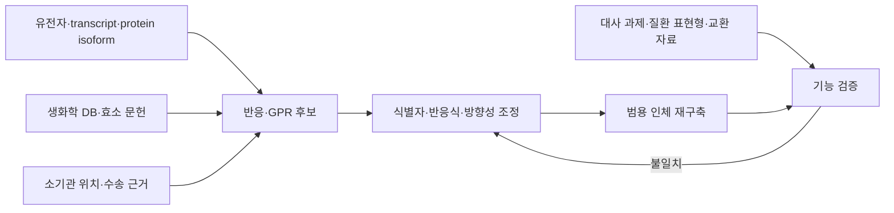
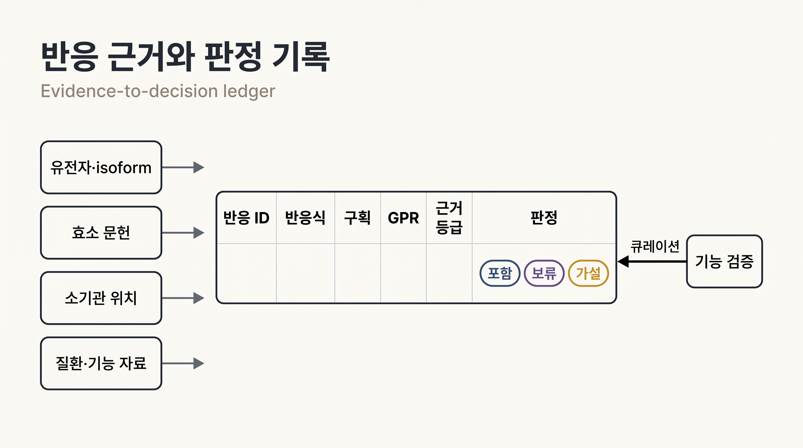

# 1. 인체 대사 네트워크의 재구축 범위

인체 대사 재구축은 하나의 세포가 특정 순간에 보이는 활성 상태를 복제하는 작업이 아니다. 여러 조직과 세포 유형에서 확인된 반응·유전자·구획·수송 근거를 통합해, 조건별 모델을 만들 수 있는 범용 지식 기반을 구축하는 작업이다. 따라서 재구축 단계의 질문은 “어떤 플럭스가 흐르는가”보다 “어떤 반응을 어떤 근거로 후보에 포함하며, 어떤 기능 시험으로 그 선택을 검증하는가”에 가깝다.

다음 두 객체를 구분한다.

- **범용 인체 재구축(generic human reconstruction)**: 인간에서 지지된 대사 반응과 그 근거를 통합한 지식 기반이다. 평균 세포의 활성 네트워크를 뜻하지 않는다.
- **[맥락 특이 모델(context-specific model)](../glossary.md)**: 범용 재구축에 조직·세포·질병 상태의 자료, 배지와 기능 요구를 적용해 만든 계산 모델이다.

## 1.1 미생물 GEM과 인체 재구축의 공통 원칙

미생물과 인체 GEM은 반응의 질량 보존, 방향성, 구획, [GPR](../chapter-3/README.md), 경계조건과 기능 시험을 명시한다는 원칙을 공유한다. 차이는 증거의 조직화 방식과 적용 범위에 있다.

| 판단 항목 | 미생물 GEM에서 흔한 초점 | 범용 인체 재구축에서 추가되는 초점 |
|:---|:---|:---|
| 유전자 근거 | 균주 게놈과 효소 기능 | transcript·protein isoform, paralog와 복합체 |
| 구획 | 세포질·막·주변세포질 | 세포질과 여러 소기관, 조직 간 교환 |
| 환경 | 배지·산소·배양 방식 | 혈장·조직액, 세포 유형과 생리 상태 |
| 기능 검증 | 기질 이용·성장·분비·결손 | 대사 과제, 생체표지자, 세포주 의존성 |
| 맥락 특이화 | 균주·배지·성장 상태 | 조직·세포·질병 상태 |

단세포 생물에서도 게놈에 존재하는 모든 반응이 동시에 쓰이지 않는다. 인체에서는 조직 분화와 소기관 구획화 때문에 범용 지식 기반과 조건별 활성 가설의 간극이 더 크다. 그러므로 반응 수가 많다는 사실을 생물학적 완전성이나 예측 정확도의 증거로 사용하지 않는다.

## 1.2 반응 선택을 지지하는 증거 층

```mermaid
flowchart LR
    G["유전자·transcript·protein isoform"] --> R["반응·GPR 후보"]
    B["생화학 DB·효소 문헌"] --> R
    L["소기관 위치·수송 근거"] --> R
    R --> C["식별자·반응식·방향성 조정"]
    C --> H["범용 인체 재구축"]
    P["대사 과제·질환 표현형·교환 자료"] --> V["기능 검증"]
    H --> V
    V -->|불일치| C
```

_그림 6.1:_ 범용 인체 대사 재구축에서 반응 후보를 선택하고 검증하는 증거 흐름. 유전자·효소·위치 근거는 반응 후보와 GPR을 지지하고, 식별자·반응식·방향성 조정 뒤 만든 재구축은 대사 과제와 독립 표현형으로 시험한다. 피드백 화살표는 검증 실패가 큐레이션으로 돌아감을 뜻한다. 실제 GEM 계산 결과가 아닌 교육용 모식도이다. 저자 작성; 개념 근거: [Duarte et al. (2007)](https://doi.org/10.1073/pnas.0610772104), [Robinson et al. (2020)](https://doi.org/10.1126/scisignal.aaz1482).

반응별로 최소한 다음 질문에 답해야 한다.

1. 어떤 인간 유전자·transcript·protein isoform이 촉매 기능을 지지하는가?
2. 반응물·생성물·보조인자와 방향성이 해당 구획에서 타당한가?
3. 효소와 대사물이 같은 세포 구획에 위치하는가?
4. 구획 사이 이동에는 알려진 수송체 또는 명시적 가설이 있는가?
5. 이 반응을 요구하거나 기각하는 대사 과제·질환 표현형·교환 자료가 있는가?
6. 근거가 문헌, 데이터베이스 전이, gap-filling 가설 가운데 무엇인지 추적 가능한가?

서열 상동성, 대사체 검출, 데이터베이스 수록은 각각 하나의 증거 유형이다. 대사체가 검출되었다고 생성 경로나 세포 내 구획이 유일하게 정해지지 않으며, 상동성이 높다고 기질 특이성이 자동으로 확정되지 않는다. 서로 다른 증거가 충돌하면 하나를 기계적으로 우선하지 않고 반응별 provenance와 판단 근거를 남긴다.

## 1.3 통합은 합집합이 아니라 조정 과정이다

서로 다른 인체 재구축은 같은 화합물과 반응을 다른 식별자·양성자화 상태·구획·방향으로 기록할 수 있다. 따라서 통합은 파일의 단순 합집합이 아니라 중복과 충돌을 판별하는 큐레이션이다.

| 통합 단계 | 대표 실패 | 생물학적 확인 기준 |
|:---|:---|:---|
| 대사물 매핑 | 이성질체·염·양성자화 상태의 잘못된 병합 | 구조·화학식·전하·구획 |
| 반응 매핑 | 보조인자나 방향이 다른 반응의 중복 처리 | 균형식·효소 특이성·생리적 방향 |
| 구획 매핑 | 서로 다른 소기관 species의 병합 | 위치 근거·수송 연결 |
| GPR 조정 | paralog의 과잉 OR, 복합체 소단위의 누락 AND | 단백질 복합체·isoform 근거 |
| 경계 정규화 | exchange·sink·demand 범위 혼동 | 모델 경계와 생리적 입력·출력 |
| 기능 시험 | 암묵적 입력 때문에 대사 과제가 통과 | 과제별 배지·출력·최소 flux 기록 |

_그림 6.2:_ 인체 대사 반응의 근거와 큐레이션 판정 기록. 유전자·isoform, 효소 문헌, 소기관 위치와 질환·기능 자료는 반응 ID·균형식·구획·GPR과 함께 provenance 필드에 저장되며, 판정은 포함·보류·가설로 구분된다. 기능 검증의 불일치는 해당 반응의 큐레이션으로 되돌아간다. 실제 GEM 계산 결과가 아닌 교육용 모식도이다. 저자 작성; 개념 근거: [Duarte et al. (2007)](https://doi.org/10.1073/pnas.0610772104), [Thiele and Palsson (2010)](https://doi.org/10.1038/nprot.2009.203).

[Human1](03.md)은 HMR2, iHsa와 Recon3D를 통합하면서 이 조정을 체계적으로 수행한 사례이다. 어떤 반응이 최종 모델에 남았는지뿐 아니라 중복 제거, 반응식 수정, GPR 변경과 시험 결과를 함께 봐야 통합의 품질을 평가할 수 있다.

## 1.4 검증은 선택 규칙과 독립 자료를 분리한다

범용 재구축의 내부 검사는 질량·전하 균형, 소기관 수송, 에너지 생성 순환, 대사 과제와 주석 완전성을 다룬다. 이 검사는 모델이 스스로 모순되지 않는지 평가하지만, 조직별 예측의 정확성을 보장하지 않는다. 조직·세포주 모델을 만든 뒤에는 구축에 쓰지 않은 유전자 의존성, 교환 자료, 생체표지자 또는 기능 자료로 별도 검증해야 한다.

검증 결과는 endpoint별로 기록한다. 대사 과제 통과, 질환 생체표지자 방향, 세포주 유전자 의존성과 교환 flux는 서로 다른 질문이다. 한 endpoint의 성능을 재구축 전체의 단일 정확도로 바꾸어 쓰지 않는다.


범용 인체 재구축은 여러 세포 유형에서 지지된 반응의 통합 지식 기반이다. 모든 반응이 한 세포에서 동시에 활성이라는 뜻도, 어느 한 조직의 평균 플럭스를 나타낸다는 뜻도 아니다.


이 범위를 정한 뒤 [2절](02.md)은 주요 인체 GEM의 계보와 버전을, [3절](03.md)은 Human1·Human2의 통합과 큐레이션을 다룬다. [4절](04.md)부터는 범용 모델을 조건별 모델로 좁히는 선택과 검증으로 전환한다.

---
