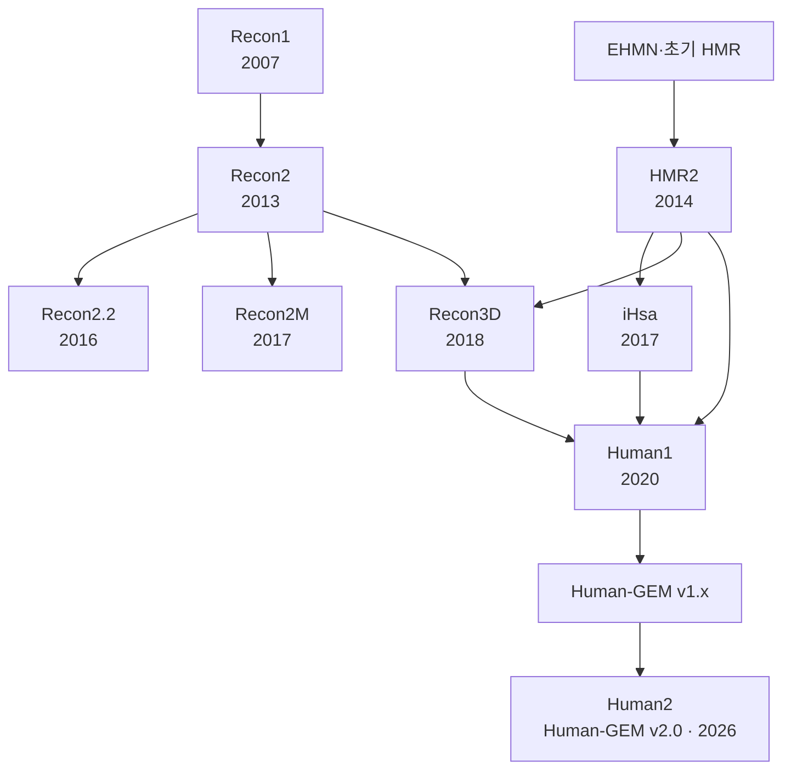
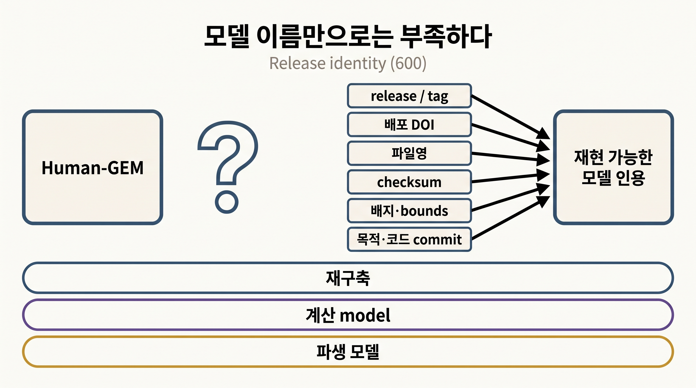

# 2. 인체 GEM의 계보와 버전

인체 GEM은 하나의 직선 계보로 발전하지 않았다. Recon 계열과 HMR 계열이 병렬로 갱신되었고, transcript·protein isoform 또는 단백질 구조를 강조한 파생 자원이 중간에 갈라졌다. Human1은 두 주요 계열의 구성요소를 통합했고, Human-GEM 저장소의 공개 버전 관리는 Human2로 이어졌다. 모델 이름만으로 분석 대상을 식별할 수 없는 이유가 이 계보에 있다.



_그림 6.3:_ 주요 인체 대사 재구축의 계승과 통합 관계. 화살표는 논문과 저장소가 밝힌 주요 구성요소의 계승을 나타내며 모든 데이터 기여를 망라한 완전한 genealogy는 아니다. 연도와 이름이 비슷해도 같은 모델 객체라는 뜻은 아니다. 실제 모델 계산 결과가 아닌 교육용 모식도이다. 저자 작성; 개념 근거: [Brunk et al. (2018)](https://doi.org/10.1038/nbt.4072), [Robinson et al. (2020)](https://doi.org/10.1126/scisignal.aaz1482), [Luo et al. (2026)](https://doi.org/10.1073/pnas.2516511123).

## 2.1 주요 릴리스의 범위

| 재구축 | 논문이 보고한 대표 규모 | 구별해야 할 기여 |
|:---|:---|:---|
| Recon1 (2007) | 1,496 ORF, 3,311 metabolic·transport reactions | 초기 전역 인간 재구축과 288개 기능 시험 |
| Recon2 (2013) | 1,789 genes, 7,440 reactions, 5,063 compartmentalized metabolites | community reconstruction과 선천성 대사질환 생체표지자 검증 |
| HMR2 (2014) | 3,765 genes, 8,181 reactions, 6,007 compartmentalized metabolites | 조직 특이 모델링을 위한 HMR 계열 확대 |
| Recon2.2 (2016) | 1,675 genes, 7,785 reactions, 5,324 compartmentalized metabolites | 대사물 식별자, GPR과 반응식 정비 |
| Recon2M (2017) | 1,106 genes에 대한 11,415 [GeTPRA](../glossary.md) | gene–transcript–protein–reaction 연결 확장 |
| Recon3D (2018) | reconstruction 3,288 ORF, 13,543 reactions | 단백질 구조·variant 연결과 별도 flux-consistent model 배포 |

_표 6.1._ 논문판 인체 재구축의 대표 집계. 출처: [Recon1](https://doi.org/10.1073/pnas.0610772104), [Recon2](https://doi.org/10.1038/nbt.2488), [HMR2](https://doi.org/10.1038/ncomms4083), [Recon2.2](https://doi.org/10.1007/s11306-016-1051-4), [Recon2M](https://doi.org/10.1073/pnas.1713050114), [Recon3D](https://doi.org/10.1038/nbt.4072). 행마다 릴리스와 집계 정의가 다르므로 단순 증감률을 품질 지표로 사용하지 않는다.

이 표의 수치는 생물 종의 고정 속성이 아니라 특정 논문판의 속성이다. Recon2M은 Human2의 이전 이름이 아니라 Recon2 계열의 transcript·isoform 확장이고, HMR2와 Human2도 숫자만 같을 뿐 서로 다른 계보에 속한다.

## 2.2 같은 모델에도 여러 개의 규모가 존재한다

모델 규모를 인용할 때에는 무엇을 셌는지 함께 적어야 한다.

- `reaction`에 exchange·sink·demand와 biomass를 포함했는가?
- 대사물 수가 고유 화합물인지 구획별 species인지?
- gene, ORF, transcript와 protein isoform 가운데 무엇을 셌는가?
- 전체 [재구축](../glossary.md)인지 계산에 사용하는 flux-consistent model인지?
- 논문 최초 릴리스인지 이후 저장소 tag인지?

Recon2의 5,063 compartment-specific metabolites와 2,626 unique metabolites는 모순되는 수가 아니다. 같은 화합물이 여러 구획에 있으면 서로 다른 모델 species로 세기 때문이다. Recon3D도 전체 지식 재구축에 13,543 reactions를, 별도 계산 model에 10,600 reactions를 보고했다. 두 수의 차이를 모두 오류 반응의 제거 비율로 해석할 수 없다. 지식 기반과 계산용 부분집합은 선택 목적이 다르다.

## 2.3 버전은 생물학적 결론의 일부이다

반응식·GPR·구획·경계 반응이 릴리스 사이에서 바뀌면 같은 RNA-seq과 같은 알고리즘을 사용해도 다른 맥락 특이 모델이 나올 수 있다. 특히 유전자 결손과 대사 과제 결과는 GPR과 수송 반응 변경에 민감하다. 따라서 `Recon3D` 또는 `Human-GEM`이라는 이름만 적는 인용은 재현에 충분하지 않다.

다음 단위를 함께 기록한다.

```text
모델명 + 정확한 release/tag + 배포 DOI/URL + 파일명 + checksum
+ 사용한 배지·경계조건·목적함수 + 변환 스크립트 commit
```

지속적으로 갱신되는 [Human-GEM](https://github.com/SysBioChalmers/Human-GEM)은 릴리스별 archive를 제공한다. 분석을 재현할 때에는 현재 기본 브랜치가 아니라 실제 계산에 사용한 변경 불가능한 릴리스와 입력 파일을 인용한다.



_그림 6.4:_ 지속적으로 갱신되는 인체 GEM의 재현 가능한 인용 단위. 모델 이름만으로는 재구축·계산 model·파생 모델과 릴리스를 구분할 수 없으므로 release 또는 tag, 배포 DOI, 파일명, checksum과 실제 사용한 배지·bounds·목적·코드 commit을 함께 고정한다. 특정 릴리스의 성능이나 규모를 계산한 그림이 아닌 기록 체계 모식도이다. 저자 작성; 개념 근거: [Human-GEM releases](https://github.com/SysBioChalmers/Human-GEM/releases), [Carey et al. (2020)](https://doi.org/10.1038/s41598-020-66483-2).

## 2.4 연구 질문에 맞는 릴리스를 선택한다

릴리스 선택은 반응 수의 순위가 아니라 질문과 검증 범위에 따라 결정한다.

| 연구 질문 | 우선 확인할 속성 | 피해야 할 판단 |
|:---|:---|:---|
| 조직별 대사 과제 | 과제 정의·구획·수송·교환 경계 | 반응 수가 가장 많은 모델 자동 선택 |
| transcript·isoform 변이 | transcript·protein 연결과 식별자 판 | gene 수만 비교 |
| 구조 변이 해석 | 단백질 구조·variant 연결 범위 | 구조 링크가 모든 반응에 있다는 가정 |
| 대규모 맥락 모델 | 공개 버전 관리·시험·추출 도구 호환성 | 저장소 최신 브랜치만 기록 |
| 릴리스 간 성능 비교 | 같은 배지·endpoint·판정 규칙 | 서로 다른 benchmark의 최고값 비교 |


반응·대사물·유전자 수는 모델 릴리스와 집계 규칙의 속성이다. 수가 증가하거나 감소했다는 사실만으로 큐레이션 품질의 향상 또는 저하를 결론 내리지 않는다.


[3절](03.md)은 Human1과 Human2에서 실제로 어떤 통합·큐레이션·시험이 이루어졌는지를 사례로 살펴본다.

---
