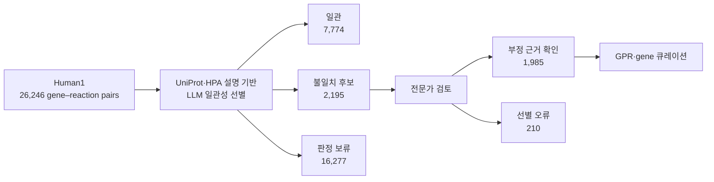
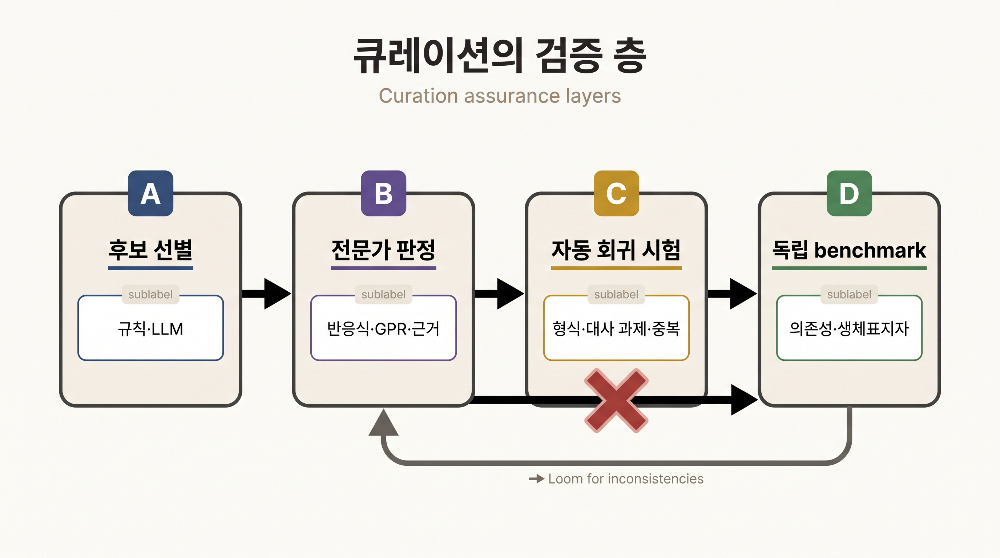

# 3. Human1·Human2 통합과 큐레이션

Human1과 Human2는 고정된 완성품이라기보다 공개 저장소에서 근거, 변경 이력과 자동 시험을 함께 관리하는 Human-GEM의 주요 릴리스이다. 두 릴리스를 비교할 때에는 논문판, 저장소 tag와 파생 맥락 특이 모델을 분리해야 한다. 큐레이션의 핵심은 반응 수의 증감이 아니라 식별자·화학·GPR·기능 시험의 추적 가능한 개선이다.

## 3.1 Human1은 서로 다른 재구축을 조정했다

Human1은 HMR2, iHsa와 Recon3D의 구성요소를 통합하고 중복·충돌을 수동·반자동으로 조정했다. 이 과정에는 대사물 식별자 매핑, 화학식 수정, 반응 재균형, 가역성 검토, 효소 복합체 정보와 generic biomass 반응의 정비가 포함되었다.

| 항목 | Human1 논문판(2020) |
|:---|---:|
| Reactions | 13,417 |
| Compartment-specific metabolites | 10,138 |
| Unique metabolites | 4,164 |
| Genes | 3,625 |
| Stoichiometrically consistent metabolites | 100% |
| Mass-balanced reactions | 99.4% |
| Charge-balanced reactions | 98.2% |

_표 6.2._ Human1 논문판의 대표 통계. 출처: [Robinson et al. (2020)](https://doi.org/10.1126/scisignal.aaz1482), CC BY 4.0. 이 수치는 해당 논문판과 집계 정의에 한정한다.

논문은 통합 과정에서 8,185 duplicated reactions와 3,215 duplicated metabolites를 제거하고, 2,016 metabolite formulas, 3,226 reaction equations와 83 reaction reversibilities를 교정했다고 보고했다. 이 기록은 통합이 단순한 합집합이 아니라 화학적 동일성·구획·방향·GPR을 다시 판정하는 작업임을 보여 준다.

`100% stoichiometric consistency`는 내부 반응식 집합이 보존 법칙과 양립한다는 구조 검사 결과이다. 모든 반응이 주어진 배지에서 flux를 갖거나 모든 조직의 표현형을 정확히 예측한다는 뜻은 아니다. Human1 이후의 v1.x 변경도 [Human-GEM 저장소](https://github.com/SysBioChalmers/Human-GEM)에 누적되었으므로 `Human1`이라는 이름만으로 실제 사용 파일을 식별할 수 없다.

## 3.2 Human2는 LLM을 후보 선별에 사용했다

Human2는 Human-GEM v2 계열의 재구축이다. Human2 큐레이션에서 대규모 언어 모델(large language model, LLM)은 전문가를 대체하는 자동 판정기가 아니라 검토 우선순위를 정하는 후보 선별 도구로 사용되었다.



_그림 6.5:_ Human2의 LLM 보조 GPR 검토 흐름. LLM은 26,246개 gene–reaction pair를 일관·불일치 후보·판정 보류로 나누었고, 불일치 후보 2,195개는 전문가가 다시 판정했다. 숫자는 해당 연구의 선별 단계에 한정하며 전체 GPR 정확도나 표현형 정확도를 뜻하지 않는다. 실제 모델 계산 결과가 아닌 독립 교육용 모식도이다. 저자 작성; 사실·범주 근거: [Luo et al. (2026)](https://doi.org/10.1073/pnas.2516511123), CC BY-NC-ND 4.0. 원 논문의 그림을 복제·변형하지 않았다.

전체 pair 가운데 16,277개는 source annotation이 불완전하거나 모호해 판정 보류로 남았다. 불일치 후보 2,195개 가운데 1,985개가 전문가 검토에서 부정 근거로 확인되었고 210개는 선별 오류였다. 따라서 $$1{,}985/2{,}195\approx90.4\%$$는 **선별된 부분집합에서 부정 후보가 확인된 비율**이다. 이를 전체 GPR 정확도나 Human2 표현형 정확도로 해석하지 않는다.

이 검토를 포함한 큐레이션으로 1,135 GPRs가 갱신되고 대사와 무관한 203 genes가 제거되었다. Human1에서 Human2까지 보고된 전체 변경에는 LLM 선별 외에도 community issue, 전문가 반응식·방향성·GPR 큐레이션과 공개 저장소 개발이 포함된다.

## 3.3 자동 시험은 회귀를 찾고 외부 검증은 생물학을 묻는다

Human-GEM 저장소는 형식 변환, 대사 과제, unused·dead-end metabolites, 중복 반응, MEMOTE/MACAW와 릴리스 수준 유전자 필수성 시험을 사용한다. 자동 시험은 변경이 기존 구조나 기능을 훼손하는지 탐지하지만, 모든 반응과 GPR의 생물학적 진실을 인증하지 않는다.



_그림 6.6:_ Human-GEM 큐레이션의 검증 층. 규칙 또는 LLM의 후보 선별은 전문가의 반응식·GPR·근거 판정으로 이어지고, 자동 회귀 시험은 형식·대사 과제·중복 오류를 탐지하며, 독립 benchmark는 구축에 쓰지 않은 의존성·생체표지자 endpoint를 평가한다. 자동 선별이나 내부 시험만으로 생물학적 정확성이 확정되지는 않는다. 실제 모델 성능 계산이 아닌 교육용 모식도이다. 저자 작성; 개념 근거: [Robinson et al. (2020)](https://doi.org/10.1126/scisignal.aaz1482), [Luo et al. (2026)](https://doi.org/10.1073/pnas.2516511123).

Human2 연구가 보고한 benchmark도 서로 다른 모델 객체와 endpoint를 평가한다.

- ftINIT으로 만든 세포주 특이 모델의 유전자 필수성 성능
- 112개 선천성 대사질환 모사의 생체표지자 방향 판정
- 효소 제약 NCI-60 세포주 모델의 flux consistency
- Human2 릴리스의 MEMOTE total score

generic reconstruction, 맥락 특이 모델과 효소 제약 파생 모델의 결과를 하나의 “Human2 정확도”로 합치지 않는다. Human1의 annotation score와 Human2의 MEMOTE score처럼 정의가 다른 지표도 직접적인 개선 폭으로 비교하지 않는다.

## 3.4 범용 릴리스와 파생 모델을 구분한다

Human2 자체는 여러 인간 세포 유형의 대사 지식을 통합한 범용 재구축이다. 조직 특이 GEM, whole-body model과 조건별 동역학 모사는 Human2에 조직 자료, 맥락 추출, 기관 간 연결과 추가 제약을 적용한 파생 모델이다.

```text
Human2 범용 재구축
  → 조직 자료와 맥락 추출 설정
  → 기관별 GEM
  → 기관·체액 연결
  → whole-body 또는 조건별 파생 모델
```

파생 결과를 재현하려면 Human2 tag뿐 아니라 조직 자료 릴리스, 추출 알고리즘·설정, 기관 연결, 입력 조건과 검증 endpoint를 함께 기록한다. Human2 사례가 보여 주는 일반 원칙은 **자동 후보 선별, 전문가 판정, 공개 provenance와 회귀 시험을 결합한다**는 데 있다.


LLM의 분류 결과는 큐레이션 후보이다. source annotation이 모호한 항목을 임의로 확정하거나 전문가 검토를 생략하면 불확실성을 숨기게 된다.


---
