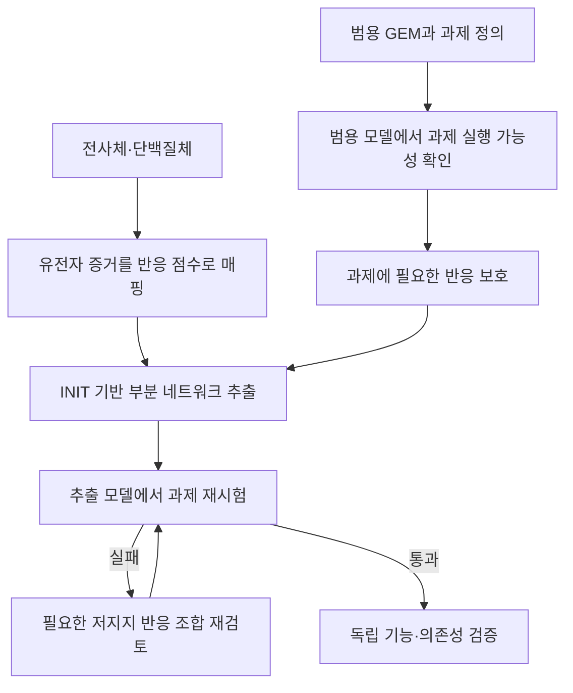
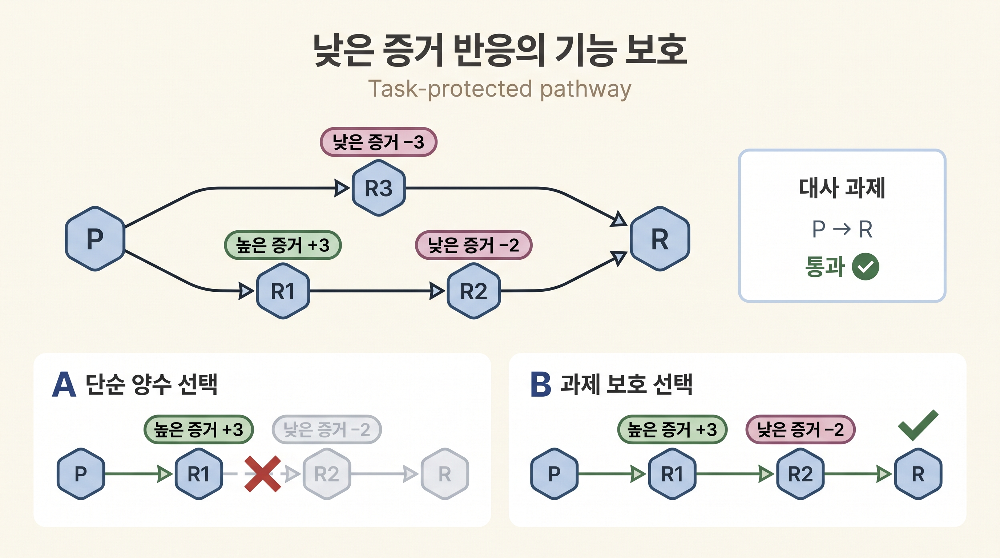

# 5. INIT·tINIT·ftINIT 맥락 특이 추출

범용 인체 재구축에서 조직·세포주 모델을 만들려면 오믹스 증거가 지지하는 반응을 선호하면서도, 해당 세포가 수행해야 하는 기능을 보존해야 한다. INIT 계열은 이 두 요구를 반응 선택 문제로 결합한다. 핵심 결과는 한 번의 flux 계산값이 아니라, 명시된 증거·기능·환경 아래에서 사용할 반응의 부분집합이다.

## 5.1 INIT은 반응 증거를 선택 기준으로 바꾼다

[INIT](../glossary.md)은 transcriptomics·proteomics 증거를 반응 점수로 변환하고, 지지가 강한 반응을 선호하면서 정상상태에서 기능할 수 있는 부분 네트워크를 선택한다. 원 방법은 검출된 대사물의 순생산 가능성도 정성적 증거로 사용할 수 있다. 반응 점수는 [GPR](../chapter-3/README.md)의 AND·OR 구조, 자료 유형과 결측 처리에 따라 달라지며 보편적인 `min/max` 공식 하나로 고정되지 않는다.

핵심 선택 규칙은 증거 점수가 높은 반응 조합을 선호하고, 지지가 낮은 반응은 필요한 기능을 유지할 때에만 남기는 것이다. 실제 구현은 가역 반응의 방향, 양·음 점수, GPR이 없는 반응, 허용 대사물 축적과 최소 flux를 별도로 다룬다. 따라서 방법 이름만으로 결과를 재현할 수 없으며 구현 버전·모든 옵션·solver를 기록해야 한다([Agren et al., 2012](https://doi.org/10.1371/journal.pcbi.1002518)).

## 5.2 대사 과제는 보존할 생물학적 기능을 정의한다

**[대사 과제(metabolic task)](../glossary.md)**는 특정 입력 조건에서 요구한 산물을 만들거나 기능을 수행할 수 있는지를 묻는 실행 가능성 시험이다. 예를 들어 “기질 P로부터 산물 R을 만든다”는 과제에는 다음 항목이 필요하다.

1. 허용하는 입력 기질과 배지
2. 요구하는 출력 또는 demand
3. 출력의 최소 flux
4. 반응 방향과 보조인자 재생 조건
5. 허용하거나 금지하는 부산물

과제는 “관련 반응 가운데 하나를 포함했는가”를 묻지 않는다. 전체 경로가 연결되고 각 반응의 경계와 물질수지를 만족해 요구 출력이 가능한지를 시험한다. 또한 대사 과제는 목적함수와 다르다. 과제 통과는 기능 가능한 상태가 적어도 하나 존재한다는 뜻이고, 목적함수는 가능한 상태 가운데 어느 상태를 선호할지 정한다.


대사 과제 실패를 곧바로 gap-filling 필요성으로 해석하지 않는다. 대사물 ID·구획, 교환 부호, 배지·산소, demand·수송, 반응 방향과 유지에너지 조건을 먼저 점검한다.


## 5.3 tINIT은 반응 선택과 기능 보존을 반복 검증한다

_그림 6.9:_ tINIT의 반응 선택과 대사 과제 보존 절차. 범용 모델에서 과제 자체가 가능한지 먼저 확인하고, 오믹스 반응 점수와 보호 기능을 함께 사용해 부분 네트워크를 추출한다. 추출 뒤 과제를 다시 시험하며, 통과는 입력한 기능 요구와의 일치일 뿐 독립 생물학적 검증을 대체하지 않는다. 실제 GEM 계산 결과가 아닌 교육용 모식도이다. 저자 작성; 개념 근거: [Agren et al. (2014)](https://doi.org/10.1002/msb.145122).

tINIT은 다음 세 판단을 분리한다.

1. 참조 모델 자체가 과제를 수행할 수 있는가?
2. 오믹스 지지가 낮더라도 기능 때문에 보호할 반응은 무엇인가?
3. 추출 뒤 과제가 실패했다면 어떤 반응 조합과 입력 조건을 다시 검토할 것인가?

_그림 6.10:_ 대사 과제가 낮은 증거 반응을 보호하는 조합 선택 예. 단순히 양의 점수 반응 R1만 남기면 P에서 R까지의 경로가 끊기지만, R1과 낮은 점수의 R2를 함께 선택하면 요구한 P→R 과제를 수행할 수 있다. 개별 반응 점수보다 완전한 기능 경로와 배지 조건을 함께 평가해야 한다. 원 INIT/tINIT 구현의 결과가 아닌 교육용 모식도이다. 저자 작성; 개념 근거: [Agren et al. (2012)](https://doi.org/10.1371/journal.pcbi.1002518), [Agren et al. (2014)](https://doi.org/10.1002/msb.145122).

낮은 점수 반응이 기능 경로를 완성한다면 최종 모델에 남을 수 있다. 반대로 높은 점수 반응도 구획·수송·물질수지와 양립하지 않으면 활성 경로를 만들지 못할 수 있다. 이 조합 선택이 발현값만으로 반응을 기계적으로 삭제하지 않는 이유이다.

## 5.4 재현 가능한 구축 순서

INIT 계열의 이름만으로 조직 모델의 구축 조건이 정의되지는 않는다. 다음 산출물을 순서대로 고정한다.

1. **기저 재구축:** Human-GEM 또는 Recon 릴리스, 파일 checksum, 구획·교환 규약
2. **생물학적 조건:** 조직·세포주의 배지, 산소, 교환 경계와 증식·비증식 기능
3. **오믹스 전처리:** 표본, annotation, 정규화, ID 매핑과 결측 처리
4. **반응 점수:** GPR 집계, 자료별 우선순위, threshold와 불확실 영역
5. **대사 과제 파일:** 과제별 입력·출력·최소 flux·허용 부산물과 버전
6. **추출 설정:** INIT/tINIT 구현, mode, 최소 flux, solver, tolerance와 종료 상태
7. **내부 재검증:** 보호 과제, flux consistency, 에너지 생성 순환, 질량·전하와 GPR 보존
8. **독립 평가:** 구축에 쓰지 않은 유전자 의존성, 교환 flux, 생체표지자 또는 기능 자료

같은 RNA-seq이라도 기저 GEM, ID 매핑, 배지, 대사 과제와 점수 함수가 다르면 다른 반응 집합이 나온다. 비교 연구에서는 한 요소만 바꾸고 나머지 입력과 검증 endpoint를 고정해야 한다.

## 5.5 ftINIT은 반복 구축의 계산 부담을 줄인다

[ftINIT](../glossary.md)은 INIT 계열의 추출을 단계화하고 사전 계산을 활용해 대규모 표본에서 반복 실행하기 쉽게 만든다. `1+0` mode는 첫 추출 단계를 사용해 GPR이 없는 반응을 비교적 많이 유지하는 경향이 있고, `1+1` mode는 두 번째 정제 단계까지 수행해 더 작은 모델을 만드는 경향이 있다.

ftINIT의 속도와 모델 크기는 하드웨어, solver, 기저 재구축, mode, 반응 점수와 대사 과제에 의존한다. 원 연구는 GTEx 표본과 DepMap 세포주에서 실행 시간과 유전자 필수성 예측을 비교했지만, 그 배수를 다른 설정의 보편적 속도로 사용하지 않는다([Gustafsson et al., 2023](https://doi.org/10.1073/pnas.2217868120)).

## 5.6 검증과 보고

필수로 지정한 대사 과제는 원칙적으로 모두 통과해야 한다. 일부 실패를 허용했다면 단일 합격률만 제시하지 않고 실패한 과제, 입력 조건과 원인을 기록한다. 과제 통과는 설계 요구와의 내부 일치이며, 사용하지 않은 자료에 대한 외부 검증을 대체하지 않는다.

최종 배포에는 기저 모델, 오믹스 입력, ID 대응표, 반응 점수, 대사 과제 파일, 추출 설정, 반응 변경 목록과 검증 결과를 함께 포함한다. [7절](07.md)은 tINIT을 GIMME·iMAT·E-Flux와 같은 입력과 검증 기준에서 비교한다.

---
