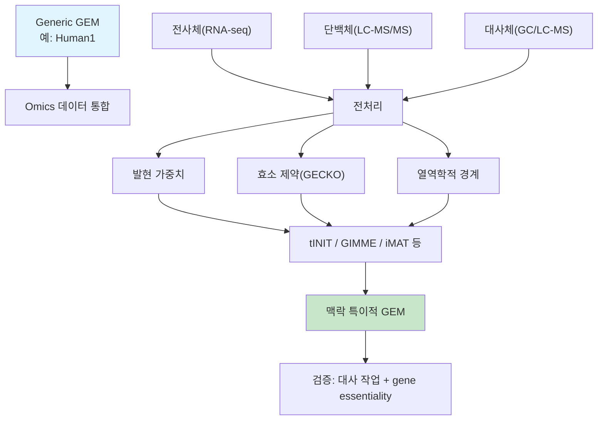

# 6. 다중 오믹스 통합 전략과 한계

지금까지 우리는 전사체(2~4절)와 단백질체·대사체(5절)를 각각 따로 살펴보았습니다. 그런데 실제 세포는 이 세 층위가 동시에, 서로 영향을 주고받으며 작동합니다. 이 절에서는 "여러 오믹스를 함께 쓰면 정말 더 좋은가?"라는 질문에 답하고, 그 답이 "그렇다, 그러나"로 끝나는 이유 — 즉 다중 오믹스 통합의 근본적 한계 — 를 짚습니다.

## 6.1 통합 프레임워크 비교

이 그림에서 눈여겨볼 점은, 세 가지 오믹스(C, E, F)가 각각 독립적인 "증거의 경로"(G, H, I)를 거쳐 최종적으로 J 단계에서 **하나로 합쳐진다**는 것입니다. 전사체는 발현 가중치(G)로, 단백질체는 효소 제약(H)으로, 대사체는 열역학적 경계(I)로 서로 다른 수학적 형태를 취하지만, 모두 같은 목적지 — 맥락 특이적 서브네트워크(K) — 를 향합니다.

| 프레임워크 | 통합 데이터 | 방법론 | 특징 |
|---|---|---|---|
| **tINIT** | 전사체+단백체+대사체 | MILP | 대사 작업 기반 완전성 보장 |
| **GIM3E** | 전사체+대사체 | MILP | 열역학적 제약과 결합 |
| **ME-Model** | 전사체+단백체 | QP | 발현 + 열역학 동시 고려 |
| **MOMENT** | 단백체(GECKO 간소화) | LP | 효소 제약만 반영, 계산 간단 |

## 6.2 시너지 효과

왜 굳이 여러 오믹스를 동시에 쓰려고 할까요? 답은 각 오믹스가 서로 다른 "질문"에 답하기 때문입니다 — 전사체는 "무엇을 만들 준비를 하고 있는가", 단백질체는 "실제로 무엇이 만들어졌는가", 대사체는 "그 결과 무엇이 쌓였는가"를 각각 알려줍니다. 한 종류의 데이터만으로는 이 셋 중 하나의 질문에만 답할 수 있지만, 여러 종류를 함께 쓰면 그 사이의 "간극"을 직접 관찰할 수 있습니다.

| 데이터 조합 | 시너지 효과 |
|---|---|
| 전사체 + 단백체 | "발현된 mRNA" 대 "실제 존재하는 단백질"의 괴리(전사 후 조절)를 포착 |
| 전사체 + 대사체 | 경로 flux와 대사물질 축적·고갈의 일치 여부 검증 |
| 단백체 + 대사체 | 효소 용량과 대사 산물 생성량의 정량적 연결 |
| 세 가지 모두 | 가장 현실적인 세포 상태 재현, 그러나 데이터 요구량·계산 비용 최대 |


❓ **잠깐, 생각해보기:** 전사체만 이용한 맥락 특이적 모델(GIMME)과 전사체+단백질체를 모두 이용한 모델(GECKO를 결합한 확장) 중 어느 쪽이 "항상" 더 정확할까요? — 정답은 "항상 그렇지는 않다"입니다. 단백질체 데이터의 커버리지(측정 가능한 단백질 수)가 낮거나, kcat 값의 출처가 불확실하다면 오히려 추가된 제약이 잡음을 더할 수 있습니다. 다중 오믹스 통합은 "데이터를 더 많이 쓸수록 무조건 좋아진다"는 뜻이 아니라, "각 데이터의 품질과 커버리지를 함께 고려해야 한다"는 뜻입니다.


## 6.3 다중 오믹스 통합의 근본적 한계

여러 오믹스를 합치는 것이 항상 이득이라면 이 책의 모든 사례가 세 오믹스를 전부 사용했을 것입니다. 실제로는 다음과 같은 근본적인 이유들 때문에 다중 오믹스 통합에는 명확한 한계가 있습니다.

1. **전사체-단백체-표현형 간 불일치**: mRNA 발현이 높다고 해서 단백질이 반드시 많거나 효소 활성이 높은 것은 아닙니다(번역 효율, 단백질 반감기, 번역 후 변형의 영향). 전사체만으로 통합한 모델은 이 "발현-활성 역설(transcriptomics paradox)"을 완전히 해소하지 못합니다. 5.1절의 GECKO 손 계산에서 보았듯, mRNA가 풍부해도 실제 효소량(그리고 그 kcat)이 병목이라면 반응은 여전히 느리게 진행될 수 있습니다.
2. **데이터 유형 간 시간 규모 불일치**: 전사체는 분~시간 단위로, 대사체는 초 단위로 변화합니다. 서로 다른 시점에 측정된 데이터를 하나의 정적(steady-state) 모델에 통합하는 것은 본질적으로 근사입니다. 비유하자면, 아침에 찍은 사진(전사체)과 저녁에 찍은 사진(대사체)을 겹쳐서 "지금 이 순간의 초상화"라고 부르는 것과 비슷한 근사가 발생합니다.
3. **측정척도의 비대칭**: TPM은 고정합 상대량이고, 단백질체·대사체는 platform별 검출한계·결측·상대/절대 정량 방식이 다릅니다. 서로 다른 단위와 불확실성을 하나의 반응 가중치로 합칠 때 calibration이 필요합니다.
4. **배치 효과와 플랫폼 간 이질성**: 서로 다른 실험실·플랫폼에서 생산된 다중 오믹스 데이터를 하나의 모델에 통합하려면 배치 효과 보정이 선행되어야 하며, 이는 그 자체로 오차의 원천이 됩니다.
5. **인과관계 대 상관관계**: 발현과 flux의 상관관계가 있다고 해서 발현 변화가 flux 변화의 원인이라는 보장은 없습니다. 특히 알로스테릭 조절(allosteric regulation)이나 대사물질 되먹임(feedback)처럼 오믹스 데이터로 포착되지 않는 조절 기전이 존재합니다.
6. **희소성(sparsity)과 결측치**: 특히 단백질체·대사체 데이터는 측정 가능한 분자 수가 제한적이어서, GEM 전체 반응 중 극히 일부만 직접적인 실험 증거를 갖습니다. 나머지는 여전히 전사체 기반 추정이나 GPR 매핑에 의존합니다.

이러한 한계 때문에, 통합된 맥락 특이적 모델은 연구에서 정의한 **공통·조직 특이적 대사 작업의 개별 통과 여부**, 독립적인 유전자 필수성·교환 flux·대사체 자료 같은 지표로 검증해야 합니다([Chapter 5](../chapter-5/README.md) 참고). tINIT 원 연구의 56개 공통 작업은 중요한 출발점이지만, 모든 조직·배지·질병에 그대로 적용되는 보편적 합격표는 아닙니다.


💡 **이 장을 마치며 스스로 확인:** 위 여섯 가지 한계 중 어느 것이 "데이터 품질"의 문제이고 어느 것이 "생물학 자체의 본질적 성격"(예: 시간 규모 차이, 조절 기전)의 문제인지 구분해 보십시오. 전자는 더 나은 실험·전처리로 개선할 여지가 있지만, 후자는 아무리 데이터가 완벽해도 정적(steady-state) 모델이라는 틀 자체의 한계로 남습니다.


---
