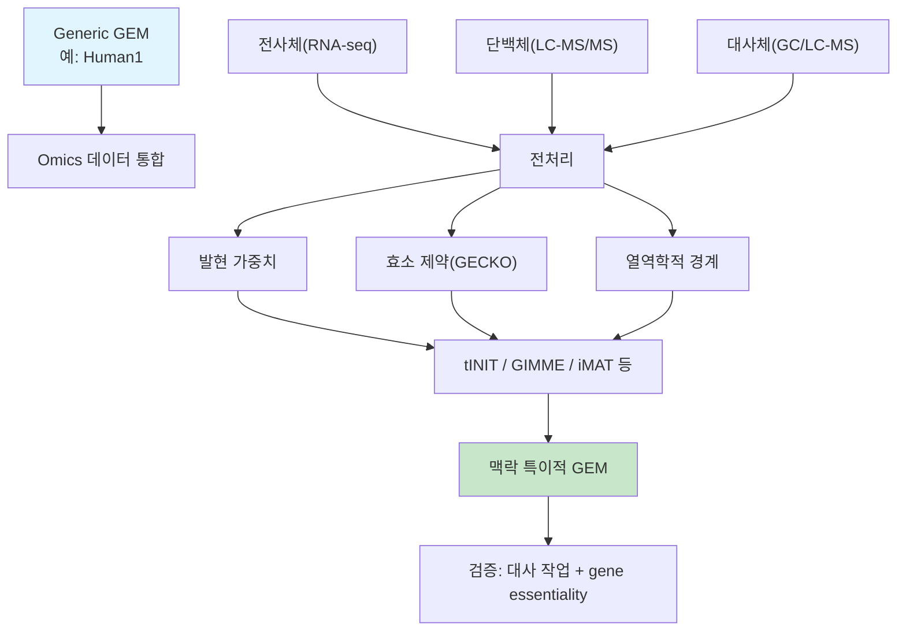

# 6. 다중 오믹스 통합 전략과 한계

## 6.1 통합 프레임워크 비교

| 프레임워크 | 통합 데이터 | 방법론 | 특징 |
|---|---|---|---|
| **tINIT** | 전사체+단백체+대사체 | MILP | 대사 작업 기반 완전성 보장 |
| **GIM3E** | 전사체+대사체 | MILP | 열역학적 제약과 결합 |
| **ME-Model** | 전사체+단백체 | QP | 발현 + 열역학 동시 고려 |
| **MOMENT** | 단백체(GECKO 간소화) | LP | 효소 제약만 반영, 계산 간단 |

## 6.2 시너지 효과

| 데이터 조합 | 시너지 효과 |
|---|---|
| 전사체 + 단백체 | "발현된 mRNA" 대 "실제 존재하는 단백질"의 괴리(전사 후 조절)를 포착 |
| 전사체 + 대사체 | 경로 flux와 대사물질 축적·고갈의 일치 여부 검증 |
| 단백체 + 대사체 | 효소 용량과 대사 산물 생성량의 정량적 연결 |
| 세 가지 모두 | 가장 현실적인 세포 상태 재현, 그러나 데이터 요구량·계산 비용 최대 |

## 6.3 다중 오믹스 통합의 근본적 한계

1. **전사체-단백체-표현형 간 불일치**: mRNA 발현이 높다고 해서 단백질이 반드시 많거나 효소 활성이 높은 것은 아닙니다(번역 효율, 단백질 반감기, 번역 후 변형의 영향). 전사체만으로 통합한 모델은 이 "발현-활성 역설(transcriptomics paradox)"을 완전히 해소하지 못합니다.
2. **데이터 유형 간 시간 규모 불일치**: 전사체는 분~시간 단위로, 대사체는 초 단위로 변화합니다. 서로 다른 시점에 측정된 데이터를 하나의 정적(steady-state) 모델에 통합하는 것은 본질적으로 근사입니다.
3. **측정척도의 비대칭**: TPM은 고정합 상대량이고, 단백질체·대사체는 platform별 검출한계·결측·상대/절대 정량 방식이 다릅니다. 서로 다른 단위와 불확실성을 하나의 반응 가중치로 합칠 때 calibration이 필요합니다.
4. **배치 효과와 플랫폼 간 이질성**: 서로 다른 실험실·플랫폼에서 생산된 다중 오믹스 데이터를 하나의 모델에 통합하려면 배치 효과 보정이 선행되어야 하며, 이는 그 자체로 오차의 원천이 됩니다.
5. **인과관계 대 상관관계**: 발현과 flux의 상관관계가 있다고 해서 발현 변화가 flux 변화의 원인이라는 보장은 없습니다. 특히 알로스테릭 조절(allosteric regulation)이나 대사물질 되먹임(feedback)처럼 오믹스 데이터로 포착되지 않는 조절 기전이 존재합니다.
6. **희소성(sparsity)과 결측치**: 특히 단백질체·대사체 데이터는 측정 가능한 분자 수가 제한적이어서, GEM 전체 반응 중 극히 일부만 직접적인 실험 증거를 갖습니다. 나머지는 여전히 전사체 기반 추정이나 GPR 매핑에 의존합니다.

이러한 한계 때문에, 통합된 맥락 특이적 모델은 연구에서 정의한 **공통·조직 특이적 대사 작업의 개별 통과 여부**, 독립적인 유전자 필수성·교환 flux·대사체 자료 같은 지표로 검증해야 합니다([Chapter 5](../chapter-5/README.md) 참고). tINIT 원 연구의 56개 공통 작업은 중요한 출발점이지만, 모든 조직·배지·질병에 그대로 적용되는 보편적 합격표는 아닙니다.

---
