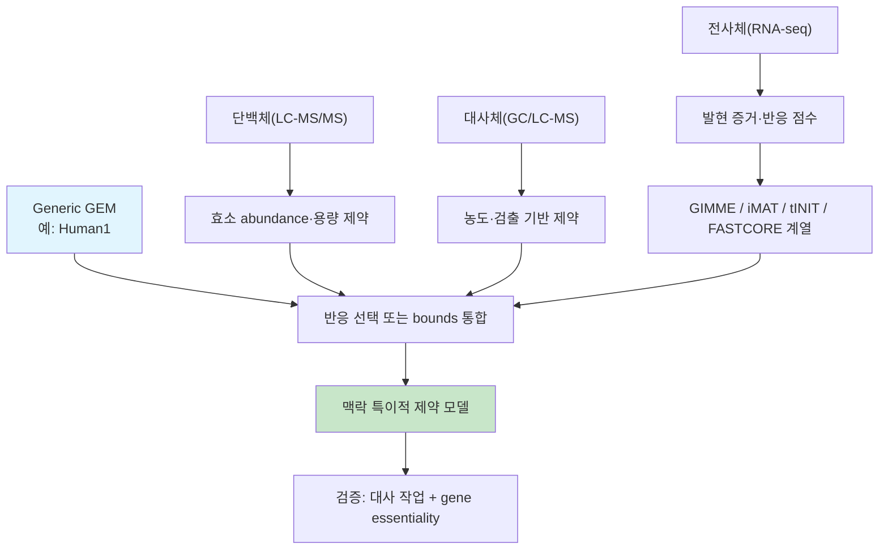

# 6. 다중 오믹스 통합 전략과 한계

전사체, 단백질체와 대사체는 서로 다른 측정 척도와 시간 범위를 갖습니다. 이 절은 각 자료가 어떤 수학적 제약으로 변환되는지와 결합할 때 추가되는 불확실성을 구분합니다.

## 6.1 통합 프레임워크 비교

전사체는 반응 선택 점수, 단백질체는 효소 용량, 대사체는 농도 범위 또는 turnover 요구로 변환될 수 있습니다. 이 자료들이 항상 하나의 추출 알고리즘으로 합쳐지는 것은 아닙니다. 반응 집합은 그대로 두고 bounds만 강화한 constraint-augmented model도 맥락 특이적 모델입니다.

| 프레임워크 | 통합 데이터 | 방법론 | 특징 |
|---|---|---|---|
| **tINIT** | 전사체+단백체+대사체 | MILP | 지정한 대사 작업의 feasibility를 강제 |
| **GIM3E** | 전사체+검출 대사체 | LP/MILP 구현 | 발현 penalty와 검출 대사물 turnover 요구; 열역학 방법은 아님 |
| **ME-model** | 대사·전사·번역·복합체 형성의 기계론적 정보 | growth-rate에 대한 quasiconvex 문제; 고정 $$\mu$$에서 연속 LP | 발현 기계와 단백질 희석을 명시하며, 측정 전사체·단백질체가 필수 입력인 QP가 아님 |
| **MOMENT/GECKO 계열** | 효소 abundance·분자량·촉매율 | LP 계열 | 대사 flux와 효소 용량을 결합 |

GIM3E의 대사체 제약은 검출 대사물의 최소 turnover를 요구하고 전사체 penalty를 최소화합니다([Schmidt et al., 2013](https://doi.org/10.1093/bioinformatics/btt493)). ME-model은 전사·번역·tRNA charging과 복합체 형성을 대사와 연결하며, 성장률 $$\mu$$가 coupling coefficient에 들어가므로 보통 bisection으로 연속 LP를 반복합니다([Lloyd et al., 2018](https://doi.org/10.1371/journal.pcbi.1006302)).

## 6.2 시너지 효과

여러 오믹스는 서로 다른 층의 제약을 제공하므로 한 자료만 사용할 때보다 모순과 결측을 드러낼 수 있습니다. 다만 추가 자료가 실행가능 공간을 줄인다는 사실이 예측 정확도 향상을 보장하지는 않습니다.

| 데이터 조합 | 시너지 효과 |
|---|---|
| 전사체 + 단백체 | "발현된 mRNA" 대 "실제 존재하는 단백질"의 괴리(전사 후 조절)를 포착 |
| 전사체 + 대사체 | 발현 증거와 검출·농도 기반 feasibility/열역학 제약의 일관성 평가 |
| 단백체 + 대사체 | 효소 용량 제약과 농도·방향성 제약의 동시 적용; flux를 직접 측정하는 것은 아님 |
| 세 가지 모두 | 더 제한된 가설 공간을 만들 수 있으나 결측·batch·시간 불일치도 함께 증가 |


**해석상의 주의:** 단백질체 coverage가 낮거나 $$k_{cat}$$이 다른 생물·조건에서 대체되면 추가 제약이 오히려 잘못된 false-negative capability를 만들 수 있습니다. 모델 성능은 독립 자료로 비교해야 합니다.


## 6.3 다중 오믹스 통합의 근본적 한계

다중 오믹스 통합의 제약은 측정 오차뿐 아니라 생물학적 시간 규모와 모델 구조에서도 발생합니다.

1. **전사체-단백체-표현형 간 불일치**: mRNA 발현이 높다고 해서 단백질이 반드시 많거나 효소 활성이 높은 것은 아닙니다(번역 효율, 단백질 반감기, 번역 후 변형의 영향). 전사체만으로 통합한 모델은 이 "전사체-효소 활성의 불일치(transcriptomics paradox)"을 완전히 해소하지 못합니다. 5.1절의 GECKO 손 계산에서 보았듯, mRNA가 풍부해도 실제 효소량(그리고 그 kcat)이 병목이라면 반응은 여전히 느리게 진행될 수 있습니다.
2. **데이터 유형 간 시간 규모 불일치**: 전사체, 단백질체와 대사체는 서로 다른 동역학과 반감기를 가지므로 서로 다른 시점의 자료를 하나의 정적 정상상태 모델에 결합하면 시간 불일치가 생깁니다. 채취 시점과 perturbation 이후 경과 시간을 맞추거나 시점별 모델을 따로 구성해야 합니다.
3. **측정척도의 비대칭**: TPM은 고정합 상대량이고, 단백질체·대사체는 platform별 검출한계·결측·상대/절대 정량 방식이 다릅니다. 서로 다른 단위와 불확실성을 하나의 반응 가중치로 합칠 때 calibration이 필요합니다.
4. **배치 효과와 플랫폼 간 이질성**: 서로 다른 실험실·플랫폼에서 생산된 다중 오믹스 데이터를 하나의 모델에 통합하려면 배치 효과 보정이 선행되어야 하며, 이는 그 자체로 오차의 원천이 됩니다.
5. **인과관계 대 상관관계**: 발현과 flux의 상관관계가 있다고 해서 발현 변화가 flux 변화의 원인이라는 보장은 없습니다. 특히 알로스테릭 조절(allosteric regulation)이나 대사물질 되먹임(feedback)처럼 오믹스 데이터로 포착되지 않는 조절 기전이 존재합니다.
6. **희소성(sparsity)과 결측치**: 특히 단백질체·대사체 데이터는 측정 가능한 분자 수가 제한적이어서, GEM 전체 반응 중 극히 일부만 직접적인 실험 증거를 갖습니다. 나머지는 여전히 전사체 기반 추정이나 GPR 매핑에 의존합니다.

이러한 한계 때문에, 통합된 맥락 특이적 모델은 연구에서 정의한 **공통·조직 특이적 대사 작업의 개별 통과 여부**, 독립적인 유전자 필수성·교환 flux·대사체 자료 같은 지표로 검증해야 합니다([Chapter 5](../chapter-5/README.md) 참고). tINIT 원 연구의 56개 공통 작업은 중요한 출발점이지만, 모든 조직·배지·질병에 그대로 적용되는 보편적 합격표는 아닙니다.


**점검 질문:** 위 여섯 가지 한계 가운데 측정·전처리 개선으로 줄일 수 있는 문제와 정적 정상상태 모델 자체에 남는 문제를 구분해 보십시오. 시간 불일치와 미측정 조절은 데이터가 정밀해져도 별도의 동적·조절 모델 없이는 완전히 해소되지 않습니다.


---
