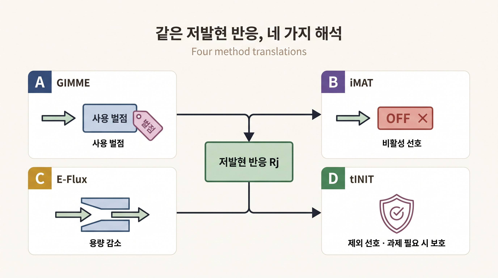
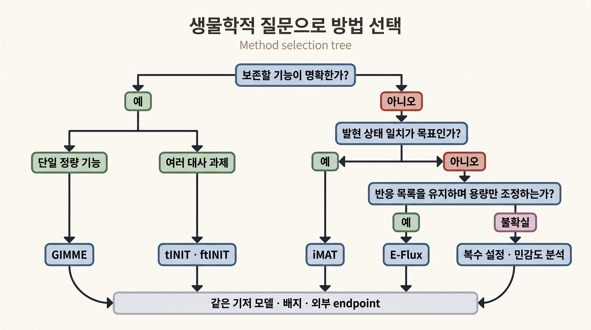

# 7. GIMME·iMAT·E-Flux·tINIT 비교

발현 자료를 반응 수준의 증거로 바꾼 뒤에도 하나의 맥락 특이 모델이 자동으로 결정되지는 않는다. GIMME, iMAT, E-Flux와 tINIT은 같은 RAS를 서로 다른 계산 객체로 사용한다. 비교의 핵심은 수학적 형식의 이름보다 **어떤 생물학적 기능을 먼저 정하고, 낮은 발현을 벌점·비활성 선호·용량 감소·반응 제외 가운데 무엇으로 해석하는가**에 있다.

## 7.1 네 방법은 서로 다른 질문에 답한다

| 방법 | RAS의 사용 방식 | 보호하는 생물학적 기준 | 결과 해석 |
|:---|:---|:---|:---|
| [GIMME](../landmark-papers.md) | 임계값 아래 반응의 flux에 벌점 | 지정 목적의 최소 수준 | 요구 기능을 유지하면서 저발현 반응 사용이 적은 상태 |
| [iMAT](../landmark-papers.md) | high·moderate·low 범주 | 발현 상태와 반응 활성의 일치 | 발현 분류와 가장 많이 일치하는 활성 패턴 |
| E-Flux | 연속 발현에 비례해 반응 bounds 축소 | 후속 FBA 목적과 배지 | 발현으로 제한된 반응 용량 범위 |
| [tINIT](../landmark-papers.md) | 반응 포함의 양·음 증거 | 명시한 대사 과제 | 증거를 선호하며 기능을 보존한 반응 부분집합 |

GIMME와 E-Flux는 보통 연속적인 flux 값을 다루고, iMAT과 tINIT은 반응의 활성 또는 포함 여부도 함께 선택한다. 구현에 따라 서로 다른 최적화 도구가 필요하지만, 계산 형식의 이름이 생물학적 정확도를 뜻하지는 않는다. 이 절에서는 내부 알고리듬보다 입력한 발현 증거와 보호 기능이 결과에 어떻게 반영되는지를 비교한다.


비증식 세포에서 biomass 최대화를 기본 기능으로 두면 알고리즘 차이보다 잘못된 생물학적 목적이 결과를 지배할 수 있다. 유지해야 할 대사 과제, 분비 또는 에너지 요구를 먼저 정의한다.


## 7.2 GIMME는 기능 하한과 저발현 벌점을 분리한다

GIMME는 두 단계로 해석한다([Becker and Palsson, 2008](https://doi.org/10.1371/journal.pcbi.1000082)).

1. 기준 모델과 조건에서 요구 기능의 최적값 $$Z^*$$를 계산한다.
2. 기능을 $$fZ^*$$ 이상 유지하면서 저발현 반응 사용의 가중 벌점을 최소화한다.

예를 들어 $$f=0.9$$이면 기능을 정확히 90%로 고정하는 것이 아니라 기준 최적값의 90% 이상을 요구한다. 그 범위 안에서 발현 근거가 낮은 반응을 덜 사용하는 상태를 선호한다. 낮은 발현 반응도 기능 유지에 필요하면 양의 flux를 가질 수 있다.

직접 경로와 저발현 우회 경로가 같은 산물을 만든다고 하자. 직접 경로 용량만으로 기능 하한을 충족하면 GIMME는 우회 경로 사용을 줄인다. 반대로 직접 경로 상한이 낮으면 벌점이 있더라도 우회 경로를 사용한다. 따라서 GIMME의 저발현 분류는 차단 규칙이 아니라 기능과 경쟁하는 비용이다.

## 7.3 iMAT은 발현 상태와 활성 상태의 일치를 최대화한다

iMAT은 반응을 high·moderate·low로 나눈다([Zur et al., 2010](https://doi.org/10.1093/bioinformatics/btq602)).

- high 반응은 유의한 정·역방향 flux를 갖는 상태를 선호한다.
- low 반응은 비활성 상태를 선호한다.
- moderate 반응은 일치 점수에 직접 보상되지 않지만 경로 연결에 사용될 수 있다.

목적은 high 반응의 활성 판정과 low 반응의 비활성 판정을 가능한 많이 만족하는 것이다. iMAT은 biomass 같은 별도의 생물학적 flux 목적이 없어도 실행할 수 있지만, 발현–활성 일치라는 계산 목적은 명확히 가진다.

활성 판정에는 “이 값 이상이면 반응이 사용되었다고 본다”는 최소 flux 기준과 반응별 허용 범위가 필요하다. 기준이 너무 작으면 수치 잡음을 활성으로 셀 수 있고, 너무 크면 약하지만 필요한 경로를 비활성으로 오판할 수 있다. 따라서 독자는 내부 연결식을 유도하기보다 사용한 최소 flux 기준, 반응 경계, solver 상태와 민감도 분석이 보고되었는지 확인하면 된다.

## 7.4 E-Flux는 발현을 반응 용량의 상한으로 사용한다

E-Flux는 정규화된 발현 점수 $$E_j\in[0,1]$$에 비례해 반응의 허용 용량을 축소한다([Colijn et al., 2009](https://doi.org/10.1371/journal.pcbi.1000489)).

$$
u_j'=E_j u_j
$$

가역 반응은 정·역방향 경계를 각각 스케일링한다. 예를 들어 원래 상한이 20이고 $$E_j$$가 0.9, 0.4, 0.05라면 새 상한은 각각 18, 8, 1이다. 이 값은 실제 flux가 아니라 넘어설 수 없는 용량이다.

E-Flux는 high·low 이산 임계값을 요구하지 않지만, 발현 정규화와 스케일링 기준에 민감하다. 또한 bounds만으로 하나의 대표 flux 벡터가 정해지지 않는다. 성장·산물 생산 같은 후속 목적과 tie-break를 별도로 기록한다. 발현과 효소 용량의 선형 비례도 검증해야 하는 가정이다.

## 7.5 tINIT은 반응 선택에 기능 시험을 결합한다

tINIT은 반응 증거 가중치를 최적화하면서 미리 정한 대사 과제를 보존한다. GIMME처럼 하나의 목적 flux 하한을 두는 것이 아니라, 여러 조직 기능을 개별 대사 과제로 정의하고 추출 전후에 다시 시험한다. 세부 구축 순서와 ftINIT mode는 [5절](05.md)에서 다뤘다.

같은 저발현 반응도 방법에 따라 의미가 달라진다.

- GIMME에서는 사용하면 비용이 드는 반응이다.
- iMAT에서는 비활성일 때 일치 점수를 받는 반응이다.
- E-Flux에서는 최대 허용 용량이 작은 반응이다.
- tINIT에서는 음의 포함 증거가 될 수 있지만 보호 과제에 필요하면 남는 반응이다.

_그림 6.13:_ 같은 저발현 반응을 네 통합법이 해석하는 방식. GIMME는 사용에 벌점을 주고, iMAT은 비활성 상태에 일치 점수를 주며, E-Flux는 허용 용량을 줄이고, tINIT은 제외를 선호하되 보호 대사 과제에 필요하면 반응을 남긴다. 어느 방법도 낮은 발현을 flux 0의 직접 관측으로 취급하지 않는다. 실제 solver 결과가 아닌 방법 비교 모식도이다. 저자 작성; 개념 근거: [Becker and Palsson (2008)](https://doi.org/10.1371/journal.pcbi.1000082), [Zur et al. (2010)](https://doi.org/10.1093/bioinformatics/btq602), [Colijn et al. (2009)](https://doi.org/10.1371/journal.pcbi.1000489), [Agren et al. (2014)](https://doi.org/10.1002/msb.145122).

이 차이 때문에 네 방법의 결과를 반응 수만으로 비교할 수 없다.

## 7.6 공정한 비교는 입력과 검증 endpoint를 고정한다

| 비교 요소 | 고정하거나 함께 보고할 항목 |
|:---|:---|
| 기저 모델 | release, 파일 checksum, 반응·GPR 변환 |
| 생물학적 조건 | 배지, 산소, 교환 bounds, 증식·비증식 기능 |
| 발현 입력 | 표본, 정규화, ID 매핑, 결측과 임계값 |
| 방법 설정 | 구현 버전, 기능 유지 비율·활성 기준·bounds scaling·대사 과제 |
| 계산 | solver, tolerance, timeout, 종료 상태 |
| 내부 검사 | 대사 과제, flux consistency, 에너지 생성 순환 |
| 외부 평가 | 구축에 쓰지 않은 유전자 의존성·교환 flux·기능 자료 |

같은 template·입력·배지·평가 분할에서 비교하지 않으면 알고리즘 효과와 데이터·조건 차이를 분리할 수 없다. 실패한 표본이나 infeasible model을 제외하고 성공 사례만 비교하면 성능이 과대평가된다.

## 7.7 상황별 선택 기준

| 분석 상황 | 우선 검토할 방법 | 선택 이유와 추가 확인 |
|:---|:---|:---|
| 요구 기능의 정량 하한이 분명함 | GIMME | 기능 하한과 저발현 벌점을 분리하고 tie-break 확인 |
| 적절한 단일 기능 목적이 불분명함 | iMAT | 발현 일치를 사용하되 발현 임계값과 최소 활성 기준의 민감도 평가 |
| 반응 목록을 유지하며 용량만 조정함 | E-Flux | 연속 스케일을 쓰되 후속 목적과 선형 비례 가정 검증 |
| 여러 조직 기능을 반드시 보존함 | tINIT·ftINIT | 과제 파일과 저지지 반응 복원 근거를 함께 배포 |
| 방법 선택 자체가 불확실함 | 다중 설정 합의와 민감도 분석 | 공통 반응·공통 예측과 불일치 원인을 함께 보고 |

_그림 6.14:_ 생물학적 질문에 따른 맥락 통합법 선택 흐름. 단일 정량 기능 하한은 GIMME, 여러 대사 과제 보존은 tINIT·ftINIT, 발현 상태 일치는 iMAT, 반응 목록을 유지한 용량 조정은 E-Flux의 우선 검토 대상이 된다. 선택이 불확실하면 복수 설정을 같은 기저 모델·배지·외부 endpoint에서 비교한다. 성능 순위를 나타내지 않는 교육용 의사결정 모식도이다. 저자 작성; 개념 근거: [Opdam et al. (2017)](https://doi.org/10.1016/j.cels.2017.01.010), [Richelle et al. (2019)](https://doi.org/10.1371/journal.pcbi.1006867).

어느 단일 방법도 생물학적 정확성을 자동으로 보장하지 않는다. 최종 선택은 모델 크기나 계산 속도보다 연구 질문에 필요한 기능, 오류 비용과 독립 검증 자료의 종류에 맞춰야 한다.

---
