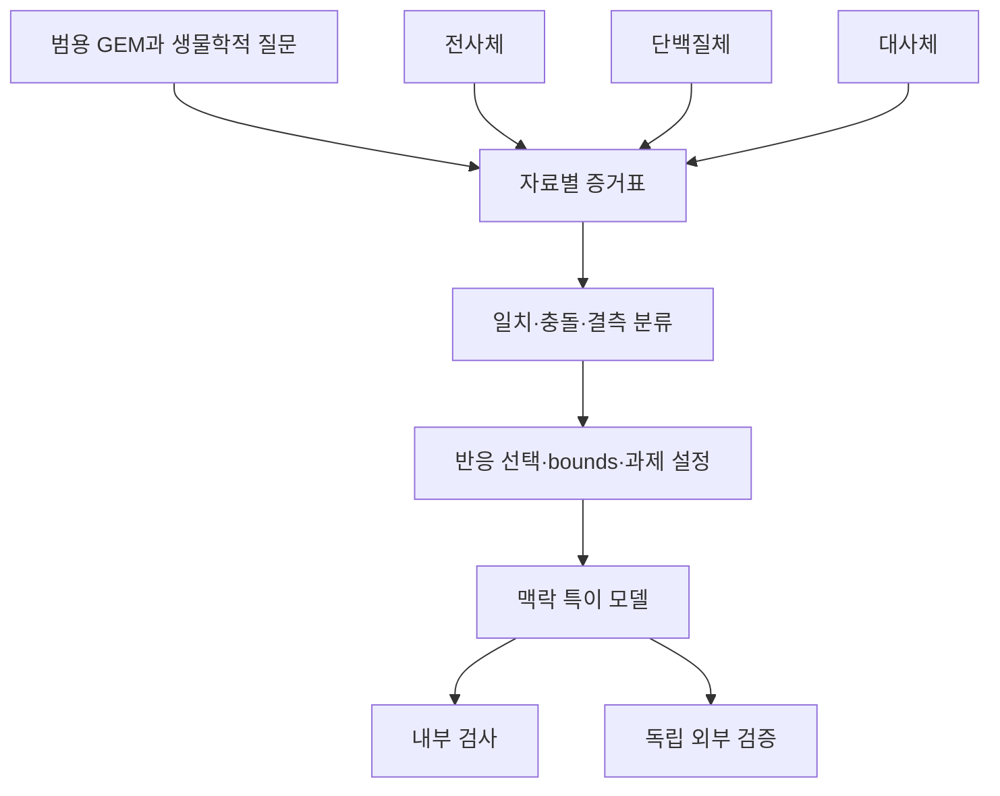
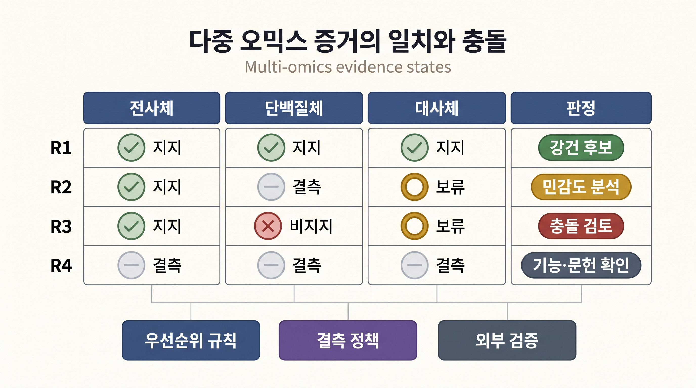

# 9. 다중 오믹스 전략과 한계

전사체, 단백질체와 대사체는 서로 다른 분자 층과 시간척도를 측정한다. 다중 오믹스 통합의 목적은 모든 값을 하나의 점수로 압축하는 데 있지 않다. 각 자료가 지지하거나 반박하는 모델 판단을 구분하고, 충돌·결측·시간 불일치를 드러낸 뒤 독립 자료로 검증하는 데 있다. 이 절은 자료별 세부 제약식이 아니라 통합 의사결정과 한계를 다룬다.

## 9.1 자료 층을 먼저 분리한다

_그림 6.17:_ 다중 오믹스 증거를 맥락 특이 모델 판단으로 연결하는 순서. 각 자료를 즉시 합산하지 않고 반응별 일치·충돌·결측을 먼저 분류한 뒤 선택 규칙과 기능 과제에 반영한다. 내부 검사는 구축 요구와의 일치를, 외부 검증은 사용하지 않은 생물학적 자료와의 일치를 평가한다. 실제 GEM 계산 결과가 아닌 교육용 Mermaid 모식도이다. 저자 작성; 개념 근거: [Agren et al. (2014)](https://doi.org/10.1002/msb.145122), [Opdam et al. (2017)](https://doi.org/10.1016/j.cels.2017.01.010), [Richelle et al. (2019)](https://doi.org/10.1371/journal.pcbi.1006867).

자료별 증거는 같은 의미를 갖지 않는다.

| 자료 | 직접 관측하는 층 | 모델에 주는 대표 근거 | 단독으로 결론 낼 수 없는 것 |
|:---|:---|:---|:---|
| 전사체 | RNA abundance | GPR 기반 반응 지지 점수 | 효소 활성과 실제 flux |
| 단백질체 | 검출된 단백질 abundance | 효소 존재·복합체의 추가 근거 | 촉매 상태와 포화도 |
| 대사체 | pool의 상대·절대 abundance 또는 검출 | 대사물 존재·조건 일치의 보조 근거 | 생성 경로의 유일성·순생산 flux |
| 교환·동위원소 자료 | 경계 또는 일부 내부 flux | 독립 검증과 조건 제약 | 측정하지 않은 전 네트워크 flux |

추가 자료가 있다는 이유만으로 제약을 더 강하게 만들지 않는다. 표본·시점·구획과 정량 단위가 맞지 않는 자료는 모델을 정교화하기보다 잘못된 배제를 늘릴 수 있다.

## 9.2 통합 전략은 충돌 처리 규칙까지 포함한다

다중 오믹스 전략은 다음 네 요소를 사전에 정의한다.

1. **공통 분석 단위:** 같은 표본·donor·시점과 세포 유형을 연결한다.
2. **자료별 신뢰도:** 검출한계, 결측, ID·구획 매핑과 측정 불확실성을 기록한다.
3. **충돌 정책:** 한 자료가 반응을 지지하고 다른 자료가 지지하지 않을 때 우선순위·보류·민감도 분석 가운데 무엇을 적용할지 정한다.
4. **검증 분할:** 구축에 사용할 자료와 성능 평가에 남겨 둘 자료를 분리한다.

| 반응별 증거 상태 | 권장 처리 |
|:---|:---|
| 여러 자료가 일관되게 지지 | 포함 선호의 강건성 후보로 표시하되 실제 flux로 단정하지 않음 |
| 전사체만 지지 | 번역·단백질 반감기·측정 결측을 점검하고 설정 민감도에 포함 |
| 단백질체만 지지 | 안정 단백질·RNA 시점 차이·GPR 매핑을 점검 |
| 자료가 서로 충돌 | 자동 우선순위보다 보류 또는 복수 설정 비교 |
| 모든 자료에서 결측 | 0으로 치환하지 않고 기능·문헌·네트워크 근거를 별도 표시 |

_그림 6.18:_ 반응별 다중 오믹스 증거의 일치·충돌·결측 분류. 여러 자료가 일관되게 지지하는 반응은 강건 후보로 표시하고, 일부 자료 결측은 민감도 분석, 자료 간 반대 신호는 충돌 검토, 모든 자료 결측은 기능·문헌 확인으로 보낸다. 이 판정은 flux의 직접 관측이나 자료별 보편 우선순위를 뜻하지 않는다. 무단위 교육용 모식도이다. 저자 작성; 개념 근거: [Agren et al. (2014)](https://doi.org/10.1002/msb.145122), [Richelle et al. (2019)](https://doi.org/10.1371/journal.pcbi.1006867).

이 표의 목적은 어떤 자료가 항상 우월하다고 정하는 것이 아니다. 충돌이 최종 모델에 어떤 영향을 주었는지 추적 가능하게 만드는 것이다.

## 9.3 다중 오믹스가 추가하는 한계

1. **분자 층의 불일치:** RNA, 단백질, 효소 활성과 flux 사이에는 번역, 분해, 복합체 조립과 조절 단계가 있다.
2. **시간 불일치:** 서로 다른 채취 시점의 자료를 하나의 정적 모델에 결합하면 원인과 반응의 순서를 잃는다.
3. **세포 조성:** 벌크 조직의 RNA·단백질·대사물 신호는 서로 다른 세포 유형의 혼합일 수 있다.
4. **측정척도:** 고정합 상대량, 상대 abundance와 절대 농도는 직접 합산할 수 없다.
5. **구획 불확실성:** 검출된 분자가 어느 소기관 또는 세포 유형에 있는지 불분명할 수 있다.
6. **결측의 비무작위성:** 낮은 abundance, 펩타이드 성질과 플랫폼 범위 때문에 결측이 무작위로 발생하지 않는다.
7. **인과 해석의 제한:** 여러 층의 상관이 일치해도 조절 원인이나 치료 효과가 증명되지는 않는다.

자료가 많아질수록 모델이 반드시 좋아지는 것이 아니라, 정합화해야 할 가정과 실패 지점도 늘어난다. 따라서 단일 통합 결과보다 자료 조합·우선순위·임계값을 바꾼 민감도 분석이 더 유용할 수 있다.

## 9.4 검증은 생물학적 질문별로 설계한다

| 연구 질문 | 내부 검사 | 독립 외부 검증의 예 |
|:---|:---|:---|
| 조직 기능 보존 | 지정 대사 과제 통과 | 조직별 분비·흡수 또는 기능 실험 |
| 유전자 취약성 | GPR·결손 계산의 일관성 | 동일 배지·세포주의 CRISPR 의존성 |
| 대사 교환 | 경계 반응·배지 부호 확인 | 배양액 uptake·secretion |
| 질환 생체표지자 | 질환 모사 설정과 방향 판정 | 사용하지 않은 임상·세포 자료 |
| 표본 간 차이 | 같은 기저 모델·알고리즘 적용 | 독립 코호트 재현 |

대사 과제 통과는 입력한 기능 정의와 일치한다는 뜻이고, 독립 자료의 예측 성능을 대신하지 않는다. 반대로 외부 자료와 불일치하면 모델만이 아니라 표본 매칭, 배지, 시간과 endpoint 정의도 함께 점검한다.


다중 오믹스 통합 결과는 자료를 많이 사용했다는 이유만으로 강한 증거가 되지 않는다. 표본·시점·세포 유형을 맞추고, 충돌 정책과 결측 처리를 공개하며, 구축에 쓰지 않은 자료로 검증해야 한다.


질병 맥락의 계산·실험 유전자 취약성 비교는 [Chapter 9 §3](../chapter-9/03.md), 미생물 교란 가정의 비교는 [Chapter 4 §13](../chapter-4/13.md), 생산–성장 포락선의 재현 실습은 [Chapter 10 §11](../chapter-10/11.md)에서 이어진다.

---
