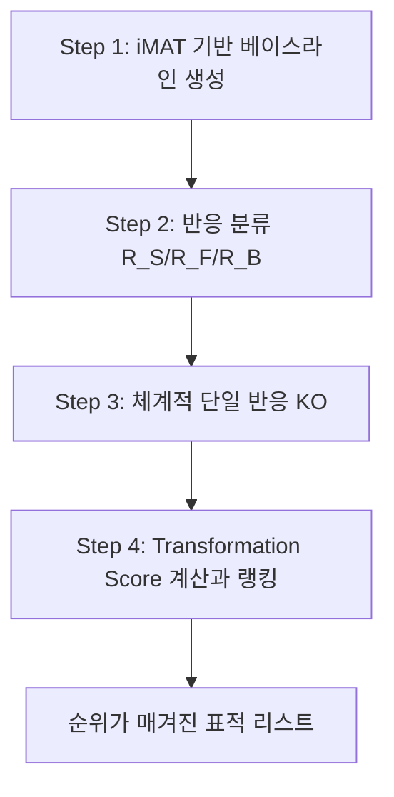

# Chapter 7. 질병 모델링과 약물 표적 발굴

> 질병은 유전자 하나의 고장이 아니라 **대사 네트워크 전체의 재편성(reprogramming)**으로 나타날 수 있습니다. 이 장에서는 Warburg 효과와 온코대사물부터 유전자 필수성, 합성 치사, source-target 발현 차이를 이용하는 **MTA(Metabolic Transformation Algorithm)**까지 다룹니다. 계산 결과는 치료 효과의 증명이 아니라 실험할 표적 가설의 우선순위입니다.


이 장은 유전자 결손 뒤의 기준 flux와 목적함수를 구분해야 합니다. 먼저 [유전자 교란, MOMA와 ROOM](supplements/perturbation-analysis.md)을 읽고 FBA·MOMA·ROOM이 서로 다른 질문에 답한다는 점을 확인하십시오.


---

## 이 장을 시작하며

항암 화학요법을 받는 환자는 머리카락이 빠지고, 구토를 하고, 백혈구 수치가 떨어집니다. 왜일까요? 답은 간단합니다 — 대부분의 항암제는 "빠르게 자라는 세포"를 공격하도록 설계되었는데, 암세포만 빠르게 자라는 것이 아니라 모낭 세포, 위장관 점막 세포, 골수의 조혈모세포도 빠르게 자라기 때문입니다. 즉 우리는 지난 수십 년간 "**암세포와 정상 세포를 화학적으로 구별하지 못한 채** 더 세게 죽이는" 방식으로 암과 싸워왔습니다.

그런데 만약 암세포와 정상 세포의 **대사(metabolism)** 자체가 다르다면 어떨까요? 암세포만 유별나게 의존하는 대사 경로가 있다면, 그 경로 하나만 정확히 막아서 정상 세포는 건드리지 않고 암세포만 굶길 수 있지 않을까요? 그리고 한 걸음 더 나아가서 — 당뇨병이나 지방간처럼 "죽여야 할 세포"가 애초에 없는 질환에서는, 아예 "세포를 죽이지 않고 대사를 고쳐주는" 치료가 가능하지 않을까요?

[Chapter 6](chapter-6.-omics.md)에서 우리는 RNA-seq 발현 데이터를 GEM에 통합해 **맥락 특이적 모델**을 만드는 방법을 배웠습니다. 이 장에서는 암 모델과 대응 정상 모델의 KO 효과 차이를 비교하고(§1~§5), MTA로 source 상태를 target이 시사하는 방향으로 옮길 후보를 순위화합니다(§6~§7). 어느 방법도 암 특이성·안전성·건강 회복을 자동 보장하지 않으므로 독립 실험과 정상 조직 패널 검증이 필요합니다.

---

## 학습 목표 (Learning Objectives)

이 장을 마치면 다음을 수행할 수 있습니다:

1. **암 세포의 대사 재프로그래밍을 설명할 수 있다.** Warburg 효과, 암의 6대 대사 특성(Hallmarks of Cancer Metabolism), 온코대사물(2-HG, succinate, fumarate)의 발생 메커니즘과 대사 모델에서의 표현 방법을 이해합니다.
2. **당뇨병·NAFLD·노화 등 비암성 질환의 대사 재프로그래밍을 이해한다.** 인슐린 저항성, 세린 결핍, 미토콘드리아 기능 저하가 각각 어떻게 대사 네트워크 수준의 변화로 나타나는지 설명합니다.
3. **유전자 필수성(essentiality) 분석을 약물 표적 발굴 관점에서 해석할 수 있다.** 단일 유전자 KO의 상대 성장률과 전구체 생산 작업을 구분하고, 암-정상 쌍에서 조건부 선택성을 평가할 수 있습니다.
4. **합성 치사(synthetic lethality) 상호작용을 대사 네트워크에서 검출할 수 있다.** PARP-BRCA 고전 사례를 이해하고, 이중 유전자 KO·Bliss 독립성 모델·gMCS 접근법을 적용할 수 있습니다.
5. **DepMap CRISPR 데이터를 이용해 예측을 검증할 수 있다.** CERES 보정, ROC-AUC/PR-AUC 계산, 알려진 약물 표적과의 enrichment 분석을 수행합니다.
6. **MTA의 가정과 출력을 설명할 수 있다.** 기준 flux 최소조정법과 source-target 변화 방향을 이용한 MIQP/TS 순위화를 구분하고, MTA 결과가 건강 회복을 보장하지 않는 이유를 설명합니다.
7. **개인화 GEM의 질병 응용을 방법별로 구분할 수 있다.** PRIME·tINIT/FBA·MTA/rMTA 사례를 같은 “MTA 응용”으로 뭉뚱그리지 않고, 각 사례의 입력·목적함수·검증 수준을 평가합니다.

---

## 1. 질병은 대사 재프로그래밍이다

### 1.1 대사 재프로그래밍의 개념과 질병 스펙트럼

> **핵심 개념·용어(English):** 대사 재프로그래밍(Metabolic Reprogramming) — 세포가 내외부 신호에 반응하여 에너지 생성 및 생합성 전구체 공급 방식을 체계적으로 바꾸는 현상. 단순한 대사 속도 변화가 아니라 **대사 네트워크의 토폴로지와 플럭스 분포 자체가 질적으로 달라지는 것**을 의미합니다.

공장에 비유해 봅시다. 정상적으로 운영되는 공장은 원자재(포도당)를 가장 효율적인 생산 라인(산화적 인산화, oxidative phosphorylation, OXPHOS)에 투입하여 최대한 많은 완제품(ATP)을 뽑아냅니다. 그런데 이 공장이 갑자기 "완제품 수량"보다 "부품(생합성 전구체)의 다양성과 생산 속도"를 더 중시하는 방향으로 생산 라인을 통째로 바꾼다면 어떨까요? 겉보기엔 비효율적인 결정 같지만, 이 공장이 "지금 당장 많이, 빠르게 증식해야 하는" 특수한 상황(암세포의 무한 증식)에 놓여 있다면 오히려 합리적인 선택일 수 있습니다. 이것이 바로 대사 재프로그래밍입니다.

정상 세포는 주로 미토콘드리아의 OXPHOS를 통해 포도당 1분자당 약 30~32 ATP를 효율적으로 생산합니다. 그러나 질병 상태의 세포는 이 "효율적인" 대사 방식을 버리고 다른 경로를 활성화합니다. 이는 암에 국한된 현상이 아니라, 당뇨병·비알코올성 지방간질환(NAFLD)·노화·감염 질환에 이르는 폭넓은 스펙트럼에서 공통으로 관찰됩니다.

| 특징 | 설명 | 대표 예시 |
|------|------|----------|
| 에너지 생성 방식의 변화 | ATP 생산 경로의 전환 | OXPHOS → 글리콜라이시스 (Warburg 효과) |
| 생합성 전구체의 재분배 | 핵산·지방산·아미노산 합성 균형 변화 | 펜토스 인산 경로(PPP) 활성화 |
| 산화-환원 균형의 붕괴 | ROS 생성과 항산화 체계의 불균형 | NADPH/NADP+ 비율 변화 |
| 미토콘드리아 기능 변화 | mtDNA 돌연변이, 막 전위 저하 | Complex I/III 활성 저하 (노화) |

대사 재프로그래밍은 질병의 "원인"인 동시에 "결과"입니다. 유전자 변이와 신호 전달 이상이 재프로그래밍을 유발하고, 재프로그래밍된 대사 상태가 다시 증식·사멸 회피·면역 회피를 촉진하는 **악순환(vicious cycle)**을 형성합니다.


❓ **잠깐, 생각해보기:** 만약 재프로그래밍이 "원인"인 동시에 "결과"라면, 재프로그래밍을 유발한 최초의 유전자 돌연변이만 고치면 대사도 저절로 정상으로 돌아올까요?

반드시 그렇지는 않습니다. 일단 대사 네트워크가 재편성되고 나면(예: 해당 경로 관련 효소 발현이 안정적으로 상향조절되고, 미토콘드리아 활성이 위축되고, 세포가 그 상태에 "적응"하고 나면), 원인 돌연변이 하나를 되돌려도 네트워크 전체가 자동으로 원상복구되지 않을 수 있습니다. 악순환의 고리가 여러 지점에서 서로를 강화하기 때문입니다. 이것이 바로 §6에서 소개할 **대사 정상화(Metabolic Restoration)** 패러다임 — "원인을 없애는" 대신 "현재의 재프로그래밍된 상태 자체를 표적으로 되돌리는" 접근이 필요한 이유입니다.


이 장에서 다루는 표적 발굴 전략들은 결국 이 악순환의 어느 지점을 끊을 것인가에 대한 체계적 탐색입니다.

### 1.2 암의 대사 재프로그래밍: Warburg 효과

1920년대 Otto Warburg는 암 세포가 산소가 충분한 조건에서도 OXPHOS 대신 글리콜라이시스(glycolysis)를 선호적으로 사용한다는 현상을 발견했습니다. 이를 **Warburg 효과(Warburg effect)** 또는 **호기성 글리콜라이시스(aerobic glycolysis)**라 부릅니다.

$$
\text{포도당} + 6\text{O}_2 + 30\text{ADP} + 30\text{P}_i \rightarrow 6\text{CO}_2 + 6\text{H}_2\text{O} + 30\text{ATP} \quad \text{(정상 세포)}
$$

$$
\text{포도당} + 2\text{ADP} + 2\text{P}_i \rightarrow 2\text{젖산} + 2\text{ATP} \quad \text{(Warburg 효과 암 세포)}
$$

숫자만 보면 암세포의 선택은 어리석어 보입니다. 포도당 한 분자에서 뽑아낼 수 있는 ATP가 30개에서 2개로, 무려 15분의 1로 줄어드니까요. 비유하자면 정상 세포는 "연비가 뛰어난 하이브리드 엔진"을 쓰고, 암세포는 "연료를 물 쓰듯 쓰지만 순간 가속이 압도적으로 빠른 레이싱카 엔진"을 쓰는 셈입니다. 그런데 지금 이 세포에게 가장 중요한 목표가 "연료를 아끼는 것"이 아니라 "최대한 빨리, 최대한 많이 자기 복제를 하는 것"이라면, 레이싱카 엔진이 오히려 합리적인 선택이 됩니다. 암세포가 이 "비효율적인" 경로를 선택하는 이유는 다음과 같습니다.

1. **생합성 전구체 공급**: 글리콜라이시스 중간대사산물(3-인산글리세르산, 글루코스-6-인산 등)이 핵산·아미노산·지질 합성의 탄소 골격을 제공합니다. 특히 펜토스 인산 경로(PPP)가 활성화되어 리보스-5-인산(핵산 전구체)과 NADPH(항산화·지방산 합성 환원력)가 풍부해집니다.
2. **활성산소종(ROS) 감소**: 미토콘드리아 전자전달계 의존도를 낮춰 ROS 생성을 줄이고 DNA 손상에 의한 세포 사멸을 회피합니다.
3. **빠른 ATP 생산 속도**: 단위 시간당 ATP 생성률이 OXPHOS보다 약 100배 빠릅니다 — 레이싱카가 연비는 나쁘지만 순간 가속은 압도적으로 빠른 것과 같습니다.
4. **종양 미세환경 산성화**: 젖산 축적으로 주변 pH가 낮아져(6.5~6.9) 면역세포 침윤을 억제하고 침윤·전이를 촉진합니다.


❓ **흔한 오해:** "암세포는 Warburg 효과 때문에 미토콘드리아를 아예 쓰지 않는다"는 말을 자주 듣습니다. 사실일까요?

아닙니다. 최근 연구들은 암세포가 미토콘드리아를 완전히 버리는 것이 아니라 그 **역할을 재편성(repurpose)**한다는 것을 보여줍니다. TCA 회로가 ATP 생산 공장으로서의 역할은 줄이지만, 그 중간대사산물(시트르산, α-KG 등)을 세포질로 내보내 아미노산·지질 합성의 원료로 쓰는 "생합성 지원 공장"으로 그 쓰임새를 바꾸는 것에 가깝습니다. "미토콘드리아를 끄는 것"이 아니라 "미토콘드리아의 용도를 에너지 생산에서 부품 공급으로 바꾸는 것"이 더 정확한 설명입니다.


**Warburg 효과의 주요 조절자:**

| 조절자 | 역할 | 대표 표적 유전자 |
|--------|------|----------------|
| c-MYC | 전사 인자 | GLUT1, HK2, LDHA, PKM2 |
| HIF-1α | 저산소 반응 인자 | PDK1(PDH 억제), BNIP3 |
| p53 (돌연변이 시) | 종양억제유전자 | TIGAR, SCO2 |
| PI3K/AKT/mTOR | 신호 전달 경로 | HK2, PFK1, mTORC1 |
| LKB1/AMPK | 에너지 감응 경로 | 정상: TSC1/2 경유 mTORC1 억제 → 암에서는 이 억제 경로 자체가 불활성화 |

글루타민 용해(glutaminolysis) 역시 중요한 재프로그래밍입니다. 암 세포는 글루타민을 α-ketoglutarate(α-KG)로 전환하여 TCA 회로의 보충물(anaplerosis)로 사용하며, MYC에 의해 글루타미나제(GLS)가 상향조절되어 이 경로가 강화됩니다.


❓ **잠깐, 생각해보기:** Warburg 효과의 핵심이 "포도당을 많이 쓰는 것"이라면, 암세포로 가는 포도당 공급을 차단하면 암이 다 나을까요?

안타깝게도 그렇게 단순하지 않습니다. 방금 배운 글루타민 용해가 그 이유를 잘 보여줍니다 — 암세포는 포도당 외에도 글루타민을 주요 탄소원으로 사용할 수 있는 **대안 경로(bypass pathway)**를 갖추고 있습니다. 포도당 공급을 막으면 상당수 암세포는 글루타민 의존도를 더욱 높여 생존을 이어갑니다. 이것이 바로 [Chapter 1](chapter-1..md)에서 배운 대사 네트워크의 **중복성(redundancy)**이 암세포에서도 그대로 작동하는 사례이며, §4에서 다룰 **합성 치사(synthetic lethality)** — 하나의 경로만이 아니라 두 개의 대안 경로를 동시에 막아야 하는 전략 — 가 필요한 이유이기도 합니다.


**Warburg 효과의 정량화 — ATP Flux Ratio (AFR):** Yizhak et al. (2014)은 GEM 상에서 Warburg 효과의 정도를 정량화하기 위해 AFR을 제안했습니다.

$$AFR = \frac{Glycolytic\ ATP\ flux}{Oxidative\ ATP\ flux}$$

AFR이 높을수록 글리콜라이시스 의존도가 높은 세포주이며, NCI-60 세포주 패널 분석에서 AFR은 세포 이동성(migration)과 양의 상관관계, 증식률과는 음의 상관관계를 보였습니다(§5.3 참고).

간단한 손 계산으로 감을 잡아 봅시다. 어떤 맥락 특이적 모델을 FBA로 풀었더니 PGK(포스포글리세르산 키네이스) 플럭스가 12, PYK(피루베이트 키나아제) 플럭스가 8, 그리고 미토콘드리아 ATP synthase(ATPS4m) 플럭스가 7이 나왔다고 합시다.

$$AFR = \frac{12+8}{7} = \frac{20}{7} \approx 2.86$$

AFR이 1보다 훨씬 크다는 것은 이 세포가 산화적 인산화보다 글리콜라이시스에 훨씬 더 많이 의존한다는 뜻이며, 강한 Warburg 표현형을 시사합니다.

```python
# AFR 손 계산을 그대로 재현하는 실행 가능한 최소 예제
pgk_flux = 12.0
pyk_flux = 8.0
atp_synthase_flux = 7.0

glycolytic_atp_flux = pgk_flux + pyk_flux
oxphos_atp_flux = atp_synthase_flux
if oxphos_atp_flux <= 0:
    raise ValueError("산화적 ATP flux가 0 이하이면 AFR을 정의할 수 없습니다.")

afr = glycolytic_atp_flux / oxphos_atp_flux
print(f"ATP Flux Ratio (AFR): {afr:.3f}")
# 예상 출력: ATP Flux Ratio (AFR): 2.857
```

실제 맥락 특이적 Human-GEM에 적용할 때는 먼저 모델 파일을 준비하고, 해당 버전에서 PGK·PYK·ATP synthase에 대응하는 **정확한 반응 ID와 방향**을 확인해야 합니다. `Human-GEM.xml`은 이 저장소에 포함된 파일명이 아니며, 모델마다 `PGK`, `PYK`, `ATPS4m`이라는 ID를 그대로 쓴다고 가정할 수 없습니다. 또한 위 합은 교육용 단순화이므로, 원 논문의 AFR 정의와 모델의 ATP-producing reaction 집합을 맞춘 뒤 계산하십시오.

### 1.3 암의 6대 대사 특성 (Hallmarks of Cancer Metabolism)

Hanahan과 Weinberg의 "암의 특성(Hallmarks of Cancer)"을 바탕으로, Pereira et al. (2023)은 암 대사에 특화된 6가지 핵심 특성을 정리했습니다. 이는 GEM에서 각 특성을 어떻게 정량화·모델링할 수 있는지 보여줍니다.

| 번호 | 대사 특성 | 핵심 반응/경로 | 관련 유전자 | 모델링 접근법 |
|:---:|----------|--------------|------------|-------------|
| 1 | 증식 신호 자급 | 성장인자 수용체 구성적 활성화 | EGFR, HER2 | 관련 반응 강제 활성화 |
| 2 | 증식 억제 불감 | 세포주기 억제자 비활성화 | p53, RB1 | 세포주기 관련 대사 요구량 변화 |
| 3 | 조절되지 않는 증식 | 높은 생합성 유속 | mTOR, MYC | 생물량 반응 최대화 목적함수 |
| 4 | 어포토시스 회피 | 미토콘드리아 세포사멸 경로 억제 | BCL-2, BAX | ROS/항산화 반응 모델링 |
| 5 | 지속적 혈관신생 | 혈관형성 인자 과발현 | VEGF, HIF-1α | 저산소 조건 하 대사 모델링 |
| 6 | 침윤 및 전이 활성 | 세포골격 재구성 | EMT 관련 유전자 | 이동성 관련 대사 요구량 변화 |

저산소(hypoxic) 조건 모델링이 특히 중요합니다. HIF-1α 활성화는 PKM2 발현 증가(글리콜라이시스 중간산물 축적), PDK1 활성화(PDH 억제 → TCA 회로 축소), LDHA 발현 증가(피루베이트→젖산 전환)를 유도하며, 모델에서는 해당 반응들의 상한(upper bound)을 조절하거나 관련 유전자를 KO하여 이를 재현합니다.

### 1.4 온코대사물 (Oncometabolites): 2-HG, Succinate, Fumarate

> **핵심 개념·용어(English):** 온코대사물(Oncometabolite) — 원래는 정상 대사에 필요하지만 비정상적으로 축적되면 신호전달 경로를 왜곡시켜 암을 촉진하는 대사산물.

세 가지 대사 효소 돌연변이가 "**Krebs cycle oncogene / TCA cycle tumor suppressor**"로 불리며, 공통적으로 α-ketoglutarate(α-KG) 유사체를 축적시켜 α-KG 의존성 효소(TET 탈메틸화효소, 히스톤 탈메틸화효소, prolyl hydroxylase 등)를 경쟁적으로 억제합니다. 열쇠(α-KG)로 열리는 자물쇠(탈메틸화효소의 활성 부위)에, 생김새는 비슷하지만 실제로는 열 수 없는 **가짜 열쇠**를 꽂아 넣는 셈입니다. 자물쇠 구멍이 가짜 열쇠로 막혀버리면 진짜 열쇠(α-KG)가 들어갈 자리가 없어지고, 그 결과 DNA·히스톤 탈메틸화라는 "문을 여는" 작업 자체가 멈춰버립니다.

| 효소 | 돌연변이 유형 | 축적 대사물 | 관련 암 | 핵심 기전 |
|------|-------------|-----------|--------|----------|
| **IDH1/IDH2** | 기능 획득(neomorphic) | 2-HG (2-hydroxyglutarate) | AML(~20%), 저등급 신경교종(~70-80%) | α-KG→2-HG 네오몰픽 반응, TET·히스톤탈메틸화효소 억제 → DNA 과메틸화 |
| **SDH** (A/B/C/D) | 기능 상실 | Succinate | 부신수질종/부신경절종 | PHD 억제 → HIF-1α 안정화 → 의사저산소(pseudohypoxia) |
| **FH** | 기능 상실 | Fumarate | 자궁근종증/신세포암(HLRCC) | 단백질 석시니에이션(succination) → KEAP1-NRF2 활성화 |

IDH1의 R132H 돌연변이는 정상적인 이소시트르산→α-KG 반응에 더해 α-KG를 D-2-HG로 환원하는 "네오몰픽" 활성을 획득합니다. 모델에서는 이 신규 반응뿐 아니라 **2-HG가 빠져나갈 경계 반응**도 필요합니다. 정상상태 조건 $$Sv=0$$에서 2-HG의 소비·분비 경로가 없으면 새 반응의 flux는 자동으로 0이 되기 때문입니다. 정상 IDH flux를 50%로 줄이는 아래 설정은 교육용 가정이며, 실제 분석에서는 유전자형·효소 활성·분비율 자료로 보정해야 합니다.

```python
def integrate_idh1_mutation(model, mutation_type='R132H'):
    """IDH1 R132H 돌연변이를 대사 모델에 통합"""
    mutant_model = model.copy()

    if mutation_type == 'R132H':
        # 1. 정상 IDH1 반응의 유속 감소 (heterozygous loss-of-function, ~50%)
        idh1_rxn = mutant_model.reactions.get_by_id('IDH1')
        idh1_rxn.upper_bound *= 0.5
        idh1_rxn.lower_bound *= 0.5

        # 2. 네오몰픽 반응 추가: akg_c + nadph_c + h_c -> 2hglc__D_c + nadp_c
        from cobra import Reaction, Metabolite
        hglc_d = Metabolite(id='2hglc__D_c', formula='C5H6O5',
                             charge=-2, name='D-2-Hydroxyglutarate', compartment='c')
        idh1_neo = Reaction('IDH1_R132H_2HG')
        idh1_neo.add_metabolites({
            mutant_model.metabolites.akg_c: -1.0,
            mutant_model.metabolites.nadph_c: -1.0,
            mutant_model.metabolites.h_c: -1.0,
            hglc_d: 1.0,
            mutant_model.metabolites.nadp_c: 1.0
        })
        idh1_neo.bounds = (0, 1000)  # 비가역 반응
        mutant_model.add_reactions([idh1_neo])

        # 3. 정상상태에서 2-HG 생산 flux가 0으로 강제되지 않도록 배출 경계 추가
        # 실제 연구에서는 세포외 구획으로의 수송+교환 반응을 명시하는 편이 더 좋다.
        mutant_model.add_boundary(
            hglc_d, type='demand', reaction_id='DM_2hglc__D_c', ub=1000
        )

    return mutant_model

# mutant_model = integrate_idh1_mutation(model, 'R132H')
# solution = mutant_model.optimize()
# print(f"돌연변이 모델 생물량: {solution.objective_value:.4f}")
# print(f"2-HG 생성/배출: {solution.fluxes['IDH1_R132H_2HG']:.4f}, "
#       f"{solution.fluxes['DM_2hglc__D_c']:.4f}")
```


biomass만 최대화하면 2-HG 생산이 성장에 이득이 없는 한 여전히 0일 수 있습니다. 돌연변이 표현형을 재현하려면 측정된 2-HG 분비율로 경계를 고정하거나, 최소 생산 제약을 두고 그 값에 대한 성장률·NADPH 비용의 민감도를 보고해야 합니다. “반응을 추가했다”와 “그 반응에 flux가 흐른다”는 서로 다른 주장입니다.


SDH·FH 돌연변이는 해당 반응의 하한·상한을 0으로 설정하여 유속을 완전히 차단하는 방식으로 모델링합니다.


❓ **잠깐, 생각해보기:** IDH1/IDH2, SDH, FH는 모두 결국 "α-KG 유사체를 쌓아 탈메틸화효소를 억제한다"는 같은 결과에 도달합니다. 그런데 왜 IDH는 "기능 획득(gain-of-function)", SDH·FH는 "기능 상실(loss-of-function)"이라는 정반대 방식으로 작동할까요?

IDH1/2는 원래 없던 새로운 반응(α-KG→2-HG, 네오몰픽 활성)을 "추가로 얻는" 돌연변이입니다. 이들 종양에서는 돌연변이와 정상 대립유전자가 함께 남아 있는 경우가 흔해 정상 IDH 기능과 2-HG 생성이 공존합니다. 그러나 이 변이 하나만으로 모든 암 표현형이 충분히 설명된다는 뜻은 아닙니다. 반면 SDH·FH는 원래 하던 반응(석시네이트→푸마르산, 푸마르산→말산)을 "못 하게 되는" 돌연변이이며, 그 결과로 기질(석시네이트, 푸마르산)이 쌓이는 것입니다. 서로 다른 분자적 경로(신규 획득 vs. 기능 상실)를 거치지만, 최종적으로는 같은 하류 표적(α-KG 의존 효소)에 수렴한다는 점이 흥미로운 **수렴적 진화(convergent evolution)**의 예입니다. 대사 모델에서는 이 차이를 각각 "반응 용량 변화 + 신규 반응 추가"(IDH)와 "반응 flux 차단"(SDH/FH)이라는 서로 다른 제약으로 구현합니다.


이러한 돌연변이 통합은 이후 §3, §4의 KO 시뮬레이션·합성 치사 분석의 전처리 단계로도 활용됩니다.

### 1.5 대사 이질성과 "길들이기(Taming)" 전략

같은 종양 안에서도 모든 세포가 똑같은 방식으로 재프로그래밍되어 있는 것은 아닙니다. 종양 중심부(저산소)와 가장자리(정상 산소), 혈관에 가까운 영역(포도당 풍부)과 먼 영역(영양 결핍), 빠르게 분열하는 세포와 휴지기(quiescent) 암 줄기세포 사이에는 상당한 **대사 이질성(metabolic heterogeneity)**이 존재합니다. 따라서 "이 암종의 대사는 이렇다"는 단일 모델보다, 여러 하위 영역·하위유형을 반영한 다중 모델 접근이 더 현실적인 경우가 많습니다(§5.1의 HCC 하위유형 사례 참고).

이와 관련해 최근에는 암 대사를 완전히 차단하기보다 **"길들이는(taming)"** 접근이 함께 논의됩니다. 증식 자체를 막는 대신, 침윤·전이 능력만 선택적으로 억제하는 **반-이동성(anti-migratory) 표적**을 찾는 전략입니다. §5.3에서 다룰 17개의 반-이동성 표적 예측과 13개의 실험적 검증 사례가 대표적입니다 — 세포를 죽이지 않으면서 "덜 위험하게" 만드는 이 접근은, §6에서 본격적으로 다룰 대사 정상화(고치기) 철학의 예고편이라 할 수 있습니다.

### 1.6 다른 질환의 대사 재프로그래밍: 당뇨병·NAFLD·노화

암 이외의 질환에서도 유사한 재프로그래밍 원리가 적용됩니다. 이 사례들은 §6~§7에서 상태 변환법과 개인화 GEM의 서로 다른 질병 응용으로 다시 등장합니다.

**제2형 당뇨병(T2D) — 인슐린 저항성:** 인슐린 수용체 기질(IRS-1/2)의 세린 인산화 이상으로 PI3K/AKT 경로 활성화가 저해되어 GLUT4 세포막 이입이 감소합니다. Bordbar et al. (2011)은 간·지방·골격근을 통합한 전신 대사 모델로 이러한 조직 간 상호작용을 분석했습니다.

| 조직 | 건강 상태 | T2D 상태 | 병태생리적 의의 |
|------|----------|----------|----------------|
| 간(Liver) | 인슐린이 당신생합성 억제 | 당신생합성 과활성화, 포도당 출력 증가 | 공복 혈당 상승의 주요 원인 |
| 지방(Adipose) | 인슐린이 지방분해 억제 | 지방분해(lipolysis) 증가, FFA 방출 증가 | 간지방증·인슐린 저항성 악화 |
| 골격근(Muscle) | 인슐린 의존적 포도당 흡수 | GLUT4 이입 저하, 포도당 흡수 감소 | 식후 혈당 상승의 주요 원인 |

지방 조직에서 방출된 유리지방산(FFA)이 간·근육의 인슐린 저항성을 다시 악화시키는 **Randle cycle**이라는 악순환이 이 세 조직 사이에서 형성됩니다.

**NAFLD(비알코올성 지방간질환) — 세린 결핍:** Mardinoglu et al. (2014)의 **iHepatocytes2322** 모델(유전자 2,322개, 대사물질 5,686개, 반응 7,930개)은 NASH(지방간염) 환자에서 세린 합성 경로(Serine Synthesis Pathway, SSP) 효소(PHGDH, PSAT1, PSPH, SHMT1/2)의 발현 감소와 혈장 세린 농도 15% 감소를 발견했습니다.

```
3-인산글리세르산(3PG) --PHGDH--> 3-포스포하이드록시피루베이트 --PSAT1--> 3-포스포세린 --PSPH--> 세린
                                                                       글리신 --SHMT1/2--> 세린
세린 ──▶ 인지질(포스파티딜세린) 합성
세린 ──▶ One-carbon 대사(DNA 메틸화, 핵산 합성)
세린 ──▶ 글루타티온 합성(항산화 방어)
```

세린은 인지질 합성, one-carbon 대사(DNA 메틸화), 글루타티온 합성의 전구체이므로 그 결핍은 광범위한 대사 이상을 유발합니다.

**노화 — 미토콘드리아 기능 저하:** 미토콘드리아 DNA 돌연변이 축적과 Complex I/III 활성 저하, NAD+ 감소(Sirtuin 활성 저하), mTOR 경로 과활성화가 특징입니다. NAD+ 감소는 DNA 복구에 관여하는 PARP의 과잉 활성과 CD38의 NAD 가수분해 증가에 기인합니다. 칼로리 제한(Caloric Restriction, CR)은 AMPK·SIRT1 활성화와 mTORC1 억제를 통해 이러한 변화를 역전시키는 가장 확립된 개입이며, §7.4에서 다룰 MTA의 최초 검증 사례이기도 합니다.

이처럼 서로 다른 질병들이 공유하는 것은 **"정상 대사 항상성의 붕괴"**라는 공통 패턴입니다. 이 통찰이 §6에서 소개할 대사 정상화 패러다임의 출발점이 됩니다.

---

## 2. 질병 특이적 대사 모델 구축 (개관)

암 표적을 예측하려면 먼저 개별 환자·세포주의 오믹스 데이터를 반영한 **맥락 특이적 모델(context-specific model)**이 필요합니다. [Chapter 5](chapter-5..md)에서 Human-GEM/Recon3D 같은 기저 인간 모델을 구축·검증하는 법을, [Chapter 6](chapter-6.-omics.md)에서 RNA-seq 발현 데이터로 이를 맥락 특이화하는 법을 배웠습니다. 이 절은 그 산출물(암 모델·정상 모델)이 이 장의 입력으로 어떻게 이어지는지 개관하며, 세부 방법론은 해당 장에 위임합니다.

### 2.1 기저 인간 GEM: Human-GEM, Recon3D

맥락 특이적 모델 구축의 출발점은 인간 대사 전체를 포괄하는 **기저 모델(template model)**입니다.

| 속성 | Human-GEM (Human1) | Recon3D |
|------|--------------------|---------|
| 유전자/ORF 수 | 3,625 | 3,288 |
| 반응 수 | 13,417 | reconstruction 13,543; flux-consistent model 10,600 |
| 대사산물 수 | 구획 포함 10,138(고유 4,164) | 고유 4,140; flux-consistent model 구획 포함 5,835 |
| 특징 | GitHub 기반 커뮤니티 큐레이션, RAVEN 형식 | 3D 단백질 구조 통합, VMH 데이터베이스 연계 |

두 모델의 상세 구조와 재구축 원칙은 [Chapter 3](chapter-3.-genome-scale-metabolic-model-gem.md)과 [Chapter 5](chapter-5..md)에서 다룹니다.

### 2.2 맥락 특이적 모델 재구축: Troppo 계열 알고리즘

RNA-seq 발현 데이터를 GPR(Gene-Protein-Reaction) 규칙을 통해 반응 활성 점수(Reaction Activity Score, RAS)로 변환하고, GIMME·tINIT·iMAT·FastCORE·SwiftCore·CORDA 등의 알고리즘(Troppo, RAVEN 프레임워크로 구현)으로 환자·세포주 특이적 모델을 추출하는 과정은 이 책에서 **[Chapter 6. Omics 데이터 통합](chapter-6.-omics.md)**의 핵심 주제입니다. RNA-seq 전처리(counts/TPM/FPKM 정규화, 배치 효과 보정 등) 역시 Chapter 6을 참고하십시오.

이 장(Chapter 7)에서는 이렇게 구축된 암 모델·정상 모델, 그리고 질병/건강 쌍(source/target) 전사체를 **입력으로 주어진 것**으로 가정하고, 이를 활용한 표적 발굴 시뮬레이션(§3~§7)에 집중합니다.

### 2.3 암-정상 쌍별 모델 구축의 의의

항암 표적 예측의 핵심 전제는 **암 모델과 정상 모델을 쌍(pair)으로 구축**해야 한다는 것입니다. 종양 RNA-seq(TCGA, CCLE 등)로 암 모델을, 대응 정상 조직 RNA-seq(TCGA matched normal, GTEx 등)로 정상 모델을 각각 구축한 뒤, 동일한 유전자 KO를 두 모델에 모두 적용하여 비교하는 것이 §3.5의 선택성 필터의 기초가 됩니다.

---

## 3. 필수성 분석 기반 약물 표적 발굴

### 3.1 유전자 필수성에서 약물 표적으로

단일 유전자 결손(single gene deletion)을 통한 필수성(essentiality) 스크리닝의 기본 원리 — GPR 불리언 평가, [FBA](chapter-4.-flux-balance-analysis-fba.md) 기반 KO, 필수/성장감소/비필수 분류, 그리고 이를 보완하는 MOMA/ROOM의 메커니즘 — 은 **[Chapter 8](chapter-8..md)**에서 상세히 다룹니다. 이 절에서는 그 결과를 **"약물 표적 발굴"**의 관점에서 어떻게 해석하고 활용하는지에 집중합니다.

병원성 미생물이나 암 세포에서 필수 유전자를 표적으로 삼는 전략은 다음과 같이 구분됩니다.

- **광범위 표적(broad-spectrum target)**: 여러 암종·병원균에서 공통적으로 필수인 유전자 → 광범위 억제제 후보
- **종 특이적 표적(species/cancer-specific target)**: 특정 암종에서만 필수인 유전자 → 선택적 치료제 후보
- **합성 치사 표적(synthetic lethal target)**: 특정 돌연변이 배경에서만 필수가 되는 유전자 → 부작용이 적은 정밀 표적 (§4에서 상세히 다룸)

### 3.2 항암 표적 예측 6단계 파이프라인

GEM을 활용한 항암 표적 예측은 다음의 체계적인 6단계로 수행됩니다.

```
┌──────────┐   ┌──────────┐   ┌──────────┐   ┌──────────┐   ┌──────────┐   ┌──────────┐
│  Step 1  │ → │  Step 2  │ → │  Step 3  │ → │  Step 4  │ → │  Step 5  │ → │  Step 6  │
│ 데이터   │   │ 모델     │   │ 녹아웃   │   │ 선택성   │   │ 랭킹     │   │ 검증     │
│ 수집     │   │ 구축     │   │ 시뮬     │   │ 필터     │   │ 및 후보  │   │ 및 실험  │
│          │   │          │   │          │   │          │   │ 선정     │   │ 설계     │
└──────────┘   └──────────┘   └──────────┘   └──────────┘   └──────────┘   └──────────┘
 RNA-seq +      맥락 특이적    단일 유전자    암-정상 비교    근거 통합      CRISPR +
 기저 GEM       모델 추출      KO 시뮬레이션   선택성 평가     우선순위      알려진 표적과 비교
                (Ch.6)                                                     (DepMap)
```

- **Step 1 데이터 수집**: 종양·대응 정상 RNA-seq(TCGA, CCLE, GTEx), 기저 인간 GEM
- **Step 2 모델 구축**: Troppo 계열 알고리즘으로 암/정상 맥락 특이적 모델 각각 추출 ([Chapter 6](chapter-6.-omics.md))
- **Step 3 단일 유전자 KO 시뮬레이션**: 모든 대사 유전자에 대해 FBA 또는 MOMA로 생물량 유속 변화 계산 ([Chapter 8](chapter-8..md)의 KO 메커니즘 참고)
- **Step 4 선택성 필터**: 동일 KO를 정상 모델에도 적용하여 암 특이적 치명성 확인
- **Step 5 랭킹**: 상대 성장률·전구체 생산 작업·암-정상 차이·DrugBank 근거를 각각 보존해 다기준 후보 선정
- **Step 6 검증**: DepMap CRISPR 데이터 비교, siRNA/shRNA 실험 설계, 약물 반응성(GI50) 분석

### 3.3 KO 시뮬레이션 결과 랭킹: 상대 성장률과 전구체 생산 작업

단일 유전자 KO의 효과는 야생형 대비 생물량 유속 변화율로 측정됩니다.

$$Growth\ Reduction = \frac{v_{biomass}^{WT} - v_{biomass}^{KO}}{v_{biomass}^{WT}} \times 100\%$$

FBA 기반 KO 외에도, 결손 뒤 대사가 기준 flux에서 최소한으로 재조정된다고 가정하는 **[MOMA](chapter-8..md)**($$\min \sum_i (v_i - v_i^{WT})^2$$)를 사용할 수 있습니다. 어느 방법이 더 정확한지는 측정 시점·적응 정도·기준 flux·평가 데이터에 따라 달라지므로, FBA와 MOMA는 우열 관계가 아니라 서로 다른 생물학적 가설로 비교해야 합니다.

생물량 감소만으로는 어떤 생합성 기능이 병목이 되었는지 알 수 없습니다. 이때는 “Biomass Reduction Score(BRS)” 같은 이름의 임의 가중합을 보편적 표준처럼 쓰기보다, DNA·RNA·단백질·지질 전구체에 각각 demand 반응 또는 대사 작업을 정의하고 WT와 KO의 최대 생산 가능량을 **벡터로 따로 보고**하는 편이 재현 가능합니다.

$$r_{j,k}=\frac{v^{KO_j,*}_{task,k}}{v^{WT,*}_{task,k}}$$

여기서 $$k$$는 특정 전구체 생산 작업입니다. 예를 들어 지질 전구체의 $$r_{j,k}=0$$이고 다른 작업은 1에 가깝다면 “전체 성장 감소”와 별도로 지질 합성 취약성을 확인한 것입니다. 여러 작업을 하나의 순위로 합치고 싶다면 가중치와 정규화 근거를 사전에 선언하고, 가중치 변화에 대한 민감도 분석을 함께 제시해야 합니다.

```python
import cobra
import numpy as np
from cobra.flux_analysis import single_gene_deletion

def calculate_ko_effect(model, gene_id, method='fba'):
    """단일 유전자 KO의 WT 대비 상대 성장률을 계산."""
    wt_solution = model.optimize()
    wt_biomass = wt_solution.objective_value

    ko_result = single_gene_deletion(
        model, gene_list=[gene_id], method=method, processes=1
    )
    ko_biomass = float(ko_result['growth'].iloc[0])
    # infeasible deletion은 COBRApy 결과표에서 None이 아니라 NaN일 수 있다.
    if not np.isfinite(ko_biomass):
        ko_biomass = 0.0

    reduction = (wt_biomass - ko_biomass) / wt_biomass * 100 if wt_biomass > 0 else 0

    return {
        'gene_id': gene_id, 'wt_biomass': wt_biomass, 'ko_biomass': ko_biomass,
        'relative_growth': ko_biomass / wt_biomass if wt_biomass > 0 else float('nan'),
        'reduction_percent': reduction,
        'is_lethal': ko_biomass < 0.01 * wt_biomass
    }

def rank_targets(results_df, top_n=100):
    """자의적 복합 가중치 없이 성장 감소율로 1차 정렬."""
    return results_df.sort_values(
        ['reduction_percent', 'gene_id'], ascending=[False, True]
    ).head(top_n)

# top_targets = rank_targets(results_df, top_n=50)
# print(top_targets[['gene_id', 'relative_growth', 'reduction_percent', 'is_lethal']])
```


💡 **팁:** `is_lethal`의 1% 기준도 관례적 선택입니다. 배지와 목적함수를 고정하고 1%, 5%, 10% 기준에서 순위가 얼마나 바뀌는지 보고하십시오. 전구체 작업은 WT와 KO에서 **각 작업을 같은 목적함수로 다시 최적화**해야 합니다.


### 3.4 경로 수준에서 보기: 어떤 대사 경로가 반복적으로 표적으로 나타나는가

개별 유전자 하나하나를 보는 대신, 유전자를 대사 경로(subsystem) 단위로 묶어 평균 감소율을 계산하면 생물학적 해석이 훨씬 쉬워집니다. 여러 암종에 대한 KO 스크리닝을 반복하면, 다음과 같은 소수의 경로가 항상 상위권에 반복적으로 등장하는 경향이 있습니다.

| 순위 | 대사 경로 | 평균 생물량 감소율(예시) | 필수 유전자 비율(예시) | 임상적 의미 |
|:---:|----------|-----------|---------------|------------|
| 1 | Oxidative Phosphorylation | 78% | 45% | 미토콘드리아 Complex I–V |
| 2 | 글리콜라이시스 | 65% | 30% | 포도당 대사 |
| 3 | 펜토스 인산 경로(PPP) | 58% | 25% | 뉴클리오타이드 합성 |
| 4 | 글루타민 대사 | 55% | 22% | 보충물(anaplerosis) |
| 5 | 지방산 생합성 | 48% | 18% | 세포막 구성 |
| 6 | 콜레스테롤 생합성 | 45% | 15% | HMG-CoA 경로 |
| 7 | 엽산/1-탄소 대사 | 42% | 12% | DNA 메틸화 |
| 8 | 퓨린/피리미딘 합성 | 38% | 10% | DNA/RNA 합성 |

흥미롭게도 1위가 "Warburg 효과의 상징"인 글리콜라이시스가 아니라 산화적 인산화(OXPHOS)라는 점에 주목할 필요가 있습니다. 이는 §1.2의 흔한 오해 hint에서 짚었듯, 암세포가 미토콘드리아를 완전히 버리는 것이 아니라 생합성 지원 기능으로 계속 의존하고 있음을 다시 한번 보여줍니다.

```python
from collections import defaultdict

def pathway_level_target_analysis(model, ko_results, top_n_pathways=10):
    """유전자 단위 KO 결과를 대사 경로(subsystem) 단위로 집계"""
    pathway_genes = defaultdict(list)
    for gene in model.genes:
        for reaction in gene.reactions:
            pathway_genes[reaction.subsystem or 'Unknown'].append(gene.id)

    rows = []
    for pathway, gene_ids in pathway_genes.items():
        subset = ko_results[ko_results['gene_id'].isin(gene_ids)]
        if len(subset) == 0:
            continue
        rows.append({
            'pathway': pathway,
            'n_tested': len(subset),
            'avg_reduction': subset['reduction_percent'].mean(),
            'essential_ratio': subset['is_lethal'].mean()
        })
    return pd.DataFrame(rows).sort_values('avg_reduction', ascending=False).head(top_n_pathways)
```

### 3.5 선택성 필터: 암-정상 특이성과 약물화 가능성

이상적인 항암 표적은 **암 세포에서는 치명적이지만 정상 세포에서는 치명적이지 않은** 유전자입니다.

가장 투명한 1차 요약은 두 효과의 차이입니다.

$$\Delta Selectivity = Growth\ Reduction_{cancer}-Growth\ Reduction_{normal}$$

비율 $$Growth\ Reduction_{cancer}/(Growth\ Reduction_{normal}+\epsilon)$$도 탐색적으로 볼 수 있지만, 정상 효과가 0에 가까우면 $$\epsilon$$ 선택에 따라 값이 폭증합니다. **“10 이상=높음, 2~10=중간” 같은 보편적 임상 임계값은 없습니다.** 암 성장 감소, 정상 성장 감소, 차이와 비율을 함께 보고, 후보 선정 기준은 연구 목적과 독립 검증 자료에 맞춰 사전에 정해야 합니다.

예를 들어 어떤 유전자를 암 모델에서 KO했더니 생물량이 95% 감소했고, 동일한 KO를 정상 모델에 적용했더니 5%만 감소했다고 합시다.

$$\Delta Selectivity=95-5=90\text{ percentage points},\qquad Ratio\approx\frac{95}{5}=19$$

이 후보는 계산상 큰 암-정상 차이를 보이지만, 아래의 정상 모델 범위와 약물화 가능성 검증을 통과하기 전에는 “안전한 표적”으로 부를 수 없습니다.

```python
def calculate_selectivity(cancer_results, normal_results, epsilon=1e-6):
    """암-정상 선택성 지수를 계산하고 선택적 표적을 필터링"""
    merged = cancer_results.merge(
        normal_results[['gene_id', 'reduction_percent']],
        on='gene_id', suffixes=('_cancer', '_normal')
    )
    merged['selectivity_delta'] = (
        merged['reduction_percent_cancer'] - merged['reduction_percent_normal']
    )
    # 정상 효과가 0 이하이면 비율은 수치적으로 정의하지 않고 NaN으로 둔다.
    normal_denominator = merged['reduction_percent_normal'].where(
        merged['reduction_percent_normal'] > epsilon
    )
    merged['selectivity_ratio'] = (
        merged['reduction_percent_cancer'] / normal_denominator
    )
    # 아래 50%는 교육용 1차 스크리닝 값일 뿐 보편적 임상 기준이 아니다.
    return merged[
        merged['reduction_percent_cancer'] > 50
    ].sort_values(['selectivity_delta', 'reduction_percent_cancer'], ascending=False)

# selective_targets = calculate_selectivity(cancer_results, normal_results)
# print(f"선택적 표적 수: {len(selective_targets)}")
```


❓ **잠깐, 생각해보기:** 탐색적 선택성 비율이 19인 유전자라면 무조건 안전한 약물 표적일까요?

반드시 그렇지는 않습니다. 계산적 차이·비율은 **우리가 만든 정상 모델에 포함된 조직·세포 유형에 대해서만** 유효합니다. 예를 들어 정상 모델이 간세포 데이터로 만들어졌다면, 이 결과는 "암세포 대 간세포"의 차이만 말해줄 뿐 심장 세포나 신경 세포에서의 안전성은 알려주지 않습니다. 또한 필수성 분석은 어디까지나 "대사적으로 생존에 필요한가"만 평가하므로, 약물이 실제로 그 표적에 도달할 수 있는지(druggability), 대사 외 경로에서 부작용이 발생하는지는 별도로 확인해야 합니다. 계산적 선택성은 **1차 필터**이지 최종 안전성 보증이 아닙니다.


Folger et al. (2011)의 NCI-60 패널 연구는 60개 암 세포주 전체에서 필수인 143개 유전자 중 정상 세포 모델 9종에서는 비활성인 13개의 이상적 선택적 표적(대부분 미토콘드리아 **Complex III** 구성요소: UQCR11, CYC1, UQCRB, MT-CYB 등)을 식별했습니다.

선택적 표적 후보는 실제 약물 개발 가능성(druggability) 평가로 이어집니다 — 알려진 소분자 결합 부위 여부(DrugBank/ChEMBL), 3D 결합 주머니 존재(fpocket/SiteMap), Lipinski's Rule 등을 기준으로 Druggable/Possibly Druggable/Difficult-to-Drug/Currently Undruggable로 분류합니다.

### 3.6 예측 검증: DepMap, CERES, ROC-AUC/PR-AUC

**DepMap(Cancer Dependency Map)**은 대규모 암 세포주 CRISPR-Cas9 KO 스크린으로 유전자 의존성을 정량화하는 프로젝트입니다. gene-effect 점수는 보통 **더 음수일수록 더 강한 의존성**을 뜻합니다. `-1`은 흔히 쓰이는 참고선이지만 데이터 릴리스·모델(CERES/Chronos)·세포주에 무관한 보편적 생물학 상수는 아니므로, 사용한 릴리스와 라벨 규칙을 기록해야 합니다.

CRISPR 스크린은 카피수변이(CNV) 지역에서 가성(artifact) 신호를 보이는 문제가 있어, **CERES(Computational Correction of Copy-number Effect from CRISPR Screens)** 알고리즘으로 이를 보정합니다.

$$Gene\ Effect_{observed} = Gene\ Effect_{true} + \alpha \cdot CNV_{segment} + \epsilon$$

모델 예측의 성능은 DepMap의 실측 필수성 라벨과 비교하여 ROC-AUC와 PR-AUC로 평가합니다.


💡 **팁:** 왜 불균형 데이터(필수 유전자가 소수)에서는 PR-AUC가 ROC-AUC보다 신뢰할 수 있을까요? ROC 곡선의 FPR(거짓양성률) $$= FP/(FP+TN)$$은 분모에 압도적으로 많은 비필수 유전자(TN)가 들어가므로, 예측이 다소 부정확해도 FPR이 잘 변하지 않아 지나치게 낙관적인 성능으로 보일 수 있습니다. 반면 PR 곡선의 Precision $$= TP/(TP+FP)$$은 "필수로 예측한 것 중 실제 필수인 비율"을 직접 측정하므로, 소수 클래스(필수 유전자)에 대한 실제 예측력을 더 정직하게 드러냅니다.


```python
from sklearn.metrics import roc_auc_score, average_precision_score

def evaluate_prediction(predicted_scores, depmap_essentiality, top_percentile=10):
    """대사 모델의 표적 예측을 DepMap CRISPR 필수성 데이터와 비교 평가"""
    common = predicted_scores.index.intersection(depmap_essentiality.index)
    pred, dep = predicted_scores.loc[common], depmap_essentiality.loc[common]

    # gene-effect는 작을수록(더 음수일수록) 강한 의존성이다.
    # 따라서 "가장 의존적인 10%"의 경계는 0.10 분위수이지 0.90 분위수가 아니다.
    threshold = dep.quantile(top_percentile / 100)
    y_true = (dep <= threshold).astype(int)   # 1 = essential

    roc_auc = roc_auc_score(y_true, pred)
    pr_auc = average_precision_score(y_true, pred)

    top_k = max(1, int(len(common) * top_percentile / 100))
    precision_at_k = y_true.loc[pred.nlargest(top_k).index].mean()

    return {'roc_auc': roc_auc, 'pr_auc': pr_auc, 'precision_at_k': precision_at_k}

# evaluation = evaluate_prediction(results_df.set_index('gene_id')['reduction_percent'],
#                                   depmap_mcf7, top_percentile=10)
# print(f"ROC-AUC: {evaluation['roc_auc']:.3f}, PR-AUC: {evaluation['pr_auc']:.3f}")
```

ROC-AUC 0.5는 무작위 순위의 기준이지만, 0.7·0.8 같은 값에 “보통/우수”라는 보편적 임상 등급을 붙일 수는 없습니다. PR-AUC는 양성 클래스 비율 자체가 무작위 기준선이므로, 사용한 세포주·유전자 집합·라벨 임계값과 함께 보고하고 bootstrap 또는 외부 데이터로 불확실성을 평가해야 합니다.

마지막으로, 예측 표적이 DrugBank의 알려진 약물 표적과 얼마나 겹치는지 초기하분포(hypergeometric) 검정으로 enrichment를 평가할 수 있습니다. 이 검정은 annotation 일관성을 보여주는 보조 지표이며, 같은 알려진 표적을 모델 선택·튜닝에도 썼다면 독립 검증이 아닙니다.

---

## 4. 합성 치사(Synthetic Lethality) 기반 표적 발굴

### 4.1 SL의 개념과 치료적 의의

> **핵심 개념·용어(English):** 합성 치사(Synthetic Lethality, SL) — 두 유전자가 **동시에** 교란되었을 때만 세포 사멸이 일어나고, 각각 단독으로 교란되었을 때는 세포가 생존하는 유전적 상호작용.

```
경로 A: Gene_A ──→ 필수 대사산물 X ──→ 세포 생존
경로 B: Gene_B ──→ 필수 대사산물 X ──→ 세포 생존

Gene_A 단독 KO: 생존 (경로 B가 보상)
Gene_B 단독 KO: 생존 (경로 A가 보상)
Gene_A + Gene_B 이중 KO: 사멸 (두 경로 모두 차단)
```

SL 기반 치료의 이점: (1) 정상 세포는 온전한 두 경로를 모두 가지므로 손상이 최소화되고, (2) 두 번째 유전자의 억제제는 첫 번째 유전자가 이미 손상된 환자에게만 필요하므로 안전하며, (3) 단일 표적 치료 대비 내성 발생이 어렵고, (4) 종양억제유전자의 손실이라는 "치료 불가능해 보이던" 특징을 치료 가능한 취약점으로 전환할 수 있습니다.

SL은 손상 정도에 따라 네 가지 유형(완전 치사·부분 치사·용량 치사·조건부 상보적 치사)으로 세분화할 수 있으며, 그 상세 정의와 이중/삼중 결손 계산 절차는 [Chapter 8 §2.4](chapter-8..md)를 참고하십시오. 이 절에서는 SL을 **약물 표적**으로 활용하는 관점에 집중합니다.

### 4.2 PARP-BRCA: 임상에 성공한 SL 사례

BRCA1/2는 DNA 이중가닥파손(DSB)을 복구하는 **상동재조합복구(HR)**의 핵심 유전자이며, PARP는 단일가닥파손(SSB)을 복구하는 **염기절제복구(BER)**에 관여합니다.

```
BRCA1/2 정상 세포: SSB → PARP 억제 → SSB 축적 → DSB 전환 → HR로 복구 → 생존
BRCA1/2 돌연변이 세포: SSB → PARP 억제 → SSB 축적 → DSB 전환 → HR 불능 → 사멸
```

| 약물 | 대상 암 | FDA 승인 연도 |
|------|--------|-------------|
| Olaparib (Lynparza) | BRCA 돌연변이 난소암·유방암·췌장암·전립선암 | 2014 |
| Rucaparib (Rubraca) | BRCA 돌연변이 난소암 | 2016 |
| Niraparib (Zejula) | 재발성 난소암 | 2017 |
| Talazoparib (Talzenna) | BRCA 돌연변이 유방암 | 2018 |

### 4.3 대사 네트워크 기반 SL 검출: 이중 KO와 Bliss 독립성

대사 네트워크에서 SL을 계산적으로 검출하려면 이중 유전자 KO 시뮬레이션을 수행합니다: 두 단일 KO 모두 비치명적(생존 > 10%)이면서, 이중 KO가 치명적(생존 < threshold)인 유전자 쌍을 찾습니다.

```python
import pandas as pd
from cobra.flux_analysis import single_gene_deletion, double_gene_deletion

def find_synthetic_lethal_pairs(
    model, candidate_genes, method='fba',
    lethal_threshold=0.01, single_viability_threshold=0.10,
):
    """이중 유전자 KO 시뮬레이션으로 합성 치사 쌍을 검출"""
    wt_biomass = model.optimize().objective_value
    single_ko = single_gene_deletion(
        model, gene_list=candidate_genes, method=method, processes=1
    )
    single_dict = {
        next(iter(ids)): growth
        for ids, growth in zip(single_ko['ids'], single_ko['growth'])
        if len(ids) == 1
    }

    double_ko = double_gene_deletion(
        model, gene_list1=candidate_genes, gene_list2=candidate_genes,
        method=method, processes=1,
    )

    sl_pairs = []
    for _, row in double_ko.iterrows():
        genes = list(row['ids'])
        if len(genes) != 2 or pd.isna(row['growth']):
            continue
        g1, g2 = genes
        # LP 허용오차가 -1e-14 같은 작은 음수 성장을 만들 수 있어 0으로 자른다.
        double_growth = max(0.0, float(row['growth']))
        s1 = max(0.0, float(single_dict.get(g1, wt_biomass)))
        s2 = max(0.0, float(single_dict.get(g2, wt_biomass)))
        if (s1 > single_viability_threshold * wt_biomass
                and s2 > single_viability_threshold * wt_biomass
                and double_growth < lethal_threshold * wt_biomass):
            sl_pairs.append({
                'gene_1': g1, 'gene_2': g2,
                'single_growth_g1': s1 / wt_biomass, 'single_growth_g2': s2 / wt_biomass,
                'double_growth': double_growth / wt_biomass,
                'sl_strength': 1 - (double_growth / min(s1, s2))
            })
    columns = ['gene_1', 'gene_2', 'single_growth_g1', 'single_growth_g2',
               'double_growth', 'sl_strength']
    return pd.DataFrame(sl_pairs, columns=columns).sort_values(
        'sl_strength', ascending=False
    )

# 원형 QP MOMA를 쓰려면 QP solver와 같은 WT reference가 필요하다.
# 무료 LP 환경에서는 먼저 method='fba' 또는 'linear moma'로 검산한다.
# sl_pairs = find_synthetic_lethal_pairs(cancer_model, candidate_genes, method='fba')
# 예상 출력 컬럼: gene_1, gene_2, single_growth_g1, single_growth_g2, double_growth, sl_strength
```

두 단일 결손 효과로부터 이중 결손의 독립 기준선을 만드는 한 방법이 **Bliss 독립성 모델**입니다.

$$Bliss\ Score = E_{AB} - (E_A \times E_B)$$

여기서는 생존율을 쓰고 `관측−기대`로 정의했으므로 음수일수록 관측 생존이 multiplicative expectation보다 낮습니다. `-0.1` 같은 값을 보편적 합성치사 경계로 쓰지 말고, 배지·측정오차·반복 실험과 연구에서 사전 정의한 생존 임계값을 함께 사용해야 합니다. 문헌이 inhibition 기준으로 반대 부호를 쓰는지도 확인하십시오.

숫자로 확인해 봅시다. 유전자 A 단독 KO 후 상대 생존율 $$E_A = 0.8$$(80% 생존), 유전자 B 단독 KO 후 $$E_B = 0.7$$(70% 생존)이라 합시다. 두 유전자가 서로 완전히 독립적이라면 이중 KO 생존율은 기대상 $$E_A \times E_B = 0.8 \times 0.7 = 0.56$$이어야 합니다. 그런데 실제로 이중 KO를 시뮬레이션했더니 생존율이 $$E_{AB}=0.4$$로 나왔다면,

$$Bliss\ Score = 0.4 - 0.56 = -0.16$$

−0.16은 관측 생존율이 독립 기대치보다 0.16 낮다는 뜻입니다. 이는 시너지 후보이지만, 이 수치 하나만으로 통계적 유의성이나 합성치사를 확정하지는 않습니다.

### 4.4 ENO1/ENO2 사례와 gMCS

ENO1(1p36.23)은 다양한 암에서 자주 결실(deletion)되는 유전자로, 상실된 세포는 뉴런 특이적 이소자임(isoenzyme)인 ENO2에 의존해 글리콜라이시스를 유지합니다. 따라서 ENO1 결실 암 세포에서 ENO2를 추가로 억제하면 합성 치사가 유도됩니다. ENO3의 발현 수준이 이 SL의 강도를 완충(buffer)하므로, 완전한 치료 효과를 위해서는 ENO3도 함께 고려해야 합니다.

| 유전자 | 위치 | 발현 패턴 |
|--------|------|----------|
| ENO1 | 1p36.23 | 전신에서 광범위 발현, 다양한 암에서 자주 결실 |
| ENO2 | 12p13.31 | 뉴런 특이적 |
| ENO3 | 17p13.1 | 근육 특이적 |

```python
def analyze_eno1_eno2_sl(model, eno1_id='ENO1', eno2_id='ENO2'):
    """ENO1 결실 배경에서 ENO2 억제의 SL 효과를 시나리오별로 분석"""
    import numpy as np

    def growth_or_zero(m):
        solution = m.optimize()
        if solution.status != "optimal" or not np.isfinite(solution.objective_value):
            return 0.0
        return max(0.0, float(solution.objective_value))

    results = {'wildtype': growth_or_zero(model)}
    with model:
        model.genes.get_by_id(eno1_id).knock_out()
        results['ENO1_KO'] = growth_or_zero(model)
    with model:
        model.genes.get_by_id(eno2_id).knock_out()
        results['ENO2_KO'] = growth_or_zero(model)
    with model:
        model.genes.get_by_id(eno1_id).knock_out()
        model.genes.get_by_id(eno2_id).knock_out()
        results['ENO1_ENO2_KO'] = growth_or_zero(model)
    return results

# 기대 결과: ENO1_KO/ENO2_KO는 생존(상호 보상), ENO1_ENO2_KO는 사멸(ENO3 부재 시)
```

더 체계적인 접근으로 **gMCS(gene Minimal Cut Sets)**는 생물량 생산을 완전히 차단하는 최소 유전자 집합을 계산하여, 조건(발현 데이터)과 결합해 맥락 특이적 SL을 찾는 gmctool의 핵심 알고리즘입니다. 단순 이중 KO 탐색보다 네트워크 토폴로지를 직접 활용해 체계적으로 취약점을 찾을 수 있다는 장점이 있습니다.

### 4.5 다중 표적 조합 최적화

$$N$$개 유전자 중 $$k$$개 조합을 전수 탐색하는 것은 $$\binom{N}{k}$$의 조합론적 폭발 문제이므로($$N=1000, k=3$$일 때 약 $$1.66\times10^8$$가지), 실무에서는 상위 단일 KO 표적(top-N)만을 대상으로 조합을 탐색하는 휴리스틱 전략을 사용합니다. 삼중음성유방암(TNBC)에서 SDHA와 SL 관계를 갖는 30개 유전자를 식별한 MOMA-RF(MOMA + Random Forest) 연구(Kim et al. 2026)가 이러한 머신러닝 결합 전략의 대표 사례이며, §5.2에서 더 자세히 다룹니다.

---

## 5. 사례 연구: 대사 모델 기반 항암 표적 발굴

### 5.1 간세포암(HCC)

강의의 인간 GEM 계보와 HCC 응용은 서로 다른 두 사례를 구분해 읽어야 합니다.

- **Recon2M**(Ryu, Kim & Lee, 2017)은 유전자-전사체-단백질-반응(GeTPRA) 관계를 확장한 **범용 인간 모델**입니다. 1,106개 유전자에 대해 11,415개 GeTPRA를 정리했고, RNA-seq 기반 개인화 모델 1,784개를 구축해 전사체·아이소폼 수준 분석의 기반을 보였습니다. Recon2M.2에서는 사소한 반응 157개와 중복 반응 23개를 제거하고 blocked reaction을 정비해 산소 섭취 변화에 대한 젖산·포도당·산화적 인산화 응답과 필수성 예측을 개선했습니다. 이것은 아래 perhexiline 실험의 템플릿이었다는 뜻은 아닙니다.
- **HCC-perhexiline 사례**(Agren et al., 2014)는 HMR2와 tINIT을 사용했습니다. 6명 HCC 환자의 proteomics로 개인별 모델을 만들고, 56개 공통 대사 작업과 암 biomass 작업을 보호했습니다. 101개 항대사물이 여섯 환자 모두에서 종양 성장을 억제할 것으로, 46개는 환자 일부에서만 작동할 것으로 예측되었습니다. 특히 지방산 β-산화와 L-carnitine 관련 취약성에서 출발해 CPT1(및 더 약하게 CPT2)을 억제하는 **perhexiline**을 시험했고, HepG2에서 8·20 μM 처리 후 24·48시간의 생존 세포 수 감소를 관찰했습니다.


이 사례의 핵심 결론은 “모델이 약효를 입증했다”가 아니라, **환자별 모델이 공통 후보와 환자 제한 후보를 나누고, 그중 하나를 세포 실험으로 후속 검증했다**는 것입니다. HepG2 단일 세포주 결과는 임상 효능이나 안전성을 보장하지 않습니다.


후속 네트워크 연구는 HCC 종양을 임상 생존과 연결된 세 대사 하위유형으로 층화하고, 각 하위유형에서 대체 아이소자임과 제어 중심 유전자가 달라질 수 있음을 보였습니다. 이 역시 “HCC 하나=표적 하나”가 아니라 환자 층화가 필요하다는 메시지를 강화합니다.

### 5.2 유방암

TCGA-BRCA의 PAM50 하위유형(Basal-like, HER2-enriched, Luminal A/B)은 각기 다른 대사 특성을 보이며, Lee et al. (2023)은 약물 내성 MCF7 세포주(Doxorubicin/Paclitaxel 내성)에서 GEM 기반 KO 스크리닝으로 각각 GOT1, GPI를 특이적 표적으로, SLC1A5를 공통 표적으로 식별하여 화학요법 병용 시너지(combination index < 0.3)를 실험적으로 검증했습니다.

삼중음성유방암(TNBC)에서는 Kim et al. (2026)의 **MOMA-RF** 접근법이 SDHA(미토콘드리아 Complex II)와의 SL 파트너를 탐색했는데, MOMA 단독으로는 단 2개(FH, SLC25A3)만 찾은 반면, MOMA에 랜덤포레스트 기반 머신러닝을 결합한 MOMA-RF는 포도당 수송체(SLC2A1/SLC2A3), 콜레스테롤 생합성 효소(SQLE, FDFT1 등), 엽산 경로(MTHFD1/MTHFD2L) 등 30개의 SL 파트너를 식별했습니다. 순수 구조적 제약만 고려하는 방법의 민감도 한계를 머신러닝이 어떻게 보완하는지 보여주는 사례이며, 이 흐름은 [Chapter 9](chapter-9.-ai.md)에서 더 자세히 다룹니다.

### 5.3 NCI-60/CCLE 범암종 분석

Yizhak et al. (2014)은 **PRIME(Probabilistic Inference of MEdia)** 알고리즘으로 NCI-60 패널의 세포주별 모델을 구축, AFR(§1.2)이 높은 세포주일수록 이동성이 높다는 것을 발견하고, 증식에는 최소 영향을 주면서 이동성만 억제하는 **17개의 반-이동성(anti-migratory) 표적**을 예측했으며 그중 13개가 실험적으로 검증되었습니다(§1.5의 "길들이기" 전략).

Vieira et al. (2022)은 Troppo 프레임워크로 CCLE의 739개 세포주(25종 암) 모델을 구축, 4가지 재구축 알고리즘의 gene essentiality 예측 성능을 DepMap Achilles 데이터와 비교했습니다.

| 알고리즘 | ROC-AUC | PR-AUC | 계산 시간(739개 세포주) |
|---------|---------|--------|----------------------|
| tINIT | 0.72 | 0.35 | ~72시간 |
| FastCORE | 0.68 | 0.31 | ~8시간 |
| GIMME | 0.65 | 0.28 | ~12시간 |
| iMAT | 0.63 | 0.26 | ~48시간 |

tINIT이 가장 높은 정확도를 보였지만, FastCORE는 8시간이라는 훨씬 짧은 시간에 0.68이라는 준수한 ROC-AUC를 달성해 계산 효율성 대비 최고 성능을 보였습니다 — 알고리즘 선택의 트레이드오프는 [Chapter 6](chapter-6.-omics.md)에서 더 자세히 다룹니다.

---

## 6. 대사 정상화(Metabolic Restoration): "죽이기" 대신 "고치기"

### 6.1 패러다임 전환

지금까지(§3~§5)의 접근법은 주로 "**어떤 유전자를 제거하면 암 세포의 성장이 감소하는가**"를 묻습니다. 그러나 당뇨병·NAFLD처럼 세포 사멸이 치료 목표가 아닌 질환에는 이 틀이 잘 맞지 않습니다. Yizhak et al. (2013)의 **MTA(Metabolic Transformation Algorithm)**는 source와 target 두 상태의 발현 차이를 이용해, source의 flux를 target에서 기대되는 **변화 방향**으로 옮길 가능성이 큰 대사 개입을 순위화합니다. 이는 계산적 가설 생성법이며, 질병이 실제로 “건강 상태로 회복되었다”는 임상적 보장을 뜻하지 않습니다.

**기존 "죽이기" 접근의 한계:**

1. **선택성 부족** — 빠르게 분열하는 모든 세포(정상 상피·조혈세포 등)를 공격
2. **내성 발생** — 강한 선택압이 약물 펌프 상향조절, 대사 우회 경로 활성화를 유도
3. **만성 질환에 부적합** — 당뇨병·NAFLD에는 "죽일" 대상이 없음
4. **재발** — 생존한 세포가 다시 증식

**대사 정상화 접근의 잠재적 이점:** 증식 억제 외의 목표를 명시할 수 있고, source-target 전사체 차이를 개입 설계에 직접 이용할 수 있다는 점입니다. 그러나 낮은 선택압, 내성 감소, 가역성이나 임상적 병용 시너지는 각 표적에서 실험으로 확인해야 할 가설이지 MTA 수식이 보장하는 성질은 아닙니다. 이 접근은 다음 세 가지 가정에 의존합니다.

1. 유전자 발현은 대사 상태의 프록시(proxy)이다.
2. 대사 네트워크는 중복성(redundancy)과 탄력성(resilience)을 가진다.
3. 대사 상태의 변화는 연속적이며 중간 상태를 거쳐 목표 상태에 도달할 수 있다.


❓ **잠깐, 생각해보기:** 이미 §3에서 MOMA/ROOM으로 "야생형과 가장 가까운 상태"를 예측할 수 있는데, 굳이 새로운 알고리즘(MTA)이 왜 필요할까요?

MOMA/ROOM은 사용자가 제공한 **기준 flux**에서 출발해 KO 뒤 변화의 크기 또는 바뀐 반응 수를 최소화합니다. 그 기준은 실험 WT일 수도, 질병 상태에서 추정한 flux일 수도 있습니다. 하지만 별도의 target 전사체가 “어느 반응이 어느 방향으로 움직여야 하는가”를 알려 주지는 않습니다. MTA는 source 기준 flux에 더해 target과의 차등발현 방향을 목적에 포함한다는 점이 다릅니다.


### 6.2 MTA vs FBA/MOMA/ROOM

| 특성 | FBA | MOMA | ROOM | MTA |
|------|-----|------|------|-----|
| 핵심 질문 | 주어진 목적의 최적 flux는? | KO 뒤 기준 flux와 가장 가까운 해는? | KO 뒤 크게 바뀌는 반응 수가 가장 적은 해는? | target 방향 변화를 유도할 개입은? |
| 수학적 형태 | LP | QP(원형) 또는 LP(linear MOMA) | MILP | **MIQP** |
| 입력 | S, 경계, 목적함수 | S, 경계, 기준 flux | S, 경계, 기준 flux, 변화 허용치 | S, source 기준 flux, source-target 발현 비교 |
| 출력 | 단일 최적 플럭스 | KO 후 플럭스 | KO 후 플럭스 | 각 KO의 Transformation Score 순위 |
| 발현 데이터 | 불필요 | 불필요 | 불필요 | **필수** |

FBA·[MOMA·ROOM](chapter-8..md)은 모두 "주어진 KO에 대해 대사 상태가 어떻게 변하는가?"라는 **예측(forward prediction)** 문제에 답합니다. 반면 MTA는 "질병 상태를 건강 상태로 변환하려면 무엇을 조절해야 하는가?"라는 **역설계(inverse design)** 문제를 다룹니다.

MOMA와 ROOM을 각각 “즉시 반응”과 “적응 완료”에 일대일 대응시키는 것은 과도한 단순화입니다. 원 ROOM 논문의 별도 6개 결손 적응진화 자료에서는 적응 전 성장률에 MOMA가, 적응 후 성장률에 ROOM/FBA가 더 잘 맞은 경향이 있었지만 이는 해당 결손·조건의 경험적 결과입니다. 또한 5개 *E. coli* 결손을 여러 배지에서 측정한 9개 knockout–condition flux 실험의 평균 변화 반응 수(ROOM 12, FBA 119, MOMA 317)는 그 benchmark의 결과이지 모든 모델에서의 고정 순서가 아닙니다. 자세한 원 논문 해석은 [유전자 교란, MOMA와 ROOM](supplements/perturbation-analysis.md)을 참고하십시오.

### 6.3 MTA의 핵심 아이디어: Source-Target 변환

MTA는 세 가지 핵심 개념으로 구성됩니다.

**① Source state와 Target 정보:** 원 논문은 source 전사체에 **iMAT**을 적용하고, 선택된 활성/비활성 상태와 일치하는 해 공간에서 2,000개 flux를 샘플링한 평균을 $$v_{ref}$$로 사용했습니다. 2,000은 원 구현의 설정이지 보편적 충분 표본 수가 아닙니다. Target은 하나의 완전한 target flux 벡터로 직접 주어지는 것이 아니라, source-target 차등발현에서 유도한 **반응별 변화 방향**으로 들어갑니다.

**② 반응의 세 가지 분류:** source와 target의 차등발현 분석과 GPR 매핑으로 반응을 다음 세 집합으로 분류합니다. 원 구현에서 복합체(AND)는 관련 유전자들이 모두 같은 변화 범주일 때, 아이소자임(OR)은 적어도 하나가 그 범주일 때 반응 방향을 부여하되 상·하향 증거가 충돌하면 unchanged로 처리했습니다. 이는 연속 RAS의 단순 `min/max` 계산과 동일하지 않습니다.

- $$R_S$$ (Unchanged): 발현 변화가 유의하지 않음 → $$v_{ref}$$와 유사하게 유지되어야 함
- $$R_F$$ (Forward-change): 건강 상태에서 상향조절되어야 함 → $$v_{ref}$$보다 증가해야 함
- $$R_B$$ (Backward-change): 건강 상태에서 하향조절되어야 함 → $$v_{ref}$$보다 감소해야 함

**③ Transformation Score(TS):** 각 반응의 개별 KO가 source를 target으로 "얼마나 잘 변환"하는지를 페널티 항($$R_S$$ 변화의 제곱합, 작을수록 좋음)과 보상 항($$R_F \cup R_B$$의 성공적 변화 수, 클수록 좋음)의 균형으로 정량화합니다.

건축물 수리에 비유하면, $$R_S$$는 "건드리면 안 되는 기둥과 벽", $$R_F/R_B$$는 "원래 설계도대로 조정되어야 할 천장·바닥 높이"이며, 가장 좋은 개입(KO)은 기둥과 벽에는 영향을 주지 않으면서 천장과 바닥만 조정하는 것입니다.

### 6.4 MIQP 수학적 정형화

MTA는 각 후보 개입마다 **MIQP(Mixed Integer Quadratic Programming)**를 풉니다. 논리를 단순화하면 proxy 목적함수는 다음 두 페널티를 함께 최소화합니다.

$$
\min_{v,q}\ (1-\alpha)\sum_{i\in R_S}(v_i-v_{ref,i})^2
+\frac{\alpha}{2}\sum_{i\in R_F}q_i
+\frac{\alpha}{2}\sum_{i\in R_B}q_i
$$

$$q_i=1$$은 해당 반응이 요구된 변화량을 달성하지 못했음을 나타내는 페널티 변수라고 생각할 수 있습니다. big-M 제약이 $$R_F$$에서는 $$v_i\ge v_{ref,i}+\epsilon_i$$, $$R_B$$에서는 $$v_i\le v_{ref,i}-\epsilon_i$$라는 요구와 $$q_i$$를 연결하며, 항상 $$Sv=0$$, flux 경계와 후보 KO 제약을 함께 적용합니다. 원 논문 본문 결과는 $$\alpha=0.66$$을 사용하고 0.1~0.9에서 민감도를 확인했지만, 이를 모든 데이터의 “기본값”으로 고정해서는 안 됩니다. $$\epsilon_i$$ 역시 데이터셋별로 유의한 flux 변화가 무엇인지에 맞춰 정합니다.

중요하게도 **MIQP proxy 값 자체가 최종 순위 점수는 아닙니다.** 원 MTA는 해 $$v^{res}$$에서 목표 방향 변화에 성공한 집합 $$R_{success}$$와 실패한 집합 $$R_{unsuccess}$$를 나눈 뒤 다음 Transformation Score를 계산했습니다.

$$
TS=\frac{
\sum_{i\in R_{success}}|v_i^{res}-v_i^{ref}|-
\sum_{i\in R_{unsuccess}}|v_i^{res}-v_i^{ref}|
}{
\sum_{i\in R_S}|v_i^{res}-v_i^{ref}|
}
$$

따라서 TS는 “성공 개수의 선형 보상 − unchanged 제곱합” 같은 임의 합산 점수와 다릅니다. 분모가 매우 작을 때의 수치 안정성과 대체 최적해도 확인해야 합니다.

MIQP는 이진 변수로 인해 해 공간이 지수적으로 증가하는 **NP-hard** 문제이므로 CPLEX·Gurobi 같은 고성능 솔버가 필요합니다.


⚠️ **주의:** MIQP는 순수 LP(FBA)나 QP(MOMA)보다 훨씬 무거운 계산입니다. 대규모 인체 GEM에서는 Gurobi·CPLEX·SCIP 등 MIQP 지원 solver의 성능 차이가 크므로, 사용한 버전·시간 제한·optimality gap을 기록해야 합니다. §6.5의 체계적 후보 분석에서는 이 문제가 여러 번 반복되므로 후보 축소와 병렬화가 유용하지만, 병렬 처리가 알고리즘의 논리적 필수조건은 아닙니다.


### 6.5 MTA 4단계 파이프라인



**Step 1 — source 기준 flux:** 원 구현은 iMAT의 한 최적 활성/비활성 패턴과 일치하는 해 공간에서 2,000개 flux를 샘플링해 평균 $$v_{ref}$$를 만들었습니다. 재현 연구에서는 샘플 수·수렴 진단·무작위 시드를 보고해야 합니다.

**Step 2 — 반응 분류:** source/target RNA-seq의 통계 검정으로 유전자 변화 방향을 정한 뒤, 복합체·아이소자임의 범주형 GPR 규칙과 가역 반응의 기준 방향을 적용해 $$R_S/R_F/R_B$$를 만듭니다. 다중검정 보정과 충돌 증거 처리 규칙을 명시해야 합니다.

**Step 3 — 후보 반응 교란:** dead-end·인공 반응과 조건상 필수 반응을 제외하고, 기능적으로 결합된 반응은 대표를 택하는 등 후보 집합을 정의합니다. 각 후보에 대해 $$v_j=0$$ 등의 교란을 적용하고 MIQP를 풉니다. 전수 KO는 한 선택이며, “모든 반응”이 MTA의 필수 요건은 아닙니다.

**Step 4 — TS 계산과 랭킹:**

§6.4의 원 TS 비율을 계산해 내림차순 정렬합니다. MIQP 목적값과 TS를 혼용하지 말아야 하며, 해석 시에는 (1) 무교란·무작위 교란 기준선, (2) $$\alpha/\epsilon$$ 민감도, (3) 알려진 병태생리와의 일치, (4) DrugBank 등 표적 DB, (5) 정상 조직 작업과 필수성에 대한 독성 가능성을 종합해야 합니다.


❓ **잠깐, 생각해보기:** 왜 굳이 네트워크의 "모든" 반응을 하나씩 KO해 보는 계산 비용이 큰 방법을 쓸까요? 그냥 질병에서 발현이 가장 많이 변한 유전자를 바로 표적으로 삼으면 안 될까요?

발현이 가장 많이 변한 유전자가 반드시 "억제했을 때 나머지 네트워크를 가장 잘 정상화하는" 유전자는 아니기 때문입니다. 대사 네트워크는 서로 강하게 얽혀 있어서, 어떤 반응 하나를 막았을 때의 파급 효과(다른 반응들이 어느 방향으로, 얼마나 움직이는지)는 네트워크 전체의 화학량론적 제약 $$Sv=0$$을 풀어봐야만 정확히 알 수 있습니다. 단순히 발현 변화 크기 순으로 표적을 고르면, 정작 그 유전자를 막았을 때 원하지 않는 부작용($$R_S$$ 반응들의 큰 흔들림)이 생기거나, 반대로 원하는 변화($$R_F/R_B$$)를 충분히 유도하지 못할 수 있습니다. TS는 이 "네트워크 전체 파급 효과"를 체계적으로 계산에 반영한다는 점에서 발현량 순위보다 훨씬 정교한 기준입니다.


### 6.6 rMTA: 대규모·robust 버전

원 MTA의 MIQP는 후보가 원하는 방향으로 움직일 수 있는 **best-case** 해를 골라 효과를 과대평가할 수 있습니다. **rMTA(robust MTA; Valcárcel et al., 2019)**는 “100개 flux 샘플마다 MTA를 반복해 중앙값을 내는 방법”이 아닙니다. 세 점수를 결합합니다.

- **bTS**: 원 MTA가 주는 best-case Transformation Score
- **wTS**: $$R_F$$와 $$R_B$$를 뒤바꿔 원하지 않는 방향의 가능성을 보는 worst-case score
- **mTS**: source 기준 flux에서 MOMA로 교란 후 해를 구해 계산한 score

rMTA는 논문에서 $$mTS>0$$이고, $$bTS>0$$이며 $$wTS<0$$인 후보를 우선해 “좋은 방향으로도 나쁜 방향으로도 쉽게 움직일 수 있는” 미결정 후보를 걸러냈습니다. 따라서 rMTA의 robust는 샘플 수가 아니라 **best/worst/MOMA 시나리오의 방향 일관성**을 뜻합니다. 이 조건 역시 독립 실험 검증을 대신하지 않습니다.

---

## 7. 상태 변환법과 개인화 GEM의 질병 응용

이 절의 사례가 모두 MTA/rMTA를 사용한 것은 아닙니다. PRIME·조직별 FBA·대사 작업 분석은 “세포 특이적 모델을 만든다”는 공통점이 있지만 목적함수와 출력이 다릅니다. 논문을 읽을 때 **모델 추출법, flux 시뮬레이션법, 표적 순위화법**을 분리해 기록하십시오.

### 7.1 암: MLYCD

Yizhak et al. (2014)의 **PRIME** 연구는 NCI-60과 HapMap 세포 특이적 모델에서 **MLYCD(Malonyl-CoA Decarboxylase)** 같은 암 대사 취약성을 제안했습니다. PRIME은 MTA가 아니라 발현으로 개인화한 모델의 성장·선택성 분석입니다. MLYCD 억제는 말론일-CoA–CPT1–지방산 산화 축을 바꾸는 가설로 후속 실험되었지만, 관찰된 세포주 결과를 모든 암과 정상 조직의 선택성으로 일반화해서는 안 됩니다.

### 7.2 제2형 당뇨병: 다중 조직 모델링

Bordbar et al. (2011)의 간·지방·골격근 통합 전신 모델에 GIMME로 조직별 발현 데이터를 통합한 결과(Mardinoglu et al. 2016), T2D 환자 간 모델에서 젖산·피루베이트 기원 당신생합성 증가, NAFLD 환자에서 글리세롤의 당신생합성 기질화, 대사 유연성(metabolic flexibility) 저하가 확인되었습니다. BCAT1 표적, 미토콘드리아 기능 회복, 세린 결핍 보충이 치료적 시사점으로 제시되었습니다.

### 7.3 NAFLD: 세린 합성 경로

§1.6에서 소개한 iHepatocytes2322 모델의 세린 결핍 발견은 **PSPH 활성화**, **SHMT1 활성화**를 잠재적 정상화 표적으로 제시했습니다. 고지방식이(HFD) 동물 모델에서의 세린 보충은 간 중성지방 축적·염증·간효소(ALT/AST) 수치를 개선하여 대사 정상화 가설을 뒷받침했습니다.

### 7.4 노화: 효모 수명 연장 (GRE3, ADH2)

MTA 원 논문(Yizhak et al., 2013)은 노화 효모 전사체를 source로, 칼로리 제한과 관련된 장수 상태를 target으로 두고 상위 7개 결손 후보를 시험했습니다. **GRE3**와 **ADH2** 결손이 chronological lifespan을 유의하게 늘렸고, GRE3 결손은 중앙 수명을 약 두 배로 늘렸습니다. 무작위 효모 유전자 중 장수 결손의 기대 빈도는 약 3.5%로 추정되어, 2/7의 성공은 약 10배 enrichment였습니다. 두 결손에서 약한 ROS 증가가 관찰되어 hormesis 기전이 제안되었지만, 이는 “부분 억제가 완전 결손보다 낫다”는 실험 결과를 뜻하지 않습니다.

### 7.5 COVID-19: 숙주-바이러스 공통 표적과 약물 재배치

> **핵심 개념·용어(English):** 약물 재배치/재창출(Drug Repositioning/Repurposing) — 기존에 승인된 약물을 새로운 적응증에 적용하는 전략. 대사 정상화 표적이 이미 알려진 약물의 표적과 겹칠 경우, 개발 기간을 크게 단축할 수 있습니다.

한 SARS-CoV-2 연구는 12개 공개 발현 데이터셋의 감염 대 비감염 차이를 분석하고, iMAT·sampling으로 감염 상태의 기준 flux를 만든 뒤 rMTA를 적용했습니다. 특히 remdesivir 처리 감염 세포가 대조 상태 쪽으로 더 이동하도록 만들 후보 반응을 예측하고, 알려진 항바이러스 표적·약물 정보와 교차 비교했습니다. 이 결과는 감염 질환에도 상태 변환 순위화를 적용할 수 있음을 보였지만, rMTA 상위 순위 자체가 바이러스 억제의 실험적 인과 증거는 아닙니다.

### 7.6 실험적 검증과 임상 전환

MTA 예측은 계산적 가설일 뿐이므로, 다음과 같은 단계적 검증이 필요합니다.

1. **계산적 신뢰도 평가**: 교차 검증(LOOCV/K-fold), 퍼뮤테이션 검정, 알려진 표적과의 enrichment(ROC-AUC)
2. **시험관 내 검증**: siRNA(일시적 knockdown, 70~95% 효율) 또는 CRISPR-Cas9(영구적 KO) — MLYCD 사례는 3개 독립 siRNA로 >80% knockdown, 암 세포에서 40~60% 증식 감소를 확인
3. **동물 모델 검증**: 효모(chronological/replicative lifespan), 설치류 질환 모델(db/db, ob/ob, HFD 등)
4. **임상 전환 가능성 평가**: druggability, DrugBank 매칭, essentiality 기반 안전성 평가

```
Computational Prediction → In Vitro (siRNA/CRISPR) → Animal Model → IND → Phase I–III → FDA Approval
        (MTA)                                                        (신약신청)
```

MTA의 궁극적 지향점은 **정밀의학(precision medicine)**입니다 — 환자 개인의 종양/질병 전사체를 입력으로 받아 환자 특이적 정상화 표적을 예측하고, 동반진단(companion diagnostic)과 결합해 치료 반응을 사전에 예측하는 것입니다. 다만 복합 요법의 필요성, 질병의 동적 변화, 개인차, 비용 문제는 여전히 해결 과제로 남아 있습니다.

---

## 💡 실습: 항암 표적 예측과 대사 정상화 파이프라인

> 아래 스니펫들은 핵심 로직을 보여주는 발췌본입니다. 전체 실행 가능한 노트북은 `gem9_w07_lab.ipynb`(항암 표적 예측: 시뮬레이션 TCGA 데이터, 맥락 특이적 모델, 선택성 필터, SL 탐색, DepMap 검증)와 `gem9_w08_lab.ipynb`(MTA: iMAT 베이스라인, 반응 분류, 체계적 KO, Transformation Score, MTA vs MOMA/ROOM 비교)를 참고하십시오. 맥락 특이적 모델 구축·RNA-seq 전처리 실습은 [Chapter 6](chapter-6.-omics.md)에, gene KO 메커니즘 실습은 [Chapter 8](chapter-8..md)에 있습니다.


📦 **외부 자산 필요:** 실습 1–4는 이 저장소에 포함되지 않은 `cancer_model.xml`, `matched_normal_model.xml`, `Achilles_gene_effect.csv`와 앞 절에서 정의한 보조 함수가 필요합니다. 따라서 아래 블록은 파일 형식과 분석 순서를 보여 주는 **워크플로 골격**입니다. 파일 없이 처음부터 실행하려면 [Chapter 10의 완전 실행형 COBRApy 튜토리얼](chapter-10.-cobrapy-tutorial.md)을 먼저 진행하십시오. 실습 5는 별도로 표시한 의사코드입니다.


### 실습 1: 단일 유전자 KO 스크리닝과 표적 랭킹

**실행 조건:** 📦 외부 SBML · 🔗 §3.3 함수 필요

```python
import cobra, pandas as pd
from cobra.flux_analysis import single_gene_deletion

model = cobra.io.read_sbml_model("cancer_model.xml")  # Ch.6에서 구축한 맥락 특이적 모델

results = []
for gene in model.genes:
    try:
        r = calculate_ko_effect(model, gene.id, method='fba')  # §3.3 정의
        results.append(r)
    except Exception as e:
        print(f"Error for gene {gene.id}: {e}")

results_df = pd.DataFrame(results)
top_targets = rank_targets(results_df, top_n=50)  # §3.3 정의
print(top_targets[['gene_id', 'relative_growth', 'reduction_percent', 'is_lethal']].head(10))
# 실제 상위 유전자는 사용한 모델 버전·배지·목적함수에 따라 달라진다.
```

### 실습 2: 선택성 필터와 IDH1 돌연변이 통합

**실행 조건:** 📦 정상·암 SBML · 🔗 실습 1 및 앞 절 함수 필요

```python
# 1. 정상 모델에도 동일한 KO 스크리닝 적용
normal_model = cobra.io.read_sbml_model("matched_normal_model.xml")
normal_results = pd.DataFrame(
    [calculate_ko_effect(normal_model, g.id) for g in normal_model.genes]
)

# 2. 암-정상 선택성 계산 (§3.5)
selective_targets = calculate_selectivity(results_df, normal_results)
print(f"선택적 표적 수: {len(selective_targets)}")

# 3. IDH1 R132H 돌연변이 통합 후 재스크리닝 (§1.4)
mutant_model = integrate_idh1_mutation(model, 'R132H')
mutant_solution = mutant_model.optimize()
print(f"IDH1-R132H 모델 생물량: {mutant_solution.objective_value:.4f}")
```

### 실습 3: 합성 치사 쌍 탐색

**실행 조건:** 📦 외부 SBML · 🔗 §4.3 함수 필요

```python
sl_pairs = find_synthetic_lethal_pairs(
    model,
    candidate_genes=[g.id for g in model.genes[:100]],
    method='fba', lethal_threshold=0.01
)
print(f"발견된 SL 쌍 수: {len(sl_pairs)}")
print(sl_pairs.head(10))
```

### 실습 4: DepMap 기반 검증

**실행 조건:** 📦 DepMap CSV · 🔗 실습 1 결과 필요

```python
gene_effect = pd.read_csv("Achilles_gene_effect.csv", index_col=0)
depmap_mcf7 = gene_effect.loc['MCF7_BREAST']

evaluation = evaluate_prediction(
    predicted_scores=results_df.set_index('gene_id')['reduction_percent'],
    depmap_essentiality=depmap_mcf7, top_percentile=10
)
print(f"ROC-AUC: {evaluation['roc_auc']:.3f}, Precision@10%: {evaluation['precision_at_k']:.3f}")
```

### 실습 5: MTA 파이프라인 의사코드 (실행 코드 아님)


아래 블록은 함수 입출력과 단계 순서를 설명하는 **의사코드**입니다. `simple_v_ref()`의 FBA 해는 iMAT+sampling 평균을 대신할 수 없고, `compute_ko_transformation_score()`에는 MIQP와 원 TS 계산이 구현되어 있지 않으므로 연구 결과 생성에 실행하지 마십시오.


```python
import numpy as np
from scipy import stats

# PSEUDOCODE ONLY — 실제 계산에는 iMAT MILP, flux sampling, MIQP 구현이 필요
# Step 1: source 기준 flux를 만드는 인터페이스의 자리표시자
def simple_v_ref(model, disease_expression, percentile=50):
    threshold = np.percentile(disease_expression, percentile)
    high_genes = disease_expression >= threshold
    # ... GPR 매핑 후 FBA/샘플링으로 v_ref 산출 (전체 구현은 gem9_w08_lab.ipynb 참고)
    return model.optimize().fluxes  # 단순화된 자리표시자

# Step 2: 반응 분류 (§6.5 Step 2)
def classify_reactions(model, healthy_expr, disease_expr, gene_names, p_threshold=0.05):
    """t-test 기반 차등발현 → GPR 매핑 → R_S/R_F/R_B 분류"""
    pvals, logfcs = [], []
    for i in range(len(gene_names)):
        _, p = stats.ttest_ind(disease_expr[i, :], healthy_expr[i, :])
        pvals.append(p)
        logfcs.append(np.mean(disease_expr[i, :]) - np.mean(healthy_expr[i, :]))
    # GPR을 통해 유전자 수준 결과를 반응 수준(R_S=0, R_F=+1, R_B=-1)으로 매핑
    # (전체 GPR 파싱 로직은 §6.5, Chapter 6 참고)
    return pvals, logfcs

# Step 3~4: 체계적 단일 반응 KO와 Transformation Score (개념적 정의, §6.4~6.5)
def compute_ko_transformation_score(model, v_ref, R_S, R_F, R_B, ko_idx, alpha=0.66, epsilon=2.0):
    """반응 ko_idx를 KO한 뒤 MIQP 목적함수를 근사 계산 (실제 MIQP 솔버는 CPLEX/Gurobi 필요)"""
    # 결손 반응 고정 -> FBA/샘플링으로 v_ko 계산 -> R_S 페널티, R_F/R_B 보상 항 산출
    # 상세 구현: gem9_w08_lab.ipynb Section 6
    pass

# 상위 표적 랭킹 (TS 내림차순)
# ranked = results_df.sort_values('transformation_score', ascending=False)
# print(ranked.head(15)[['reaction_name', 'transformation_score', 'growth']])
```

> 위 블록은 개념 골격일 뿐입니다. 실제 계산은 검증된 MTA/rMTA 구현, MIQP를 지원하는 솔버, 샘플링 수렴 진단과 §6.4의 원 TS 정의를 사용해야 합니다. 노트북의 단순화 구현도 원 알고리즘과 동일한지 별도로 대조하십시오.

---

## 한 장 요약

이 장에서는 GEM을 활용해 질병의 대사적 취약성을 찾고 약물 표적을 발굴하는 두 개의 상호보완적 패러다임을 다뤘습니다.

- **질병 = 대사 재프로그래밍**: 암의 Warburg 효과·6대 대사 특성·온코대사물(2-HG, succinate, fumarate)뿐 아니라, 당뇨병(인슐린 저항성)·NAFLD(세린 결핍)·노화(미토콘드리아 기능 저하)도 모두 "정상 대사 항상성의 붕괴"라는 공통 패턴을 공유합니다.
- **성장 억제 패러다임(§3~§5)**: Ch6에서 구축한 암/정상 모델에 단일·이중 유전자 KO를 적용하고, 상대 성장률과 전구체별 대사 작업, 암-정상 효과 차이, DepMap 데이터를 서로 분리해 검증합니다. 근거 없는 복합 점수나 선택성 등급은 피합니다.
- **합성 치사(SL)**: PARP-BRCA 사례처럼 정상 세포를 보호하면서 암세포만 선택적으로 공격하는 조합 표적을 Bliss 독립성 모델과 gMCS로 찾을 수 있습니다.
- **상태 변환 가설(§6~§7)**: MTA는 source 기준 flux와 source-target 발현 비교를 입력으로 반응 분류($$R_S/R_F/R_B$$) → 후보 교란 MIQP → 원 TS 랭킹을 수행합니다. 결과는 target 방향으로의 flux 이동 가능성을 뜻하며, 건강 회복을 보장하지 않습니다.
- 암(MLYCD), 당뇨병, NAFLD(세린), 노화(GRE3/ADH2), COVID-19까지 폭넓게 적용되었으며, 낮은 선택압·광범위한 적용성·가역성이라는 이점 덕분에 정밀의학과 약물 재배치의 유망한 도구로 주목받고 있습니다.
- 두 패러다임 모두 계산적 예측일 뿐이므로, siRNA/CRISPR 시험관 내 검증과 동물 모델 검증을 거쳐야 임상 전환이 가능하다는 점을 항상 유의해야 합니다.

---

## 스스로 점검

1. **개념 확인**: AFR(ATP Flux Ratio)이 무엇을 측정하는 지표인지 설명하고, 어떤 세포주의 글리콜라이시스 관련 ATP 유속(PGK+PYK)이 18, 산화적 인산화 유속(ATPS4m)이 6이라면 AFR은 얼마인지 계산해 보세요.
   > *힌트*: §1.2의 공식 $$AFR = Glycolytic\ ATP\ flux / Oxidative\ ATP\ flux$$을 그대로 대입하면 됩니다. 답: $$18/6=3.0$$. AFR이 1보다 훨씬 크므로 강한 Warburg 표현형을 시사합니다.

2. **계산/판단**: 어떤 유전자를 암 모델에서 KO했더니 생물량이 88% 감소했고, 동일 KO를 정상 모델에 적용했더니 22% 감소했습니다. 선택성 차이와 탐색적 비율을 계산하고, 왜 이것만으로 high/medium/low 등급을 붙이면 안 되는지 설명해 보세요.
   > *힌트*: 차이는 $$88-22=66$$%p, 비율은 $$88/22=4$$입니다. 그러나 보편적으로 검증된 등급 경계가 없고 정상 조직 범위·모델 불확실성·비대사 독성을 반영하지 않으므로 두 원자료를 그대로 보고해야 합니다.

3. **개념 확인**: DepMap CRISPR 데이터처럼 필수 유전자가 전체의 10%에 불과한 불균형 데이터셋에서, ROC-AUC보다 PR-AUC가 더 신뢰할 수 있는 이유를 설명해 보세요.
   > *힌트*: §3.6의 정보 hint 박스를 참고하세요. ROC의 FPR은 분모(FP+TN)에 압도적으로 많은 비필수 유전자가 있어 잘 변하지 않으므로 낙관적으로 보일 수 있지만, PR의 Precision은 "필수로 예측한 것 중 실제 필수 비율"을 직접 측정해 소수 클래스에 대한 성능을 더 정직하게 드러냅니다.

4. **계산**: 유전자 A 단독 KO 후 상대 생존율이 0.9, 유전자 B 단독 KO 후 0.6이라 합시다. 두 유전자가 서로 독립적이라면 이중 KO의 기대 생존율은 얼마이며, 만약 실제 이중 KO 생존율이 0.15로 측정되었다면 Bliss Score는 얼마이고 어떻게 해석해야 할까요?
   > *힌트*: §4.3을 참고하세요. 기대 생존율 $$E_A \times E_B = 0.9\times 0.6=0.54$$. Bliss Score $$=0.15-0.54=-0.39$$. -0.1보다 훨씬 작으므로(더 음수) 강한 시너지, 즉 합성 치사 관계로 해석합니다.

5. **개념 비교**: MOMA/ROOM과 MTA는 둘 다 유전자 결손 후의 대사 상태를 다루지만, 근본적으로 다른 질문에 답합니다. 두 질문이 각각 무엇인지, 그리고 왜 MTA에는 "발현 데이터(source+target)"가 반드시 필요한 반면 MOMA/ROOM에는 필요하지 않은지 설명해 보세요.
   > *힌트*: MOMA/ROOM은 주어진 기준 flux에 대한 최소 조정을 찾지만 target 변화 방향은 입력받지 않습니다. MTA는 source 기준 flux와 source-target 차등발현에서 유도한 방향을 함께 사용해 후보를 순위화합니다.

---

## 다음 장 예고

이 장에서 우리는 맥락 특이적 모델을 무기로 삼아 질병(특히 암)의 대사적 취약성을 찾고, 필수성·합성 치사·MTA라는 세 갈래의 표적 발굴 전략을 배웠습니다. 요약하면 이 장의 질문은 "무엇을 **끄면**(또는 어떻게 되돌리면) 질병을 이길 수 있는가"였습니다.

산업 현장에서는 정반대의 질문이 던져집니다: "무엇을 **더 만들게** 하면 이윤을 낼 수 있는가?" 다음 [Chapter 8. 미생물·세포공장·합성생물학 응용](chapter-8..md)에서는 이 장에서 다룬 유전자 결손 개념을 확장하여, 유전자 KO의 메커니즘(GPR 불리언 평가, MOMA/ROOM의 수학적 정형화)을 상세히 배우고, 이를 발판으로 미생물을 산업용 화합물 생산 공장으로 재설계하는 **균주 설계(strain design)** 알고리즘(OptKnock, OptForce, OptGene, FSEOF)과 **production envelope**를 통한 생장-생산 트레이드오프 시각화, 그리고 여러 미생물이 대사를 나누는 **커뮤니티 모델링**까지 살펴봅니다. "죽이거나 고치는" 관점에서 "만들어내는" 관점으로, 같은 도구가 얼마나 다른 목적에 쓰일 수 있는지 확인하게 될 것입니다.

---

## 핵심 용어 정리

| 용어(한글) | English | 정의 | 관련 챕터 |
|---|---|---|---|
| 대사 재프로그래밍 | Metabolic Reprogramming | 질병 상태에서 대사 네트워크의 토폴로지·플럭스 분포가 질적으로 변화하는 현상 | Ch7 |
| Warburg 효과 | Warburg Effect | 암 세포가 산소가 충분해도 글리콜라이시스를 선호하는 호기성 글리콜라이시스 현상 | Ch7 |
| ATP Flux Ratio | AFR | 글리콜라이시스 대 산화적 인산화의 ATP 생산 비율로 Warburg 효과를 정량화한 지표 | Ch7 |
| 온코대사물 | Oncometabolite | 비정상 축적되어 암을 촉진하는 대사산물 (2-HG, succinate, fumarate 등) | Ch7 |
| 대사 이질성 | Metabolic Heterogeneity | 같은 종양 내에서도 위치·세포 상태에 따라 대사 특성이 다르게 나타나는 현상 | Ch7 |
| 전구체 생산 비율 | Precursor task ratio | 특정 전구체 대사 작업의 KO 최대값을 WT 최대값으로 나눈 값 | Ch7 |
| 선택성 차이 | Selectivity difference | 암 모델 성장 감소율에서 정상 모델 성장 감소율을 뺀 탐색 지표 | Ch7 |
| 합성 치사 | Synthetic Lethality (SL) | 두 유전자의 동시 교란만 치명적인 유전적 상호작용 | Ch7, Ch8 |
| gMCS | gene Minimal Cut Set | 생물량 생산을 차단하는 최소 유전자 집합, 구조적 취약점 식별에 사용 | Ch7 |
| DepMap | Cancer Dependency Map | CRISPR-Cas9 기반 대규모 암 유전자 필수성 데이터베이스 | Ch7 |
| CERES | Computational Correction of Copy-number Effect | CRISPR 스크린의 카피수변이 가성 신호를 보정하는 알고리즘 | Ch7 |
| 대사 상태 변환 | Metabolic state transformation | source의 flux를 target 전사체가 시사하는 방향으로 이동시키는 계산적 목표 | Ch7 |
| MTA | Metabolic Transformation Algorithm | source 기준 flux·source-target 발현 차이로 후보 교란을 MIQP/TS로 순위화 | Ch7 |
| rMTA | robust MTA | best-case TS, 반대 방향 worst-case TS, MOMA TS의 방향 일관성을 결합한 확장 | Ch7 |
| Transformation Score | TS | 목표 방향 변화와 비목표/unchanged 반응 변화를 비교하는 MTA의 사후 순위 점수 | Ch7 |
| iMAT | integrative Metabolic Analysis Tool | 발현 데이터를 목적함수 없이 반응 활성 상태로 통합하는 MILP 기반 알고리즘 | Ch6, Ch7 |
| 약물 재배치 | Drug Repositioning/Repurposing | 기존 승인 약물을 새로운 적응증에 적용하는 전략 | Ch7 |

---

## 참고문헌

1. Yizhak K, Benyamini T, Liebermeister W, Ruppin E, Shlomi T (2014). "A computational study of the Warburg effect identifies metabolic targets inhibiting cancer migration." *Molecular Systems Biology* 10:744.
2. Yizhak K, Gaude E, Le Dévédec S, et al. (2014). "Phenotype-based cell-specific metabolic modeling reveals metabolic liabilities of cancer." *eLife* 3:e03641.
3. Yizhak K, Gabay O, Cohen H, Ruppin E (2013). "Model-based identification of drug targets that revert disrupted metabolism and its application to ageing." *Nature Communications* 4:2632.
4. Agren R, Mardinoglu A, Asplund A, Kampf C, Uhlen M, Nielsen J (2014). "Identification of anticancer drugs for hepatocellular carcinoma through personalized genome-scale metabolic modeling." *Molecular Systems Biology* 10:721.
5. Mardinoglu A, Agren R, Kampf C, et al. (2014). "Genome-scale metabolic modelling of hepatocytes reveals serine deficiency in patients with non-alcoholic fatty liver disease." *Nature Communications* 5:3083.
6. Mardinoglu A, et al. (2016). "Genome-scale study reveals reduced metabolic adaptability in patients with non-alcoholic fatty liver disease." *Nature Communications*.
7. Mardinoglu A, et al. (2020). "Genome-scale metabolic modeling of hepatocellular carcinoma reveals pan-cancer and cancer-type specific metabolic signatures." *Frontiers in Genetics* 11:576.
8. Pacheco MP, John E, Kaoma T, et al. (2019). "Identifying and targeting cancer-specific metabolism with rFASTCORMICS." *Cell Systems* 9(1):78-89.
9. Vieira V, Kaoma T, Klukas C, Sauter T (2022). "A pipeline for the reconstruction and evaluation of context-specific human metabolic models at a large-scale." *PLoS Computational Biology* 18(6):e1009294.
10. Folger O, Jerby L, Frezza C, Gottlieb E, Ruppin E, Shlomi T (2011). "Predicting selective drug targets in cancer through metabolic networks." *Molecular Systems Biology* 7:501.
11. Pey J, et al. (2024). "An automated network-based tool to search for metabolic vulnerabilities in cancer." *Nature Communications.*
12. Lee J, et al. (2023). "Genome-scale knockout simulation and clustering analysis of drug-resistant breast cancer cells reveal drug sensitization targets." *PNAS*.
13. Kim BK, Gu C, Farh MEA, Ryu JY (2026). "Integrating Genome-Scale Metabolic Modeling with Machine Learning Improves Gene Essentiality Prediction in Triple-Negative Breast Cancer." *International Journal of Molecular Sciences* 27(11):5059. DOI: 10.3390/ijms27115059.
14. Bordbar A, Feist AM, Usaite-Black R, et al. (2011). "A multi-tissue type genome-scale metabolic network for analysis of whole-body systems physiology." *BMC Systems Biology* 5:180.
15. Segre D, Vitkup D, Church GM (2002). "Analysis of optimality in natural and perturbed metabolic networks." *PNAS* 99(23):15112-15117. (MOMA 원 논문)
16. Shlomi T, Berkman O, Ruppin E (2005). "Regulatory on/off minimization of metabolic flux changes after genetic perturbations." *PNAS* 102(21):7695-7700. (ROOM 원 논문)
17. Zur H, Ruppin E, Shlomi T (2010). "iMAT: an integrative metabolic analysis tool." *Bioinformatics* 26(24):3140-3142.
18. Pavlova NN, Thompson CB (2016). "The Emerging Hallmarks of Cancer Metabolism." *Cell Metabolism* 23(1):27-47.
19. Lopez-Otin C, Blasco MA, Partridge L, et al. (2013). "The Hallmarks of Aging." *Cell* 153(6):1194-1217.
20. DepMap Portal: https://depmap.org/portal/ — 암 유전자 필수성 CRISPR 데이터
21. Human-GEM Guide: https://sysbiochalmers.github.io/Human-GEM-guide/
22. "Context-Specific Genome-Scale Metabolic Modelling and Its Application to COVID-19." (2023) *Metabolites* 13(1):126.
23. DiVito MR, et al. (2022). "Constraint-Based Reconstruction and Analyses of Metabolic Models: Open-Source Python Tools and Applications to Cancer." *Frontiers in Oncology* 12:930301.
24. Edwards JS, Palsson BO (2000). "Robustness analysis of the Escherichia coli metabolic network." *Biotechnology Progress* — gene essentiality/drug target 응용의 초기 사례.
25. Ryu JY, Kim HU, Lee SY (2017). "Framework and resource for more than 11,000 gene-transcript-protein-reaction associations in human metabolism." *PNAS* 114:E9740-E9749. DOI: 10.1073/pnas.1713050114. — Recon2M.
26. Valcárcel LV, Torrano V, Tobalina L, Carracedo A, Planes FJ (2019). "rMTA: robust metabolic transformation analysis." *Bioinformatics* 35:4350-4355. DOI: 10.1093/bioinformatics/btz231. — best/worst/MOMA TS를 결합한 rMTA.
