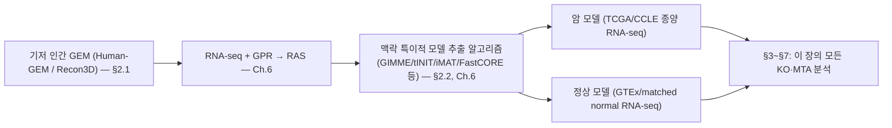

# 2. 질병 특이적 대사 모델 구축 (개관)

**왜 이 절이 필요할까요?** §1에서 우리는 "질병이 대사 재프로그래밍이다"라는 개념적 틀을 세웠습니다. 그런데 이 틀을 실제 계산으로 옮기려면 손에 잡히는 무언가 — 특정 환자, 특정 암종, 특정 세포주의 대사 네트워크를 구체적으로 나타내는 하나의 GEM — 가 있어야 합니다. 비유하자면 §1이 "환자마다 증상이 다르다"는 일반론을 배운 것이라면, 이 절은 "그 환자 개개인의 진료 기록(=맥락 특이적 모델)을 어디서, 어떻게 발급받는가"를 짚는 절차 안내에 해당합니다.

암 표적을 예측하려면 먼저 개별 환자·세포주의 오믹스 데이터를 반영한 **맥락 특이적 모델(context-specific model)**이 필요합니다. [Chapter 5](../chapter-5/README.md)에서 Human-GEM/Recon3D 같은 기저 인간 모델을 구축·검증하는 법을, [Chapter 6](../chapter-6/README.md)에서 RNA-seq 발현 데이터로 이를 맥락 특이화하는 법을 배웠습니다. 이 절은 그 산출물(암 모델·정상 모델)이 이 장의 입력으로 어떻게 이어지는지 개관하며, 세부 방법론은 해당 장에 위임합니다.

이 그림에서 이 장(Chapter 7)이 실제로 다루는 부분은 맨 오른쪽 상자(§3~§7)뿐이라는 점에 주목하십시오. 왼쪽 세 단계(기저 모델 → 발현 통합 → 맥락 특이적 모델 추출)는 이미 Chapter 5~6에서 다룬 재료이며, 이 장에서는 그 결과물을 완성된 입력으로 "받아서" 사용합니다.

## 2.1 기저 인간 GEM: Human-GEM, Recon3D

맥락 특이적 모델 구축의 출발점은 인간 대사 전체를 포괄하는 **기저 모델(template model)**입니다.

| 속성 | Human-GEM (Human1) | Recon3D |
|------|--------------------|---------|
| 유전자/ORF 수 | 3,625 | 3,288 |
| 반응 수 | 13,417 | reconstruction 13,543; flux-consistent model 10,600 |
| 대사산물 수 | 구획 포함 10,138(고유 4,164) | 고유 4,140; flux-consistent model 구획 포함 5,835 |
| 특징 | GitHub 기반 커뮤니티 큐레이션, RAVEN 형식 | 3D 단백질 구조 통합, VMH 데이터베이스 연계 |

두 모델의 상세 구조와 재구축 원칙은 [Chapter 3](../chapter-3/README.md)과 [Chapter 5](../chapter-5/README.md)에서 다룹니다.


❓ **흔한 오해:** "Human-GEM 반응이 13,417개나 되니, 이 모델 그대로 암세포에 FBA를 돌려도 되지 않을까?"

그렇지 않습니다. 기저 모델은 인체가 이론적으로 가질 수 있는 **모든** 대사 능력의 합집합이므로, 간세포에만 있는 요소 반응과 뉴런에만 있는 신경전달물질 합성 반응이 한 모델 안에 공존합니다. 이 상태로 최적화를 돌리면 실제로는 특정 세포가 절대 하지 않을 "편법적인" flux 경로(예: 서로 다른 조직 특이적 경로를 넘나드는 flux)가 최적해에 섞여 들어올 수 있습니다. 그래서 반드시 §2.2의 맥락 특이화 과정을 거쳐, "이 세포가 실제로 발현하고 있는 유전자에 대응하는 반응만 남긴" 모델로 좁혀야 합니다.


## 2.2 맥락 특이적 모델 재구축: Troppo 계열 알고리즘

RNA-seq 발현 데이터를 GPR(Gene-Protein-Reaction) 규칙을 통해 반응 활성 점수(Reaction Activity Score, RAS)로 변환하고, GIMME·tINIT·iMAT·FastCORE·SwiftCore·CORDA 등의 알고리즘(Troppo, RAVEN 프레임워크로 구현)으로 환자·세포주 특이적 모델을 추출하는 과정은 이 책에서 **[Chapter 6. Omics 데이터 통합](../chapter-6/README.md)**의 핵심 주제입니다. RNA-seq 전처리(counts/TPM/FPKM 정규화, 배치 효과 보정 등) 역시 Chapter 6을 참고하십시오.

이 장(Chapter 7)에서는 이렇게 구축된 암 모델·정상 모델, 그리고 질병/건강 쌍(source/target) 전사체를 **입력으로 주어진 것**으로 가정하고, 이를 활용한 표적 발굴 시뮬레이션(§3~§7)에 집중합니다. 다만 어떤 알고리즘으로 모델을 추출했는지가 이 장의 결과에 영향을 줄 수 있다는 점은 기억해 둘 필요가 있습니다 — §5.3에서 Vieira et al. (2022)의 비교 결과(tINIT vs. FastCORE vs. GIMME vs. iMAT의 필수성 예측 정확도 차이)를 다시 살펴봅니다.

## 2.3 암-정상 쌍별 모델 구축의 의의

항암 표적 예측의 핵심 전제는 **암 모델과 정상 모델을 쌍(pair)으로 구축**해야 한다는 것입니다. 종양 RNA-seq(TCGA, CCLE 등)로 암 모델을, 대응 정상 조직 RNA-seq(TCGA matched normal, GTEx 등)로 정상 모델을 각각 구축한 뒤, 동일한 유전자 KO를 두 모델에 모두 적용하여 비교하는 것이 §3.5의 선택성 필터의 기초가 됩니다.

| 데이터 소스 | 무엇을 담고 있나 | 이 장에서의 용도 |
|---|---|---|
| TCGA(The Cancer Genome Atlas) | 환자 종양 조직의 RNA-seq·임상 정보 | 암 모델 구축(§2.3), matched normal은 정상 모델 구축에도 사용 |
| CCLE(Cancer Cell Line Encyclopedia) | 수백 개 암 세포주의 RNA-seq·기타 오믹스 | 세포주 수준 암 모델 구축(§5.3의 CCLE 739개 세포주 분석) |
| GTEx(Genotype-Tissue Expression) | 건강한 기증자의 정상 조직 RNA-seq | 정상 모델 구축, 조직별 baseline 확보 |
| DepMap(Achilles) | 세포주별 CRISPR KO 필수성 스크린 | 예측 검증(§3.6) — 모델 구축용이 아니라 사후 비교용 |


❓ **잠깐, 생각해보기:** 정상 모델을 만들 때 "건강한 사람의 같은 조직" 대신 "환자 자신의 암 조직에서 조금 떨어진, 육안상 정상으로 보이는 조직(adjacent normal)"을 쓰는 경우도 많습니다. 이것이 더 나은 선택일까요, 아니면 위험할까요?

둘 다 일리가 있는 절충입니다. Adjacent normal은 같은 개인의 유전적 배경·나이·생활 습관을 공유하므로 개인차로 인한 잡음(confounding)이 적다는 장점이 있습니다. 그러나 종양 미세환경의 영향(염증, 인접 종양 세포의 곁분비 신호)으로 이미 어느 정도 대사가 "오염"되어 있을 가능성도 배제할 수 없습니다. 반대로 GTEx 같은 완전히 독립적인 건강한 기증자 데이터는 그런 오염은 없지만, 개인차라는 새로운 잡음이 추가됩니다. 어느 쪽을 쓸지는 연구 질문과 가용 데이터에 따라 결정할 문제이며, 이상적으로는 두 가지 정상 기준선을 모두 시도해 결과가 얼마나 민감하게 바뀌는지 확인하는 것이 바람직합니다.


---
